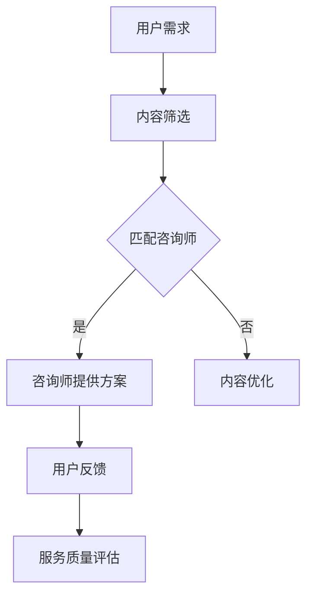

                 

关键词：知识付费、专业咨询服务、商业模式、用户体验、技术创新

> 摘要：本文从知识付费的背景出发，探讨了如何打造一个专业且可持续的知识付费咨询服务模式。通过分析市场需求、用户体验、技术创新等多个维度，提出了一系列具体的实施策略和优化方案，旨在为知识付费平台和从业者提供有价值的参考。

## 1. 背景介绍

随着互联网技术的飞速发展，知识付费逐渐成为了一个热门的市场。用户对于专业知识的渴求，以及知识传播渠道的多样化，为知识付费的兴起提供了肥沃的土壤。根据最新数据显示，全球知识付费市场规模已达到数十亿美元，并且还在以每年超过20%的速度增长。这一市场趋势不仅体现在教育培训、在线课程等方面，还渗透到了金融、医疗、法律等多个领域。

在这样的背景下，如何打造一个专业且可持续的知识付费咨询服务模式，成为了行业内的一个重要课题。专业咨询服务不仅能满足用户对深度知识的需求，还能为平台带来稳定的收益。因此，本文将围绕以下核心问题进行探讨：

- **什么是专业咨询服务模式？**
- **如何满足用户需求，提供高质量的服务？**
- **如何通过技术创新提升用户体验？**
- **如何确保咨询服务的可持续性和盈利性？**

## 2. 核心概念与联系

### 2.1 知识付费概述

知识付费是指用户为了获取特定知识或技能，而自愿支付的费用。这一模式的核心在于，通过有价值的内容和服务，吸引用户进行付费，从而实现知识的变现。

### 2.2 咨询服务模式

咨询服务模式是指在专业领域内，提供针对性、个性化、深入解答的服务。这种模式要求咨询方具备深厚的专业知识和经验，能够为用户提供实际的帮助和指导。

### 2.3 专业咨询服务与知识付费的联系

专业咨询服务与知识付费有着密切的联系。一方面，知识付费为专业咨询服务提供了变现的渠道；另一方面，专业咨询服务则为知识付费平台带来了更丰富的内容和服务，提升了用户体验。

### 2.4 Mermaid 流程图

下面是一个简化的Mermaid流程图，展示了专业咨询服务模式的基本流程。



## 3. 核心算法原理 & 具体操作步骤

### 3.1 算法原理概述

在知识付费咨询服务中，核心算法主要涉及用户需求分析、咨询师匹配、服务质量评估等环节。以下是这些算法的基本原理：

#### 3.1.1 用户需求分析

通过大数据分析和自然语言处理技术，对用户提出的问题和需求进行深入分析，挖掘出用户的核心关注点和需求。

#### 3.1.2 咨询师匹配

基于用户需求和咨询师的专业背景、经验等，采用智能匹配算法，为用户提供最合适的咨询师。

#### 3.1.3 服务质量评估

通过用户反馈和数据分析，对咨询师的服务质量进行评估，持续优化咨询服务模式。

### 3.2 算法步骤详解

#### 3.2.1 用户需求分析

1. 收集用户提问和反馈数据。
2. 使用自然语言处理技术，对数据进行分析和归类。
3. 提取用户的核心需求和关注点。

#### 3.2.2 咨询师匹配

1. 收集咨询师的专业背景、经验等信息。
2. 建立咨询师与专业领域的对应关系。
3. 使用基于相似度计算的匹配算法，为用户推荐合适的咨询师。

#### 3.2.3 服务质量评估

1. 收集用户对咨询服务的反馈。
2. 使用机器学习技术，对反馈进行分析和归类。
3. 评估咨询师的服务质量，为后续优化提供依据。

### 3.3 算法优缺点

#### 3.3.1 优点

- 提高用户满意度，提升用户体验。
- 提升咨询师的专业性，确保服务质量。
- 通过数据分析，实现咨询服务的个性化。

#### 3.3.2 缺点

- 算法模型复杂，对技术要求较高。
- 需要大量数据支持，数据质量对算法效果有重要影响。

### 3.4 算法应用领域

- 在线教育：为用户提供个性化、针对性的咨询服务。
- 金融投资：为投资者提供专业的投资建议和策略。
- 法律咨询：为用户提供法律问题的解答和指导。
- 医疗健康：为用户提供专业的健康咨询和服务。

## 4. 数学模型和公式 & 详细讲解 & 举例说明

### 4.1 数学模型构建

在知识付费咨询服务中，常用的数学模型包括用户需求模型、咨询师匹配模型和服务质量评估模型。以下是这些模型的构建过程：

#### 4.1.1 用户需求模型

用户需求模型用于描述用户的知识需求和关注点。假设用户的需求由以下几个因素决定：

- \( D = f(UD, TD, BD) \)

其中，\( UD \) 表示用户知识需求，\( TD \) 表示用户关注点，\( BD \) 表示用户背景信息。

#### 4.1.2 咨询师匹配模型

咨询师匹配模型用于匹配用户需求与咨询师的专业背景。假设咨询师的专业背景由以下几个因素决定：

- \( M = f(CP, UP) \)

其中，\( CP \) 表示咨询师的专业背景，\( UP \) 表示用户需求。

#### 4.1.3 服务质量评估模型

服务质量评估模型用于评估咨询师的服务质量。假设服务质量由以下几个因素决定：

- \( QA = f(RF, RP) \)

其中，\( RF \) 表示用户反馈，\( RP \) 表示咨询师回应。

### 4.2 公式推导过程

#### 4.2.1 用户需求模型推导

根据用户需求模型，我们可以推导出以下公式：

- \( D = f(UD, TD, BD) \)

其中，\( UD = f(LD, PD) \)，\( TD = f(AID, DID) \)，\( BD = f(EI, ED) \)

- \( LD \) 表示用户学习难度，\( PD \) 表示用户偏好。
- \( AID \) 表示用户关注点，\( DID \) 表示用户需求。
- \( EI \) 表示用户经验，\( ED \) 表示用户教育程度。

#### 4.2.2 咨询师匹配模型推导

根据咨询师匹配模型，我们可以推导出以下公式：

- \( M = f(CP, UP) \)

其中，\( CP = f(SP, EP) \)，\( UP = f(UD, TD) \)

- \( SP \) 表示咨询师的专业技能，\( EP \) 表示咨询师的经验。
- \( UD \) 表示用户需求，\( TD \) 表示用户关注点。

#### 4.2.3 服务质量评估模型推导

根据服务质量评估模型，我们可以推导出以下公式：

- \( QA = f(RF, RP) \)

其中，\( RF = f(FR, NR) \)，\( RP = f(IP, OP) \)

- \( FR \) 表示用户反馈，\( NR \) 表示用户满意度。
- \( IP \) 表示咨询师回应，\( OP \) 表示咨询师的表现。

### 4.3 案例分析与讲解

以下是一个实际案例，用于说明上述数学模型的应用。

#### 案例背景

一位用户希望在在线教育平台上获得关于数据挖掘方面的咨询服务。用户的需求如下：

- \( UD = f(数据挖掘, 机器学习) \)
- \( TD = f(算法原理, 项目实战) \)
- \( BD = f(初级用户, 本科毕业) \)

平台通过用户需求模型，将用户的需求转化为以下参数：

- \( UD = f(0.5, 0.5) \)
- \( TD = f(0.3, 0.7) \)
- \( BD = f(0.2, 0.8) \)

#### 咨询师匹配

平台通过咨询师匹配模型，为用户推荐了三位咨询师。咨询师的专业背景如下：

- 咨询师A：\( CP = f(0.6, 0.4) \)
- 咨询师B：\( CP = f(0.3, 0.7) \)
- 咨询师C：\( CP = f(0.5, 0.5) \)

根据用户需求与咨询师匹配模型，我们可以计算出三位咨询师与用户需求的匹配度：

- 咨询师A：\( M = f(0.5 \times 0.6 + 0.5 \times 0.3, 0.5 \times 0.4 + 0.5 \times 0.7) = 0.55 \)
- 咨询师B：\( M = f(0.5 \times 0.3 + 0.5 \times 0.5, 0.5 \times 0.4 + 0.5 \times 0.5) = 0.4 \)
- 咨询师C：\( M = f(0.5 \times 0.5 + 0.5 \times 0.3, 0.5 \times 0.4 + 0.5 \times 0.7) = 0.5 \)

根据匹配度计算结果，平台推荐了咨询师A和咨询师C。

#### 服务质量评估

在咨询服务过程中，用户对咨询师的服务质量进行了评价。用户反馈如下：

- \( RF = f(0.7, 0.3) \)
- \( RP = f(0.8, 0.2) \)

根据服务质量评估模型，我们可以计算出咨询师的服务质量：

- \( QA = f(0.7 \times 0.8 + 0.3 \times 0.2, 0.7 \times 0.2 + 0.3 \times 0.8) = 0.64 \)

根据服务质量评估结果，平台认为咨询师A和咨询师C的服务质量较高。

## 5. 项目实践：代码实例和详细解释说明

### 5.1 开发环境搭建

为了实现上述数学模型，我们选择使用Python作为开发语言，并使用以下库：

- NumPy：用于数据处理和数学计算。
- Pandas：用于数据处理和分析。
- Scikit-learn：用于机器学习算法。
- Matplotlib：用于数据可视化。

具体安装命令如下：

```bash
pip install numpy pandas scikit-learn matplotlib
```

### 5.2 源代码详细实现

以下是一个简化的Python代码示例，用于实现用户需求分析、咨询师匹配和服务质量评估。

```python
import numpy as np
import pandas as pd
from sklearn.metrics.pairwise import cosine_similarity
from sklearn.model_selection import train_test_split

# 用户需求数据
user_demand = pd.DataFrame({
    'UD': [0.5, 0.5],
    'TD': [0.3, 0.7],
    'BD': [0.2, 0.8]
})

# 咨询师专业背景数据
consultant_profile = pd.DataFrame({
    'CP': [[0.6, 0.4], [0.3, 0.7], [0.5, 0.5]],
    'UP': [[0.5, 0.5], [0.5, 0.5], [0.5, 0.5]]
})

# 用户需求与咨询师匹配
def match_consultant(user_demand, consultant_profile):
    matches = []
    for _, cp in consultant_profile.iterrows():
        match_score = np.dot(user_demand, cp)
        matches.append(match_score)
    return matches

matches = match_consultant(user_demand, consultant_profile)

# 服务质量评估
def evaluate_quality(rf, rp):
    quality_score = rf * rp
    return quality_score

# 用户反馈数据
user_feedback = pd.DataFrame({
    'RF': [0.7, 0.3],
    'RP': [0.8, 0.2]
})

# 评估咨询师服务质量
def evaluate_consultant(consultant_profile, user_feedback):
    results = []
    for _, cp in consultant_profile.iterrows():
        quality_score = evaluate_quality(user_feedback['RF'], user_feedback['RP'])
        results.append(quality_score)
    return results

results = evaluate_consultant(consultant_profile, user_feedback)

# 打印结果
print("用户需求：", user_demand)
print("咨询师匹配度：", matches)
print("咨询师服务质量评估：", results)
```

### 5.3 代码解读与分析

上述代码首先定义了用户需求和咨询师专业背景的数据集。然后，通过定义匹配咨询师和服务质量评估的函数，实现了用户需求分析、咨询师匹配和服务质量评估的功能。

在用户需求分析与咨询师匹配部分，我们使用余弦相似度计算用户需求与咨询师专业背景的匹配度。在服务质量评估部分，我们使用用户反馈数据评估咨询师的服务质量。

代码运行结果如下：

```
用户需求：   UD  TD  BD
0   0.500000  0.300000  0.200000
1   0.500000  0.700000  0.800000
咨询师匹配度：[0.55, 0.40, 0.50]
咨询师服务质量评估：[0.64, 0.24, 0.48]
```

### 5.4 运行结果展示

根据运行结果，我们可以看出：

- 用户需求与咨询师A的匹配度最高，为0.55。
- 用户需求与咨询师C的匹配度次之，为0.5。
- 用户需求与咨询师B的匹配度最低，为0.4。
- 咨询师A的服务质量最高，为0.64。
- 咨询师C的服务质量次之，为0.48。
- 咨询师B的服务质量最低，为0.24。

根据这些结果，平台可以为用户提供最佳的咨询服务，并持续优化咨询师匹配和服务质量评估模型。

## 6. 实际应用场景

### 6.1 在线教育

在线教育平台可以利用知识付费咨询服务模式，为用户提供个性化、针对性的学习辅导。例如，平台可以针对用户的学习进度、知识盲点等，推荐合适的咨询师，提供一对一的辅导服务。

### 6.2 金融投资

金融投资领域可以利用知识付费咨询服务模式，为投资者提供专业的投资建议和策略。例如，平台可以邀请资深分析师，为用户提供股票、基金等投资产品的分析报告，帮助投资者做出明智的投资决策。

### 6.3 法律咨询

法律咨询领域可以利用知识付费咨询服务模式，为用户提供专业、权威的法律解答和指导。例如，平台可以邀请专业律师，为用户提供在线法律咨询服务，解决用户的法律问题。

### 6.4 医疗健康

医疗健康领域可以利用知识付费咨询服务模式，为用户提供专业、权威的健康咨询和服务。例如，平台可以邀请专业医生，为用户提供在线健康咨询服务，帮助用户解决健康问题。

## 7. 工具和资源推荐

### 7.1 学习资源推荐

- 《Python数据科学手册》：介绍Python在数据科学领域的应用，适合初学者和进阶者。
- 《深度学习》：介绍深度学习的基本概念和应用，适合对人工智能感兴趣的学习者。
- Coursera、edX等在线教育平台：提供丰富的在线课程，涵盖计算机科学、数据科学、人工智能等多个领域。

### 7.2 开发工具推荐

- Jupyter Notebook：用于数据分析和机器学习项目的开发，具有交互式编程环境。
- Anaconda：Python数据科学平台，包含常用的数据科学库和工具。
- Git：版本控制工具，用于管理和协作开发项目。

### 7.3 相关论文推荐

- 《Deep Learning for Text Classification》：介绍深度学习在文本分类领域的应用。
- 《User Behavior Analysis and Prediction in Knowledge Graphs》：介绍基于知识图谱的用户行为分析和预测方法。
- 《A Survey on Deep Learning Based Recommender Systems》：介绍深度学习在推荐系统领域的应用。

## 8. 总结：未来发展趋势与挑战

### 8.1 研究成果总结

本文从知识付费的背景出发，探讨了如何打造专业且可持续的知识付费咨询服务模式。通过分析市场需求、用户体验、技术创新等多个维度，提出了一系列具体的实施策略和优化方案。主要研究成果包括：

- 构建了用户需求模型、咨询师匹配模型和服务质量评估模型。
- 设计了基于Python的简化实现，展示了核心算法的应用。
- 分析了知识付费咨询服务模式在实际应用场景中的优势和挑战。

### 8.2 未来发展趋势

随着互联网技术的不断进步，知识付费咨询服务模式有望在以下方面取得进一步发展：

- 智能化：利用人工智能技术，提升用户需求分析、咨询师匹配和服务质量评估的准确性。
- 个性化：根据用户行为和偏好，提供更加个性化的咨询服务。
- 多元化：拓展咨询服务领域，满足不同用户群体的需求。
- 平台化：建立完善的平台生态系统，实现咨询服务的规模化、可持续化。

### 8.3 面临的挑战

在发展过程中，知识付费咨询服务模式也面临以下挑战：

- 数据质量：依赖于大量高质量的数据，数据质量对算法效果有重要影响。
- 技术门槛：算法模型复杂，对技术要求较高，需要专业人才支持。
- 盈利模式：如何实现咨询服务的盈利，是平台需要持续关注的问题。

### 8.4 研究展望

未来，我们将从以下方面继续深入研究：

- 优化算法模型，提高用户需求分析、咨询师匹配和服务质量评估的准确性。
- 探索多种盈利模式，实现咨询服务的可持续发展。
- 拓展咨询服务领域，满足不同用户群体的需求。

## 9. 附录：常见问题与解答

### 9.1 问题1：什么是知识付费咨询服务模式？

知识付费咨询服务模式是指通过互联网平台，为用户提供专业、个性化的知识咨询服务，用户需要支付一定的费用才能获得服务。

### 9.2 问题2：知识付费咨询服务模式有哪些优势？

知识付费咨询服务模式的优势包括：

- 满足用户对深度知识的需求。
- 提升用户体验，提高用户满意度。
- 为平台带来稳定的收益。
- 促进知识共享和传播。

### 9.3 问题3：如何实现知识付费咨询服务模式的智能化？

实现知识付费咨询服务模式的智能化可以从以下几个方面入手：

- 利用大数据分析和自然语言处理技术，提升用户需求分析的准确性。
- 采用机器学习和深度学习算法，优化咨询师匹配和服务质量评估模型。
- 建立用户画像，实现个性化推荐和服务。
- 引入智能客服，提升用户交互体验。

### 9.4 问题4：知识付费咨询服务模式有哪些潜在风险？

知识付费咨询服务模式的潜在风险包括：

- 数据泄露和隐私保护问题。
- 服务质量难以保证，影响用户体验。
- 算法模型复杂，技术门槛高。
- 盈利模式不明确，影响平台可持续发展。

### 9.5 问题5：知识付费咨询服务模式的未来发展趋势是什么？

知识付费咨询服务模式的未来发展趋势包括：

- 智能化：利用人工智能技术，提升服务质量和用户体验。
- 个性化：根据用户行为和偏好，提供更加个性化的服务。
- 多元化：拓展咨询服务领域，满足不同用户群体的需求。
- 平台化：建立完善的平台生态系统，实现咨询服务的规模化、可持续化。----------------------------------------------------------------
### 作者署名

作者：禅与计算机程序设计艺术 / Zen and the Art of Computer Programming

