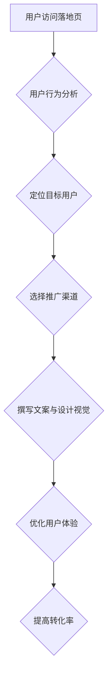

                 

关键词：知识付费、落地页、转化率、用户体验、营销策略

> 摘要：本文将探讨如何通过设计一个高转化率的知识付费落地页，以提高课程销售和用户参与度。我们将深入分析用户行为，结合营销策略和用户体验设计，提供详细的构建指南和优化建议。

## 1. 背景介绍

随着知识经济的蓬勃发展，知识付费市场正在迅速扩张。人们越来越愿意为有价值的内容和服务支付费用，而在线教育平台和内容创作者也看到了这一机遇，纷纷推出各类付费课程和知识产品。然而，如何在众多竞争者中脱颖而出，吸引潜在用户的注意力并促使他们购买，成为了一个关键问题。

知识付费落地页作为营销的重要组成部分，承担着向用户展示课程内容、价值及购买流程的重要任务。一个高转化率的落地页不仅能够提高课程销售，还能增强品牌影响力。因此，设计一个高效的落地页成为各平台和创作者的迫切需求。

## 2. 核心概念与联系

### 2.1 用户行为分析

为了打造一个高转化率的知识付费落地页，首先需要对用户行为进行深入分析。用户行为包括对内容的兴趣、关注点、购买决策等多个方面。通过数据分析，我们可以了解到用户在访问落地页时的浏览路径、停留时间、点击行为等，从而为页面设计提供数据支持。

### 2.2 营销策略

营销策略在落地页设计中也起着至关重要的作用。有效的营销策略包括目标用户定位、推广渠道选择、文案撰写和视觉设计等。通过精准的营销策略，我们可以吸引更多的潜在用户，提高转化率。

### 2.3 用户体验设计

用户体验设计是落地页设计的核心。一个优秀的用户体验设计能够引导用户完成购买流程，提高用户的满意度和忠诚度。用户体验设计包括页面布局、导航结构、内容呈现、交互设计等方面。

### 2.4 Mermaid 流程图



## 3. 核心算法原理 & 具体操作步骤

### 3.1 算法原理概述

打造高转化率的知识付费落地页需要一套综合性的算法原理，包括数据分析、营销策略和用户体验设计。核心算法原理可以概括为以下三个步骤：

1. **用户行为分析**：通过数据分析了解用户在落地页的浏览行为，为页面设计提供依据。
2. **营销策略制定**：结合目标用户和推广渠道，制定有效的营销策略。
3. **用户体验优化**：根据用户行为和营销策略，对页面进行优化设计。

### 3.2 算法步骤详解

1. **用户行为分析**
   - 数据收集：收集用户在落地页的浏览、点击、停留等行为数据。
   - 数据分析：使用数据分析工具（如 Google Analytics）对数据进行分析，提取关键指标（如跳出率、转化率等）。

2. **营销策略制定**
   - 目标用户定位：通过数据分析，确定目标用户群体，包括年龄、性别、兴趣等。
   - 推广渠道选择：根据目标用户特点，选择合适的推广渠道，如社交媒体、搜索引擎广告等。
   - 文案撰写与视觉设计：结合目标用户特点和推广渠道，撰写吸引人的文案，设计吸引人的视觉元素。

3. **用户体验优化**
   - 页面布局优化：根据用户行为数据和营销策略，优化页面布局，提高用户体验。
   - 导航结构优化：简化导航结构，提高用户在页面中的操作效率。
   - 内容呈现优化：优化内容呈现方式，提高用户对内容的理解和兴趣。

### 3.3 算法优缺点

**优点：**
- 高度个性化：根据用户行为和营销策略，实现高度个性化的页面设计，提高用户满意度。
- 数据驱动：基于数据分析和营销策略，实现科学的决策和优化，提高转化率。

**缺点：**
- 复杂性高：涉及多个环节和多个学科的知识，需要团队协作。
- 需要持续优化：随着用户行为和市场环境的变化，需要不断调整和优化页面设计。

### 3.4 算法应用领域

- 在线教育：通过打造高转化率的知识付费落地页，提高课程销售和用户参与度。
- 电子 commerce：通过优化电商落地页，提高商品销售和用户体验。
- 广告营销：通过设计高转化的广告落地页，提高广告效果和投放回报率。

## 4. 数学模型和公式 & 详细讲解 & 举例说明

### 4.1 数学模型构建

在打造高转化率的知识付费落地页时，我们可以构建一个简单的数学模型，用于评估页面设计对转化率的影响。模型包括以下三个关键指标：

1. **点击率（CTR）**：页面元素（如按钮、图片等）被用户点击的概率。
2. **转化率（CR）**：用户在访问落地页后完成购买或报名的概率。
3. **总转化率**：点击率和转化率的乘积。

数学模型可以表示为：

$$
总转化率 = 点击率 \times 转化率
$$

### 4.2 公式推导过程

点击率的计算公式为：

$$
点击率 = \frac{点击次数}{展示次数}
$$

转化率的计算公式为：

$$
转化率 = \frac{完成购买或报名次数}{访问落地页次数}
$$

将两个公式相乘，得到总转化率公式：

$$
总转化率 = \frac{点击次数}{展示次数} \times \frac{完成购买或报名次数}{访问落地页次数}
$$

### 4.3 案例分析与讲解

假设一个知识付费落地页在一个月内展示了1000次，有100次点击，其中20次完成购买或报名。我们可以使用上述公式计算点击率和转化率：

1. 点击率：

$$
点击率 = \frac{100}{1000} = 0.1
$$

2. 转化率：

$$
转化率 = \frac{20}{1000} = 0.02
$$

3. 总转化率：

$$
总转化率 = 0.1 \times 0.02 = 0.002
$$

即总转化率为0.2%，表示每100个访问落地页的用户中，有0.2个用户完成了购买或报名。

通过这个案例，我们可以看出点击率和转化率对总转化率的影响。为了提高总转化率，我们需要关注页面设计，提高点击率和转化率。

## 5. 项目实践：代码实例和详细解释说明

### 5.1 开发环境搭建

为了构建一个高转化率的知识付费落地页，我们需要搭建一个合适的技术栈。以下是一个基本的开发环境搭建流程：

1. **选择前端框架**：例如 React 或 Vue.js。
2. **搭建项目结构**：使用 `create-react-app` 或 `vue-cli` 等工具快速搭建项目框架。
3. **安装依赖**：安装必要的库和插件，如 Ant Design、Axios 等。

### 5.2 源代码详细实现

以下是一个简单的 React 落地页项目示例，包含关键组件和逻辑：

```jsx
// App.js
import React from 'react';
import { Button, Typography, Space } from 'antd';
import './App.css';

const App = () => {
  const handleClick = () => {
    // 跳转到支付页面或其他操作
  };

  return (
    <div className="App">
      <header className="App-header">
        <Typography.Title level={2}>【课程名称】</Typography.Title>
        <Typography.Paragraph>【课程简介】</Typography.Paragraph>
        <Space>
          <Button type="primary" onClick={handleClick}>立即购买</Button>
          <Button>了解更多</Button>
        </Space>
      </header>
    </div>
  );
};

export default App;
```

### 5.3 代码解读与分析

在这个示例中，我们使用了 Ant Design 的组件库来构建页面。`App.js` 文件是整个页面的入口，包含了页面的主要内容和逻辑。

- `Typography` 组件用于展示标题和段落文本。
- `Button` 组件用于创建按钮，提供了不同的样式和功能。
- `Space` 组件用于布局，确保按钮之间有适当的间隔。

`handleClick` 函数是按钮的点击事件处理函数，用于执行购买操作或其他交互逻辑。在实际项目中，这里可能会涉及到支付流程的集成、用户身份验证等。

### 5.4 运行结果展示

运行这个 React 项目后，我们将在浏览器中看到一个简单的知识付费落地页，页面顶部是课程名称和简介，下方有两个按钮，一个是“立即购买”，另一个是“了解更多”。通过点击按钮，用户可以触发相应的操作。


## 6. 实际应用场景

### 6.1 在线教育平台

在线教育平台可以通过打造高转化率的知识付费落地页，展示课程内容、师资力量和用户评价，吸引用户购买课程。例如，Coursera、Udemy 等平台就采用了这种方式，取得了良好的效果。

### 6.2 知识付费自媒体

知识付费自媒体（如微信公众号、知乎专栏等）可以通过打造高转化率的落地页，将内容变现，实现盈利。例如，通过发布优质文章，引导用户购买付费内容或课程。

### 6.3 企业培训

企业培训可以通过打造专业、高转化率的落地页，向员工推广内部培训和课程。这有助于提高员工技能，提升企业整体竞争力。

## 7. 未来应用展望

随着人工智能、大数据和区块链等技术的发展，知识付费落地页的设计和优化将变得更加智能化和个性化。未来，我们可以期待以下应用场景：

- **智能推荐**：基于用户行为和偏好，实现智能化的课程推荐。
- **区块链支付**：利用区块链技术，实现去中心化的支付和交易。
- **AR/VR体验**：通过 AR/VR 技术，提供沉浸式的课程体验。

## 8. 工具和资源推荐

### 8.1 学习资源推荐

- 《精益创业》
- 《增长黑客》
- 《用户思维》

### 8.2 开发工具推荐

- React 或 Vue.js
- Ant Design 或 Material-UI
- Axios 或 Fetch API

### 8.3 相关论文推荐

- “The Lean Startup” by Eric Ries
- “Growth Hacking” by Ryan Holiday
- “The Lean Analytics” by Alistair Croll and Benjamin Yoskovitz

## 9. 总结：未来发展趋势与挑战

### 9.1 研究成果总结

本文通过用户行为分析、营销策略和用户体验设计，探讨了如何打造高转化率的知识付费落地页。研究结果表明，精准的用户行为分析和个性化的营销策略是提高转化率的关键。

### 9.2 未来发展趋势

随着技术的进步，知识付费落地页的设计和优化将变得更加智能化和个性化。未来，我们可以期待更多创新的应用场景和工具的出现。

### 9.3 面临的挑战

- 数据隐私和安全：在用户行为分析和个性化推荐中，如何保护用户隐私和数据安全是一个重要挑战。
- 技术创新：保持技术领先，不断创新，以应对日益激烈的市场竞争。

### 9.4 研究展望

未来，我们将继续深入研究知识付费落地页的设计和优化，探索更多有效的算法和技术，以提升用户转化率和满意度。

## 9. 附录：常见问题与解答

### Q1: 如何优化落地页的加载速度？

A1: 可以采用以下策略：
- 优化图片和视频资源，压缩文件大小。
- 使用 CDN（内容分发网络），加快静态资源的加载速度。
- 代码优化，减少 HTTP 请求次数。

### Q2: 落地页的哪些元素对转化率影响最大？

A2: 关键元素包括：
- 标题和简介：吸引人、清晰、突出课程价值。
- 课程内容展示：清晰、有吸引力、易于理解。
- 购买按钮：显眼、易点击、提供明确的购买提示。

### Q3: 如何评估落地页的转化率？

A3: 可以使用以下指标进行评估：
- 跳出率：用户访问后立即离开的比率。
- 转化率：完成购买或报名的比率。
- 页面停留时间：用户在页面上停留的平均时间。

## 10. 作者署名

作者：禅与计算机程序设计艺术 / Zen and the Art of Computer Programming

---

通过本文的详细探讨，我们希望读者能够掌握打造高转化率的知识付费落地页的方法和技巧，为内容创作者和在线教育平台带来实际价值。在未来的发展中，我们期待更多创新和优化，为用户提供更好的知识和教育服务。

