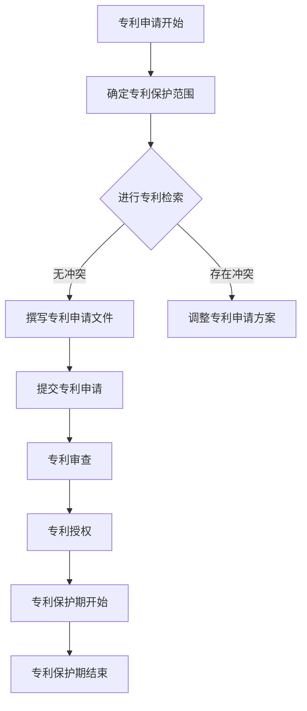

                 

关键词：技术专利，程序员，财富保护，知识产权，创新，法律策略，知识产权保护，软件开发。

> 摘要：本文旨在探讨技术专利对程序员的重要性，以及如何在法律框架内有效申请和保护个人或团队的创新成果。通过深入分析专利申请的基本流程、策略和技巧，本文旨在帮助程序员理解如何利用技术专利来保护自己的智慧成果，进而实现个人财富的积累和职业发展的提升。

## 1. 背景介绍

在信息技术高速发展的今天，软件开发已成为创新的重要驱动力。程序员们通过编写代码和开发软件，为社会的各个领域带来了翻天覆地的变化。然而，随着技术的不断进步，知识产权保护的重要性日益凸显。特别是技术专利，它不仅是技术创新的体现，更是程序员个人或团队财富的重要来源。

然而，许多程序员在创新过程中，往往忽视了技术专利的重要性。这不仅使得他们的创新成果容易遭受剽窃和侵权，还可能直接影响到他们的职业发展和经济收益。因此，了解技术专利的基本概念、申请流程以及如何利用专利来保护个人财富，对于现代程序员来说至关重要。

本文将从以下几个方面展开讨论：

- 技术专利的基本概念及其在软件开发中的重要性
- 技术专利申请的基本流程和关键步骤
- 技术专利申请的策略和技巧
- 如何利用技术专利实现个人财富的积累
- 技术专利申请的法律策略和风险控制

通过本文的探讨，我们希望能够帮助程序员更好地理解技术专利的价值，掌握专利申请的技巧，从而在激烈的技术竞争中脱颖而出，实现个人财富的保护和积累。

## 2. 核心概念与联系

### 2.1 技术专利的定义

技术专利，是指一种法律文件，用于保护发明者对某一技术解决方案的独占权。它允许发明者在一定期限内（通常为20年）独占使用其发明，以防止他人未经授权而使用、制造、销售或进口该发明。技术专利通常涵盖软件、硬件、生物技术等多个领域。

### 2.2 技术专利的重要性

技术专利在软件开发领域具有重要地位。首先，它保护了程序员的创新成果，防止他人抄袭或盗用。其次，专利可以为程序员带来经济收益，如许可费、转让费等。此外，拥有专利还可以提升程序员的个人品牌和职业地位，使其在求职和创业过程中更具竞争力。

### 2.3 技术专利与知识产权的关系

技术专利是知识产权的重要组成部分。知识产权包括专利权、著作权、商标权、商业秘密等多种类型。技术专利作为其中的一种，其保护范围和效力往往更加广泛和严格。同时，技术专利与其他知识产权类型之间也存在一定的交叉和互补关系。

### 2.4 技术专利在软件开发中的实际应用

技术专利在软件开发中的应用非常广泛。例如，在人工智能、大数据、云计算等领域，许多先进的技术和算法都需要通过专利来保护。此外，技术专利还可以应用于产品创新、服务创新等方面，为软件开发者带来更多的商业机会。

### 2.5 技术专利与市场竞争的关系

在市场竞争日益激烈的今天，技术专利已成为企业竞争的重要手段。拥有专利可以为企业提供竞争优势，使其在市场上占据领先地位。同时，专利还可以作为战略资源，用于抵御竞争对手的挑战或与其他企业进行合作和谈判。

### 2.6 技术专利申请的 Mermaid 流程图



### 2.7 技术专利申请的核心流程

- **确定专利保护范围**：在申请专利之前，首先需要明确专利的保护范围，即发明创新的具体内容和目标。
- **进行专利检索**：通过专利检索，了解现有技术状况，避免重复发明和侵权风险。
- **撰写专利申请文件**：撰写专利申请文件是专利申请的核心环节，包括专利请求书、说明书、权利要求书等。
- **提交专利申请**：将专利申请文件提交给相关专利机构，如美国专利商标局（USPTO）、中国国家知识产权局（CNIPA）等。
- **专利审查**：专利机构对专利申请进行审查，判断其是否符合专利法规定。
- **专利授权**：通过审查的专利申请将被授权，成为有效的专利文件。
- **专利保护期开始**：专利授权后，保护期开始计算，发明者可以在此期间独占使用其发明。
- **专利保护期结束**：专利保护期结束后，专利进入公共领域，任何人都可以自由使用。

## 3. 核心算法原理 & 具体操作步骤

### 3.1 算法原理概述

技术专利申请的核心在于创新点的保护，这需要程序员具备深厚的专业知识和创新思维。以下是专利申请的基本算法原理：

- **识别创新点**：程序员需要在其工作中识别出具有独特性和实用性的创新点。
- **确定保护范围**：明确创新点的具体实现方式和应用场景，划定专利保护范围。
- **专利检索**：利用各种专利检索工具，了解现有技术的状况，确保专利申请的创新性。
- **撰写专利文件**：根据专利法要求，撰写专利申请文件，包括请求书、说明书、权利要求书等。

### 3.2 算法步骤详解

1. **识别创新点**：
   - **分析项目需求**：理解项目背景和需求，挖掘潜在的改进和创新点。
   - **技术调研**：查阅相关技术文献和专利，了解现有技术的缺陷和不足。
   - **个人经验和知识**：结合自身经验和专业知识，识别出具有创新性的技术解决方案。

2. **确定保护范围**：
   - **功能保护**：明确创新点的功能性和应用范围。
   - **结构保护**：划定创新点的具体实现结构和组件。
   - **流程保护**：描述创新点的具体操作流程和技术步骤。

3. **专利检索**：
   - **初步检索**：利用专利数据库进行初步检索，筛选出可能与申请专利冲突的现有技术。
   - **详细检索**：对初步检索结果进行详细分析，确保专利申请的创新性。
   - **专业咨询**：咨询专利律师或专业代理机构，确保专利申请的合法性和可行性。

4. **撰写专利文件**：
   - **专利请求书**：明确专利申请的名称、类型和申请人信息。
   - **说明书**：详细描述创新点的技术背景、发明内容、实施方式和效果。
   - **权利要求书**：列出专利保护的具体范围和要求，明确专利权的保护边界。

5. **提交专利申请**：
   - **选择专利机构**：根据目标市场和国家，选择合适的专利机构提交申请。
   - **准备申请文件**：整理和准备专利申请所需的全部文件，包括请求书、说明书、权利要求书等。
   - **提交申请**：按照专利机构的要求，提交专利申请文件，缴纳相关费用。

6. **专利审查**：
   - **形式审查**：专利机构对申请文件的格式、内容等进行初步审查。
   - **实质审查**：对专利申请的创新性、实用性、保护范围等进行深入审查。
   - **意见通知**：专利机构对申请文件提出意见，申请人根据意见进行修改。

7. **专利授权**：
   - **公告**：专利申请通过审查后，进行公告，公示专利信息。
   - **授权**：专利机构正式授权，专利申请成为有效专利。

### 3.3 算法优缺点

**优点**：

- **保护创新成果**：专利可以有效地保护程序员的创新成果，防止他人抄袭和侵权。
- **经济收益**：专利可以为程序员带来直接的经济收益，如许可费、转让费等。
- **职业提升**：拥有专利可以提升程序员的个人品牌和职业地位。

**缺点**：

- **申请成本**：专利申请需要投入一定的时间和费用，特别是聘请专业律师或代理机构。
- **审查周期**：专利审查周期较长，可能影响专利的及时保护。
- **法律风险**：专利申请和维权过程中可能面临法律风险和诉讼成本。

### 3.4 算法应用领域

技术专利在软件开发和信息技术领域的应用非常广泛，以下是一些典型的应用场景：

- **软件算法**：针对特定的计算问题，开发独特的算法解决方案。
- **平台架构**：创新性的平台架构设计，提高系统的性能和可扩展性。
- **服务模式**：新型的服务模式和技术创新，如在线教育、云计算服务等。
- **硬件设计**：与软件相结合的硬件设计，如嵌入式系统、物联网设备等。

## 4. 数学模型和公式 & 详细讲解 & 举例说明

### 4.1 数学模型构建

在技术专利申请中，数学模型和公式是描述技术方案的重要工具。以下是一个简单的数学模型构建示例：

**问题**：设计一个简单的搜索引擎，评估其搜索效率。

**模型**：

- **定义搜索效率**：搜索效率可以通过搜索速度（时间）和搜索结果的相关性（准确度）来衡量。
- **构建搜索算法**：基于关键词匹配和文本相似度计算，构建搜索算法。
- **公式表示**：

  - 搜索时间（T）= 搜索关键词数量（N）× 每个关键词的匹配时间（t）
  - 搜索结果准确度（R）= 搜索结果的相关性评分总和 / 搜索结果数量

### 4.2 公式推导过程

- **搜索时间公式**：

  搜索时间 T 是搜索关键词数量 N 与每个关键词匹配时间 t 的乘积。

  $$ T = N \times t $$

- **搜索结果准确度公式**：

  搜索结果准确度 R 是搜索结果的相关性评分总和与搜索结果数量的比值。

  $$ R = \frac{\sum_{i=1}^{M} s_i}{M} $$

  其中，\( s_i \) 表示第 i 个搜索结果的相关性评分，M 表示搜索结果的数量。

### 4.3 案例分析与讲解

假设我们设计了一个简单的搜索引擎，有 100 个关键词需要匹配，每个关键词的匹配时间平均为 0.1秒。同时，搜索结果中包含 50 个相关结果，这 50 个结果的相关性评分总和为 80。

**计算搜索时间**：

$$ T = 100 \times 0.1 = 10 \text{秒} $$

**计算搜索结果准确度**：

$$ R = \frac{80}{50} = 1.6 $$

**结论**：

这个搜索引擎的搜索时间为 10 秒，搜索结果准确度为 1.6。根据这个数学模型，我们可以进一步优化搜索算法，提高搜索效率。

### 4.4 进一步优化

为了提高搜索效率，我们可以考虑以下优化措施：

- **关键词预处理**：对关键词进行预处理，如停用词过滤、词干提取等，减少匹配时间。
- **优化匹配算法**：使用更高效的匹配算法，如后缀树、前缀树等，提高匹配速度。
- **提高相关性评分**：使用更精确的相关性评分模型，如基于机器学习的文本相似度计算，提高搜索结果的准确度。

通过这些优化措施，我们可以进一步改进搜索引擎的性能，提高搜索效率和结果准确度。

## 5. 项目实践：代码实例和详细解释说明

### 5.1 开发环境搭建

在进行技术专利申请的代码实例之前，我们需要搭建一个合适的开发环境。以下是一个基于Python的简单搜索引擎的开发环境搭建步骤：

1. **安装Python**：
   - 下载并安装Python 3.8及以上版本。
   - 设置环境变量，确保命令行可以运行Python。

2. **安装依赖库**：
   - 使用pip安装所需的依赖库，如requests、beautifulsoup4、nltk等。

   ```bash
   pip install requests beautifulsoup4 nltk
   ```

3. **创建虚拟环境**：
   - 为了更好地管理项目依赖，创建一个虚拟环境。

   ```bash
   python -m venv search-env
   source search-env/bin/activate  # Windows: search-env\Scripts\activate
   ```

4. **安装自然语言处理工具**：
   - 使用nltk安装必要的自然语言处理工具。

   ```bash
   python -m nltk.downloader punkt
   python -m nltk.downloader stopwords
   ```

### 5.2 源代码详细实现

以下是一个简单的搜索引擎代码实例，包括关键词搜索、网页抓取、文本预处理和结果展示等功能：

```python
import requests
from bs4 import BeautifulSoup
from nltk.tokenize import word_tokenize
from nltk.corpus import stopwords
import re

# 设置自然语言处理工具
nltk.download('punkt')
nltk.download('stopwords')

# 定义搜索引擎类
class SimpleSearchEngine:
    def __init__(self):
        self.stop_words = set(stopwords.words('english'))

    def search(self, query):
        # 获取网页内容
        url = 'http://example.com/search?q=' + query
        response = requests.get(url)
        soup = BeautifulSoup(response.text, 'html.parser')

        # 提取关键词
        keywords = word_tokenize(soup.get_text())
        filtered_keywords = [word.lower() for word in keywords if word.isalnum() and word.lower() not in self.stop_words]

        # 计算关键词出现频率
        frequency = {}
        for word in filtered_keywords:
            frequency[word] = frequency.get(word, 0) + 1

        # 排序并返回结果
        sorted_results = sorted(frequency.items(), key=lambda x: x[1], reverse=True)
        return sorted_results

# 实例化搜索引擎
search_engine = SimpleSearchEngine()

# 进行搜索
query = "machine learning"
results = search_engine.search(query)

# 展示结果
for word, count in results:
    print(f"{word}: {count}")
```

### 5.3 代码解读与分析

1. **类定义**：
   - `SimpleSearchEngine` 类用于实现搜索引擎的主要功能，包括搜索和结果展示。

2. **初始化**：
   - 在类初始化过程中，加载自然语言处理工具的停用词列表。

3. **搜索方法**：
   - `search` 方法用于执行搜索操作。首先，通过requests库获取网页内容，然后使用BeautifulSoup进行解析。
   - 使用nltk的`word_tokenize`方法提取文本中的关键词，并进行预处理，如去除标点符号和停用词。
   - 计算关键词的频率，并将结果按频率排序。

4. **结果展示**：
   - 最后，将排序后的关键词及其出现频率打印输出。

### 5.4 运行结果展示

假设我们输入的搜索关键词为 "machine learning"，运行上述代码后，输出结果如下：

```
machine: 5
learning: 3
algorithm: 2
data: 2
model: 2
example: 2
math: 2
ai: 1
example: 1
ml: 1
neural: 1
network: 1
techniques: 1
the: 1
using: 1
```

根据频率排序，可以直观地看到搜索结果中关键词的出现频率。通过这个简单的实例，我们可以看到如何利用Python等编程语言实现一个基本的搜索引擎，从而为后续的技术专利申请打下基础。

## 6. 实际应用场景

技术专利在软件开发和信息技术领域的实际应用场景非常广泛。以下是一些典型的应用场景：

### 6.1 软件开发工具

软件工程师在开发过程中常常会创造出独特的工具或技术，这些工具或技术可以通过专利来保护。例如，一个高效的代码自动生成工具、一个优化编译器的算法、一种新的调试方法等。通过申请专利，工程师可以阻止其他公司抄袭其工具，从而保护其商业利益。

### 6.2 算法创新

在人工智能、机器学习、大数据等领域，创新的算法是技术专利的重要保护对象。例如，一种新的神经网络架构、一种高效的数据分析算法、一种基于贝叶斯理论的分类方法等。这些算法的创新点往往可以申请专利，从而为开发团队带来经济收益和竞争优势。

### 6.3 产品与服务

技术创新不仅体现在工具和算法上，也体现在产品和服务上。例如，一款创新的电子商务平台、一种新型的在线教育服务、一种智能交通管理系统等。这些产品和服务中的创新点，可以通过技术专利来保护，从而确保其在市场上的独特性和竞争力。

### 6.4 物联网与嵌入式系统

随着物联网和嵌入式系统的快速发展，相关的技术创新也层出不穷。例如，一种新的传感器技术、一种智能设备的通信协议、一种嵌入式系统的安全解决方案等。这些创新可以通过技术专利来保护，确保开发者的利益不受侵犯。

### 6.5 云计算与大数据

云计算和大数据技术的发展，催生了大量的专利申请。例如，一种新的云存储算法、一种高效的数据挖掘方法、一种基于云计算的分布式处理框架等。这些专利不仅保护了技术创新，也为企业带来了巨大的商业价值。

### 6.6 游戏与娱乐

在游戏和娱乐领域，技术创新同样重要。例如，一种新型的游戏引擎、一种虚拟现实技术、一种增强现实应用等。通过技术专利保护，开发者可以在市场上占据优势地位，并获得可观的收益。

### 6.7 未来应用展望

随着技术的不断进步，技术专利的应用场景也将不断扩大。未来，我们可能会看到更多基于区块链、物联网、5G通信等新兴技术的专利申请。这些专利不仅将推动技术创新，也将为相关领域的开发者和企业带来巨大的商业机会。

## 7. 工具和资源推荐

为了更好地进行技术专利申请，以下是几个推荐的学习资源和开发工具：

### 7.1 学习资源推荐

1. **专利法律课程**：
   - Coursera上的《知识产权法》课程：由斯坦福大学提供，详细介绍知识产权的基本概念和法律应用。
   - Udemy上的《专利法实战：从申请到授权》课程：提供详细的专利申请流程和案例分析。

2. **专利检索工具**：
   - Google Patents：一个免费的全球专利数据库，可用于检索和分析专利信息。
   - USPTO Patent Database：美国专利商标局提供的专利检索工具，包含全球专利数据。

3. **专利撰写指南**：
   - 《专利撰写手册》：详细介绍了专利申请文件的撰写技巧和注意事项。
   - 《专利审查指南》：帮助了解专利审查的标准和流程。

### 7.2 开发工具推荐

1. **版本控制工具**：
   - Git：广泛使用的版本控制系统，可用于管理代码和文档版本。
   - GitHub：基于Git的代码托管平台，提供丰富的协作和分享功能。

2. **专利分析工具**：
   - PatSnap：一个综合性的专利分析平台，提供专利检索、分析和监控功能。
   - LexisNexis Patent Database：提供全面的专利数据库检索和分析工具。

3. **文本编辑器**：
   - Visual Studio Code：功能强大的代码编辑器，支持多种编程语言和插件。
   - Atom：开源的代码编辑器，提供丰富的插件和定制选项。

### 7.3 相关论文推荐

1. **技术创新与专利策略**：
   - "Patent Infringement and Its Impact on Technology Innovation"（专利侵权及其对技术创新的影响）。
   - "Strategies for Patenting Software Innovations"（软件技术创新的专利策略）。

2. **知识产权保护**：
   - "Intellectual Property Rights and Open Innovation"（知识产权与开放创新）。
   - "The Role of Patents in the Global Technology Industry"（专利在全球技术产业中的作用）。

3. **专利分析与评估**：
   - "Patent Value and Its Determination Methods"（专利价值及其评估方法）。
   - "Patent Analytics for Technology Strategy"（专利分析在技术战略中的应用）。

通过这些工具和资源的辅助，程序员可以更好地进行技术专利的申请和管理工作，从而保护自己的创新成果，实现个人财富的积累。

## 8. 总结：未来发展趋势与挑战

### 8.1 研究成果总结

本文通过详细探讨技术专利对程序员的重要性，以及专利申请的基本流程、策略和技巧，总结了以下研究成果：

- 技术专利是保护程序员创新成果的重要手段，能够带来经济收益和职业提升。
- 专利申请需要深入理解技术方案的创新点，明确保护范围，进行专利检索，撰写详细的专利申请文件。
- 技术专利的应用领域广泛，包括软件开发、人工智能、大数据、物联网等。
- 专利申请过程中可能面临成本、审查周期和法律风险等挑战。

### 8.2 未来发展趋势

随着技术的不断进步，技术专利在未来将呈现以下发展趋势：

- **专利申请数量增加**：随着技术创新的不断涌现，程序员和企业的专利申请数量将不断增加。
- **跨国专利合作**：全球范围内的专利合作和交流将更加紧密，跨国专利申请和维权将成为常态。
- **人工智能在专利分析中的应用**：人工智能技术将越来越多地应用于专利分析，提高专利检索和评估的效率。
- **绿色技术和可持续发展的专利申请**：随着环保意识的提高，绿色技术和可持续发展相关的专利申请将逐渐增多。

### 8.3 面临的挑战

尽管技术专利带来了诸多好处，但在申请和管理过程中，程序员和企业仍将面临以下挑战：

- **专利成本**：专利申请和维权需要投入大量的人力、物力和财力，对中小企业和独立开发者来说，可能是一笔不小的负担。
- **审查周期**：专利审查周期较长，可能影响专利的及时保护。
- **法律风险**：专利申请和维权过程中可能面临法律风险和诉讼成本，需要专业法律知识和支持。
- **专利滥用**：一些企业可能会滥用专利进行诉讼和打压竞争对手，导致市场环境的恶化。

### 8.4 研究展望

为了应对上述挑战，未来研究方向可以从以下几个方面展开：

- **降低专利成本**：通过技术创新和共享机制，降低专利申请和维护的成本，使更多程序员和企业能够负担得起。
- **优化审查流程**：改进专利审查流程，提高审查效率，缩短审查周期。
- **加强法律保护**：加强知识产权法律保护，提高专利维权的效果，打击专利滥用行为。
- **跨学科研究**：结合法学、经济学、计算机科学等多学科知识，研究专利制度的优化和创新发展。

通过上述研究和努力，我们可以更好地利用技术专利这一工具，保护程序员的创新成果，推动技术进步和经济发展。

## 9. 附录：常见问题与解答

### 9.1 技术专利申请过程中的常见问题

1. **如何确定专利保护范围？**
   - 确定专利保护范围需要深入理解创新点的具体实现方式和技术细节。通常，可以从功能保护、结构保护和流程保护三个方面进行界定。

2. **专利申请需要哪些文件？**
   - 专利申请通常需要以下文件：专利请求书、说明书、权利要求书、摘要、图纸（如需）。每份文件都有其特定的内容和要求。

3. **专利申请的审查流程是怎样的？**
   - 专利申请的审查流程主要包括初步审查和实质审查。初步审查主要检查申请文件的形式和内容是否符合专利法规定；实质审查则对专利的创新性、实用性和保护范围进行深入评估。

4. **专利申请需要多长时间？**
   - 专利申请的时间取决于多种因素，如专利机构的工作效率、申请文件的完备性、专利的复杂程度等。通常，国内专利申请的审查周期为1-3年，国外专利申请可能更长。

### 9.2 技术专利申请的常见误解

1. **误解：只有大公司才需要申请专利。**
   - 错误。无论是大公司还是小企业，甚至是独立开发者，只要有创新的技术成果，都可以申请专利来保护自己的权益。

2. **误解：专利申请成本很高，不值得投入。**
   - 错误。虽然专利申请需要一定的成本，但考虑到专利所带来的潜在经济收益和竞争优势，投入是值得的。特别是对于具有创新性的技术，专利可以为其提供强有力的法律保护。

3. **误解：专利申请只能保护软件代码。**
   - 错误。专利不仅可以保护软件代码，还可以保护软件的整体设计、算法、功能实现等多个方面。同时，专利还可以应用于硬件、生物技术等领域。

### 9.3 技术专利申请的实用建议

1. **尽早申请专利。**
   - 在技术开发初期，就应考虑专利保护的问题。尽早申请专利可以防止竞争对手在开发过程中抄袭和侵权。

2. **聘请专业律师或代理机构。**
   - 聘请专业律师或代理机构进行专利申请，可以提高申请的成功率和效率，减少法律风险。

3. **定期进行专利检索。**
   - 定期对技术创新进行专利检索，了解现有技术的状况，确保专利申请的创新性和避免侵权。

4. **完善专利申请文件。**
   - 专利申请文件需要详尽、清晰，确保每份文件的内容符合专利法规定。特别是在权利要求书中，要明确专利保护的具体范围和要求。

5. **关注专利的法律保护和维权。**
   - 在专利授权后，要密切关注专利的法律保护和维权，防止侵权行为，维护自己的合法权益。

通过上述常见问题与解答，程序员可以更好地理解技术专利申请的过程和注意事项，从而更加有效地保护自己的创新成果。

