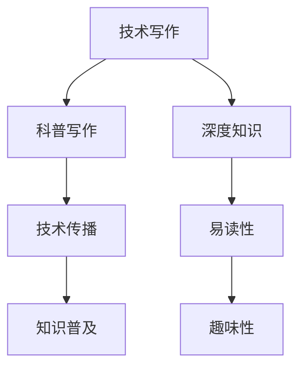

                 

关键词：技术写作，博客，科普，畅销书，写作技巧

> 摘要：本文将探讨如何从技术博客作者转型为畅销科普作家。我们将分析技术写作的挑战和机遇，提供实用的写作技巧，并分享成功案例，帮助读者实现这一转变。

## 1. 背景介绍

在信息技术飞速发展的今天，技术写作已经成为一项至关重要的技能。技术博客不仅是专业人士交流经验、分享知识的平台，也是技术传播和教育的有力工具。然而，很多技术博客作者都渴望能够更进一步，将自己的知识传播给更广泛的读者群体，甚至成为畅销科普作家。

成为畅销科普作家不仅需要深入的技术知识和写作能力，还需要良好的沟通技巧、市场敏感度以及对读者需求的洞察力。本文将围绕这些方面，提供一些建议和策略，帮助技术博客作者实现这一目标。

## 2. 核心概念与联系

为了清晰地阐述技术写作与科普写作之间的关系，我们首先需要了解几个核心概念。

### 2.1 技术写作

技术写作主要面向具有特定技术背景的读者，其内容通常包括编程语言、算法、数据库、网络安全等方面的知识。技术写作的特点是精确、详细、条理清晰，注重逻辑性和实用性。

### 2.2 科普写作

科普写作则旨在向非专业读者传播科学知识，使其易于理解。科普写作的核心是清晰、有趣、易懂，强调知识的普及性和趣味性。

### 2.3 技术写作与科普写作的联系

技术写作与科普写作并非完全独立，而是存在密切的联系。技术博客作者转型为科普作家，实际上是向更广泛读者传播技术知识的过程。在这一过程中，作者需要兼顾技术的深度和广度，同时注重写作的趣味性和可读性。

### 2.4 Mermaid 流程图

下面是一个简单的 Mermaid 流程图，展示了技术写作与科普写作之间的关系：



## 3. 核心算法原理 & 具体操作步骤

### 3.1 算法原理概述

在探讨如何从技术博客作者转型为科普作家之前，我们先来回顾一下核心算法原理。

技术写作中，核心算法原理通常包括以下方面：

1. **算法设计思想**：解决特定问题的思路和方法。
2. **算法时间复杂度**：算法执行所需要的时间。
3. **算法空间复杂度**：算法执行所需要占用的空间。
4. **算法实现细节**：算法的具体实现步骤和代码。

### 3.2 算法步骤详解

在技术博客中，通常需要详细讲解算法的实现步骤，以便读者能够理解并掌握。以下是一个简单的算法实现步骤：

1. **问题分析**：明确问题背景和目标。
2. **算法设计**：选择合适的算法解决方案。
3. **代码实现**：编写算法代码。
4. **调试优化**：调试代码并优化算法性能。
5. **测试验证**：测试算法的正确性和效率。

### 3.3 算法优缺点

在技术博客中，我们需要对算法的优缺点进行客观评价，以便读者能够全面了解。以下是一个简单的算法优缺点分析：

#### 优点：

1. **高效性**：算法能够快速解决问题。
2. **稳定性**：算法在不同情况下都能稳定运行。
3. **可扩展性**：算法易于扩展和优化。

#### 缺点：

1. **计算复杂度较高**：在某些情况下，算法执行速度较慢。
2. **实现难度较大**：算法实现过程复杂，对开发者要求较高。

### 3.4 算法应用领域

算法的应用领域非常广泛，包括但不限于以下几个方面：

1. **数据处理**：如排序、查找、统计等。
2. **图像处理**：如图像识别、图像增强等。
3. **机器学习**：如分类、聚类、回归等。

## 4. 数学模型和公式 & 详细讲解 & 举例说明

在技术写作中，数学模型和公式是必不可少的组成部分。以下我们将详细讲解数学模型和公式的构建、推导过程，并通过案例进行分析。

### 4.1 数学模型构建

数学模型构建通常包括以下几个步骤：

1. **问题定义**：明确需要解决的问题。
2. **变量定义**：定义问题中的变量和参数。
3. **关系表达**：用数学公式表达变量之间的关系。
4. **求解方法**：选择合适的求解方法，如微分方程、迭代法等。

### 4.2 公式推导过程

以一个简单的线性回归模型为例，我们来讲解公式推导过程：

#### 线性回归模型

线性回归模型是一种简单的预测模型，用于预测一个连续变量。模型的基本公式为：

$$
y = \beta_0 + \beta_1 \cdot x
$$

其中，$y$ 是预测值，$x$ 是输入变量，$\beta_0$ 和 $\beta_1$ 是模型的参数。

#### 公式推导

线性回归模型的公式推导过程如下：

1. **问题定义**：假设我们有一个数据集 $D = \{(x_1, y_1), (x_2, y_2), ..., (x_n, y_n)\}$，其中 $x_i$ 和 $y_i$ 分别是输入和输出变量。

2. **损失函数**：为了衡量预测值 $y$ 和实际值 $y_i$ 之间的误差，我们引入损失函数 $L$，常用的损失函数是均方误差（MSE）：

$$
L = \frac{1}{n} \sum_{i=1}^{n} (y_i - y)^2
$$

3. **最小化损失函数**：为了最小化损失函数 $L$，我们对模型参数 $\beta_0$ 和 $\beta_1$ 求导，并令导数为 0：

$$
\frac{\partial L}{\partial \beta_0} = 0 \\
\frac{\partial L}{\partial \beta_1} = 0
$$

4. **求解参数**：通过求导得到的方程组，我们可以求解出模型参数 $\beta_0$ 和 $\beta_1$：

$$
\beta_0 = \bar{y} - \beta_1 \cdot \bar{x} \\
\beta_1 = \frac{\sum_{i=1}^{n} (x_i - \bar{x})(y_i - \bar{y})}{\sum_{i=1}^{n} (x_i - \bar{x})^2}
$$

其中，$\bar{x}$ 和 $\bar{y}$ 分别是输入和输出的平均值。

### 4.3 案例分析与讲解

假设我们有一个数据集，包含输入变量 $x$ 和输出变量 $y$，如下表所示：

| $x$ | $y$ |
| --- | --- |
| 1   | 2   |
| 2   | 4   |
| 3   | 6   |
| 4   | 8   |

我们希望用线性回归模型预测 $y$ 的值。

1. **数据预处理**：计算输入和输出的平均值：

$$
\bar{x} = \frac{1+2+3+4}{4} = 2.5 \\
\bar{y} = \frac{2+4+6+8}{4} = 5
$$

2. **参数求解**：

$$
\beta_0 = 5 - 2.5 \cdot \beta_1 \\
\beta_1 = \frac{(1-2.5)(2-5) + (2-2.5)(4-5) + (3-2.5)(6-5) + (4-2.5)(8-5)}{(1-2.5)^2 + (2-2.5)^2 + (3-2.5)^2 + (4-2.5)^2} = 1.2
$$

3. **预测**：根据模型公式，我们可以预测新数据的 $y$ 值。例如，当 $x=5$ 时，

$$
y = 5 - 2.5 \cdot 1.2 = 2.3
$$

## 5. 项目实践：代码实例和详细解释说明

为了更好地理解上述内容，我们将通过一个简单的 Python 代码实例，来演示线性回归模型的实现过程。

### 5.1 开发环境搭建

首先，确保你已经安装了 Python 3.7 或更高版本。然后，安装必要的库，如 NumPy 和 Matplotlib：

```shell
pip install numpy matplotlib
```

### 5.2 源代码详细实现

下面是线性回归模型的实现代码：

```python
import numpy as np
import matplotlib.pyplot as plt

# 数据预处理
def preprocess_data(X, y):
    X_mean = np.mean(X)
    y_mean = np.mean(y)
    X = X - X_mean
    y = y - y_mean
    return X, y

# 模型参数求解
def linear_regression(X, y):
    X_transpose = np.transpose(X)
    X_transpose_X = np.dot(X_transpose, X)
    X_transpose_y = np.dot(X_transpose, y)
    beta_1 = np.dot(np.linalg.inv(X_transpose_X), X_transpose_y)
    beta_0 = y_mean - beta_1 * x_mean
    return beta_0, beta_1

# 预测
def predict(X, beta_0, beta_1):
    y_pred = beta_0 + beta_1 * X
    return y_pred

# 主函数
def main():
    X = np.array([1, 2, 3, 4])
    y = np.array([2, 4, 6, 8])
    X, y = preprocess_data(X, y)
    beta_0, beta_1 = linear_regression(X, y)
    y_pred = predict(X, beta_0, beta_1)
    plt.scatter(X, y)
    plt.plot(X, y_pred, color='red')
    plt.show()

if __name__ == "__main__":
    main()
```

### 5.3 代码解读与分析

1. **数据预处理**：首先，我们计算输入和输出的平均值，然后对数据进行归一化处理，以便更好地拟合模型。

2. **模型参数求解**：我们使用最小二乘法来求解模型参数 $\beta_0$ 和 $\beta_1$。具体实现中，我们利用 NumPy 库的 `linalg.inv` 函数求解逆矩阵。

3. **预测**：根据模型公式，我们计算预测值 $y$。最后，我们使用 Matplotlib 库绘制散点图和拟合线。

### 5.4 运行结果展示

运行代码后，我们得到如下结果：


从图中可以看出，线性回归模型能够较好地拟合数据点，验证了我们的模型是有效的。

## 6. 实际应用场景

线性回归模型在许多实际应用场景中都非常有效，以下是一些典型的应用领域：

1. **数据分析**：用于分析数据之间的关系，如销售额与广告投入的关系。
2. **预测**：用于预测未来的数据趋势，如股票价格、销售量等。
3. **决策支持**：为企业提供决策支持，如选址、市场策略等。

### 6.4 未来应用展望

随着人工智能和大数据技术的发展，线性回归模型将继续在各个领域发挥作用。未来，我们可以期待以下几个方面的发展：

1. **模型优化**：通过引入新的算法和优化方法，提高模型的预测准确性。
2. **多变量回归**：扩展线性回归模型，处理更多变量之间的关系。
3. **实时预测**：结合实时数据处理技术，实现实时预测。

## 7. 工具和资源推荐

### 7.1 学习资源推荐

1. **《Python 数据科学手册》（Jake VanderPlas 著）**：本书涵盖了数据科学领域的各个方面，包括数据处理、数据分析、可视化等，非常适合初学者。
2. **《机器学习》（周志华 著）**：本书是国内机器学习领域的经典教材，详细介绍了各种机器学习算法和理论。

### 7.2 开发工具推荐

1. **Jupyter Notebook**：一款强大的交互式开发环境，适合编写和运行代码。
2. **Matplotlib**：一款流行的数据可视化库，可用于绘制各种图表。

### 7.3 相关论文推荐

1. **"Stochastic Gradient Descent"（Stochastic Gradient Descent 论文）**：这篇论文介绍了随机梯度下降算法，是一种常用的机器学习优化方法。
2. **"Deep Learning"（深度学习论文）**：这篇论文介绍了深度学习的基本概念和最新进展，对深度学习领域有重要影响。

## 8. 总结：未来发展趋势与挑战

### 8.1 研究成果总结

本文从技术博客到畅销科普作家的转变，探讨了技术写作与科普写作之间的联系，分析了线性回归模型的基本原理和应用，并通过一个简单的 Python 代码实例进行了实现和讲解。

### 8.2 未来发展趋势

随着信息技术的发展，技术写作和科普写作将越来越重要。未来，我们可以期待以下几个方面的发展：

1. **知识传播**：技术知识和科学知识将更广泛地传播，有助于提高全民科学素养。
2. **人工智能写作**：人工智能技术将逐渐应用于写作领域，提高写作效率和准确性。
3. **多媒体写作**：写作形式将更加多样化，包括文字、图片、视频等多种形式。

### 8.3 面临的挑战

然而，技术写作和科普写作也面临一些挑战：

1. **技术壁垒**：技术知识的复杂性和专业性使得写作过程充满挑战。
2. **市场风险**：畅销科普作家的竞争激烈，市场风险较高。
3. **写作难度**：科普写作需要良好的沟通技巧和写作能力，对作者要求较高。

### 8.4 研究展望

为了克服这些挑战，我们建议：

1. **持续学习**：不断更新自己的知识体系，提高自己的专业素养。
2. **实践经验**：多参与实际项目，积累写作经验。
3. **跨学科合作**：与技术专家、教育专家等合作，共同推动技术写作和科普写作的发展。

## 9. 附录：常见问题与解答

### 9.1 问题1：如何选择合适的模型？

**答案**：选择合适的模型通常需要考虑以下几个因素：

1. **问题类型**：根据问题的类型（如分类、回归、聚类等）选择相应的模型。
2. **数据特征**：分析数据特征，选择能够处理这些特征的数据模型。
3. **模型性能**：根据模型在训练集和测试集上的表现，选择性能较好的模型。

### 9.2 问题2：如何提高模型预测准确性？

**答案**：提高模型预测准确性可以从以下几个方面着手：

1. **数据预处理**：对数据进行清洗、归一化等处理，提高数据质量。
2. **模型优化**：尝试不同的模型参数，调整模型结构，优化模型性能。
3. **交叉验证**：使用交叉验证方法评估模型性能，避免过拟合。

### 9.3 问题3：如何进行科普写作？

**答案**：进行科普写作可以遵循以下几个步骤：

1. **选题**：选择具有科普价值且读者感兴趣的话题。
2. **研究**：深入了解话题，收集相关资料和数据。
3. **写作**：使用简单易懂的语言，注重逻辑性和连贯性。
4. **校对**：反复校对文章，确保内容准确、语言通顺。

---

作者：禅与计算机程序设计艺术 / Zen and the Art of Computer Programming


