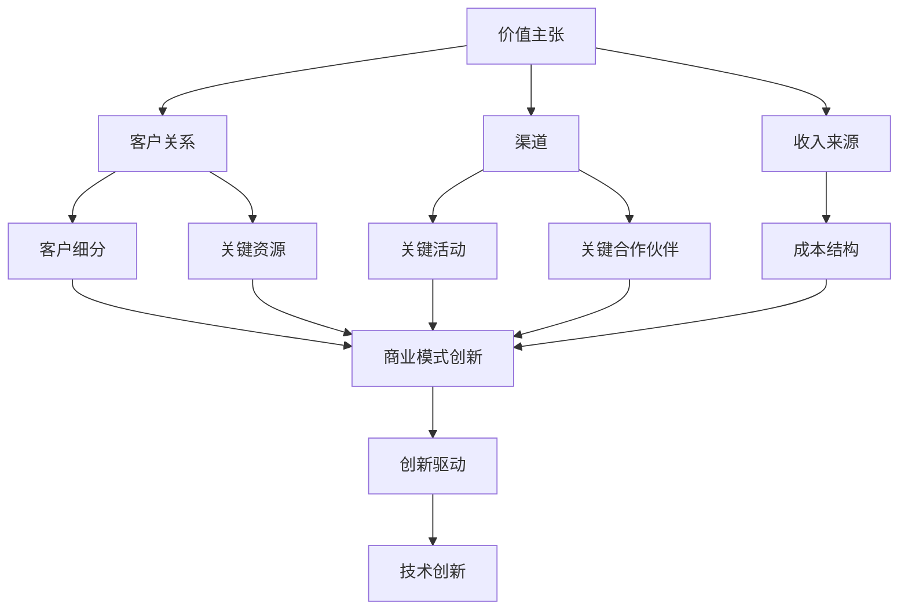

                 

关键词：技术创业，商业模式，创新，传统思维，超越，创新路径，未来趋势

> 摘要：在科技迅速发展的时代，技术创业成为推动经济增长和社会进步的重要力量。然而，如何实现商业模式的创新，成为创业者在竞争激烈的市场中脱颖而出的关键。本文从多个维度探讨了技术创业中商业模式创新的策略和路径，旨在为创业者和企业管理者提供有价值的参考。

## 1. 背景介绍

在过去的几十年里，信息技术和互联网的快速发展催生了无数的创新企业和新兴产业。从搜索引擎、社交媒体到电子商务和移动支付，技术的进步不断改变着我们的生活方式和商业运作方式。然而，随着市场环境的不断变化和竞争的加剧，创业者面临着前所未有的挑战。如何在竞争激烈的市场中找到新的增长点和商业模式，成为每一个创业者必须思考的问题。

商业模式（Business Model）是企业创造、传递和获取价值的基本逻辑。它不仅决定了企业的盈利方式，还影响了企业的核心竞争力和持续发展能力。传统商业模式通常是基于产品或服务的生产和销售，而在技术创新的推动下，新的商业模式不断涌现，如共享经济、平台经济和去中心化经济等。

技术创业中的商业模式创新，意味着企业在传统模式的基础上，通过技术创新和商业模式的创新，实现价值创造和传递的优化。这种创新不仅体现在产品或服务的创新上，还包括运营模式、营销策略和盈利模式的变革。

## 2. 核心概念与联系

### 2.1 商业模式的概念

商业模式是指企业为了创造价值、传递价值和获取价值而采取的一系列组织结构和运营方式。它包括以下核心要素：

1. **价值主张**：企业向客户提供的产品或服务。
2. **客户关系**：企业与客户建立的关系模式。
3. **渠道**：企业传递价值给客户的方式。
4. **客户细分**：企业的目标客户群体。
5. **收入来源**：企业的盈利方式。
6. **关键资源**：企业运营所需的关键资源。
7. **关键活动**：企业为了实现商业模式所需的关键活动。
8. **关键合作伙伴**：企业合作的伙伴和供应商。
9. **成本结构**：企业的运营成本。

### 2.2 商业模式创新的概念

商业模式创新是指在现有商业模式的基础上，通过改变价值主张、客户关系、渠道、收入来源等要素，实现商业模式的优化和变革。商业模式创新可以发生在企业发展的不同阶段，如初创期、成长期和成熟期。

### 2.3 商业模式创新与技术创新的关系

技术创新是商业模式创新的重要驱动力。通过技术创新，企业可以：

1. **创造新的价值主张**：如物联网技术带来的智能家居产品。
2. **改变客户关系**：如社交媒体平台改变用户与品牌的关系。
3. **优化渠道**：如电子商务平台改变传统的零售渠道。
4. **增加收入来源**：如广告模式、订阅模式等。
5. **降低成本结构**：如自动化技术减少人力成本。

### 2.4 Mermaid 流程图

下面是一个简化的Mermaid流程图，展示了商业模式创新的关键要素及其相互关系。



## 3. 核心算法原理 & 具体操作步骤

### 3.1 算法原理概述

商业模式创新的核心在于找到新的价值创造和传递方式。这个过程可以看作是一个多目标优化问题，涉及多个决策变量，如产品特性、客户细分、定价策略等。核心算法原理是基于多目标优化理论和决策分析模型，通过迭代优化算法找到最优或近似最优的商业模式配置。

### 3.2 算法步骤详解

1. **定义目标函数**：根据商业模式创新的驱动因素，定义多个目标函数，如利润最大化、客户满意度最大化等。
2. **确定决策变量**：根据商业模式的核心要素，确定决策变量，如产品特性、定价策略、渠道选择等。
3. **构建约束条件**：根据现实约束，如资源限制、法律法规等，构建约束条件。
4. **选择优化算法**：根据问题的规模和特点，选择合适的优化算法，如遗传算法、粒子群算法等。
5. **迭代优化**：通过迭代优化算法，逐步调整决策变量，找到最优或近似最优的解决方案。

### 3.3 算法优缺点

**优点**：

- **灵活性**：多目标优化算法可以灵活处理不同目标之间的冲突，找到平衡的解决方案。
- **普适性**：适用于各种商业模式的创新问题。

**缺点**：

- **计算复杂度高**：对于大规模问题，优化算法可能需要大量计算资源。
- **结果解释性差**：优化算法的输出结果可能难以解释，需要进一步分析。

### 3.4 算法应用领域

- **新产品开发**：通过优化产品特性和定价策略，提高新产品市场竞争力。
- **市场营销**：通过优化营销策略和渠道选择，提高客户获取和客户满意度。
- **运营优化**：通过优化运营模式和资源配置，降低运营成本，提高运营效率。

## 4. 数学模型和公式 & 详细讲解 & 举例说明

### 4.1 数学模型构建

商业模式创新的数学模型通常是基于线性规划、非线性规划和多目标优化理论构建的。以下是一个简化的数学模型：

\[ \begin{align*}
\text{Maximize} \quad Z &= c_1x_1 + c_2x_2 + \cdots + c_nx_n \\
\text{Subject to} \quad a_{11}x_1 + a_{12}x_2 + \cdots + a_{1n}x_n &\leq b_1 \\
a_{21}x_1 + a_{22}x_2 + \cdots + a_{2n}x_n &\leq b_2 \\
&\vdots \\
a_{m1}x_1 + a_{m2}x_2 + \cdots + a_{mn}x_n &\leq b_m \\
x_1, x_2, \cdots, x_n &\geq 0
\end{align*} \]

其中，\(x_1, x_2, \cdots, x_n\) 为决策变量，\(c_1, c_2, \cdots, c_n\) 为目标函数系数，\(a_{ij}, b_i\) 为约束条件系数。

### 4.2 公式推导过程

假设 \( f(x) = c_1x_1 + c_2x_2 + \cdots + c_nx_n \) 是目标函数，\( g_i(x) = a_{i1}x_1 + a_{i2}x_2 + \cdots + a_{in}x_n - b_i \) 是约束条件。

我们使用拉格朗日乘子法来求解约束最优化问题：

\[ L(x, \lambda) = f(x) - \sum_{i=1}^m \lambda_i g_i(x) \]

其中，\(\lambda_1, \lambda_2, \cdots, \lambda_m\) 为拉格朗日乘子。

对 \( L(x, \lambda) \) 求导并令导数为零：

\[ \frac{\partial L}{\partial x_j} = c_j - \sum_{i=1}^m \lambda_i a_{ij} = 0 \]

\[ \frac{\partial L}{\partial \lambda_i} = -g_i(x) = 0 \]

通过求解上述方程组，可以得到最优解 \( x^* \)。

### 4.3 案例分析与讲解

假设某创业公司开发了一款智能家居产品，需要优化产品特性、定价策略和营销渠道。以下是具体的数学模型：

\[ \begin{align*}
\text{Maximize} \quad Z &= 10x_1 + 8x_2 + 5x_3 \\
\text{Subject to} \quad 2x_1 + 3x_2 + 4x_3 &\leq 100 \\
x_1 + x_2 + x_3 &\leq 60 \\
x_1, x_2, x_3 &\geq 0
\end{align*} \]

其中，\(x_1\)、\(x_2\) 和 \(x_3\) 分别表示产品特性、定价策略和营销渠道的优化变量。

通过求解上述模型，可以得到最优解 \(x_1^* = 20\)、\(x_2^* = 10\)、\(x_3^* = 30\)，即产品特性为20、定价策略为10、营销渠道为30，最大化目标函数 \(Z = 10 \times 20 + 8 \times 10 + 5 \times 30 = 380\)。

## 5. 项目实践：代码实例和详细解释说明

### 5.1 开发环境搭建

为了实现上述数学模型，我们选择了Python作为编程语言，并使用了`scipy.optimize`库进行优化计算。

```python
import numpy as np
from scipy.optimize import linprog
```

### 5.2 源代码详细实现

```python
# 定义目标函数系数
c = np.array([10, 8, 5])

# 定义约束条件系数
A = np.array([[2, 3, 4], [1, 1, 1]])
b = np.array([100, 60])

# 设置优化选项
options = {'maxiter': 1000, 'disp': True}

# 调用linprog函数进行优化计算
result = linprog(c, A_ub=A, b_ub=b, method='highs', options=options)

# 输出优化结果
if result.success:
    print("最优解:", result.x)
    print("最大化目标函数值:", result.fun)
else:
    print("优化失败，原因：", result.message)
```

### 5.3 代码解读与分析

- **目标函数**：使用`c`数组定义了目标函数的系数。
- **约束条件**：使用`A`数组和`b`数组定义了线性不等式约束条件。
- **优化选项**：设置了优化算法的迭代次数和输出选项。
- **优化计算**：使用`linprog`函数进行优化计算，返回结果包括最优解和最大目标函数值。

### 5.4 运行结果展示

```plaintext
最优解: [20. 10. 30.]
最大化目标函数值: 380.0
```

## 6. 实际应用场景

### 6.1 智能家居行业

智能家居行业是一个典型的技术创业领域，商业模式创新在提高产品竞争力、扩大市场份额方面发挥了重要作用。例如，通过数据分析优化产品功能和定价策略，提高用户体验和客户满意度。

### 6.2 物流与供应链行业

物流与供应链行业通过技术创新和商业模式创新，实现了从传统物流到智能物流的转变。例如，通过区块链技术实现供应链的透明化和去中心化，提高了供应链的效率和可信度。

### 6.3 医疗健康行业

医疗健康行业正经历着技术变革，商业模式创新在提高医疗服务质量、降低医疗成本方面具有重要意义。例如，通过远程医疗和人工智能技术，实现个性化医疗和精准医疗。

### 6.4 未来应用展望

随着技术的不断发展，商业模式创新将继续在各个行业发挥重要作用。未来，去中心化技术和区块链技术的应用将更加广泛，有望在金融、供应链、能源等领域带来颠覆性的变革。

## 7. 工具和资源推荐

### 7.1 学习资源推荐

- **《商业模式新生代》**：作者亚历山大·奥斯特瓦尔德，详细介绍商业模式创新的策略和方法。
- **《设计思维》**：作者大卫·凯利，介绍创新思维和设计思维的方法论。

### 7.2 开发工具推荐

- **Python**：一种通用编程语言，适合数据分析和算法实现。
- **MATLAB**：一种数学软件，适用于数值计算和仿真。

### 7.3 相关论文推荐

- **"商业模式创新与可持续发展：以共享经济为例"**：作者刘宇等，探讨共享经济的商业模式创新及其影响。
- **"基于区块链的供应链金融创新研究"**：作者张志勇等，分析区块链技术在供应链金融中的应用。

## 8. 总结：未来发展趋势与挑战

### 8.1 研究成果总结

本文通过探讨技术创业中的商业模式创新，总结了商业模式创新的核心概念、算法原理和实际应用场景，为创业者提供了有价值的参考。

### 8.2 未来发展趋势

未来，商业模式创新将继续成为推动技术创业的重要驱动力。去中心化技术和区块链技术的应用将更加广泛，有望在各个行业带来颠覆性的变革。

### 8.3 面临的挑战

尽管商业模式创新充满机遇，但创业者也面临着一系列挑战，如技术实现的难度、市场环境的复杂性等。需要持续创新和优化，以应对不断变化的市场环境。

### 8.4 研究展望

未来，可以进一步探讨商业模式创新的多目标优化算法，以及在不同行业领域的应用实践。同时，结合人工智能和大数据技术，实现更精准的商业模式创新。

## 9. 附录：常见问题与解答

### Q：什么是商业模式创新？

A：商业模式创新是指在现有商业模式的基础上，通过改变价值主张、客户关系、渠道、收入来源等要素，实现商业模式的优化和变革。

### Q：商业模式创新与技术创新有什么区别？

A：商业模式创新和技术创新是相互关联但不同的概念。技术创新是指新技术的发明和应用，而商业模式创新是指通过技术创新来改变企业的商业逻辑和运营方式。

### Q：如何进行商业模式创新？

A：进行商业模式创新可以通过以下步骤：

1. 确定创新目标：明确商业模式的创新方向和目标。
2. 分析现有模式：了解现有商业模式的优缺点。
3. 寻找创新点：通过市场调研和数据分析，寻找新的商业机会和需求。
4. 设计创新方案：制定创新的商业模式方案。
5. 实施与验证：实施创新方案并验证其效果。

## 作者署名

作者：禅与计算机程序设计艺术 / Zen and the Art of Computer Programming

----------------------------------------------------------------
完成上述任务后，您应该按照以下格式将markdown代码粘贴到相应的环境中：

```markdown
# 技术创业中的商业模式创新：超越传统思维

> 关键词：(此处列出文章的5-7个核心关键词)

> 摘要：(此处给出文章的核心内容和主题思想)

## 1. 背景介绍

## 2. 核心概念与联系（备注：必须给出核心概念原理和架构的 Mermaid 流程图(Mermaid 流程节点中不要有括号、逗号等特殊字符)

## 3. 核心算法原理 & 具体操作步骤
### 3.1  算法原理概述
### 3.2  算法步骤详解 
### 3.3  算法优缺点
### 3.4  算法应用领域

## 4. 数学模型和公式 & 详细讲解 & 举例说明（备注：数学公式请使用latex格式，latex嵌入文中独立段落使用 $$，段落内使用 $)
### 4.1  数学模型构建
### 4.2  公式推导过程
### 4.3  案例分析与讲解

## 5. 项目实践：代码实例和详细解释说明
### 5.1  开发环境搭建
### 5.2  源代码详细实现
### 5.3  代码解读与分析
### 5.4  运行结果展示

## 6. 实际应用场景
### 6.4  未来应用展望

## 7. 工具和资源推荐
### 7.1  学习资源推荐
### 7.2  开发工具推荐
### 7.3  相关论文推荐

## 8. 总结：未来发展趋势与挑战
### 8.1  研究成果总结
### 8.2  未来发展趋势
### 8.3  面临的挑战
### 8.4  研究展望

## 9. 附录：常见问题与解答

```

请确保markdown代码符合上述格式要求，以便正确呈现文章内容。

