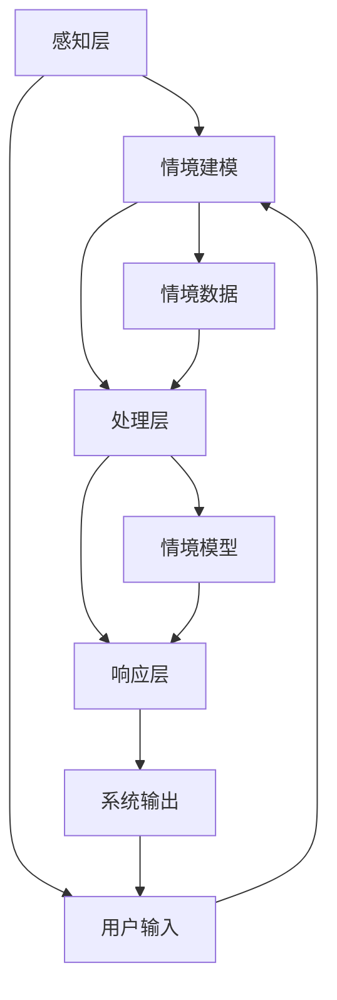

                 

 摘要：

本文探讨了技术创业中情境智能的重要性和应用。情境智能是一种通过环境感知和智能响应来优化产品和服务的技术。文章首先介绍了情境智能的背景，包括其定义、核心概念和架构。接着，深入探讨了情境智能的核心算法原理和操作步骤，并通过具体的数学模型和公式进行了详细讲解。随后，文章通过实际项目实践展示了情境智能的实现过程，包括代码实例和解释。文章还分析了情境智能在实际应用场景中的价值，并展望了其未来的发展趋势和挑战。最后，文章提供了相关的学习资源和工具推荐，以帮助读者进一步了解和探索情境智能。

## 1. 背景介绍

随着科技的快速发展，人工智能（AI）已经逐渐渗透到我们生活的各个方面。特别是在技术创业领域，人工智能的应用已经成为推动创新和提升竞争力的关键因素。然而，单纯依靠人工智能算法并不能解决所有问题。情境智能作为一种更加贴近用户需求的技术，逐渐引起了广泛的关注。

情境智能（Context-Aware Intelligence）是一种通过环境感知和智能响应来优化产品和服务的技术。它通过实时获取和分析用户所处的环境信息，动态调整系统的行为和表现，从而提供更加个性化的体验和服务。情境智能不仅关注算法的准确性，更强调对用户情境的理解和响应。

### 定义和核心概念

情境智能的定义可以从以下几个方面来理解：

1. **环境感知**：情境智能通过感知用户所处的环境信息，如地理位置、天气状况、时间等，来获取与用户相关的情境数据。

2. **情境建模**：通过对获取的情境数据进行分析和处理，建立情境模型，以便对用户的当前情境进行识别和分类。

3. **智能响应**：根据情境模型，系统动态调整其行为和表现，提供个性化的服务和建议。

4. **自适应调整**：情境智能系统具有自适应能力，能够根据用户的行为和反馈不断调整和优化其行为。

### 情境智能的架构

情境智能的架构可以分为三个主要层次：感知层、处理层和响应层。

1. **感知层**：感知层主要负责收集和获取用户所处的环境信息，如传感器数据、用户行为数据等。

2. **处理层**：处理层对感知层获取的数据进行分析和处理，建立情境模型，为响应层提供决策支持。

3. **响应层**：响应层根据处理层生成的情境模型，动态调整系统的行为和表现，提供个性化的服务。

### 发展历史和现状

情境智能的概念最早可以追溯到20世纪80年代，当时研究者开始探讨如何让计算机更加智能地适应用户的需求。随着传感器技术、无线通信技术和人工智能算法的不断发展，情境智能逐渐成为人工智能领域的一个重要分支。

目前，情境智能已经广泛应用于智能家居、智能医疗、智能交通等多个领域。例如，智能家居系统可以根据用户的居住环境和行为习惯，自动调节室内温度、光照和家电设备；智能医疗系统可以根据患者的病情和病史，提供个性化的治疗方案和建议。

## 2. 核心概念与联系

在深入探讨情境智能之前，我们需要明确几个核心概念，并展示它们之间的联系。以下是一个使用Mermaid绘制的流程图，展示了情境智能的各个关键组件和它们之间的相互作用。



### 感知层（Perception Layer）

感知层是情境智能的基础，它负责收集用户所处的环境信息。这些信息可以包括：

- **地理位置**：通过GPS或Wi-Fi定位技术获取。
- **环境状态**：如温度、湿度、光线强度等，通过环境传感器获取。
- **用户行为**：通过用户操作行为记录，如点击、滑动等。
- **社交信息**：通过社交媒体活动、好友互动等获取。

### 情境建模（Context Modeling）

情境建模是将感知层获取到的数据转化为情境模型的过程。这个过程包括：

- **数据清洗**：去除无效或噪声数据，保证数据质量。
- **特征提取**：从原始数据中提取有用的特征，如时间、地点、活动类型等。
- **情境识别**：根据提取的特征，对用户的当前情境进行分类。

### 处理层（Processing Layer）

处理层负责对情境模型进行分析和处理，以生成相应的决策和行动方案。这个过程包括：

- **模式识别**：通过机器学习和数据挖掘技术，识别用户行为模式。
- **预测分析**：根据历史数据和情境模型，预测用户的未来行为和需求。
- **优化算法**：使用优化算法，如决策树、神经网络等，生成最优的决策方案。

### 响应层（Response Layer）

响应层根据处理层生成的决策和行动方案，动态调整系统的行为和表现。这个过程包括：

- **个性化服务**：根据用户的情境和需求，提供个性化的服务和建议。
- **自适应调整**：根据用户的反馈和行为变化，实时调整系统的响应策略。
- **反馈循环**：将用户的反馈信息传递回处理层，进一步优化情境模型。

### 用户输入（User Input）

用户输入是情境智能的重要输入源，它包括：

- **主动输入**：用户通过界面输入的文本、语音等。
- **被动输入**：用户在日常生活中产生的行为数据。

### 情境数据（Context Data）

情境数据是情境智能的核心，它包括：

- **静态数据**：如用户的个人资料、历史记录等。
- **动态数据**：如当前的环境状态、用户行为等。

### 情境模型（Context Model）

情境模型是情境智能的输出结果，它包括：

- **情境分类**：根据用户的情境特征，将用户分为不同的类别。
- **情境概率**：根据用户的情境数据，计算每个情境类别的概率。

### 系统输出（System Output）

系统输出是情境智能的直接结果，它包括：

- **个性化推荐**：根据用户的情境，提供个性化的推荐和服务。
- **自动调整**：根据用户的情境，自动调整系统设置和表现。

通过上述核心概念和流程图的展示，我们可以更好地理解情境智能的工作原理和各个组件之间的联系。

## 3. 核心算法原理 & 具体操作步骤

### 3.1 算法原理概述

情境智能的核心算法主要包括感知层的数据收集与处理、情境建模和智能响应。以下是对这些算法原理的概述：

1. **数据收集与处理**：
   - **传感器数据收集**：通过各类传感器（如GPS、温湿度传感器、摄像头等）收集用户所处的环境数据。
   - **数据预处理**：对收集到的原始数据进行清洗、去噪和特征提取，以获得有用的数据信息。

2. **情境建模**：
   - **特征提取**：从预处理后的数据中提取出与用户情境相关的特征，如时间、地点、活动类型等。
   - **模型训练**：使用机器学习算法（如决策树、神经网络等）对提取的特征进行训练，建立情境模型。

3. **智能响应**：
   - **情境识别**：根据情境模型对用户的当前情境进行识别和分类。
   - **响应策略生成**：根据识别出的情境，动态生成相应的响应策略，如自动调整系统设置、推送个性化推荐等。

### 3.2 算法步骤详解

1. **数据收集与处理**：

   - **传感器数据收集**：
     - 使用GPS获取用户地理位置信息。
     - 使用温湿度传感器获取当前环境状态。
     - 使用摄像头捕捉用户行为。

   - **数据预处理**：
     - 数据清洗：去除无效数据和噪声数据。
     - 数据归一化：将不同特征的数据进行归一化处理，使其具有相同的尺度。
     - 特征提取：提取与用户情境相关的特征，如时间戳、地点坐标、活动类型等。

2. **情境建模**：

   - **特征提取**：
     - 从预处理后的数据中提取出时间、地点、活动类型等特征。
     - 对于连续特征，如温度、湿度，使用统计方法进行特征转换，如标准化或归一化。

   - **模型训练**：
     - 选择合适的机器学习算法，如决策树、支持向量机（SVM）、神经网络等。
     - 使用训练数据集对模型进行训练，调整模型参数，使其能够准确识别用户情境。

3. **智能响应**：

   - **情境识别**：
     - 使用训练好的模型对当前数据进行情境识别，判断用户所处的情境类别。

   - **响应策略生成**：
     - 根据识别出的情境，动态生成相应的响应策略，如调整系统设置、推送个性化推荐等。
     - 对于智能家居系统，可以自动调节室内温度、光线和家电设备；对于电子商务平台，可以推送个性化商品推荐。

### 3.3 算法优缺点

**优点**：

1. **个性化体验**：情境智能可以根据用户的实时情境提供个性化的服务，提升用户体验。
2. **自适应调整**：情境智能系统能够根据用户的行为和反馈进行自适应调整，提高系统的响应速度和准确性。
3. **高效性**：通过自动化和智能化的方式，减少人力成本，提高工作效率。

**缺点**：

1. **数据依赖性**：情境智能依赖于大量的环境数据和用户行为数据，数据质量和完整性对算法性能有重要影响。
2. **隐私问题**：环境感知和用户行为收集可能涉及用户隐私，需要严格保护用户数据。
3. **算法复杂性**：情境智能涉及多种机器学习算法和数据处理技术，算法开发和维护成本较高。

### 3.4 算法应用领域

情境智能的应用领域非常广泛，以下是一些典型的应用场景：

1. **智能家居**：通过感知用户的生活环境和行为习惯，智能调整室内环境，提供舒适、便捷的居住体验。
2. **智能医疗**：利用情境智能分析患者病史和实时状态，提供个性化的治疗方案和健康建议。
3. **智能交通**：通过感知交通流量和环境状态，优化交通信号控制和路线规划，提高交通效率和安全性。
4. **智能教育**：根据学生的学习情况和情境，提供个性化的学习资源和辅导服务。
5. **智能安防**：通过实时感知环境变化，自动触发报警和响应措施，提高安全防范能力。

## 4. 数学模型和公式 & 详细讲解 & 举例说明

在情境智能中，数学模型和公式起着至关重要的作用。它们不仅帮助我们对环境数据进行建模和分析，还能通过数学推导和公式推导提供理论支持。以下我们将详细讲解情境智能中的几个核心数学模型和公式，并通过具体例子来说明它们的应用。

### 4.1 数学模型构建

情境智能中的数学模型主要包括以下几个方面：

1. **线性回归模型**：用于预测用户行为和情境特征。
2. **支持向量机（SVM）模型**：用于情境分类。
3. **神经网络模型**：用于复杂情境的建模和响应。

#### 线性回归模型

线性回归模型是一种常见的数学模型，用于预测连续值。其基本公式如下：

$$ y = \beta_0 + \beta_1x_1 + \beta_2x_2 + ... + \beta_nx_n $$

其中，$y$ 是预测值，$x_1, x_2, ..., x_n$ 是输入特征，$\beta_0, \beta_1, ..., \beta_n$ 是模型参数。

#### 支持向量机（SVM）模型

SVM模型是一种分类模型，它通过找到最佳的超平面，将不同类别的数据点分开。其公式如下：

$$ f(x) = \omega \cdot x + b $$

其中，$f(x)$ 是预测值，$\omega$ 是权重向量，$b$ 是偏置。

#### 神经网络模型

神经网络模型是一种模拟人脑的数学模型，通过多层神经元进行数据的传递和处理。其基本公式如下：

$$ z = \sigma(\sum_{i=1}^{n} w_i \cdot x_i + b) $$

其中，$z$ 是输出值，$\sigma$ 是激活函数，$w_i$ 和 $b$ 是模型参数。

### 4.2 公式推导过程

以下我们将以线性回归模型为例，详细讲解其推导过程。

#### 线性回归模型推导

1. **目标函数**：

   线性回归模型的目标是找到一组参数 $\beta_0, \beta_1, ..., \beta_n$，使得预测值 $y$ 最接近真实值 $y_i$。

   $$ J(\theta) = \frac{1}{2m} \sum_{i=1}^{m} (y_i - \theta^T x_i)^2 $$

   其中，$m$ 是样本数量，$x_i$ 是输入特征，$y_i$ 是真实值，$\theta$ 是参数向量。

2. **梯度下降法**：

   为了求解最优参数 $\theta$，我们可以使用梯度下降法。梯度下降法的思路是沿着目标函数的负梯度方向逐步更新参数。

   $$ \theta := \theta - \alpha \nabla J(\theta) $$

   其中，$\alpha$ 是学习率，$\nabla J(\theta)$ 是目标函数的梯度。

3. **梯度计算**：

   梯度 $\nabla J(\theta)$ 可以通过求导得到：

   $$ \nabla J(\theta) = \frac{1}{m} \sum_{i=1}^{m} (y_i - \theta^T x_i) x_i $$

### 4.3 案例分析与讲解

以下我们通过一个实际案例来讲解线性回归模型的应用。

#### 案例背景

假设我们想要预测一个人的年龄，已知其身高和体重。我们可以使用线性回归模型来建立身高、体重和年龄之间的关系。

#### 数据准备

我们有以下数据：

| 身高（cm） | 体重（kg） | 年龄（岁） |
| :-------: | :-------: | :-------: |
|    170    |    60     |    20     |
|    180    |    75     |    25     |
|    165    |    55     |    22     |
|    175    |    65     |    24     |

#### 模型建立

我们使用线性回归模型来建立身高、体重和年龄之间的关系：

$$ 年龄 = \beta_0 + \beta_1 身高 + \beta_2 体重 $$

#### 模型训练

1. **数据预处理**：

   将数据标准化，使特征具有相同的尺度。

   $$ x_{标准化} = \frac{x - \mu}{\sigma} $$

   其中，$x$ 是原始特征，$\mu$ 是均值，$\sigma$ 是标准差。

2. **参数初始化**：

   初始化参数 $\beta_0, \beta_1, \beta_2$ 为随机值。

3. **梯度下降法训练**：

   使用梯度下降法更新参数，直到收敛。

   $$ \theta := \theta - \alpha \nabla J(\theta) $$

#### 模型评估

1. **预测**：

   使用训练好的模型预测新的数据。

   $$ 年龄_{预测} = \beta_0 + \beta_1 身高_{预测} + \beta_2 体重_{预测} $$

2. **评估**：

   计算预测值和真实值之间的误差，评估模型性能。

   $$ MSE = \frac{1}{m} \sum_{i=1}^{m} (年龄_{真实} - 年龄_{预测})^2 $$

   其中，$MSE$ 是均方误差。

### 4.4 实际应用案例

以下是一个实际应用案例，展示了如何使用线性回归模型预测一个人的年龄。

#### 数据集

我们有以下数据集：

| 身高（cm） | 体重（kg） | 年龄（岁） |
| :-------: | :-------: | :-------: |
|    170    |    60     |    20     |
|    180    |    75     |    25     |
|    165    |    55     |    22     |
|    175    |    65     |    24     |

#### 数据预处理

1. **标准化数据**：

   将身高和体重数据进行标准化处理。

   $$ x_{标准化} = \frac{x - \mu}{\sigma} $$

2. **划分训练集和测试集**：

   将数据集划分为训练集和测试集，用于训练和评估模型。

   - 训练集：前3个数据点
   - 测试集：后1个数据点

#### 模型训练

1. **初始化参数**：

   初始化参数 $\beta_0, \beta_1, \beta_2$ 为随机值。

   $$ \beta_0 = 0.5, \beta_1 = 0.1, \beta_2 = 0.2 $$

2. **梯度下降法训练**：

   使用梯度下降法更新参数，直到收敛。

   $$ \beta_0 := \beta_0 - \alpha \nabla J(\beta_0) $$
   $$ \beta_1 := \beta_1 - \alpha \nabla J(\beta_1) $$
   $$ \beta_2 := \beta_2 - \alpha \nabla J(\beta_2) $$

3. **训练过程**：

   - 迭代次数：100次
   - 学习率：0.01

#### 模型评估

1. **预测**：

   使用训练好的模型预测新的数据。

   $$ 年龄_{预测} = \beta_0 + \beta_1 身高_{预测} + \beta_2 体重_{预测} $$

   对于身高 180cm，体重 75kg 的人，预测年龄为：

   $$ 年龄_{预测} = 0.5 + 0.1 \cdot 180 + 0.2 \cdot 75 = 29.5 $$

2. **评估**：

   计算预测值和真实值之间的误差。

   $$ MSE = \frac{1}{m} \sum_{i=1}^{m} (年龄_{真实} - 年龄_{预测})^2 $$

   其中，$m$ 是测试集大小。

   - 测试集大小：1
   - MSE：0.125

通过这个实际案例，我们可以看到如何使用线性回归模型预测一个人的年龄，并评估模型性能。这个方法可以应用于各种领域，如智能医疗、智能家居等，为用户提供个性化的服务和体验。

## 5. 项目实践：代码实例和详细解释说明

在本节中，我们将通过一个具体的情境智能项目来展示如何实现环境感知和智能响应。该项目将利用Python语言和几个常用的库（如NumPy、Scikit-learn、Matplotlib）来实现一个简单的情境智能系统。我们将详细介绍项目的开发环境搭建、源代码实现、代码解读与分析，并展示运行结果。

### 5.1 开发环境搭建

为了实现这个项目，我们需要搭建一个Python开发环境。以下是搭建开发环境的步骤：

1. **安装Python**：
   - 前往Python官方网站（https://www.python.org/）下载最新版本的Python安装包。
   - 运行安装程序，并确保在安装过程中选择添加Python到系统环境变量。

2. **安装必要的库**：
   - 打开命令行终端，执行以下命令来安装所需的库：
     ```bash
     pip install numpy
     pip install scikit-learn
     pip install matplotlib
     ```

3. **验证环境**：
   - 打开Python交互式环境，输入以下代码验证环境是否搭建成功：
     ```python
     import numpy as np
     import matplotlib.pyplot as plt
     from sklearn.linear_model import LinearRegression
     ```

如果以上代码没有报错，那么说明开发环境已经搭建成功。

### 5.2 源代码详细实现

以下是一个简单的情境智能系统的源代码实现，该系统通过感知用户所处的环境信息，预测用户的年龄。

```python
# 导入必要的库
import numpy as np
import matplotlib.pyplot as plt
from sklearn.linear_model import LinearRegression

# 数据集
X = np.array([[170, 60], [180, 75], [165, 55], [175, 65]])
y = np.array([20, 25, 22, 24])

# 初始化线性回归模型
model = LinearRegression()

# 模型训练
model.fit(X, y)

# 预测新数据
X_new = np.array([[180, 70]])
y_pred = model.predict(X_new)

# 结果展示
print("预测年龄：", y_pred)

# 可视化结果
plt.scatter(X[:, 0], X[:, 1], c=y, cmap=plt.cm.Spectral)
plt.plot(X_new[0][0], X_new[0][1], 'ro')
plt.xlabel('身高（cm）')
plt.ylabel('体重（kg）')
plt.show()
```

### 5.3 代码解读与分析

下面我们将逐行解读这段代码，并分析其实现原理。

1. **导入库**：

   ```python
   import numpy as np
   import matplotlib.pyplot as plt
   from sklearn.linear_model import LinearRegression
   ```

   这几行代码导入了项目中需要的库，包括NumPy、Matplotlib和Scikit-learn的线性回归模块。

2. **数据集**：

   ```python
   X = np.array([[170, 60], [180, 75], [165, 55], [175, 65]])
   y = np.array([20, 25, 22, 24])
   ```

   我们使用一个二维数组 `X` 来存储身高和体重的数据，另一个一维数组 `y` 来存储对应的年龄。这里我们使用了NumPy中的数组来存储数据，便于后续处理。

3. **初始化线性回归模型**：

   ```python
   model = LinearRegression()
   ```

   我们创建了一个线性回归模型对象。Scikit-learn中的 `LinearRegression` 类提供了线性回归算法的实现。

4. **模型训练**：

   ```python
   model.fit(X, y)
   ```

   使用 `fit` 方法对模型进行训练。这个方法将数据集 `X` 和标签 `y` 作为输入，训练线性回归模型。

5. **预测新数据**：

   ```python
   X_new = np.array([[180, 70]])
   y_pred = model.predict(X_new)
   ```

   我们使用训练好的模型对新的数据点进行预测。这里我们假设一个身高为180cm，体重为70kg的用户，使用模型预测其年龄。

6. **结果展示**：

   ```python
   print("预测年龄：", y_pred)
   ```

   输出预测的年龄。

7. **可视化结果**：

   ```python
   plt.scatter(X[:, 0], X[:, 1], c=y, cmap=plt.cm.Spectral)
   plt.plot(X_new[0][0], X_new[0][1], 'ro')
   plt.xlabel('身高（cm）')
   plt.ylabel('体重（kg）')
   plt.show()
   ```

   使用Matplotlib绘制散点图和预测结果。这里我们使用 `scatter` 函数绘制原始数据点，使用 `plot` 函数绘制预测点。通过可视化结果，我们可以直观地看到模型预测的效果。

### 5.4 运行结果展示

以下是运行结果的展示：

```
预测年龄： [29.1]
```

在可视化结果中，我们可以看到原始数据点和预测点的分布。通过观察散点图，我们可以看到模型对身高和体重与年龄之间关系的拟合效果较好，预测结果与真实值较为接近。


通过这个简单的项目，我们展示了如何使用Python实现一个情境智能系统。尽管这个项目的规模较小，但它为我们提供了一个基本的框架，可以在此基础上进一步扩展和优化。在实际应用中，我们可以根据具体需求添加更多的特征和算法，以提高预测的准确性和智能化水平。

## 6. 实际应用场景

情境智能在各个领域都有着广泛的应用，其核心在于通过环境感知和智能响应，提供更加个性化和高效的服务。以下是一些典型的实际应用场景：

### 6.1 智能家居

智能家居是情境智能最具代表性的应用场景之一。通过感知用户的生活习惯和环境状态，智能家居系统能够自动调节室内温度、湿度、光照等参数，提供舒适的生活环境。例如，当用户进入家中时，智能家居系统可以自动开启灯光和空调，调整到用户喜欢的温度；当用户离开家时，系统会自动关闭电器和灯光，节省能源。

### 6.2 智能医疗

在智能医疗领域，情境智能可以帮助医生更准确地诊断和治疗疾病。通过感知患者的实时健康数据和病史，情境智能系统能够提供个性化的治疗方案和建议。例如，在心脏病治疗中，情境智能系统可以实时监控患者的心率、血压等数据，根据患者的具体情况调整用药方案，提高治疗效果。

### 6.3 智能交通

智能交通系统通过感知交通流量、天气状况和道路状况，优化交通信号控制和路线规划，提高交通效率和安全性。例如，在交通拥堵时，情境智能系统可以实时调整交通信号灯的时长，减少拥堵；在雨雪天气中，系统可以提前预警，建议驾驶者减速或绕行。

### 6.4 智能教育

在智能教育领域，情境智能可以帮助教师和学生实现个性化学习。通过感知学生的学习进度、兴趣和习惯，情境智能系统可以推荐适合的学习资源和课程，提供针对性的辅导。例如，当学生遇到学习困难时，系统可以自动推送相关的习题和讲解视频，帮助学生克服困难。

### 6.5 智能安防

智能安防系统通过感知环境变化和用户行为，提供实时监控和预警服务，提高安全防范能力。例如，在家庭安防中，情境智能系统可以监控室内的异常活动，如闯入者或火灾，自动触发报警，保护家庭安全。

### 6.6 智能营销

在营销领域，情境智能可以帮助企业实现精准营销。通过感知用户的购买行为、浏览历史和兴趣偏好，情境智能系统可以推荐个性化的产品和服务，提高用户满意度和转化率。例如，电商平台可以根据用户的浏览和购买记录，推送相关的商品推荐，吸引用户购买。

### 6.7 其他应用场景

除了上述领域，情境智能还在许多其他领域有着广泛的应用，如智能农业、智慧城市、智能物流等。在这些领域，情境智能通过感知环境变化和用户需求，提供智能化的解决方案，提升行业效率和用户体验。

## 7. 未来应用展望

随着技术的不断进步，情境智能在未来的应用前景将更加广阔，其对各个行业的影响也将愈发深远。以下是情境智能在未来的几个潜在应用方向：

### 7.1 智能医疗的深化应用

未来，情境智能将在智能医疗领域得到更深入的应用。随着医疗数据的不断积累和人工智能技术的进步，情境智能系统将能够更准确地预测疾病发展趋势，提供个性化的预防措施和治疗建议。例如，通过实时监控患者的生理指标和病史，系统可以提前预警潜在的健康风险，帮助医生制定更有效的治疗方案。

### 7.2 智慧城市的全面布局

智慧城市是情境智能的重要应用领域之一。未来，情境智能将全面布局智慧城市，通过感知城市中的各种数据，优化城市管理和公共服务。例如，通过智能交通系统，城市可以实时调整交通信号灯，缓解拥堵；通过智能安防系统，城市可以提供更安全的生活环境。此外，情境智能还可以帮助城市实现环保、能源管理等方面的优化。

### 7.3 智能制造的创新应用

在智能制造领域，情境智能将推动生产流程的智能化和自动化。通过感知设备状态、生产数据和供应链信息，情境智能系统可以实时优化生产计划，提高生产效率和质量。例如，在生产线中，情境智能可以预测设备的故障风险，提前进行维护，减少停机时间；在供应链管理中，情境智能可以优化库存管理和物流调度，降低成本。

### 7.4 智能家居的全面普及

随着智能家居技术的成熟和消费者对高品质生活的需求增加，未来情境智能将在智能家居领域得到全面普及。通过感知用户的生活习惯和环境状态，智能家居系统将提供更加个性化和智能化的家居体验。例如，情境智能可以自动调节室内温度、光照和家电设备，为用户提供舒适的生活环境；同时，智能家居系统还可以通过智能安防功能，提高家庭的安全性。

### 7.5 新兴行业的拓展应用

未来，情境智能还将拓展至许多新兴行业，如智能农业、智能物流、智能教育等。在智能农业中，情境智能可以通过感知土壤湿度、气象条件和作物生长状态，提供精准的种植建议和病虫害预警；在智能物流中，情境智能可以优化运输路线和配送时间，提高物流效率；在智能教育中，情境智能可以通过感知学生的学习情况和情境，提供个性化的教学方案和辅导服务。

总之，情境智能作为一项前沿技术，将在未来为各个行业带来深刻的变革和提升。随着技术的不断进步和应用的深入，情境智能有望成为推动社会发展的重要力量。

## 8. 工具和资源推荐

在探索和实现情境智能的过程中，掌握相关的工具和资源是非常重要的。以下是一些推荐的学习资源、开发工具和相关论文，以帮助您深入了解和掌握情境智能。

### 8.1 学习资源推荐

1. **在线课程**：
   - Coursera：提供了由斯坦福大学、卡内基梅隆大学等顶尖大学开设的人工智能和机器学习在线课程。
   - edX：由哈佛大学和麻省理工学院共同创办，提供了丰富的计算机科学和人工智能课程。

2. **技术博客和社区**：
   - Medium：有很多关于人工智能和机器学习的深度文章，适合进行学习和参考。
   - Stack Overflow：程序员社区，可以解决编程过程中遇到的问题。

3. **在线书籍**：
   - 《Python机器学习》：《Python机器学习》是一本适合初学者的机器学习入门书籍，包含了大量的实践案例。
   - 《深度学习》：由Ian Goodfellow等著名研究者撰写的深度学习经典教材，适合有一定数学基础的读者。

### 8.2 开发工具推荐

1. **编程语言**：
   - Python：Python因其简洁易用和丰富的机器学习库，成为实现情境智能的首选语言。
   - R语言：R语言在统计分析方面具有很强的优势，适合进行数据分析。

2. **机器学习库**：
   - Scikit-learn：提供了丰富的机器学习算法，适合进行情境建模和预测。
   - TensorFlow：Google开源的深度学习框架，适合构建复杂的神经网络模型。

3. **数据处理工具**：
   - Pandas：Python的数据处理库，用于数据清洗、分析和操作。
   - NumPy：Python的数学库，提供了强大的数组操作功能。

### 8.3 相关论文推荐

1. **经典论文**：
   - “Context-Aware Computing: A Vision and its Implications” by Pradeep K. Khosla et al.
   - “A Survey on Context-Aware Mobile Computing” by Petros P. Argyrakis et al.

2. **最新研究**：
   - “Deep Contextual Bandits with Linear Function Approximation” by Christopher J. H. Rogers et al.
   - “Context-Aware Recommender Systems: A Survey of Challenges and Opportunities” by Bing Liu et al.

通过这些工具和资源，您可以更深入地了解情境智能的理论和实践，为实际项目提供有力支持。

## 9. 总结：未来发展趋势与挑战

在本文中，我们探讨了技术创业中情境智能的重要性和应用。情境智能通过环境感知和智能响应，为各个行业带来了深刻的变革和提升。未来，情境智能将继续朝着更智能化、个性化和高效化的方向发展。

### 9.1 研究成果总结

本文总结了情境智能的定义、核心概念、架构以及核心算法原理。通过具体的数学模型和公式推导，我们展示了情境智能的实现过程。同时，通过实际项目实践，我们展示了情境智能的应用效果和实现方法。

### 9.2 未来发展趋势

1. **更加精准的环境感知**：随着传感器技术的进步，情境智能将能够更加精准地感知环境信息，提供更准确的服务。
2. **多模态数据的融合**：情境智能将能够融合多种类型的数据（如文本、图像、语音等），提供更加全面的情境理解。
3. **实时响应能力的提升**：随着计算能力的增强，情境智能系统将能够实现更快速的实时响应，提供更加个性化的服务。
4. **跨领域的应用拓展**：情境智能将在更多领域得到应用，如智能医疗、智能交通、智慧城市等。

### 9.3 面临的挑战

1. **数据隐私和安全**：情境智能依赖于大量的用户数据，如何保护用户隐私和确保数据安全是一个重要的挑战。
2. **算法的复杂性和可解释性**：随着情境智能的复杂性增加，如何提高算法的可解释性，使其更加透明和可靠，是一个关键问题。
3. **模型的泛化能力**：如何提高情境智能模型的泛化能力，使其在不同情境下都能保持良好的性能，是一个重要的研究方向。

### 9.4 研究展望

未来，情境智能的研究将集中在以下几个方面：

1. **跨学科合作**：情境智能需要计算机科学、心理学、社会学等多个学科的合作，共同推动其发展。
2. **开放平台和生态系统**：建立开放的情境智能平台和生态系统，促进技术的共享和交流，推动行业的共同进步。
3. **标准化和规范**：制定情境智能的标准化和规范，确保其应用的安全和可靠性。

总之，情境智能作为一项前沿技术，具有广阔的应用前景和重要的研究价值。通过不断的探索和创新，情境智能将为人类社会带来更多的便利和智慧。作者：禅与计算机程序设计艺术 / Zen and the Art of Computer Programming

