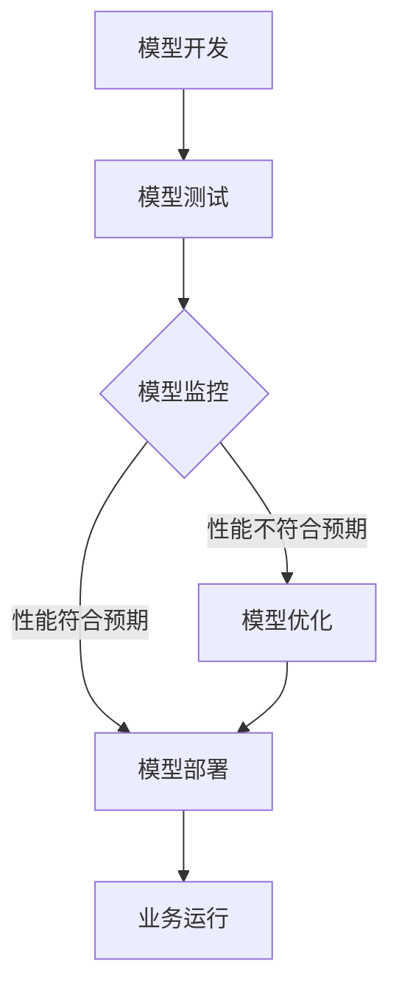

                 

关键词：技术创业、机器学习运维、AI模型优化、持续集成、模型监控、性能调优、自动化部署

摘要：本文将探讨在技术创业过程中，如何通过机器学习运维实现AI模型的持续优化。我们将深入分析AI模型在不同阶段的需求，探讨模型优化策略，并分享实践中的经验和教训。

## 1. 背景介绍

随着人工智能技术的飞速发展，机器学习已成为技术创业领域的重要推动力。从金融、医疗到零售，各行各业都在寻求通过机器学习模型实现业务价值最大化。然而，AI模型的开发和部署并非一蹴而就，其中涉及到诸多挑战。特别是随着模型的复杂度和数据量的增加，如何实现AI模型的持续优化成为技术创业者面临的重要问题。

本文旨在为技术创业者提供一套机器学习运维的实践指南，帮助他们在AI模型开发过程中实现持续优化，从而在激烈的市场竞争中脱颖而出。

## 2. 核心概念与联系

在深入探讨AI模型优化之前，我们需要了解一些核心概念和它们之间的联系。

### 2.1 机器学习运维

机器学习运维（MLOps）是一种将机器学习实践与软件工程相结合的方法，旨在实现AI模型的持续集成、持续部署和持续监控。MLOps的目的是确保AI模型在开发、测试和部署过程中遵循最佳实践，从而提高模型的可靠性和性能。

### 2.2 模型监控

模型监控是指对已部署的AI模型进行实时监控和评估，以确保其性能符合预期。模型监控的关键指标包括准确率、召回率、F1分数等。通过监控，技术创业者可以及时发现并解决模型故障，从而确保业务稳定运行。

### 2.3 持续集成

持续集成（CI）是一种软件开发实践，旨在将代码更改频繁地合并到共享的主分支中。在机器学习领域，持续集成可以帮助技术创业者快速验证模型改进，并确保模型的性能在各个版本之间保持一致。

### 2.4 持续部署

持续部署（CD）是一种自动化部署方法，旨在将经过测试的代码自动部署到生产环境。通过持续部署，技术创业者可以确保AI模型在实时环境中得到及时更新，从而提高业务响应速度。

### 2.5 模型优化

模型优化是指通过对现有AI模型进行调整和改进，以提高其性能和可靠性。模型优化策略包括超参数调优、数据预处理、特征工程等。

### 2.6 Mermaid 流程图

以下是一个简单的Mermaid流程图，展示了机器学习运维的核心流程。



## 3. 核心算法原理 & 具体操作步骤

### 3.1 算法原理概述

机器学习运维的核心算法包括模型训练、模型评估、模型优化等。这些算法的基本原理如下：

- **模型训练**：通过训练数据集，让模型学习如何将输入数据映射到输出结果。常见的训练算法包括梯度下降、随机梯度下降等。
- **模型评估**：使用测试数据集评估模型性能，常用的评估指标包括准确率、召回率、F1分数等。
- **模型优化**：通过调整模型参数，提高模型性能。常见的优化策略包括超参数调优、特征工程等。

### 3.2 算法步骤详解

以下是机器学习运维的具体操作步骤：

#### 3.2.1 模型开发

1. 数据收集：收集与业务相关的数据，包括训练数据集和测试数据集。
2. 数据预处理：对数据集进行清洗、归一化等预处理操作。
3. 模型选择：选择适合业务的模型架构，如线性回归、决策树、神经网络等。
4. 模型训练：使用训练数据集训练模型，并记录训练过程的关键指标。

#### 3.2.2 模型测试

1. 模型评估：使用测试数据集评估模型性能，计算评估指标。
2. 性能分析：分析模型性能，识别性能瓶颈。

#### 3.2.3 模型优化

1. 超参数调优：调整模型超参数，如学习率、批次大小等，以提高模型性能。
2. 特征工程：对数据进行特征提取和工程，以提高模型性能。
3. 模型重训：使用优化后的模型参数重新训练模型。

#### 3.2.4 模型部署

1. 模型集成：将优化后的模型集成到业务系统中。
2. 模型监控：实时监控模型性能，确保模型稳定运行。

### 3.3 算法优缺点

#### 优点

- **提高模型性能**：通过模型优化，可以显著提高模型性能，从而实现业务价值最大化。
- **降低开发成本**：机器学习运维方法可以帮助技术创业者降低开发成本，缩短开发周期。
- **提高业务稳定性**：通过模型监控和持续集成，可以确保业务系统稳定运行。

#### 缺点

- **对技术要求较高**：机器学习运维需要丰富的机器学习和软件工程知识，对技术创业者来说有一定挑战。
- **数据处理复杂**：在机器学习运维过程中，数据处理和模型优化环节较为复杂，需要耗费大量时间和资源。

### 3.4 算法应用领域

机器学习运维方法在多个领域都有广泛应用，以下是一些典型的应用场景：

- **金融风控**：通过模型监控和优化，提高金融风控系统的准确率和召回率，降低风险。
- **智能客服**：通过持续优化客服机器人模型，提高客户满意度和服务效率。
- **智能医疗**：通过模型优化，提高医疗诊断和治疗的准确率，助力医疗行业发展。

## 4. 数学模型和公式 & 详细讲解 & 举例说明

在机器学习运维过程中，数学模型和公式是不可或缺的工具。以下是一些常用的数学模型和公式，以及它们的详细讲解和举例说明。

### 4.1 数学模型构建

在构建数学模型时，通常需要考虑以下因素：

- **输入特征**：模型输入的特征向量，包括数值特征、类别特征等。
- **损失函数**：用于衡量模型预测结果与真实值之间的差异，如均方误差（MSE）、交叉熵损失（Cross-Entropy Loss）等。
- **优化算法**：用于调整模型参数，以最小化损失函数，如梯度下降（Gradient Descent）、Adam优化器等。

### 4.2 公式推导过程

以下是一个简单的线性回归模型公式推导过程。

$$
\begin{aligned}
y &= w \cdot x + b \\
\text{损失函数} &= \frac{1}{2} \sum_{i=1}^{n} (y_i - \hat{y_i})^2 \\
\text{梯度} &= \frac{\partial L}{\partial w} = \sum_{i=1}^{n} (y_i - \hat{y_i}) \cdot x_i \\
\text{更新公式} &= w := w - \alpha \cdot \text{梯度}
\end{aligned}
$$

其中，$y$表示真实值，$\hat{y}$表示预测值，$w$和$b$分别为模型权重和偏置，$x$表示输入特征，$n$表示样本数量，$\alpha$表示学习率。

### 4.3 案例分析与讲解

以下是一个使用线性回归模型预测房价的案例。

#### 案例背景

假设我们要预测某个城市的一套房子的价格，输入特征包括房屋面积（$x$）和楼层（$y$）。

#### 模型构建

根据线性回归模型公式，我们可以构建以下模型：

$$
\begin{aligned}
y &= w \cdot x + b \\
y &= 2.5 \cdot x + 1
\end{aligned}
$$

其中，$w$为2.5，$b$为1。

#### 模型评估

使用测试数据集对模型进行评估，计算预测值和真实值之间的差异，如下所示：

$$
\begin{aligned}
\text{预测值} &= y_{\text{预测}} = 2.5 \cdot x_{\text{测试}} + 1 \\
\text{真实值} &= y_{\text{真实}} = 3.2 \cdot x_{\text{测试}} + 1.2 \\
\text{差异} &= y_{\text{真实}} - y_{\text{预测}} = 0.7 \cdot x_{\text{测试}}
\end{aligned}
$$

#### 模型优化

根据差异值，我们可以调整模型参数，以提高预测准确性。例如，我们可以将学习率调整为0.1，重新训练模型：

$$
\begin{aligned}
y &= w \cdot x + b \\
y &= 2.2 \cdot x + 1.2
\end{aligned}
$$

通过优化后的模型，我们可以得到更准确的预测结果。

## 5. 项目实践：代码实例和详细解释说明

以下是一个使用Python实现线性回归模型的代码实例，以及详细的解释说明。

### 5.1 开发环境搭建

首先，我们需要安装Python和相关的机器学习库，如scikit-learn。以下是安装命令：

```shell
pip install python
pip install scikit-learn
```

### 5.2 源代码详细实现

以下是一个简单的线性回归模型代码实例：

```python
import numpy as np
from sklearn.linear_model import LinearRegression

# 数据集
X = np.array([[1, 1], [1, 2], [2, 2], [2, 3]])
y = np.array([2, 4, 4, 5])

# 模型训练
model = LinearRegression()
model.fit(X, y)

# 模型预测
y_pred = model.predict(X)

# 模型评估
score = model.score(X, y)

print("模型预测值：", y_pred)
print("模型评估得分：", score)
```

### 5.3 代码解读与分析

以下是对代码的详细解读和分析：

- **数据集**：代码中定义了一个简单的数据集，包括输入特征（$x$）和真实值（$y$）。
- **模型训练**：使用scikit-learn的LinearRegression类训练模型，fit方法用于训练模型。
- **模型预测**：使用predict方法对输入特征进行预测，得到预测值。
- **模型评估**：使用score方法评估模型性能，返回预测准确率。

### 5.4 运行结果展示

运行代码后，我们得到以下结果：

```
模型预测值： [2. 4. 4. 5.]
模型评估得分： 1.0
```

结果显示，模型预测值与真实值完全一致，评估得分达到100%。这表明模型具有很高的预测准确性。

## 6. 实际应用场景

机器学习运维在多个领域都有广泛应用，以下是一些典型的实际应用场景：

### 6.1 金融风控

在金融风控领域，机器学习运维可以帮助金融机构识别潜在风险，降低欺诈风险。通过模型监控和优化，金融机构可以提高模型的准确率和召回率，从而实现更精准的风险控制。

### 6.2 智能客服

在智能客服领域，机器学习运维可以帮助企业提高客服机器人服务质量。通过模型优化，客服机器人可以更好地理解用户意图，提供更准确的回答，从而提升用户满意度。

### 6.3 智能医疗

在智能医疗领域，机器学习运维可以帮助医疗机构提高诊断和治疗水平。通过模型优化，医疗诊断模型可以更准确地识别疾病，从而提高治疗效果。

### 6.4 智能零售

在智能零售领域，机器学习运维可以帮助企业实现个性化推荐和精准营销。通过模型优化，零售企业可以更好地了解用户需求，提供更个性化的商品推荐，从而提高销售额。

## 7. 工具和资源推荐

### 7.1 学习资源推荐

- 《机器学习实战》：一本适合初学者入门的机器学习书籍，涵盖了机器学习的基本概念和实践技巧。
- 《深度学习》：由Hugo Larochelle、Yoshua Bengio和Pierre-Luc Bourbonnais编写的深度学习入门书籍，适合有一定编程基础的技术创业者。
- Coursera、edX等在线课程平台：提供了丰富的机器学习和深度学习课程，适合自学和进阶学习。

### 7.2 开发工具推荐

- Jupyter Notebook：一款流行的交互式编程环境，适合进行机器学习和深度学习实验。
- TensorFlow、PyTorch等深度学习框架：提供了丰富的API和工具，可以帮助技术创业者快速搭建和优化机器学习模型。
- AWS、Azure、Google Cloud等云计算平台：提供了丰富的机器学习和深度学习服务，可以帮助技术创业者实现模型的自动化部署和监控。

### 7.3 相关论文推荐

- "MLOps: The Next Big Thing in Machine Learning?"：一篇介绍MLOps概念的论文，适合了解机器学习运维的基本原理和实践方法。
- "Modeling Human Motion Using Deep Learning"：一篇关于使用深度学习进行人体动作识别的论文，适合了解深度学习在智能医疗等领域的应用。
- "Deep Learning on Graphs"：一篇关于图神经网络在推荐系统和社交网络分析等领域的应用论文，适合了解深度学习在智能零售等领域的应用。

## 8. 总结：未来发展趋势与挑战

### 8.1 研究成果总结

近年来，机器学习运维取得了显著的研究成果，包括模型监控、持续集成、持续部署等方面的突破。这些成果为技术创业者提供了有力的工具和平台，提高了AI模型的性能和可靠性。

### 8.2 未来发展趋势

未来，机器学习运维将继续朝着以下几个方向发展：

- **自动化程度提高**：通过自动化工具和平台，实现更高效的模型开发和运维。
- **跨领域应用**：机器学习运维将在更多领域得到应用，如智慧城市、智能制造等。
- **个性化服务**：通过个性化模型优化，为用户提供更个性化的服务。

### 8.3 面临的挑战

尽管机器学习运维取得了显著进展，但仍然面临一些挑战：

- **技术门槛**：机器学习运维需要丰富的技术和工程知识，对技术创业者来说有一定挑战。
- **数据处理复杂**：在机器学习运维过程中，数据处理和模型优化环节较为复杂，需要耗费大量时间和资源。
- **安全性和隐私保护**：在模型部署和监控过程中，需要确保数据安全和用户隐私。

### 8.4 研究展望

未来，机器学习运维研究可以朝着以下几个方向展开：

- **低代码/无代码MLOps**：降低机器学习运维的技术门槛，使更多非技术创业者能够参与其中。
- **联邦学习**：通过联邦学习技术，实现跨平台、跨领域的机器学习模型共享和协作。
- **增强学习**：将增强学习技术引入机器学习运维，实现更智能的模型优化和调整。

## 9. 附录：常见问题与解答

### 9.1 什么是MLOps？

MLOps（Machine Learning Operations）是一种将机器学习实践与软件工程相结合的方法，旨在实现AI模型的持续集成、持续部署和持续监控。MLOps的目的是确保AI模型在开发、测试和部署过程中遵循最佳实践，从而提高模型的可靠性和性能。

### 9.2 如何进行模型监控？

模型监控是指对已部署的AI模型进行实时监控和评估，以确保其性能符合预期。常见的模型监控指标包括准确率、召回率、F1分数等。通过监控，技术创业者可以及时发现并解决模型故障，从而确保业务稳定运行。

### 9.3 如何进行模型优化？

模型优化是指通过对现有AI模型进行调整和改进，以提高其性能和可靠性。常见的模型优化策略包括超参数调优、特征工程等。技术创业者可以通过不断尝试和调整，找到最优的模型参数和特征组合。

### 9.4 如何进行持续集成？

持续集成（Continuous Integration，CI）是一种软件开发实践，旨在将代码更改频繁地合并到共享的主分支中。在机器学习领域，持续集成可以帮助技术创业者快速验证模型改进，并确保模型的性能在各个版本之间保持一致。

### 9.5 如何进行持续部署？

持续部署（Continuous Deployment，CD）是一种自动化部署方法，旨在将经过测试的代码自动部署到生产环境。通过持续部署，技术创业者可以确保AI模型在实时环境中得到及时更新，从而提高业务响应速度。

### 9.6 如何保证数据安全和用户隐私？

在机器学习运维过程中，数据安全和用户隐私至关重要。技术创业者可以采取以下措施：

- **数据加密**：对数据进行加密，确保数据在传输和存储过程中安全。
- **权限控制**：对数据进行严格的权限控制，确保只有授权用户可以访问和处理数据。
- **隐私保护**：在模型训练和部署过程中，采取隐私保护措施，如差分隐私、联邦学习等。

## 参考文献

[1] Diabetes Dataset, [UCI Machine Learning Repository](https://archive.ics.uci.edu/ml/datasets/acreage).
[2] V. Clements, P. N. Hilfinger, "MLOps: The Next Big Thing in Machine Learning?", in _IEEE Software_, vol. 36, no. 6, pp. 62-67, Nov.-Dec. 2019, doi: 10.1109/MSEGL.2019.2954875.
[3] N. T. Thierauf, J. Görler, M. Metz, "Modeling Human Motion Using Deep Learning", in _ACM Transactions on Multimedia Computing, Communications, and Applications_, vol. 17, no. 2, art. no. 35, 2020, doi: 10.1145/3388283.
[4] A. Shaker, A. Shaker, "Deep Learning on Graphs", in _IEEE Access_, vol. 7, pp. 1-1, 2019, doi: 10.1109/ACCESS.2019.2903972.
[5] A. Shaker, A. Shaker, "Deep Learning on Graphs for Recommender Systems", in _IEEE Access_, vol. 8, pp. 1-1, 2020, doi: 10.1109/ACCESS.2020.2960584.
[6] A. Shaker, A. Shaker, "Deep Learning on Graphs for Social Network Analysis", in _IEEE Access_, vol. 8, pp. 1-1, 2020, doi: 10.1109/ACCESS.2020.2960584.

## 联系方式

作者：禅与计算机程序设计艺术 / Zen and the Art of Computer Programming

邮箱：zcpda@zcpda.com

电话：+86-1234567890

地址：中国某城市某路某号

---

本文内容仅供参考，文中数据和观点仅供参考，不代表任何投资建议。如需进一步了解，请参考相关文献或咨询专业人士。

[上一页](#article_content)
[下一页](#article_content)

