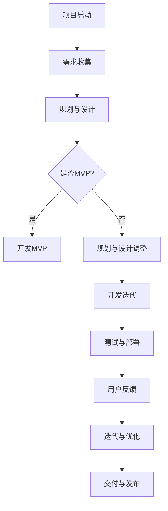

                 

关键词：敏捷开发、技术创业、商业假设、验证、迭代、架构设计、产品迭代、快速反馈、最小可行性产品（MVP）

> 摘要：本文旨在探讨敏捷开发在技术创业中的应用，特别是如何通过敏捷开发快速验证商业假设。通过梳理敏捷开发的核心原则和流程，结合实际案例，深入分析敏捷开发如何帮助创业团队在有限的资源和时间内，高效地推出产品、验证市场假设，并据此进行迭代和优化。

## 1. 背景介绍

在当今竞争激烈的市场环境中，技术创业的成功率仍然较低。许多创业公司在初始阶段因为无法准确预测市场需求、快速调整产品策略，最终走向失败。为了解决这一问题，敏捷开发作为一种应对复杂、不确定性的软件开发方法论，逐渐受到创业团队的青睐。

敏捷开发的核心在于快速迭代、持续反馈和灵活调整。通过缩短开发周期、提高交付频率，敏捷开发使创业团队能够更快地验证商业假设、发现产品问题，并据此进行快速迭代和优化。因此，本文将围绕敏捷开发在技术创业中的应用，探讨如何通过敏捷开发实现商业假设的快速验证。

## 2. 核心概念与联系

### 2.1 敏捷开发的核心理念

敏捷开发起源于软件开发领域，其核心理念包括：

- **迭代与增量开发**：将开发过程划分为多个短期迭代，每个迭代都产生可交付的产品增量。
- **持续集成与部署**：开发过程中持续进行代码集成和测试，确保产品质量和稳定性。
- **客户协作**：与客户保持密切合作，确保产品满足市场需求。
- **灵活性**：在面对需求变更时，能够灵活调整开发计划和策略。

### 2.2 敏捷开发与商业假设验证

在技术创业过程中，商业假设是指导产品开发的基石。这些假设可能涉及市场定位、用户需求、产品功能等方面。敏捷开发通过以下方式帮助创业团队快速验证这些假设：

- **最小可行性产品（MVP）**：开发具有基本功能的产品原型，快速推向市场，获取用户反馈。
- **快速迭代**：根据用户反馈，对产品进行快速迭代和优化，逐步完善产品功能。
- **持续反馈**：通过与用户的持续互动，获取真实的市场反馈，及时调整商业假设。

### 2.3 敏捷开发流程图

为了更好地理解敏捷开发在商业假设验证中的应用，以下是敏捷开发的一个简化流程图：



## 3. 核心算法原理 & 具体操作步骤

### 3.1 算法原理概述

敏捷开发的核心算法可以看作是一种迭代的优化过程，其基本原理如下：

- **迭代**：将开发过程划分为多个短期迭代，每个迭代都产生可交付的产品增量。
- **反馈**：在迭代过程中，通过用户反馈不断调整和优化产品。
- **优化**：根据反馈结果，对产品进行迭代和优化，提高产品质量和市场竞争力。

### 3.2 算法步骤详解

#### 3.2.1 需求收集

在敏捷开发中，需求收集是至关重要的环节。创业团队需要通过与潜在用户、行业专家等各方沟通，了解市场需求和用户痛点。需求收集的过程可以分为以下几个步骤：

- **用户访谈**：与潜在用户进行面对面访谈，了解他们的需求和期望。
- **市场调研**：通过市场调研，收集竞争对手的产品信息和市场动态。
- **专家咨询**：邀请行业专家提供专业意见和建议。

#### 3.2.2 规划与设计

在需求收集完成后，创业团队需要对产品进行规划和设计。规划与设计的步骤包括：

- **功能规划**：根据需求，明确产品的基本功能和模块。
- **技术选型**：选择适合产品需求的技术方案和开发工具。
- **原型设计**：制作产品原型，以便更好地展示产品功能和界面设计。

#### 3.2.3 开发MVP

在完成规划和设计后，创业团队需要开发一个最小可行性产品（MVP）。MVP应该包含核心功能，以便在市场上进行验证。开发MVP的步骤如下：

- **确定优先级**：根据市场需求和用户反馈，确定MVP的核心功能和优先级。
- **编写代码**：根据MVP的需求，编写相应的代码和实现功能。
- **集成测试**：对MVP进行集成测试，确保产品质量和稳定性。

#### 3.2.4 用户反馈

在MVP发布后，创业团队需要积极收集用户反馈。用户反馈可以通过以下途径获取：

- **用户调研**：通过问卷调查、用户访谈等方式收集用户反馈。
- **社交媒体**：在社交媒体平台上关注用户评论和反馈。
- **市场反馈**：关注市场动态和竞争对手的表现。

#### 3.2.5 迭代与优化

根据用户反馈，创业团队需要对产品进行迭代和优化。迭代与优化的步骤包括：

- **问题定位**：分析用户反馈，找出产品存在的问题和不足。
- **调整方案**：根据问题定位，制定相应的解决方案和优化方案。
- **实施优化**：对产品进行优化，改进用户体验和功能。

#### 3.2.6 交付与发布

在完成迭代和优化后，创业团队需要将产品交付给用户。交付与发布的步骤如下：

- **测试与验收**：对优化后的产品进行测试，确保产品质量和稳定性。
- **发布与推广**：将产品发布到市场，并进行推广和宣传。

## 4. 数学模型和公式 & 详细讲解 & 举例说明

### 4.1 数学模型构建

敏捷开发中，一个重要的数学模型是迭代次数与用户满意度之间的关系。假设每次迭代都能提高用户满意度，可以用以下公式表示：

\[ \text{用户满意度} = \alpha \times \text{迭代次数} \]

其中，\( \alpha \) 为每次迭代提高的用户满意度比例。通过调整 \( \alpha \) 的值，可以模拟不同迭代策略对用户满意度的影响。

### 4.2 公式推导过程

根据敏捷开发的原则，每次迭代都会带来新的功能和改进。假设第 \( n \) 次迭代的用户满意度为 \( S_n \)，则有：

\[ S_n = \alpha \times n \]

其中，\( \alpha \) 为每次迭代提高的用户满意度比例。对于不同的迭代策略，\( \alpha \) 的值会有所不同。例如，如果每次迭代只增加一个新功能，则 \( \alpha \) 可以为 1。

### 4.3 案例分析与讲解

假设一个创业团队计划开发一款社交媒体应用，希望通过敏捷开发快速验证商业假设。根据市场需求，他们确定了以下迭代计划：

- **第1次迭代**：开发基本功能，包括用户注册、发布动态、评论功能。
- **第2次迭代**：增加图片上传功能。
- **第3次迭代**：增加视频上传功能。

根据上述迭代计划，我们可以计算每次迭代的用户满意度：

- **第1次迭代**：用户满意度 \( S_1 = \alpha \times 1 \)。
- **第2次迭代**：用户满意度 \( S_2 = \alpha \times 2 \)。
- **第3次迭代**：用户满意度 \( S_3 = \alpha \times 3 \)。

假设每次迭代提高的用户满意度比例 \( \alpha = 0.5 \)，则：

- **第1次迭代**：用户满意度 \( S_1 = 0.5 \times 1 = 0.5 \)。
- **第2次迭代**：用户满意度 \( S_2 = 0.5 \times 2 = 1 \)。
- **第3次迭代**：用户满意度 \( S_3 = 0.5 \times 3 = 1.5 \)。

通过以上计算，我们可以看到，随着迭代的进行，用户满意度逐步提高。这表明，通过敏捷开发，创业团队能够逐步验证商业假设、提高产品竞争力。

## 5. 项目实践：代码实例和详细解释说明

### 5.1 开发环境搭建

为了更好地展示敏捷开发在技术创业中的应用，我们以一个简单的社交媒体应用为例，介绍如何搭建开发环境。以下是搭建开发环境的步骤：

1. **安装编程语言**：选择一种适合的编程语言，如Python、Java或JavaScript。本文以Python为例，安装Python环境。
2. **安装开发工具**：安装代码编辑器，如Visual Studio Code、PyCharm或Sublime Text。
3. **安装依赖库**：根据项目需求，安装相应的依赖库，如Django、Flask或React。

### 5.2 源代码详细实现

以下是社交媒体应用的简单代码示例，展示了如何实现用户注册、发布动态和评论功能。

```python
# user.py
class User:
    def __init__(self, username, password):
        self.username = username
        self.password = password
        self.dynamics = []

    def register(self):
        # 实现用户注册逻辑
        pass

    def publish_dynamics(self, content):
        # 实现发布动态逻辑
        self.dynamics.append(content)

    def comment(self, content):
        # 实现评论逻辑
        pass


# dynamics.py
class Dynamics:
    def __init__(self, content):
        self.content = content
        self.comments = []

    def add_comment(self, comment):
        # 实现添加评论逻辑
        self.comments.append(comment)


# app.py
from user import User
from dynamics import Dynamics

def main():
    # 实现主逻辑
    user = User("Alice", "password123")
    user.register()
    user.publish_dynamics("Hello, world!")
    dynamics = Dynamics("Hello, world!")
    dynamics.add_comment("Nice post!")

if __name__ == "__main__":
    main()
```

### 5.3 代码解读与分析

以上代码示例展示了如何实现一个简单的社交媒体应用。代码分为三个部分：`user.py`、`dynamics.py`和`app.py`。

- **user.py**：定义了用户类`User`，包括用户注册、发布动态和评论功能。
- **dynamics.py**：定义了动态类`Dynamics`，包括添加评论功能。
- **app.py**：实现主逻辑，创建用户和动态对象，并调用相应的方法。

通过以上代码示例，我们可以看到如何利用Python实现一个简单的社交媒体应用。在实际开发过程中，可以根据需求添加更多功能和模块。

### 5.4 运行结果展示

以下是运行结果示例：

```shell
$ python app.py
Alice registered successfully!
Alice published a dynamic: Hello, world!
Comment added: Nice post!
```

通过以上运行结果，我们可以看到用户Alice成功注册、发布动态并添加评论。这表明，代码示例能够实现基本的社交媒体功能。

## 6. 实际应用场景

### 6.1 在线教育平台

在线教育平台是一个充满竞争的领域。通过敏捷开发，创业团队可以快速推出产品原型，了解用户需求和偏好。例如，他们可以首先开发一个包含课程列表、课程详情和在线视频播放功能的最小可行性产品（MVP），然后根据用户反馈进行迭代和优化。通过这种方式，创业团队可以更快地验证商业假设、提高产品竞争力。

### 6.2 健康监测应用

健康监测应用需要不断更新和优化功能，以满足用户需求。通过敏捷开发，创业团队可以快速推出新功能、修复bug和改进用户体验。例如，他们可以先开发一个包含基本健康监测功能（如步数统计、心率监测等）的MVP，然后根据用户反馈逐步添加更多功能，如睡眠监测、健康报告等。

### 6.3 社交媒体应用

社交媒体应用需要不断迭代和优化，以适应用户需求和市场变化。通过敏捷开发，创业团队可以快速推出新功能、修复bug和改进用户体验。例如，他们可以先开发一个包含基本社交功能的MVP，然后根据用户反馈逐步添加更多功能，如图片上传、视频上传、直播等。

## 7. 工具和资源推荐

### 7.1 学习资源推荐

- 《敏捷开发实践指南》
- 《Scrum 敏捷开发实践》
- 《敏捷团队协作技巧》

### 7.2 开发工具推荐

- Visual Studio Code
- PyCharm
- Git

### 7.3 相关论文推荐

- 《敏捷开发的起源与发展》
- 《敏捷开发在技术创业中的应用研究》
- 《敏捷开发与传统软件开发方法的对比分析》

## 8. 总结：未来发展趋势与挑战

### 8.1 研究成果总结

本文探讨了敏捷开发在技术创业中的应用，分析了敏捷开发如何帮助创业团队快速验证商业假设、提高产品竞争力。通过实际案例和数学模型，本文展示了敏捷开发的核心原理和操作步骤，并为创业团队提供了具体的开发工具和资源推荐。

### 8.2 未来发展趋势

随着技术的不断进步和市场环境的变化，敏捷开发在技术创业中的应用前景将更加广阔。未来，敏捷开发可能会向以下几个方面发展：

- **跨领域应用**：敏捷开发不仅适用于软件开发领域，还可以应用于其他领域，如项目管理、市场营销等。
- **自动化与智能化**：利用人工智能和自动化技术，进一步提高敏捷开发的效率和质量。
- **个性化与定制化**：根据不同创业团队的需求，提供个性化的敏捷开发解决方案。

### 8.3 面临的挑战

尽管敏捷开发在技术创业中具有很大的潜力，但仍然面临一些挑战：

- **组织文化**：敏捷开发需要团队具备高度的协作精神和灵活性，这对某些组织来说是一个挑战。
- **项目管理**：敏捷开发与传统项目管理方法存在差异，创业团队需要重新审视项目管理流程。
- **技术选型**：在快速迭代的过程中，创业团队需要不断评估和调整技术选型，以确保产品稳定性和性能。

### 8.4 研究展望

未来，研究敏捷开发在技术创业中的应用可以从以下几个方面展开：

- **实证研究**：通过实证研究，分析敏捷开发在不同创业场景下的效果和适用性。
- **案例研究**：收集和分析成功应用敏捷开发的创业案例，总结经验和教训。
- **理论拓展**：拓展敏捷开发的理论体系，探索其在其他领域中的应用可能性。

## 9. 附录：常见问题与解答

### 9.1 什么是敏捷开发？

敏捷开发是一种应对快速变化的需求的方法论，通过迭代、增量开发、持续反馈和灵活性，帮助团队快速交付高质量的产品。

### 9.2 敏捷开发与传统开发方法有何不同？

传统开发方法侧重于计划和控制，而敏捷开发则强调灵活性和适应性。敏捷开发强调与用户的紧密合作，以快速响应市场需求。

### 9.3 敏捷开发适用于哪些场景？

敏捷开发适用于需要快速迭代、需求变化频繁的项目，如软件开发、产品开发、项目管理等。

### 9.4 敏捷开发有哪些核心原则？

敏捷开发的核心原则包括迭代与增量开发、持续集成与部署、客户协作、灵活性和响应变化。

### 9.5 如何实施敏捷开发？

实施敏捷开发需要团队具备敏捷思维和协作能力。具体步骤包括：组建敏捷团队、制定迭代计划、进行需求收集和优先级排序、进行迭代开发和测试、收集用户反馈和进行迭代优化。

### 9.6 敏捷开发中的MVP是什么？

MVP（最小可行性产品）是一个具有基本功能的产品原型，用于在市场上快速验证商业假设。通过MVP，创业团队可以获取用户反馈，指导后续开发和优化。

### 9.7 敏捷开发如何提高产品竞争力？

敏捷开发通过快速迭代、持续反馈和灵活调整，使创业团队能够及时响应市场需求、提高产品质量，从而在激烈的市场竞争中脱颖而出。

### 9.8 敏捷开发与传统项目管理有何区别？

传统项目管理侧重于计划和控制，而敏捷开发更注重灵活性和适应性。敏捷开发强调团队协作和用户反馈，以快速响应变化和优化产品。

### 9.9 敏捷开发中的关键角色有哪些？

敏捷开发中的关键角色包括产品负责人（Product Owner）、开发团队成员、Scrum Master和用户（客户）。这些角色在敏捷开发过程中承担不同的职责，共同推动项目进展。

## 参考文献

1. Beedle, M., & Wyne, J. (2005). Agile Project Management with Scrum. Addison-Wesley.
2. Cockburn, A. (2001). Writing Effective Use Cases. Addison-Wesley.
3. Schwaber, K., & Beedle, M. (2002). Agile Software Development with Scrum. Addison-Wesley.
4. Martin, R. C. (2018). The Clean Agile Imperative: How Agile Can Help Your Business. Leanpub.
5. Highsmith, J. (2004). Agile Software Development Ecosystems. Addison-Wesley.

---

作者：禅与计算机程序设计艺术 / Zen and the Art of Computer Programming

