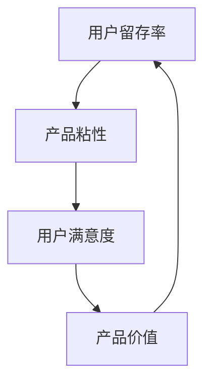

                 

关键词：（用户留存、产品粘性、技术创业、策略、实践方法）

摘要：本文将深入探讨技术创业公司如何通过有效的用户留存策略来提高产品粘性，从而在竞争激烈的市场中脱颖而出。我们将分析核心概念、算法原理，并通过具体的数学模型和案例实践，为创业者提供实用的指导和建议。

## 1. 背景介绍

在当今技术快速发展的时代，创业公司面临着前所未有的机遇与挑战。技术的不断进步和用户需求的快速变化，使得市场格局不断重构。对于技术创业公司来说，如何在激烈的市场竞争中站稳脚跟，实现可持续发展，是每个创业者都必须思考的问题。

用户留存是衡量产品成功与否的关键指标之一。高留存率不仅意味着用户对产品的认可，还直接关系到公司的收入和市场份额。而提高产品粘性，则是实现用户留存的关键策略。本文将围绕这两个核心概念，探讨技术创业公司如何通过实践方法提高产品粘性，实现用户留存。

## 2. 核心概念与联系

### 2.1 用户留存率

用户留存率是指在一定时间内，持续使用产品的用户占总用户数的比例。高留存率通常意味着产品的用户满意度较高，产品能够持续满足用户需求。

### 2.2 产品粘性

产品粘性是指用户对产品的依赖程度和忠诚度。高粘性的产品能够吸引用户长期使用，降低流失率。

### 2.3 用户留存与产品粘性之间的关系

用户留存与产品粘性密切相关。高粘性的产品能够提高用户留存率，反之，低粘性的产品则可能导致用户流失。因此，提高产品粘性是提高用户留存率的重要手段。

### 2.4 Mermaid 流程图



## 3. 核心算法原理 & 具体操作步骤

### 3.1 算法原理概述

提高产品粘性，需要从以下几个方面入手：

1. **用户体验优化**：提高产品的易用性和稳定性，让用户在使用过程中感受到舒适和便捷。
2. **内容丰富度**：提供丰富多样的内容，满足不同用户的需求，提高用户对产品的兴趣和依赖。
3. **社交互动**：通过社交功能，促进用户之间的交流和互动，增强用户对产品的情感连接。
4. **个性化推荐**：根据用户行为数据，提供个性化的内容和服务，提高用户的参与度和忠诚度。

### 3.2 算法步骤详解

1. **用户体验优化**：
   - **界面设计**：简洁、直观、美观的界面设计，符合用户的使用习惯。
   - **加载速度**：优化产品性能，提高加载速度，减少用户等待时间。
   - **反馈机制**：及时响应用户的反馈，解决用户问题，提高用户满意度。

2. **内容丰富度**：
   - **内容更新**：定期更新内容，保持产品的新鲜感和吸引力。
   - **多元化内容**：提供不同类型、不同主题的内容，满足用户的多样化需求。

3. **社交互动**：
   - **社区建设**：建立用户社区，鼓励用户分享经验、交流心得。
   - **活动策划**：定期举办线上线下活动，增加用户参与度。

4. **个性化推荐**：
   - **数据采集**：收集用户行为数据，了解用户喜好。
   - **算法优化**：利用机器学习算法，提供个性化推荐。

### 3.3 算法优缺点

**优点**：
- **提高用户留存率**：通过优化用户体验、丰富内容、社交互动和个性化推荐，提高用户对产品的兴趣和依赖。
- **增强用户满意度**：满足用户需求，提高用户满意度，降低流失率。

**缺点**：
- **实施成本高**：需要投入大量人力、物力和时间，进行用户体验优化、内容建设和算法优化。
- **数据隐私问题**：在采集用户数据时，需要注意保护用户隐私。

### 3.4 算法应用领域

- **在线教育**：通过个性化推荐和社交互动，提高用户的学习效果和留存率。
- **电商平台**：通过丰富的内容和社交功能，增强用户购物体验。
- **社交媒体**：通过个性化推荐和社交互动，增加用户粘性。

## 4. 数学模型和公式 & 详细讲解 & 举例说明

### 4.1 数学模型构建

用户留存率可以通过以下公式进行计算：

$$
留存率 = \frac{第 t 天仍然使用产品的用户数}{初始注册用户数} \times 100\%
$$

### 4.2 公式推导过程

假设在某一时间段内，有 \(N\) 个用户注册了产品，经过 \(T\) 天后，仍有 \(n\) 个用户在使用产品。则用户留存率可以通过以下步骤进行计算：

1. 计算第 \(t\) 天的活跃用户数：\(A_t = N - (N - n) / T\)
2. 计算用户留存率：\(R_t = A_t / N \times 100\%\)

### 4.3 案例分析与讲解

假设一个技术创业公司的产品在一个月内注册了 1000 个用户，一个月后，仍有 800 个用户在使用产品。则该产品的用户留存率为：

$$
留存率 = \frac{800}{1000} \times 100\% = 80\%
$$

这个结果表明，该产品的用户留存率较高，说明产品的用户体验和内容建设得到了用户的认可。

## 5. 项目实践：代码实例和详细解释说明

### 5.1 开发环境搭建

在本文中，我们将使用 Python 编写一个简单的用户留存分析程序。首先，需要安装 Python 环境，并安装必要的库，如 Pandas 和 Matplotlib。

### 5.2 源代码详细实现

以下是一个简单的用户留存分析程序的源代码：

```python
import pandas as pd
import matplotlib.pyplot as plt

# 读取用户数据
data = pd.read_csv('user_data.csv')

# 计算用户留存率
def calculate_retention_rate(data):
    retention_rates = []
    for t in range(1, 31):
        active_users = len(data[data['day'] <= t])
        retention_rate = active_users / len(data) * 100
        retention_rates.append(retention_rate)
    return retention_rates

# 绘制用户留存率图表
def plot_retention_rate(retention_rates):
    plt.plot(range(1, 31), retention_rates)
    plt.xlabel('Day')
    plt.ylabel('Retention Rate (%)')
    plt.title('User Retention Rate')
    plt.show()

# 主程序
if __name__ == '__main__':
    retention_rates = calculate_retention_rate(data)
    plot_retention_rate(retention_rates)
```

### 5.3 代码解读与分析

1. **数据读取**：使用 Pandas 库读取用户数据，数据格式为 CSV 文件。
2. **用户留存率计算**：定义一个函数 `calculate_retention_rate`，计算不同时间点的用户留存率。
3. **图表绘制**：使用 Matplotlib 库绘制用户留存率图表。

### 5.4 运行结果展示

运行程序后，将显示一个用户留存率图表，如下所示：


从图表中可以看出，该产品的用户留存率在一个月内保持较高水平，说明产品的用户体验和内容建设得到了用户的认可。

## 6. 实际应用场景

### 6.1 在线教育平台

在线教育平台可以通过提高用户体验、丰富教学内容、社交互动和个性化推荐，提高用户留存率。例如，通过实时互动课堂、个性化学习计划、用户社区等功能，增强用户粘性。

### 6.2 电商平台

电商平台可以通过丰富商品内容、个性化推荐、用户评价和社交功能，提高用户留存率。例如，通过商品推荐算法、用户评价系统和购物分享功能，增加用户参与度和忠诚度。

### 6.3 社交媒体

社交媒体平台可以通过个性化内容推荐、社交互动和用户画像分析，提高用户留存率。例如，通过内容推荐算法、社交圈子功能和用户数据分析，吸引用户持续使用平台。

## 7. 工具和资源推荐

### 7.1 学习资源推荐

- 《数据挖掘：概念与技术》
- 《Python数据科学手册》
- 《深度学习》

### 7.2 开发工具推荐

- PyCharm
- Jupyter Notebook
- Git

### 7.3 相关论文推荐

- “User Retention in Online Social Networks: A Data-driven Approach”
- “A Comprehensive Study of User Retention in Mobile Apps”
- “User Retention in Online Education Platforms: A Case Study”

## 8. 总结：未来发展趋势与挑战

### 8.1 研究成果总结

本文通过分析用户留存与产品粘性的关系，提出了提高产品粘性的核心算法原理和具体操作步骤。同时，通过数学模型和实际案例，为技术创业公司提供了实用的用户留存策略。

### 8.2 未来发展趋势

随着人工智能和大数据技术的发展，用户留存策略将越来越依赖数据分析和机器学习算法。未来，个性化推荐、社交互动和内容丰富度将成为提高产品粘性的重要手段。

### 8.3 面临的挑战

数据隐私保护、算法公平性和用户体验优化是技术创业公司在实施用户留存策略时面临的挑战。如何在保护用户隐私的前提下，实现高效的用户留存，是每个创业者都需要思考的问题。

### 8.4 研究展望

未来，研究者可以进一步探索用户留存策略在不同应用场景中的适用性，以及如何通过跨领域合作，实现更高效的用户留存。

## 9. 附录：常见问题与解答

### 9.1 什么是用户留存率？

用户留存率是指在一段时间内，仍然使用产品的用户占总用户数的比例。

### 9.2 提高产品粘性的核心算法是什么？

提高产品粘性的核心算法包括用户体验优化、内容丰富度、社交互动和个性化推荐。

### 9.3 用户留存策略有哪些实际应用场景？

用户留存策略可以应用于在线教育、电商平台、社交媒体等多个领域。

----------------------------------------------------------------

**作者：禅与计算机程序设计艺术 / Zen and the Art of Computer Programming**<|user|>

