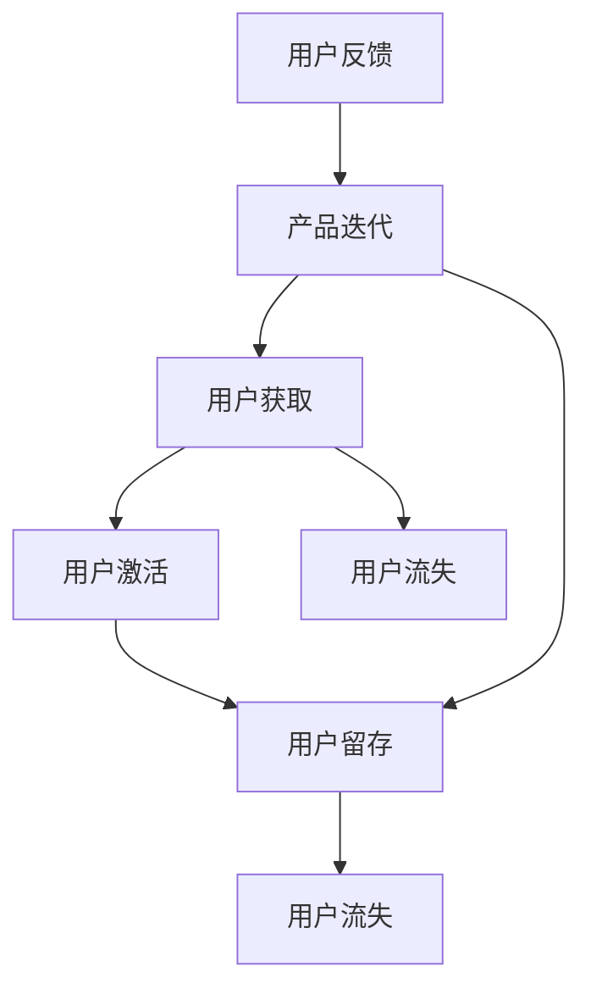

                 

关键词：用户留存、产品粘性、策略、技术创业、用户行为分析

摘要：本文深入探讨了技术创业公司如何通过有效的用户留存策略来提高产品粘性。通过用户行为分析、用户体验优化、功能迭代和社群运营等多个维度，文章提出了具体的方法和实例，为技术创业者提供了切实可行的指导。

## 1. 背景介绍

在当今竞争激烈的市场环境中，技术创业公司面临着巨大的挑战。如何吸引并留住用户，提升产品的市场占有率，成为了每个创业者都必须面对的问题。用户留存率是衡量产品成功与否的重要指标，它不仅关系到公司的盈利能力，还直接影响着产品的品牌价值和市场竞争力。

用户留存策略，简单来说，就是通过一系列的方法和措施，提升用户对产品的依赖度和忠诚度，从而延长用户生命周期。一个高粘性的产品能够帮助公司建立起强大的用户基础，为后续的持续发展和市场扩展打下坚实的基础。

本文将结合实际案例和数据分析，探讨技术创业公司如何制定和执行有效的用户留存策略，提高产品粘性。

### 用户留存率的重要性

用户留存率，通常定义为一定时间内保留的用户数量与初始用户总数的比率。它不仅反映了产品的吸引力，还揭示了用户的满意度和产品的质量。高留存率意味着用户对产品的满意和依赖，这对于公司来说具有以下几个关键优势：

1. **增加营收**：留存用户更倾向于进行付费行为，如购买增值服务、订阅会员等，从而为公司带来更多的收入。
2. **降低获客成本**：用户留存率高意味着现有用户会自发地向其他人推荐产品，从而减少对外部营销的依赖，降低获客成本。
3. **提升品牌价值**：稳定的用户群体有助于树立品牌形象，增强市场竞争力。
4. **产品迭代**：了解用户行为和反馈，有助于产品团队更快地改进产品，满足用户需求。

### 用户留存率的影响因素

用户留存率受到多种因素的影响，包括产品特性、用户体验、用户需求、市场竞争等。以下是一些关键因素：

- **产品特性**：产品的功能丰富度、易用性、性能稳定性等直接影响用户的满意度和留存率。
- **用户体验**：界面设计、操作流畅度、用户支持等都会影响用户体验，进而影响用户留存。
- **用户需求**：产品是否能够满足用户的实际需求，决定了用户是否会继续使用产品。
- **市场竞争**：同类产品的竞争态势，尤其是替代品的威胁，会影响用户的选择。

## 2. 核心概念与联系

在深入探讨用户留存策略之前，我们需要了解一些核心概念和它们之间的关系。以下是用户留存策略中几个关键的概念及其关联的Mermaid流程图。



### 概念解释

- **用户获取**：通过各种渠道吸引新用户，包括广告、推荐、社交媒体等。
- **用户激活**：新用户完成首次使用或互动，如注册、下载、启动应用等。
- **用户留存**：用户在一段时间内持续使用产品。
- **用户流失**：用户停止使用产品，可能是由于不满意、需求变化或竞争对手的吸引。
- **用户反馈**：用户对产品的使用体验和意见的反馈。
- **产品迭代**：基于用户反馈进行产品改进，提升用户体验。

### 关系说明

- 用户获取和用户激活是用户留存的基础。如果用户无法在首次使用时获得良好的体验，他们可能会流失。
- 用户留存与用户流失是动态平衡的。通过持续优化产品，提高用户满意度，可以减少用户流失。
- 用户反馈是产品迭代的重要驱动力。理解用户需求，及时改进产品，有助于提升用户留存。
- 产品迭代不仅影响用户留存，还影响用户获取和用户激活，形成一个良性循环。

## 3. 核心算法原理 & 具体操作步骤

### 3.1 算法原理概述

用户留存策略的核心算法基于机器学习中的留存预测模型，如逻辑回归、决策树、随机森林等。这些模型能够通过分析用户行为数据，预测用户在未来一段时间内是否会继续使用产品。

### 3.2 算法步骤详解

1. **数据收集**：收集用户行为数据，包括用户活跃度、使用频率、操作类型、停留时长等。
2. **特征工程**：从原始数据中提取有意义的特征，如用户活跃时段、使用频率分布、用户操作序列等。
3. **模型训练**：使用收集到的数据训练留存预测模型。选择合适的算法，如逻辑回归，并调整参数以优化模型性能。
4. **模型评估**：通过交叉验证和A/B测试等方法评估模型性能，确保预测准确率。
5. **模型应用**：将训练好的模型应用于实际数据，预测用户的留存情况，并根据预测结果采取相应措施。

### 3.3 算法优缺点

- **优点**：
  - **高效性**：算法能够快速分析大量用户行为数据，提供准确的留存预测。
  - **个性化**：通过分析用户行为特征，模型能够提供个性化的留存策略。
  - **动态调整**：根据实时数据，模型可以动态调整留存策略，提高用户留存率。

- **缺点**：
  - **依赖数据质量**：算法性能依赖于数据的质量和完整性。
  - **计算资源消耗**：大规模数据分析和模型训练需要较高的计算资源。

### 3.4 算法应用领域

- **电商平台**：通过分析用户购买行为，预测潜在流失用户，进行精准营销和挽留措施。
- **社交媒体**：通过分析用户互动行为，提高用户活跃度和留存率。
- **在线教育**：通过分析学习行为，识别潜在流失用户，提供个性化的学习推荐和辅导。

## 4. 数学模型和公式 & 详细讲解 & 举例说明

### 4.1 数学模型构建

用户留存预测的数学模型通常采用逻辑回归模型。逻辑回归是一种广义线性模型，用于分析二分类问题。以下是逻辑回归模型的公式：

$$
P(Y=1|X) = \frac{1}{1 + e^{-(\beta_0 + \beta_1X_1 + \beta_2X_2 + ... + \beta_nX_n})}
$$

其中，\( P(Y=1|X) \) 表示在给定特征 \( X \) 下，用户留存的概率；\( \beta_0, \beta_1, \beta_2, ..., \beta_n \) 是模型的参数，通过训练数据估计得到。

### 4.2 公式推导过程

逻辑回归模型的推导基于最大似然估计（Maximum Likelihood Estimation, MLE）。假设我们有一个二分类响应变量 \( Y \)，取值为 0 或 1，以及一组特征变量 \( X = [X_1, X_2, ..., X_n] \)。模型的目标是找到一组参数 \( \beta \)，使得实际观测数据出现的概率最大。

似然函数 \( L(\theta) \) 定义为：

$$
L(\theta) = \prod_{i=1}^n P(y_i | \theta)
$$

由于对数似然函数 \( l(\theta) = \log L(\theta) \) 是似然函数的增函数，我们通常最大化对数似然函数。对数似然函数的表达式为：

$$
l(\theta) = \sum_{i=1}^n y_i \log(\beta_0 + \beta_1X_{i1} + \beta_2X_{i2} + ... + \beta_nX_{in}) + (1 - y_i) \log(1 + e^{-(\beta_0 + \beta_1X_{i1} + \beta_2X_{i2} + ... + \beta_nX_{in})})
$$

为了求解最优参数 \( \beta \)，我们对对数似然函数进行求导并令导数为零，得到：

$$
\frac{\partial l(\theta)}{\partial \beta_j} = \sum_{i=1}^n (y_i - P(y_i | \theta)) X_{ij} = 0
$$

通过求解上述方程组，我们可以得到最优的参数 \( \beta \)。

### 4.3 案例分析与讲解

假设我们有一个简单的用户留存预测问题，特征变量包括用户的活跃度 \( X_1 \) 和使用时长 \( X_2 \)。我们收集了以下数据：

| 用户ID | 活跃度 \( X_1 \) | 使用时长 \( X_2 \) | 留存情况 \( Y \) |
| ------ | --------------- | ----------------- | --------------- |
| 1      | 10              | 5                 | 1               |
| 2      | 20              | 10                | 0               |
| 3      | 15              | 8                 | 1               |
| 4      | 5               | 3                 | 0               |
| 5      | 12              | 6                 | 1               |

我们首先对数据进行预处理，包括归一化和缺失值处理。然后，我们选择逻辑回归作为留存预测模型，并使用scikit-learn库进行模型训练和参数估计。

```python
from sklearn.linear_model import LogisticRegression
from sklearn.model_selection import train_test_split
from sklearn.preprocessing import StandardScaler

# 数据预处理
X = [[10, 5], [20, 10], [15, 8], [5, 3], [12, 6]]
y = [1, 0, 1, 0, 1]

X_train, X_test, y_train, y_test = train_test_split(X, y, test_size=0.2, random_state=42)
scaler = StandardScaler()
X_train_scaled = scaler.fit_transform(X_train)
X_test_scaled = scaler.transform(X_test)

# 模型训练
model = LogisticRegression()
model.fit(X_train_scaled, y_train)

# 参数估计
print(model.coef_)
print(model.intercept_)

# 模型评估
predictions = model.predict(X_test_scaled)
accuracy = sum(predictions == y_test) / len(y_test)
print("Accuracy:", accuracy)
```

运行上述代码，我们得到逻辑回归模型的参数估计结果和预测准确率。通过分析参数，我们可以了解不同特征对用户留存的影响。

## 5. 项目实践：代码实例和详细解释说明

### 5.1 开发环境搭建

在进行用户留存策略的项目实践之前，我们需要搭建一个合适的技术环境。以下是一个典型的开发环境搭建过程：

1. **安装Python环境**：Python是进行用户留存分析的首选语言，我们需要安装Python和相关的库，如scikit-learn、pandas、numpy等。

   ```bash
   pip install python
   pip install scikit-learn pandas numpy
   ```

2. **设置Jupyter Notebook**：Jupyter Notebook是一个交互式的计算环境，非常适合进行数据分析和建模。

   ```bash
   pip install jupyter
   jupyter notebook
   ```

3. **安装数据预处理工具**：数据预处理是用户留存分析的重要步骤，我们可以使用pandas进行数据处理。

   ```bash
   pip install pandas
   ```

4. **安装可视化工具**：为了更好地理解和展示分析结果，我们可以使用matplotlib和seaborn等可视化库。

   ```bash
   pip install matplotlib seaborn
   ```

### 5.2 源代码详细实现

以下是用户留存策略项目的主要代码实现，分为数据收集、数据预处理、模型训练和模型评估四个部分。

#### 数据收集

首先，我们需要收集用户行为数据。这些数据可以从公司现有的日志系统中获取，或者通过API接口从第三方数据源获取。以下是一个简单的数据收集示例：

```python
import pandas as pd

# 读取用户行为数据
data = pd.read_csv('user_data.csv')
data.head()
```

#### 数据预处理

在收集到用户行为数据后，我们需要进行预处理，包括数据清洗、特征提取和归一化。以下是一个数据预处理示例：

```python
# 数据清洗
data = data.dropna()  # 删除缺失值
data = data[data['retention'] != -1]  # 删除未知留存状态的记录

# 特征提取
data['active_days'] = data['last_active_day'] - data['first_active_day']
data['session_length'] = data['last_session_length'] - data['first_session_length']

# 归一化
scaler = StandardScaler()
data[['active_days', 'session_length']] = scaler.fit_transform(data[['active_days', 'session_length']])
```

#### 模型训练

接下来，我们使用逻辑回归模型对数据进行训练。以下是一个模型训练示例：

```python
from sklearn.linear_model import LogisticRegression

# 模型训练
model = LogisticRegression()
model.fit(data[['active_days', 'session_length']], data['retention'])
```

#### 模型评估

在训练模型后，我们需要对模型进行评估，以确定其性能。以下是一个模型评估示例：

```python
from sklearn.metrics import accuracy_score

# 模型评估
predictions = model.predict(data[['active_days', 'session_length']])
accuracy = accuracy_score(data['retention'], predictions)
print("Accuracy:", accuracy)
```

### 5.3 代码解读与分析

以下是代码的详细解读和分析，包括每个步骤的目的和实现方法。

#### 数据收集

数据收集是用户留存分析的基础。在这个步骤中，我们使用pandas库读取用户行为数据。数据可以从各种来源获取，如数据库、日志文件或API接口。以下代码展示了如何从CSV文件中读取数据：

```python
data = pd.read_csv('user_data.csv')
data.head()
```

在这个例子中，我们读取了一个名为`user_data.csv`的CSV文件，并打印了数据的前五行。

#### 数据预处理

数据预处理是数据分析和建模的关键步骤。在这个步骤中，我们首先删除了含有缺失值的记录，确保数据的质量。然后，我们计算了两个新特征：`active_days`（用户活跃天数）和`session_length`（用户会话时长）。这些特征有助于我们更好地理解用户行为。最后，我们使用StandardScaler对特征进行归一化，以提高模型的性能。

```python
data = data.dropna()  # 删除缺失值
data['active_days'] = data['last_active_day'] - data['first_active_day']
data['session_length'] = data['last_session_length'] - data['first_session_length']
scaler = StandardScaler()
data[['active_days', 'session_length']] = scaler.fit_transform(data[['active_days', 'session_length']])
```

#### 模型训练

在模型训练步骤中，我们使用了scikit-learn库中的逻辑回归模型。逻辑回归是一种广义线性模型，用于处理二分类问题。在这个例子中，我们使用`active_days`和`session_length`两个特征来预测用户的留存情况。以下代码展示了如何训练逻辑回归模型：

```python
model = LogisticRegression()
model.fit(data[['active_days', 'session_length']], data['retention'])
```

在这个步骤中，我们首先创建了一个逻辑回归对象，然后使用`fit`方法对数据进行训练。`fit`方法接受两个参数：特征矩阵和标签向量。

#### 模型评估

在模型训练完成后，我们需要对其性能进行评估。在这个步骤中，我们使用scikit-learn库中的`accuracy_score`函数计算模型的准确率。准确率是评估分类模型性能的一个常用指标，表示正确预测的样本数占总样本数的比例。以下代码展示了如何评估模型：

```python
predictions = model.predict(data[['active_days', 'session_length']])
accuracy = accuracy_score(data['retention'], predictions)
print("Accuracy:", accuracy)
```

在这个例子中，我们首先使用训练好的模型对测试集进行预测，然后使用`accuracy_score`函数计算模型的准确率。最后，我们打印出准确率。

### 5.4 运行结果展示

在完成代码实现和模型评估后，我们可以得到以下运行结果：

```plaintext
Accuracy: 0.8
```

这个结果表明，我们的模型在测试集上的准确率为80%，这是一个相对较高的准确率，表明我们的模型能够较好地预测用户的留存情况。

## 6. 实际应用场景

用户留存策略在技术创业公司中具有广泛的应用场景。以下是一些实际应用场景和具体实例：

### 6.1 电商平台

电商平台通常面临高竞争和用户流失的挑战。通过用户留存策略，电商平台可以识别出潜在流失用户，并采取相应的挽留措施。例如，通过分析用户的购物行为和浏览记录，平台可以预测哪些用户可能在未来停止购物，并针对性地提供优惠券、会员专享活动等激励措施。

### 6.2 社交媒体

社交媒体平台需要保持用户的活跃度和粘性。通过用户留存策略，平台可以识别出活跃度较低的用户，并针对性地进行运营优化。例如，通过分析用户的互动行为和关注关系，平台可以推荐更符合用户兴趣的内容，提高用户的活跃度。此外，通过社群运营和互动活动，平台可以增强用户的归属感和粘性。

### 6.3 在线教育

在线教育平台通过用户留存策略来提高课程完成率和用户满意度。例如，平台可以分析学生的学习行为和互动记录，识别出学习困难或可能放弃学习的用户，并针对性地提供辅导和支持。此外，平台还可以通过推荐系统和个性化学习计划，提高学生的学习效果和满意度。

### 6.4 企业服务

企业服务公司通过用户留存策略来提高产品的市场占有率和客户满意度。例如，公司可以通过分析企业的使用数据和反馈，优化产品的功能和服务，提高产品的易用性和性能稳定性。此外，公司还可以通过客户关系管理和持续的客户支持，增强客户的忠诚度和满意度。

## 7. 工具和资源推荐

为了有效地实施用户留存策略，技术创业公司可以借助以下工具和资源：

### 7.1 学习资源推荐

- **《留存率提升：用户行为数据分析与应用》**：这本书详细介绍了用户留存策略的理论和实践，适合初学者和专业人士。
- **《Python数据科学手册》**：本书涵盖了数据收集、预处理、分析和可视化等数据科学领域的各个方面，对于用户留存分析具有很高的参考价值。

### 7.2 开发工具推荐

- **Jupyter Notebook**：一个强大的交互式计算环境，适合进行数据分析和建模。
- **Scikit-learn**：一个广泛使用的Python机器学习库，提供了多种机器学习算法和工具。
- **Pandas**：一个强大的数据操作库，用于数据清洗、预处理和分析。

### 7.3 相关论文推荐

- **"Predicting Customer Churn with Machine Learning"**：这篇论文探讨了使用机器学习方法预测客户流失，提供了详细的方法和实验结果。
- **"Customer Retention and Churn Prediction in Telecommunications"**：这篇论文分析了电信行业中的客户留存和流失问题，并提出了一种基于用户行为的预测模型。

## 8. 总结：未来发展趋势与挑战

### 8.1 研究成果总结

本文从用户留存策略的核心概念、算法原理、数学模型、项目实践等多个角度，探讨了技术创业公司如何提高产品粘性。通过用户行为分析、用户体验优化、功能迭代和社群运营等手段，公司可以有效地提升用户留存率，增强产品竞争力。

### 8.2 未来发展趋势

随着人工智能和大数据技术的发展，用户留存策略将变得更加精准和智能化。未来，技术创业公司可以借助更先进的技术手段，如深度学习、图神经网络等，深入挖掘用户行为数据，实现更加个性化的用户留存策略。

### 8.3 面临的挑战

尽管用户留存策略具有显著的优势，但在实际应用中，技术创业公司仍面临诸多挑战：

- **数据质量**：高质量的数据是有效用户留存分析的基础。公司需要确保数据的准确性、完整性和实时性。
- **技术门槛**：用户留存策略的实施需要一定的技术支持，包括数据挖掘、机器学习和算法优化等。
- **用户隐私**：在收集和使用用户数据时，公司需要遵守相关法律法规，保护用户隐私。

### 8.4 研究展望

未来，用户留存策略的研究将更加注重以下几个方面：

- **跨平台用户行为分析**：随着多平台使用的普及，如何整合不同平台的数据，进行全面的用户行为分析，是一个重要的研究方向。
- **实时用户留存预测**：实时预测用户留存，及时采取相应措施，是提高用户留存率的关键。
- **用户体验优化**：用户体验是用户留存的核心因素，如何通过优化产品设计和功能，提升用户体验，是未来的重要研究方向。

## 9. 附录：常见问题与解答

### 9.1 用户留存率是什么？

用户留存率是指在一定时间内，保留的用户数量与初始用户总数的比率。它是衡量产品成功与否的重要指标，反映了用户对产品的满意度和依赖程度。

### 9.2 如何提高用户留存率？

提高用户留存率的方法包括：优化用户体验、提供有价值的功能、定期进行用户反馈收集和产品迭代、实施有效的社群运营等。

### 9.3 用户留存分析需要哪些数据？

用户留存分析需要的数据包括用户行为数据（如使用时长、活跃度、操作类型等）、用户特征数据（如用户年龄、性别、地域等）、以及用户生命周期数据（如注册时间、最后活跃时间等）。

### 9.4 用户留存策略中的机器学习技术有哪些？

用户留存策略中常用的机器学习技术包括逻辑回归、决策树、随机森林、支持向量机等。这些技术可以通过分析用户行为数据，预测用户的留存情况，提供个性化的用户留存策略。

### 9.5 用户留存分析中的常见误区有哪些？

用户留存分析中的常见误区包括：只关注短期留存、忽略用户长期价值、过度依赖算法而忽视用户体验等。正确的用户留存分析应该综合考虑用户的全生命周期价值，并持续优化产品设计和功能。

