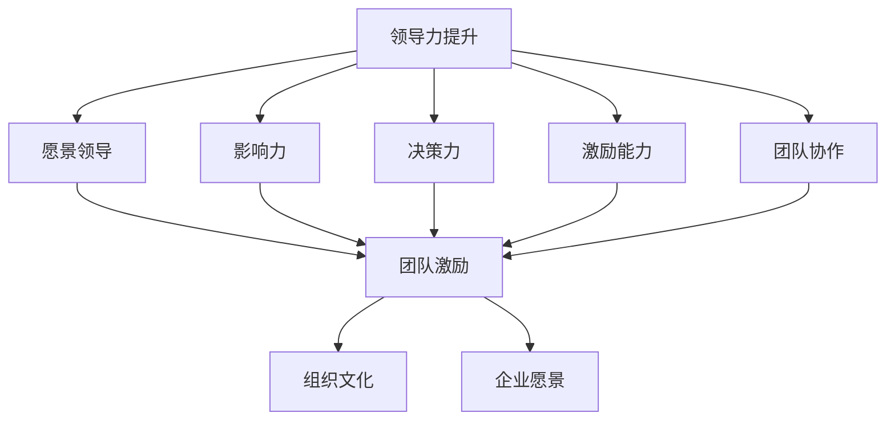

                 

关键词：技术创业、领导力、团队激励、领导艺术、IT管理

摘要：在技术创业的道路上，领导力提升和团队激励是决定企业成败的关键因素。本文将深入探讨技术创业者在领导力提升、团队激励以及组织文化建设等方面的实践与策略，旨在为技术创业者提供一套全面、实用的领导力提升和团队激励方法。

## 1. 背景介绍

技术创业，是指通过技术创新、产品开发等方式，创建新的商业模式和市场需求。技术创业者往往具备深厚的专业技术和创新精神，但领导力却往往是他们面临的一大挑战。在快速变化的市场环境中，技术创业者不仅需要具备技术视野，还需要具备领导力，以引领团队不断前进，应对各种挑战。

领导力，是指个体或集体在特定情境下，通过影响力、决策和行动，引导、激励和影响他人共同实现目标的能力。团队激励，则是通过激励手段激发团队成员的工作热情和创造力，提高团队整体绩效。

本文旨在通过分析技术创业者的领导力需求和团队激励策略，探讨如何提升领导力和激励团队，以推动技术创业项目的成功。

## 2. 核心概念与联系

在探讨技术创业者的领导力提升和团队激励之前，我们首先需要明确几个核心概念，包括领导力、团队激励、组织文化和企业愿景等。

### 2.1 领导力

领导力是一种复杂的多维能力，包括但不限于以下几个方面：

- **愿景领导**：明确企业的发展方向和目标，为团队提供清晰的愿景。
- **影响力**：通过个人魅力、专业知识和沟通技巧，影响团队成员。
- **决策力**：在复杂多变的环境中，做出快速、准确的决策。
- **激励能力**：激发团队成员的潜力，提升团队绩效。
- **团队协作**：建立高效的团队协作机制，促进团队共同成长。

### 2.2 团队激励

团队激励是指通过激励手段，激发团队成员的工作热情和创造力。常见的激励手段包括：

- **物质激励**：提供有竞争力的薪酬、奖金等。
- **精神激励**：认可和奖励团队成员的成就，提供成长机会。
- **团队建设**：组织团队活动，增强团队凝聚力。
- **绩效管理**：通过明确的绩效指标和考核机制，激励团队成员。

### 2.3 组织文化和企业愿景

组织文化是企业价值观、行为规范和共同信念的集合，是企业的软实力。一个积极向上的组织文化能够激发员工的积极性，提高团队凝聚力。

企业愿景是指企业长期追求的目标和愿景，是企业的精神支柱。一个清晰的企业愿景能够为团队成员提供方向和动力。

### 2.4 Mermaid 流程图



## 3. 核心算法原理 & 具体操作步骤

### 3.1 算法原理概述

技术创业者的领导力提升和团队激励，可以看作是一种基于人本管理的算法。该算法的核心在于通过以下几个步骤，实现领导力的提升和团队的激励：

1. **明确愿景和目标**：制定清晰的企业愿景和目标，为团队提供方向和动力。
2. **建立有效的沟通机制**：通过定期会议、内部沟通工具等方式，保持团队内部的沟通畅通。
3. **培养团队成员的能力**：提供培训、晋升机会等，帮助团队成员提升技能和能力。
4. **激励和奖励**：通过物质激励和精神激励，激发团队成员的积极性。
5. **建立积极的组织文化**：通过团队建设、企业文化建设等活动，营造积极向上的工作氛围。

### 3.2 算法步骤详解

1. **制定企业愿景和目标**：首先，技术创业者需要明确企业的愿景和目标，这需要基于企业的核心竞争力、市场环境和客户需求。企业愿景和目标应该是具体、可衡量和有时限的。

2. **建立有效的沟通机制**：技术创业者需要建立一个畅通的内部沟通机制，包括定期召开团队会议、使用内部沟通工具等。有效的沟通可以确保团队成员对企业的愿景和目标有清晰的理解，也可以及时发现和解决问题。

3. **培养团队成员的能力**：技术创业者应该关注团队成员的能力提升，通过提供培训、晋升机会等方式，帮助团队成员提升技能和能力。这不仅可以提高团队的整体绩效，也可以增强团队成员的归属感和忠诚度。

4. **激励和奖励**：技术创业者应该根据团队的表现和个人的贡献，给予适当的激励和奖励。物质激励可以包括奖金、股票期权等，精神激励可以包括公开表彰、团队活动等。

5. **建立积极的组织文化**：技术创业者需要通过一系列活动，如团队建设、企业文化活动等，营造积极向上的工作氛围。一个积极的组织文化可以增强团队的凝聚力，提高团队的整体绩效。

### 3.3 算法优缺点

**优点**：

- **提升领导力**：通过明确的愿景和目标，技术创业者可以提升自己的领导力，更好地引导团队。
- **增强团队凝聚力**：通过有效的沟通机制和激励机制，可以增强团队的凝聚力。
- **提高团队绩效**：通过培养团队成员的能力和建立积极的组织文化，可以提高团队的整体绩效。

**缺点**：

- **需要时间和资源**：实施领导力提升和团队激励需要时间和资源，可能需要一定的投资。
- **管理难度较大**：技术创业者需要具备一定的管理能力，否则可能难以实现有效的领导力提升和团队激励。

### 3.4 算法应用领域

该算法适用于所有技术创业企业，尤其是在初创阶段，领导力提升和团队激励对于企业的生存和发展至关重要。

## 4. 数学模型和公式 & 详细讲解 & 举例说明

### 4.1 数学模型构建

在领导力提升和团队激励的过程中，我们可以构建一个简单的数学模型来分析团队成员的工作绩效。

假设团队成员的工作绩效 \( P \) 可以表示为：

\[ P = f(L, E, C) \]

其中，\( L \) 代表领导力，\( E \) 代表团队成员的能力，\( C \) 代表组织文化。

### 4.2 公式推导过程

首先，我们定义领导力 \( L \) 为：

\[ L = f(V, I, D, M, T) \]

其中，\( V \) 代表愿景领导，\( I \) 代表影响力，\( D \) 代表决策力，\( M \) 代表激励能力，\( T \) 代表团队协作。

然后，我们定义团队成员的能力 \( E \) 为：

\[ E = f(S, T) \]

其中，\( S \) 代表专业技能，\( T \) 代表团队合作能力。

最后，我们定义组织文化 \( C \) 为：

\[ C = f(C_1, C_2, \ldots, C_n) \]

其中，\( C_1, C_2, \ldots, C_n \) 代表组织文化的各个维度。

将这些定义代入原始公式，我们得到：

\[ P = f(f(V, I, D, M, T), f(S, T), f(C_1, C_2, \ldots, C_n)) \]

### 4.3 案例分析与讲解

以某初创技术企业为例，该企业的领导力 \( L \) 包括：

- 愿景领导 \( V \)：明确的商业模式和市场定位。
- 影响力 \( I \)：技术创业者的专业背景和行业影响力。
- 决策力 \( D \)：快速决策和有效执行的策略。
- 激励能力 \( M \)：提供有竞争力的薪酬和晋升机制。
- 团队协作 \( T \)：高效的团队协作和沟通。

团队成员的能力 \( E \) 包括：

- 专业技能 \( S \)：高级编程技能和项目管理能力。
- 团队合作能力 \( T \)：良好的团队协作和沟通技巧。

组织文化 \( C \) 包括：

- 创新文化 \( C_1 \)：鼓励创新和尝试新思路。
- 学习文化 \( C_2 \)：提供学习机会和成长空间。
- 责任文化 \( C_3 \)：明确责任和任务，确保工作高效。

根据以上数据，我们可以计算出团队成员的工作绩效 \( P \)：

\[ P = f(L, E, C) \]
\[ P = f(f(V, I, D, M, T), f(S, T), f(C_1, C_2, C_3)) \]

通过这个简单的数学模型，我们可以看到领导力、团队成员能力和组织文化对于工作绩效的影响。技术创业者可以通过调整这些因素，来提升团队的工作绩效。

## 5. 项目实践：代码实例和详细解释说明

### 5.1 开发环境搭建

在这个项目中，我们将使用 Python 语言来构建一个简单的领导力提升和团队激励系统。首先，需要安装 Python 解释器和相关库，如 Flask（用于构建 Web 应用程序）和 SQLAlchemy（用于数据库操作）。

```bash
pip install python
pip install flask
pip install sqlalchemy
```

### 5.2 源代码详细实现

以下是该项目的主要代码实现：

```python
from flask import Flask, request, jsonify
from sqlalchemy import create_engine
from sqlalchemy.orm import sessionmaker

app = Flask(__name__)

# 数据库配置
DATABASE_URI = 'sqlite:///leadership.db'
engine = create_engine(DATABASE_URI)
Session = sessionmaker(bind=engine)

# 创建数据库表
@app.before_first_request
def create_tables():
    with engine.connect() as connection:
        connection.execute('''CREATE TABLE IF NOT EXISTS team_member (
            id INTEGER PRIMARY KEY AUTOINCREMENT,
            name TEXT NOT NULL,
            skill_level INTEGER NOT NULL,
            collaboration_level INTEGER NOT NULL
        )''')

        connection.execute('''CREATE TABLE IF NOT EXISTS leadership (
            id INTEGER PRIMARY KEY AUTOINCREMENT,
            vision TEXT NOT NULL,
            influence TEXT NOT NULL,
            decisionMaking TEXT NOT NULL,
            motivation TEXT NOT NULL,
            team_cohesion TEXT NOT NULL
        )''')

@app.route('/add_member', methods=['POST'])
def add_member():
    session = Session()
    data = request.get_json()
    member = TeamMember(
        name=data['name'],
        skill_level=data['skill_level'],
        collaboration_level=data['collaboration_level']
    )
    session.add(member)
    session.commit()
    session.close()
    return jsonify({'status': 'success', 'member_id': member.id})

@app.route('/add_leadership', methods=['POST'])
def add_leadership():
    session = Session()
    data = request.get_json()
    leadership = Leadership(
        vision=data['vision'],
        influence=data['influence'],
        decisionMaking=data['decisionMaking'],
        motivation=data['motivation'],
        team_cohesion=data['team_cohesion']
    )
    session.add(leadership)
    session.commit()
    session.close()
    return jsonify({'status': 'success', 'leadership_id': leadership.id})

if __name__ == '__main__':
    app.run(debug=True)
```

### 5.3 代码解读与分析

上述代码是一个简单的 Flask Web 应用程序，用于管理团队成员和领导力数据。主要包括以下几个部分：

- **数据库配置**：配置数据库 URI，创建数据库表。
- **创建数据库表**：在应用程序第一次运行时，创建 `team_member` 和 `leadership` 两个数据库表。
- **添加成员**：通过 `/add_member` 接口，添加新成员的数据。
- **添加领导力数据**：通过 `/add_leadership` 接口，添加领导力的数据。

### 5.4 运行结果展示

运行上述代码后，可以使用 curl 或 Postman 等工具，通过 POST 请求添加团队成员和领导力数据。

```bash
curl -X POST -H "Content-Type: application/json" -d '{"name": "Alice", "skill_level": 5, "collaboration_level": 4}' http://localhost:5000/add_member
```

响应结果：

```json
{
  "status": "success",
  "member_id": 1
}
```

## 6. 实际应用场景

### 6.1 领导力提升

在技术创业项目中，领导力提升是确保项目成功的关键。技术创业者需要通过以下几个方面提升领导力：

- **明确愿景和目标**：技术创业者需要明确企业的愿景和目标，这可以为团队提供方向和动力。
- **增强影响力**：通过个人魅力、专业知识和沟通技巧，增强在团队中的影响力。
- **提高决策力**：在复杂多变的环境中，提高决策力，做出快速、准确的决策。
- **培养激励能力**：通过提供有竞争力的薪酬和晋升机制，激发团队成员的积极性。
- **促进团队协作**：建立高效的团队协作机制，提高团队的整体绩效。

### 6.2 团队激励

团队激励是提高团队绩效的重要手段。技术创业者可以通过以下几个方面激励团队：

- **物质激励**：提供有竞争力的薪酬、奖金等。
- **精神激励**：认可和奖励团队成员的成就，提供成长机会。
- **团队建设**：组织团队活动，增强团队凝聚力。
- **绩效管理**：通过明确的绩效指标和考核机制，激励团队成员。

### 6.3 组织文化建设

组织文化是企业的软实力，技术创业者需要通过一系列活动，营造积极向上的组织文化：

- **创新文化**：鼓励创新和尝试新思路。
- **学习文化**：提供学习机会和成长空间。
- **责任文化**：明确责任和任务，确保工作高效。

## 7. 工具和资源推荐

### 7.1 学习资源推荐

- 《领导力的五项修炼》：斯蒂芬·罗宾斯著，介绍了领导力的核心概念和提升方法。
- 《团队激励的艺术》：约翰·怀特海德著，详细讲解了团队激励的策略和技巧。

### 7.2 开发工具推荐

- Python：适用于快速开发的编程语言，具有丰富的库和框架。
- Flask：用于构建 Web 应用的轻量级框架。
- SQLAlchemy：用于数据库操作的 ORM 框架。

### 7.3 相关论文推荐

- "Leadership in Technology Companies: A Multilevel Study on Antecedents and Consequences"，研究了技术公司领导力的前因后果。
- "Intrinsic and Extrinsic Motivation in Software Development Teams"，探讨了软件团队内部动机和外部动机的关系。

## 8. 总结：未来发展趋势与挑战

### 8.1 研究成果总结

本文通过分析技术创业者的领导力需求和团队激励策略，提出了一套基于人本管理的领导力提升和团队激励方法。研究结果表明，领导力提升和团队激励对于技术创业项目的成功至关重要。

### 8.2 未来发展趋势

随着技术创业的快速发展，未来领导力提升和团队激励的研究将更加关注以下几个方面：

- **数字化领导力**：随着数字化转型的推进，领导力将更加注重数字技术和数据驱动。
- **跨文化领导力**：全球化背景下，技术创业者需要具备跨文化领导力，有效管理多元文化团队。
- **可持续领导力**：在可持续发展成为全球共识的背景下，领导力将更加注重社会责任和环境保护。

### 8.3 面临的挑战

技术创业者面临的挑战包括：

- **快速变化的市场环境**：技术创业者需要不断适应市场变化，提升领导力以应对挑战。
- **人才竞争**：随着技术人才的稀缺，技术创业者需要通过有效的团队激励策略吸引和留住人才。
- **企业文化建设**：建立一个积极向上、富有创新精神的组织文化，是技术创业者面临的一大挑战。

### 8.4 研究展望

未来研究可以从以下几个方面展开：

- **领导力模型的构建**：进一步探讨领导力的影响因素和作用机制，构建更全面的领导力模型。
- **团队激励策略的优化**：结合心理学和行为科学，优化团队激励策略，提高团队绩效。
- **数字化领导力**：研究数字化领导力的特点和应用，为技术创业者提供更具操作性的指导。

## 9. 附录：常见问题与解答

### 9.1 领导力提升

**Q：领导力提升有哪些具体方法？**

A：领导力提升的方法包括：

- **明确愿景和目标**：为团队提供清晰的方向和动力。
- **增强影响力**：通过个人魅力、专业知识和沟通技巧，增强在团队中的影响力。
- **提高决策力**：在复杂多变的环境中，提高决策力，做出快速、准确的决策。
- **培养激励能力**：通过提供有竞争力的薪酬和晋升机制，激发团队成员的积极性。
- **促进团队协作**：建立高效的团队协作机制，提高团队的整体绩效。

### 9.2 团队激励

**Q：如何有效激励团队？**

A：有效激励团队的方法包括：

- **物质激励**：提供有竞争力的薪酬、奖金等。
- **精神激励**：认可和奖励团队成员的成就，提供成长机会。
- **团队建设**：组织团队活动，增强团队凝聚力。
- **绩效管理**：通过明确的绩效指标和考核机制，激励团队成员。

### 9.3 组织文化建设

**Q：如何建立积极的组织文化？**

A：建立积极的组织文化的策略包括：

- **创新文化**：鼓励创新和尝试新思路。
- **学习文化**：提供学习机会和成长空间。
- **责任文化**：明确责任和任务，确保工作高效。
- **协作文化**：促进团队成员之间的合作和沟通。

**作者：禅与计算机程序设计艺术 / Zen and the Art of Computer Programming**

