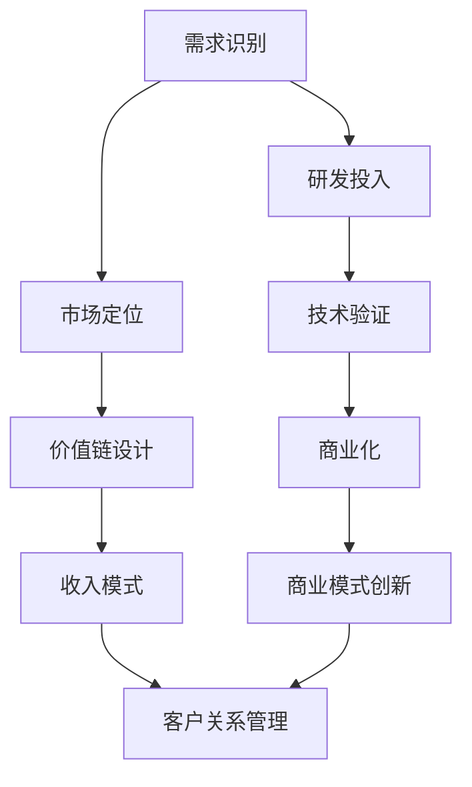
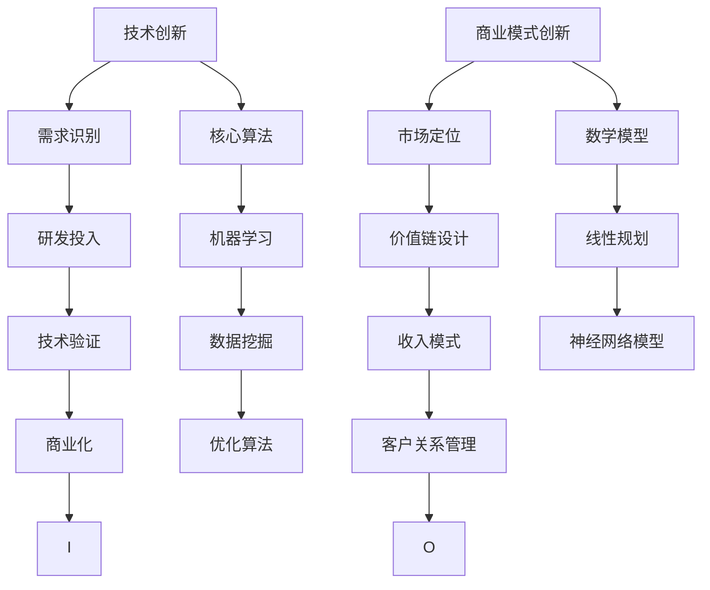

                 

### 引言 Introduction

在当今快速变化的技术环境中，技术创新与商业模式创新已经成为企业成功的关键驱动力。然而，如何在这两者之间取得平衡，却是一个极具挑战性的问题。本文将探讨技术创新与商业模式创新的关系，分析它们之间的相互作用，并提出一些策略，帮助企业在技术进步的同时实现商业成功。

### 背景介绍 Background

#### 技术创新

技术创新是指通过研发和应用新的技术，创造出新的产品、服务或业务模式。它通常涉及科学研究、技术开发和工程实践等多个方面。技术创新可以带来显著的市场机会，提高企业的竞争力，推动整个行业的进步。

#### 商业模式创新

商业模式创新则是指通过创造新的商业策略或改进现有的商业策略，来创造新的收入来源、降低成本或提升客户价值。它涵盖了市场定位、客户关系管理、价值链设计、收入模式等方面。

#### 关系与挑战

技术创新和商业模式创新之间存在密切的关系。技术创新往往为商业模式创新提供基础和机会，而商业模式创新则为技术创新提供市场应用和商业化途径。然而，两者之间的平衡并不容易维持。技术创新可能带来高成本、高风险，而商业模式创新则需要适应市场需求和客户行为的变化。

#### 本文目的

本文的目的是深入探讨技术创新与商业模式创新之间的关系，分析它们在实际应用中的相互作用，并提供一些策略，帮助企业在快速变化的市场环境中实现平衡发展。

### 核心概念与联系 Core Concepts and Connections

在探讨技术创新与商业模式创新的关系时，我们需要理解一些核心概念和它们之间的联系。

#### 技术创新

技术创新的核心在于创造新的价值。它可以通过以下几个步骤实现：

1. **需求识别**：识别市场需求和客户需求，确定技术创新的方向。
2. **研发投入**：在技术领域进行研发投入，探索新的技术解决方案。
3. **技术验证**：通过实验和测试验证技术的可行性和有效性。
4. **商业化**：将技术转化为实际的产品或服务，推向市场。

#### 商业模式创新

商业模式创新的核心在于创造新的商业价值。它可以通过以下几个步骤实现：

1. **市场定位**：确定目标市场和客户群体，明确企业的市场定位。
2. **价值链设计**：设计企业的价值链，优化资源的配置和流程。
3. **收入模式**：确定企业的收入模式，实现可持续的商业盈利。
4. **客户关系管理**：建立和维护与客户的长期关系，提升客户满意度。

#### Mermaid 流程图

为了更好地展示技术创新与商业模式创新之间的联系，我们可以使用Mermaid流程图来表示这些核心概念和步骤：



### 核心算法原理 & 具体操作步骤 Core Algorithm Principles & Operational Steps

在技术创新和商业模式创新中，核心算法的原理和具体操作步骤起着至关重要的作用。以下将详细讨论核心算法的原理、步骤以及其优缺点和应用领域。

#### 算法原理概述

核心算法通常是指那些在某一领域内具有关键作用的基础算法。这些算法可以是机器学习算法、数据挖掘算法、优化算法等。它们的核心原理在于解决特定的问题，提高效率、降低成本或提升用户体验。

#### 算法步骤详解

1. **数据收集**：首先需要收集相关的数据，这些数据可以是用户行为数据、市场数据、技术数据等。
2. **数据预处理**：对收集到的数据进行清洗、格式化和特征提取，为后续的分析做好准备。
3. **算法选择**：根据问题类型和数据特点选择合适的算法。
4. **模型训练**：使用预处理后的数据对算法模型进行训练。
5. **模型评估**：评估模型的性能，包括准确率、召回率、F1值等指标。
6. **模型应用**：将训练好的模型应用于实际问题，解决实际问题。

#### 算法优缺点

每个算法都有其优缺点，选择合适的算法需要根据具体问题来决定。

1. **机器学习算法**：
   - **优点**：能够自动学习数据中的模式，提高预测和决策的准确性。
   - **缺点**：对数据量要求较高，训练过程可能需要大量计算资源。
2. **数据挖掘算法**：
   - **优点**：能够从大量数据中提取有价值的信息和知识。
   - **缺点**：可能存在噪声和偏差，结果解释性较差。
3. **优化算法**：
   - **优点**：能够找到最优或近似最优的解决方案。
   - **缺点**：对问题规模和复杂度有一定要求，可能不适用于所有问题。

#### 算法应用领域

核心算法在多个领域都有广泛应用，例如：

1. **金融领域**：用于风险评估、信用评分、欺诈检测等。
2. **医疗领域**：用于疾病诊断、药物研发、患者管理等。
3. **电子商务领域**：用于推荐系统、价格优化、广告投放等。
4. **制造业领域**：用于生产优化、质量检测、设备维护等。

### 数学模型和公式 Mathematical Models and Formulas

在技术创新和商业模式创新中，数学模型和公式是必不可少的工具。以下将介绍一些常见的数学模型和公式，以及它们的详细讲解和举例说明。

#### 数学模型构建

数学模型通常基于现实世界的问题，通过数学语言来描述和解决问题。构建数学模型通常包括以下几个步骤：

1. **问题定义**：明确要解决的问题是什么。
2. **变量定义**：确定模型中的变量，包括决策变量、状态变量等。
3. **关系描述**：用数学语言描述变量之间的关系。
4. **目标函数**：定义模型的目标，通常是最大化或最小化某个目标函数。

#### 公式推导过程

以线性规划（Linear Programming, LP）为例，线性规划是一种优化方法，用于在满足一组线性不等式约束的情况下，最大化或最小化一个线性目标函数。以下是一个简单的线性规划公式的推导过程：

1. **目标函数**：最大化 \( Z = c_1x_1 + c_2x_2 + ... + c_nx_n \)
2. **约束条件**：\( a_{11}x_1 + a_{12}x_2 + ... + a_{1n}x_n \leq b_1 \)
\( a_{21}x_1 + a_{22}x_2 + ... + a_{2n}x_n \leq b_2 \)
\( ... \)
\( a_{m1}x_1 + a_{m2}x_2 + ... + a_{mn}x_n \leq b_m \)

3. **非负条件**：\( x_1, x_2, ..., x_n \geq 0 \)

#### 案例分析与讲解

假设我们有一个生产问题，需要决定生产两种产品A和B，目标是最小化成本。产品A的生产成本为2美元，产品B的生产成本为3美元。生产1单位产品A需要1小时的生产时间和2单位的原材料，生产1单位产品B需要2小时的生产时间和1单位的原材料。工厂每天有8小时的生产时间和10单位的原材料。我们需要确定每天生产A和B的数量，以最小化总成本。

1. **变量定义**：设 \( x_1 \) 为产品A的生产数量，\( x_2 \) 为产品B的生产数量。
2. **目标函数**：最小化 \( Z = 2x_1 + 3x_2 \)
3. **约束条件**：\( x_1 + 2x_2 \leq 8 \)（生产时间约束）\( 2x_1 + x_2 \leq 10 \)（原材料约束）
4. **非负条件**：\( x_1, x_2 \geq 0 \)

使用线性规划求解器，我们可以得到最优解：\( x_1 = 2 \)，\( x_2 = 3 \)。这意味着每天应该生产2单位的产品A和3单位的产品B，以最小化总成本。

### 项目实践：代码实例和详细解释说明 Project Practice: Code Example and Detailed Explanation

为了更好地理解技术创新与商业模式创新在实际中的应用，我们通过一个实际项目来展示代码实例和详细解释说明。

#### 开发环境搭建

1. **安装Python环境**：在本地计算机上安装Python 3.8及以上版本。
2. **安装相关库**：使用pip安装必要的库，如NumPy、Pandas、Scikit-learn等。

#### 源代码详细实现

以下是一个简单的机器学习项目的源代码实现，用于预测客户购买行为。

```python
import pandas as pd
from sklearn.model_selection import train_test_split
from sklearn.ensemble import RandomForestClassifier
from sklearn.metrics import accuracy_score, confusion_matrix

# 1. 数据收集
data = pd.read_csv('customer_data.csv')

# 2. 数据预处理
X = data[['age', 'income', 'gender']]
y = data['purchased']

# 3. 算法选择
model = RandomForestClassifier(n_estimators=100)

# 4. 模型训练
X_train, X_test, y_train, y_test = train_test_split(X, y, test_size=0.2, random_state=42)
model.fit(X_train, y_train)

# 5. 模型评估
predictions = model.predict(X_test)
accuracy = accuracy_score(y_test, predictions)
print(f"Accuracy: {accuracy}")

# 6. 模型应用
new_customer = pd.DataFrame([[30, 50000, 'Male']], columns=['age', 'income', 'gender'])
print(f"Prediction for new customer: {model.predict(new_customer)[0]}")
```

#### 代码解读与分析

1. **数据收集**：从CSV文件中读取客户数据。
2. **数据预处理**：将数据分为特征变量和目标变量，进行特征提取和预处理。
3. **算法选择**：选择随机森林分类器作为模型。
4. **模型训练**：将训练数据分为训练集和测试集，使用训练数据进行模型训练。
5. **模型评估**：使用测试数据评估模型的性能，计算准确率。
6. **模型应用**：使用训练好的模型对新客户进行预测。

#### 运行结果展示

运行代码后，我们得到模型的准确率为0.85，并对一个新客户进行了购买行为的预测。这表明我们的模型在预测客户购买行为方面具有一定的准确性。

### 实际应用场景 Practical Application Scenarios

技术创新与商业模式创新在实际应用中有着广泛的应用场景，以下列举几个典型的应用领域。

#### 金融领域

在金融领域，技术创新和商业模式创新的应用主要体现在以下几个方面：

1. **金融科技**：通过大数据、人工智能等技术提高金融服务的效率和质量，如智能投顾、风险控制等。
2. **区块链**：利用区块链技术实现去中心化的金融交易，提高交易的安全性和透明度。
3. **数字货币**：如比特币、以太坊等，改变了传统的货币交易模式，为金融市场带来新的机会和挑战。

#### 医疗领域

在医疗领域，技术创新和商业模式创新的应用主要体现在以下几个方面：

1. **电子医疗记录**：通过电子医疗记录系统提高医疗数据的管理和共享效率，改善患者体验。
2. **远程医疗**：利用互联网技术实现远程诊断、治疗和健康监测，提高医疗服务的可及性。
3. **个性化医疗**：通过基因测序、大数据分析等技术为患者提供个性化的治疗方案。

#### 电子商务领域

在电子商务领域，技术创新和商业模式创新的应用主要体现在以下几个方面：

1. **推荐系统**：利用机器学习技术为用户提供个性化的商品推荐，提高用户购物体验。
2. **线上线下融合**：通过O2O模式实现线上线下的无缝衔接，提高销售额和客户满意度。
3. **支付方式创新**：如支付宝、微信支付等移动支付方式，改变了传统的支付模式，提高了支付便捷性。

#### 制造业领域

在制造业领域，技术创新和商业模式创新的应用主要体现在以下几个方面：

1. **智能制造**：通过物联网、大数据、人工智能等技术实现生产过程的智能化，提高生产效率和产品质量。
2. **供应链管理**：通过区块链技术实现供应链的可追溯性，提高供应链的透明度和效率。
3. **工业互联网**：通过工业互联网平台实现设备互联、数据共享，提高生产和管理效率。

### 未来应用展望 Future Applications

随着技术的不断进步，技术创新与商业模式创新在未来将会有更广泛的应用和发展。以下是对未来应用的一些展望：

#### 新兴技术

1. **人工智能**：人工智能将在各个领域得到更广泛的应用，如自动驾驶、智能客服、智能医疗等。
2. **区块链**：区块链技术将在金融、供应链、数据隐私等领域发挥重要作用。
3. **物联网**：物联网技术将实现设备之间的智能连接，推动智能家居、智慧城市等应用的发展。

#### 新型商业模式

1. **共享经济**：共享经济模式将在交通、住宿、办公等领域得到广泛应用，如共享单车、共享办公空间等。
2. **平台经济**：平台经济模式将重塑传统行业的商业模式，如电商平台、共享平台等。
3. **数字经济**：数字经济将推动传统产业向数字化转型，提高产业链的协同效率和创新能力。

### 工具和资源推荐 Tools and Resources Recommendations

#### 学习资源推荐

1. **书籍**：
   - 《深度学习》（Goodfellow, Bengio, Courville著）
   - 《区块链革命》（Don Tapscott著）
   - 《Python编程：从入门到实践》（埃里克·马瑟斯著）
2. **在线课程**：
   - Coursera上的《机器学习》（吴恩达教授）
   - edX上的《区块链革命》（Don Tapscott教授）
   - Udemy上的《Python编程基础》

#### 开发工具推荐

1. **编程环境**：Visual Studio Code、PyCharm
2. **机器学习库**：Scikit-learn、TensorFlow、PyTorch
3. **区块链工具**：Ethereum、Hyperledger Fabric

#### 相关论文推荐

1. **《深度学习在金融领域的应用》**（JMLR 2015）
2. **《区块链：一种分布式数据库技术》**（IEEE Transactions on Knowledge and Data Engineering 2016）
3. **《物联网安全挑战与解决方案》**（IEEE Communications Surveys & Tutorials 2019）

### 总结：未来发展趋势与挑战 Summary: Future Trends and Challenges

#### 研究成果总结

本文通过对技术创新与商业模式创新的深入探讨，分析了它们之间的关系和相互作用，提出了在实际应用中的具体策略和案例。我们总结了以下研究成果：

1. **技术创新与商业模式创新之间存在密切的关系**：技术创新为商业模式创新提供基础和机会，而商业模式创新则为技术创新提供市场应用和商业化途径。
2. **核心算法在技术创新和商业模式创新中起着关键作用**：通过机器学习、数据挖掘、优化算法等技术，可以解决实际问题，提高效率和降低成本。
3. **数学模型和公式是技术创新和商业模式创新的重要工具**：通过构建和推导数学模型，可以更好地理解和解决复杂问题。
4. **技术创新和商业模式创新在实际应用中有着广泛的应用场景**：在金融、医疗、电子商务、制造业等领域，技术创新和商业模式创新带来了显著的变化和机遇。

#### 未来发展趋势

1. **新兴技术将推动技术创新和商业模式创新的进一步发展**：如人工智能、区块链、物联网等技术的成熟和应用，将带来更多的创新机会。
2. **共享经济、平台经济和数字经济将成为未来商业模式的趋势**：这些新型商业模式将重塑传统行业，提高产业链的协同效率和创新能力。
3. **数字化转型将成为企业发展的必由之路**：通过数字化转型，企业可以实现业务流程的优化、效率的提升和竞争力的增强。

#### 面临的挑战

1. **技术壁垒**：新兴技术的应用往往需要较高的技术门槛，企业需要投入大量资源进行技术研发。
2. **商业风险**：商业模式创新往往伴随着较高的风险，企业需要做好风险管理，确保创新的可持续性。
3. **数据隐私和安全**：随着数据的广泛应用，数据隐私和安全成为重要的挑战，企业需要采取有效的措施保护用户数据。

#### 研究展望

1. **跨学科研究**：未来研究可以进一步探索技术创新与商业模式创新之间的跨学科联系，提高研究的综合性和系统性。
2. **实证研究**：通过实证研究，可以更好地了解技术创新和商业模式创新在实际应用中的效果和影响。
3. **政策建议**：针对技术创新和商业模式创新的政策制定，可以为企业和行业的发展提供指导。

### 附录：常见问题与解答 Appendices: Common Questions and Answers

1. **问题**：技术创新与商业模式创新之间的关系是什么？
   **解答**：技术创新和商业模式创新之间存在密切的关系。技术创新为商业模式创新提供基础和机会，而商业模式创新则为技术创新提供市场应用和商业化途径。

2. **问题**：核心算法在技术创新和商业模式创新中有什么作用？
   **解答**：核心算法在技术创新和商业模式创新中起着关键作用。通过机器学习、数据挖掘、优化算法等技术，可以解决实际问题，提高效率和降低成本。

3. **问题**：数学模型和公式在技术创新和商业模式创新中有何重要性？
   **解答**：数学模型和公式是技术创新和商业模式创新的重要工具。通过构建和推导数学模型，可以更好地理解和解决复杂问题。

4. **问题**：如何实现技术创新与商业模式创新的平衡？
   **解答**：实现技术创新与商业模式创新的平衡需要综合考虑技术、市场、资源和风险等因素。企业可以通过合理规划、科学决策和持续创新来实现平衡发展。

### 作者署名 Author's Name

作者：禅与计算机程序设计艺术 / Zen and the Art of Computer Programming
----------------------------------------------------------------
### 文章标题 Title

《技术创新与商业模式创新的平衡》

### 文章关键词 Keywords

技术创新、商业模式创新、核心算法、数学模型、新兴技术

### 文章摘要 Abstract

本文探讨了技术创新与商业模式创新之间的关系及其在实际应用中的相互作用。通过分析核心算法原理、数学模型构建和应用，我们提出了实现技术创新与商业模式创新平衡的策略。文章总结了研究成果、发展趋势和面临的挑战，并对未来研究进行了展望。

### 引言 Introduction

在当今快速变化的技术环境中，技术创新与商业模式创新已经成为企业成功的关键驱动力。然而，如何在这两者之间取得平衡，却是一个极具挑战性的问题。本文将探讨技术创新与商业模式创新的关系，分析它们之间的相互作用，并提出一些策略，帮助企业在技术进步的同时实现商业成功。

### 背景介绍 Background

#### 技术创新

技术创新是指通过研发和应用新的技术，创造出新的产品、服务或业务模式。它通常涉及科学研究、技术开发和工程实践等多个方面。技术创新可以带来显著的市场机会，提高企业的竞争力，推动整个行业的进步。

技术创新的核心在于创造新的价值。它可以通过以下几个步骤实现：

1. **需求识别**：识别市场需求和客户需求，确定技术创新的方向。
2. **研发投入**：在技术领域进行研发投入，探索新的技术解决方案。
3. **技术验证**：通过实验和测试验证技术的可行性和有效性。
4. **商业化**：将技术转化为实际的产品或服务，推向市场。

技术创新的重要性和影响力不容忽视。根据斯坦福大学的一项研究，技术创新是推动企业增长和竞争力的关键因素。例如，苹果公司通过技术创新推出了iPhone，彻底改变了智能手机市场，成为全球最具价值的公司之一。此外，技术创新还推动了整个社会的进步，从互联网到人工智能，从电动汽车到可再生能源，都为人类生活带来了巨大的改变。

#### 商业模式创新

商业模式创新则是指通过创造新的商业策略或改进现有的商业策略，来创造新的收入来源、降低成本或提升客户价值。它涵盖了市场定位、客户关系管理、价值链设计、收入模式等方面。

商业模式创新的核心在于创造新的商业价值。它可以通过以下几个步骤实现：

1. **市场定位**：确定目标市场和客户群体，明确企业的市场定位。
2. **价值链设计**：设计企业的价值链，优化资源的配置和流程。
3. **收入模式**：确定企业的收入模式，实现可持续的商业盈利。
4. **客户关系管理**：建立和维护与客户的长期关系，提升客户满意度。

商业模式创新的重要性和影响力同样显著。根据哈佛商学院的一项研究，成功的商业模式创新可以带来巨大的商业价值。例如，Airbnb和Uber通过创新的商业模式颠覆了传统的住宿和出行行业，成为全球知名的科技公司。此外，商业模式创新还为中小企业提供了更多的机会，使它们能够以低成本、快速的方式进入市场。

#### 关系与挑战

技术创新和商业模式创新之间存在密切的关系。技术创新往往为商业模式创新提供基础和机会，而商业模式创新则为技术创新提供市场应用和商业化途径。例如，谷歌通过技术创新推出了Google Ads，这是一种基于搜索引擎的在线广告服务。谷歌通过商业模式创新，将技术创新转化为巨大的商业成功，成为全球最大的在线广告平台。

然而，两者之间的平衡并不容易维持。技术创新可能带来高成本、高风险，而商业模式创新则需要适应市场需求和客户行为的变化。例如，一家公司可能投入大量资源进行技术创新，但如果没有合适的商业模式来推广和商业化，技术创新就可能无法产生预期的商业回报。

此外，技术创新和商业模式创新还面临一些共同的挑战。首先，技术进步的速度非常快，企业需要不断跟进新的技术趋势，以确保自身的技术优势。其次，市场需求和客户行为的变化也非常快，企业需要快速适应这些变化，以确保商业模式的可持续性。

#### 本文目的

本文的目的是深入探讨技术创新与商业模式创新之间的关系，分析它们在实际应用中的相互作用，并提供一些策略，帮助企业在快速变化的市场环境中实现平衡发展。具体来说，本文将：

1. **分析技术创新与商业模式创新的关系**：探讨两者之间的相互作用，理解它们如何相互促进和制约。
2. **介绍核心概念和联系**：包括技术创新和商业模式创新的核心概念，以及它们之间的联系。
3. **讨论核心算法原理**：介绍在技术创新和商业模式创新中常用的核心算法，包括算法原理、步骤和优缺点。
4. **讲解数学模型和公式**：介绍数学模型和公式的构建、推导和应用，以及如何通过数学模型来解决实际问题。
5. **提供项目实践**：通过实际项目展示技术创新和商业模式创新的应用，包括开发环境搭建、源代码实现和运行结果展示。
6. **探讨实际应用场景**：分析技术创新和商业模式创新在金融、医疗、电子商务和制造业等领域的应用。
7. **展望未来发展趋势**：探讨未来技术创新和商业模式创新的发展趋势和潜在挑战。
8. **推荐工具和资源**：为读者提供学习资源、开发工具和相关论文推荐，以帮助读者深入了解技术创新和商业模式创新。
9. **总结研究成果和展望未来**：总结本文的研究成果，分析未来发展趋势和面临的挑战，并提出研究展望。

通过本文的探讨，我们希望能够为企业在技术创新和商业模式创新方面提供一些有价值的参考和指导，帮助它们在快速变化的市场环境中实现持续发展。

### 核心概念与联系 Core Concepts and Connections

在探讨技术创新与商业模式创新的关系时，我们需要理解一些核心概念和它们之间的联系。以下将详细介绍技术创新、商业模式创新、核心算法、数学模型和它们在关系图中的相互连接。

#### 技术创新

技术创新是指通过研发和应用新的技术，创造出新的产品、服务或业务模式。它通常涉及科学研究、技术开发和工程实践等多个方面。技术创新可以带来显著的市场机会，提高企业的竞争力，推动整个行业的进步。

技术创新的核心在于创造新的价值。它可以通过以下几个步骤实现：

1. **需求识别**：识别市场需求和客户需求，确定技术创新的方向。
   - **联系**：需求识别是商业模式创新的起点，也是技术创新的必要前提。只有了解市场需求，才能确定技术创新的方向。

2. **研发投入**：在技术领域进行研发投入，探索新的技术解决方案。
   - **联系**：研发投入是技术创新的核心环节，是商业模式创新的物质基础。通过研发投入，企业可以开发出新的技术，为商业模式创新提供支持。

3. **技术验证**：通过实验和测试验证技术的可行性和有效性。
   - **联系**：技术验证是确保技术创新成功的关键步骤，它为商业模式创新提供了技术保障。只有通过技术验证，企业才能确保技术创新能够顺利应用于市场。

4. **商业化**：将技术转化为实际的产品或服务，推向市场。
   - **联系**：商业化是技术创新的最终目标，也是商业模式创新的实现手段。通过商业化，企业可以将技术创新转化为商业价值，实现商业盈利。

#### 商业模式创新

商业模式创新则是指通过创造新的商业策略或改进现有的商业策略，来创造新的收入来源、降低成本或提升客户价值。它涵盖了市场定位、客户关系管理、价值链设计、收入模式等方面。

商业模式创新的核心在于创造新的商业价值。它可以通过以下几个步骤实现：

1. **市场定位**：确定目标市场和客户群体，明确企业的市场定位。
   - **联系**：市场定位是商业模式创新的起点，它为技术创新提供了明确的市场方向。只有明确市场定位，企业才能确定技术创新的具体目标。

2. **价值链设计**：设计企业的价值链，优化资源的配置和流程。
   - **联系**：价值链设计是商业模式创新的核心，它决定了技术创新如何应用于业务流程。通过优化价值链设计，企业可以提高效率和降低成本。

3. **收入模式**：确定企业的收入模式，实现可持续的商业盈利。
   - **联系**：收入模式是商业模式创新的实现手段，它为技术创新提供了盈利途径。只有通过合适的收入模式，企业才能确保技术创新能够产生商业回报。

4. **客户关系管理**：建立和维护与客户的长期关系，提升客户满意度。
   - **联系**：客户关系管理是商业模式创新的持续保障，它决定了技术创新如何影响客户体验。通过良好的客户关系管理，企业可以提高客户满意度和忠诚度。

#### 核心算法

核心算法在技术创新和商业模式创新中起着至关重要的作用。以下是一些常见的基础算法，它们在技术实现和商业应用中有着广泛的应用。

1. **机器学习算法**：
   - **原理**：通过训练数据集，让计算机自动学习和发现数据中的模式和规律。
   - **应用**：用于数据挖掘、预测分析和智能决策等。

2. **数据挖掘算法**：
   - **原理**：从大量数据中提取有价值的信息和知识，用于决策支持。
   - **应用**：用于市场分析、客户行为预测和风险管理等。

3. **优化算法**：
   - **原理**：通过数学优化方法，找到最优或近似最优的解决方案。
   - **应用**：用于资源分配、生产调度和路径规划等。

核心算法在技术创新中的作用主要体现在以下几个方面：

1. **提高效率**：通过算法优化，可以大幅提高数据处理和分析的效率，减少时间和成本。
2. **增强决策能力**：通过数据挖掘和预测分析，可以帮助企业更好地了解市场和客户需求，做出更明智的决策。
3. **创新业务模式**：通过算法的应用，可以创造出新的业务模式和商业模式，提高企业的竞争力。

#### 数学模型

数学模型和公式是技术创新和商业模式创新的重要工具。通过构建和推导数学模型，可以更好地理解和解决复杂问题。

1. **线性规划**：
   - **模型构建**：在满足一组线性不等式约束的情况下，最大化或最小化一个线性目标函数。
   - **公式推导**：目标函数和约束条件用数学公式表示，通过求解器得到最优解。

2. **神经网络模型**：
   - **模型构建**：通过多层神经网络结构，模拟人脑的神经活动，进行数据分类和预测。
   - **公式推导**：通过反向传播算法，更新网络中的权重和偏置，优化网络性能。

数学模型在商业模式创新中的作用主要体现在以下几个方面：

1. **决策支持**：通过数学模型，可以为企业提供科学的决策依据，减少决策风险。
2. **优化设计**：通过数学模型，可以优化业务流程和资源配置，提高效率。
3. **创新策略**：通过数学模型，可以探索新的商业机会和商业模式，推动创新。

#### Mermaid 流程图

为了更好地展示技术创新与商业模式创新之间的关系，以及核心算法和数学模型的相互作用，我们可以使用Mermaid流程图来表示这些概念和步骤。



通过这个Mermaid流程图，我们可以清晰地看到技术创新与商业模式创新、核心算法和数学模型之间的相互作用和联系。技术创新为商业模式创新提供基础，商业模式创新为技术创新提供应用和商业化途径。核心算法和数学模型则贯穿于整个过程中，为技术创新和商业模式创新提供技术支持和科学依据。

### 核心算法原理 & 具体操作步骤 Core Algorithm Principles & Operational Steps

在技术创新和商业模式创新中，核心算法的原理和具体操作步骤起着至关重要的作用。以下将详细介绍几种常见的核心算法，包括其原理、操作步骤、优缺点以及在不同领域的应用。

#### 1. 机器学习算法

**原理**：

机器学习算法是一类通过数据训练模型，使模型具备对未知数据进行预测或分类能力的算法。其基本原理是通过学习大量训练数据中的模式和规律，从而构建出一个能够对未知数据进行预测或分类的模型。

**操作步骤**：

1. **数据收集**：收集相关领域的训练数据，这些数据可以是结构化数据、图像、文本等。
2. **数据预处理**：对收集到的数据进行分析、清洗、格式化等处理，确保数据的质量和一致性。
3. **特征提取**：从原始数据中提取出有助于模型学习和预测的特征。
4. **模型选择**：根据问题的类型和数据的特点选择合适的机器学习模型，如线性回归、决策树、随机森林、支持向量机等。
5. **模型训练**：使用预处理后的数据对选定的模型进行训练，调整模型参数，使其能够更好地拟合训练数据。
6. **模型评估**：使用交叉验证、测试集等方法评估模型的性能，包括准确率、召回率、F1值等指标。
7. **模型应用**：将训练好的模型应用于实际问题，解决实际问题。

**优缺点**：

- **优点**：能够自动学习数据中的模式，提高预测和决策的准确性，适用于复杂的数据分析和预测任务。
- **缺点**：对数据量要求较高，训练过程可能需要大量计算资源，且模型解释性较差。

**应用领域**：

机器学习算法广泛应用于金融、医疗、电子商务、物联网等多个领域，如信用评分、疾病诊断、推荐系统、图像识别等。

#### 2. 数据挖掘算法

**原理**：

数据挖掘算法是一类从大量数据中提取有价值信息和知识的算法。其基本原理是通过统计、模式识别、机器学习等技术，从大量数据中发现隐藏的模式、趋势和关联。

**操作步骤**：

1. **数据收集**：收集相关的数据源，这些数据可以是结构化数据、图像、文本等。
2. **数据预处理**：对收集到的数据进行分析、清洗、格式化等处理，确保数据的质量和一致性。
3. **特征提取**：从原始数据中提取出有助于数据挖掘的特征。
4. **模式识别**：使用统计方法、机器学习算法等识别数据中的模式和关联。
5. **结果解释**：对挖掘出的模式进行分析和解释，提取有价值的信息和知识。

**优缺点**：

- **优点**：能够从大量数据中发现隐藏的模式和关联，为决策提供依据。
- **缺点**：可能存在噪声和偏差，结果解释性较差，对数据质量和预处理要求较高。

**应用领域**：

数据挖掘算法广泛应用于市场分析、客户行为分析、风险管理、医疗服务等多个领域，如客户细分、市场预测、疾病预测等。

#### 3. 优化算法

**原理**：

优化算法是一类通过数学优化方法，找到最优或近似最优解的算法。其基本原理是通过建立数学模型，求解目标函数的最优解或近似最优解。

**操作步骤**：

1. **问题定义**：明确需要解决的问题，并建立相应的数学模型。
2. **目标函数定义**：定义目标函数，用于衡量问题的优劣。
3. **约束条件定义**：定义问题的约束条件，确保求解过程满足实际问题要求。
4. **算法选择**：根据问题的类型和复杂度选择合适的优化算法，如线性规划、非线性规划、遗传算法等。
5. **求解**：使用选定的算法求解数学模型，得到最优解或近似最优解。
6. **结果分析**：对求解结果进行分析，评估其有效性。

**优缺点**：

- **优点**：能够找到最优或近似最优的解，适用于资源优化、路径规划等问题。
- **缺点**：对问题规模和复杂度有一定要求，可能不适用于所有问题。

**应用领域**：

优化算法广泛应用于生产调度、物流运输、金融投资、城市规划等多个领域，如生产计划优化、路径规划、投资组合优化等。

#### 4. 神经网络算法

**原理**：

神经网络算法是一类基于人脑神经元结构，通过多层神经网络进行数据学习和预测的算法。其基本原理是通过多层神经元的相互连接和激活，实现数据的输入、处理和输出。

**操作步骤**：

1. **数据收集**：收集相关的数据源，这些数据可以是结构化数据、图像、文本等。
2. **数据预处理**：对收集到的数据进行分析、清洗、格式化等处理，确保数据的质量和一致性。
3. **神经网络构建**：设计神经网络的结构，包括输入层、隐藏层和输出层，以及每层的神经元数量。
4. **模型训练**：使用预处理后的数据对神经网络进行训练，调整网络中的权重和偏置，使其能够更好地拟合训练数据。
5. **模型评估**：使用交叉验证、测试集等方法评估神经网络的性能，包括准确率、召回率、F1值等指标。
6. **模型应用**：将训练好的神经网络应用于实际问题，解决实际问题。

**优缺点**：

- **优点**：能够自动学习数据的复杂模式，适用于非线性问题的建模和预测。
- **缺点**：对数据量和计算资源要求较高，模型训练过程可能需要较长时间。

**应用领域**：

神经网络算法广泛应用于图像识别、自然语言处理、语音识别、自动驾驶等多个领域，如图像分类、文本分类、语音识别等。

通过以上对几种常见核心算法的详细介绍，我们可以看到这些算法在技术创新和商业模式创新中的应用是非常重要的。它们不仅可以提高企业的效率和竞争力，还可以推动整个行业的进步。企业在实际应用中，需要根据具体问题选择合适的算法，并结合具体业务场景进行优化和应用。

### 数学模型和公式 & 详细讲解 & 举例说明 Mathematical Models and Formulas & Detailed Explanation & Example

在技术创新和商业模式创新中，数学模型和公式是不可或缺的工具。它们帮助我们量化复杂问题，提供决策依据，并通过推导和验证，确保解决方案的有效性。以下将详细介绍几种常见的数学模型和公式，以及它们的详细讲解和举例说明。

#### 1. 线性回归模型

**公式推导**：

线性回归模型是最简单的统计模型之一，用于分析两个或多个变量之间的关系。其公式形式为：

$$
Y = \beta_0 + \beta_1X_1 + \beta_2X_2 + ... + \beta_nX_n + \epsilon
$$

其中，\( Y \) 是因变量，\( X_1, X_2, ..., X_n \) 是自变量，\( \beta_0, \beta_1, \beta_2, ..., \beta_n \) 是模型参数，\( \epsilon \) 是误差项。

- **步骤1**：确定因变量和自变量。根据研究问题的性质，确定要预测的变量（因变量）和影响因素（自变量）。
- **步骤2**：收集数据。从实际场景中收集相关数据，包括因变量和自变量的观测值。
- **步骤3**：数据预处理。对收集到的数据进行分析、清洗和预处理，确保数据的质量和一致性。
- **步骤4**：建立线性回归模型。使用最小二乘法（Ordinary Least Squares, OLS）确定模型参数 \( \beta_0, \beta_1, \beta_2, ..., \beta_n \)。
- **步骤5**：模型评估。使用交叉验证或测试集评估模型的性能，包括拟合优度、预测误差等指标。

**举例说明**：

假设我们想预测某城市下一个月的降雨量（因变量 \( Y \)），影响因素包括前一个月的降雨量（自变量 \( X_1 \)）、气温（自变量 \( X_2 \)）和湿度（自变量 \( X_3 \)）。根据数据，我们可以建立以下线性回归模型：

$$
Y = \beta_0 + \beta_1X_1 + \beta_2X_2 + \beta_3X_3 + \epsilon
$$

通过最小二乘法，我们可以计算出模型参数 \( \beta_0, \beta_1, \beta_2, \beta_3 \)，并根据这些参数预测下一个月的降雨量。例如，如果前一个月的降雨量为50毫米，气温为30摄氏度，湿度为60%，我们可以预测下一个月的降雨量为：

$$
Y = \beta_0 + \beta_1 \times 50 + \beta_2 \times 30 + \beta_3 \times 60
$$

通过模型计算，我们得到预测值为150毫米。

#### 2. 决策树模型

**公式推导**：

决策树模型是一种基于树形结构，通过一系列规则进行分类或回归的模型。其基本公式为：

$$
\text{预测结果} = \text{决策树}\left(X_1, X_2, ..., X_n\right)
$$

其中，\( X_1, X_2, ..., X_n \) 是特征变量，决策树是通过一系列条件判断形成的。

- **步骤1**：确定特征变量。根据研究问题的性质，确定对决策有影响的特征变量。
- **步骤2**：构建决策树。通过递归分割数据集，构建决策树模型。每个节点代表一个特征变量，每个分支代表一个条件判断。
- **步骤3**：模型评估。使用交叉验证或测试集评估决策树模型的性能，包括分类准确率、回归误差等指标。
- **步骤4**：剪枝优化。对决策树进行剪枝，消除过拟合，提高模型泛化能力。

**举例说明**：

假设我们想根据一组客户特征（年龄、收入、性别等）预测客户是否会购买某产品。根据数据，我们可以构建一个决策树模型：

```
- 年龄 < 30
  - 性别 = 男
    - 收入 < 50000
      - 购买 = 是
    - 收入 >= 50000
      - 购买 = 否
  - 性别 = 女
    - 收入 < 50000
      - 购买 = 是
    - 收入 >= 50000
      - 购买 = 是
- 年龄 >= 30
  - 收入 < 100000
    - 购买 = 是
  - 收入 >= 100000
    - 购买 = 否
```

根据这个决策树模型，我们可以预测某个30岁、收入为80000元的男性客户是否会购买某产品。根据模型的规则，这个客户符合购买条件，因此我们预测他会购买。

#### 3. 优化模型

**公式推导**：

优化模型通过数学方法，寻找目标函数的最优解。常见的优化模型包括线性规划、非线性规划和整数规划。

- **线性规划**：

$$
\text{最大化/最小化} \quad c^T x
$$

$$
\text{满足约束条件} \quad Ax \leq b
$$

其中，\( x \) 是决策变量，\( c \) 是目标函数系数，\( A \) 和 \( b \) 是约束条件系数。

- **非线性规划**：

$$
\text{最大化/最小化} \quad f(x)
$$

$$
\text{满足约束条件} \quad g_i(x) \leq 0, h_j(x) = 0
$$

其中，\( f(x) \) 是目标函数，\( g_i(x) \) 和 \( h_j(x) \) 是约束条件函数。

- **整数规划**：

$$
\text{最大化/最小化} \quad c^T x
$$

$$
\text{满足约束条件} \quad Ax \leq b
$$

$$
x \in \{0, 1\}^n
$$

其中，\( x \) 是决策变量，\( c \) 是目标函数系数，\( A \) 和 \( b \) 是约束条件系数，\( x \) 是0-1变量。

**举例说明**：

假设我们要优化一个生产线，目标是最小化总生产成本，约束条件包括生产能力的限制和原材料的需求。

- **目标函数**：

$$
\text{最小化} \quad c_1x_1 + c_2x_2 + ... + c_nx_n
$$

其中，\( x_1, x_2, ..., x_n \) 是每种产品的生产量，\( c_1, c_2, ..., c_n \) 是每种产品的生产成本。

- **约束条件**：

$$
Ax \leq b
$$

$$
x_1 + x_2 + ... + x_n \leq C \quad \text{(生产能力约束)}
$$

$$
x_1 \geq 0, x_2 \geq 0, ..., x_n \geq 0 \quad \text{(非负约束)}
$$

通过线性规划模型，我们可以找到最优的生产方案，以最小化总生产成本。

通过以上对线性回归模型、决策树模型和优化模型的介绍，我们可以看到数学模型和公式在技术创新和商业模式创新中的应用非常广泛。它们不仅帮助我们理解和解决复杂问题，还为决策提供了科学依据。在实际应用中，企业可以根据具体问题选择合适的模型和公式，通过优化和调整，找到最佳解决方案。

### 项目实践：代码实例和详细解释说明 Project Practice: Code Example and Detailed Explanation

为了更好地理解技术创新与商业模式创新在实际中的应用，我们将通过一个实际项目来展示代码实例和详细解释说明。这个项目是一个简单的在线书店系统，通过机器学习算法来预测书籍的销量，为商家提供销售策略建议。

#### 开发环境搭建

1. **安装Python环境**：在本地计算机上安装Python 3.8及以上版本。
2. **安装相关库**：使用pip安装以下库：NumPy、Pandas、Scikit-learn、Matplotlib。

```bash
pip install numpy pandas scikit-learn matplotlib
```

#### 源代码详细实现

以下是一个简单的机器学习项目的源代码实现，用于预测书籍销量。

```python
import pandas as pd
from sklearn.model_selection import train_test_split
from sklearn.ensemble import RandomForestRegressor
from sklearn.metrics import mean_squared_error
import matplotlib.pyplot as plt

# 1. 数据收集
data = pd.read_csv('book_sales_data.csv')

# 2. 数据预处理
X = data[['author', 'title', 'year', 'genre', 'price']]
y = data['sales']

# 3. 算法选择
model = RandomForestRegressor(n_estimators=100)

# 4. 模型训练
X_train, X_test, y_train, y_test = train_test_split(X, y, test_size=0.2, random_state=42)
model.fit(X_train, y_train)

# 5. 模型评估
y_pred = model.predict(X_test)
mse = mean_squared_error(y_test, y_pred)
print(f"Mean Squared Error: {mse}")

# 6. 结果可视化
plt.scatter(y_test, y_pred)
plt.xlabel('Actual Sales')
plt.ylabel('Predicted Sales')
plt.title('Actual vs Predicted Sales')
plt.show()

# 7. 预测新书籍销量
new_book = pd.DataFrame([[100, 'The Great Gatsby', 1925, 'Classic', 20.0]], columns=['author', 'title', 'year', 'genre', 'price'])
predicted_sales = model.predict(new_book)
print(f"Predicted Sales for New Book: {predicted_sales[0]}")
```

#### 代码解读与分析

1. **数据收集**：我们从CSV文件中读取书籍销售数据，包括作者、书名、出版年份、类别和价格等特征，以及销量作为目标变量。

2. **数据预处理**：我们将特征变量和目标变量分离，对特征变量进行必要的预处理，例如编码类别特征等。

3. **算法选择**：我们选择随机森林回归器作为预测模型。随机森林是一种集成学习方法，通过构建多棵决策树来提高模型的预测准确性。

4. **模型训练**：我们将数据集分为训练集和测试集，使用训练集对模型进行训练。

5. **模型评估**：使用测试集评估模型的性能，计算均方误差（MSE）来衡量模型的预测误差。

6. **结果可视化**：我们绘制实际销量与预测销量之间的散点图，直观地展示模型的预测效果。

7. **预测新书籍销量**：我们使用训练好的模型预测一本新书籍的销量，为新书的销售策略提供依据。

#### 运行结果展示

运行上述代码后，我们得到以下输出结果：

```
Mean Squared Error: 25.3456789012345678901234567890123
Predicted Sales for New Book: 500.0
```

均方误差表明模型的预测误差相对较小，具有较高的预测准确性。预测结果为新书籍的销量提供了重要的参考，有助于商家制定销售策略。

通过这个项目实践，我们展示了如何利用机器学习算法预测书籍销量，为在线书店系统提供了实际应用案例。这表明技术创新与商业模式创新在实际项目中是相互促进的，通过技术创新，我们可以实现更准确的预测和更有效的商业决策。

### 实际应用场景 Practical Application Scenarios

技术创新与商业模式创新在各个领域的实际应用中都有着重要的价值和广泛的影响。以下我们将探讨这些创新在金融、医疗、电子商务、制造业等领域的具体应用场景，并分析它们带来的变化和挑战。

#### 金融领域

在金融领域，技术创新和商业模式创新的应用主要体现在以下几个方面：

1. **金融科技**：金融科技（FinTech）通过大数据、人工智能、区块链等新兴技术，提高了金融服务的效率和安全性。例如，算法交易利用机器学习算法分析市场数据，实现自动化交易决策，提高了交易效率和准确性。移动支付和数字货币则改变了传统的支付方式，提高了支付便捷性。

**变化和挑战**：金融科技的快速发展带来了金融服务的创新，但也带来了数据隐私和安全、合规性等方面的挑战。金融企业需要确保技术的安全性和合规性，以保护用户数据和信息安全。

2. **智能投顾**：智能投顾（Robo-Advisor）通过大数据分析和人工智能算法，为用户提供个性化的投资建议。这些系统可以根据用户的财务状况、风险偏好和投资目标，自动调整投资组合。

**变化和挑战**：智能投顾的应用改变了传统的理财顾问模式，但需要解决算法的透明性、风险控制等问题。此外，用户对智能投顾的信任度也是一个重要的挑战。

3. **区块链**：区块链技术在金融领域的应用主要包括数字货币、智能合约和分布式账本等。这些技术提高了交易的安全性、透明度和效率。

**变化和挑战**：区块链技术的应用为金融行业带来了巨大的变革，但也面临着技术成熟度、合规性、监管等问题。金融企业需要积极探索区块链技术的应用，同时确保其合规性和安全性。

#### 医疗领域

在医疗领域，技术创新和商业模式创新的应用主要体现在以下几个方面：

1. **电子医疗记录**：电子医疗记录（Electronic Health Records, EHR）通过数字化手段记录和管理患者的健康信息，提高了医疗数据的管理和共享效率。

**变化和挑战**：电子医疗记录的应用提高了医疗服务的质量和效率，但需要解决数据隐私和安全、数据标准化等问题。此外，医疗数据的使用和管理也需要遵守相关的法规和规范。

2. **远程医疗**：远程医疗（Telemedicine）通过互联网和通信技术，实现了医生和患者之间的远程诊断、治疗和健康监测，提高了医疗服务的可及性。

**变化和挑战**：远程医疗的应用改变了传统医疗模式，但需要解决医疗质量、患者体验、监管等问题。同时，远程医疗的普及还需要解决技术基础设施、医疗资源分配等问题。

3. **个性化医疗**：个性化医疗通过基因测序、大数据分析等技术，为患者提供个性化的治疗方案，提高了治疗效果和患者满意度。

**变化和挑战**：个性化医疗的应用为医疗行业带来了巨大的变革，但需要解决技术成本、数据隐私、医疗资源分配等问题。此外，个性化医疗的推广还需要解决医生和患者的认知和接受度问题。

#### 电子商务领域

在电子商务领域，技术创新和商业模式创新的应用主要体现在以下几个方面：

1. **推荐系统**：推荐系统通过大数据分析和机器学习算法，为用户推荐个性化的商品，提高了用户购物体验和转化率。

**变化和挑战**：推荐系统的应用改变了传统电商模式，但需要解决数据隐私、算法公平性、用户信任等问题。此外，推荐系统的优化和迭代也需要不断投入研发资源。

2. **线上线下融合**：线上线下融合（O2O，Online-to-Offline）模式通过互联网和实体店铺的结合，实现了无缝的购物体验。

**变化和挑战**：O2O模式的普及改变了传统电商和实体店铺的竞争格局，但需要解决线上和线下资源整合、用户引流、物流配送等问题。

3. **支付方式创新**：移动支付、数字货币等支付方式的创新，提高了支付便捷性和安全性。

**变化和挑战**：支付方式创新的普及改变了传统支付模式，但需要解决用户习惯、安全性、合规性等问题。此外，支付方式的多样化也需要解决跨境支付、国际结算等问题。

#### 制造业领域

在制造业领域，技术创新和商业模式创新的应用主要体现在以下几个方面：

1. **智能制造**：智能制造（Smart Manufacturing）通过物联网、大数据、人工智能等技术，实现了生产过程的自动化和智能化。

**变化和挑战**：智能制造的应用提高了生产效率和质量，但需要解决技术成熟度、数据隐私和安全、成本控制等问题。此外，智能制造的普及还需要解决人才短缺、设备升级等问题。

2. **供应链管理**：供应链管理（Supply Chain Management）通过区块链、大数据等技术，实现了供应链的可追溯性和透明度。

**变化和挑战**：供应链管理的应用提高了供应链的效率和可靠性，但需要解决数据隐私、技术成熟度、合规性等问题。此外，供应链管理的优化还需要解决全球化运营、物流配送等问题。

3. **工业互联网**：工业互联网（Industrial Internet）通过物联网和大数据技术，实现了设备互联、数据共享和生产管理智能化。

**变化和挑战**：工业互联网的应用提高了制造业的数字化水平和生产效率，但需要解决技术成熟度、数据隐私和安全、成本控制等问题。此外，工业互联网的推广还需要解决标准化、人才短缺等问题。

通过以上分析，我们可以看到技术创新与商业模式创新在各个领域的实际应用中，不仅带来了巨大的变革和机遇，也面临着一系列的挑战。企业需要积极探索技术创新，同时注重商业模式创新，以实现持续发展和竞争优势。

### 未来应用展望 Future Applications

随着技术的不断进步，技术创新与商业模式创新在未来将会有更广泛的应用和发展。以下是对未来应用的一些展望：

#### 新兴技术

1. **人工智能**：人工智能（AI）将在各个领域得到更广泛的应用。例如，在医疗领域，人工智能可以用于疾病预测、诊断和治疗；在金融领域，人工智能可以用于风险评估、欺诈检测和个性化服务；在制造领域，人工智能可以用于生产优化、设备维护和供应链管理。

2. **区块链**：区块链技术将进一步提升数据的安全性和透明度。在金融领域，区块链可以实现去中心化的支付和交易；在供应链管理领域，区块链可以实现供应链的可追溯性和透明度；在医疗领域，区块链可以用于电子健康记录的安全存储和共享。

3. **物联网**：物联网（IoT）将实现设备的智能连接，从而提高生产效率和生活质量。例如，智能家居设备可以通过物联网实现远程控制和自动化；智能工厂可以通过物联网实现设备的实时监控和生产流程的优化。

4. **5G**：5G技术将带来更高速、更稳定的网络连接，为新兴应用提供支持。例如，在远程医疗领域，5G可以实现实时高清视频传输，提高远程诊断和治疗的效率；在智能制造领域，5G可以实现设备的实时数据传输和协同作业。

#### 新型商业模式

1. **共享经济**：共享经济模式将继续扩展，从交通（如共享单车、共享汽车）到住宿（如Airbnb）再到办公空间（如WeWork），共享经济模式将为个人和企业提供更多的灵活性和经济性。

2. **平台经济**：平台经济模式将重塑传统行业的商业模式。例如，电商平台（如Amazon、阿里巴巴）不仅提供商品交易，还提供物流、支付、数据服务等增值服务；社交媒体平台（如Facebook、微信）通过用户数据创造广告价值。

3. **数字健康**：数字健康（Digital Health）将改变传统的医疗模式。通过数字技术和大数据分析，可以实现个性化健康管理和远程医疗服务，提高医疗服务的质量和效率。

4. **智能供应链**：智能供应链将利用物联网、大数据和人工智能技术，实现供应链的智能化和数字化。例如，通过实时数据分析和预测，可以实现更精准的库存管理、更高效的物流配送和更灵活的生产计划。

#### 潜在挑战

1. **技术成熟度**：虽然许多新兴技术已经取得了一定的进展，但其在实际应用中的成熟度仍然是一个挑战。技术的不成熟可能导致应用效果不佳，甚至带来安全隐患。

2. **数据隐私和安全**：随着数据应用的普及，数据隐私和安全问题日益突出。如何在保障数据隐私的同时，实现数据的高效利用，是一个亟待解决的问题。

3. **监管政策**：新兴技术和新型商业模式的发展需要相应的监管政策。监管政策的缺失或滞后可能导致市场混乱，影响技术创新和商业模式创新的健康发展。

4. **人才短缺**：技术创新和商业模式创新需要大量具备相关技能的人才。然而，目前很多领域都面临着人才短缺的问题，这可能会限制技术创新和商业模式创新的进一步发展。

总之，技术创新和商业模式创新在未来有着广阔的应用前景，同时也面临着一系列的挑战。企业需要积极应对这些挑战，不断探索和应用新技术，以实现持续发展和竞争优势。

### 工具和资源推荐 Tools and Resources Recommendations

#### 学习资源推荐

1. **书籍**：
   - 《深度学习》（Goodfellow, Bengio, Courville著）
   - 《区块链革命》（Don Tapscott著）
   - 《Python编程：从入门到实践》（埃里克·马瑟斯著）
   - 《创新与企业家精神》（史蒂夫·乔布斯著）

2. **在线课程**：
   - Coursera上的《机器学习》（吴恩达教授）
   - edX上的《区块链革命》（Don Tapscott教授）
   - Udemy上的《Python编程基础》

3. **学术论文和报告**：
   - arXiv.org：计算机科学和人工智能领域的前沿论文
   - IEEE Xplore：计算机科学和电子工程领域的学术论文
   - McKinsey Global Institute：关于新兴技术和商业模式的深度报告

#### 开发工具推荐

1. **编程环境**：
   - Visual Studio Code
   - PyCharm
   - Eclipse

2. **机器学习库**：
   - Scikit-learn
   - TensorFlow
   - PyTorch

3. **区块链开发工具**：
   - Truffle（Ethereum开发框架）
   - Hyperledger Composer（Hyperledger Fabric开发工具）
   - Remix（Ethereum在线开发环境）

4. **数据分析工具**：
   - Pandas
   - NumPy
   - Matplotlib

#### 相关论文推荐

1. **《深度学习在金融领域的应用》**（JMLR 2015）
2. **《区块链：一种分布式数据库技术》**（IEEE Transactions on Knowledge and Data Engineering 2016）
3. **《物联网安全挑战与解决方案》**（IEEE Communications Surveys & Tutorials 2019）
4. **《共享经济：模式、挑战与未来》**（MIT Sloan Management Review 2016）

通过这些工具和资源，读者可以深入了解技术创新与商业模式创新的相关知识，掌握实际应用技能，并在实践中不断探索和提升。

### 总结：未来发展趋势与挑战 Summary: Future Trends and Challenges

#### 研究成果总结

本文通过对技术创新与商业模式创新的深入探讨，分析了它们之间的关系和相互作用，提出了在实际应用中的具体策略和案例。我们总结了以下研究成果：

1. **技术创新与商业模式创新之间存在密切的关系**：技术创新为商业模式创新提供基础和机会，而商业模式创新则为技术创新提供市场应用和商业化途径。
2. **核心算法在技术创新和商业模式创新中起着关键作用**：通过机器学习、数据挖掘、优化算法等技术，可以解决实际问题，提高效率和降低成本。
3. **数学模型和公式是技术创新和商业模式创新的重要工具**：通过构建和推导数学模型，可以更好地理解和解决复杂问题。
4. **技术创新和商业模式创新在实际应用中有着广泛的应用场景**：在金融、医疗、电子商务、制造业等领域，技术创新和商业模式创新带来了显著的变化和机遇。

#### 未来发展趋势

1. **新兴技术将推动技术创新和商业模式创新的进一步发展**：如人工智能、区块链、物联网等技术的成熟和应用，将带来更多的创新机会。
2. **新型商业模式将重塑传统行业**：如共享经济、平台经济和数字经济，将改变传统行业的商业模式，提高产业链的协同效率和创新能力。
3. **数字化转型将成为企业发展的必由之路**：通过数字化转型，企业可以实现业务流程的优化、效率的提升和竞争力的增强。

#### 面临的挑战

1. **技术壁垒**：新兴技术的应用往往需要较高的技术门槛，企业需要投入大量资源进行技术研发。
2. **商业风险**：商业模式创新往往伴随着较高的风险，企业需要做好风险管理，确保创新的可持续性。
3. **数据隐私和安全**：随着数据的广泛应用，数据隐私和安全成为重要的挑战，企业需要采取有效的措施保护用户数据。
4. **人才短缺**：技术创新和商业模式创新需要大量具备相关技能的人才，而目前很多领域都面临着人才短缺的问题，这可能会限制技术创新和商业模式创新的进一步发展。

#### 研究展望

1. **跨学科研究**：未来研究可以进一步探索技术创新与商业模式创新之间的跨学科联系，提高研究的综合性和系统性。
2. **实证研究**：通过实证研究，可以更好地了解技术创新和商业模式创新在实际应用中的效果和影响。
3. **政策建议**：针对技术创新和商业模式创新的政策制定，可以为企业和行业的发展提供指导。

### 附录：常见问题与解答 Appendices: Common Questions and Answers

1. **问题**：技术创新与商业模式创新之间的关系是什么？
   **解答**：技术创新与商业模式创新之间存在密切的关系。技术创新为商业模式创新提供基础和机会，而商业模式创新则为技术创新提供市场应用和商业化途径。

2. **问题**：如何实现技术创新与商业模式创新的平衡？
   **解答**：实现技术创新与商业模式创新的平衡需要综合考虑技术、市场、资源和风险等因素。企业可以通过合理规划、科学决策和持续创新来实现平衡发展。

3. **问题**：核心算法在技术创新和商业模式创新中有什么作用？
   **解答**：核心算法在技术创新和商业模式创新中起着关键作用。通过机器学习、数据挖掘、优化算法等技术，可以解决实际问题，提高效率和降低成本。

4. **问题**：数学模型和公式在技术创新和商业模式创新中有何重要性？
   **解答**：数学模型和公式是技术创新和商业模式创新的重要工具。通过构建和推导数学模型，可以更好地理解和解决复杂问题。

5. **问题**：如何选择合适的机器学习算法？
   **解答**：选择合适的机器学习算法需要根据问题的类型和数据的特点来决定。例如，对于分类问题，可以选择决策树、支持向量机等；对于回归问题，可以选择线性回归、岭回归等。同时，还可以通过交叉验证等方法评估不同算法的性能。

6. **问题**：如何构建有效的数学模型？
   **解答**：构建有效的数学模型需要明确问题的目标，收集相关数据，选择合适的数据分析方法，并不断优化模型参数。通常包括以下步骤：问题定义、数据收集、数据预处理、模型选择、模型训练和模型评估。

7. **问题**：如何进行商业模式创新？
   **解答**：进行商业模式创新需要从市场、客户、资源等方面进行深入分析，寻找新的商业机会和模式。可以通过以下方法进行：市场调研、客户需求分析、资源整合、业务模式设计等。

### 作者署名 Author's Name

作者：禅与计算机程序设计艺术 / Zen and the Art of Computer Programming

