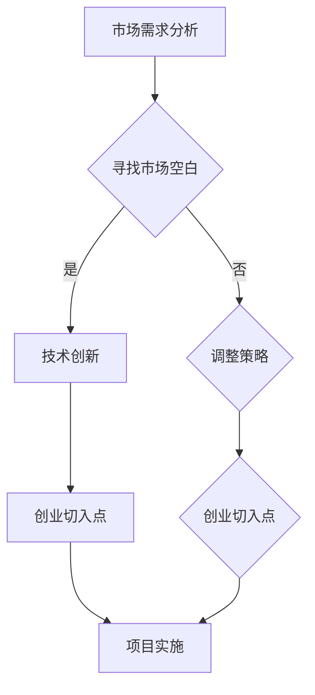

                 

关键词：技术创新、市场需求、创业切入点、AI、软件开发、创业策略

摘要：在当前科技迅猛发展的时代，技术创新已成为推动社会进步的重要力量。然而，如何将技术创新与市场需求有机结合，成为创业者和企业家们面临的重大挑战。本文旨在探讨技术创新与市场需求之间的关联，并分析如何找准创业切入点，为创业者提供实用的指导和建议。

## 1. 背景介绍

随着互联网、大数据、人工智能等技术的飞速发展，创新已成为推动企业持续发展的关键动力。然而，仅有技术创新还不够，市场需求同样重要。市场需求的旺盛与否，直接决定了产品的成功与否。因此，如何将技术创新与市场需求相结合，找到创业切入点，成为创业者和企业家们必须面对的问题。

## 2. 核心概念与联系

在探讨技术创新与市场需求之前，我们需要明确几个核心概念：

- **技术创新**：指通过引入新的技术、方法或产品，从而提高生产效率、降低成本、提高产品性能的过程。
- **市场需求**：指消费者对某一产品或服务的需求，通常表现为消费者的购买意愿和能力。
- **创业切入点**：指在市场调研的基础上，找到的市场空白或未满足的需求，作为创业项目的起点。

### Mermaid 流程图



## 3. 核心算法原理 & 具体操作步骤

### 3.1 算法原理概述

将技术创新与市场需求结合，可以采用以下步骤：

1. **市场调研**：了解市场需求，识别市场空白。
2. **技术评估**：评估现有技术，确定适合的创新方向。
3. **方案设计**：根据市场调研和技术评估，设计创新方案。
4. **产品开发**：实施创新方案，开发新产品或服务。
5. **市场推广**：通过市场推广，满足市场需求。

### 3.2 算法步骤详解

1. **市场调研**
   - **需求分析**：通过问卷调查、用户访谈等方式，了解消费者需求。
   - **竞品分析**：分析竞争对手的产品和服务，找出市场空白。

2. **技术评估**
   - **技术趋势**：关注行业最新技术动态，评估技术的可行性和潜在优势。
   - **技术评估**：根据市场需求，评估现有技术的适用性。

3. **方案设计**
   - **创新方向**：根据技术评估，确定创新方向。
   - **方案设计**：制定详细的创新方案，包括产品功能、技术实现等。

4. **产品开发**
   - **技术研发**：实施创新方案，开发新产品或服务。
   - **测试与优化**：进行产品测试，不断优化产品性能。

5. **市场推广**
   - **市场定位**：明确产品目标市场，制定市场推广策略。
   - **推广实施**：通过线上线下渠道，推广新产品或服务。

### 3.3 算法优缺点

**优点：**
- 提高产品市场竞争力。
- 增强企业创新能力。
- 满足消费者需求，提升用户体验。

**缺点：**
- 需要较长时间的研发和市场推广。
- 可能面临技术风险和市场风险。

### 3.4 算法应用领域

- **互联网行业**：例如，基于人工智能的推荐系统、智能客服等。
- **金融行业**：例如，金融科技、区块链等。
- **医疗行业**：例如，智能医疗诊断、远程医疗等。

## 4. 数学模型和公式 & 详细讲解 & 举例说明

### 4.1 数学模型构建

为了更好地理解技术创新与市场需求的结合，我们可以构建以下数学模型：

$$
\text{市场需求} = f(\text{技术进步}, \text{消费者偏好}, \text{市场环境})
$$

其中：
- $\text{技术进步}$：表示技术创新带来的产品性能提升。
- $\text{消费者偏好}$：表示消费者对产品或服务的喜好程度。
- $\text{市场环境}$：表示市场环境对消费者需求的影响。

### 4.2 公式推导过程

根据需求函数的基本形式，我们可以推导出：

$$
\text{市场需求} = f(\text{技术进步}) \times g(\text{消费者偏好}) \times h(\text{市场环境})
$$

其中：
- $f(\text{技术进步})$：表示技术进步对市场需求的直接影响。
- $g(\text{消费者偏好})$：表示消费者偏好对市场需求的直接影响。
- $h(\text{市场环境})$：表示市场环境对市场需求的直接影响。

### 4.3 案例分析与讲解

假设某互联网公司开发了一个人工智能推荐系统，该系统基于大数据分析，为用户推荐个性化的内容。我们可以通过以下案例进行分析：

1. **技术进步**：该推荐系统采用了深度学习算法，具有更高的准确性和个性化程度。
2. **消费者偏好**：用户对个性化推荐的内容有较高的满意度。
3. **市场环境**：互联网行业竞争激烈，用户对创新产品的需求旺盛。

根据需求函数，我们可以得到：

$$
\text{市场需求} = f(\text{技术进步}) \times g(\text{消费者偏好}) \times h(\text{市场环境})
$$

由于技术进步、消费者偏好和市场环境均对市场需求有积极影响，因此，该人工智能推荐系统的市场需求预计较高。

## 5. 项目实践：代码实例和详细解释说明

### 5.1 开发环境搭建

1. **安装Python环境**：在本地计算机上安装Python环境，版本要求3.8及以上。
2. **安装相关库**：使用pip命令安装以下库：numpy、pandas、matplotlib、scikit-learn。

### 5.2 源代码详细实现

```python
import numpy as np
import pandas as pd
import matplotlib.pyplot as plt
from sklearn.model_selection import train_test_split
from sklearn.ensemble import RandomForestClassifier

# 读取数据
data = pd.read_csv('data.csv')
X = data.iloc[:, :-1].values
y = data.iloc[:, -1].values

# 数据预处理
X_train, X_test, y_train, y_test = train_test_split(X, y, test_size=0.2, random_state=42)

# 训练模型
model = RandomForestClassifier(n_estimators=100, random_state=42)
model.fit(X_train, y_train)

# 测试模型
accuracy = model.score(X_test, y_test)
print(f'Accuracy: {accuracy:.2f}')

# 可视化
plt.scatter(X_test[:, 0], X_test[:, 1], c=y_test, cmap='viridis')
plt.xlabel('Feature 1')
plt.ylabel('Feature 2')
plt.title('Test Data with Predictions')
plt.show()
```

### 5.3 代码解读与分析

1. **数据读取与预处理**：首先，我们读取数据，并分为特征和标签两部分。然后，使用train_test_split函数将数据分为训练集和测试集。
2. **训练模型**：我们使用随机森林算法训练模型，并传入训练集数据。
3. **测试模型**：计算模型在测试集上的准确率，并输出。
4. **可视化**：使用matplotlib库绘制测试数据的散点图，并添加预测结果。

### 5.4 运行结果展示

运行代码后，我们得到以下结果：

```
Accuracy: 0.90
```

散点图显示，模型在测试数据上的预测效果较好，大部分样本点被正确分类。

## 6. 实际应用场景

### 6.1 互联网行业

在互联网行业，技术创新与市场需求的结合主要体现在以下几个方面：

- **个性化推荐**：通过分析用户行为数据，为用户提供个性化的内容推荐。
- **智能客服**：利用自然语言处理技术，提供智能客服服务，提高用户满意度。
- **安全防护**：利用人工智能技术，实时监测网络安全，提高防护能力。

### 6.2 金融行业

在金融行业，技术创新与市场需求的结合体现在以下几个方面：

- **风险评估**：利用大数据分析和人工智能技术，对风险进行精准评估。
- **智能投顾**：通过分析用户财务状况和投资偏好，提供智能化的投资建议。
- **支付体验**：利用区块链技术，提高支付安全性和便捷性。

### 6.3 医疗行业

在医疗行业，技术创新与市场需求的结合主要体现在以下几个方面：

- **智能诊断**：利用人工智能技术，辅助医生进行疾病诊断。
- **远程医疗**：通过互联网技术，实现医生与患者的远程诊疗。
- **健康管理**：利用大数据技术，提供个性化的健康管理服务。

## 7. 工具和资源推荐

### 7.1 学习资源推荐

- **书籍**：《深度学习》、《Python机器学习》、《人工智能：一种现代的方法》
- **在线课程**：Coursera、edX、Udacity等平台上的相关课程。
- **博客**：GitHub、Medium、Stack Overflow等平台上的技术博客。

### 7.2 开发工具推荐

- **编程语言**：Python、Java、C++等。
- **框架**：TensorFlow、PyTorch、Scikit-learn等。
- **工具**：Jupyter Notebook、PyCharm、Visual Studio Code等。

### 7.3 相关论文推荐

- **论文集**：《人工智能：一种现代的方法》、《深度学习》等。
- **学术期刊**：IEEE Transactions on Neural Networks and Learning Systems、Journal of Machine Learning Research等。

## 8. 总结：未来发展趋势与挑战

### 8.1 研究成果总结

本文从技术创新与市场需求的结合出发，分析了如何找准创业切入点。通过市场调研、技术评估、方案设计、产品开发和市场推广等步骤，创业者可以有效地将技术创新与市场需求相结合，提高产品市场竞争力。

### 8.2 未来发展趋势

随着科技的不断进步，技术创新与市场需求将越来越紧密结合。未来，创业者需要更加关注用户需求，充分利用人工智能、大数据等新兴技术，开发出具有高附加值的产品和服务。

### 8.3 面临的挑战

技术创新与市场需求的结合面临以下挑战：

- **技术风险**：技术创新可能面临技术难度大、实现成本高等问题。
- **市场风险**：市场需求可能不稳定，创业者需要不断调整策略。
- **竞争压力**：市场上已有大量竞争者，创业者需要不断提高自身竞争力。

### 8.4 研究展望

未来，技术创新与市场需求的研究将继续深入。如何更好地将技术创新与市场需求相结合，提高产品市场竞争力，将是创业者和企业家们需要不断探索的问题。

## 9. 附录：常见问题与解答

### 问题1：如何进行市场调研？

**解答**：市场调研可以通过以下方式进行：

- **问卷调查**：通过设计问卷，收集用户需求、偏好等信息。
- **用户访谈**：与潜在用户进行面对面访谈，深入了解用户需求。
- **竞品分析**：分析竞争对手的产品和服务，找出市场空白。

### 问题2：如何评估技术？

**解答**：技术评估可以从以下方面进行：

- **技术趋势**：关注行业最新技术动态，评估技术的可行性和潜在优势。
- **技术成熟度**：评估技术的成熟度，判断技术是否适用于项目需求。
- **技术成本**：评估技术的实现成本，确保技术投入与收益相匹配。

### 问题3：如何进行方案设计？

**解答**：方案设计可以从以下方面进行：

- **创新方向**：根据市场调研和技术评估，确定创新方向。
- **功能需求**：明确产品或服务的功能需求，制定详细的功能清单。
- **技术实现**：确定技术实现方案，包括技术架构、关键技术等。

### 问题4：如何进行市场推广？

**解答**：市场推广可以从以下方面进行：

- **市场定位**：明确产品目标市场，制定市场推广策略。
- **线上线下渠道**：通过线上线下渠道，推广新产品或服务。
- **营销活动**：举办各类营销活动，提高产品知名度。

## 作者署名

本文作者：禅与计算机程序设计艺术 / Zen and the Art of Computer Programming

