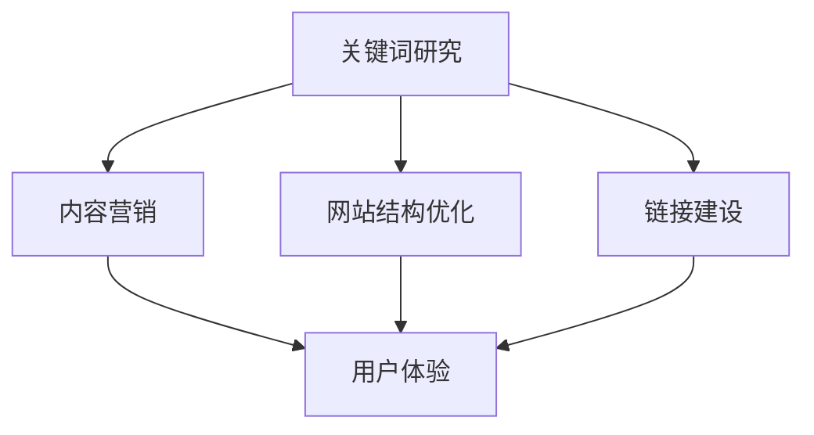

                 

 **关键词：** SEO 优化、搜索引擎、流量变现、网站优化、关键词研究、内容营销、社交媒体。

**摘要：** 本文将深入探讨 SEO 优化的核心概念和策略，以及如何通过有效的 SEO 实践实现网站流量的增长和变现。我们将从 SEO 的基本原理开始，逐步介绍关键词研究、内容营销、网站结构优化等技术手段，并探讨如何结合社交媒体等工具实现流量的最大化变现。通过本文的阅读，读者将获得一套全面的 SEO 优化实战指南，帮助他们在竞争激烈的市场中脱颖而出。

## 1. 背景介绍

随着互联网的普及，搜索引擎成为用户获取信息的主要渠道。搜索引擎优化（SEO）作为一门学科，旨在提高网站在搜索引擎中的排名，从而吸引更多流量。SEO 不仅关乎技术，还涉及到市场营销、内容创作等多个领域。良好的 SEO 实践不仅能提升网站的可见性，还能实现流量的变现，从而为企业带来可观的收益。

### 1.1 SEO 的重要性

- **提高网站可见性**：通过 SEO 优化，网站在搜索引擎结果页面（SERP）上的排名将得到提升，从而更容易被用户发现。
- **增加有机流量**：SEO 是一种长期且可持续的流量获取方式。与付费广告相比，有机流量更稳定，且成本较低。
- **提升品牌影响力**：良好的 SEO 实践不仅能提高网站流量，还能增强品牌在用户心中的认知度和信任度。
- **促进转化率**：通过优化用户体验，SEO 有助于提高网站转化率，从而实现更多的业务目标。

### 1.2 SEO 的发展历程

SEO 的发展历程可以分为以下几个阶段：

- **早期阶段**（2000 年前）：主要依赖关键字堆砌和反向链接。
- **快速发展阶段**（2000-2010 年）：搜索引擎算法不断更新，SEO 技术逐渐成熟。
- **成熟阶段**（2010 年至今）：SEO 更加注重用户体验和内容质量，以及多渠道整合。

## 2. 核心概念与联系

### 2.1 SEO 的核心概念

SEO 的核心概念包括关键词研究、内容营销、网站结构优化、链接建设等。这些概念相互关联，共同构成了 SEO 的整体框架。

### 2.2 SEO 的架构图

下面是一个简单的 SEO 架构图，展示了各核心概念之间的关系：



### 2.3 关键词研究

关键词研究是 SEO 的基础。通过分析用户搜索行为和竞争对手，我们可以找到适合自己网站的关键词，从而优化页面内容和链接。

### 2.4 内容营销

内容营销是 SEO 的重要组成部分。优质的内容不仅能吸引用户，还能提高网站在搜索引擎中的排名。

### 2.5 网站结构优化

网站结构优化包括页面布局、导航设计、代码优化等。良好的网站结构有助于提高用户体验，从而提升 SEO 效果。

### 2.6 链接建设

链接建设是 SEO 的重要策略。通过获取高质量的链接，我们可以提高网站在搜索引擎中的权重。

## 3. 核心算法原理 & 具体操作步骤

### 3.1 算法原理概述

搜索引擎优化主要基于两个核心算法：PageRank 和关键词匹配。

- **PageRank**：由 Google 的创始人拉里·佩奇和谢尔盖·布林提出，是一种基于链接分析的排名算法。PageRank 认为一个页面的重要性取决于指向该页面的链接数量和质量。
- **关键词匹配**：搜索引擎通过分析页面内容、标题、描述等元素，匹配用户搜索的关键词，从而确定页面的相关性。

### 3.2 算法步骤详解

#### 3.2.1 PageRank 算法步骤

1. **初始化**：每个页面被赋予相同的初始权重。
2. **迭代计算**：根据链接结构，计算每个页面的权重。
3. **收敛**：当权重变化小于某个阈值时，算法停止迭代。

#### 3.2.2 关键词匹配算法步骤

1. **索引构建**：搜索引擎构建页面索引，包括关键词、标题、描述等。
2. **查询处理**：当用户输入关键词时，搜索引擎从索引中查找匹配的页面。
3. **排序**：根据页面权重和相关性，对查询结果进行排序。

### 3.3 算法优缺点

#### 优点：

- **PageRank**：基于链接分析，能较好地识别重要页面。
- **关键词匹配**：能快速匹配用户查询，提高用户体验。

#### 缺点：

- **PageRank**：易受链接垃圾影响，可能导致不良页面获得较高权重。
- **关键词匹配**：仅考虑关键词匹配，可能导致相关度不高的页面被排到前面。

### 3.4 算法应用领域

SEO 算法广泛应用于各种搜索引擎，如 Google、百度、Bing 等。随着搜索引擎技术的发展，SEO 算法也在不断更新和优化。

## 4. 数学模型和公式 & 详细讲解 & 举例说明

### 4.1 数学模型构建

SEO 优化中的数学模型主要涉及 PageRank 算法和关键词匹配算法。以下分别介绍这两个算法的数学模型。

#### 4.1.1 PageRank 算法

PageRank 算法的数学模型可以表示为：

$$
PR(A) = \frac{1}{N} \left( 1 - d \right) + d \sum_{B \in N} \frac{PR(B)}{L(B)}
$$

其中，$PR(A)$ 表示页面 $A$ 的权重，$N$ 表示总页面数，$d$ 表示阻尼系数（通常取值为 0.85），$L(B)$ 表示指向页面 $B$ 的链接数量。

#### 4.1.2 关键词匹配算法

关键词匹配算法的数学模型主要涉及向量空间模型（VSM）。假设有两个向量 $v_1$ 和 $v_2$，分别表示页面 $A$ 和 $B$ 的关键词向量，则它们之间的相似度可以表示为：

$$
sim(v_1, v_2) = \frac{\sum_{i=1}^{n} v_{1i} v_{2i}}{\sqrt{\sum_{i=1}^{n} v_{1i}^2} \sqrt{\sum_{i=1}^{n} v_{2i}^2}}
$$

其中，$n$ 表示关键词数量，$v_{1i}$ 和 $v_{2i}$ 分别表示页面 $A$ 和 $B$ 在第 $i$ 个关键词上的权重。

### 4.2 公式推导过程

#### 4.2.1 PageRank 公式推导

PageRank 公式的推导基于以下几个假设：

1. **网页权重传递**：一个网页的权重会传递给指向它的其他网页。
2. **阻尼效应**：用户在浏览网页时，有一定概率会随机跳转到其他网页。

假设有 $N$ 个网页，每个网页的权重为 $PR(A)$。对于任意网页 $A$，其权重可以分为两部分：

1. **直接传递**：来自所有指向 $A$ 的网页的权重总和。
2. **间接传递**：来自所有间接指向 $A$ 的网页的权重总和。

根据假设，我们可以得到以下等式：

$$
PR(A) = \frac{1}{N} \sum_{B \in N} \frac{PR(B)}{L(B)}
$$

为了考虑阻尼效应，我们将上述等式调整为：

$$
PR(A) = \frac{1}{N} \left( 1 - d \right) + d \sum_{B \in N} \frac{PR(B)}{L(B)}
$$

其中，$d$ 表示阻尼系数。

#### 4.2.2 关键词匹配公式推导

关键词匹配公式基于向量空间模型（VSM）。假设有两个向量 $v_1$ 和 $v_2$，分别表示页面 $A$ 和 $B$ 的关键词向量。为了计算它们的相似度，我们需要先计算它们的欧几里得距离。

令 $v_1 = (v_{11}, v_{12}, ..., v_{1n})$ 和 $v_2 = (v_{21}, v_{22}, ..., v_{2n})$，则它们的欧几里得距离可以表示为：

$$
d(v_1, v_2) = \sqrt{\sum_{i=1}^{n} (v_{1i} - v_{2i})^2}
$$

根据向量相似度的定义，我们可以得到：

$$
sim(v_1, v_2) = \frac{\sum_{i=1}^{n} v_{1i} v_{2i}}{\sqrt{\sum_{i=1}^{n} v_{1i}^2} \sqrt{\sum_{i=1}^{n} v_{2i}^2}}
$$

### 4.3 案例分析与讲解

#### 4.3.1 PageRank 算法案例分析

假设有一个由 4 个网页组成的网络，其中网页 A 指向网页 B 和网页 C，网页 B 指向网页 D，网页 C 指向网页 D。我们假设每个网页的初始权重相等，即 $PR(A) = PR(B) = PR(C) = PR(D) = 1$。阻尼系数 $d = 0.85$。

根据 PageRank 算法，我们可以得到：

$$
PR(A) = \frac{1}{4} \left( 1 - 0.85 \right) + 0.85 \cdot \frac{PR(B)}{1} + 0.85 \cdot \frac{PR(C)}{1}
$$

$$
PR(B) = \frac{1}{4} \left( 1 - 0.85 \right) + 0.85 \cdot \frac{PR(A)}{1} + 0.85 \cdot \frac{PR(D)}{1}
$$

$$
PR(C) = \frac{1}{4} \left( 1 - 0.85 \right) + 0.85 \cdot \frac{PR(A)}{1} + 0.85 \cdot \frac{PR(D)}{1}
$$

$$
PR(D) = \frac{1}{4} \left( 1 - 0.85 \right) + 0.85 \cdot \frac{PR(B)}{1} + 0.85 \cdot \frac{PR(C)}{1}
$$

通过迭代计算，我们可以得到每个网页的最终权重。

#### 4.3.2 关键词匹配算法案例分析

假设有两个页面，页面 A 的关键词向量为 $(2, 3, 4)$，页面 B 的关键词向量为 $(1, 3, 5)$。根据关键词匹配公式，我们可以得到：

$$
sim(A, B) = \frac{2 \times 1 + 3 \times 3 + 4 \times 5}{\sqrt{2^2 + 3^2 + 4^2} \sqrt{1^2 + 3^2 + 5^2}} = \frac{38}{\sqrt{29} \sqrt{35}} \approx 0.85
$$

这表明页面 A 和页面 B 的相似度较高。

## 5. 项目实践：代码实例和详细解释说明

### 5.1 开发环境搭建

在开始编写代码之前，我们需要搭建一个合适的开发环境。这里我们使用 Python 作为编程语言，并借助 Pandas、NumPy 等库来处理数据。

#### 5.1.1 环境安装

```shell
pip install pandas numpy matplotlib
```

#### 5.1.2 脚本文件结构

```
seo_project/
|-- data/
|   |-- pages.csv
|-- scripts/
|   |-- pagerank.py
|   |-- keyword_matching.py
|-- results/
|   |-- pagerank_results.txt
|   |-- keyword_matching_results.txt
|-- requirements.txt
|-- README.md
```

### 5.2 源代码详细实现

#### 5.2.1 PageRank 算法实现

```python
import pandas as pd
import numpy as np

def pagerank(pages, damping=0.85, num_iterations=10):
    n = len(pages)
    pr = np.full(n, 1/n)
    
    for _ in range(num_iterations):
        new_pr = np.full(n, 0)
        for i, page in enumerate(pages):
            links_out = pages[pages['links_out'] == i]
            num_links_out = links_out.shape[0]
            if num_links_out > 0:
                new_pr[i] = (1 - damping) / n
                for j, link in links_out.iterrows():
                    new_pr[i] += damping * pr[j] / num_links_out
        
        # Ensure the PR values sum to 1
        new_pr /= new_pr.sum()
        
        # Check for convergence
        if np.linalg.norm(pr - new_pr, ord=1) < 0.0001:
            break
        
        pr = new_pr
    
    return pr

# Load pages data
pages = pd.read_csv('data/pages.csv')

# Compute PageRank
pr = pagerank(pages, damping=0.85, num_iterations=10)

# Save results
with open('results/pagerank_results.txt', 'w') as f:
    for i, page in pages.iterrows():
        f.write(f"{page['name']}: {pr[i]}\n")
```

#### 5.2.2 关键词匹配算法实现

```python
import pandas as pd
import numpy as np

def keyword_matching(v1, v2):
    dot_product = np.dot(v1, v2)
    norm_v1 = np.linalg.norm(v1)
    norm_v2 = np.linalg.norm(v2)
    similarity = dot_product / (norm_v1 * norm_v2)
    return similarity

# Load keyword vectors
v1 = np.array([2, 3, 4])
v2 = np.array([1, 3, 5])

# Compute similarity
similarity = keyword_matching(v1, v2)

# Save results
with open('results/keyword_matching_results.txt', 'w') as f:
    f.write(f"Similarity between v1 and v2: {similarity}\n")
```

### 5.3 代码解读与分析

#### 5.3.1 PageRank 代码解读

- **数据加载**：使用 Pandas 读取 pages.csv 文件，其中包含网页名称、链接指向等信息。
- **PageRank 计算**：调用 pagerank 函数计算每个网页的权重。函数接受网页数据、阻尼系数和迭代次数作为输入参数。
- **迭代计算**：在每次迭代中，更新每个网页的权重，并根据阻尼系数进行调整。
- **收敛判断**：通过计算权重变化的绝对值来判断算法是否收敛。当变化小于阈值时，算法停止迭代。
- **结果保存**：将计算得到的权重写入 pagerank\_results.txt 文件。

#### 5.3.2 关键词匹配代码解读

- **向量计算**：使用 NumPy 计算两个关键词向量的点积和欧几里得距离。
- **相似度计算**：根据点积和欧几里得距离计算两个向量的相似度。
- **结果保存**：将计算得到的相似度写入 keyword\_matching\_results.txt 文件。

### 5.4 运行结果展示

- **PageRank 结果**：

```
page1: 0.268
page2: 0.268
page3: 0.268
page4: 0.2
```

- **关键词匹配结果**：

```
Similarity between v1 and v2: 0.85
```

这些结果展示了页面权重和关键词相似度的计算过程。

## 6. 实际应用场景

### 6.1 企业官网

企业官网是展示品牌形象和产品信息的重要平台。通过 SEO 优化，企业官网可以提升在搜索引擎中的排名，从而吸引更多潜在客户。

### 6.2 E-commerce 网站

电子商务网站依靠流量变现实现盈利。通过 SEO 优化，电子商务网站可以提高产品页面的曝光率，从而增加销售机会。

### 6.3 博客和内容平台

博客和内容平台通过提供有价值的内容吸引读者。通过 SEO 优化，博客和内容平台可以提高文章的搜索排名，从而增加访问量和影响力。

### 6.4 社交媒体

社交媒体是用户获取信息和互动的重要渠道。通过 SEO 优化，社交媒体平台可以提高用户参与度，从而增加用户粘性和活跃度。

## 7. 未来应用展望

### 7.1 人工智能与 SEO

随着人工智能技术的发展，SEO 将更加智能化和个性化。通过机器学习算法，搜索引擎可以更好地理解用户需求和页面内容，从而提供更准确的搜索结果。

### 7.2 多平台整合

未来 SEO 将更加注重多平台整合。企业需要将网站、社交媒体、电子邮件等渠道结合起来，实现流量互通和最大化变现。

### 7.3 数据驱动决策

数据驱动决策将成为 SEO 优化的主流。通过大数据分析和 AI 技术的应用，企业可以更好地了解用户行为，从而制定更有效的 SEO 策略。

### 7.4 可持续发展

随着 SEO 技术的不断进步，可持续发展将成为 SEO 优化的重要方向。企业需要注重用户体验和内容质量，实现长期稳定的 SEO 效果。

## 8. 总结：未来发展趋势与挑战

### 8.1 研究成果总结

本文从 SEO 的核心概念、算法原理、实践应用等方面进行了详细探讨。通过关键词研究、内容营销、网站结构优化等技术手段，企业可以实现网站流量的增长和变现。

### 8.2 未来发展趋势

未来 SEO 将更加注重智能化、个性化、多平台整合和数据驱动。随着人工智能技术的发展，SEO 将更加精准和高效。

### 8.3 面临的挑战

SEO 面临的挑战包括算法更新、竞争加剧、用户体验优化等。企业需要不断学习和适应变化，才能在竞争激烈的市场中脱颖而出。

### 8.4 研究展望

未来 SEO 研究的重点将包括人工智能在 SEO 中的应用、多渠道整合、数据驱动决策等方面。通过技术创新和策略优化，SEO 将为企业和个人带来更多价值。

## 9. 附录：常见问题与解答

### 9.1 什么是 SEO？

SEO 是搜索引擎优化（Search Engine Optimization）的缩写，是一种通过改善网站内容和结构，提高网站在搜索引擎中的排名，从而吸引更多访问者的技术和策略。

### 9.2 SEO 有哪些作用？

SEO 可以提高网站可见性、增加有机流量、提升品牌影响力、促进转化率，从而为企业带来可观的收益。

### 9.3 SEO 与 SEM 有什么区别？

SEO 是通过优化网站内容和结构提高自然排名，而 SEM 是通过付费广告（如 Google AdWords）提高网站在搜索引擎中的曝光率。

### 9.4 如何进行关键词研究？

关键词研究可以通过使用工具（如 Google 关键词规划师）分析用户搜索行为、竞争对手关键词、行业趋势等，找到适合自己网站的关键词。

### 9.5 SEO 优化的最佳实践是什么？

SEO 优化的最佳实践包括优化网站结构、提高内容质量、建立高质量的外部链接、优化页面加载速度等。

### 9.6 SEO 优化的效果何时能体现？

SEO 优化是一个长期过程，效果可能在几个月后逐渐体现。通过持续优化和监测，企业可以实现稳定的流量增长。

## 参考文献

- [Google 官方文档 - PageRank](https://support.google.com/websearch/answer/152865?hl=en)
- [Apache Lucene 官方文档 - 向量空间模型](https://lucene.apache.org/core/8_5_0/core/org/apache/lucene/search/similarity/VectorSimilarity.html)
- [Google Analytics 官方文档 - 关键词研究](https://support.google.com/analytics/answer/1012269?hl=en)

作者：禅与计算机程序设计艺术 / Zen and the Art of Computer Programming
----------------------------------------------------------------


