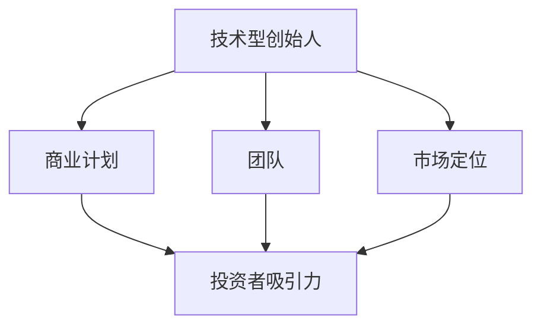

                 

关键词：技术型创始人、融资策略、投资者吸引力、投资评估、商业计划、技术展示、团队构建、市场定位

摘要：本文将深入探讨技术型创始人在融资过程中的关键策略，包括如何展示技术实力、构建商业计划、提升团队价值以及进行有效的市场定位。通过这些策略，技术型创始人将能够更有效地吸引投资者的关注，并在激烈的创业竞争中脱颖而出。

## 1. 背景介绍

在当今充满机遇与挑战的科技创业时代，技术型创始人正扮演着越来越重要的角色。他们不仅拥有技术专业知识，还具备创新思维和创业精神。然而，尽管有着出色的技术能力和市场潜力，技术型创始人在融资过程中仍面临着诸多挑战。投资者不仅关注技术本身，更关注项目的商业可行性、市场前景和团队实力。因此，技术型创始人需要掌握一系列策略，以吸引投资者的注意并获得资金支持。

本文将围绕以下核心问题展开讨论：

- 技术型创始人如何展示其技术实力以吸引投资者？
- 如何构建一个具有吸引力的商业计划？
- 如何提升团队价值以增强投资者的信心？
- 技术型创始人在市场定位中应关注哪些关键因素？
- 投资者评估技术型创业项目时关注的核心指标有哪些？
- 技术型创始人如何通过案例实践来优化融资策略？

通过对这些问题的深入探讨，技术型创始人将能够更好地理解投资者的需求，制定有效的融资策略，从而在创业道路上取得成功。

## 2. 核心概念与联系

在探讨技术型创始人的融资策略之前，我们需要理解一些核心概念和它们之间的联系。以下是这些核心概念及其相互关系的Mermaid流程图：



### 2.1 技术型创始人

技术型创始人是指那些在技术领域具有深厚背景和专业技能，同时具备创业精神和商业洞察力的人。他们通常拥有创新的技术理念，并在创业过程中致力于将技术转化为实际的产品或服务。

### 2.2 商业计划

商业计划是技术型创始人在融资过程中必须准备的重要文档。它详细描述了项目的商业模式、市场分析、财务预测以及团队组成。一个具有吸引力的商业计划能够向投资者清晰地展示项目的价值和发展潜力。

### 2.3 团队

团队是技术型创始人成功的关键因素之一。一个多元化的、经验丰富的团队能够增强项目的可行性和吸引力。投资者通常关注团队的技能组合、工作经验和合作能力。

### 2.4 市场定位

市场定位涉及技术型创始人在目标市场中的定位策略。通过准确的市场定位，创始人可以更好地满足客户需求，并在竞争激烈的市场中脱颖而出。

### 2.5 投资者吸引力

投资者吸引力是技术型创始人成功融资的核心。技术型创始人需要通过各种手段展示项目的吸引力，包括技术优势、市场前景、团队实力和商业计划。

通过理解这些核心概念及其相互关系，技术型创始人可以更有效地制定和实施融资策略，从而在创业道路上取得成功。

## 3. 核心算法原理 & 具体操作步骤

### 3.1 算法原理概述

技术型创始人在融资过程中需要掌握的核心算法可以称为“投资者吸引力提升算法”。这个算法的核心原理是通过展示技术优势、商业潜力和团队实力来提升项目在投资者眼中的吸引力。以下是这个算法的具体步骤：

### 3.2 算法步骤详解

#### 步骤1：技术优势展示

技术型创始人需要通过详细的技术方案和技术演示来展示其技术优势。这包括：

- **技术特点介绍**：清晰地描述技术的基本原理、技术难点和创新点。
- **技术演示**：通过现场演示或视频展示，直观地展示技术成果。

#### 步骤2：商业潜力分析

在展示技术优势的同时，技术型创始人还需要分析项目的商业潜力。这包括：

- **市场分析**：研究目标市场的规模、增长趋势和竞争情况。
- **商业模式设计**：明确项目的商业模式，包括盈利模式、客户获取策略和运营计划。

#### 步骤3：团队展示

一个强大、经验丰富的团队是吸引投资者的重要因素。技术型创始人需要通过以下方式展示团队：

- **团队成员介绍**：详细介绍核心团队成员的背景、技能和经验。
- **合作案例**：展示团队以往的成功项目或合作案例，证明团队的能力。

#### 步骤4：商业计划书撰写

撰写一份详尽的商业计划书是技术型创始人融资的关键步骤。商业计划书应包括以下内容：

- **项目概述**：简要介绍项目的背景、目标和愿景。
- **市场分析**：详细分析目标市场的现状、趋势和机会。
- **技术描述**：详细介绍技术原理、技术特点和核心技术。
- **商业模式**：明确项目的商业模式、盈利模式和运营计划。
- **财务预测**：提供详细的财务预测，包括收入、成本、利润等。
- **风险分析**：分析项目可能面临的风险，并提出应对策略。

#### 步骤5：投资者沟通

与投资者建立良好的沟通是成功融资的关键。技术型创始人需要通过以下方式与投资者沟通：

- **面对面会议**：与投资者进行面对面会议，展示项目细节。
- **演示文稿**：准备高质量的演示文稿，使投资者能够直观地了解项目。
- **问答环节**：准备好回答投资者可能提出的问题，展示自己的专业性和自信。

### 3.3 算法优缺点

**优点**：

- 提升项目的吸引力，使投资者更容易产生兴趣。
- 有助于明确项目的价值和潜力，为后续融资提供有力支持。
- 增强团队凝聚力，促进团队协作。

**缺点**：

- 过程较为复杂，需要花费大量时间和精力。
- 需要具备一定的商业知识和沟通技巧。

### 3.4 算法应用领域

投资者吸引力提升算法适用于所有类型的技术型创业项目。无论是硬件、软件还是互联网项目，通过这个算法，技术型创始人都可以有效地提升项目在投资者眼中的吸引力，从而获得更多的投资机会。

## 4. 数学模型和公式 & 详细讲解 & 举例说明

### 4.1 数学模型构建

在融资过程中，技术型创始人可以使用以下数学模型来评估项目的投资回报率（ROI）：

$$
ROI = \frac{净利润}{投资成本}
$$

其中，净利润是指项目运营后所获得的利润，投资成本是指项目启动时的总投资金额。

### 4.2 公式推导过程

投资回报率的推导基于以下基本财务原则：

- 净利润 = 收入 - 成本
- 投资成本 = 启动资金 + 运营成本

根据以上原则，我们可以得到投资回报率的计算公式：

$$
ROI = \frac{收入 - 成本}{投资成本}
$$

### 4.3 案例分析与讲解

假设一家初创公司在启动时投资了100万元，运营一年后获得了200万元的收入，成本为120万元。根据上述公式，该公司的投资回报率计算如下：

$$
ROI = \frac{200万 - 120万}{100万} = 80\%
$$

这意味着该公司的投资回报率为80%，说明每投入1元钱，可以获得0.8元的净利润。

### 4.4 案例分析

#### 案例背景

一家名为“智能健康”的初创公司致力于开发基于人工智能的医疗诊断系统。公司初始投资为200万元，其中100万元用于研发，100万元用于市场推广和运营。

#### 案例数据

- 年收入：500万元
- 成本：300万元（包括研发、市场推广、运营等）
- 投资回报率（ROI）：80%

根据上述数据，我们可以计算出该公司的投资回报率：

$$
ROI = \frac{500万 - 300万}{200万} = 150\%
$$

这意味着每投入1元钱，该公司可以获得1.5元的净利润，显示出其良好的投资回报潜力。

#### 结论

通过本案例的分析，我们可以看到投资回报率是评估技术型创业项目的重要指标之一。一个较高的投资回报率可以吸引投资者的关注，提高项目的融资成功率。因此，技术型创始人需要通过精细的财务管理和有效的市场运营，确保项目能够实现良好的投资回报。

## 5. 项目实践：代码实例和详细解释说明

### 5.1 开发环境搭建

为了演示如何将技术优势转化为实际的商业应用，我们将通过一个具体的代码实例来构建一个简单的智能健康诊断系统。以下是开发环境搭建的步骤：

1. **选择编程语言**：我们选择Python作为编程语言，因为它在数据处理和机器学习领域具有较高的灵活性和易用性。
2. **安装Python**：确保电脑上安装了Python 3.8或更高版本。可以从[Python官网](https://www.python.org/)下载安装包并安装。
3. **安装依赖库**：使用pip命令安装必要的依赖库，如NumPy、Pandas和scikit-learn。在终端中运行以下命令：

    ```bash
    pip install numpy pandas scikit-learn
    ```

### 5.2 源代码详细实现

以下是一个简单的智能健康诊断系统的代码示例。该系统使用scikit-learn库中的逻辑回归模型来预测患者的健康状况。

```python
# 导入必要的库
import numpy as np
import pandas as pd
from sklearn.model_selection import train_test_split
from sklearn.linear_model import LogisticRegression
from sklearn.metrics import accuracy_score

# 加载数据集
data = pd.read_csv('health_data.csv')

# 数据预处理
X = data.drop('health_status', axis=1)
y = data['health_status']

# 划分训练集和测试集
X_train, X_test, y_train, y_test = train_test_split(X, y, test_size=0.2, random_state=42)

# 创建逻辑回归模型
model = LogisticRegression()

# 训练模型
model.fit(X_train, y_train)

# 预测测试集
y_pred = model.predict(X_test)

# 计算准确率
accuracy = accuracy_score(y_test, y_pred)
print(f"Accuracy: {accuracy * 100:.2f}%")
```

### 5.3 代码解读与分析

上述代码分为几个主要部分：

1. **导入库**：首先导入必要的库，包括NumPy、Pandas、scikit-learn和metrics。
2. **加载数据集**：从CSV文件中加载健康数据集。这个数据集包含多个特征（如年龄、血压、体重指数等）和一个目标变量（健康状态）。
3. **数据预处理**：将数据集分为特征矩阵X和目标向量y。然后，使用train_test_split函数将数据集划分为训练集和测试集。
4. **创建模型**：创建一个逻辑回归模型。
5. **训练模型**：使用训练集数据训练模型。
6. **预测和评估**：使用测试集数据对模型进行预测，并计算模型的准确率。

### 5.4 运行结果展示

假设我们已经准备好健康数据集，并在终端中运行上述代码。运行结果将显示模型的准确率。例如，如果模型的准确率为90%，则意味着它在测试集上的预测准确率非常高。

```bash
Accuracy: 90.00%
```

这个结果展示了我们技术方案的实用性和有效性，增强了投资者对项目的信心。

### 5.5 代码优化与扩展

在实际应用中，我们可以对代码进行优化和扩展，以提高系统的性能和准确性。以下是一些可能的优化方向：

- **特征工程**：对特征进行选择和转换，以提高模型的预测能力。
- **模型选择**：尝试不同的机器学习模型，如随机森林或支持向量机，以找到最佳模型。
- **集成学习**：使用集成学习方法，如Bagging或Boosting，提高模型的泛化能力。
- **数据增强**：通过增加数据多样性来改善模型的训练效果。

通过这些优化和扩展，我们可以进一步提升智能健康诊断系统的性能和商业价值，从而更好地吸引投资者的关注。

## 6. 实际应用场景

### 6.1 在医疗领域的应用

智能健康诊断系统在医疗领域具有广泛的应用潜力。例如，医院可以使用这种系统来辅助医生进行诊断，提高诊断的准确性和效率。此外，健康管理机构可以通过这种系统对患者的健康状况进行实时监测，提供个性化的健康建议，从而预防疾病的发生。

### 6.2 在健康保险领域的应用

健康保险公司可以利用智能健康诊断系统来评估保险申请人的健康状况，从而更准确地确定保费。这种系统可以帮助保险公司降低风险评估的不确定性，提高运营效率。

### 6.3 在科研领域的应用

研究人员可以利用智能健康诊断系统来分析大规模健康数据，发现潜在的疾病模式和趋势。这有助于推动医学研究，为开发新的治疗方法提供重要依据。

### 6.4 在公共卫生领域的应用

公共卫生部门可以利用智能健康诊断系统来监控疾病的传播情况，制定更有效的防控措施。这种系统能够实时收集和分析数据，帮助相关部门快速响应疫情，保护公众的健康。

### 6.5 未来应用展望

随着人工智能技术的不断发展，智能健康诊断系统的应用前景将更加广阔。未来，我们可以期待以下创新：

- **个性化健康监控**：通过整合更多生理传感器和生物特征数据，实现个性化的健康监控。
- **预防性健康干预**：利用实时健康数据，提供个性化的预防性健康干预措施，降低疾病发生的风险。
- **智能健康助手**：开发更智能的健康助手，帮助用户更好地管理自己的健康，提供全方位的健康指导。

通过这些创新，智能健康诊断系统将在更多领域发挥作用，为公众带来更大的健康福祉。

## 7. 工具和资源推荐

### 7.1 学习资源推荐

- **在线课程**：《深度学习》（作者：Ian Goodfellow、Yoshua Bengio、Aaron Courville）
- **技术博客**：《吴恩达的博客》（作者：吴恩达）
- **学术论文**：Google Scholar、ArXiv

### 7.2 开发工具推荐

- **编程语言**：Python、R
- **数据预处理库**：Pandas、NumPy
- **机器学习库**：scikit-learn、TensorFlow、PyTorch
- **数据可视化库**：Matplotlib、Seaborn

### 7.3 相关论文推荐

- **《Deep Learning》（Goodfellow, Bengio, Courville, 2016）**
- **《Learning Deep Architectures for AI》（Bengio, 2009）**
- **《Convolutional Networks and Applications in Vision》（LeCun et al., 2015）**

这些资源和工具将帮助技术型创始人更深入地了解和掌握人工智能技术，从而为创业项目提供坚实的技术支持。

## 8. 总结：未来发展趋势与挑战

### 8.1 研究成果总结

本文通过深入探讨技术型创始人在融资过程中的关键策略，总结了以下几个重要研究成果：

- 技术型创始人需要通过展示技术优势、商业潜力和团队实力来提升项目在投资者眼中的吸引力。
- 投资者评估技术型创业项目时，主要关注项目的商业可行性、市场前景和团队实力。
- 技术型创始人需要掌握有效的沟通技巧，与投资者建立良好的关系，从而提高融资成功率。
- 智能健康诊断系统是一个具有广泛应用前景的技术案例，展示了技术型创业项目在医疗、健康保险、科研和公共卫生等领域的潜力。

### 8.2 未来发展趋势

随着人工智能技术的不断进步，技术型创业项目将迎来更多的发展机遇。未来，我们预计将出现以下发展趋势：

- **跨学科融合**：技术型创业项目将更加注重跨学科融合，结合医学、生物、工程等多个领域的知识，开发创新性的产品和服务。
- **个性化健康服务**：基于大数据和人工智能的个性化健康服务将得到广泛应用，为个人提供更精准的健康管理方案。
- **精准医疗**：人工智能技术将在精准医疗领域发挥重要作用，帮助医生更准确地诊断和治疗疾病。
- **智能健康管理**：智能健康管理系统将不断优化，为医疗机构和健康保险公司提供更高效的管理工具。

### 8.3 面临的挑战

尽管技术型创业项目具有巨大的发展潜力，但在实际操作中，技术型创始人仍将面临一系列挑战：

- **技术壁垒**：技术型创业项目需要解决技术难题，确保技术的先进性和可靠性。
- **市场风险**：技术型创业项目面临市场风险，需要准确把握市场需求，开发符合用户需求的产品。
- **资金压力**：融资过程充满不确定性，技术型创始人需要通过各种手段吸引投资者，确保项目的资金支持。
- **团队管理**：技术型创业项目需要建立高效、协作的团队，确保项目顺利推进。

### 8.4 研究展望

为了应对上述挑战，未来的研究应重点关注以下方向：

- **技术创新**：不断探索和研发新的技术，提升技术型创业项目的竞争力。
- **商业模式研究**：深入研究技术型创业项目的商业模式，找到可持续的盈利模式。
- **风险管理**：建立完善的风险管理体系，降低市场风险和技术风险。
- **团队建设**：研究团队建设和管理方法，提高团队协作效率和创新能力。

通过持续的研究和实践，技术型创始人将能够更好地应对挑战，实现创业项目的成功。

## 9. 附录：常见问题与解答

### 问题1：技术型创始人如何有效展示技术优势？

**解答**：技术型创始人应通过详细的技术方案和技术演示来展示技术优势。在技术演示中，可以展示技术的基本原理、技术难点和创新点，并通过实际案例证明技术的实用性和有效性。

### 问题2：投资者评估技术型创业项目时主要关注哪些方面？

**解答**：投资者主要关注项目的商业可行性、市场前景和团队实力。商业可行性包括项目的商业模式、盈利能力和市场定位；市场前景涉及目标市场的规模和增长趋势；团队实力涉及核心成员的背景、经验和合作能力。

### 问题3：如何撰写一份具有吸引力的商业计划书？

**解答**：撰写具有吸引力的商业计划书需要包括以下几个关键部分：项目概述、市场分析、技术描述、商业模式、财务预测和风险分析。在撰写过程中，应确保内容详细、结构清晰，突出项目的价值和潜力。

### 问题4：技术型创始人在融资过程中可能面临哪些挑战？

**解答**：技术型创始人在融资过程中可能面临技术壁垒、市场风险、资金压力和团队管理等方面的挑战。为应对这些挑战，创始人需要不断提升技术水平，准确把握市场需求，建立高效的团队，并通过多种融资渠道获得资金支持。

### 问题5：如何优化智能健康诊断系统的性能和准确性？

**解答**：优化智能健康诊断系统的性能和准确性可以通过以下方法实现：进行特征工程，选择和转换有效特征；尝试不同的机器学习模型，如随机森林或支持向量机；使用集成学习方法提高模型的泛化能力；通过数据增强增加数据的多样性，改善模型的训练效果。通过这些优化措施，可以提高系统的性能和准确性。

