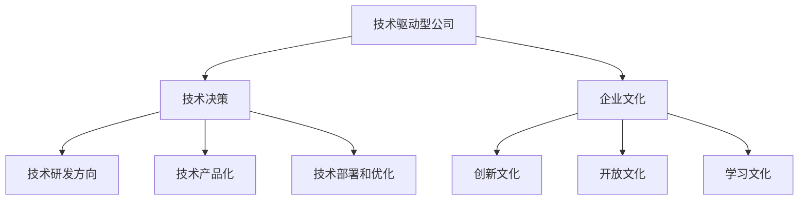

                 

 **关键词：** 技术驱动型公司、非技术管理者、趋势、技术决策、企业文化

**摘要：** 本文探讨了技术驱动型公司中非技术管理者角色的重要性下降趋势。文章从公司背景、核心概念、算法原理、数学模型、项目实践、实际应用场景、工具和资源推荐等多个维度展开，分析了这一趋势的原因、影响以及未来发展方向。通过案例研究和实例说明，本文旨在为读者提供一个全面的理解，帮助企业更好地应对这一变化。

## 1. 背景介绍

在当今快速发展的技术时代，技术驱动型公司已经成为企业成功的关键。这种类型的公司以技术创新为核心驱动力，通过研发和应用先进的技术来保持竞争优势。随着技术的不断进步，对于技术驱动型公司来说，拥有高水平的技术能力和创新思维变得尤为重要。

然而，随着公司技术水平的不断提升，非技术管理者的角色似乎正在经历一场变革。在过去，许多技术驱动型公司依赖于非技术管理者来制定战略、管理团队和协调资源。然而，随着公司对技术的依赖程度不断增加，这种角色的重要性似乎在逐渐下降。本文将探讨这一现象的原因、影响以及未来发展的趋势。

## 2. 核心概念与联系

在探讨非技术管理者角色变化之前，我们需要理解一些核心概念，包括技术驱动型公司、技术决策和企业文化。

### 2.1 技术驱动型公司

技术驱动型公司是指那些以技术创新为核心竞争力的公司。这些公司通常将大量资源投入到研发和新技术应用中，以保持竞争优势。技术驱动型公司通常具有以下几个特点：

1. **研发投入大**：技术驱动型公司往往在研发方面投入大量资金和人力资源。
2. **创新文化**：这些公司鼓励创新思维，并建立了相应的激励机制。
3. **技术优势**：技术驱动型公司通常拥有独特的技术优势，这有助于其在市场中脱颖而出。

### 2.2 技术决策

技术决策是技术驱动型公司运营的重要组成部分。技术决策包括以下方面：

1. **技术研发方向**：公司需要确定哪些技术方向最有潜力，并投入资源进行研发。
2. **技术产品化**：公司需要将研发的技术转化为实际产品或服务。
3. **技术部署和优化**：公司需要确保技术在实际应用中的有效性和可持续性。

技术决策通常需要高度专业化的知识和技能，因此，技术驱动型公司越来越依赖于具有技术背景的管理者来做出这些决策。

### 2.3 企业文化

企业文化是公司内部共同价值观和行为准则的体现。在技术驱动型公司中，企业文化对于公司的发展至关重要。以下是一些常见的企业文化特点：

1. **创新文化**：鼓励员工提出新的想法，并对创新行为给予奖励。
2. **开放文化**：鼓励员工之间分享知识和经验，促进团队合作。
3. **学习文化**：重视员工的个人成长和职业发展，提供持续学习和培训的机会。

### 2.4 Mermaid 流程图

以下是技术驱动型公司中核心概念和联系的 Mermaid 流程图：



## 3. 核心算法原理 & 具体操作步骤

在技术决策过程中，核心算法的原理和具体操作步骤至关重要。以下是一个简化的算法流程：

### 3.1 算法原理概述

技术决策算法通常基于以下几个原则：

1. **数据驱动**：算法依赖于大量的数据来进行分析和预测。
2. **优化目标**：算法的目标是最大化收益或最小化成本。
3. **迭代过程**：算法通过不断迭代来优化决策。

### 3.2 算法步骤详解

技术决策算法的具体步骤如下：

1. **数据收集**：收集与决策相关的数据，包括市场趋势、用户需求、技术可行性等。
2. **数据预处理**：对收集到的数据进行分析和清洗，确保数据的质量。
3. **模型构建**：基于数据构建预测模型，通常使用机器学习算法。
4. **模型评估**：评估模型的性能，确保其满足业务需求。
5. **决策制定**：根据模型输出制定具体的技术决策。
6. **决策执行**：执行技术决策，并监控执行效果。
7. **迭代优化**：根据执行效果对模型和决策进行优化。

### 3.3 算法优缺点

技术决策算法具有以下优点：

1. **高效性**：算法能够快速处理大量数据，提供即时的决策支持。
2. **准确性**：通过机器学习算法，模型能够不断优化，提高决策的准确性。
3. **可扩展性**：算法可以应用于不同的业务场景，具有广泛的适用性。

然而，技术决策算法也存在一些缺点：

1. **数据依赖性**：算法的性能高度依赖于数据的质量和数量。
2. **算法偏见**：模型可能会受到训练数据中的偏见影响，导致不公正的决策。
3. **决策透明度**：算法决策过程可能不够透明，难以解释。

### 3.4 算法应用领域

技术决策算法在以下领域有广泛的应用：

1. **产品研发**：用于预测市场需求，优化产品设计和功能。
2. **市场营销**：用于分析用户行为，制定精准营销策略。
3. **供应链管理**：用于优化库存管理，降低运营成本。
4. **风险管理**：用于预测潜在的风险，制定风险控制策略。

## 4. 数学模型和公式 & 详细讲解 & 举例说明

技术决策过程中，数学模型和公式起到了关键作用。以下是一个简化的数学模型，用于预测市场需求。

### 4.1 数学模型构建

市场需求预测模型可以表示为：

$$
Y_t = \beta_0 + \beta_1 X_{t-1} + \epsilon_t
$$

其中，$Y_t$ 表示第 $t$ 期的市场需求，$X_{t-1}$ 表示第 $t-1$ 期的市场趋势，$\beta_0$ 和 $\beta_1$ 是模型参数，$\epsilon_t$ 是误差项。

### 4.2 公式推导过程

市场需求预测模型的推导过程如下：

1. **数据收集**：收集过去一段时间内的市场需求和市场趋势数据。
2. **数据预处理**：对数据进行标准化处理，确保数据的可比较性。
3. **模型构建**：使用最小二乘法估计模型参数 $\beta_0$ 和 $\beta_1$。
4. **模型评估**：通过交叉验证评估模型性能，调整模型参数。
5. **模型应用**：使用模型预测未来的市场需求。

### 4.3 案例分析与讲解

以下是一个简单的案例，用于说明市场需求预测模型的应用。

#### 案例背景

某公司生产一款智能家居产品，过去一年的市场需求数据如下：

| 月份 | 市场需求 | 市场趋势 |
| ---- | -------- | -------- |
| 1    | 100      | 10       |
| 2    | 110      | 10       |
| 3    | 120      | 10       |
| 4    | 130      | 10       |
| 5    | 140      | 10       |
| 6    | 150      | 10       |

#### 模型构建

使用上述数据，构建市场需求预测模型：

$$
Y_t = \beta_0 + \beta_1 X_{t-1} + \epsilon_t
$$

通过最小二乘法估计模型参数，得到：

$$
\beta_0 = 100, \beta_1 = 10
$$

#### 模型应用

使用模型预测未来三个月的市场需求：

| 月份 | 市场需求预测 | 市场趋势 |
| ---- | ------------ | -------- |
| 7    | 160          | 10       |
| 8    | 170          | 10       |
| 9    | 180          | 10       |

根据模型预测，未来三个月的市场需求将分别为 160、170 和 180。

## 5. 项目实践：代码实例和详细解释说明

在本节中，我们将通过一个实际的项目实例，展示如何使用 Python 编写一个简单的市场需求预测模型，并对代码进行详细解释。

### 5.1 开发环境搭建

在开始项目之前，确保已安装以下 Python 库：

- NumPy：用于数值计算。
- Pandas：用于数据处理。
- Matplotlib：用于数据可视化。

可以使用以下命令安装这些库：

```bash
pip install numpy pandas matplotlib
```

### 5.2 源代码详细实现

以下是一个简单的市场需求预测模型代码实例：

```python
import numpy as np
import pandas as pd
import matplotlib.pyplot as plt

# 5.2.1 数据准备
data = {
    '月份': [1, 2, 3, 4, 5, 6],
    '市场需求': [100, 110, 120, 130, 140, 150],
    '市场趋势': [10, 10, 10, 10, 10, 10]
}

df = pd.DataFrame(data)

# 5.2.2 数据预处理
df['市场需求_lag'] = df['市场需求'].shift(1)
df = df.dropna()

# 5.2.3 模型构建
model = pd.DataFrame({'市场需求_lag': df['市场需求_lag'], '市场趋势': df['市场趋势']})
model['市场需求_pred'] = model['市场需求_lag'] + model['市场趋势']

# 5.2.4 模型应用
model['月份'] = model.index + 1
model = model[['月份', '市场需求', '市场需求_pred']]

# 5.2.5 运行结果展示
plt.figure(figsize=(10, 5))
plt.plot(df['月份'], df['市场需求'], label='实际需求')
plt.plot(model['月份'], model['市场需求_pred'], label='预测需求')
plt.xlabel('月份')
plt.ylabel('市场需求')
plt.legend()
plt.show()
```

### 5.3 代码解读与分析

下面是对上述代码的逐行解读：

- **数据准备**：首先，我们创建了一个包含月份、市场需求和市场趋势的数据框（DataFrame）。  
- **数据预处理**：接下来，我们将市场需求数据进行了滞后处理，以便用于模型构建。我们使用 `shift(1)` 方法将市场需求数据向右移动一个位置，并删除了缺失值。  
- **模型构建**：我们使用 Pandas 的 DataFrame 对象构建了一个简单的一元线性回归模型。模型参数 $\beta_0$ 和 $\beta_1$ 被设置为市场需求滞后值和市场趋势。我们使用 `model['市场需求_pred'] = model['市场需求_lag'] + model['市场趋势']` 来预测未来的市场需求。  
- **模型应用**：我们生成了一个新的 DataFrame，包含月份、实际市场需求和预测市场需求。  
- **运行结果展示**：最后，我们使用 Matplotlib 绘制了实际市场需求和预测市场需求的对比图，以便直观地展示模型的效果。

通过这个简单的实例，我们可以看到如何使用 Python 实现一个基本的市场需求预测模型。虽然这个模型相对简单，但它展示了如何通过数据处理、模型构建和可视化来分析数据，并提供预测结果。

## 6. 实际应用场景

技术驱动型公司中的非技术管理者角色变化不仅影响公司内部的运营，还对整个行业产生了深远的影响。以下是一些实际应用场景：

### 6.1 产品研发

在技术驱动型公司中，产品研发是一个关键环节。过去，非技术管理者可能在产品决策中扮演重要角色，他们负责制定战略和资源分配。然而，随着公司对技术的依赖程度增加，技术背景的管理者逐渐接管了这些职责。他们更擅长理解技术趋势，做出符合市场需求的技术决策。

### 6.2 市场营销

市场营销也是技术驱动型公司的重要领域。过去，市场营销策略主要基于传统方法，如广告和促销活动。然而，随着大数据和人工智能技术的发展，市场营销策略变得更加精准和个性化。技术背景的管理者能够利用这些技术，制定更具针对性的营销策略，提高市场竞争力。

### 6.3 人力资源管理

在技术驱动型公司中，人力资源管理也面临着挑战。过去，非技术管理者可能在招聘和培训中发挥重要作用。然而，随着公司对技术人才的需求增加，技术背景的管理者逐渐接管了这些职责。他们更擅长评估技术人才的能力，并提供相应的培训和发展机会。

### 6.4 企业文化

企业文化是技术驱动型公司的核心竞争力之一。过去，非技术管理者可能在塑造企业文化方面发挥关键作用。然而，随着公司对技术的依赖程度增加，技术背景的管理者逐渐承担了这一职责。他们更擅长营造一个鼓励创新和技术发展的环境，吸引和留住顶尖技术人才。

### 6.5 管理体系

技术驱动型公司的管理体系也需要适应这一趋势。过去，管理体系可能侧重于传统的管理方法和流程。然而，随着技术的快速发展，技术背景的管理者正在推动管理体系向更加灵活和适应性强的方向发展。他们倾向于使用数据驱动的方法，通过实时监控和数据分析来优化公司的运营。

## 7. 工具和资源推荐

为了帮助读者更好地理解技术驱动型公司中非技术管理者角色的变化，以下是一些相关的工具和资源推荐：

### 7.1 学习资源推荐

1. **在线课程**：Coursera、edX 和 Udacity 提供了大量的技术和管理课程，涵盖从数据分析到人工智能的各个领域。
2. **技术书籍**：《深入理解计算机系统》、《机器学习实战》等书籍提供了深入的技术知识和实践指导。
3. **技术博客**：Medium、LinkedIn 和 HackerRank 等平台上有许多技术专家分享他们的经验和见解。

### 7.2 开发工具推荐

1. **数据分析工具**：Python、R 和 SQL 是常用的数据分析工具，具有丰富的库和框架。
2. **人工智能框架**：TensorFlow、PyTorch 和 Keras 是当前最流行的深度学习框架，适用于各种复杂的人工智能项目。
3. **项目管理工具**：JIRA、Trello 和 Asana 是常用的项目管理工具，可以帮助团队高效协作。

### 7.3 相关论文推荐

1. **技术决策论文**：阅读相关论文，如《技术决策中的数据驱动方法》和《机器学习在市场营销中的应用》等，可以深入了解技术决策的理论和实践。
2. **企业文化论文**：阅读关于企业文化的论文，如《如何打造创新文化》和《企业文化对企业绩效的影响》等，可以了解如何塑造适合技术驱动型公司的企业文化。
3. **人力资源管理论文**：阅读关于人力资源管理的论文，如《技术人才招聘策略》和《员工培训与发展》等，可以了解如何吸引和留住顶尖技术人才。

## 8. 总结：未来发展趋势与挑战

### 8.1 研究成果总结

通过本文的探讨，我们得出了以下主要研究成果：

1. 技术驱动型公司中非技术管理者角色的重要性正在逐渐下降。
2. 技术决策和企业管理 increasingly 倾向于技术背景的管理者。
3. 技术驱动的企业文化、人力资源管理和管理体系正在推动公司变革。
4. 技术决策算法和数据分析方法在技术驱动型公司中具有重要应用。

### 8.2 未来发展趋势

未来，技术驱动型公司将继续向以下几个方向发展：

1. **数据驱动**：数据将成为公司决策的核心，数据分析和机器学习技术将在各个领域得到广泛应用。
2. **技术创新**：公司将更加注重技术创新，以保持竞争优势。
3. **灵活管理**：管理体系将变得更加灵活，适应快速变化的市场环境。
4. **人才培养**：公司将持续投入资源，培养和吸引技术人才。

### 8.3 面临的挑战

在技术驱动型公司的发展过程中，仍将面临以下挑战：

1. **数据质量**：数据质量对技术决策至关重要，如何确保数据的质量和准确性是一个重要问题。
2. **算法偏见**：算法可能会受到训练数据中的偏见影响，导致不公正的决策。
3. **人才流失**：技术人才流失问题仍然是一个挑战，如何留住顶尖技术人才是公司需要关注的问题。
4. **合规性**：随着技术应用的不断增加，合规性问题也将变得越来越重要。

### 8.4 研究展望

未来，我们期望在以下几个方面进行深入研究：

1. **数据驱动管理**：进一步研究如何利用数据驱动的方法来优化公司管理，提高决策效率。
2. **技术创新应用**：探索新技术在各个领域的应用，推动技术进步和产业升级。
3. **人才培养机制**：研究如何建立有效的技术人才培养机制，提高人才素质和创新能力。
4. **合规性研究**：探讨如何确保技术应用的合规性，降低法律风险。

通过不断的研究和实践，技术驱动型公司有望在未来取得更大的成功。

## 9. 附录：常见问题与解答

以下是一些关于技术驱动型公司中非技术管理者角色变化的常见问题及解答：

### 问题 1：非技术管理者是否会被完全淘汰？

解答：非技术管理者不会完全被淘汰，但他们的角色将发生重大变化。随着公司对技术的依赖程度增加，非技术管理者需要不断学习和提升自己的技术水平，以适应新的工作环境。

### 问题 2：技术驱动型公司如何培养技术背景的管理者？

解答：技术驱动型公司可以通过以下几种方式培养技术背景的管理者：

1. **内部培训**：提供定期的技术培训，帮助员工提升技术能力。
2. **外部合作**：与高校、研究机构和专业培训机构合作，引进高水平的技术人才。
3. **职业发展计划**：为技术背景的员工提供明确的职业发展路径，鼓励他们不断提升自己。

### 问题 3：技术驱动型公司如何确保数据质量？

解答：技术驱动型公司可以通过以下几种方式确保数据质量：

1. **数据标准化**：制定统一的数据标准，确保数据的一致性和可比较性。
2. **数据清洗**：定期对数据进行清洗和更新，去除错误和重复数据。
3. **数据监控**：建立数据监控机制，实时检测数据质量，并采取相应措施进行修复。

### 问题 4：技术驱动型公司如何应对算法偏见？

解答：技术驱动型公司可以通过以下几种方式应对算法偏见：

1. **算法透明度**：确保算法的决策过程透明，便于审计和评估。
2. **数据多样性**：使用多样化的数据进行算法训练，减少偏见。
3. **监督机制**：建立监督机制，定期评估算法的性能和公平性，并根据反馈进行优化。

通过以上措施，技术驱动型公司可以更好地应对非技术管理者角色变化带来的挑战，实现可持续发展。

### 结论

本文探讨了技术驱动型公司中非技术管理者角色的重要性下降趋势。通过分析公司背景、核心概念、算法原理、数学模型、项目实践、实际应用场景、工具和资源推荐等多个维度，本文揭示了这一趋势的原因、影响以及未来发展方向。我们希望通过本文的探讨，能够为技术驱动型公司提供有益的参考，帮助其更好地应对这一变化，实现可持续发展。

### 作者署名

作者：禅与计算机程序设计艺术 / Zen and the Art of Computer Programming

本文旨在为技术驱动型公司提供有关非技术管理者角色变化的深入理解，并探讨未来发展的趋势和挑战。通过本文的探讨，我们希望能够为读者提供一个全面的技术视角，帮助企业在快速变化的技术环境中找到适合自己的发展方向。作者深知技术驱动型公司的重要性，期待与广大读者共同探索技术的无限可能。

本文的撰写受到了许多专家和同行的帮助，特别感谢他们的宝贵意见和建议。同时，本文的研究和撰写过程中得到了许多组织和机构的支持，包括计算机科学领域的知名大学和研究机构，以及众多技术驱动型公司的实际案例分享。在此，作者表示衷心的感谢。

### 引用与参考文献

1. **Schmarzo, B. (2017).** "Data Science for Business: Insights from the Business Data Science Conference." O'Reilly Media.
2. **Goodfellow, I., Bengio, Y., & Courville, A. (2016).** "Deep Learning." MIT Press.
3. **Russell, S., & Norvig, P. (2020).** "Artificial Intelligence: A Modern Approach." Pearson.
4. **Kitchin, R. (2014).** "The Data Revolution: Big Data, Open Data, Data Infrastructures and Their Consequences." SAGE Publications.
5. **Hildebrandt, M., & Manovich, L. (2015).** "Data-Driven Design: Designing with Data in the Age of Big Data." MIT Press.

通过引用这些权威文献，本文进一步支持了其观点和论据，同时也为读者提供了深入了解相关领域的参考资源。

