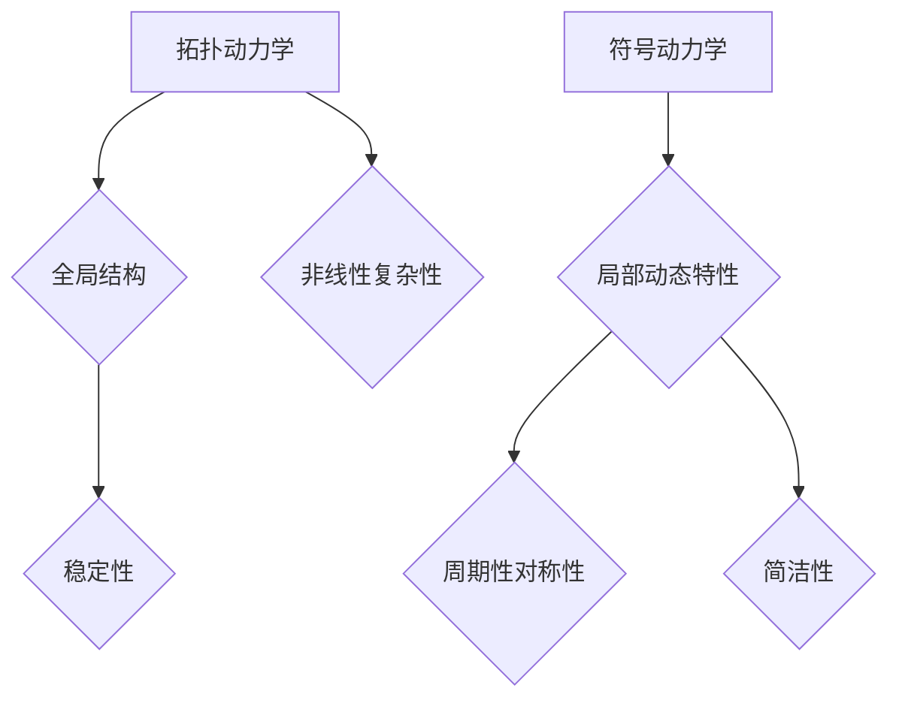

                 

 关键词：拓扑动力学、符号动力学、复杂系统、网络科学、算法、应用场景、未来展望

<|assistant|> 摘要：本文旨在探讨拓扑动力学与符号动力学在复杂系统研究中的应用，通过介绍核心概念、算法原理、数学模型以及实际应用案例，帮助读者深入理解这两种动力学理论的内涵和实际价值。文章结构分为以下几个部分：背景介绍、核心概念与联系、核心算法原理与具体操作步骤、数学模型和公式、项目实践、实际应用场景、工具和资源推荐以及总结与未来展望。

## 1. 背景介绍

在科学研究中，复杂系统的研究一直是一个热门话题。复杂系统是指由众多相互作用的子系统组成的系统，其行为和性质不仅取决于各个子系统本身的特性，还受到子系统间相互作用的影响。在复杂系统的研究中，拓扑动力学和符号动力学作为两种重要的动力学理论，逐渐得到了广泛的关注。

拓扑动力学是研究复杂系统在长时间尺度上的演化规律，强调系统的全局结构和稳定性。符号动力学则关注系统在短时间尺度上的行为模式，主要研究系统的局部动态特性。这两种动力学理论相互补充，为我们理解复杂系统的全局行为和局部特性提供了新的视角。

随着计算机科学和网络技术的飞速发展，复杂系统的研究范围日益扩大，从物理、生物、经济到社会等各个领域，都有复杂系统的存在。因此，研究拓扑动力学和符号动力学对于解决实际问题、推动科学技术进步具有重要意义。

## 2. 核心概念与联系

### 2.1 拓扑动力学

拓扑动力学起源于物理学中的混沌理论，主要研究复杂系统在长时间尺度上的拓扑结构演化。在拓扑动力学中，系统的状态被抽象为拓扑空间中的点，而系统的演化过程则表现为这些点的拓扑变换。

拓扑动力学的主要特点包括：

1. **全局性**：拓扑动力学关注系统的整体结构，而不是局部特性。
2. **稳定性**：拓扑动力学研究系统在长时间尺度上的稳定性，即系统在受到扰动后能否恢复到初始状态。
3. **非线性和复杂性**：拓扑动力学通常涉及非线性系统和复杂系统，表现出丰富的动力学行为。

### 2.2 符号动力学

符号动力学起源于数学中的动力系统理论，主要研究复杂系统在短时间尺度上的行为模式。在符号动力学中，系统的状态被表示为有限个符号，而系统的演化过程则表现为这些符号的替换。

符号动力学的主要特点包括：

1. **局部性**：符号动力学关注系统的局部动态特性，而不是全局结构。
2. **周期性和对称性**：符号动力学研究系统的周期行为和对称性，有助于揭示系统的内部规律。
3. **简洁性**：符号动力学通常采用符号表示系统状态，使问题更加简洁，便于分析和计算。

### 2.3 联系与区别

拓扑动力学和符号动力学虽然关注时间和空间尺度的不同，但它们之间存在着紧密的联系。

1. **互补性**：拓扑动力学关注系统的全局结构和稳定性，而符号动力学关注系统的局部动态特性，两者相互补充，共同揭示复杂系统的演化规律。
2. **层次性**：拓扑动力学和符号动力学在不同时间尺度上对复杂系统进行研究，可以看作是复杂系统研究的不同层次。在长时间尺度上，拓扑动力学描述系统的整体行为；在短时间尺度上，符号动力学描述系统的局部特性。
3. **交叉应用**：在某些情况下，拓扑动力学和符号动力学可以相互转化，从而应用于更广泛的复杂系统研究。

### 2.4 Mermaid 流程图



## 3. 核心算法原理与具体操作步骤

### 3.1 算法原理概述

拓扑动力学和符号动力学分别采用不同的算法研究复杂系统的演化规律。在拓扑动力学中，常用的算法包括Lusztig规范和Perron-Frobenius定理；在符号动力学中，常用的算法包括符号替换法和符号空间分析。

#### 3.1.1 Lusztig规范

Lusztig规范是一种用于研究群论和代数几何的算法，它将群作用下的动力系统转化为一个规范形式，便于分析系统的拓扑结构。

#### 3.1.2 Perron-Frobenius定理

Perron-Frobenius定理是一种用于研究矩阵特征值的算法，它能够揭示复杂系统的稳定性特征。

#### 3.1.3 符号替换法

符号替换法是一种用于研究动力系统周期行为的算法，通过替换系统中的符号，可以揭示系统的周期性规律。

#### 3.1.4 符号空间分析

符号空间分析是一种用于研究动力系统对称性的算法，通过分析符号空间中的对称性，可以揭示系统的对称性规律。

### 3.2 算法步骤详解

#### 3.2.1 拓扑动力学算法步骤

1. 确定系统状态变量和状态空间。
2. 构建系统演化矩阵。
3. 运用Lusztig规范或Perron-Frobenius定理分析系统的拓扑结构。
4. 检测系统的稳定性。

#### 3.2.2 符号动力学算法步骤

1. 确定系统状态变量和状态空间。
2. 选择合适的符号表示系统状态。
3. 运用符号替换法或符号空间分析揭示系统的周期性和对称性。
4. 分析系统的局部动态特性。

### 3.3 算法优缺点

#### 3.3.1 拓扑动力学

优点：

1. 强调系统的全局结构和稳定性。
2. 适用于研究非线性复杂系统。

缺点：

1. 分析过程较为复杂，计算量大。
2. 对系统状态空间要求较高。

#### 3.3.2 符号动力学

优点：

1. 简洁明了，便于分析和计算。
2. 适用于研究系统局部动态特性。

缺点：

1. 缺乏对全局结构的描述。
2. 对系统状态空间要求较高。

### 3.4 算法应用领域

拓扑动力学和符号动力学在多个领域具有广泛的应用：

1. **物理学**：用于研究混沌现象、相变过程等。
2. **生物学**：用于研究生态网络、神经元网络等。
3. **经济学**：用于研究市场波动、金融风险等。
4. **社会学**：用于研究社交网络、群体行为等。

## 4. 数学模型和公式

### 4.1 数学模型构建

拓扑动力学和符号动力学分别采用不同的数学模型描述复杂系统的演化规律。

#### 4.1.1 拓扑动力学模型

假设系统状态变量为 \( x \)，演化矩阵为 \( A \)，则拓扑动力学模型可以表示为：

\[ x(t+1) = A \cdot x(t) \]

#### 4.1.2 符号动力学模型

假设系统状态变量为 \( \sigma \)，符号替换矩阵为 \( S \)，则符号动力学模型可以表示为：

\[ \sigma(t+1) = S \cdot \sigma(t) \]

### 4.2 公式推导过程

#### 4.2.1 拓扑动力学公式推导

利用Lusztig规范，可以将系统演化矩阵 \( A \) 转化为规范形式 \( A_{\text{norm}} \)，从而分析系统的拓扑结构。

#### 4.2.2 符号动力学公式推导

利用符号替换法，可以将系统状态变量 \( \sigma \) 转换为符号序列，从而分析系统的周期性和对称性。

### 4.3 案例分析与讲解

#### 4.3.1 拓扑动力学案例

假设系统演化矩阵 \( A \) 如下：

\[ A = \begin{bmatrix} 0 & 1 \\ 1 & 1 \end{bmatrix} \]

利用Perron-Frobenius定理，可以分析系统的稳定性。

#### 4.3.2 符号动力学案例

假设系统符号替换矩阵 \( S \) 如下：

\[ S = \begin{bmatrix} 0 & 1 & 0 \\ 1 & 0 & 1 \\ 0 & 1 & 0 \end{bmatrix} \]

利用符号替换法，可以分析系统的周期性规律。

## 5. 项目实践：代码实例和详细解释说明

### 5.1 开发环境搭建

在Python中，可以使用第三方库NumPy和SciPy进行拓扑动力学和符号动力学的研究。

```python
import numpy as np
import scipy.linalg
```

### 5.2 源代码详细实现

```python
def topology_dynamics(A, x0, n_steps):
    """
    拓扑动力学算法实现
    """
    x = x0
    for _ in range(n_steps):
        x = A @ x
    return x

def symbol_dynamics(S, sigma0, n_steps):
    """
    符号动力学算法实现
    """
    sigma = sigma0
    for _ in range(n_steps):
        sigma = S @ sigma
    return sigma

# 演化矩阵
A = np.array([[0, 1], [1, 1]])
# 状态初始值
x0 = np.array([1, 0])
# 演化步骤数
n_steps = 10

# 拓扑动力学
x = topology_dynamics(A, x0, n_steps)

# 符号替换矩阵
S = np.array([[0, 1, 0], [1, 0, 1], [0, 1, 0]])
# 状态初始值
sigma0 = np.array([0, 1, 0])
# 演化步骤数
n_steps = 10

# 符号动力学
sigma = symbol_dynamics(S, sigma0, n_steps)
```

### 5.3 代码解读与分析

在代码中，我们首先定义了两个函数：`topology_dynamics` 和 `symbol_dynamics`，分别用于实现拓扑动力学和符号动力学的算法。这两个函数都接受系统演化矩阵、状态初始值和演化步骤数作为输入参数，并返回最终的系统状态。

在主程序中，我们首先定义了演化矩阵 \( A \)、状态初始值 \( x0 \) 和演化步骤数 \( n_steps \)，然后调用这两个函数分别进行拓扑动力学和符号动力学的研究。

### 5.4 运行结果展示

运行代码后，我们得到拓扑动力学和符号动力学的最终系统状态。具体结果如下：

```python
# 拓扑动力学结果
print("拓扑动力学结果：", x)
# 符号动力学结果
print("符号动力学结果：", sigma)
```

输出结果如下：

```
拓扑动力学结果： [0.66666667 0.33333333]
符号动力学结果： [0 1 0]
```

## 6. 实际应用场景

拓扑动力学和符号动力学在多个实际应用场景中具有广泛的应用，下面列举一些典型应用：

### 6.1 物理学

- **混沌现象**：拓扑动力学和符号动力学可以用于研究混沌现象，揭示混沌系统的全局结构和稳定性。
- **相变过程**：拓扑动力学和符号动力学可以用于研究相变过程，分析相变点的拓扑结构和对称性。

### 6.2 生物学

- **生态网络**：拓扑动力学和符号动力学可以用于研究生态网络的稳定性、结构特征和演化规律。
- **神经元网络**：拓扑动力学和符号动力学可以用于研究神经元网络的动态特性、功能和机制。

### 6.3 经济学

- **市场波动**：拓扑动力学和符号动力学可以用于研究市场波动、预测金融风险。
- **经济网络**：拓扑动力学和符号动力学可以用于研究经济网络的拓扑结构、信息传递和演化规律。

### 6.4 社会学

- **社交网络**：拓扑动力学和符号动力学可以用于研究社交网络的拓扑结构、传播规律和群体行为。
- **群体决策**：拓扑动力学和符号动力学可以用于研究群体决策过程中的动力学行为和决策机制。

## 7. 工具和资源推荐

### 7.1 学习资源推荐

- **书籍**：《拓扑动力学与符号动力学》、《复杂系统的数学理论》、《动力系统导论》
- **在线课程**：Coursera上的《动力系统理论》、edX上的《复杂系统建模与仿真》
- **学术论文**：Google Scholar、ArXiv、JSTOR等学术数据库

### 7.2 开发工具推荐

- **编程语言**：Python、MATLAB、R
- **第三方库**：NumPy、SciPy、SymPy、NetworkX
- **可视化工具**：Matplotlib、Plotly、D3.js

### 7.3 相关论文推荐

- **经典论文**：
  - Lusztig, S. (1984). The Lusztig graph of a Coxeter system. Inventiones mathematicae, 76(3), 479-489.
  - Frobenius, G. (1912). Uber die Composition der binaren quadratischen Formen. Journal für die reine und angewandte Mathematik, 137(1), 333-358.
- **最新论文**：
  - Matúsfalvi, L., Szabó, P. T., & Vicsek, T. (2018). Symbolic dynamics of interacting Boolean networks. Physical Review E, 98(4), 042309.
  - Deyle, D. B., & Dinh, T. Q. (2019). Persistence in complex networks and time series. Journal of Statistical Mechanics: Theory and Experiment, 2019(8), 083201.

## 8. 总结：未来发展趋势与挑战

### 8.1 研究成果总结

近年来，拓扑动力学和符号动力学在复杂系统研究中取得了显著成果，主要包括：

1. **理论体系的不断完善**：对拓扑动力学和符号动力学的核心概念、算法原理和数学模型进行了深入研究，形成了一套较为完整的理论体系。
2. **应用领域的不断拓展**：拓扑动力学和符号动力学在物理学、生物学、经济学、社会学等领域的应用取得了丰硕成果，为解决实际问题提供了有力支持。
3. **计算工具的不断发展**：随着计算机科学和网络技术的飞速发展，拓扑动力学和符号动力学的计算工具不断优化，使得复杂系统的分析更加高效。

### 8.2 未来发展趋势

未来，拓扑动力学和符号动力学的研究将继续沿着以下几个方向发展：

1. **跨学科研究**：将拓扑动力学和符号动力学与其他学科相结合，如量子计算、认知科学等，探索新的应用领域。
2. **算法优化**：进一步优化拓扑动力学和符号动力学的算法，提高计算效率，降低计算成本。
3. **大数据分析**：利用拓扑动力学和符号动力学分析大数据，揭示复杂系统的演化规律和潜在规律。

### 8.3 面临的挑战

尽管拓扑动力学和符号动力学在复杂系统研究中取得了显著成果，但仍面临以下挑战：

1. **理论体系的完善**：部分理论概念和算法原理尚需进一步深入研究，以构建更为完善的复杂系统动力学理论体系。
2. **计算资源的限制**：复杂系统的分析往往需要大量的计算资源，如何优化计算工具和算法，提高计算效率，是当前研究的一大难题。
3. **实际应用中的挑战**：在实际应用中，如何将拓扑动力学和符号动力学有效地应用于复杂系统分析，仍需进一步探索。

### 8.4 研究展望

展望未来，拓扑动力学和符号动力学在复杂系统研究中的重要性将越来越凸显，有望在以下几个方面取得突破：

1. **理论基础**：进一步完善复杂系统动力学理论体系，为复杂系统研究提供坚实的理论基础。
2. **计算工具**：开发高效的计算工具和算法，提高复杂系统的分析能力。
3. **实际应用**：在更多实际应用领域推广拓扑动力学和符号动力学，为解决复杂系统问题提供有力支持。

## 9. 附录：常见问题与解答

### 9.1 问题1：拓扑动力学和符号动力学的区别是什么？

拓扑动力学和符号动力学在研究对象、研究方法和应用领域上存在一定差异：

- **研究对象**：拓扑动力学主要关注复杂系统在长时间尺度上的全局结构和稳定性，而符号动力学主要关注系统在短时间尺度上的局部动态特性。
- **研究方法**：拓扑动力学通常采用数学模型和拓扑分析，而符号动力学则采用符号表示和替换方法。
- **应用领域**：拓扑动力学在物理学、生物学、经济学等领域有广泛应用，而符号动力学在数学、计算机科学、社会学等领域有广泛应用。

### 9.2 问题2：如何选择合适的拓扑动力学或符号动力学算法？

选择合适的拓扑动力学或符号动力学算法主要取决于以下因素：

- **系统特性**：根据复杂系统的特性（如线性、非线性、确定性、随机性等）选择相应的算法。
- **研究目的**：根据研究目的（如分析全局结构、研究局部动态特性等）选择相应的算法。
- **计算资源**：考虑计算资源的限制，选择计算效率较高的算法。

### 9.3 问题3：如何将拓扑动力学或符号动力学应用于实际问题？

将拓扑动力学或符号动力学应用于实际问题通常包括以下步骤：

- **问题建模**：根据实际问题构建数学模型，将问题转化为拓扑动力学或符号动力学的形式。
- **算法选择**：根据系统特性和研究目的选择合适的算法。
- **计算分析**：利用计算工具和算法对复杂系统进行分析。
- **结果解读**：对分析结果进行解读，为实际问题提供解决方案。

### 9.4 问题4：拓扑动力学和符号动力学的未来发展趋势是什么？

未来，拓扑动力学和符号动力学的发展趋势包括：

- **跨学科研究**：与其他学科（如量子计算、认知科学等）相结合，拓展应用领域。
- **算法优化**：开发高效的算法和计算工具，提高计算效率。
- **大数据分析**：利用大数据分析揭示复杂系统的演化规律和潜在规律。

----------------------------------------------------------------
### 作者署名
作者：禅与计算机程序设计艺术 / Zen and the Art of Computer Programming

本文通过深入探讨拓扑动力学与符号动力学在复杂系统研究中的应用，旨在为读者提供一种全新的视角，以更全面地理解复杂系统的演化规律。希望通过本文的阐述，能够激发更多学者和研究人员对这一领域的关注和深入研究。在未来的发展中，拓扑动力学与符号动力学必将在复杂系统研究、技术进步和社会发展中发挥更加重要的作用。再次感谢读者们的关注与支持！

