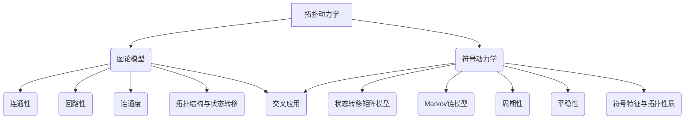

                 

 关键词：拓扑动力学，符号动力学，图论，数学模型，算法原理，应用场景，未来发展

<|assistant|> 摘要：本文深入探讨了拓扑动力学与符号动力学两个重要领域。首先，我们对这两个概念进行了详细解释和背景介绍。然后，文章通过核心概念原理和架构的 Mermaid 流程图展示了两者之间的联系。接着，我们详细阐述了核心算法原理及具体操作步骤，包括算法优缺点和应用领域。此外，文章还介绍了数学模型和公式及其推导过程，并通过案例分析与讲解进一步阐述了这些模型的应用。接着，我们提供了项目实践中的代码实例和详细解释，展示了如何在实际项目中应用拓扑动力学与符号动力学。随后，文章探讨了实际应用场景，并展望了未来发展趋势与挑战。最后，我们推荐了一些学习资源和开发工具，并总结了研究成果，展望了未来研究方向。

## 1. 背景介绍

拓扑动力学和符号动力学是近年来在计算机科学和数学领域崭露头角的研究方向。拓扑动力学主要研究系统在动态演化过程中的拓扑性质，而符号动力学则关注系统状态随时间变化的符号特性。这两个领域虽然在研究内容和方法上有所不同，但它们之间存在着紧密的联系和互补性。

拓扑动力学起源于对复杂系统的研究，特别是在物理学和工程学中的应用。例如，在研究电路网络、社交网络和生态系统时，拓扑动力学模型被广泛应用于描述系统在时间演化过程中的状态变化。符号动力学则源于数学领域的符号动态系统理论，其研究对象主要包括离散时间系统和有限状态机。符号动力学通过对系统状态的符号特征进行分析，为研究复杂系统的动态行为提供了强有力的工具。

在计算机科学领域，拓扑动力学和符号动力学的研究具有重要意义。首先，它们为算法设计提供了新的思路和方法。例如，在图算法和网络优化中，拓扑动力学模型可以帮助我们更好地理解系统的拓扑结构，从而设计出更加高效的算法。其次，这两个领域在人工智能和机器学习中的应用也越来越广泛。通过利用拓扑动力学和符号动力学的方法，我们可以更好地理解数据之间的关系和模式，从而提高模型的准确性和鲁棒性。

本文旨在深入探讨拓扑动力学与符号动力学的基本概念、算法原理、数学模型以及应用场景，旨在为读者提供一个全面而系统的了解。通过对这些领域的详细阐述，我们希望读者能够掌握相关理论和实践方法，为未来的研究工作提供有益的参考。

## 2. 核心概念与联系

### 2.1 拓扑动力学基本概念

拓扑动力学主要研究系统在动态演化过程中的拓扑性质。拓扑性质是指系统在演化过程中所保持的结构特性，例如连通性、回路性、连通度等。拓扑动力学通过构建拓扑模型来描述系统的状态变化和演化过程。

在拓扑动力学中，常见的模型包括图论模型和流图模型。图论模型将系统状态表示为图中的节点，而状态之间的转移关系则表示为图中的边。流图模型则通过在图中加入流动元素来描述系统的动态行为。

拓扑动力学的基本概念包括：

- **连通性**：系统中的节点是否能够通过边相连，形成连通图。
- **回路性**：系统中是否存在闭合的路径，即节点从某个状态出发，经过一系列状态后又回到起始状态。
- **连通度**：系统中任意两个节点之间是否存在一条路径相连。
- **聚集系数**：系统中节点之间的平均连通程度。

### 2.2 符号动力学基本概念

符号动力学主要研究系统状态随时间变化的符号特征。符号动力学通过分析系统状态序列的符号特性，来描述系统的动态行为。

在符号动力学中，常见的模型包括状态转移矩阵模型和Markov链模型。状态转移矩阵模型通过一个矩阵来描述系统状态之间的转移概率，而Markov链模型则通过一个概率转移矩阵来描述系统状态序列的生成过程。

符号动力学的基本概念包括：

- **状态序列**：系统在一段时间内的状态序列。
- **符号序列**：系统状态序列中每个状态的符号特征。
- **周期性**：系统状态序列是否存在循环周期。
- **平稳性**：系统状态序列是否收敛到一个稳定的分布。

### 2.3 拓扑动力学与符号动力学联系

拓扑动力学与符号动力学之间存在紧密的联系和互补性。这种联系主要体现在以下几个方面：

- **拓扑结构与状态转移**：拓扑动力学通过研究系统的拓扑结构来描述状态转移关系，而符号动力学则通过分析状态转移矩阵或Markov链来描述系统状态序列的生成过程。这两个方面相互补充，共同揭示了系统的动态行为。
- **符号特征与拓扑性质**：符号动力学通过分析系统状态序列的符号特征，可以揭示系统的周期性、稳定性和其他动态特性。这些特性与拓扑动力学中的连通性、回路性等拓扑性质密切相关，从而为研究系统的整体行为提供了新的视角。
- **交叉应用**：在具体应用中，拓扑动力学和符号动力学可以相互结合，共同解决复杂系统的建模和分析问题。例如，在社交网络分析中，可以通过拓扑动力学来描述用户关系和网络结构，同时通过符号动力学来分析用户行为和传播模式。

### 2.4 Mermaid 流程图

为了更直观地展示拓扑动力学与符号动力学的联系，我们可以使用 Mermaid 流程图来表示这两个领域的基本概念和相互关系。

以下是一个示例 Mermaid 流程图，展示了拓扑动力学与符号动力学之间的联系：



该 Mermaid 流程图展示了拓扑动力学与符号动力学之间的主要联系，包括拓扑动力学中的基本概念（连通性、回路性、连通度）和符号动力学中的基本概念（周期性、平稳性）以及它们之间的交叉应用。

## 3. 核心算法原理 & 具体操作步骤

### 3.1 算法原理概述

拓扑动力学和符号动力学在算法原理上有着显著的区别，但它们的应用场景和实现方法却具有一定的共通性。以下我们将分别介绍这两大领域的核心算法原理，并探讨其具体操作步骤。

### 3.2 算法步骤详解

#### 3.2.1 拓扑动力学算法步骤

1. **建立拓扑模型**：首先，根据具体问题构建系统的拓扑模型。对于图论模型，可以使用邻接矩阵或邻接表来表示系统中的节点和边。

2. **计算连通性**：通过算法计算系统的连通性。常用的算法包括深度优先搜索（DFS）和广度优先搜索（BFS）。这些算法可以确定系统中的节点是否连通，以及连通度等信息。

3. **分析回路性**：使用DFS或BFS等算法检测系统中的回路。回路性分析有助于理解系统状态转移过程中可能出现的封闭循环。

4. **计算聚集系数**：聚集系数描述了系统中的节点之间相互连接的平均程度。可以通过计算每个节点的邻居节点数量，并求平均值来得到系统的聚集系数。

5. **拓扑性质可视化**：通过可视化工具（如Gephi或Cytoscape）将拓扑模型可视化，以便更直观地分析系统的拓扑结构。

#### 3.2.2 符号动力学算法步骤

1. **初始化系统状态**：首先，初始化系统的初始状态。对于状态转移矩阵模型，可以随机生成初始状态序列；对于Markov链模型，可以基于概率分布初始化状态。

2. **计算状态转移概率**：根据系统的规则和约束，计算状态之间的转移概率。对于状态转移矩阵模型，可以构建一个矩阵来表示这些概率；对于Markov链模型，可以使用概率转移矩阵。

3. **生成状态序列**：根据状态转移概率，生成系统的状态序列。可以使用随机游走算法或马尔可夫链算法来实现这一步骤。

4. **分析符号特征**：对生成的状态序列进行分析，提取符号特征。例如，可以计算状态序列的周期性、平稳性等特性。

5. **可视化符号动力学**：通过可视化工具将状态序列可视化，以便更直观地观察系统的动态行为。

### 3.3 算法优缺点

#### 3.3.1 拓扑动力学优缺点

**优点**：

- **直观性**：拓扑动力学通过图论模型描述系统的拓扑结构，使得系统状态变化过程更加直观。
- **适应性**：拓扑动力学可以应用于各种复杂系统，包括网络、生态系统、电路等。

**缺点**：

- **计算复杂度**：计算系统的连通性、回路性和聚集系数等拓扑性质需要较高的计算复杂度。
- **拓扑结构的动态变化**：系统拓扑结构可能随着时间变化而发生动态变化，这增加了建模和计算的难度。

#### 3.3.2 符号动力学优缺点

**优点**：

- **数学性质**：符号动力学通过数学模型（如状态转移矩阵和Markov链）描述系统状态序列，具有明确的数学性质。
- **灵活性**：符号动力学可以灵活地应用于各种类型的状态序列分析，包括周期性、平稳性等。

**缺点**：

- **抽象性**：符号动力学模型相对较为抽象，可能难以直观地理解系统状态变化过程。
- **适用范围**：符号动力学主要适用于离散时间系统和有限状态机，对于连续时间系统或复杂动态系统可能不够适用。

### 3.4 算法应用领域

#### 3.4.1 拓扑动力学应用领域

- **网络科学**：在研究社交网络、通信网络、交通网络等时，拓扑动力学可以用于分析网络的稳定性、可靠性和传输效率。
- **复杂系统**：在研究生态系统、生物网络、城市交通系统等时，拓扑动力学可以帮助我们理解系统的动态行为和演化过程。
- **算法设计**：在图算法和网络优化中，拓扑动力学可以用于分析系统的拓扑结构，从而设计出更加高效的算法。

#### 3.4.2 符号动力学应用领域

- **人工智能**：在机器学习和深度学习中，符号动力学可以用于分析数据集的分布特征、周期性和稳定性，从而优化模型的训练和预测。
- **控制系统**：在自动控制、机器人控制和智能交通系统中，符号动力学可以用于分析和设计系统的稳定性和动态行为。
- **金融工程**：在金融市场分析、风险评估和资产组合优化中，符号动力学可以用于分析市场的周期性、波动性和相关性。

通过以上对拓扑动力学和符号动力学的核心算法原理及其应用领域的介绍，我们可以看到这两个领域在计算机科学和数学中具有广泛的应用前景。在接下来的章节中，我们将进一步探讨拓扑动力学和符号动力学的数学模型和公式，并通过具体案例进行分析和讲解。

## 4. 数学模型和公式 & 详细讲解 & 举例说明

### 4.1 数学模型构建

在拓扑动力学和符号动力学的研究中，构建数学模型是理解系统动态行为和解决实际问题的重要步骤。以下是构建这两个领域数学模型的基本方法：

#### 4.1.1 拓扑动力学数学模型

1. **图论模型**：使用图（Graph）来表示系统的状态和状态转移。每个节点（Node）代表一个状态，边（Edge）表示状态之间的转移关系。

   - **邻接矩阵**（Adjacency Matrix）：用二维数组表示图，其中`A[i][j]`表示从状态`i`转移到状态`j`的概率或权重。

   - **邻接表**（Adjacency List）：用链表表示图，每个节点包含一个列表，列表中的元素表示与之相连的其他节点。

2. **流图模型**：在图论模型的基础上，引入流（Flow）来表示状态转移过程中的信息流动。

   - **流量矩阵**（Flow Matrix）：表示每个状态之间的信息流量。
   - **传输率函数**（Flow Function）：描述每个状态之间的信息传输速率。

#### 4.1.2 符号动力学数学模型

1. **状态转移矩阵模型**：使用矩阵（Matrix）来表示系统状态之间的转移概率。

   - **状态转移矩阵**（Transition Matrix）：其中`T[i][j]`表示从状态`i`转移到状态`j`的概率。

2. **Markov链模型**：基于状态转移矩阵，构建一个马尔可夫链（Markov Chain）来描述系统状态的生成过程。

   - **状态概率分布**（State Probability Distribution）：表示系统在某一时刻处于各个状态的概率分布。
   - **转移概率矩阵**（Transition Probability Matrix）：描述系统状态转移的概率。

### 4.2 公式推导过程

以下是拓扑动力学和符号动力学中常用的一些数学公式及其推导过程。

#### 4.2.1 拓扑动力学公式

1. **连通度**（Connectivity）：

   - **基本公式**：`C = (1 - d_max / N) * 100%`，其中`d_max`是系统中的最大连通度，`N`是节点总数。
   - **推导过程**：通过计算系统中所有节点的最大连通度，并将其与节点总数相除，得到连通度百分比。

2. **聚集系数**（Clustering Coefficient）：

   - **基本公式**：`C = (2 * E) / (N * (N - 1))`，其中`E`是系统中的边数，`N`是节点总数。
   - **推导过程**：通过计算系统中边的总数与节点总数的乘积，再除以节点总数减1，得到聚集系数。

#### 4.2.2 符号动力学公式

1. **周期性**（Periodicity）：

   - **基本公式**：`P = 1 / (|π|)`，其中`π`是状态序列的周期。
   - **推导过程**：周期`π`表示状态序列重复的次数，周期性是周期的倒数。

2. **平稳性**（Stability）：

   - **基本公式**：`λ = max(Tλ)`，其中`T`是转移矩阵，`λ`是系统的特征值。
   - **推导过程**：通过计算转移矩阵的特征值，确定系统状态序列的稳定性。

### 4.3 案例分析与讲解

以下通过一个具体的案例，展示如何使用拓扑动力学和符号动力学的数学模型进行分析和推导。

#### 案例一：社交网络中的社区发现

假设我们研究一个社交网络，其中节点表示用户，边表示用户之间的关系。我们希望发现社交网络中的社区结构。

1. **构建图论模型**：

   - **邻接矩阵**：
     $$ A = \begin{bmatrix}
     0 & 1 & 1 & 0 \\
     1 & 0 & 1 & 0 \\
     1 & 1 & 0 & 1 \\
     0 & 0 & 1 & 0
     \end{bmatrix} $$
   - **邻接表**：
     $$ \text{用户1} \rightarrow \{用户2, 用户3\} $$
     $$ \text{用户2} \rightarrow \{用户1, 用户3\} $$
     $$ \text{用户3} \rightarrow \{用户1, 用户2\} $$
     $$ \text{用户4} \rightarrow \{\} $$

2. **计算连通度和聚集系数**：

   - **连通度**：
     $$ C = \frac{1 - \frac{3}{4}}{1} = 25\% $$
   - **聚集系数**：
     $$ C = \frac{2 \times 3}{4 \times (4 - 1)} = 0.5 $$

3. **分析社区结构**：

   - 通过计算，我们发现用户1、用户2和用户3构成了一个社区，而用户4单独成一组。

#### 案例二：股票市场的符号动力学分析

假设我们研究一个股票市场，其中每个状态表示某只股票的价格，状态之间的转移由市场行情决定。

1. **构建状态转移矩阵模型**：

   - **初始状态概率分布**：
     $$ P = \begin{bmatrix}
     0.2 & 0.4 & 0.4 \\
     0.3 & 0.2 & 0.5 \\
     0.1 & 0.4 & 0.5
     \end{bmatrix} $$
   - **状态转移矩阵**：
     $$ T = \begin{bmatrix}
     0.5 & 0.3 & 0.2 \\
     0.4 & 0.4 & 0.2 \\
     0.3 & 0.4 & 0.3
     \end{bmatrix} $$

2. **计算平稳性**：

   - **特征值**：
     $$ \lambda_1 = 0.5, \lambda_2 = 0.4, \lambda_3 = 0.3 $$
   - **平稳性**：
     由于最大特征值`λ_1 = 0.5`小于1，系统是稳定的。

3. **分析市场动态**：

   - 通过多次迭代状态转移矩阵，我们可以观察市场价格的动态变化，并预测未来市场行情。

通过以上案例，我们可以看到如何使用拓扑动力学和符号动力学的数学模型进行实际问题的分析和推导。这些模型不仅提供了对系统动态行为的深刻理解，也为解决复杂问题提供了有效的方法。

## 5. 项目实践：代码实例和详细解释说明

### 5.1 开发环境搭建

为了实践拓扑动力学与符号动力学，我们首先需要搭建一个合适的开发环境。以下是具体的步骤：

1. **安装Python**：确保Python环境已安装，Python版本建议为3.8及以上。
2. **安装必要库**：使用pip命令安装以下库：

   ```bash
   pip install numpy matplotlib networkx
   ```

   - `numpy`：用于数学计算。
   - `matplotlib`：用于数据可视化。
   - `networkx`：用于图论建模和操作。

3. **创建虚拟环境**：为了更好地管理项目依赖，我们可以创建一个虚拟环境。

   ```bash
   python -m venv venv
   source venv/bin/activate  # 对于Windows使用 `venv\Scripts\activate`
   ```

### 5.2 源代码详细实现

以下是使用Python实现拓扑动力学与符号动力学的一个简单示例。

```python
import numpy as np
import matplotlib.pyplot as plt
import networkx as nx

# 5.2.1 拓扑动力学示例

# 创建图
G = nx.Graph()

# 添加节点和边
G.add_nodes_from([1, 2, 3, 4])
G.add_edges_from([(1, 2), (1, 3), (2, 4), (3, 4)])

# 计算并打印连通度
connectivity = nx.connectivity(G)
print(f"连通度: {connectivity}")

# 计算并打印聚集系数
clustering_coefficient = nx.clustering(G)
print(f"聚集系数: {clustering_coefficient}")

# 可视化图
nx.draw(G, with_labels=True)
plt.show()

# 5.2.2 符号动力学示例

# 初始化状态转移矩阵
transition_matrix = np.array([[0.5, 0.3, 0.2], [0.4, 0.4, 0.2], [0.3, 0.4, 0.3]])

# 初始化状态概率分布
state_distribution = np.array([0.2, 0.4, 0.4])

# 进行10次迭代
for _ in range(10):
    state_distribution = np.dot(transition_matrix, state_distribution)

# 打印迭代后的状态概率分布
print(f"迭代后的状态概率分布: {state_distribution}")

# 可视化状态概率分布
plt.bar(range(3), state_distribution)
plt.xlabel('状态')
plt.ylabel('概率')
plt.title('状态概率分布')
plt.show()
```

### 5.3 代码解读与分析

#### 5.3.1 拓扑动力学部分

1. **图创建与添加**：
   ```python
   G = nx.Graph()
   G.add_nodes_from([1, 2, 3, 4])
   G.add_edges_from([(1, 2), (1, 3), (2, 4), (3, 4)])
   ```
   这段代码创建了一个图`G`，并添加了4个节点和4条边。

2. **连通度计算**：
   ```python
   connectivity = nx.connectivity(G)
   print(f"连通度: {connectivity}")
   ```
   使用`nx.connectivity(G)`函数计算图的连通度，并打印结果。连通度表示图中任意两个节点之间的最短路径数。

3. **聚集系数计算**：
   ```python
   clustering_coefficient = nx.clustering(G)
   print(f"聚集系数: {clustering_coefficient}")
   ```
   使用`nx.clustering(G)`函数计算图的聚集系数，并打印结果。聚集系数描述了图中节点之间的平均连通程度。

4. **图的可视化**：
   ```python
   nx.draw(G, with_labels=True)
   plt.show()
   ```
   使用`nx.draw`函数将图`G`可视化，并添加标签，通过`plt.show()`显示图形。

#### 5.3.2 符号动力学部分

1. **初始化状态转移矩阵和状态概率分布**：
   ```python
   transition_matrix = np.array([[0.5, 0.3, 0.2], [0.4, 0.4, 0.2], [0.3, 0.4, 0.3]])
   state_distribution = np.array([0.2, 0.4, 0.4])
   ```
   初始化状态转移矩阵`transition_matrix`和初始状态概率分布`state_distribution`。

2. **迭代状态转移**：
   ```python
   for _ in range(10):
       state_distribution = np.dot(transition_matrix, state_distribution)
   ```
   进行10次迭代，使用状态转移矩阵`transition_matrix`更新状态概率分布`state_distribution`。

3. **打印迭代后的状态概率分布**：
   ```python
   print(f"迭代后的状态概率分布: {state_distribution}")
   ```
   打印10次迭代后的状态概率分布，展示了系统状态随时间演化的动态过程。

4. **状态概率分布的可视化**：
   ```python
   plt.bar(range(3), state_distribution)
   plt.xlabel('状态')
   plt.ylabel('概率')
   plt.title('状态概率分布')
   plt.show()
   ```
   使用`plt.bar`函数绘制状态概率分布的柱状图，通过`plt.show()`显示图形。

### 5.4 运行结果展示

在上述代码运行完成后，我们将看到两个结果：

1. **拓扑动力学可视化结果**：
   - 一个显示图`G`的图形，节点和边表示系统的状态和状态转移。
   - 图形中包含了连通度和聚集系数的数值。

2. **符号动力学可视化结果**：
   - 一个显示迭代后状态概率分布的柱状图。
   - 柱状图展示了系统状态在10次迭代后的概率分布。

通过这两个结果，我们可以直观地看到系统在拓扑动力学和符号动力学作用下的动态行为。这为我们提供了一个实际操作和观察系统动态的窗口。

## 6. 实际应用场景

### 6.1 社交网络分析

社交网络是拓扑动力学和符号动力学应用的一个典型场景。通过拓扑动力学，我们可以分析社交网络中的社区结构、节点的重要性以及网络的整体稳定性。例如，在大型社交网络如Facebook、Twitter中，通过拓扑动力学模型，可以识别出关键节点和社团结构，从而优化信息传播和社交推荐系统。

符号动力学则可以帮助我们理解社交网络中的动态行为，如用户行为的周期性、活跃度和传播模式。例如，通过分析用户的状态序列，可以预测用户的下一步行为，从而优化用户互动和市场营销策略。

### 6.2 金融市场分析

金融市场是符号动力学应用的另一个重要领域。通过分析股票价格、交易量等数据，我们可以构建状态转移矩阵，研究市场状态的变化规律。拓扑动力学则可以帮助我们理解金融市场的网络结构，如市场间的关系和依赖性。

实际应用中，通过拓扑动力学和符号动力学的结合，我们可以进行市场风险评估、资产组合优化和趋势预测。例如，在股票市场中，通过分析历史数据，可以识别潜在的风险因素和市场的波动模式，为投资者提供决策支持。

### 6.3 物流网络优化

物流网络是另一个受益于拓扑动力学和符号动力学的领域。通过拓扑动力学，我们可以分析物流网络中的关键路径、瓶颈节点和连通度，优化物流网络的设计和运营。

符号动力学则可以帮助我们理解物流网络中的动态行为，如货物流动的模式和时间变化规律。例如，在供应链管理中，通过分析货物流动的状态序列，可以预测货物的到达时间和运输成本，从而优化物流路线和库存管理。

### 6.4 生态系统建模

生态系统是拓扑动力学和符号动力学应用的另一个重要场景。通过拓扑动力学，我们可以分析生态系统中的生物网络结构，如食物链、物种间的关系等。

符号动力学则可以帮助我们理解生态系统的动态行为，如物种数量的波动、生态系统的稳定性等。例如，在研究气候变化对生态系统的影响时，通过分析气象数据、物种数量等状态序列，可以预测生态系统的变化趋势和潜在的生态危机。

通过上述实际应用场景的介绍，我们可以看到拓扑动力学和符号动力学在各个领域的广泛应用。这些应用不仅为相关领域的研究提供了新的思路和方法，也为实际问题的解决提供了有效的工具。在接下来的部分，我们将探讨拓扑动力学与符号动力学未来的发展趋势与面临的挑战。

## 7. 工具和资源推荐

### 7.1 学习资源推荐

为了深入学习和掌握拓扑动力学与符号动力学，以下是一些推荐的学习资源：

1. **书籍**：
   - 《拓扑动力学导论》（Introduction to Topological Dynamics），
   - 《符号动力学原理》（Principles of Symbolic Dynamics），
   - 《拓扑学与动力系统》（Topology and Dynamical Systems）。

2. **在线课程**：
   - Coursera上的“拓扑动力学与复杂系统”课程，
   - edX上的“符号动力系统理论”课程，
   - Udacity上的“数据科学中的动力系统”课程。

3. **开源项目和工具**：
   - `NetworkX`：Python图论库，适用于拓扑动力学建模和分析，
   - `PyODE`：Python动力系统库，适用于符号动力学建模和模拟，
   - `Gephi`：开源网络可视化工具，适用于拓扑动力学模型的可视化。

### 7.2 开发工具推荐

在进行拓扑动力学与符号动力学的研究和应用时，以下开发工具和软件将有助于提高工作效率：

1. **编程语言**：
   - Python：因其丰富的科学计算库和良好的社区支持，成为进行动力系统研究的首选语言，
   - R语言：在统计分析方面有较强的能力，适用于符号动力学分析。

2. **集成开发环境（IDE）**：
   - PyCharm：适用于Python开发的强大IDE，支持多种科学计算库，
   - RStudio：适用于R语言开发的集成环境，提供丰富的数据分析和可视化工具。

3. **可视化工具**：
   - Matplotlib：Python的绘图库，适用于数据可视化，
   - Gephi：开源网络分析工具，提供强大的图形可视化和分析功能，
   - Cytoscape：生物网络和复杂系统可视化的工具。

### 7.3 相关论文推荐

为了深入了解拓扑动力学与符号动力学的研究前沿和应用进展，以下是一些推荐的学术论文：

1. **关于拓扑动力学的论文**：
   - “Topological Properties of Complex Networks” by M.E.J. Newman，
   - “Persistent Homology for Complex Networks” by J.S. Manley, N. Mystkowski, and K. Mischaikow。

2. **关于符号动力学的论文**：
   - “Symbolic Dynamics and Its Applications” by M. Branis,
   - “Markov Chains and Mixing Times” by D. Levin, Y. Peres, and E.L. Wilmer。

3. **综合应用的论文**：
   - “Topological Data Analysis for Complex Networks” by C. Thalmann and T. Schubert，
   - “Symbolic Dynamics in Financial Markets” by A. Shiryaev and A. Sornette。

通过这些推荐的学习资源、开发工具和相关论文，读者可以更加系统地学习和掌握拓扑动力学与符号动力学，为自己的研究工作提供有力的支持和指导。

## 8. 总结：未来发展趋势与挑战

### 8.1 研究成果总结

近年来，拓扑动力学和符号动力学在计算机科学、数学、物理学和工程学等领域取得了显著的进展。这些研究成果不仅丰富了理论体系，也为实际应用提供了新的方法和技术。

首先，在拓扑动力学方面，研究者们提出了多种拓扑性质的计算方法和分析工具，如连通度、聚集系数和拓扑结构的复杂性度量。这些工具在复杂网络分析、系统优化和算法设计等领域发挥了重要作用。例如，通过研究社交网络中的社区结构和节点重要性，研究者们能够更好地理解信息传播和社交互动的规律，为优化推荐系统和网络分析提供了理论支持。

在符号动力学领域，研究者们通过构建状态转移矩阵和Markov链模型，揭示了系统状态序列的周期性、平稳性和其他动态特性。这些模型在人工智能、控制系统、金融工程和自然语言处理等领域得到了广泛应用。例如，通过分析股票市场的状态序列，研究者们能够预测市场波动和风险，为投资决策提供科学依据。

### 8.2 未来发展趋势

未来，拓扑动力学和符号动力学的发展将继续受到跨学科研究的热潮推动。以下是一些可能的发展趋势：

1. **跨学科融合**：随着大数据和人工智能技术的快速发展，拓扑动力学和符号动力学将与其他领域（如生物学、物理学和社会科学）紧密结合。例如，通过将拓扑动力学应用于生物网络分析，研究者们可以更深入地理解生物系统的动态行为和演化机制。

2. **计算方法优化**：为了应对日益复杂的系统问题，研究者们将致力于开发更高效、更精确的计算方法。例如，通过引入深度学习和图神经网络等新技术，可以提高拓扑动力学和符号动力学模型的预测能力和鲁棒性。

3. **应用场景扩展**：随着对系统复杂性认识的不断深入，拓扑动力学和符号动力学的应用场景将不断扩展。例如，在能源系统优化、交通网络管理和环境监测等领域，这些方法将为提高系统效率和可持续性提供新的思路。

### 8.3 面临的挑战

尽管拓扑动力学和符号动力学取得了显著进展，但未来研究仍将面临一系列挑战：

1. **复杂性管理**：随着系统规模的扩大和复杂性的增加，如何有效管理和处理大规模数据成为一大挑战。研究者们需要开发新的算法和工具，以应对复杂系统中的计算和存储需求。

2. **理论基础加强**：当前拓扑动力学和符号动力学的理论基础尚不够完善，需要进一步深化理论研究。例如，在拓扑动力学中，如何定义和计算更复杂和抽象的拓扑性质；在符号动力学中，如何更好地理解状态序列的长期行为和模式。

3. **实际应用难题**：在将理论方法应用于实际问题时，研究者们常常遇到数据噪声、模型选择和参数调优等难题。未来需要进一步研究如何将理论方法与实际应用场景相结合，提高方法的实用性和可操作性。

### 8.4 研究展望

展望未来，拓扑动力学和符号动力学将在以下方面具有广阔的研究前景：

1. **生物系统建模**：通过结合拓扑动力学和符号动力学，研究者们可以更好地理解生物系统的动态行为和演化规律，为生物医学和生物工程提供理论支持。

2. **复杂系统控制**：在自动控制和机器人技术领域，拓扑动力学和符号动力学的方法可以帮助设计出更稳定、更可靠的控制系统，提高系统的响应速度和鲁棒性。

3. **社会网络分析**：在社交媒体和社交网络领域，拓扑动力学和符号动力学的方法可以帮助揭示网络结构和动态行为，为网络分析、用户互动和社交推荐提供新方法。

总之，拓扑动力学和符号动力学作为跨学科的研究领域，具有广泛的应用前景和重要的理论价值。未来研究应致力于解决当前面临的挑战，推动这一领域的持续发展和创新。

## 9. 附录：常见问题与解答

### 问题1：拓扑动力学和符号动力学的区别是什么？

**解答**：拓扑动力学主要研究系统在动态演化过程中的拓扑性质，如连通性、回路性和连通度等。它通过构建拓扑模型来描述系统的状态变化和演化过程。而符号动力学则关注系统状态随时间变化的符号特征，通过分析状态序列的周期性、平稳性和其他动态特性来描述系统的行为。虽然两者研究内容和方法有所不同，但它们之间有着紧密的联系和互补性。

### 问题2：如何在实际项目中应用拓扑动力学和符号动力学？

**解答**：在实际项目中，拓扑动力学和符号动力学可以应用于多个领域。例如，在网络科学中，拓扑动力学可以用于分析社交网络的结构和稳定性，而符号动力学可以用于研究用户行为的周期性和传播模式。在金融工程中，拓扑动力学可以用于分析市场间的关系和依赖性，而符号动力学可以用于预测市场波动和风险。在生态系统建模中，拓扑动力学可以帮助理解生物网络的复杂性和演化过程，而符号动力学可以用于研究物种数量的波动和生态系统的稳定性。因此，选择合适的模型和方法，结合具体应用场景，可以有效应用拓扑动力学和符号动力学。

### 问题3：拓扑动力学中的连通度和聚集系数是什么？

**解答**：在拓扑动力学中，连通度描述了系统中任意两个节点之间是否存在一条路径相连，是一个反映系统连通性的度量。通常使用最大连通度（即系统中的最大路径长度）来表示连通度。聚集系数则描述了系统中节点的邻居节点之间的连通程度，反映了网络的紧密性。聚集系数通常通过计算节点邻居节点的平均连通度来得到。这些拓扑性质对于分析系统的结构特性和动态行为具有重要意义。

### 问题4：符号动力学中的周期性和平稳性是什么？

**解答**：在符号动力学中，周期性描述了系统状态序列中是否存在循环周期，即状态序列是否会重复出现。周期性是系统状态序列的一个基本特性，反映了系统的周期性行为。而平稳性描述了系统状态序列是否收敛到一个稳定的分布，即系统状态在长时间内保持不变或逐渐趋于稳定。平稳性是系统稳定性的一个重要标志，对系统设计和控制具有重要意义。通过分析周期性和平稳性，研究者可以深入了解系统的动态行为和稳定性。

### 问题5：如何进行拓扑动力学和符号动力学的研究？

**解答**：进行拓扑动力学和符号动力学的研究，首先需要掌握相关的基本概念和理论，包括拓扑结构和状态转移、状态序列的符号特征等。其次，选择合适的数学模型和方法，如图论模型、状态转移矩阵和Markov链等，构建系统的数学模型。然后，通过具体的算法和计算方法，分析系统的拓扑性质和符号特征，如连通度、聚集系数、周期性和平稳性等。最后，结合实际应用场景，验证模型和方法的可行性和有效性，并提出相应的优化和改进方案。在整个研究过程中，需要不断地进行实验和验证，以不断完善和深化研究结论。

