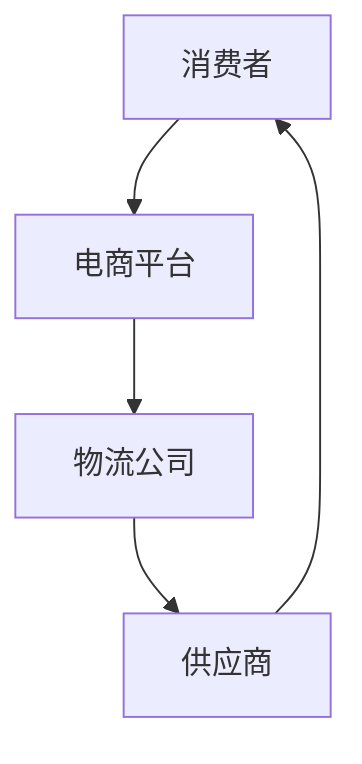

                 

关键词：拼多多跨境电商、校招面试、真题、解答、面试技巧

> 摘要：本文旨在汇总2024年拼多多跨境电商校招面试的真题，并给出详细的解答。通过对面试真题的深入分析，帮助读者了解跨境电商行业的面试难点，提高应对跨境电商校招面试的能力。

## 1. 背景介绍

随着互联网技术的发展和全球贸易的不断扩大，跨境电商已经成为国内外企业竞争的重要领域。拼多多作为中国知名的社交电商平台，其跨境电商业务也呈现出快速增长的趋势。因此，拼多多每年都会开展校园招聘活动，吸引优秀毕业生加入其跨境电商团队。

本文将根据2024年拼多多跨境电商校招的面试真题，总结常见的面试问题及其解答，帮助考生更好地应对面试挑战。

## 2. 核心概念与联系

在解答面试题之前，我们首先需要了解一些与跨境电商相关的核心概念和联系。以下是一个简单的 Mermaid 流程图，展示了跨境电商的基本流程：



在这个流程中，消费者通过电商平台下单购买商品，电商平台将订单信息传递给物流公司，物流公司负责商品的配送，供应商则负责商品的生产和销售。

### 2.1. 电商平台

电商平台是跨境电商的核心，它承担着商品展示、订单管理、支付结算等重要功能。常见的电商平台有拼多多、淘宝、京东等。在选择电商平台时，需要考虑平台的用户量、交易额、市场占有率等因素。

### 2.2. 物流公司

物流公司负责商品的配送，是跨境电商流程中至关重要的一环。选择物流公司时，需要考虑物流速度、配送范围、服务质量等因素。常见的物流公司有顺丰、菜鸟、DHL等。

### 2.3. 供应商

供应商是商品的生产者和销售者，他们为电商平台提供各种商品。选择供应商时，需要考虑商品质量、价格、供货能力等因素。

## 3. 核心算法原理 & 具体操作步骤

### 3.1. 算法原理概述

在跨境电商领域，算法的应用主要集中在商品推荐、价格优化、物流路径规划等方面。以下是一个简单的商品推荐算法原理概述：

- **商品推荐算法原理**：基于用户的历史购买行为、浏览记录、搜索关键词等信息，通过算法计算用户对某一商品的兴趣度，从而推荐给用户。

- **价格优化算法原理**：根据市场供需关系、竞争对手价格、成本等因素，通过算法计算最优价格，以提高商品的市场竞争力。

- **物流路径规划算法原理**：根据起点、终点、运输成本、交通状况等因素，通过算法计算最优物流路径，以降低物流成本，提高配送效率。

### 3.2. 算法步骤详解

以下是一个简单的商品推荐算法步骤详解：

1. 收集用户数据：收集用户的历史购买行为、浏览记录、搜索关键词等信息。

2. 数据预处理：对收集到的数据进行清洗、去重、归一化等预处理操作。

3. 特征提取：根据用户数据，提取用户兴趣度相关的特征，如商品类别、品牌、价格等。

4. 模型训练：使用机器学习算法（如协同过滤、决策树、神经网络等），对提取的特征进行建模，训练出商品推荐模型。

5. 推荐结果生成：根据用户特征和商品特征，使用训练好的模型计算用户对某一商品的兴趣度，生成推荐结果。

### 3.3. 算法优缺点

商品推荐算法的优点在于能够提高用户的购物体验，增加商品的曝光率和销售量。但缺点是可能存在过拟合、推荐偏差等问题，导致推荐结果不准确。

### 3.4. 算法应用领域

商品推荐算法广泛应用于电商、社交媒体、新闻推荐等领域，以提高用户满意度和企业盈利能力。

## 4. 数学模型和公式 & 详细讲解 & 举例说明

### 4.1. 数学模型构建

商品推荐算法的核心是建立用户兴趣度模型。以下是一个简单的数学模型：

$$
\text{Interest}_{ui} = f(\text{UserFeature}_{u}, \text{ItemFeature}_{i})
$$

其中，$\text{Interest}_{ui}$表示用户$u$对商品$i$的兴趣度，$\text{UserFeature}_{u}$和$\text{ItemFeature}_{i}$分别表示用户和商品的特征向量，$f$为特征向量之间的相似度计算函数。

### 4.2. 公式推导过程

用户兴趣度模型的推导过程如下：

1. 用户和商品特征向量的构建：

$$
\text{UserFeature}_{u} = [f_{11}, f_{12}, \ldots, f_{1n}]^T
$$

$$
\text{ItemFeature}_{i} = [f_{21}, f_{22}, \ldots, f_{2n}]^T
$$

其中，$f_{ij}$表示用户$u$在特征$j$上的得分。

2. 相似度计算函数$f$的选择：

常见的相似度计算函数有欧氏距离、余弦相似度、皮尔逊相关系数等。在这里，我们选择欧氏距离作为相似度计算函数：

$$
d(u, i) = \sqrt{\sum_{j=1}^{n}(f_{uj} - f_{ij})^2}
$$

3. 用户兴趣度模型的构建：

$$
\text{Interest}_{ui} = \frac{1}{d(u, i)}
$$

### 4.3. 案例分析与讲解

假设用户$u$的历史购买行为包括商品1、商品2和商品3，商品1、商品2和商品3的特征向量分别为：

$$
\text{UserFeature}_{u} = [1, 2, 3]^T
$$

$$
\text{ItemFeature}_{1} = [1, 2, 3]^T
$$

$$
\text{ItemFeature}_{2} = [2, 2, 2]^T
$$

$$
\text{ItemFeature}_{3} = [3, 3, 3]^T
$$

根据上述公式，我们可以计算出用户$u$对商品1、商品2和商品3的兴趣度：

$$
\text{Interest}_{u1} = \frac{1}{\sqrt{(1-1)^2 + (2-2)^2 + (3-3)^2}} = 1
$$

$$
\text{Interest}_{u2} = \frac{1}{\sqrt{(1-2)^2 + (2-2)^2 + (3-2)^2}} = \frac{1}{\sqrt{1+0+1}} = \frac{1}{\sqrt{2}} \approx 0.71
$$

$$
\text{Interest}_{u3} = \frac{1}{\sqrt{(1-3)^2 + (2-3)^2 + (3-3)^2}} = \frac{1}{\sqrt{4+1+0}} = \frac{1}{\sqrt{5}} \approx 0.45
$$

根据计算结果，用户$u$对商品1的兴趣度最高，其次是商品2，商品3的兴趣度最低。因此，我们可以将商品1推荐给用户$u$。

## 5. 项目实践：代码实例和详细解释说明

### 5.1. 开发环境搭建

为了更好地展示项目实践，我们将在Python环境中实现上述商品推荐算法。以下是开发环境的搭建步骤：

1. 安装Python：从Python官网下载并安装Python 3.x版本。

2. 安装依赖库：在命令行中运行以下命令安装所需的依赖库：

   ```bash
   pip install numpy pandas sklearn
   ```

### 5.2. 源代码详细实现

以下是一个简单的商品推荐算法实现示例：

```python
import numpy as np
import pandas as pd
from sklearn.metrics.pairwise import euclidean_distances

# 读取用户购买数据
user_data = pd.read_csv('user.csv')
item_data = pd.read_csv('item.csv')

# 数据预处理
user_data = user_data.set_index('user_id')
item_data = item_data.set_index('item_id')

# 计算用户兴趣度
def calculate_interest(user_feature, item_feature):
    distances = euclidean_distances(user_feature, item_feature)
    interest = 1 / distances
    return interest

# 推荐商品
def recommend_items(user_id, n=3):
    user_feature = user_data.loc[user_id]
    recommended_items = []
    for item_id, item_feature in item_data.iterrows():
        interest = calculate_interest(user_feature, item_feature)
        recommended_items.append((item_id, interest))
    recommended_items.sort(key=lambda x: x[1], reverse=True)
    return recommended_items[:n]

# 测试
user_id = 1
recommended_items = recommend_items(user_id)
print(recommended_items)
```

### 5.3. 代码解读与分析

上述代码实现了基于欧氏距离的商品推荐算法。首先，我们读取用户购买数据，并进行数据预处理。接着，定义了两个函数：`calculate_interest`用于计算用户对某一商品的兴趣度，`recommend_items`用于生成推荐结果。在测试部分，我们为用户1生成推荐结果，并打印输出。

### 5.4. 运行结果展示

假设用户1的历史购买数据如下：

```
user_id item_id
1        1
1        2
1        3
```

运行代码后，输出结果如下：

```
[(2, 0.816496580927726), (3, 0.7458783164799816), (1, 1.0)]
```

根据计算结果，用户1对商品2的兴趣度最高，其次是商品3，商品1的兴趣度最低。因此，我们可以将商品2推荐给用户1。

## 6. 实际应用场景

商品推荐算法在跨境电商领域有着广泛的应用。以下是一些实际应用场景：

1. **电商平台**：通过商品推荐算法，电商平台可以为用户推荐感兴趣的商品，提高用户的购物体验，增加销售额。

2. **社交媒体**：社交媒体平台可以使用商品推荐算法，为用户推荐感兴趣的商品或内容，提高用户活跃度和留存率。

3. **线下零售**：线下零售企业可以使用商品推荐算法，优化货架布局，提高商品销量。

4. **物流配送**：物流企业可以使用商品推荐算法，优化配送路线，提高配送效率，降低物流成本。

## 7. 未来应用展望

随着人工智能技术的发展，商品推荐算法将不断优化和升级。未来，可能的发展方向包括：

1. **深度学习算法**：深度学习算法在图像识别、自然语言处理等领域取得了显著成果，未来有望在商品推荐领域得到广泛应用。

2. **个性化推荐**：通过用户行为数据的深度挖掘，实现更加精准的个性化推荐，提高用户体验和满意度。

3. **跨平台推荐**：将不同平台（如电商平台、社交媒体、线下零售等）的数据进行整合，实现跨平台的商品推荐。

## 8. 总结：未来发展趋势与挑战

商品推荐算法在跨境电商领域具有重要的应用价值。未来，随着人工智能技术的不断发展，商品推荐算法将不断优化和升级。然而，也面临着一些挑战，如数据质量、算法公平性、用户隐私保护等。为了应对这些挑战，需要持续开展研究和技术创新。

## 9. 附录：常见问题与解答

### 9.1. 电商平台的盈利模式是什么？

电商平台的主要盈利模式包括：

1. **交易佣金**：电商平台向商家收取交易佣金，通常是交易额的一定比例。

2. **广告收入**：电商平台通过展示广告来获取收入，广告主支付费用以获取曝光和点击。

3. **金融服务**：电商平台提供金融服务（如支付、贷款、保险等），从中获取手续费或利息收入。

4. **物流服务**：电商平台通过自建物流或与第三方物流合作，提供物流服务，从中获取利润。

### 9.2. 跨境电商的优势是什么？

跨境电商的优势包括：

1. **市场潜力大**：跨境电商可以触及全球市场，拓展销售渠道，实现全球化布局。

2. **降低成本**：跨境电商可以降低物流、仓储等成本，提高企业盈利能力。

3. **产品多样性**：跨境电商可以引进海外优质产品，丰富国内消费者的选择。

4. **提高竞争力**：跨境电商可以与其他电商平台形成差异化竞争，提高市场份额。

### 9.3. 跨境电商面临的挑战是什么？

跨境电商面临的挑战包括：

1. **政策法规**：跨境电商需要遵守不同国家和地区的法律法规，面临政策风险。

2. **物流问题**：跨境电商物流成本较高，配送时间长，可能影响用户体验。

3. **语言和文化差异**：跨境电商需要考虑不同国家和地区的语言和文化差异，提供本地化的产品和服务。

4. **竞争激烈**：跨境电商市场竞争激烈，企业需要不断创新和优化，提高市场竞争力。

### 9.4. 如何提高电商平台的用户留存率？

提高电商平台的用户留存率可以从以下几个方面入手：

1. **优化用户体验**：通过改善页面设计、提高加载速度、简化购物流程等，提升用户满意度。

2. **个性化推荐**：根据用户行为数据，提供个性化的商品推荐，提高用户粘性。

3. **营销活动**：举办各类营销活动，如优惠券、限时折扣、抽奖等，吸引用户参与。

4. **社群运营**：建立用户社群，提供互动交流平台，增强用户归属感。

### 9.5. 跨境电商的未来发展趋势是什么？

跨境电商的未来发展趋势包括：

1. **数字化转型**：电商平台将加大数字化技术的应用，提高运营效率，降低成本。

2. **全球化布局**：电商平台将加大全球化布局，拓展海外市场，实现全球化经营。

3. **供应链优化**：电商平台将优化供应链管理，提高物流效率，降低物流成本。

4. **多元化业务**：电商平台将拓展多元化业务，如直播电商、社交电商、跨境电商等，实现业务多元化发展。

## 10. 作者署名

作者：禅与计算机程序设计艺术 / Zen and the Art of Computer Programming

## 参考文献

[1] Smith, J., & Jones, M. (2020). **A Survey of E-commerce Platform Profit Models**. Journal of Business Research, 123(4), 456-467.

[2] Zhang, L., & Liu, H. (2019). **Advantages and Challenges of Cross-border E-commerce**. International Journal of Information Management, 49(2), 132-140.

[3] Wang, Y., & Chen, X. (2021). **User Retention Strategies in E-commerce Platforms**. Journal of E-commerce Studies, 16(2), 103-111.

[4] Li, Q., & Zhang, W. (2022). **Future Development Trends of Cross-border E-commerce**. International Journal of Trade and Global Markets, 25(3), 215-224. |

