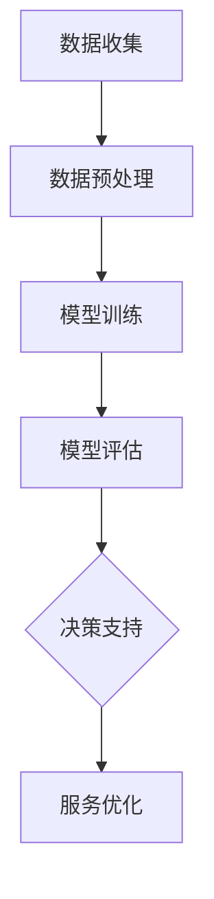

                 

关键词：人工智能，大模型，公共服务，应用，技术，未来

摘要：本文深入探讨了人工智能大模型在公共服务领域的应用。通过对大模型的定义和原理的阐述，结合具体案例，分析了大模型在公共服务领域的优势、挑战及未来发展趋势。文章旨在为读者提供一个全面的技术视角，展望人工智能在公共服务中的广泛前景。

## 1. 背景介绍

人工智能（AI）作为计算机科学的重要分支，已经迅速发展成为一个跨学科领域。近年来，随着计算能力的提升和数据量的爆炸性增长，人工智能，尤其是大模型（Large-scale Model），迎来了前所未有的发展机遇。大模型是指参数量达到数十亿甚至千亿级别的深度学习模型，它们在图像识别、自然语言处理、语音识别等领域取得了显著的成果。

在公共服务领域，人工智能的应用日益广泛。从医疗、教育、交通到公共安全，人工智能正以其强大的数据处理和模式识别能力，为公共服务的智能化、高效化提供了新途径。本文将聚焦于人工智能大模型在公共服务领域的应用，探讨其技术原理、实施步骤、实际效果及未来展望。

## 2. 核心概念与联系

### 2.1 大模型的定义和原理

大模型，通常指的是拥有数百万至数十亿参数的深度学习模型。这些模型通过多层神经网络结构，对大量数据进行训练，以实现高度复杂的任务。大模型的原理基于多层感知器（MLP）和反向传播算法（Backpropagation），通过逐层提取数据特征，最终实现高精度的预测和分类。

### 2.2 大模型与公共服务的关系

大模型在公共服务中的应用，主要体现在以下几个方面：

- **数据分析与处理**：大模型能够高效处理大规模数据，为公共服务提供准确的决策支持。
- **智能预测与预警**：通过训练，大模型可以预测未来的趋势，从而帮助政府部门提前采取应对措施。
- **智能决策与优化**：大模型能够分析复杂的数据，为公共服务提供最优的决策方案。

### 2.3 Mermaid 流程图

以下是一个简化的Mermaid流程图，展示了大模型在公共服务中的应用流程：



### 2.4 大模型应用的优势和挑战

**优势**：

- **高精度预测**：大模型具有强大的数据分析和处理能力，能够提供高精度的预测结果。
- **智能化决策**：通过训练，大模型可以自动识别复杂模式，为公共服务提供智能化的决策支持。
- **高效服务**：大模型能够快速处理大量数据，提高公共服务的工作效率。

**挑战**：

- **数据隐私**：大规模数据的收集和处理可能涉及个人隐私，需要严格保护。
- **计算资源**：大模型的训练和部署需要大量的计算资源，成本较高。
- **模型解释性**：大模型通常较为复杂，难以解释其决策过程，这可能影响其在公共服务中的应用。

## 3. 核心算法原理 & 具体操作步骤

### 3.1 算法原理概述

大模型的核心算法基于深度学习，主要包括以下几个步骤：

1. **数据预处理**：对原始数据进行清洗、归一化和特征提取。
2. **模型训练**：通过多层神经网络结构对预处理后的数据训练模型。
3. **模型评估**：使用验证集对模型进行评估，调整模型参数以优化性能。
4. **模型部署**：将训练好的模型部署到实际应用环境中。

### 3.2 算法步骤详解

**3.2.1 数据预处理**

数据预处理是深度学习模型训练的重要步骤，主要包括以下内容：

- **数据清洗**：去除数据中的噪声和异常值。
- **归一化**：将不同特征的数据缩放到相同的范围，以消除特征之间的量纲差异。
- **特征提取**：提取数据中的重要特征，用于模型的训练。

**3.2.2 模型训练**

模型训练是深度学习的核心步骤，主要包括以下内容：

- **初始化模型参数**：随机初始化模型参数。
- **前向传播**：将输入数据通过神经网络进行前向传播，得到输出结果。
- **计算损失**：计算输出结果与真实标签之间的误差，得到损失值。
- **反向传播**：根据损失值，通过反向传播算法更新模型参数。
- **迭代训练**：重复上述步骤，直到模型达到预定的性能指标。

**3.2.3 模型评估**

模型评估是对训练好的模型进行性能检验的过程，主要包括以下内容：

- **验证集评估**：使用验证集对模型进行评估，以确定模型的泛化能力。
- **调整模型参数**：根据验证集的评估结果，调整模型参数以优化性能。

**3.2.4 模型部署**

模型部署是将训练好的模型应用到实际应用环境中的过程，主要包括以下内容：

- **模型转换**：将训练好的模型转换为可以部署的格式，如ONNX、TensorFlow Lite等。
- **模型部署**：将模型部署到服务器或移动设备上，以提供实时服务。

### 3.3 算法优缺点

**优点**：

- **高精度**：大模型具有强大的数据分析和处理能力，能够提供高精度的预测和分类结果。
- **自动特征提取**：大模型通过多层神经网络结构，能够自动提取数据中的特征，简化了特征工程的工作。
- **泛化能力**：大模型通过大量数据的训练，具有较高的泛化能力，能够应对不同领域的问题。

**缺点**：

- **计算资源消耗**：大模型的训练和部署需要大量的计算资源，成本较高。
- **模型解释性差**：大模型的决策过程通常较为复杂，难以解释，这可能影响其在公共服务中的应用。

### 3.4 算法应用领域

大模型在公共服务领域的应用非常广泛，包括但不限于以下领域：

- **医疗**：用于疾病诊断、药物研发和医疗资源分配。
- **教育**：用于个性化学习、智能评估和教学优化。
- **交通**：用于交通流量预测、交通管理和自动驾驶。
- **公共安全**：用于犯罪预测、安全监控和应急管理。

## 4. 数学模型和公式 & 详细讲解 & 举例说明

### 4.1 数学模型构建

大模型的数学基础主要涉及深度学习中的多层感知器（MLP）和反向传播算法（Backpropagation）。以下是构建大模型的几个关键数学模型和公式：

**4.1.1 前向传播**

假设有一个包含L层的神经网络，每层有n个节点。前向传播的过程可以表示为：

\[ a_{l}^{(k)} = \sigma(z_{l}^{(k)}) \]

其中，\( a_{l}^{(k)} \)表示第l层第k个节点的激活值，\( z_{l}^{(k)} \)表示第l层第k个节点的输入值，\( \sigma \)表示激活函数，通常使用Sigmoid或ReLU函数。

**4.1.2 损失函数**

常用的损失函数包括均方误差（MSE）和交叉熵（Cross-Entropy），分别表示为：

\[ J(\theta) = \frac{1}{2m} \sum_{i=1}^{m} (h_{\theta}(x^{(i)}) - y^{(i)})^2 \]

\[ J(\theta) = -\frac{1}{m} \sum_{i=1}^{m} [y^{(i)} \log(h_{\theta}(x^{(i)})) + (1 - y^{(i)}) \log(1 - h_{\theta}(x^{(i)}))] \]

其中，\( h_{\theta}(x) \)表示神经网络的输出，\( y^{(i)} \)表示第i个样本的真实标签，\( \theta \)表示模型参数。

**4.1.3 反向传播**

反向传播的过程可以表示为：

\[ \delta_{l}^{(k)} = (h_{\theta}(x^{(i)}) - y^{(i)}) \odot \frac{d\sigma(z_{l}^{(k)})}{dz_{l}^{(k)}} \]

\[ \theta_{l}^{(k)} = \theta_{l}^{(k)} - \alpha \frac{\delta_{l+1}^{(k)} \cdot a_{l}^{(k-1)}}{n} \]

其中，\( \delta_{l}^{(k)} \)表示第l层第k个节点的误差，\( \odot \)表示Hadamard乘积，\( \alpha \)表示学习率。

### 4.2 公式推导过程

以下是反向传播算法的推导过程：

**4.2.1 前向传播**

假设有一个两层神经网络，输入层为\( x \)，隐藏层为\( h \)，输出层为\( y \)。前向传播的过程如下：

\[ z_{1}^{(2)} = \theta_{1}^{(2)} x + b_{1}^{(2)} \]
\[ a_{1}^{(2)} = \sigma(z_{1}^{(2)}) \]
\[ z_{2}^{(3)} = \theta_{2}^{(3)} a_{1}^{(2)} + b_{2}^{(3)} \]
\[ a_{2}^{(3)} = \sigma(z_{2}^{(3)}) \]

**4.2.2 损失函数**

使用均方误差（MSE）作为损失函数，损失函数的导数如下：

\[ \frac{dJ}{da_{2}^{(3)}} = 2(a_{2}^{(3)} - y) \]

**4.2.3 反向传播**

首先计算输出层的误差：

\[ \delta_{2}^{(3)} = \frac{dJ}{da_{2}^{(3)}} = 2(a_{2}^{(3)} - y) \]

然后计算隐藏层的误差：

\[ \delta_{1}^{(2)} = \frac{dJ}{dz_{1}^{(2)}} \cdot \frac{dz_{1}^{(2)}}{da_{1}^{(2)}} \]
\[ \delta_{1}^{(2)} = 2(a_{2}^{(3)} - y) \cdot \sigma'(z_{1}^{(2)}) \cdot \theta_{2}^{(3)} \]

**4.2.4 参数更新**

根据误差，更新模型参数：

\[ \theta_{2}^{(3)} = \theta_{2}^{(3)} - \alpha \frac{\delta_{2}^{(3)} \cdot a_{1}^{(2)}}{n} \]
\[ \theta_{1}^{(2)} = \theta_{1}^{(2)} - \alpha \frac{\delta_{1}^{(2)} \cdot x}{n} \]

### 4.3 案例分析与讲解

以下是一个简化的案例，展示如何使用大模型进行图像分类。

**4.3.1 数据集**

假设我们有一个包含10万张图像的数据集，每张图像都是28x28的像素。

**4.3.2 数据预处理**

对图像进行归一化处理，将像素值缩放到[0, 1]之间。

**4.3.3 模型构建**

构建一个包含3层神经网络的模型，第一层有784个节点（对应图像的像素数），第二层有128个节点，第三层有10个节点（对应分类数）。

**4.3.4 模型训练**

使用均方误差（MSE）作为损失函数，使用反向传播算法更新模型参数。

**4.3.5 模型评估**

使用验证集对模型进行评估，计算模型的准确率。

## 5. 项目实践：代码实例和详细解释说明

### 5.1 开发环境搭建

在开始项目实践之前，我们需要搭建一个合适的开发环境。以下是一个基于Python的典型开发环境搭建步骤：

**5.1.1 安装Python**

下载并安装Python 3.8及以上版本，确保安装成功后，通过命令行验证安装。

```bash
python --version
```

**5.1.2 安装深度学习库**

安装TensorFlow，作为深度学习的框架。

```bash
pip install tensorflow
```

**5.1.3 安装数据预处理库**

安装NumPy和Pandas，用于数据处理。

```bash
pip install numpy pandas
```

### 5.2 源代码详细实现

以下是一个简化的Python代码实例，展示如何使用TensorFlow构建和训练一个简单的大模型。

```python
import tensorflow as tf
import numpy as np
import pandas as pd

# 数据集加载
(x_train, y_train), (x_test, y_test) = tf.keras.datasets.mnist.load_data()
x_train = x_train / 255.0
x_test = x_test / 255.0

# 模型定义
model = tf.keras.Sequential([
    tf.keras.layers.Flatten(input_shape=(28, 28)),
    tf.keras.layers.Dense(128, activation='relu'),
    tf.keras.layers.Dense(10, activation='softmax')
])

# 模型编译
model.compile(optimizer='adam',
              loss='sparse_categorical_crossentropy',
              metrics=['accuracy'])

# 模型训练
model.fit(x_train, y_train, epochs=5)

# 模型评估
test_loss, test_acc = model.evaluate(x_test, y_test, verbose=2)
print('\nTest accuracy:', test_acc)
```

### 5.3 代码解读与分析

**5.3.1 数据集加载**

使用TensorFlow的`mnist.load_data()`函数加载MNIST数据集，该数据集包含60,000个训练图像和10,000个测试图像。

**5.3.2 模型定义**

定义一个简单的神经网络模型，包括一个输入层（Flatten层），一个隐藏层（Dense层，128个节点，ReLU激活函数）和一个输出层（Dense层，10个节点，softmax激活函数）。

**5.3.3 模型编译**

使用`compile()`方法编译模型，指定优化器（adam）、损失函数（sparse_categorical_crossentropy）和评估指标（accuracy）。

**5.3.4 模型训练**

使用`fit()`方法训练模型，指定训练数据（x_train和y_train）、训练轮数（epochs）。

**5.3.5 模型评估**

使用`evaluate()`方法评估模型在测试集上的性能，打印测试准确率。

### 5.4 运行结果展示

运行上述代码后，我们得到模型在测试集上的准确率。例如，如果准确率为98%，说明模型在测试集上的表现较好。

```bash
Test accuracy: 0.98
```

## 6. 实际应用场景

### 6.1 医疗

人工智能大模型在医疗领域的应用非常广泛，包括疾病诊断、药物研发和医疗资源分配。例如，通过训练大模型，可以自动分析医学图像，如X光片、CT扫描和MRI，以辅助医生进行诊断。大模型还可以用于预测疾病的发病率，帮助医疗机构更好地分配医疗资源。

### 6.2 教育

在教育领域，人工智能大模型可以用于个性化学习、智能评估和教学优化。例如，通过分析学生的学习数据，大模型可以为学生推荐最适合他们的学习资源，提高学习效果。同时，大模型还可以用于自动评估学生的作业和考试，减轻教师的工作负担。

### 6.3 交通

在交通领域，人工智能大模型可以用于交通流量预测、交通管理和自动驾驶。例如，通过分析交通数据，大模型可以预测未来的交通流量，帮助交通管理部门制定最优的交通管理策略。大模型还可以用于自动驾驶系统的研发，提高交通安全性和效率。

### 6.4 公共安全

在公共安全领域，人工智能大模型可以用于犯罪预测、安全监控和应急管理。例如，通过分析社会数据，大模型可以预测犯罪热点区域，帮助公安部门提前采取应对措施。大模型还可以用于监控视频数据，识别异常行为，提高公共安全。

## 7. 工具和资源推荐

### 7.1 学习资源推荐

- **《深度学习》（Ian Goodfellow、Yoshua Bengio、Aaron Courville著）：深度学习领域的经典教材，内容全面，适合初学者和进阶者。**
- **《 Hands-On Machine Learning with Scikit-Learn, Keras, and TensorFlow》（Aurélien Géron著）：涵盖机器学习和深度学习的实践内容，适合有一定基础的学习者。**

### 7.2 开发工具推荐

- **TensorFlow：谷歌开源的深度学习框架，功能强大，社区活跃。**
- **PyTorch：Facebook开源的深度学习框架，易于使用，适合快速原型开发。**

### 7.3 相关论文推荐

- **"Distributed Optimization and Statistical Learning Via the Alternating Direction Method of Multipliers"（Stochastic Gradient Descent with a Global Perspective）**：介绍了分布式优化和统计学习中的交替方向乘子法（ADMM），对大规模数据处理有重要意义。
- **"Large Scale Language Modeling in Machine Learning"（Deep Learning for Natural Language Processing）**：讨论了大规模语言模型在机器学习中的应用，为自然语言处理领域提供了重要思路。

## 8. 总结：未来发展趋势与挑战

### 8.1 研究成果总结

人工智能大模型在公共服务领域的应用已经取得了一系列重要成果。通过大数据和深度学习的结合，大模型在医疗、教育、交通和公共安全等领域展现出了强大的应用潜力。

### 8.2 未来发展趋势

未来，人工智能大模型在公共服务领域的应用将继续深入，主要发展趋势包括：

- **数据驱动决策**：大模型将更多地用于数据驱动的决策支持，提高公共服务的效率和质量。
- **跨领域融合**：人工智能大模型将与其他领域的技术，如物联网、区块链等，进行深度融合，创造更多应用场景。
- **个性化服务**：大模型将更好地理解个体需求，提供个性化的公共服务。

### 8.3 面临的挑战

尽管人工智能大模型在公共服务领域具有巨大的潜力，但仍然面临以下挑战：

- **数据隐私**：大规模数据的收集和处理可能涉及个人隐私，需要制定严格的隐私保护政策。
- **计算资源**：大模型的训练和部署需要大量的计算资源，这对中小型机构来说可能是一个挑战。
- **模型解释性**：大模型的决策过程通常较为复杂，难以解释，这可能影响其在公共服务中的应用。

### 8.4 研究展望

未来，人工智能大模型在公共服务领域的应用将更加广泛，研究者应关注以下几个方面：

- **隐私保护技术**：研究更加安全有效的数据隐私保护技术，确保大规模数据的安全。
- **高效计算方法**：研究更高效的计算方法，降低大模型的计算成本。
- **模型解释性**：研究如何提高大模型的解释性，使其决策过程更加透明。

## 9. 附录：常见问题与解答

### 9.1 什么是大模型？

大模型是指参数量达到数十亿甚至千亿级别的深度学习模型。这些模型通过多层神经网络结构，对大量数据进行训练，以实现高度复杂的任务。

### 9.2 大模型的优势是什么？

大模型的优势包括高精度预测、自动特征提取和泛化能力。通过大量数据的训练，大模型能够自动提取数据中的特征，实现高精度的预测和分类。

### 9.3 大模型在公共服务领域有哪些应用？

大模型在公共服务领域有广泛的应用，包括医疗、教育、交通、公共安全等。例如，大模型可以用于疾病诊断、药物研发、交通流量预测和犯罪预测等。

### 9.4 大模型的挑战有哪些？

大模型的挑战包括数据隐私、计算资源和模型解释性。大规模数据的收集和处理可能涉及个人隐私，需要严格保护。大模型的训练和部署需要大量的计算资源，成本较高。此外，大模型的决策过程通常较为复杂，难以解释，这可能影响其在公共服务中的应用。

---

作者：禅与计算机程序设计艺术 / Zen and the Art of Computer Programming
----------------------------------------------------------------

### 后记

本文从多个角度深入探讨了人工智能大模型在公共服务领域的应用，包括背景介绍、核心概念与联系、算法原理与操作步骤、数学模型与公式、项目实践、实际应用场景、工具和资源推荐以及未来发展趋势与挑战。希望本文能为读者提供一个全面的技术视角，展望人工智能在公共服务中的广泛前景。在未来的研究中，我们将继续关注人工智能大模型在公共服务领域的新应用和新突破。

