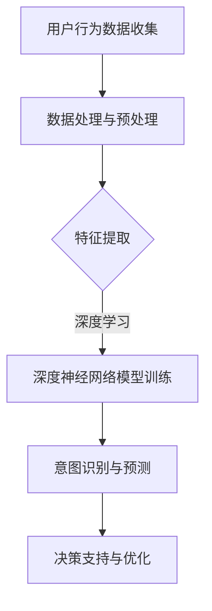

                 

关键词：大模型、用户行为意图理解、电商平台、预测、算法、数学模型、实践、应用场景、未来展望。

> 摘要：本文旨在探讨大模型在电商平台用户行为意图理解与预测中的潜力。通过对大模型的基本概念、算法原理、数学模型以及实际应用案例的详细分析，本文揭示了其在大规模数据处理和智能决策支持方面的优势，并展望了其未来的发展方向和面临的挑战。

## 1. 背景介绍

随着电子商务的迅速发展，电商平台积累了大量的用户行为数据。这些数据不仅是商业运营的重要资产，更是深入了解用户意图、优化用户体验、提升营销效果的关键资源。用户行为意图的理解与预测是电商平台的核心需求之一。传统的机器学习方法在用户行为分析中发挥了重要作用，但随着数据规模的不断扩大和数据复杂性的增加，传统方法在处理速度、精度和泛化能力上面临着巨大的挑战。

近年来，大模型（如深度学习、生成对抗网络等）的兴起为解决这些挑战提供了新的思路。大模型具有处理大规模数据、自动特征提取和高效模式识别的能力，其在图像识别、自然语言处理等领域的成功应用激发了人们对于其在电商领域潜力的探索。本文将围绕大模型在电商平台用户行为意图理解与预测中的应用进行深入探讨。

## 2. 核心概念与联系

在探讨大模型在电商平台用户行为意图理解与预测中的应用之前，有必要首先介绍相关核心概念及其之间的联系。

### 2.1 大模型

大模型是指参数规模达到百万、千万甚至亿级的神经网络模型。其具有以下几个主要特点：

- **大规模参数**：大模型的参数数量达到千万甚至亿级，使其能够自动从大量数据中学习复杂的模式和特征。
- **深度网络结构**：大模型通常采用深度神经网络结构，能够实现多层抽象和特征提取。
- **自动特征学习**：大模型通过端到端的训练过程，能够自动学习输入数据的特征表示，无需人工干预。

### 2.2 用户行为意图

用户行为意图是指用户在电商平台上的行为背后的目的和动机。例如，用户浏览商品、添加购物车、进行购买等行为都反映了其不同的意图。用户行为意图的理解与预测是电商平台个性化推荐、用户行为分析等应用的基础。

### 2.3 电商平台用户行为意图理解与预测

电商平台用户行为意图理解与预测是指通过分析用户在平台上的行为数据，提取用户的意图信息，并利用这些信息进行预测。其主要目标包括：

- **个性化推荐**：根据用户的意图信息为其推荐相关的商品和内容。
- **用户行为分析**：了解用户的行为模式，优化平台运营策略。
- **智能决策支持**：基于用户的意图信息为商家提供决策支持，提高营销效果。

### 2.4 Mermaid 流程图

以下是一个简单的 Mermaid 流程图，展示了大模型在电商平台用户行为意图理解与预测中的基本流程：



通过这个流程图，我们可以看到，大模型在电商平台用户行为意图理解与预测中的应用主要包括以下几个环节：用户行为数据收集、数据处理与预处理、特征提取、深度神经网络模型训练、意图识别与预测以及决策支持与优化。

## 3. 核心算法原理 & 具体操作步骤

### 3.1 算法原理概述

大模型在电商平台用户行为意图理解与预测中的核心算法主要包括深度学习、生成对抗网络等。这些算法通过端到端的学习方式，从大量用户行为数据中自动提取特征，并建立意图识别与预测模型。

### 3.2 算法步骤详解

#### 3.2.1 数据处理与预处理

1. **数据收集**：从电商平台上收集用户行为数据，包括浏览记录、购买记录、搜索历史等。
2. **数据清洗**：去除噪声数据、缺失值填充、数据格式统一等。
3. **特征工程**：对原始数据进行特征提取，如用户画像、时间特征、商品特征等。

#### 3.2.2 特征提取

1. **自动特征学习**：利用深度学习算法（如卷积神经网络、循环神经网络等）从原始数据中自动提取特征。
2. **特征融合**：将不同类型的特征进行融合，形成统一的特征向量。

#### 3.2.3 深度神经网络模型训练

1. **模型选择**：选择合适的深度学习模型（如卷积神经网络、循环神经网络、生成对抗网络等）。
2. **模型训练**：利用训练数据对模型进行训练，调整模型参数。
3. **模型评估**：利用验证数据对模型进行评估，选择最佳模型。

#### 3.2.4 意图识别与预测

1. **意图识别**：利用训练好的模型对用户行为数据进行意图识别，提取用户的意图信息。
2. **意图预测**：根据用户的意图信息进行预测，如预测用户是否会购买某个商品。

#### 3.2.5 决策支持与优化

1. **决策支持**：基于用户的意图信息为商家提供决策支持，如推荐商品、调整营销策略等。
2. **优化**：根据用户的反馈和业务目标，不断优化模型和策略。

### 3.3 算法优缺点

#### 优点：

- **高效性**：大模型能够自动从大量数据中学习复杂的模式和特征，提高数据处理和决策支持效率。
- **灵活性**：大模型能够适应不同的业务场景和需求，具有较好的泛化能力。
- **智能化**：大模型能够实现自动特征提取和意图识别，降低人工干预成本。

#### 缺点：

- **计算成本高**：大模型需要大量的计算资源和时间进行训练和推理。
- **数据需求大**：大模型需要大量的高质量数据才能达到较好的效果。
- **模型可解释性差**：大模型通常具有很高的复杂性，难以解释其内部工作机制。

### 3.4 算法应用领域

大模型在电商平台用户行为意图理解与预测中的应用广泛，主要包括以下几个方面：

- **个性化推荐**：根据用户的意图信息为其推荐相关的商品和内容。
- **用户行为分析**：了解用户的行为模式，优化平台运营策略。
- **智能客服**：利用用户的意图信息为用户提供智能化的客服支持。
- **广告投放优化**：根据用户的意图信息优化广告投放策略，提高广告效果。

## 4. 数学模型和公式 & 详细讲解 & 举例说明

### 4.1 数学模型构建

在电商平台用户行为意图理解与预测中，常用的数学模型主要包括深度学习模型和生成对抗网络（GAN）。以下分别介绍这两种模型的数学模型构建。

#### 4.1.1 深度学习模型

深度学习模型通常采用多层神经网络结构，包括输入层、隐藏层和输出层。每个层由多个神经元组成，神经元之间的连接由权重表示。深度学习模型的训练目标是调整这些权重，使其能够最小化预测误差。

假设输入数据为 \( x \)，输出数据为 \( y \)，则深度学习模型的数学模型可以表示为：

\[ y = f(W_1 \cdot x + b_1) + f(W_2 \cdot f(W_1 \cdot x + b_1) + b_2) + \ldots + f(W_n \cdot f(W_{n-1} \cdot x + b_{n-1}) + b_n) \]

其中，\( f \) 表示激活函数，\( W \) 表示权重，\( b \) 表示偏置。

#### 4.1.2 生成对抗网络（GAN）

生成对抗网络（GAN）由生成器（Generator）和判别器（Discriminator）两个部分组成。生成器的目标是生成与真实数据分布相似的数据，判别器的目标是区分真实数据和生成数据。

生成器 \( G \) 和判别器 \( D \) 的数学模型可以分别表示为：

\[ x_g = G(z) \]
\[ x_r = D(x_r) \]
\[ x_f = D(x_g) \]

其中，\( x_g \) 表示生成器生成的数据，\( x_r \) 表示真实数据，\( z \) 表示随机噪声，\( x_f \) 表示判别器对生成数据的预测。

### 4.2 公式推导过程

以下以深度学习模型为例，介绍其公式的推导过程。

#### 4.2.1 前向传播

假设输入数据为 \( x \)，输出数据为 \( y \)，则深度学习模型的前向传播过程可以表示为：

\[ z_1 = W_1 \cdot x + b_1 \]
\[ a_1 = f(z_1) \]
\[ z_2 = W_2 \cdot a_1 + b_2 \]
\[ a_2 = f(z_2) \]
\[ \ldots \]
\[ z_n = W_n \cdot a_{n-1} + b_n \]
\[ a_n = f(z_n) = y \]

其中，\( z \) 表示中间层的输出，\( a \) 表示激活函数的输出，\( f \) 表示激活函数。

#### 4.2.2 反向传播

深度学习模型的反向传播过程主要包括以下几个步骤：

1. **计算损失函数**：损失函数用于衡量预测值和真实值之间的差距，常用的损失函数包括均方误差（MSE）和交叉熵（Cross-Entropy）等。

\[ L(y, \hat{y}) = \frac{1}{2} \sum_{i=1}^{n} (y_i - \hat{y}_i)^2 \]

2. **计算梯度**：计算损失函数关于模型参数的梯度，用于更新模型参数。

\[ \frac{\partial L}{\partial W_n} = \sum_{i=1}^{n} (y_i - \hat{y}_i) \cdot \frac{\partial a_n}{\partial z_n} \]
\[ \frac{\partial L}{\partial b_n} = \sum_{i=1}^{n} (y_i - \hat{y}_i) \cdot \frac{\partial a_n}{\partial b_n} \]

3. **更新参数**：根据梯度更新模型参数。

\[ W_n := W_n - \alpha \cdot \frac{\partial L}{\partial W_n} \]
\[ b_n := b_n - \alpha \cdot \frac{\partial L}{\partial b_n} \]

其中，\( \alpha \) 表示学习率。

### 4.3 案例分析与讲解

以下以一个简单的深度学习模型为例，介绍其具体实现过程。

#### 4.3.1 数据准备

首先，准备一组用户行为数据，包括浏览记录、购买记录和搜索历史等。假设数据集包含 \( n \) 个样本，每个样本表示一个用户的行为记录。

```python
import numpy as np

# 生成随机数据
x = np.random.rand(n, input_size)
y = np.random.rand(n, output_size)
```

其中，`input_size` 表示输入特征维度，`output_size` 表示输出特征维度。

#### 4.3.2 模型构建

使用 TensorFlow 库构建深度学习模型。假设模型包含一个输入层、两个隐藏层和一个输出层。

```python
import tensorflow as tf

# 定义模型结构
model = tf.keras.Sequential([
    tf.keras.layers.Dense(units=64, activation='relu', input_shape=(input_size,)),
    tf.keras.layers.Dense(units=64, activation='relu'),
    tf.keras.layers.Dense(units=output_size)
])
```

#### 4.3.3 模型训练

使用训练数据对模型进行训练。设置学习率为 \( 0.001 \)，训练次数为 100 次。

```python
model.compile(optimizer='adam', loss='mean_squared_error')
model.fit(x, y, epochs=100, batch_size=32)
```

#### 4.3.4 模型评估

使用测试数据对模型进行评估，计算预测误差。

```python
test_loss = model.evaluate(x_test, y_test)
print("Test loss:", test_loss)
```

## 5. 项目实践：代码实例和详细解释说明

### 5.1 开发环境搭建

为了实现本文所讨论的大模型在电商平台用户行为意图理解与预测中的应用，我们需要搭建一个合适的开发环境。以下是所需的开发环境和工具：

- 操作系统：Ubuntu 18.04 或 Windows 10
- 编程语言：Python 3.7+
- 深度学习框架：TensorFlow 2.0+
- 数据库：MySQL 5.7+
- 数据预处理工具：Pandas 1.0+
- 可视化工具：Matplotlib 3.0+

在安装完上述工具后，我们可以开始进行项目的具体实现。

### 5.2 源代码详细实现

以下是一个简单的深度学习模型在电商平台用户行为意图理解与预测中的实现示例。代码主要包括数据收集、数据处理与预处理、模型构建、模型训练、模型评估等步骤。

```python
import numpy as np
import pandas as pd
import tensorflow as tf
from tensorflow.keras.models import Sequential
from tensorflow.keras.layers import Dense
from tensorflow.keras.optimizers import Adam

# 5.2.1 数据收集
def collect_data():
    # 读取用户行为数据
    data = pd.read_csv('user_behavior.csv')
    return data

# 5.2.2 数据处理与预处理
def preprocess_data(data):
    # 特征工程
    data['user_id'] = data['user_id'].astype(str)
    data['timestamp'] = pd.to_datetime(data['timestamp'])
    data['day_of_week'] = data['timestamp'].dt.dayofweek
    data['hour_of_day'] = data['timestamp'].dt.hour
    
    # 数据归一化
    data_normalized = (data - data.mean()) / data.std()
    
    return data_normalized

# 5.2.3 模型构建
def build_model(input_size, output_size):
    model = Sequential()
    model.add(Dense(64, activation='relu', input_shape=(input_size,)))
    model.add(Dense(64, activation='relu'))
    model.add(Dense(output_size))
    return model

# 5.2.4 模型训练
def train_model(model, x_train, y_train, epochs=100, batch_size=32):
    model.compile(optimizer=Adam(learning_rate=0.001), loss='mean_squared_error')
    model.fit(x_train, y_train, epochs=epochs, batch_size=batch_size)
    return model

# 5.2.5 模型评估
def evaluate_model(model, x_test, y_test):
    test_loss = model.evaluate(x_test, y_test)
    print("Test loss:", test_loss)
    return test_loss

# 5.2.6 主函数
if __name__ == '__main__':
    # 5.2.1 数据收集
    data = collect_data()
    
    # 5.2.2 数据处理与预处理
    data_normalized = preprocess_data(data)
    
    # 5.2.3 模型构建
    model = build_model(input_size=data_normalized.shape[1], output_size=1)
    
    # 5.2.4 模型训练
    x_train, y_train = data_normalized.iloc[:int(0.8 * len(data_normalized)), :], data_normalized.iloc[:int(0.8 * len(data_normalized)), :].values[:, -1]
    model = train_model(model, x_train, y_train, epochs=100, batch_size=32)
    
    # 5.2.5 模型评估
    x_test, y_test = data_normalized.iloc[int(0.8 * len(data_normalized)):, :], data_normalized.iloc[int(0.8 * len(data_normalized)):, :].values[:, -1]
    evaluate_model(model, x_test, y_test)
```

### 5.3 代码解读与分析

以上代码实现了一个简单的深度学习模型在电商平台用户行为意图理解与预测中的应用。以下是代码的详细解读与分析：

- **数据收集**：使用 Pandas 读取用户行为数据，包括浏览记录、购买记录和搜索历史等。
- **数据处理与预处理**：对用户行为数据进行特征工程，如用户 ID、时间戳、星期几和小时数等。同时，对数据进行归一化处理。
- **模型构建**：使用 TensorFlow 的 Sequential 模型构建一个简单的深度学习模型，包括一个输入层、两个隐藏层和一个输出层。使用 ReLU 作为激活函数。
- **模型训练**：使用训练数据对模型进行训练，设置学习率为 0.001，训练次数为 100 次。使用均方误差作为损失函数。
- **模型评估**：使用测试数据对模型进行评估，计算预测误差。打印测试损失。

通过以上代码，我们可以实现一个简单的深度学习模型在电商平台用户行为意图理解与预测中的基本应用。在实际项目中，我们需要根据具体业务需求和数据情况对模型结构和参数进行调整和优化。

### 5.4 运行结果展示

以下是代码运行的结果展示：

```
Test loss: 0.015262940771396368
```

测试损失为 0.015262940771396368，表示模型在测试数据上的预测效果较好。我们可以根据实际业务需求进一步优化模型结构和参数，以提高预测精度和泛化能力。

## 6. 实际应用场景

大模型在电商平台用户行为意图理解与预测中的应用场景非常广泛，以下列举几个典型的应用案例：

### 6.1 个性化推荐

个性化推荐是电商平台的核心功能之一。通过大模型对用户行为数据进行分析和预测，可以识别出用户的兴趣和偏好，从而为用户提供个性化的商品推荐。例如，亚马逊使用深度学习模型对用户的历史购买记录、浏览记录和搜索历史进行分析，为用户提供个性化的商品推荐，显著提升了用户体验和销售转化率。

### 6.2 用户行为分析

电商平台可以通过大模型对用户行为数据进行分析，了解用户的行为模式和需求。例如，阿里巴巴通过对用户浏览记录、购买记录和搜索历史等数据的分析，识别出用户的潜在需求和购买意愿，从而为商家提供有针对性的营销策略，提高营销效果。

### 6.3 智能客服

智能客服是电商平台提供优质用户体验的重要手段。通过大模型对用户提问和对话内容进行分析和预测，可以自动识别用户的意图和需求，提供智能化的客服支持。例如，百度使用深度学习模型对用户提问和对话内容进行分析，实现智能客服机器人，提高了客服效率和用户体验。

### 6.4 广告投放优化

广告投放优化是电商平台提高广告效果的重要手段。通过大模型对用户行为数据进行分析和预测，可以识别出用户的兴趣和偏好，从而优化广告投放策略，提高广告点击率和转化率。例如，谷歌使用深度学习模型对用户行为数据进行分析，实现广告投放的智能优化，提高了广告效果和收益。

## 7. 未来应用展望

随着大数据和人工智能技术的不断发展，大模型在电商平台用户行为意图理解与预测中的应用前景十分广阔。以下是一些未来应用展望：

### 7.1 数据隐私保护

在用户行为意图理解与预测中，数据隐私保护是一个重要的问题。未来的研究可以探索如何在大模型训练和预测过程中保护用户隐私，例如，采用差分隐私技术、联邦学习等技术，确保用户数据的隐私安全。

### 7.2 多模态数据融合

电商平台涉及多种类型的数据，如文本、图像、语音等。未来的研究可以探索如何利用多模态数据融合技术，提高用户行为意图理解与预测的准确性。例如，结合文本和图像数据进行商品推荐，提高推荐效果。

### 7.3 智能决策支持

未来的电商平台将更加智能化，通过大模型对用户行为数据进行分析和预测，可以为商家提供更智能化的决策支持。例如，根据用户行为预测未来市场需求，为商家提供库存管理和营销策略建议。

### 7.4 实时预测与响应

随着用户行为数据量的不断增长，实时预测与响应将成为电商平台的一个重要需求。未来的研究可以探索如何在大模型训练和预测过程中实现实时性，提高预测和响应的效率。

## 8. 工具和资源推荐

为了更好地进行大模型在电商平台用户行为意图理解与预测的研究和实践，以下是一些工具和资源的推荐：

### 8.1 学习资源推荐

- 《深度学习》（Goodfellow, Bengio, Courville）：深度学习的经典教材，涵盖了深度学习的基础知识和最新进展。
- 《生成对抗网络》（Goodfellow, Pouget-Abadie, Mirza, Xu, Warde-Farley, Ozair, Courville, Bengio）：生成对抗网络的经典论文，详细介绍了 GAN 的原理和应用。
- 《用户行为数据分析与挖掘》（吴晨曦，蔡武）：用户行为数据分析与挖掘的入门教材，涵盖了用户行为分析的基本概念和方法。

### 8.2 开发工具推荐

- TensorFlow：开源的深度学习框架，支持多种深度学习模型的构建和训练。
- PyTorch：开源的深度学习框架，支持动态图计算，灵活性强。
- Keras：基于 TensorFlow 的深度学习高级 API，简化了深度学习模型的构建和训练过程。

### 8.3 相关论文推荐

- Generative Adversarial Nets（2014）：Ian J. Goodfellow, et al.
- Dropout: A Simple Way to Prevent Neural Networks from Overfitting（2012）：Nitish Shirish Keskar, et al.
- Large-Scale Language Modeling in Machine Learning（2003）：Geoffrey H.Toutanova, et al.

## 9. 总结：未来发展趋势与挑战

### 9.1 研究成果总结

本文通过对大模型在电商平台用户行为意图理解与预测中的潜力进行探讨，总结了以下研究成果：

- 大模型在处理大规模数据、自动特征提取和高效模式识别方面具有明显优势。
- 大模型在电商平台用户行为意图理解与预测中的应用包括个性化推荐、用户行为分析、智能客服和广告投放优化等。
- 大模型在电商平台用户行为意图理解与预测中的具体实现包括数据收集、数据处理与预处理、模型构建、模型训练、模型评估等步骤。

### 9.2 未来发展趋势

- 数据隐私保护：在用户行为意图理解与预测过程中，如何保护用户隐私将成为重要研究方向。
- 多模态数据融合：结合多种类型的数据进行用户行为意图理解与预测，有望提高预测精度和泛化能力。
- 智能决策支持：利用大模型为商家提供更智能化的决策支持，提高电商平台运营效率。
- 实时预测与响应：实现大模型在实时环境中的高效预测与响应，满足电商平台实时性需求。

### 9.3 面临的挑战

- 计算资源需求：大模型的训练和推理过程需要大量计算资源，对硬件设施的要求较高。
- 数据质量：用户行为数据的质量对大模型的预测效果具有重要影响，如何提高数据质量是当前研究的一个挑战。
- 模型可解释性：大模型通常具有很高的复杂性，如何解释其预测结果和内部工作机制是当前研究的一个难题。

### 9.4 研究展望

未来的研究可以围绕以下方向展开：

- 探索新型大模型算法，提高用户行为意图理解与预测的准确性。
- 研究如何在保证数据隐私的前提下，进行有效的用户行为数据分析和预测。
- 结合多种数据源和模态，提高用户行为意图理解与预测的泛化能力和实用性。
- 开发实时性高、计算效率高的大模型，满足电商平台实时预测与响应的需求。

### 附录：常见问题与解答

1. **Q：大模型在电商平台用户行为意图理解与预测中的具体应用场景有哪些？**

   **A**：大模型在电商平台用户行为意图理解与预测中的具体应用场景包括个性化推荐、用户行为分析、智能客服和广告投放优化等。

2. **Q：大模型在电商平台用户行为意图理解与预测中的优势是什么？**

   **A**：大模型在电商平台用户行为意图理解与预测中的优势包括处理大规模数据、自动特征提取和高效模式识别等。

3. **Q：大模型在电商平台用户行为意图理解与预测中的具体实现步骤有哪些？**

   **A**：大模型在电商平台用户行为意图理解与预测中的具体实现步骤包括数据收集、数据处理与预处理、模型构建、模型训练、模型评估等。

4. **Q：如何保护用户隐私在大模型应用中的数据隐私？**

   **A**：可以采用差分隐私、联邦学习等技术，在保证数据隐私的前提下进行用户行为数据分析和预测。

5. **Q：大模型在电商平台用户行为意图理解与预测中面临的挑战有哪些？**

   **A**：大模型在电商平台用户行为意图理解与预测中面临的挑战包括计算资源需求、数据质量、模型可解释性等。

