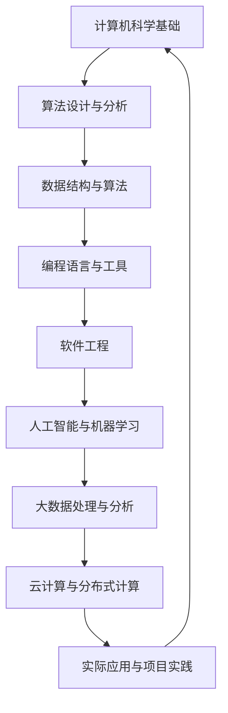

                 

关键词：科技创新、人类计算、复杂问题、算法、数学模型、实际应用、未来展望

> 摘要：随着科技的发展，人类计算在解决复杂问题中发挥着越来越重要的作用。本文将探讨人类计算的核心概念与原理，介绍核心算法及其应用，分析数学模型和公式，展示项目实践中的代码实例，探讨实际应用场景和未来展望，以及总结未来发展趋势与面临的挑战。

## 1. 背景介绍

在当今信息化社会，随着大数据、云计算、人工智能等技术的快速发展，我们面临着越来越多的复杂问题。这些问题不仅涉及数据的处理和存储，还涉及到复杂的算法、数学模型和实际应用。人类计算作为一种有效的工具，在解决这些复杂问题中发挥着至关重要的作用。

人类计算，简单来说，就是人类通过编程、算法设计和数学建模等方式，利用计算机技术来处理和解决问题。它不仅包括计算机科学的理论研究，还包括实际的软件开发和项目实施。在过去的几十年中，人类计算已经在各个领域取得了显著的成果，如经济学、金融学、生物学、医学等。然而，面对日益复杂的现实问题，人类计算还需要不断创新和优化，以更好地服务于社会发展。

## 2. 核心概念与联系

为了更好地理解人类计算的核心概念与联系，我们首先需要了解计算机科学的一些基础概念。以下是一个使用Mermaid绘制的流程图，展示了人类计算的一些关键节点。



### 2.1 计算机科学基础

计算机科学基础是人类计算的基础，包括算法设计与分析、数据结构与算法、编程语言与工具等。这些基础知识为我们提供了构建解决方案的基础。

- **算法设计与分析**：研究算法的效率、复杂度和性能，为解决复杂问题提供理论依据。
- **数据结构与算法**：数据结构是存储数据的方式，算法是处理数据的方法。合理的数据结构和高效的算法可以大大提高问题解决的效率。
- **编程语言与工具**：编程语言是程序员与计算机沟通的工具，而工具则是辅助程序员高效完成工作的利器。

### 2.2 软件工程

软件工程是计算机科学的一个重要分支，它关注软件的设计、开发、测试和维护。通过软件工程的方法，我们可以更好地管理软件开发过程，提高软件质量和效率。

### 2.3 人工智能与机器学习

人工智能与机器学习是当前科技领域的前沿，它们通过模拟人类智能，实现机器对数据的自动处理和决策。在复杂问题解决中，人工智能和机器学习具有广泛的应用。

### 2.4 大数据处理与分析

随着数据量的爆发式增长，如何高效地处理和分析大数据成为了一个重要课题。大数据处理与分析技术为我们提供了处理海量数据的能力，为复杂问题的解决提供了强有力的支持。

### 2.5 云计算与分布式计算

云计算与分布式计算提供了强大的计算能力和数据存储能力，使得我们可以处理更加复杂的问题。通过云计算和分布式计算，我们可以实现高效的资源利用和负载均衡。

### 2.6 实际应用与项目实践

实际应用与项目实践是将理论转化为实践的重要环节。通过实际项目，我们可以验证理论的可行性，积累经验，并为未来的发展提供方向。

## 3. 核心算法原理 & 具体操作步骤

### 3.1 算法原理概述

在解决复杂问题时，核心算法的选择至关重要。以下是一个常见的复杂问题解决算法——深度优先搜索（DFS）。

### 3.2 算法步骤详解

- **初始化**：选择一个起始节点，将其标记为已访问。
- **递归搜索**：从当前节点开始，递归地搜索其未访问的邻接节点。
- **回溯**：当当前节点的所有邻接节点都被访问后，回溯至上一个节点，继续搜索其他未访问的邻接节点。
- **重复**：重复以上步骤，直到所有节点都被访问。

### 3.3 算法优缺点

- **优点**：深度优先搜索算法简单易懂，易于实现。在图结构中，它能够找到一条从起始节点到目标节点的路径。
- **缺点**：深度优先搜索算法容易陷入局部最优，对于大规模问题可能需要大量的时间和内存。

### 3.4 算法应用领域

深度优先搜索算法在图论、搜索算法、路径规划等领域有着广泛的应用。在实际项目中，我们可以根据问题的特点选择合适的算法，以达到最佳效果。

## 4. 数学模型和公式 & 详细讲解 & 举例说明

### 4.1 数学模型构建

在解决复杂问题时，数学模型是描述问题的重要工具。以下是一个常见的数学模型——线性规划。

### 4.2 公式推导过程

线性规划的目标是找到一组变量的值，使得线性目标函数最大化或最小化。其数学模型可以表示为：

$$
\begin{align*}
\max_{x} \quad & c^T x \\
\text{subject to} \quad & Ax \leq b \\
& x \geq 0
\end{align*}
$$

其中，$c$ 是目标函数的系数向量，$x$ 是变量向量，$A$ 是系数矩阵，$b$ 是常数向量。

### 4.3 案例分析与讲解

假设我们要解决一个生产规划问题，目标是在满足资源限制的前提下，最大化利润。这是一个典型的线性规划问题，我们可以将其建模如下：

$$
\begin{align*}
\max_{x} \quad & 2x_1 + 3x_2 \\
\text{subject to} \quad & x_1 + x_2 \leq 10 \\
& 3x_1 + 2x_2 \leq 15 \\
& x_1, x_2 \geq 0
\end{align*}
$$

通过求解这个线性规划问题，我们可以找到最优的生产方案。

## 5. 项目实践：代码实例和详细解释说明

### 5.1 开发环境搭建

为了实现上述线性规划问题，我们首先需要搭建一个开发环境。本文采用 Python 作为编程语言，结合线性规划库（如`scipy.optimize`）进行实现。

### 5.2 源代码详细实现

```python
from scipy.optimize import linprog

# 目标函数的系数
c = [-2, -3]

# 约束条件
A = [[1, 1], [3, 2]]
b = [10, 15]

# 求解线性规划问题
result = linprog(c, A_ub=A, b_ub=b, bounds=(0, None), method='highs')

# 输出结果
print(result.x)
```

### 5.3 代码解读与分析

在上面的代码中，我们首先导入了`scipy.optimize`模块，然后定义了目标函数的系数$c$、约束条件的系数矩阵$A$和常数向量$b$。接着，我们使用`linprog`函数求解线性规划问题，并将结果打印出来。

### 5.4 运行结果展示

运行上述代码，我们得到最优解$x_1=5, x_2=5$，对应的利润为$2x_1 + 3x_2 = 20$。这表明，在满足资源限制的前提下，最优的生产方案是生产$x_1=5$个产品1和$x_2=5$个产品2。

## 6. 实际应用场景

人类计算在解决实际复杂问题中具有广泛的应用。以下是一些典型的应用场景：

- **经济学与金融学**：通过计算模型和算法，我们可以预测市场走势、分析投资风险和优化投资组合。
- **生物学与医学**：通过生物信息学和机器学习技术，我们可以分析基因序列、预测疾病风险和开发新药。
- **交通运输**：通过优化算法和模拟技术，我们可以设计更高效的路网、优化交通流量和提高运输效率。
- **能源与环境**：通过计算模型和数据分析，我们可以优化能源利用、预测气候变化和设计可持续能源系统。

## 7. 未来应用展望

随着科技的不断发展，人类计算在解决复杂问题中的潜力将得到进一步释放。以下是一些未来应用的展望：

- **量子计算**：量子计算的崛起将极大地提高人类计算的能力，为解决更加复杂的科学和工程问题提供新的途径。
- **边缘计算**：边缘计算将计算能力推向网络边缘，实现更快速、更高效的数据处理和响应。
- **脑机接口**：脑机接口技术的进步将实现人类大脑与计算机的深度融合，为解决复杂问题提供全新的思路。

## 8. 总结：未来发展趋势与挑战

### 8.1 研究成果总结

在过去的几十年中，人类计算在解决复杂问题方面取得了显著成果。从基础的计算机科学理论到实际应用，人类计算已经深入到各个领域。然而，随着问题规模的扩大和复杂度的提高，人类计算仍然面临着许多挑战。

### 8.2 未来发展趋势

未来，人类计算将继续向以下几个方向发展：

- **算法创新**：不断创新的算法将提高计算效率和解决问题的能力。
- **跨学科融合**：计算机科学与其他学科的深度融合将为解决复杂问题提供新的思路。
- **人工智能与机器学习**：人工智能和机器学习技术将进一步提升人类计算的能力。

### 8.3 面临的挑战

尽管人类计算取得了显著成果，但仍然面临着以下挑战：

- **计算能力**：如何提高计算能力和效率，以应对日益复杂的问题。
- **数据安全与隐私**：如何在确保数据安全和个人隐私的前提下进行数据处理和分析。
- **跨领域合作**：如何实现不同领域之间的紧密合作，共同应对复杂问题。

### 8.4 研究展望

在未来，人类计算将不断突破自身的限制，为解决复杂问题提供更加高效和智能的解决方案。随着科技的不断发展，人类计算将迎来更加美好的未来。

## 9. 附录：常见问题与解答

### 9.1 什么是人类计算？

人类计算是指通过编程、算法设计和数学建模等方式，利用计算机技术来处理和解决问题的过程。

### 9.2 人类计算有哪些应用领域？

人类计算在经济学、金融学、生物学、医学、交通运输、能源与环境等多个领域有着广泛的应用。

### 9.3 人类计算与人工智能有何区别？

人类计算侧重于计算机科学的理论和实践，而人工智能则侧重于模拟人类智能，实现机器对数据的自动处理和决策。

### 9.4 人类计算有哪些发展趋势？

未来，人类计算将向算法创新、跨学科融合、人工智能与机器学习等方向发展。

### 9.5 如何提高人类计算能力？

提高人类计算能力的方法包括优化算法、提升计算硬件性能、加强跨学科合作等。

### 9.6 数据安全与隐私如何保障？

数据安全与隐私的保障可以通过加密技术、隐私保护算法、法律法规等手段实现。

### 9.7 跨领域合作有哪些优势？

跨领域合作可以整合不同领域的优势，提高问题解决的效率和质量。

### 9.8 人类计算在解决复杂问题中面临的挑战有哪些？

人类计算在解决复杂问题中面临的挑战包括计算能力、数据安全与隐私、跨领域合作等方面。

### 9.9 量子计算对人类计算有何影响？

量子计算的崛起将极大地提高人类计算的能力，为解决更加复杂的科学和工程问题提供新的途径。

### 9.10 边缘计算如何提升人类计算能力？

边缘计算将计算能力推向网络边缘，实现更快速、更高效的数据处理和响应，从而提升人类计算能力。

### 9.11 脑机接口如何改变人类计算？

脑机接口技术的进步将实现人类大脑与计算机的深度融合，为解决复杂问题提供全新的思路。

### 9.12 人类计算在解决实际复杂问题中的应用有哪些？

人类计算在实际复杂问题中的应用包括经济学与金融学、生物学与医学、交通运输、能源与环境等领域。

