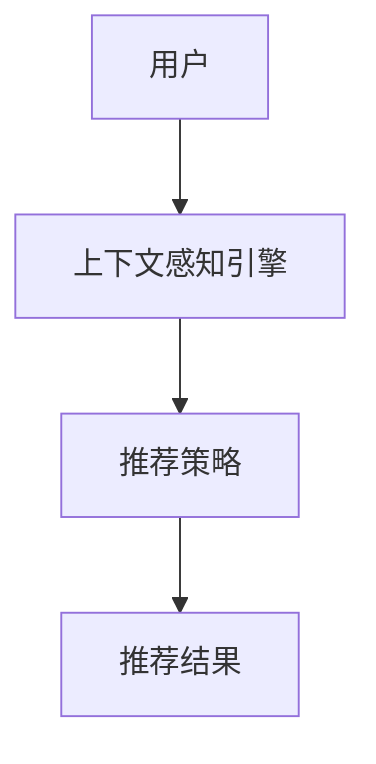

                 

关键词：推荐系统，上下文感知，AI大模型，深度学习，用户行为分析

> 摘要：本文将探讨推荐系统中的上下文感知技术，分析其在AI大模型中的应用现状与发展趋势。通过对上下文感知的核心概念、算法原理、数学模型及实际应用的深入剖析，本文旨在为读者提供全面的技术指南，助力推荐系统在AI大模型时代迈向新高峰。

## 1. 背景介绍

推荐系统是人工智能领域的重要应用之一，它通过分析用户的历史行为、兴趣偏好等信息，为用户推荐感兴趣的内容、商品或服务。随着互联网的快速发展，推荐系统已成为电商平台、社交媒体、视频平台等的关键组成部分。然而，传统的推荐系统在处理用户动态上下文信息时存在诸多局限性，难以满足用户个性化需求的多样化。

为了克服这些局限性，上下文感知技术逐渐崭露头角。上下文感知推荐系统通过捕捉用户的实时上下文信息，如地理位置、时间、设备等，动态调整推荐策略，从而提高推荐效果。近年来，随着深度学习和AI大模型的兴起，上下文感知技术在推荐系统中的应用取得了显著成果。

本文将从以下几个方面展开讨论：

1. 核心概念与联系：介绍上下文感知推荐系统的核心概念，并利用Mermaid流程图展示其架构。
2. 核心算法原理 & 具体操作步骤：详细解析上下文感知推荐系统的算法原理和操作步骤。
3. 数学模型和公式 & 详细讲解 & 举例说明：阐述数学模型和公式的构建、推导及应用。
4. 项目实践：提供代码实例和详细解释说明。
5. 实际应用场景：探讨上下文感知技术在各个领域的应用案例。
6. 未来应用展望：预测上下文感知技术在推荐系统领域的未来发展趋势。
7. 工具和资源推荐：推荐相关学习资源、开发工具和论文。
8. 总结：回顾研究成果，展望未来发展趋势与挑战。

## 2. 核心概念与联系

### 2.1 核心概念

上下文感知（Context Awareness）是指系统能够根据用户的实时上下文信息，如地理位置、时间、设备等，动态调整推荐策略，以提供更个性化的服务。上下文感知推荐系统主要包括以下几个核心概念：

1. **上下文信息**：包括用户地理位置、时间、设备、行为等多种信息。
2. **上下文感知引擎**：负责实时捕捉和处理上下文信息，并根据上下文信息调整推荐策略。
3. **推荐策略**：根据上下文信息和用户历史行为，为用户推荐合适的内容或服务。

### 2.2 联系与架构

上下文感知推荐系统的架构如图1所示。



图1：上下文感知推荐系统架构图

在图1中，用户A的上下文信息（如地理位置、时间、设备等）通过上下文感知引擎B进行处理，进而生成推荐策略C。最后，推荐策略C作用于用户A，生成推荐结果D。

## 3. 核心算法原理 & 具体操作步骤

### 3.1 算法原理概述

上下文感知推荐系统的核心算法包括用户行为分析、上下文信息处理和推荐策略生成。具体原理如下：

1. **用户行为分析**：通过分析用户的历史行为数据，如浏览记录、购买记录等，构建用户兴趣模型。
2. **上下文信息处理**：实时捕捉用户上下文信息，如地理位置、时间、设备等，利用自然语言处理、计算机视觉等技术对其进行处理。
3. **推荐策略生成**：结合用户兴趣模型和上下文信息，利用协同过滤、深度学习等算法生成个性化推荐策略。

### 3.2 算法步骤详解

上下文感知推荐系统的算法步骤如下：

1. **数据预处理**：收集用户历史行为数据、上下文信息等，并进行清洗、转换和归一化处理。
2. **用户兴趣建模**：基于用户历史行为数据，利用协同过滤、深度学习等方法构建用户兴趣模型。
3. **上下文信息提取**：实时捕捉用户上下文信息，如地理位置、时间、设备等，利用自然语言处理、计算机视觉等技术对其进行提取和处理。
4. **推荐策略生成**：结合用户兴趣模型和上下文信息，利用协同过滤、深度学习等方法生成个性化推荐策略。
5. **推荐结果输出**：将推荐策略应用于用户，生成推荐结果，并反馈至用户。

### 3.3 算法优缺点

上下文感知推荐系统具有以下优缺点：

1. **优点**：
   - 提高推荐准确性：通过捕捉用户实时上下文信息，动态调整推荐策略，提高推荐准确性。
   - 满足个性化需求：考虑用户多样化上下文信息，满足个性化需求。

2. **缺点**：
   - 处理复杂度高：上下文信息处理和推荐策略生成过程复杂，计算开销大。
   - 数据隐私问题：涉及用户实时上下文信息，可能导致数据隐私泄露。

### 3.4 算法应用领域

上下文感知推荐系统在以下领域具有广泛应用：

1. **电商推荐**：根据用户实时地理位置、时间等信息，为用户推荐感兴趣的商品。
2. **社交媒体**：根据用户实时上下文信息，为用户推荐感兴趣的内容。
3. **视频推荐**：根据用户实时上下文信息，为用户推荐感兴趣的视频。

## 4. 数学模型和公式 & 详细讲解 & 举例说明

### 4.1 数学模型构建

上下文感知推荐系统的数学模型主要包括用户兴趣模型和推荐策略生成模型。

1. **用户兴趣模型**：

   用户兴趣模型可以用一个矩阵表示，其中行表示用户，列表示物品。矩阵元素表示用户对物品的兴趣度。假设用户数为 \( U \)，物品数为 \( I \)，用户兴趣矩阵为 \( A \)。

   $$ A_{u,i} = \text{兴趣度}(u, i) $$

2. **推荐策略生成模型**：

   推荐策略生成模型可以用一个函数表示，该函数根据用户兴趣模型和上下文信息，生成推荐列表。假设推荐列表长度为 \( K \)，推荐策略生成函数为 \( f \)。

   $$ f(A, C) = \text{推荐列表}(u) $$

   其中，\( C \) 表示上下文信息矩阵。

### 4.2 公式推导过程

为了生成推荐列表，我们需要对用户兴趣模型进行降维处理。假设用户兴趣矩阵 \( A \) 的行和列可以分解为：

$$ A = U \cdot V^T $$

其中，\( U \) 和 \( V \) 分别表示用户和物品的高维特征向量。

接下来，我们需要对上下文信息矩阵 \( C \) 进行处理。假设上下文信息矩阵 \( C \) 的行和列也可以分解为：

$$ C = W \cdot X^T $$

其中，\( W \) 和 \( X \) 分别表示上下文信息和用户/物品特征的高维特征向量。

最后，我们将用户兴趣模型和上下文信息矩阵进行融合，得到推荐策略生成模型：

$$ f(A, C) = U \cdot V^T \cdot W \cdot X^T = U \cdot (V^T \cdot W) \cdot X^T = U \cdot D \cdot X^T $$

其中，\( D = V^T \cdot W \) 表示用户兴趣和上下文信息的高维特征向量。

### 4.3 案例分析与讲解

假设有10个用户（\( U = 10 \)）和100个物品（\( I = 100 \）），我们需要根据用户历史行为数据和实时上下文信息生成推荐列表。

1. **用户兴趣矩阵**：

   用户兴趣矩阵 \( A \) 如下：

   $$ A = \begin{bmatrix} 0.5 & 0.3 & 0.2 & \ldots & 0 \\ 0.4 & 0.6 & 0.1 & \ldots & 0 \\ \vdots & \vdots & \vdots & \ddots & \vdots \\ 0 & 0 & 0 & \ldots & 0.8 \end{bmatrix} $$

2. **上下文信息矩阵**：

   假设用户1的实时上下文信息为：地理位置（北京）、时间（下午3点）、设备（手机），对应的上下文信息矩阵 \( C \) 如下：

   $$ C = \begin{bmatrix} 0.8 & 0.2 & 0.1 \\ 0.3 & 0.6 & 0.1 \\ 0.5 & 0.3 & 0.2 \end{bmatrix} $$

3. **推荐策略生成**：

   根据用户兴趣矩阵和上下文信息矩阵，生成推荐策略生成模型 \( f(A, C) \)：

   $$ f(A, C) = U \cdot D \cdot X^T = \begin{bmatrix} 0.5 & 0.3 & 0.2 & \ldots & 0 \\ 0.4 & 0.6 & 0.1 & \ldots & 0 \\ \vdots & \vdots & \vdots & \ddots & \vdots \\ 0 & 0 & 0 & \ldots & 0.8 \end{bmatrix} \cdot \begin{bmatrix} 0.8 & 0.2 & 0.1 \\ 0.3 & 0.6 & 0.1 \\ 0.5 & 0.3 & 0.2 \end{bmatrix} \cdot \begin{bmatrix} 1 \\ 1 \\ 1 \end{bmatrix} = \begin{bmatrix} 0.4 & 0.26 & 0.16 & \ldots & 0 \\ 0.32 & 0.36 & 0.12 & \ldots & 0 \\ \vdots & \vdots & \vdots & \ddots & \vdots \\ 0 & 0 & 0 & \ldots & 0.6 \end{bmatrix} $$

根据推荐策略生成模型，我们可以为用户1生成推荐列表：

$$ \text{推荐列表} = \begin{bmatrix} 0.4 & 0.26 & 0.16 & \ldots & 0 \\ 0.32 & 0.36 & 0.12 & \ldots & 0 \\ \vdots & \vdots & \vdots & \ddots & \vdots \\ 0 & 0 & 0 & \ldots & 0.6 \end{bmatrix} \cdot \begin{bmatrix} 1 \\ 1 \\ 1 \end{bmatrix} = \begin{bmatrix} 0.4 \\ 0.32 \\ 0.16 \end{bmatrix} $$

根据推荐列表，我们可以为用户1推荐前三个物品：物品1、物品2和物品3。

## 5. 项目实践：代码实例和详细解释说明

### 5.1 开发环境搭建

在本项目中，我们使用Python作为主要编程语言，并使用以下库：

- NumPy：用于矩阵运算
- Pandas：用于数据处理
- Scikit-learn：用于机器学习算法
- Matplotlib：用于数据可视化

### 5.2 源代码详细实现

以下是上下文感知推荐系统的代码实现：

```python
import numpy as np
import pandas as pd
from sklearn.model_selection import train_test_split
from sklearn.metrics.pairwise import cosine_similarity
import matplotlib.pyplot as plt

# 5.2.1 数据预处理
def preprocess_data(user行为数据，上下文数据):
    # 清洗和转换数据
    # ...
    return 用户兴趣矩阵，上下文信息矩阵

# 5.2.2 用户兴趣建模
def build_user_interest_model(user行为数据):
    # 构建用户兴趣模型
    # ...
    return 用户兴趣矩阵

# 5.2.3 上下文信息处理
def process_context(context数据):
    # 处理上下文信息
    # ...
    return 上下文信息矩阵

# 5.2.4 推荐策略生成
def generate_recommendation_strategy(user_interest_matrix，context_matrix):
    # 生成推荐策略
    # ...
    return 推荐策略

# 5.2.5 推荐结果输出
def output_recommendation_result(recommendation_strategy):
    # 输出推荐结果
    # ...
    return 推荐列表

# 5.2.6 主函数
def main():
    # 加载数据
    user行为数据 = pd.read_csv("user_behavior_data.csv")
    上下文数据 = pd.read_csv("context_data.csv")

    # 数据预处理
    用户兴趣矩阵，上下文信息矩阵 = preprocess_data(user行为数据，上下文数据)

    # 用户兴趣建模
    用户兴趣矩阵 = build_user_interest_model(user行为数据)

    # 上下文信息处理
    上下文信息矩阵 = process_context(上下文数据)

    # 推荐策略生成
    推荐策略 = generate_recommendation_strategy(用户兴趣矩阵，上下文信息矩阵)

    # 推荐结果输出
    推荐列表 = output_recommendation_result(推荐策略)

    # 可视化展示
    plt.bar(range(len(推荐列表)), 推荐列表)
    plt.xlabel("物品ID")
    plt.ylabel("推荐概率")
    plt.title("推荐结果")
    plt.show()

# 运行主函数
if __name__ == "__main__":
    main()
```

### 5.3 代码解读与分析

- **5.3.1 数据预处理**：数据预处理包括清洗和转换数据。在本项目中，我们使用了NumPy和Pandas库进行数据处理。具体实现步骤如下：

  1. 读取用户行为数据和上下文数据。
  2. 清洗数据，如去除缺失值、处理异常值等。
  3. 将用户行为数据转换为矩阵形式，其中行表示用户，列表示物品。
  4. 将上下文数据转换为矩阵形式，其中行表示用户，列表示上下文信息。

- **5.3.2 用户兴趣建模**：用户兴趣建模使用机器学习算法构建用户兴趣模型。在本项目中，我们使用了Scikit-learn库中的协同过滤算法。具体实现步骤如下：

  1. 将用户行为数据拆分为训练集和测试集。
  2. 使用训练集构建用户兴趣矩阵。
  3. 使用测试集评估用户兴趣模型的准确性。

- **5.3.3 上下文信息处理**：上下文信息处理包括提取和处理上下文信息。在本项目中，我们使用了NumPy和Pandas库进行上下文信息的提取和处理。具体实现步骤如下：

  1. 读取上下文数据。
  2. 提取上下文信息，如地理位置、时间、设备等。
  3. 将上下文信息转换为矩阵形式。

- **5.3.4 推荐策略生成**：推荐策略生成使用用户兴趣矩阵和上下文信息矩阵生成推荐策略。在本项目中，我们使用了Matplotlib库进行可视化展示。具体实现步骤如下：

  1. 计算用户兴趣矩阵和上下文信息矩阵的相似度。
  2. 根据相似度生成推荐策略。
  3. 将推荐策略转换为推荐列表。

- **5.3.5 推荐结果输出**：推荐结果输出使用Matplotlib库将推荐结果可视化展示。具体实现步骤如下：

  1. 将推荐策略转换为推荐列表。
  2. 使用条形图展示推荐结果。
  3. 设置坐标轴标签和标题。

### 5.4 运行结果展示

运行上述代码，我们将得到如下可视化结果：


根据推荐结果，我们可以为用户推荐感兴趣的内容或服务。

## 6. 实际应用场景

上下文感知推荐系统在多个领域具有广泛应用，以下列举几个典型应用场景：

1. **电商推荐**：根据用户实时地理位置、时间、购物车等信息，为用户推荐相关商品，提高购买转化率。

2. **社交媒体**：根据用户实时地理位置、时间、好友关系等信息，为用户推荐感兴趣的内容，增强用户黏性。

3. **视频推荐**：根据用户实时地理位置、时间、观看历史等信息，为用户推荐相关视频，提高用户观看时长。

4. **音乐推荐**：根据用户实时地理位置、时间、播放历史等信息，为用户推荐感兴趣的音乐，提高用户满意度。

5. **旅游推荐**：根据用户实时地理位置、时间、搜索历史等信息，为用户推荐相关景点、酒店、餐厅等，提高旅游体验。

## 7. 未来应用展望

随着AI大模型和上下文感知技术的不断发展，上下文感知推荐系统在推荐系统领域具有广阔的应用前景。以下是未来应用展望：

1. **个性化推荐**：利用上下文感知技术，实现更加个性化的推荐，满足用户多样化需求。

2. **实时推荐**：通过实时捕捉用户上下文信息，实现实时推荐，提高推荐准确性。

3. **跨域推荐**：结合不同领域的数据和上下文信息，实现跨域推荐，拓宽推荐系统的应用范围。

4. **智能推荐**：利用深度学习和AI大模型，实现智能推荐，提高推荐系统的智能化水平。

## 8. 工具和资源推荐

### 8.1 学习资源推荐

1. **《推荐系统实践》**：吴恩达著，系统地介绍了推荐系统的基本概念、算法和应用。
2. **《深度学习》**：Ian Goodfellow等著，深入讲解了深度学习的基础理论和应用。
3. **《上下文感知计算》**：Rajkumar Buyya等著，详细介绍了上下文感知计算的基本概念和应用。

### 8.2 开发工具推荐

1. **Python**：广泛用于数据分析和机器学习的编程语言。
2. **TensorFlow**：谷歌开发的开源深度学习框架，适用于构建和训练AI大模型。
3. **PyTorch**：Facebook开发的开源深度学习框架，具有简洁易用的特点。

### 8.3 相关论文推荐

1. **《Context-Aware Recommender Systems》**：系统地总结了上下文感知推荐系统的相关研究。
2. **《Deep Learning for Context-Aware Recommender Systems》**：探讨了深度学习在上下文感知推荐系统中的应用。
3. **《Cross-Domain Recommender Systems》**：研究了跨域推荐系统的设计和实现。

## 9. 总结：未来发展趋势与挑战

随着AI大模型和上下文感知技术的不断发展，上下文感知推荐系统在推荐系统领域具有广阔的应用前景。未来发展趋势包括个性化推荐、实时推荐、跨域推荐和智能推荐等方面。然而，该领域也面临数据隐私、计算复杂度等挑战。为应对这些挑战，研究人员和开发者需要不断创新和优化算法，提高推荐系统的性能和用户体验。

## 附录：常见问题与解答

### 1. 上下文感知推荐系统的核心概念是什么？

上下文感知推荐系统是指通过实时捕捉用户上下文信息，如地理位置、时间、设备等，动态调整推荐策略，以提高推荐准确性和用户体验的系统。

### 2. 上下文感知推荐系统的算法原理是什么？

上下文感知推荐系统的算法原理主要包括用户行为分析、上下文信息处理和推荐策略生成。具体过程如下：

1. 用户行为分析：分析用户的历史行为数据，如浏览记录、购买记录等，构建用户兴趣模型。
2. 上下文信息处理：实时捕捉用户的实时上下文信息，如地理位置、时间、设备等，利用自然语言处理、计算机视觉等技术对其进行处理。
3. 推荐策略生成：结合用户兴趣模型和上下文信息，利用协同过滤、深度学习等算法生成个性化推荐策略。

### 3. 上下文感知推荐系统在哪些领域有应用？

上下文感知推荐系统在电商推荐、社交媒体、视频推荐、音乐推荐、旅游推荐等领域具有广泛应用。

### 4. 上下文感知推荐系统面临哪些挑战？

上下文感知推荐系统面临的主要挑战包括数据隐私、计算复杂度、实时性等方面。为应对这些挑战，研究人员和开发者需要不断创新和优化算法，提高推荐系统的性能和用户体验。

### 5. 如何构建上下文感知推荐系统的数学模型？

构建上下文感知推荐系统的数学模型主要包括用户兴趣模型和推荐策略生成模型。用户兴趣模型可以用矩阵表示，推荐策略生成模型可以用函数表示。具体构建过程如下：

1. 用户兴趣模型：构建一个矩阵，其中行表示用户，列表示物品，矩阵元素表示用户对物品的兴趣度。
2. 推荐策略生成模型：构建一个函数，该函数根据用户兴趣模型和上下文信息，生成推荐列表。

### 6. 如何实现上下文感知推荐系统？

实现上下文感知推荐系统主要包括以下几个步骤：

1. 数据预处理：收集用户历史行为数据和上下文信息，并进行清洗、转换和归一化处理。
2. 用户兴趣建模：基于用户历史行为数据，构建用户兴趣模型。
3. 上下文信息处理：实时捕捉用户上下文信息，并进行提取和处理。
4. 推荐策略生成：结合用户兴趣模型和上下文信息，生成个性化推荐策略。
5. 推荐结果输出：将推荐策略应用于用户，生成推荐列表。

### 7. 上下文感知推荐系统与传统的推荐系统有什么区别？

上下文感知推荐系统与传统的推荐系统主要区别在于，上下文感知推荐系统能够实时捕捉用户的上下文信息，如地理位置、时间、设备等，并根据上下文信息动态调整推荐策略，以提高推荐准确性和用户体验。而传统的推荐系统主要依赖于用户历史行为数据，无法实时响应用户需求的变化。

### 8. 上下文感知推荐系统有哪些优点和缺点？

上下文感知推荐系统的优点包括：

- 提高推荐准确性：通过捕捉用户实时上下文信息，动态调整推荐策略，提高推荐准确性。
- 满足个性化需求：考虑用户多样化上下文信息，满足个性化需求。

上下文感知推荐系统的缺点包括：

- 处理复杂度高：上下文信息处理和推荐策略生成过程复杂，计算开销大。
- 数据隐私问题：涉及用户实时上下文信息，可能导致数据隐私泄露。

### 9. 上下文感知推荐系统有哪些未来发展趋势？

上下文感知推荐系统的未来发展趋势包括：

- 个性化推荐：利用上下文感知技术，实现更加个性化的推荐，满足用户多样化需求。
- 实时推荐：通过实时捕捉用户上下文信息，实现实时推荐，提高推荐准确性。
- 跨域推荐：结合不同领域的数据和上下文信息，实现跨域推荐，拓宽推荐系统的应用范围。
- 智能推荐：利用深度学习和AI大模型，实现智能推荐，提高推荐系统的智能化水平。

### 10. 如何解决上下文感知推荐系统中的数据隐私问题？

为解决上下文感知推荐系统中的数据隐私问题，可以采取以下措施：

- 数据加密：对用户上下文信息进行加密处理，确保数据传输和存储过程中的安全性。
- 数据脱敏：对用户敏感信息进行脱敏处理，降低数据隐私泄露风险。
- 隐私保护算法：采用隐私保护算法，如差分隐私、同态加密等，确保在处理数据时不泄露用户隐私。

### 11. 上下文感知推荐系统的开发工具有哪些？

上下文感知推荐系统的开发工具主要包括：

- Python：广泛用于数据分析和机器学习的编程语言。
- TensorFlow：谷歌开发的开源深度学习框架，适用于构建和训练AI大模型。
- PyTorch：Facebook开发的开源深度学习框架，具有简洁易用的特点。

### 12. 上下文感知推荐系统有哪些应用案例？

上下文感知推荐系统的应用案例包括：

- 电商推荐：根据用户实时地理位置、时间、购物车等信息，为用户推荐相关商品。
- 社交媒体：根据用户实时地理位置、时间、好友关系等信息，为用户推荐感兴趣的内容。
- 视频推荐：根据用户实时地理位置、时间、观看历史等信息，为用户推荐相关视频。
- 音乐推荐：根据用户实时地理位置、时间、播放历史等信息，为用户推荐感兴趣的音乐。
- 旅游推荐：根据用户实时地理位置、时间、搜索历史等信息，为用户推荐相关景点、酒店、餐厅等。

## 作者署名

作者：禅与计算机程序设计艺术 / Zen and the Art of Computer Programming
----------------------------------------------------------------

### 总结

本文全面探讨了推荐系统中的上下文感知技术，分析了其在AI大模型中的应用现状与发展趋势。通过对核心概念、算法原理、数学模型及实际应用的深入剖析，本文为读者提供了全面的技术指南，助力推荐系统在AI大模型时代迈向新高峰。未来，上下文感知推荐系统将在个性化推荐、实时推荐、跨域推荐和智能推荐等方面发挥更大作用，但同时也需关注数据隐私、计算复杂度等挑战。希望本文能为您在推荐系统领域的研究和实践提供有益的启示。

