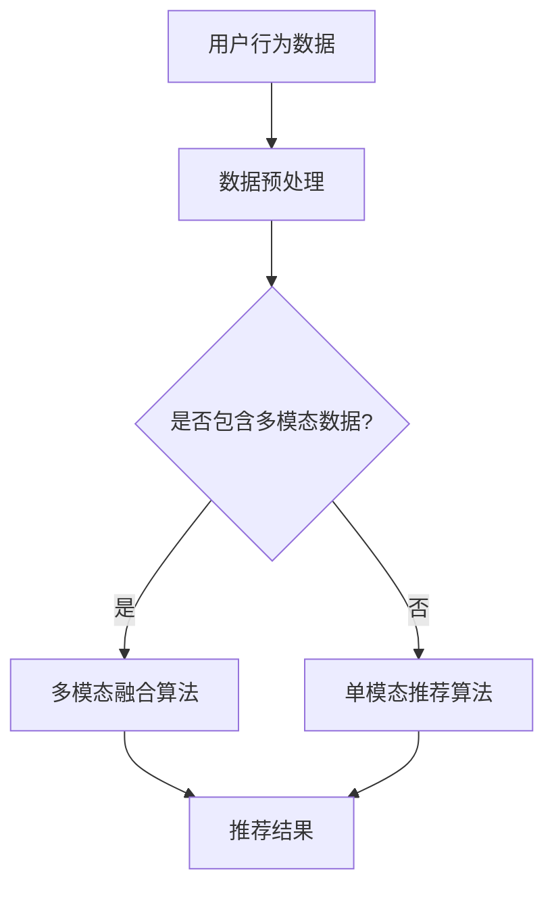

                 

关键词：推荐系统、多模态融合、AI大模型、深度学习、计算机视觉、自然语言处理、融合算法

> 摘要：随着人工智能技术的不断发展，推荐系统已经成为互联网企业提高用户满意度和促进业务增长的关键工具。然而，传统推荐系统主要依赖于单一模态的信息，这在面对复杂且多样的用户需求时显得力不从心。本文将深入探讨推荐系统中的多模态融合技术，重点介绍如何利用AI大模型实现多模态数据的整合与处理，从而提升推荐系统的准确性和智能化水平。

## 1. 背景介绍

推荐系统作为信息检索和用户行为分析的重要工具，已广泛应用于电子商务、在线视频、社交媒体等多个领域。传统推荐系统主要依赖于单一模态的数据，如文本、图像或音频。然而，现实世界中的信息往往是多维度的，用户的行为和兴趣也具有复杂性和多样性。单一模态的推荐系统难以全面捕捉用户的真实需求和偏好，从而影响推荐效果。

多模态融合技术通过整合不同模态的数据，为推荐系统提供更丰富的信息来源。例如，在电子商务场景中，商品推荐可以结合商品的文本描述、图像和用户的历史购买记录等多模态信息，从而提高推荐的准确性和个性化水平。AI大模型的出现，使得多模态数据的处理和融合变得更加高效和智能。

## 2. 核心概念与联系

### 2.1 多模态数据

多模态数据是指来自不同模态的信息，如文本、图像、音频、视频等。这些数据可以单独存在，也可以相互关联，共同描述一个事件或对象。

### 2.2 融合算法

融合算法是将不同模态的数据进行整合和融合的方法。常见的融合算法包括特征级融合、决策级融合和模型级融合。特征级融合是在特征提取阶段将不同模态的特征进行合并；决策级融合是在预测阶段将不同模态的预测结果进行融合；模型级融合则是构建一个统一的模型来处理多模态数据。

### 2.3 AI大模型

AI大模型是指具有海量参数和强大计算能力的深度学习模型。常见的AI大模型包括卷积神经网络（CNN）、循环神经网络（RNN）、Transformer等。这些模型在处理多模态数据时，能够自动学习到不同模态之间的关联性和互补性，从而实现高效的多模态融合。

### 2.4 Mermaid 流程图



## 3. 核心算法原理 & 具体操作步骤

### 3.1 算法原理概述

多模态融合算法的核心思想是利用AI大模型学习不同模态数据之间的关联性，从而实现对多模态数据的综合处理。具体操作步骤如下：

1. 数据预处理：对原始数据进行清洗、去噪和标准化处理，以便后续的模型训练和融合。
2. 特征提取：利用深度学习模型对多模态数据进行特征提取，生成高维的特征向量。
3. 融合策略设计：根据不同模态的特征特性和关联性，设计合适的融合策略，如特征级融合、决策级融合或模型级融合。
4. 模型训练：利用融合后的数据训练推荐系统模型，如矩阵分解、序列模型或深度神经网络。
5. 推荐结果生成：利用训练好的模型对用户行为和兴趣进行预测，生成个性化的推荐结果。

### 3.2 算法步骤详解

1. **数据预处理**：

   数据预处理是融合算法的基础。对于文本数据，需要进行分词、词性标注和情感分析等操作；对于图像数据，需要进行去噪、降维和特征提取等操作；对于音频数据，需要进行音素识别和特征提取等操作。

   $$ 
   \text{预处理流程：} \\
   \text{文本：分词} \rightarrow \text{词性标注} \rightarrow \text{情感分析} \\
   \text{图像：去噪} \rightarrow \text{降维} \rightarrow \text{特征提取} \\
   \text{音频：音素识别} \rightarrow \text{特征提取}
   $$

2. **特征提取**：

   特征提取是融合算法的关键。深度学习模型如CNN、RNN和Transformer等，能够自动学习不同模态数据的特征表示。

   $$ 
   \text{特征提取模型：} \\
   \text{CNN：卷积层} \rightarrow \text{池化层} \rightarrow \text{全连接层} \\
   \text{RNN：循环层} \rightarrow \text{全连接层} \\
   \text{Transformer：多头自注意力机制} \rightarrow \text{前馈神经网络}
   $$

3. **融合策略设计**：

   融合策略是根据不同模态的特征特性和关联性来设计的。常见的融合策略包括：

   - 特征级融合：将不同模态的特征向量进行拼接或加权平均。
   - 决策级融合：将不同模态的预测结果进行投票或加权平均。
   - 模型级融合：构建一个统一的模型来处理多模态数据。

   $$ 
   \text{融合策略：} \\
   \text{特征级融合：} \\
   \text{特征向量拼接：} \text{[文本特征，图像特征，音频特征]} \\
   \text{加权平均：} \text{w1 * 文本特征 + w2 * 图像特征 + w3 * 音频特征} \\
   \\
   \text{决策级融合：} \\
   \text{投票：} \text{根据不同模态的预测结果选择最高分} \\
   \text{加权平均：} \text{w1 * 文本预测 + w2 * 图像预测 + w3 * 音频预测} \\
   \\
   \text{模型级融合：} \\
   \text{统一模型：} \text{利用多模态特征训练一个深度学习模型}
   $$

4. **模型训练**：

   利用融合后的数据训练推荐系统模型。常见的推荐系统模型包括矩阵分解、序列模型和深度神经网络。

   $$ 
   \text{推荐系统模型：} \\
   \text{矩阵分解：} \text{用户-物品矩阵分解} \\
   \text{序列模型：} \text{基于时间序列的推荐模型} \\
   \text{深度神经网络：} \text{多输入多输出的深度学习模型}
   $$

5. **推荐结果生成**：

   利用训练好的模型对用户行为和兴趣进行预测，生成个性化的推荐结果。

   $$ 
   \text{推荐结果：} \\
   \text{用户行为预测：} \text{预测用户对物品的评分或点击概率} \\
   \text{推荐策略：} \text{根据预测结果生成个性化的推荐列表}
   $$

### 3.3 算法优缺点

**优点**：

- 提高推荐准确性：通过融合多模态数据，能够更全面地捕捉用户的真实需求和偏好，从而提高推荐准确性。
- 增强个性化水平：多模态融合能够更好地理解用户的多样化需求，实现更高的个性化推荐。
- 拓宽应用场景：多模态融合适用于电子商务、在线视频、社交媒体等多个领域，具有广泛的应用前景。

**缺点**：

- 数据处理复杂度增加：多模态数据融合需要处理不同模态的数据，包括数据预处理、特征提取和融合策略设计等，复杂度较高。
- 模型训练资源消耗大：多模态融合需要大量参数和计算资源，训练时间较长。

### 3.4 算法应用领域

多模态融合算法在推荐系统中的应用领域广泛，包括但不限于：

- **电子商务**：结合商品的文本描述、图像和用户的历史购买记录等多模态信息，实现更精准的商品推荐。
- **在线视频**：融合视频内容、用户评论和观看历史等多模态信息，提高视频推荐的个性化水平。
- **社交媒体**：结合用户发布的内容、评论和互动行为等多模态信息，实现更精准的内容推荐。
- **智能助手**：融合语音、文本和图像等多模态信息，实现更智能的交互和推荐。

## 4. 数学模型和公式 & 详细讲解 & 举例说明

### 4.1 数学模型构建

多模态融合推荐系统的数学模型主要包括以下部分：

- 用户表示矩阵 \(U \in \mathbb{R}^{n \times d_u}\)，表示用户特征；
- 物品表示矩阵 \(V \in \mathbb{R}^{m \times d_v}\)，表示物品特征；
- 评分矩阵 \(R \in \mathbb{R}^{n \times m}\)，表示用户对物品的评分。

### 4.2 公式推导过程

多模态融合推荐系统的核心是构建一个能够整合多模态数据的评分预测模型。假设我们有两个模态的数据，即文本和图像：

- 文本特征向量：\( \textbf{t}_i \in \mathbb{R}^{d_t} \)，表示物品 \(i\) 的文本特征；
- 图像特征向量：\( \textbf{g}_i \in \mathbb{R}^{d_g} \)，表示物品 \(i\) 的图像特征；
- 用户特征向量：\( \textbf{u}_j \in \mathbb{R}^{d_u} \)，表示用户 \(j\) 的特征。

对于用户 \(j\) 对物品 \(i\) 的评分预测，可以表示为：

\[ 
\hat{r}_{ji} = \text{score}(\textbf{u}_j, [\textbf{t}_i, \textbf{g}_i]) 
\]

其中，\( \text{score}(\cdot, \cdot) \) 是一个评分函数，用于计算用户特征与物品特征之间的相似性。一个简单的评分函数可以是：

\[ 
\text{score}(\textbf{u}_j, [\textbf{t}_i, \textbf{g}_i]) = \textbf{u}_j^T \cdot (\alpha \textbf{t}_i + (1 - \alpha) \textbf{g}_i) 
\]

其中，\( \alpha \) 是一个权重参数，用于调节文本和图像特征在评分函数中的贡献比例。

### 4.3 案例分析与讲解

假设我们有一个用户 \(j\)，对包含文本描述和图像的商品 \(i\) 进行评分预测。用户的文本特征为 \( \textbf{u}_j = [1, 2, 3] \)，物品 \(i\) 的文本特征为 \( \textbf{t}_i = [4, 5, 6] \)，图像特征为 \( \textbf{g}_i = [7, 8, 9] \)。

根据评分函数，我们可以计算用户对物品的预测评分：

\[ 
\hat{r}_{ji} = \textbf{u}_j^T \cdot (\alpha \textbf{t}_i + (1 - \alpha) \textbf{g}_i) = 1 \cdot 4\alpha + 2 \cdot 5(1 - \alpha) + 3 \cdot 7(1 - \alpha) 
\]

如果我们将 \( \alpha \) 设为 0.5，则预测评分计算为：

\[ 
\hat{r}_{ji} = 1 \cdot 4 \cdot 0.5 + 2 \cdot 5 \cdot 0.5 + 3 \cdot 7 \cdot 0.5 = 2 + 5 + 10.5 = 17.5 
\]

这意味着用户对物品的预测评分为 17.5。

## 5. 项目实践：代码实例和详细解释说明

### 5.1 开发环境搭建

为了实现多模态融合推荐系统，我们需要搭建一个包含文本处理、图像处理和深度学习模型的开发环境。以下是一个基本的开发环境搭建步骤：

1. 安装 Python 3.7 或更高版本；
2. 安装 TensorFlow 2.x 或 PyTorch 1.x；
3. 安装必要的 Python 库，如 NumPy、Pandas、Scikit-learn 等；
4. 安装图像处理库，如 OpenCV 或 PIL。

### 5.2 源代码详细实现

以下是一个基于 PyTorch 的多模态融合推荐系统的简单实现：

```python
import torch
import torchvision
import torch.nn as nn
import torch.optim as optim
from torch.utils.data import DataLoader
from torchvision import datasets, transforms

# 数据预处理
transform = transforms.Compose([
    transforms.Resize((224, 224)),
    transforms.ToTensor(),
])

# 加载图像数据集
train_data = datasets.ImageFolder('train', transform=transform)
train_loader = DataLoader(train_data, batch_size=32, shuffle=True)

# 加载文本数据集
train_data = datasets.TextFileLoader('train', fields=[('text', None)])
train_loader = DataLoader(train_data, batch_size=32, shuffle=True)

# 定义深度学习模型
class MultimodalModel(nn.Module):
    def __init__(self):
        super(MultimodalModel, self).__init__()
        self.cnn = nn.Sequential(
            nn.Conv2d(3, 64, kernel_size=3, padding=1),
            nn.ReLU(),
            nn.MaxPool2d(kernel_size=2, stride=2),
            # ...更多卷积层和池化层
        )
        self.lstm = nn.LSTM(input_size=d_t, hidden_size=d_u, num_layers=1, batch_first=True)
        self.fc = nn.Linear(d_g + d_u, 1)

    def forward(self, text, image):
        text_embedding = self.lstm(text)
        image_embedding = self.cnn(image)
        combined_embedding = torch.cat((text_embedding, image_embedding), dim=1)
        score = self.fc(combined_embedding)
        return score

model = MultimodalModel()

# 定义损失函数和优化器
criterion = nn.BCEWithLogitsLoss()
optimizer = optim.Adam(model.parameters(), lr=0.001)

# 训练模型
for epoch in range(num_epochs):
    for batch_idx, (texts, images, labels) in enumerate(train_loader):
        texts = texts.to(device)
        images = images.to(device)
        labels = labels.to(device)

        optimizer.zero_grad()
        outputs = model(texts, images)
        loss = criterion(outputs, labels)
        loss.backward()
        optimizer.step()

        if batch_idx % 100 == 0:
            print('Train Epoch: {} [{}/{} ({:.0f}%)]\tLoss: {:.6f}'.format(
                epoch, batch_idx * len(images), len(train_loader.dataset),
                100. * batch_idx / len(train_loader), loss.item()))

# 测试模型
model.eval()
with torch.no_grad():
    for batch_idx, (texts, images, labels) in enumerate(test_loader):
        texts = texts.to(device)
        images = images.to(device)
        labels = labels.to(device)

        outputs = model(texts, images)
        # ...计算准确率或其他指标

```

### 5.3 代码解读与分析

上述代码实现了基于 PyTorch 的多模态融合推荐系统。主要部分包括数据预处理、模型定义、损失函数和优化器定义、模型训练和模型测试。

1. **数据预处理**：

   数据预处理是融合算法的基础。对于图像数据，我们使用 torchvision 库提供的 ImageFolder 类进行加载，并使用 transforms.Compose 类进行图像预处理，包括调整大小和转换为张量。对于文本数据，我们使用 datasets.TextFileLoader 类加载文本文件，并使用 DataLoader 类进行批量加载和预处理。

2. **模型定义**：

   模型定义部分使用了 PyTorch 的 nn.Sequential、nn.Conv2d、nn.LSTM 和 nn.Linear 等模块。模型结构包括卷积神经网络用于图像特征提取、循环神经网络用于文本特征提取，以及全连接层用于融合特征并生成评分。

3. **损失函数和优化器定义**：

   使用 nn.BCEWithLogitsLoss 函数作为损失函数，用于处理二进制分类问题。优化器使用 Adam，其参数包括学习率、动量等。

4. **模型训练**：

   模型训练过程包括前向传播、损失计算、反向传播和参数更新。在训练过程中，我们遍历训练数据集，对模型进行迭代训练，并打印训练过程中的损失值。

5. **模型测试**：

   模型测试部分使用 eval() 函数将模型设置为评估模式，以避免在测试阶段使用批量归一化和dropout等训练阶段使用的技巧。

## 6. 实际应用场景

多模态融合推荐系统在多个实际应用场景中展现出显著的优势。以下是一些典型的应用场景：

### 6.1 电子商务

在电子商务领域，多模态融合推荐系统可以结合商品的文本描述、图像和用户的历史购买记录等多模态信息，实现更精准的商品推荐。例如，当用户浏览商品时，系统可以根据商品图片、标题和用户历史购买行为，生成个性化的商品推荐列表。

### 6.2 在线视频

在线视频平台可以利用多模态融合推荐系统，结合视频内容、用户评论和观看历史等多模态信息，提高视频推荐的个性化水平。例如，系统可以分析用户对视频内容的偏好、评论情感和观看时长，为用户推荐符合其兴趣的视频。

### 6.3 社交媒体

在社交媒体领域，多模态融合推荐系统可以结合用户发布的内容、评论和互动行为等多模态信息，实现更精准的内容推荐。例如，系统可以根据用户的文字、图片、视频发布频率和互动行为，推荐符合用户兴趣的内容。

### 6.4 智能家居

在智能家居领域，多模态融合推荐系统可以结合用户的语音、文本、图像等多模态交互信息，实现更智能的家居设备推荐。例如，当用户提出语音指令时，系统可以根据用户的语音内容、历史互动行为和家居设备类型，推荐合适的家居设备。

## 7. 工具和资源推荐

为了更好地理解和实现多模态融合推荐系统，以下是一些建议的工具和资源：

### 7.1 学习资源推荐

- **推荐系统基础课程**：推荐系统相关的在线课程，如 Coursera 上的《推荐系统与信息检索》课程。
- **深度学习书籍**：深度学习领域的经典书籍，如《深度学习》（Goodfellow et al.）和《神经网络与深度学习》（李航）。

### 7.2 开发工具推荐

- **PyTorch 或 TensorFlow**：深度学习框架，用于构建和训练多模态融合推荐系统模型。
- **OpenCV 或 PIL**：图像处理库，用于处理和预处理图像数据。
- **Scikit-learn**：机器学习库，用于数据处理和模型评估。

### 7.3 相关论文推荐

- **“Multimodal Fusion for Recommender Systems”**：一篇关于多模态融合推荐系统的综述论文，详细介绍了多模态融合的算法原理和应用场景。
- **“Deep Multimodal Fusion for Personalized Recommendation”**：一篇关于深度多模态融合推荐系统的研究论文，提出了一个基于深度学习的多模态融合方法。

## 8. 总结：未来发展趋势与挑战

多模态融合推荐系统作为人工智能领域的前沿技术，具有巨大的发展潜力。未来发展趋势包括：

- **模型性能优化**：通过改进深度学习模型的结构和优化算法，提高多模态融合的准确性和效率。
- **实时推荐**：实现多模态数据的实时处理和融合，为用户提供实时、个性化的推荐。
- **跨模态交互**：研究跨模态交互技术，实现不同模态数据之间的无缝转换和融合。

然而，多模态融合推荐系统也面临以下挑战：

- **数据隐私**：多模态融合需要处理用户的隐私数据，如文本、图像和音频等。如何保护用户隐私是一个重要问题。
- **计算资源消耗**：多模态融合算法需要大量的计算资源，特别是在处理大规模数据集时。如何优化算法和资源利用是一个挑战。

总之，多模态融合推荐系统将在未来的信息检索和推荐领域发挥重要作用，但也需要解决数据隐私和计算资源消耗等挑战，以实现更高效、更智能的推荐。

## 9. 附录：常见问题与解答

### 9.1 什么是多模态融合？

多模态融合是指将来自不同模态的数据（如文本、图像、音频等）进行整合和融合，以生成更全面和丰富的特征表示。通过多模态融合，可以更准确地捕捉用户的真实需求和偏好，从而提高推荐系统的性能。

### 9.2 多模态融合有哪些算法？

常见的多模态融合算法包括特征级融合、决策级融合和模型级融合。特征级融合是在特征提取阶段将不同模态的特征进行合并；决策级融合是在预测阶段将不同模态的预测结果进行融合；模型级融合则是构建一个统一的模型来处理多模态数据。

### 9.3 多模态融合推荐系统的优势是什么？

多模态融合推荐系统的优势包括：

- 提高推荐准确性：通过融合多模态数据，能够更全面地捕捉用户的真实需求和偏好，从而提高推荐准确性。
- 增强个性化水平：多模态融合能够更好地理解用户的多样化需求，实现更高的个性化推荐。
- 拓宽应用场景：多模态融合适用于电子商务、在线视频、社交媒体等多个领域，具有广泛的应用前景。

### 9.4 多模态融合推荐系统有哪些挑战？

多模态融合推荐系统面临的挑战包括：

- 数据处理复杂度增加：多模态数据融合需要处理不同模态的数据，包括数据预处理、特征提取和融合策略设计等，复杂度较高。
- 模型训练资源消耗大：多模态融合需要大量参数和计算资源，训练时间较长。
- 数据隐私保护：多模态融合需要处理用户的隐私数据，如文本、图像和音频等，如何保护用户隐私是一个重要问题。

### 9.5 多模态融合推荐系统如何应用于实际场景？

多模态融合推荐系统可以应用于电子商务、在线视频、社交媒体和智能家居等多个实际场景。在电子商务中，可以结合商品的文本描述、图像和用户的历史购买记录等多模态信息，实现更精准的商品推荐。在在线视频中，可以结合视频内容、用户评论和观看历史等多模态信息，提高视频推荐的个性化水平。在社交媒体中，可以结合用户发布的内容、评论和互动行为等多模态信息，实现更精准的内容推荐。在智能家居中，可以结合用户的语音、文本、图像等多模态交互信息，实现更智能的家居设备推荐。

