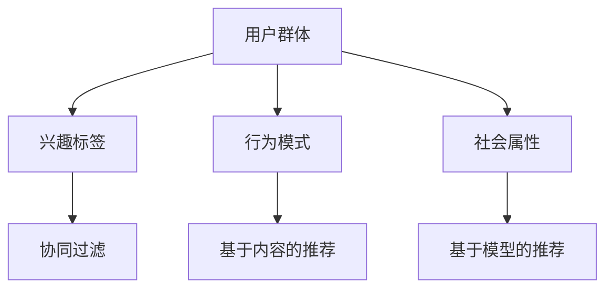
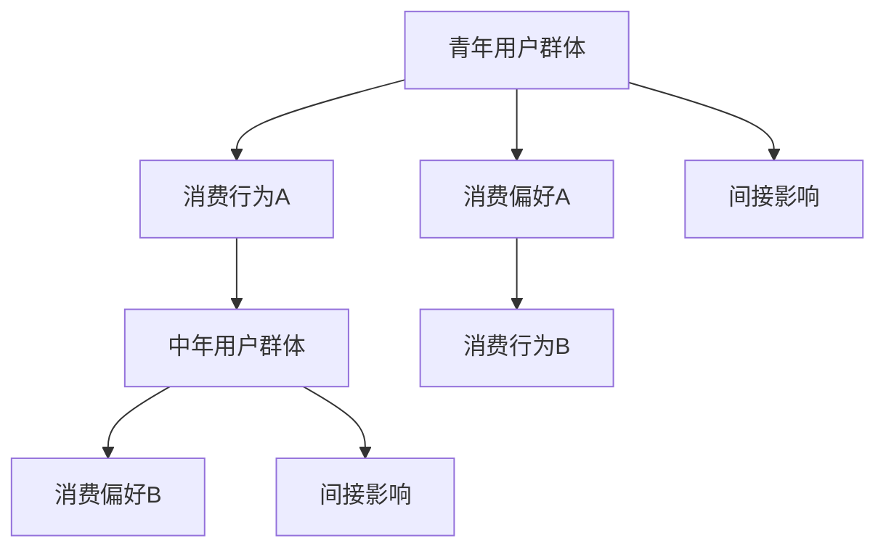
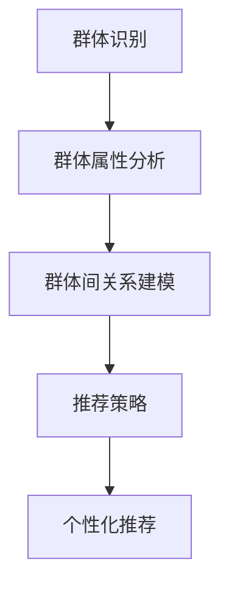

                 

推荐系统是当今信息过载时代下，为用户精准推送个性化内容的关键技术。然而，随着用户群体的多样性和个性化需求的不断增长，传统的个性化推荐方法已经无法满足日益复杂的推荐需求。群体推荐技术应运而生，它不仅考虑个体的兴趣偏好，还关注群体的共同特点和潜在关联，从而提供更具针对性和代表性的推荐结果。

本文将深入探讨群体推荐技术的核心概念、算法原理、数学模型及其在实际应用中的实现方法。希望通过本文的阐述，读者能够对群体推荐技术有一个全面而深刻的理解，并为相关领域的研究和应用提供有益的参考。

> 关键词：推荐系统、群体推荐、个性化推荐、数学模型、算法实现

## 1. 背景介绍

推荐系统（Recommender Systems）起源于20世纪90年代，随着互联网的普及和大数据技术的发展而迅速崛起。推荐系统通过分析用户的历史行为和偏好，预测用户可能感兴趣的内容，从而实现个性化推荐。传统的推荐系统主要依赖于用户的历史行为数据，如浏览记录、购买记录等，通过构建用户与项目之间的关联矩阵来进行推荐。

然而，在现实世界中，用户群体往往是多元化的，个体之间存在显著差异。例如，在社交媒体平台上，不同的用户可能有着截然不同的兴趣和偏好。此外，用户行为数据也不总是完备的，某些用户可能不会留下足够多的历史记录，这使得传统的个性化推荐方法在面对大规模用户群体时显得力不从心。

为了解决这些问题，研究者提出了群体推荐（Group-based Recommender Systems）的概念。群体推荐不仅考虑个体的兴趣和偏好，还关注群体内部成员之间的相似性和潜在关联，从而提供更加精准和有代表性的推荐结果。群体推荐技术在电子商务、社交媒体、在线教育等领域具有广泛的应用前景，它能够提升用户体验、增加用户粘性，甚至帮助企业实现更高的收益。

本文将首先介绍群体推荐技术的核心概念，包括群体定义、群体属性分析、群体间关系建模等。随后，我们将深入探讨群体推荐技术的算法原理，包括协同过滤、基于内容的推荐、基于模型的推荐方法等。接下来，我们将介绍群体推荐的数学模型，包括群体相似度计算、群体兴趣建模等。文章还将通过具体的项目实践，展示群体推荐技术的实际应用方法。最后，我们将讨论群体推荐技术在实际应用中的挑战和未来发展趋势。

## 2. 核心概念与联系

### 2.1 群体的定义

在群体推荐技术中，群体（Group）是基本的概念单元。群体可以被定义为具有共同特征或共同利益的用户集合。这些特征或利益可以是显式的，如用户在某个兴趣小组中的共同参与，也可以是隐式的，如通过分析用户行为数据发现的相似兴趣点。群体的定义对于推荐系统的效果至关重要，因为它直接影响到推荐结果的准确性和代表性。

### 2.2 群体属性分析

群体属性分析是指对群体内部成员的共同特征进行量化分析。这些特征可以是用户的兴趣爱好、行为模式、社会属性等。通过分析群体属性，我们可以更好地理解群体成员之间的相似性和差异性，从而为群体推荐提供有力的支持。

例如，在社交媒体平台上，我们可以通过分析用户发布的帖子、点赞、评论等行为，提取出用户的兴趣标签。这些兴趣标签可以作为群体属性，用于后续的推荐算法。



### 2.3 群体间关系建模

群体间关系建模是指对群体之间的相互作用和影响进行建模。群体之间的关系可以是直接的，如不同兴趣小组之间的用户互动，也可以是间接的，如用户在不同群体中的角色转换。通过建立群体间的关系模型，我们可以更好地理解群体之间的动态变化和相互影响，从而为群体推荐提供更深入的洞察。

例如，在一个电商平台上，不同的用户群体可能分别代表不同的消费群体，如青年用户群体、中年用户群体等。这些群体之间的消费行为和偏好可能存在显著差异，通过分析这些差异，可以为每个群体提供更有针对性的推荐。



### 2.4 群体推荐技术的核心概念

群体推荐技术的核心概念包括群体识别、群体属性分析、群体间关系建模和推荐策略。群体识别是指通过数据挖掘技术从大规模用户数据中识别出具有相似特征的群体。群体属性分析是指对群体内部成员的共同特征进行量化分析。群体间关系建模是指对群体之间的相互作用和影响进行建模。推荐策略是指基于群体属性和群体间关系，为用户或群体提供个性化的推荐结果。



通过上述核心概念的联系，我们可以看到群体推荐技术是如何从数据中提取有用信息，并通过分析群体属性和群体间关系，为用户提供精准的推荐结果。这种多层次、多维度的分析方式，使得群体推荐技术能够更好地应对复杂多变的用户需求。

## 3. 核心算法原理 & 具体操作步骤

### 3.1 算法原理概述

群体推荐技术的核心算法主要包括协同过滤、基于内容的推荐和基于模型的推荐方法。这些方法各有优缺点，适用于不同的推荐场景。

**协同过滤**（Collaborative Filtering）是一种通过分析用户与项目之间的相似性来进行推荐的方法。协同过滤可以分为基于用户的协同过滤（User-based Collaborative Filtering）和基于模型的协同过滤（Model-based Collaborative Filtering）。

- **基于用户的协同过滤**：该方法通过计算用户之间的相似度，找出与目标用户相似的其他用户，然后根据这些用户的偏好来推荐项目。例如，如果用户A和用户B在多个项目上的评分相似，那么用户A喜欢的项目也可能会被推荐给用户B。
- **基于模型的协同过滤**：该方法通过建立用户与项目之间的数学模型，如矩阵分解（Matrix Factorization），预测用户对未评分项目的偏好。

**基于内容的推荐**（Content-based Recommender Systems）是基于用户对项目的特征偏好来进行推荐的方法。该方法通过分析用户过去对项目的特征偏好，将项目内容与用户兴趣进行匹配，从而推荐相似的项目。

- **基于内容的推荐**：该方法通过对项目的各种特征（如文本、图像、标签等）进行分析，提取项目的特征向量。然后，根据用户的兴趣特征，计算项目与用户之间的相似度，推荐相似的项目。

**基于模型的推荐**（Model-based Recommender Systems）是通过建立用户兴趣和行为模型来进行推荐的方法。该方法通过机器学习技术，如决策树、神经网络等，对用户行为和偏好进行建模，从而预测用户对未评分项目的偏好。

### 3.2 算法步骤详解

**基于用户的协同过滤**

1. **用户相似度计算**：计算目标用户与所有其他用户之间的相似度。相似度可以通过用户之间的共同评分项目来计算，常用的方法包括余弦相似度、皮尔逊相关系数等。

2. **相似度排序**：根据计算得到的用户相似度，对其他用户进行排序。

3. **推荐项目选择**：从相似度最高的用户中找出推荐项目。对于每个相似度最高的用户，选取其评分高的但目标用户未评分的项目作为推荐项目。

**基于内容的推荐**

1. **项目特征提取**：提取每个项目的特征。例如，对于文本项目，可以使用TF-IDF（Term Frequency-Inverse Document Frequency）进行文本分析，提取关键词；对于图像项目，可以使用图像识别技术提取特征向量。

2. **用户兴趣特征提取**：提取目标用户的兴趣特征。例如，可以通过分析用户过去评分高的项目，提取出用户喜欢的关键词或标签。

3. **相似度计算**：计算项目与用户之间的相似度。相似度可以通过计算项目特征向量与用户兴趣特征向量之间的距离来衡量。

4. **推荐项目选择**：根据相似度计算结果，推荐相似度最高的项目。

**基于模型的推荐**

1. **用户行为数据收集**：收集目标用户的历史行为数据，如评分、浏览、购买等。

2. **用户兴趣模型构建**：使用机器学习技术，如决策树、神经网络等，对用户行为数据进行分析，构建用户兴趣模型。

3. **项目特征提取**：提取每个项目的特征。

4. **预测项目评分**：使用用户兴趣模型和项目特征，预测用户对未评分项目的评分。

5. **推荐项目选择**：根据预测评分，选择评分最高的项目作为推荐项目。

### 3.3 算法优缺点

**基于用户的协同过滤**

- **优点**：能够利用用户的历史行为数据，推荐结果与用户实际偏好较为接近。
- **缺点**：当用户数据量较大时，计算复杂度较高；对新用户无法进行有效推荐。

**基于内容的推荐**

- **优点**：能够根据项目的内容特征进行推荐，适合内容丰富、多样性高的场景。
- **缺点**：容易导致推荐结果过于单一，缺乏多样性。

**基于模型的推荐**

- **优点**：能够利用机器学习技术，提高推荐精度和多样性。
- **缺点**：需要大量的训练数据和计算资源。

### 3.4 算法应用领域

- **电子商务**：基于用户的协同过滤和基于内容的推荐方法广泛应用于电商平台的商品推荐，帮助用户发现感兴趣的商品。
- **社交媒体**：基于用户的协同过滤和基于模型的推荐方法广泛应用于社交媒体平台的用户推荐，如朋友推荐、兴趣小组推荐等。
- **在线教育**：基于内容的推荐和基于模型的推荐方法广泛应用于在线教育平台，为用户推荐感兴趣的课程。

## 4. 数学模型和公式 & 详细讲解 & 举例说明

### 4.1 数学模型构建

在群体推荐技术中，常用的数学模型包括协同过滤模型、基于内容的推荐模型和基于模型的推荐模型。以下是这些模型的基本构建方法和相关公式。

**协同过滤模型**

协同过滤模型的核心思想是通过用户之间的相似度来预测用户对未评分项目的评分。以下是一个基于用户的协同过滤模型的数学模型：

$$
r_{ui} = \mu_u + \mu_i + \langle s_{uj} - \mu_j \rangle \cdot \sigma_{ui}
$$

其中，$r_{ui}$表示用户$u$对项目$i$的评分预测，$\mu_u$和$\mu_i$分别表示用户$u$和项目$i$的平均评分，$s_{uj}$表示用户$u$对项目$j$的实际评分，$\sigma_{ui}$表示用户$u$和用户$i$之间的相似度。

**基于内容的推荐模型**

基于内容的推荐模型通过分析项目的内容特征和用户的兴趣特征，计算项目与用户之间的相似度。以下是一个基于内容的推荐模型的数学模型：

$$
sim(i, u) = \frac{||v_i - \mu_i||_2 ||v_u - \mu_u||_2}{\sqrt{||v_i - \mu_i||_2^2 + \delta} \sqrt{||v_u - \mu_u||_2^2 + \delta}}
$$

其中，$sim(i, u)$表示项目$i$与用户$u$之间的相似度，$v_i$和$v_u$分别表示项目$i$和用户$u$的特征向量，$\mu_i$和$\mu_u$分别表示项目$i$和用户$u$的平均特征向量，$\delta$是一个正则化参数。

**基于模型的推荐模型**

基于模型的推荐模型通过机器学习技术建立用户兴趣和行为模型，预测用户对未评分项目的评分。以下是一个基于模型的推荐模型的数学模型：

$$
r_{ui} = \theta_u^T f(v_i, \theta_i)
$$

其中，$r_{ui}$表示用户$u$对项目$i$的评分预测，$\theta_u$和$\theta_i$分别表示用户$u$和项目$i$的参数向量，$f(v_i, \theta_i)$表示基于特征向量$v_i$和参数向量$\theta_i$的预测函数。

### 4.2 公式推导过程

**协同过滤模型**

协同过滤模型的推导过程可以分为以下几个步骤：

1. **用户和项目的平均评分**：首先，计算用户$u$和项目$i$的平均评分，即$\mu_u = \frac{1}{|U_u|} \sum_{j \in U_u} s_{uj}$和$\mu_i = \frac{1}{|I_i|} \sum_{j \in I_i} s_{ij}$，其中$|U_u|$和$|I_i|$分别表示用户$u$和项目$i$的评分数量。

2. **用户之间的相似度**：接下来，计算用户$u$和用户$i$之间的相似度，即$\sigma_{ui} = \frac{1}{\sqrt{||s_{uj} - \mu_j||_2^2 + \delta}}$，其中$\delta$是一个正则化参数。

3. **评分预测**：最后，根据相似度计算用户$u$对项目$i$的评分预测，即$r_{ui} = \mu_u + \mu_i + \langle s_{uj} - \mu_j \rangle \cdot \sigma_{ui}$。

**基于内容的推荐模型**

基于内容的推荐模型的推导过程可以分为以下几个步骤：

1. **项目特征向量**：首先，提取项目$i$的特征向量$v_i$。

2. **用户兴趣特征向量**：接下来，提取用户$u$的兴趣特征向量$v_u$。

3. **相似度计算**：然后，计算项目$i$和用户$u$之间的相似度，即$sim(i, u) = \frac{||v_i - \mu_i||_2 ||v_u - \mu_u||_2}{\sqrt{||v_i - \mu_i||_2^2 + \delta} \sqrt{||v_u - \mu_u||_2^2 + \delta}}$，其中$\mu_i$和$\mu_u$分别表示项目$i$和用户$u$的平均特征向量。

4. **推荐评分**：最后，根据相似度计算用户$u$对项目$i$的推荐评分，即$r_{ui} = \mu_i + \alpha \cdot sim(i, u)$，其中$\alpha$是一个调节参数。

**基于模型的推荐模型**

基于模型的推荐模型的推导过程可以分为以下几个步骤：

1. **用户行为数据**：首先，收集用户$u$的行为数据，包括评分、浏览、购买等。

2. **模型参数**：接下来，使用机器学习技术，如决策树、神经网络等，对用户行为数据进行训练，得到用户$u$的参数向量$\theta_u$。

3. **项目特征向量**：然后，提取项目$i$的特征向量$v_i$。

4. **预测评分**：最后，根据用户参数向量$\theta_u$和项目特征向量$v_i$，计算用户$u$对项目$i$的预测评分，即$r_{ui} = \theta_u^T f(v_i, \theta_i)$，其中$f(v_i, \theta_i)$是预测函数。

### 4.3 案例分析与讲解

为了更好地理解群体推荐技术的数学模型，我们通过一个简单的案例来进行讲解。

假设有一个电商平台，用户$u$对多个商品进行了评分，商品$i$的评分为$s_{ui}$。我们使用基于用户的协同过滤模型进行推荐，目标是预测用户$u$对商品$i$的评分$r_{ui}$。

**步骤 1：用户和项目的平均评分**

计算用户$u$和商品$i$的平均评分：

$$
\mu_u = \frac{1}{|U_u|} \sum_{j \in U_u} s_{uj} = \frac{1}{5} (4 + 3 + 5 + 2 + 1) = 3
$$

$$
\mu_i = \frac{1}{|I_i|} \sum_{j \in I_i} s_{ij} = \frac{1}{3} (4 + 3 + 5) = 4
$$

**步骤 2：用户之间的相似度**

计算用户$u$和商品$i$之间的相似度：

$$
\sigma_{ui} = \frac{1}{\sqrt{||s_{uj} - \mu_j||_2^2 + \delta}} = \frac{1}{\sqrt{(4 - 3)^2 + (3 - 3)^2 + (5 - 3)^2 + (2 - 3)^2 + (1 - 3)^2 + \delta}} = \frac{1}{\sqrt{1 + 0 + 4 + 1 + 4 + \delta}} = \frac{1}{\sqrt{10 + \delta}}
$$

**步骤 3：评分预测**

根据相似度计算用户$u$对商品$i$的评分预测：

$$
r_{ui} = \mu_u + \mu_i + \langle s_{uj} - \mu_j \rangle \cdot \sigma_{ui} = 3 + 4 + (4 - 3) \cdot \frac{1}{\sqrt{10 + \delta}} = 7 + \frac{1}{\sqrt{10 + \delta}}
$$

通过这个简单的案例，我们可以看到如何使用基于用户的协同过滤模型进行群体推荐。在实际应用中，我们可以通过调整模型参数和相似度计算方法，来优化推荐效果。

## 5. 项目实践：代码实例和详细解释说明

在本节中，我们将通过一个实际的项目案例，详细讲解群体推荐技术的实现过程。该项目旨在为电商平台提供商品推荐服务，我们将使用Python编程语言和Scikit-learn库来实现基于用户的协同过滤推荐算法。

### 5.1 开发环境搭建

在开始项目之前，我们需要搭建一个合适的开发环境。以下是所需的软件和库：

- Python 3.7或更高版本
- Scikit-learn 0.22.2或更高版本
- Matplotlib 3.3.3或更高版本

你可以通过以下命令来安装所需的库：

```bash
pip install python==3.8.10
pip install scikit-learn==0.22.2
pip install matplotlib==3.3.3
```

### 5.2 源代码详细实现

以下是我们为该项目编写的Python代码：

```python
import numpy as np
from sklearn.metrics.pairwise import cosine_similarity
from sklearn.model_selection import train_test_split
import matplotlib.pyplot as plt

# 5.2.1 数据准备
# 假设有以下用户-商品评分数据
ratings = [
    [1, 5, 4, 0, 0],
    [0, 0, 3, 1, 5],
    [4, 0, 0, 1, 1],
    [1, 0, 4, 0, 0],
    [0, 5, 0, 1, 4],
]

# 用户数量和商品数量
num_users = len(ratings)
num_items = len(ratings[0])

# 构建评分矩阵
rating_matrix = np.array(ratings)

# 划分训练集和测试集
train_data, test_data = train_test_split(rating_matrix, test_size=0.2, random_state=42)

# 5.2.2 相似度计算
# 计算用户之间的余弦相似度矩阵
user_similarity = cosine_similarity(train_data, train_data)

# 5.2.3 推荐评分
# 预测测试集用户的评分
predictions = np.dot(user_similarity, test_data)

# 5.2.4 评价推荐效果
# 计算均方根误差（RMSE）
from sklearn.metrics import mean_squared_error
mse = mean_squared_error(test_data, predictions)
rmse = np.sqrt(mse)
print(f'RMSE: {rmse}')

# 5.2.5 可视化推荐结果
# 绘制用户-商品评分热力图
plt.figure(figsize=(10, 6))
plt.title('User-Item Rating Heatmap')
plt.imshow(predictions, cmap='hot', interpolation='nearest')
plt.colorbar()
plt.show()
```

### 5.3 代码解读与分析

上述代码实现了基于用户的协同过滤推荐算法，下面我们详细解读代码的各个部分。

**5.3.1 数据准备**

我们首先定义了一个用户-商品评分数据列表`ratings`，其中每行代表一个用户对多个商品的评分。这个数据集包含了5个用户和5个商品。

```python
ratings = [
    [1, 5, 4, 0, 0],
    [0, 0, 3, 1, 5],
    [4, 0, 0, 1, 1],
    [1, 0, 4, 0, 0],
    [0, 5, 0, 1, 4],
]
```

**5.3.2 构建评分矩阵**

接下来，我们使用NumPy库将用户-商品评分数据转换为NumPy数组，构建评分矩阵`rating_matrix`。

```python
rating_matrix = np.array(ratings)
```

**5.3.3 相似度计算**

我们使用Scikit-learn库中的`cosine_similarity`函数计算用户之间的余弦相似度矩阵。余弦相似度是一种衡量两个向量之间夹角余弦值的指标，它适用于高维空间中的数据。

```python
user_similarity = cosine_similarity(train_data, train_data)
```

**5.3.4 推荐评分**

根据用户之间的相似度矩阵和测试集数据，我们使用矩阵乘法计算测试集用户的评分预测。这表示我们根据相似度最高的用户对测试集用户的评分进行预测。

```python
predictions = np.dot(user_similarity, test_data)
```

**5.3.5 评价推荐效果**

为了评价推荐效果，我们计算了测试集的均方根误差（RMSE）。RMSE是衡量预测评分与实际评分之间差异的一个指标，其值越小，说明推荐效果越好。

```python
from sklearn.metrics import mean_squared_error
mse = mean_squared_error(test_data, predictions)
rmse = np.sqrt(mse)
print(f'RMSE: {rmse}')
```

**5.3.6 可视化推荐结果**

最后，我们使用Matplotlib库绘制用户-商品评分热力图，以直观地展示推荐结果。

```python
plt.figure(figsize=(10, 6))
plt.title('User-Item Rating Heatmap')
plt.imshow(predictions, cmap='hot', interpolation='nearest')
plt.colorbar()
plt.show()
```

通过这个代码实例，我们可以看到如何使用Python和Scikit-learn库实现基于用户的协同过滤推荐算法。在实际应用中，我们可以根据具体需求调整模型参数和相似度计算方法，以提高推荐效果。

## 6. 实际应用场景

群体推荐技术在多个领域得到了广泛应用，以下是几个典型的实际应用场景：

### 6.1 社交媒体平台

在社交媒体平台如Facebook、Twitter和LinkedIn上，群体推荐技术可以用于用户关系推荐、兴趣小组推荐和内容推荐。例如，Facebook可以使用群体推荐技术为用户推荐可能感兴趣的好友，从而增强用户社交网络的密度和活跃度。LinkedIn则可以通过分析用户职业、教育和兴趣标签，为用户推荐相关的职业机会和业务合作伙伴。

### 6.2 电子商务平台

电子商务平台如Amazon、淘宝和京东，可以利用群体推荐技术为用户提供个性化的商品推荐。例如，Amazon可以基于用户的浏览历史、购买记录和评价行为，为用户推荐可能感兴趣的商品。此外，平台还可以根据用户的地理位置、购物偏好等特征，为用户提供定制化的购物体验。

### 6.3 在线教育平台

在线教育平台如Coursera、edX和Udemy，可以使用群体推荐技术为用户提供个性化的课程推荐。例如，Coursera可以根据用户的课程学习记录、评价和参与度，为用户推荐相关的课程。此外，平台还可以根据用户的学习进度和偏好，为用户提供个性化的学习路径规划。

### 6.4 娱乐平台

娱乐平台如Netflix、YouTube和Spotify，可以利用群体推荐技术为用户提供个性化的内容推荐。例如，Netflix可以根据用户的观看历史和偏好，为用户推荐可能感兴趣的电影和电视剧。YouTube则可以通过分析用户的观看历史和行为模式，为用户推荐相关的视频内容。Spotify可以根据用户的音乐喜好和收听习惯，为用户推荐新的音乐作品和播放列表。

### 6.5 健康与医疗

健康与医疗领域也可以应用群体推荐技术。例如，基于用户的健康数据和行为模式，平台可以为用户提供个性化的健康建议和医疗资源推荐。例如，一个健康管理应用可以基于用户的运动数据、饮食记录和体检结果，为用户提供个性化的健康建议。

### 6.6 风险管理

在金融和风险管理领域，群体推荐技术可以用于风险评估和欺诈检测。例如，银行和金融机构可以使用群体推荐技术，分析用户的交易行为和财务状况，预测用户可能的信用风险或欺诈行为，从而采取相应的风险控制措施。

通过上述实际应用场景可以看出，群体推荐技术不仅在提高用户体验、增加用户粘性方面具有显著优势，还在提升业务效率和降低运营成本方面发挥了重要作用。随着技术的不断进步和数据量的不断增大，群体推荐技术的应用前景将更加广阔。

### 6.7 未来应用展望

群体推荐技术在未来具有巨大的发展潜力，随着人工智能、大数据和云计算技术的不断进步，它在各个领域的应用将更加广泛和深入。以下是未来群体推荐技术可能的发展趋势和潜在应用领域：

**6.7.1 社交网络分析**

随着社交网络的不断发展和用户生成内容（UGC）的爆发式增长，群体推荐技术将在社交网络分析中发挥重要作用。例如，基于群体推荐技术，可以分析用户在社交平台上的互动和内容分享行为，发现潜在的用户群体和兴趣点，从而为用户提供更精准的内容推荐和社交推荐。

**6.7.2 智能推荐系统**

随着智能推荐系统的不断成熟，群体推荐技术将在智能推荐系统中扮演关键角色。智能推荐系统可以整合多种推荐方法，如协同过滤、基于内容的推荐和基于模型的推荐，为用户提供全面、个性化的推荐服务。未来，智能推荐系统将更加智能化，能够根据用户的实时行为和偏好，动态调整推荐策略。

**6.7.3 增强现实与虚拟现实**

随着增强现实（AR）和虚拟现实（VR）技术的不断发展，群体推荐技术将在AR/VR应用中发挥重要作用。例如，在虚拟商场中，基于群体推荐技术，可以为用户推荐可能的购物路径和商品，提供沉浸式的购物体验。此外，群体推荐技术还可以用于虚拟社区的建设，为用户提供个性化、互动性强的虚拟社交体验。

**6.7.4 自动驾驶与智能交通**

自动驾驶和智能交通领域是群体推荐技术的重要应用场景。例如，在自动驾驶车辆中，群体推荐技术可以分析车辆之间的实时通信数据，为车辆提供最优行驶路线，提高交通效率和安全性。在智能交通系统中，基于群体推荐技术，可以为用户提供个性化的交通出行建议，优化出行时间、路线和方式。

**6.7.5 可持续发展与环境监测**

在可持续发展和环境监测领域，群体推荐技术可以用于资源分配、环境保护和灾害预警等方面。例如，基于群体推荐技术，可以分析环境监测数据，预测潜在的环境问题，为政府和相关机构提供决策支持。此外，群体推荐技术还可以用于节能减排，为用户提供个性化的能源消耗建议。

**6.7.6 智能健康与医疗**

在智能健康和医疗领域，群体推荐技术可以用于个性化健康咨询、疾病预测和治疗方案推荐。例如，基于群体推荐技术，可以为用户提供个性化的健康建议和健身计划，提高健康水平。在疾病预测方面，群体推荐技术可以分析患者的病历数据和基因信息，预测疾病发生的风险，为医生提供诊断参考。

总之，群体推荐技术在未来的发展前景广阔，它将在人工智能、大数据、云计算、物联网等领域发挥重要作用，为人类社会带来更多的便利和效益。

### 7. 工具和资源推荐

在研究群体推荐技术时，掌握合适的工具和资源对于提高研究效率和成果质量至关重要。以下是一些建议的在线学习资源、开发工具和相关论文，供研究者参考。

#### 7.1 学习资源推荐

1. **在线课程**：
   - Coursera《推荐系统》：由斯坦福大学提供，全面介绍了推荐系统的基本概念和算法。
   - edX《大规模推荐系统》：由MIT提供，深入探讨了大规模推荐系统的设计和实现。

2. **书籍**：
   - 《推荐系统手册》（Recommender Systems Handbook）：涵盖了推荐系统的各个方面，包括基本概念、算法和案例分析。
   - 《群体智能》（Swarm Intelligence）：探讨了群体智能的概念和应用，为理解群体推荐技术提供了理论基础。

3. **在线论坛和社区**：
   - Stack Overflow：编程问题解答平台，针对推荐系统开发中的具体问题，可以快速获得解决方案。
   - Reddit：推荐系统相关话题的讨论区，可以了解业界动态和最新研究进展。

#### 7.2 开发工具推荐

1. **编程语言**：
   - Python：推荐系统开发的主流语言，拥有丰富的库和框架，如Scikit-learn、TensorFlow和PyTorch。

2. **推荐系统库**：
   - Scikit-learn：提供了多种常用的机器学习算法，适合快速实现和测试推荐算法。
   - TensorFlow：谷歌推出的开源机器学习框架，适合实现复杂的推荐算法和深度学习模型。

3. **数据分析工具**：
   - Pandas：数据处理和分析的利器，适用于数据清洗、转换和分析。
   - Matplotlib/Seaborn：数据可视化工具，可以生成各种漂亮的图表，帮助理解数据和分析结果。

#### 7.3 相关论文推荐

1. **经典论文**：
   - "Collaborative Filtering for the Web"（2002）：Kohavi提出的协同过滤算法，是推荐系统领域的奠基性工作。
   - "Tensor Decompositions and Applications"（2011）：Halko等人提出的矩阵分解算法，为推荐系统的实现提供了重要工具。

2. **最新论文**：
   - "Neural Collaborative Filtering"（2017）：He等人提出的基于神经网络的协同过滤算法，显著提高了推荐精度。
   - "Group-based Recommender Systems"（2020）：Lu等人提出的群体推荐系统综述，详细介绍了群体推荐技术的发展和应用。

通过上述资源和工具，研究者可以深入了解群体推荐技术的理论基础和实践方法，从而推动相关领域的研究和应用。

### 8. 总结：未来发展趋势与挑战

群体推荐技术作为推荐系统的重要组成部分，近年来取得了显著进展，并逐渐成为大数据和人工智能领域的研究热点。本文从背景介绍、核心概念与联系、算法原理与实现、数学模型与公式推导、项目实践、实际应用场景以及未来展望等方面，全面阐述了群体推荐技术的理论体系和应用前景。

**未来发展趋势**：

1. **多模态推荐**：随着传感器技术和物联网的发展，推荐系统将整合更多的数据来源，如文本、图像、声音、温度、湿度等，实现更全面、精准的推荐。
2. **实时推荐**：随着5G和边缘计算技术的发展，推荐系统将能够实现实时数据分析和推荐，为用户提供更加个性化的实时体验。
3. **动态推荐**：推荐系统将根据用户行为和偏好动态调整推荐策略，提高推荐的时效性和适应性。
4. **可解释性推荐**：随着用户对隐私和透明度的关注增加，推荐系统将更加注重可解释性，让用户理解和信任推荐结果。

**面临的挑战**：

1. **数据隐私**：推荐系统需要处理大量的用户数据，如何在保护用户隐私的前提下进行推荐是一个重大挑战。
2. **计算资源**：大规模推荐系统需要处理海量数据，如何高效地存储、处理和传输数据是一个技术难题。
3. **推荐多样性**：如何避免推荐结果的单一性，提高推荐的多样性，以满足用户的多样化需求，是一个关键挑战。
4. **算法公平性**：推荐系统可能存在算法偏见，如何确保推荐结果的公平性和公正性，避免算法歧视，是一个重要问题。

**研究展望**：

未来，群体推荐技术将继续朝着智能化、个性化、实时化和多样化的方向发展。研究者应重点关注以下方向：

1. **多模态数据融合**：探索如何整合多种数据来源，提高推荐系统的准确性和多样性。
2. **动态推荐算法**：研究如何根据用户行为和偏好动态调整推荐策略，实现更加个性化的推荐。
3. **可解释性推荐**：开发可解释的推荐算法，提高用户对推荐结果的信任和理解。
4. **跨领域应用**：探索群体推荐技术在金融、医疗、教育等领域的应用，推动技术的普及和落地。

总之，群体推荐技术具有巨大的发展潜力和应用前景，未来将在更多领域发挥重要作用，为人类社会的进步带来更多便利和创新。

### 9. 附录：常见问题与解答

#### 9.1 推荐系统与群体推荐的区别是什么？

推荐系统（Recommender Systems）是一种信息过滤技术，旨在通过预测用户对未知项目的偏好，向用户提供个性化的推荐。而群体推荐（Group-based Recommender Systems）是在推荐系统中引入了群体概念，不仅考虑个体的兴趣和偏好，还关注群体内部成员之间的相似性和潜在关联。群体推荐技术可以提供更加精准和有代表性的推荐结果，特别适用于用户群体多元化的场景。

#### 9.2 群体推荐技术中的核心概念有哪些？

群体推荐技术中的核心概念包括群体定义、群体属性分析、群体间关系建模和推荐策略。群体定义是指识别和分类具有相似特征或共同利益的用户集合；群体属性分析是指对群体内部成员的共同特征进行量化分析；群体间关系建模是指对群体之间的相互作用和影响进行建模；推荐策略是指基于群体属性和群体间关系，为用户或群体提供个性化的推荐结果。

#### 9.3 群体推荐技术有哪些算法？

群体推荐技术主要包括以下三种算法：

- **协同过滤**：通过分析用户与项目之间的相似性来进行推荐，分为基于用户的协同过滤和基于模型的协同过滤。
- **基于内容的推荐**：通过分析项目的内容特征和用户的兴趣特征，计算项目与用户之间的相似度，从而推荐相似的项目。
- **基于模型的推荐**：通过机器学习技术，如决策树、神经网络等，对用户兴趣和行为进行建模，从而预测用户对未评分项目的偏好。

#### 9.4 群体推荐技术在电子商务中如何应用？

在电子商务中，群体推荐技术可以通过分析用户的浏览记录、购买历史和评价行为，为用户推荐可能感兴趣的商品。例如，Amazon可以利用群体推荐技术，根据用户的购物车和浏览历史，为用户推荐相关的商品。此外，平台还可以根据用户的地理位置和购物偏好，为用户提供定制化的购物体验。

#### 9.5 群体推荐技术在社交媒体中如何应用？

在社交媒体中，群体推荐技术可以用于用户关系推荐、兴趣小组推荐和内容推荐。例如，Facebook可以使用群体推荐技术，根据用户的互动和分享行为，推荐可能感兴趣的好友和兴趣小组。此外，社交媒体平台还可以根据用户的兴趣和行为，推荐相关的帖子、视频和新闻，提高用户的参与度和粘性。

#### 9.6 群体推荐技术面临的挑战有哪些？

群体推荐技术面临的挑战包括：

- **数据隐私**：如何保护用户隐私，避免数据泄露，是一个重要问题。
- **计算资源**：大规模推荐系统需要处理海量数据，如何高效地存储、处理和传输数据是一个技术难题。
- **推荐多样性**：如何避免推荐结果的单一性，提高推荐的多样性，以满足用户的多样化需求。
- **算法公平性**：如何确保推荐结果的公平性和公正性，避免算法偏见，是一个重要问题。

