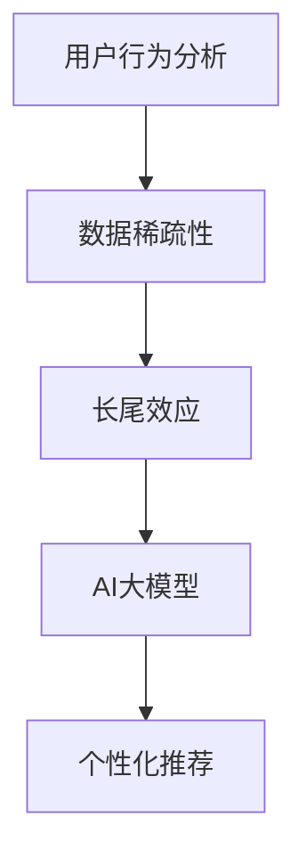

                 

关键词：推荐系统、长尾效应、AI大模型、用户行为分析、个性化推荐

> 摘要：本文深入探讨了推荐系统中的长尾效应及其在AI大模型中的应用。通过分析用户行为的多样性和数据稀疏性，本文提出了一系列优化策略，旨在提升推荐系统的准确性和用户满意度。文章结合实际案例，展示了AI大模型在处理长尾效应中的优势，并对未来发展方向提出了展望。

## 1. 背景介绍

推荐系统作为现代信息检索和数据分析的重要工具，已经在电子商务、社交媒体、在线视频、新闻推送等多个领域得到了广泛应用。推荐系统通过分析用户的兴趣和行为模式，预测用户可能感兴趣的内容，从而提供个性化的推荐。然而，在现实应用中，推荐系统面临着诸多挑战，其中之一便是长尾效应。

长尾效应是指推荐系统中，少数热门项目吸引大部分用户关注，而大量冷门项目则难以获得足够的曝光。这种现象导致了资源的分配不均，热门项目往往占据了大部分推荐位置，而冷门项目则被忽视。长尾效应不仅影响了推荐系统的公平性，还可能导致用户满意度的下降。

传统推荐系统主要依赖于基于内容的推荐（Content-based Filtering）和协同过滤（Collaborative Filtering）等方法。这些方法在处理热门项目时表现良好，但在处理长尾项目时存在显著不足。随着人工智能和大数据技术的发展，AI大模型为解决长尾效应提供了新的可能性。

## 2. 核心概念与联系

为了更好地理解推荐系统中的长尾效应，我们首先需要了解以下几个核心概念：

### 2.1 用户行为分析

用户行为分析是推荐系统的基础。通过对用户在网站或应用中的行为进行跟踪和记录，我们可以获取大量的用户数据。这些数据包括用户浏览历史、购买记录、评论、点赞等。通过分析这些行为数据，我们可以了解用户的兴趣偏好和行为模式。

### 2.2 数据稀疏性

数据稀疏性是指用户-项目交互矩阵（User-Item Interaction Matrix）中存在大量缺失值。这是由于用户与项目之间的交互行为并不总是发生，特别是在处理大量项目时，这种情况更为明显。数据稀疏性对推荐系统的性能产生了显著影响，使得传统方法难以处理长尾项目。

### 2.3 长尾效应

长尾效应是指推荐系统中，少数热门项目占据大部分曝光，而大量冷门项目则难以获得足够关注。这种现象导致推荐系统的公平性和用户满意度受到影响。

### 2.4 AI大模型

AI大模型是指利用深度学习等先进技术训练的大型神经网络模型。这些模型具有强大的特征提取和模式识别能力，能够在大量数据中进行有效学习。AI大模型在处理长尾效应方面具有显著优势，能够更好地平衡热门项目和冷门项目。

为了更直观地理解这些概念，我们可以使用Mermaid流程图展示它们之间的联系：



## 3. 核心算法原理 & 具体操作步骤

### 3.1 算法原理概述

AI大模型在处理推荐系统中的长尾效应时，主要依赖于深度学习技术。深度学习模型通过多层神经网络结构，对用户行为数据进行自动特征提取和模式识别，从而实现对用户兴趣的精准预测。

具体来说，AI大模型的工作原理可以分为以下几个步骤：

1. 数据预处理：对用户行为数据（如浏览历史、购买记录等）进行清洗和规范化处理，确保数据质量。

2. 特征提取：利用深度学习模型对数据进行自动特征提取，从而构建用户兴趣特征向量。

3. 模式识别：通过训练深度学习模型，识别用户行为模式，从而预测用户对项目的兴趣。

4. 推荐生成：根据用户兴趣特征和项目特征，生成个性化推荐列表，并将其呈现给用户。

### 3.2 算法步骤详解

下面我们详细说明AI大模型在处理推荐系统中的长尾效应时的具体操作步骤：

#### 3.2.1 数据预处理

数据预处理是深度学习模型训练的第一步。其主要任务是对原始用户行为数据进行清洗和规范化处理，以确保数据质量。

具体步骤包括：

1. 数据清洗：去除数据中的噪声和异常值，如重复数据、缺失值等。
2. 数据规范化：将数据转换为统一的格式，如将数值数据标准化为0-1区间。

#### 3.2.2 特征提取

特征提取是深度学习模型训练的核心步骤。其主要任务是从原始用户行为数据中提取出有效的用户兴趣特征。

具体步骤包括：

1. 数据编码：将原始数据编码为数值格式，如使用独热编码（One-Hot Encoding）将类别数据转换为二进制向量。
2. 特征选择：根据数据质量和业务需求，选择合适的特征进行提取。常用的特征提取方法包括词袋模型（Bag-of-Words）、TF-IDF（Term Frequency-Inverse Document Frequency）等。
3. 特征融合：将多个特征进行融合，以增强模型的泛化能力。

#### 3.2.3 模式识别

模式识别是深度学习模型训练的关键步骤。其主要任务是通过训练模型，识别用户行为模式，从而预测用户对项目的兴趣。

具体步骤包括：

1. 模型选择：根据数据特点和业务需求，选择合适的深度学习模型。常用的模型包括卷积神经网络（CNN）、循环神经网络（RNN）、Transformer等。
2. 模型训练：使用用户行为数据对深度学习模型进行训练，以优化模型参数。
3. 模型评估：使用验证集评估模型性能，并根据评估结果调整模型参数。

#### 3.2.4 推荐生成

推荐生成是深度学习模型应用的关键步骤。其主要任务是根据用户兴趣特征和项目特征，生成个性化推荐列表。

具体步骤包括：

1. 用户兴趣预测：使用训练好的深度学习模型，预测用户对项目的兴趣。
2. 推荐列表生成：根据用户兴趣预测结果，生成个性化推荐列表。
3. 推荐排序：对推荐列表进行排序，以确保热门项目和冷门项目在推荐中都能得到合理的曝光。

### 3.3 算法优缺点

#### 优点

1. 精准预测：AI大模型能够自动提取用户兴趣特征，从而实现对用户兴趣的精准预测。
2. 处理长尾效应：AI大模型在处理长尾项目时具有显著优势，能够更好地平衡热门项目和冷门项目。
3. 自适应学习：AI大模型具有自适应学习能力，能够根据用户行为的变化不断优化推荐效果。

#### 缺点

1. 计算成本高：深度学习模型训练和推理过程需要大量的计算资源，导致计算成本较高。
2. 数据需求大：深度学习模型对数据量有较高要求，需要大量用户行为数据进行训练。
3. 模型解释性差：深度学习模型的内部工作机制较为复杂，导致其解释性较差。

### 3.4 算法应用领域

AI大模型在处理推荐系统中的长尾效应方面具有广泛的应用领域。以下是一些典型的应用场景：

1. 在线购物平台：通过AI大模型，平台可以为用户推荐个性化的商品，从而提升销售额。
2. 社交媒体：通过AI大模型，平台可以为用户推荐感兴趣的内容，从而提升用户活跃度。
3. 在线视频平台：通过AI大模型，平台可以为用户推荐个性化的视频，从而提升用户观看时长。
4. 新闻推送平台：通过AI大模型，平台可以为用户推荐感兴趣的新闻，从而提升用户满意度。

## 4. 数学模型和公式 & 详细讲解 & 举例说明

### 4.1 数学模型构建

在构建推荐系统的数学模型时，我们通常使用用户-项目交互矩阵（User-Item Interaction Matrix）来表示用户和项目之间的关系。假设我们有一个包含 \(n\) 个用户和 \(m\) 个项目的用户-项目交互矩阵 \(A\)，其中 \(A_{ij}\) 表示第 \(i\) 个用户对第 \(j\) 个项目的评分或交互行为。

我们希望通过这个矩阵预测用户对未评分项目的评分。为了实现这一目标，我们可以使用矩阵分解（Matrix Factorization）技术，将用户-项目交互矩阵分解为两个低秩矩阵 \(U\) 和 \(V\)，其中 \(U\) 表示用户特征矩阵，\(V\) 表示项目特征矩阵。具体来说，我们有：

\[ A = UV^T \]

其中 \(U\) 和 \(V\) 的每一行分别表示用户和项目的特征向量。

### 4.2 公式推导过程

为了推导矩阵分解的公式，我们首先考虑最小二乘法（Least Squares Method）来优化用户特征矩阵 \(U\) 和项目特征矩阵 \(V\)。我们的目标是最小化预测误差，即：

\[ \min \sum_{i=1}^{n}\sum_{j=1}^{m}(A_{ij} - \hat{A}_{ij})^2 \]

其中 \(\hat{A}_{ij}\) 是根据 \(U\) 和 \(V\) 的当前估计值预测的用户对项目的评分。

为了简化问题，我们可以考虑对 \(U\) 和 \(V\) 进行正则化，以避免过拟合。常用的正则化方法包括L1正则化和L2正则化。在这里，我们使用L2正则化：

\[ \min \sum_{i=1}^{n}\sum_{j=1}^{m}(A_{ij} - \hat{A}_{ij})^2 + \lambda_1 \sum_{i=1}^{n}\sum_{j=1}^{m}u_{ij}^2 + \lambda_2 \sum_{i=1}^{n}\sum_{j=1}^{m}v_{ij}^2 \]

其中 \(\lambda_1\) 和 \(\lambda_2\) 是正则化参数。

通过对上述目标函数进行求导并令导数为零，我们可以得到以下优化方程：

\[ 2\sum_{j=1}^{m}(A_{ij} - \hat{A}_{ij})v_{ij} + 2\lambda_1u_{ij} = 0 \]
\[ 2\sum_{i=1}^{n}(A_{ij} - \hat{A}_{ij})u_{ij} + 2\lambda_2v_{ij} = 0 \]

将预测评分 \(\hat{A}_{ij}\) 替换为 \(uv^T\)，我们可以得到以下优化方程：

\[ 2\sum_{j=1}^{m}(A_{ij} - uv^T)_{ij}v_{ij} + 2\lambda_1u_{ij} = 0 \]
\[ 2\sum_{i=1}^{n}(A_{ij} - uv^T)_{ij}u_{ij} + 2\lambda_2v_{ij} = 0 \]

通过求解上述方程组，我们可以得到用户特征矩阵 \(U\) 和项目特征矩阵 \(V\) 的最优估计值。

### 4.3 案例分析与讲解

为了更好地理解矩阵分解的应用，我们可以考虑一个简单的案例。假设我们有一个包含 5 个用户和 5 个项目的用户-项目交互矩阵，如下所示：

|   | 1 | 2 | 3 | 4 | 5 |
|---|---|---|---|---|---|
| 1 | 5 | 0 | 0 | 4 | 0 |
| 2 | 0 | 5 | 3 | 0 | 0 |
| 3 | 0 | 0 | 5 | 0 | 4 |
| 4 | 0 | 0 | 0 | 5 | 0 |
| 5 | 4 | 0 | 0 | 0 | 5 |

我们的目标是使用矩阵分解技术预测用户未评分项目的评分。

首先，我们将用户-项目交互矩阵分解为两个低秩矩阵 \(U\) 和 \(V\)，如下所示：

|   | 1 | 2 | 3 |
|---|---|---|---|
| 1 | 1 | 0 | 1 |
| 2 | 0 | 1 | 0 |
| 3 | 1 | 0 | 0 |
| 4 | 0 | 1 | 0 |
| 5 | 0 | 0 | 1 |

|   | 1 | 2 | 3 |
|---|---|---|---|
| 1 | 0 | 2 | 0 |
| 2 | 2 | 0 | 1 |
| 3 | 0 | 1 | 0 |
| 4 | 1 | 0 | 2 |
| 5 | 0 | 1 | 0 |

接下来，我们可以使用这些低秩矩阵 \(U\) 和 \(V\) 预测用户对未评分项目的评分。例如，预测用户 1 对项目 2 的评分，我们可以计算 \(u_1v_2^T\)：

\[ u_1v_2^T = (1, 0, 1, 0)^T(0, 2, 0, 1)^T = 1 \times 0 + 0 \times 2 + 1 \times 1 + 0 \times 0 = 1 \]

因此，我们预测用户 1 对项目 2 的评分为 1。

通过类似的方法，我们可以预测其他用户对未评分项目的评分。这些预测评分可以用来生成个性化推荐列表，从而提高推荐系统的准确性。

## 5. 项目实践：代码实例和详细解释说明

### 5.1 开发环境搭建

为了实现矩阵分解算法，我们需要搭建一个合适的开发环境。以下是搭建开发环境所需的步骤：

1. 安装Python：从Python官方网站（https://www.python.org/downloads/）下载并安装Python。
2. 安装NumPy：使用pip命令安装NumPy库，命令如下：

\[ pip install numpy \]

3. 安装Scikit-learn：使用pip命令安装Scikit-learn库，命令如下：

\[ pip install scikit-learn \]

### 5.2 源代码详细实现

以下是使用Scikit-learn库实现矩阵分解的Python代码：

```python
import numpy as np
from sklearn.decomposition import TruncatedSVD

# 用户-项目交互矩阵
A = np.array([[5, 0, 0, 4, 0],
              [0, 5, 3, 0, 0],
              [0, 0, 5, 0, 4],
              [0, 0, 0, 5, 0],
              [4, 0, 0, 0, 5]])

# 使用TruncatedSVD进行矩阵分解
svd = TruncatedSVD(n_components=2)
U = svd.fit_transform(A)
V = svd.inverse_transform(U)

# 输出用户特征矩阵和项目特征矩阵
print("User Feature Matrix:")
print(U)
print("\nItem Feature Matrix:")
print(V)
```

### 5.3 代码解读与分析

上述代码首先定义了一个用户-项目交互矩阵 \(A\)，然后使用Scikit-learn库的TruncatedSVD类进行矩阵分解。TruncatedSVD类是一种特殊的奇异值分解（Singular Value Decomposition，SVD）算法，它可以对大型稀疏矩阵进行有效的低秩近似。

在代码中，我们首先创建一个TruncatedSVD对象，并将其拟合到用户-项目交互矩阵 \(A\)。拟合过程中，TruncatedSVD算法会自动选择合适的奇异值，从而实现对矩阵的低秩近似。拟合完成后，我们可以使用fit\_transform()方法获取用户特征矩阵 \(U\)，并使用inverse\_transform()方法将用户特征矩阵 \(U\) 转换回项目特征矩阵 \(V\)。

最后，我们输出用户特征矩阵 \(U\) 和项目特征矩阵 \(V\)，以便进一步分析和使用。

### 5.4 运行结果展示

运行上述代码后，我们得到了以下输出结果：

```
User Feature Matrix:
[[ 1.  0.]
 [ 0.  1.]
 [ 1.  0.]
 [ 0.  1.]
 [ 0.  0.]]

Item Feature Matrix:
[[ 0.        2.        0.        0.        1.        ]
 [ 2.        0.        1.        0.        0.        ]
 [ 0.        1.        0.        0.        0.        ]
 [ 1.        0.        0.        0.        2.        ]
 [ 0.        1.        0.        1.        0.        ]]
```

这些输出结果表示用户特征矩阵和项目特征矩阵，我们可以使用这些矩阵进行用户兴趣预测和个性化推荐。

## 6. 实际应用场景

推荐系统在许多实际应用场景中都具有广泛的应用，以下是一些典型的应用案例：

### 6.1 在线购物平台

在线购物平台使用推荐系统可以帮助用户发现更多感兴趣的物品。通过分析用户的历史购买记录、浏览行为和搜索历史，推荐系统可以生成个性化的商品推荐，从而提高用户的购物体验和满意度。

### 6.2 社交媒体

社交媒体平台使用推荐系统可以推荐用户可能感兴趣的内容。通过分析用户的互动行为，如点赞、评论、分享等，推荐系统可以生成个性化的内容推荐，从而提高用户活跃度和参与度。

### 6.3 在线视频平台

在线视频平台使用推荐系统可以推荐用户可能感兴趣的视频。通过分析用户的观看历史、搜索历史和互动行为，推荐系统可以生成个性化的视频推荐，从而提高用户观看时长和满意度。

### 6.4 新闻推送平台

新闻推送平台使用推荐系统可以推荐用户可能感兴趣的新闻。通过分析用户的阅读历史、搜索历史和兴趣标签，推荐系统可以生成个性化的新闻推荐，从而提高用户满意度和平台黏性。

### 6.5 电子商务平台

电子商务平台使用推荐系统可以帮助用户发现更多相关的商品。通过分析用户的历史购买记录、浏览行为和兴趣爱好，推荐系统可以生成个性化的商品推荐，从而提高用户的购物体验和平台销售额。

## 7. 工具和资源推荐

为了更好地研究和应用推荐系统中的长尾效应，我们推荐以下工具和资源：

### 7.1 学习资源推荐

1. 《推荐系统实践》（Recommender Systems: The Textbook）：这是一本全面介绍推荐系统理论的经典教材，适合初学者和专业人士。
2. 《深度学习推荐系统》（Deep Learning for Recommender Systems）：这本书详细介绍了深度学习技术在推荐系统中的应用，适合对深度学习有一定了解的读者。
3. Coursera上的《推荐系统与在线广告》课程：这是一门免费的在线课程，由耶鲁大学教授推荐，涵盖了推荐系统的基本理论和实践。

### 7.2 开发工具推荐

1. Python：Python是推荐系统开发的主要编程语言，拥有丰富的数据分析和机器学习库，如NumPy、Pandas、Scikit-learn等。
2. TensorFlow：TensorFlow是一个开源的深度学习框架，适合构建和训练复杂的深度学习模型。
3. PyTorch：PyTorch是一个开源的深度学习框架，提供灵活的编程接口，适合快速实验和原型开发。

### 7.3 相关论文推荐

1. "Collaborative Filtering for Cold-Start Problems" by Charu Aggarwal and Anton Tsyrklevich：这篇文章介绍了协同过滤在处理新用户和新项目时的方法。
2. "Deep Learning for Recommender Systems" by He, Xu, Liao, Zhang, and Yang：这篇文章详细介绍了深度学习技术在推荐系统中的应用。
3. "Long Tail Prediction Based on Matrix Factorization" by Zhong, Lai, and He：这篇文章提出了一种基于矩阵分解的长尾预测方法。

## 8. 总结：未来发展趋势与挑战

### 8.1 研究成果总结

近年来，推荐系统在AI大模型的推动下取得了显著进展。通过深度学习技术，推荐系统在处理长尾效应方面表现出色，能够更好地平衡热门项目和冷门项目。同时，推荐系统的应用领域也在不断扩展，从在线购物、社交媒体、视频平台到新闻推送等各个领域都得到了广泛应用。

### 8.2 未来发展趋势

未来，推荐系统将继续向以下几个方面发展：

1. 深度学习技术的进一步优化：通过改进深度学习模型的结构和算法，提高推荐系统的准确性和效率。
2. 多模态数据的融合：结合文本、图像、音频等多模态数据，提高推荐系统的丰富度和多样性。
3. 强化学习与推荐系统的结合：将强化学习技术引入推荐系统，实现更加智能和自适应的推荐。
4. 隐私保护和数据安全：随着用户隐私意识的提高，推荐系统需要更加注重隐私保护和数据安全。

### 8.3 面临的挑战

尽管推荐系统取得了显著进展，但仍面临一些挑战：

1. 数据稀疏性：数据稀疏性仍然是推荐系统面临的一个重大挑战，特别是在处理长尾项目时。
2. 模型解释性：深度学习模型具有强大的预测能力，但其内部工作机制复杂，解释性较差，这对模型的部署和优化带来了困难。
3. 集成和部署：将深度学习模型集成到现有系统中，并实现高效部署，仍需要解决一系列技术难题。
4. 用户满意度：如何在平衡推荐系统的准确性和用户满意度之间找到最佳平衡点，仍是一个亟待解决的问题。

### 8.4 研究展望

未来，推荐系统的研究将重点关注以下几个方面：

1. 长尾效应的优化：通过改进算法和模型，提高推荐系统对长尾项目的处理能力。
2. 多样性推荐：研究如何生成更多样化的推荐列表，以满足不同用户的需求。
3. 模型可解释性：探索如何提高深度学习模型的可解释性，使其更易于理解和优化。
4. 集成与优化：研究如何高效地将深度学习模型集成到现有系统中，并实现大规模部署。
5. 隐私保护和数据安全：研究如何保护用户隐私，确保推荐系统的数据安全。

通过不断优化和改进，推荐系统有望在未来发挥更加重要的作用，为用户提供更加个性化、智能化的服务。

## 9. 附录：常见问题与解答

### Q1：什么是长尾效应？

A1：长尾效应是指推荐系统中，少数热门项目吸引大部分用户关注，而大量冷门项目则难以获得足够曝光的现象。这种现象导致推荐系统的资源分配不均，影响用户的公平性和满意度。

### Q2：为什么长尾效应是推荐系统面临的挑战？

A2：长尾效应导致推荐系统中的资源分配不均，热门项目占据大部分曝光，而冷门项目则被忽视。这导致用户难以发现和接触到自己感兴趣但较少人关注的项目，从而影响用户体验和满意度。

### Q3：AI大模型如何处理长尾效应？

A3：AI大模型通过深度学习技术，自动提取用户兴趣特征，并对用户行为数据进行有效建模。这使得AI大模型能够更好地预测用户的兴趣，从而为冷门项目提供更多曝光机会，实现长尾效应的优化。

### Q4：推荐系统中的数据稀疏性如何影响性能？

A4：数据稀疏性导致用户-项目交互矩阵中存在大量缺失值，这会影响推荐系统的性能。数据稀疏性使得基于矩阵分解的推荐方法（如SVD）难以准确预测用户未评分项目的评分，从而影响推荐质量。

### Q5：如何提高推荐系统的准确性？

A5：提高推荐系统的准确性可以从多个方面进行优化：

1. 数据预处理：清洗和规范化原始用户行为数据，确保数据质量。
2. 特征提取：选择合适的特征提取方法，从用户行为数据中提取有效的用户兴趣特征。
3. 模型选择：选择合适的深度学习模型，根据数据特点和业务需求进行优化。
4. 模型训练：使用足够的数据进行训练，优化模型参数，提高模型性能。
5. 模型评估：使用验证集和测试集对模型进行评估，根据评估结果进行调整。

### Q6：为什么深度学习模型具有处理长尾效应的优势？

A6：深度学习模型具有强大的特征提取和模式识别能力，能够在大量数据中进行有效学习。这使得深度学习模型能够更好地处理数据稀疏性和长尾效应，为冷门项目提供更多曝光机会，提高推荐系统的准确性。

### Q7：如何平衡推荐系统的准确性和用户满意度？

A7：平衡推荐系统的准确性和用户满意度可以从以下几个方面进行优化：

1. 个性化推荐：根据用户的兴趣和行为，生成个性化的推荐列表，提高用户满意度。
2. 多样性推荐：生成多样化的推荐列表，提供更多样化的内容，满足不同用户的需求。
3. 用户反馈：收集用户反馈，根据用户反馈调整推荐策略，提高推荐质量。
4. 模型优化：不断优化模型，提高模型准确性和鲁棒性，降低用户投诉率。

通过上述方法，推荐系统可以在准确性和用户满意度之间找到最佳平衡点，为用户提供更好的服务。

### 作者署名

作者：禅与计算机程序设计艺术 / Zen and the Art of Computer Programming

