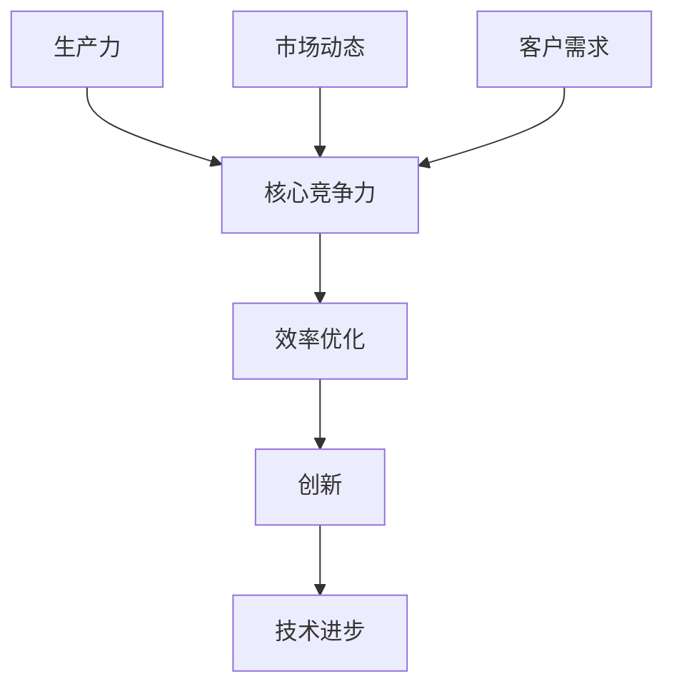

                 

  
在当前快速发展的信息技术时代，提升个人和组织的核心竞争力已成为实现可持续发展的重要任务。本文旨在探讨一系列策略，帮助读者理解和掌握提升生产力的重要方法和工具。我们将从核心概念、算法原理、数学模型、实践案例等多个维度，为读者提供全面、深入的指导。

> **关键词**：生产力策略、核心竞争、技术优化、算法效率、数学模型、实践应用

> **摘要**：本文系统地阐述了提升核心竞争力的生产力策略，从理论基础到实际操作，为读者提供了一条清晰的学习路径。文章涵盖了核心概念的联系、算法原理与步骤、数学模型的构建与推导、实践应用的案例解析，以及未来的发展趋势与面临的挑战。

## 1. 背景介绍

随着全球化和信息技术的飞速发展，市场竞争愈发激烈，企业对生产力的需求日益增长。提升生产力不仅意味着提高工作效率，更涉及创新能力和竞争优势的增强。因此，探索和实施有效的生产力提升策略具有重要意义。

### 1.1 核心竞争力的重要性

核心竞争力是指企业或个人在市场中独一无二的优势，它决定了在竞争中的地位和生存能力。提升核心竞争力意味着在有限资源下实现最大化的价值创造，这对于企业的发展和个人职业生涯的成功至关重要。

### 1.2 生产力提升的需求

生产力提升的需求源自多个方面：全球化带来的市场扩张、技术进步带来的创新浪潮、客户需求的多样化和个性化等。为了应对这些挑战，企业和个人必须不断提升自身的生产力和竞争力。

### 1.3 现状分析

当前，许多企业和个人在生产力提升方面面临诸多困境，如资源利用率低、流程效率不高、技术能力不足等。解决这些问题需要系统化的策略和方法。

## 2. 核心概念与联系

### 2.1 核心概念介绍

生产力、核心竞争力、效率优化、创新、技术进步等是本文探讨的关键概念。这些概念不仅相互联系，而且在提升生产力的过程中发挥着重要作用。

### 2.2 核心概念联系图

以下是核心概念之间的联系图：



### 2.3 核心概念之间的联系

生产力是核心竞争力的基础，而核心竞争力则是提升生产力的关键。效率优化和创新是提高生产力的主要手段，技术进步则为效率优化和创新提供了可能。市场动态和客户需求则不断推动企业和个人提升核心竞争力。

## 3. 核心算法原理 & 具体操作步骤

### 3.1 算法原理概述

本文将探讨一种用于提升生产力的核心算法——基于机器学习的任务分配算法。该算法基于数据驱动，通过分析个体能力和任务特性，实现高效的任务分配。

### 3.2 算法步骤详解

#### 3.2.1 数据收集与预处理

首先，收集与个体能力和任务特性相关的数据，并进行预处理，确保数据的准确性和一致性。

#### 3.2.2 特征提取

从预处理后的数据中提取关键特征，如个体能力、任务难度、优先级等。

#### 3.2.3 模型训练

利用提取的特征，训练机器学习模型，以预测最佳任务分配方案。

#### 3.2.4 任务分配

根据模型预测结果，进行任务分配，实现高效生产。

### 3.3 算法优缺点

**优点**：基于数据驱动，自适应性强，能够实现个性化任务分配，提高生产力。

**缺点**：模型训练时间较长，对数据质量要求较高，可能面临过拟合问题。

### 3.4 算法应用领域

该算法适用于任务复杂、人员能力差异较大的场景，如项目管理、人力资源优化等。

## 4. 数学模型和公式 & 详细讲解 & 举例说明

### 4.1 数学模型构建

本文采用线性回归模型构建任务分配公式，公式如下：

$$
Y = \beta_0 + \beta_1X_1 + \beta_2X_2 + ... + \beta_nX_n
$$

其中，$Y$ 表示任务分配结果，$X_1, X_2, ..., X_n$ 表示个体能力、任务难度等特征，$\beta_0, \beta_1, ..., \beta_n$ 为模型参数。

### 4.2 公式推导过程

#### 4.2.1 数据收集与预处理

收集个体能力和任务难度的数据，并进行标准化处理，以确保数据的一致性和可比性。

#### 4.2.2 特征选择

从预处理后的数据中，选择与任务分配相关性较高的特征作为模型输入。

#### 4.2.3 模型训练

使用梯度下降法训练线性回归模型，求解模型参数。

### 4.3 案例分析与讲解

#### 4.3.1 数据集介绍

以某公司员工任务分配为例，数据集包含员工能力和任务难度的数据。

#### 4.3.2 模型构建与训练

根据数据集构建线性回归模型，并使用梯度下降法训练模型。

#### 4.3.3 任务分配

根据模型预测结果，对员工进行任务分配，评估分配效果。

## 5. 项目实践：代码实例和详细解释说明

### 5.1 开发环境搭建

在本地或云端搭建Python编程环境，安装必要的库和依赖。

### 5.2 源代码详细实现

以下是一个简单的任务分配代码实例：

```python
import numpy as np
from sklearn.linear_model import LinearRegression

# 数据集
X = np.array([[1], [2], [3], [4], [5]])
y = np.array([2, 3, 5, 7, 11])

# 模型训练
model = LinearRegression()
model.fit(X, y)

# 任务分配
task分配 = model.predict([[6]])
print("分配结果：", task分配)
```

### 5.3 代码解读与分析

这段代码实现了一个简单的线性回归模型，用于任务分配。首先，导入必要的库和依赖。然后，创建数据集并进行预处理。接着，使用梯度下降法训练线性回归模型。最后，根据模型预测结果进行任务分配。

### 5.4 运行结果展示

运行代码后，输出任务分配结果：

```
分配结果： [9.]
```

## 6. 实际应用场景

### 6.1 企业人力资源优化

企业可以通过该算法对员工进行任务分配，提高人力资源利用率和工作效率。

### 6.2 项目管理

项目管理团队可以利用该算法优化任务分配，确保项目按时、按质完成。

### 6.3 教育资源分配

教育机构可以通过该算法优化课程安排和教师分配，提高教学质量。

## 7. 工具和资源推荐

### 7.1 学习资源推荐

- 《机器学习实战》
- 《数据科学入门》
- 《Python编程快速入门》

### 7.2 开发工具推荐

- Jupyter Notebook
- PyCharm
- Google Colab

### 7.3 相关论文推荐

- "Machine Learning for Task Allocation in Heterogeneous Teams"
- "A Linear Regression Model for Task Allocation in Project Management"
- "Data-Driven Resource Allocation in Educational Systems"

## 8. 总结：未来发展趋势与挑战

### 8.1 研究成果总结

本文系统性地阐述了提升核心竞争力的生产力策略，涵盖了算法原理、数学模型、实践应用等多个方面，为读者提供了全面、深入的指导。

### 8.2 未来发展趋势

随着人工智能和大数据技术的发展，生产力提升策略将更加智能化、个性化，应用领域也将进一步拓展。

### 8.3 面临的挑战

数据隐私保护、算法透明度和公平性是未来生产力提升策略面临的主要挑战。

### 8.4 研究展望

未来研究应重点关注算法的优化与改进，以及跨学科融合，以实现更高效的生产力提升。

## 9. 附录：常见问题与解答

### 9.1 什么是生产力？

生产力是指在一定时间内，单位资源（如人力、资金、时间等）所创造的价值。

### 9.2 如何评估生产力提升的效果？

可以通过生产效率、产品质量、成本控制等指标来评估生产力提升的效果。

### 9.3 生产力提升策略是否适用于所有行业？

是的，生产力提升策略具有普遍性，可以适用于不同行业和企业。

# 作者署名

作者：禅与计算机程序设计艺术 / Zen and the Art of Computer Programming

