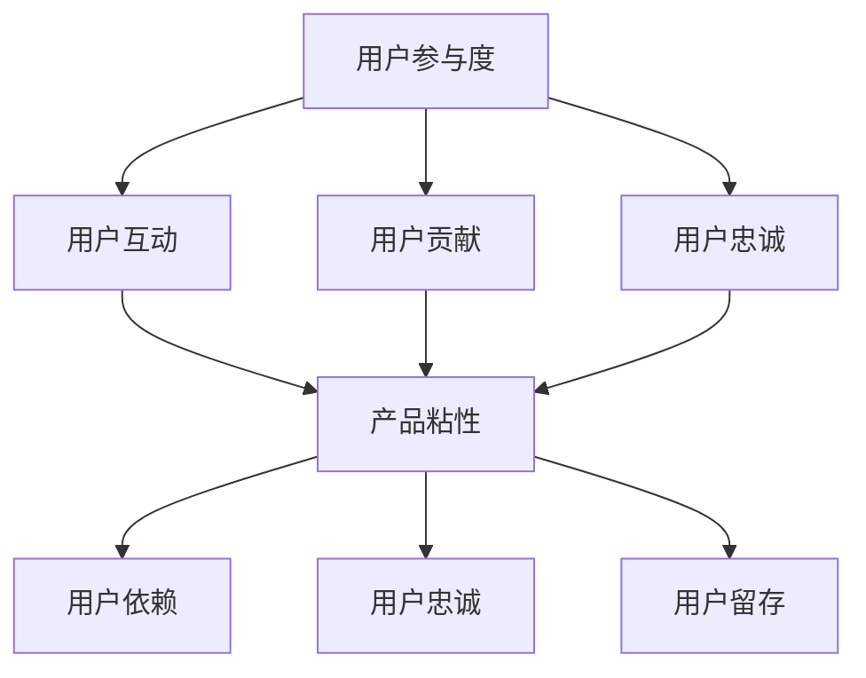

                 

关键词：用户参与度、产品粘性、用户体验、人工智能、产品设计

> 摘要：本文从人工智能技术的视角，探讨如何通过提升用户参与度和增强产品粘性来提高产品的市场竞争力。文章详细分析了用户参与度的核心概念，介绍了增强产品粘性的多种方法，并结合实际案例，展示了如何运用这些方法来优化产品设计，从而提升用户体验和用户忠诚度。

## 1. 背景介绍

在当今快速变化的市场环境中，产品的生命周期变得越来越短。用户的需求瞬息万变，市场竞争日益激烈。为了在如此激烈的环境中脱颖而出，产品开发者需要不断探索新的策略来提高产品的市场竞争力。其中一个关键因素就是提升用户参与度和增强产品粘性。

用户参与度是指用户在产品使用过程中所表现出的积极性和互动程度。用户参与度高的产品通常能更好地满足用户需求，提高用户满意度和忠诚度。产品粘性则是指用户对产品的依赖程度，粘性越高的产品越能留住用户，减少用户流失。

本文将重点讨论如何通过提升用户参与度和增强产品粘性来提高产品的市场竞争力。文章结构如下：

1. **背景介绍**：介绍用户参与度和产品粘性的重要性。
2. **核心概念与联系**：阐述用户参与度和产品粘性的核心概念，并使用Mermaid流程图展示两者之间的关系。
3. **核心算法原理 & 具体操作步骤**：详细介绍提升用户参与度和增强产品粘性的具体方法和步骤。
4. **数学模型和公式 & 详细讲解 & 举例说明**：运用数学模型和公式分析用户参与度和产品粘性的关系，并通过案例进行说明。
5. **项目实践：代码实例和详细解释说明**：提供具体的代码实例，展示如何通过编程实现提升用户参与度和增强产品粘性的方法。
6. **实际应用场景**：讨论提升用户参与度和增强产品粘性在不同行业中的应用场景。
7. **工具和资源推荐**：推荐相关学习和开发工具。
8. **总结：未来发展趋势与挑战**：总结研究成果，探讨未来发展趋势和面临的挑战。

### 1.1 用户参与度的定义

用户参与度可以理解为用户在使用产品过程中所表现出的参与程度。它不仅涵盖了用户对产品的使用频率，还包括用户对产品的评价、反馈、分享和推荐等行为。高用户参与度的产品往往具有以下特点：

1. **用户互动**：产品能够提供丰富的互动体验，使用户在使用过程中能够感受到乐趣和价值。
2. **用户贡献**：用户不仅使用产品，还能在产品内产生内容，如评论、评价、上传图片或视频等。
3. **用户忠诚**：用户对产品有较高的忠诚度，愿意长期使用产品并推荐给他人。

### 1.2 产品粘性的定义

产品粘性是指用户对产品的依赖程度，高粘性的产品能够让用户在同类产品中持续选择该产品，而不是轻易转向其他产品。产品粘性高的产品通常具有以下特点：

1. **用户依赖**：用户对产品有较强的依赖性，难以在没有该产品的情况下完成某些任务。
2. **用户忠诚**：用户对产品有较高的忠诚度，即使市场上出现类似产品，也愿意继续使用原产品。
3. **用户留存**：高粘性的产品能够有效减少用户流失，提高用户的生命周期价值。

### 1.3 用户参与度与产品粘性的关系

用户参与度和产品粘性之间存在密切的关系。高用户参与度可以促进产品粘性，而高产品粘性又可以进一步提高用户参与度。具体来说：

1. **相互促进**：用户参与度高可以增加用户对产品的喜爱和信任，从而提高产品粘性；反之，产品粘性高可以增强用户对产品的依赖，进一步提高用户参与度。
2. **循环反馈**：用户参与度和产品粘性之间存在正反馈机制，一个方面的提高会促进另一个方面的提升，从而形成一个良性的循环。
3. **共同目标**：提升用户参与度和增强产品粘性的共同目标都是提高产品的市场竞争力，通过用户满意度和忠诚度的提升来实现。

## 2. 核心概念与联系

在深入探讨如何提升用户参与度和增强产品粘性之前，我们需要明确一些核心概念，并理解它们之间的联系。以下是一个详细的Mermaid流程图，用于展示这些概念之间的关系。



### 2.1 用户互动

用户互动是用户参与度的重要组成部分，它涉及用户与产品之间的互动频率和质量。以下是一些提升用户互动的具体策略：

1. **个性化推荐**：根据用户的兴趣和行为，提供个性化的内容或服务，增加用户的参与感。
2. **社交功能**：在产品中集成社交功能，如分享、评论、点赞等，鼓励用户互动。
3. **游戏化元素**：引入游戏化元素，如积分、等级、奖励等，激发用户的竞争心理和参与欲望。

### 2.2 用户贡献

用户贡献是指用户在产品内产生内容，为产品增添价值。以下是提升用户贡献的一些策略：

1. **内容共创**：鼓励用户参与内容创作，如用户生成内容（UGC），增强产品的丰富性和吸引力。
2. **用户评价**：提供评价和反馈机制，让用户对产品进行评价，提升产品的透明度和可信度。
3. **用户调查**：定期进行用户调查，了解用户的需求和反馈，及时优化产品。

### 2.3 用户忠诚

用户忠诚是用户参与度的核心指标，它反映了用户对产品的长期信任和依赖。以下是提升用户忠诚的一些策略：

1. **客户关怀**：提供优质的客户服务，及时解决用户的问题，增加用户的满意度。
2. **会员制度**：建立会员制度，提供专属于会员的优惠和福利，增强用户的归属感。
3. **品牌认同**：通过品牌价值观的传递和品牌形象的塑造，增强用户对品牌的认同感。

### 2.4 产品粘性

产品粘性是衡量用户对产品依赖程度的重要指标。以下是增强产品粘性的几种方法：

1. **深度功能**：提供丰富的功能和强大的工具，让用户难以找到替代品。
2. **定制化体验**：根据用户的使用习惯和需求，提供个性化的体验，增加用户的使用频率。
3. **生态建设**：构建产品生态，通过与其他产品的整合和联动，增强用户对产品的依赖。

通过上述Mermaid流程图，我们可以清晰地看到用户参与度、用户互动、用户贡献、用户忠诚、产品粘性之间的关系。这些概念相互作用，共同构成了提升用户参与度和增强产品粘性的理论基础。

## 3. 核心算法原理 & 具体操作步骤

在提升用户参与度和增强产品粘性的过程中，我们可以运用多种算法原理和方法。以下是一个综合的算法框架，包括算法原理的概述、具体操作步骤的详细说明，以及算法的优缺点和适用领域。

### 3.1 算法原理概述

提升用户参与度和增强产品粘性的核心算法原理主要包括以下几个方面：

1. **个性化推荐算法**：基于用户的兴趣和行为数据，提供个性化的内容或服务，增强用户的参与感和满意度。
2. **用户行为分析算法**：通过分析用户的行为数据，识别用户的需求和行为模式，从而优化产品设计和用户体验。
3. **机器学习与预测模型**：利用机器学习技术，预测用户的未来行为和需求，提前采取措施，提升用户参与度和粘性。
4. **社交网络分析算法**：通过分析用户之间的社交关系和互动行为，增强用户的社区感和归属感，提高用户忠诚度。

### 3.2 算法步骤详解

以下详细描述每种算法的具体操作步骤：

#### 3.2.1 个性化推荐算法

1. **数据收集**：收集用户的浏览记录、购买历史、搜索关键词等行为数据。
2. **特征提取**：对行为数据进行处理，提取用户的兴趣特征。
3. **推荐生成**：使用协同过滤、基于内容的推荐等方法，生成个性化推荐结果。
4. **推荐展示**：将推荐结果展示给用户，引导用户进行互动。

#### 3.2.2 用户行为分析算法

1. **数据收集**：收集用户在产品中的行为数据，如点击、浏览、购买等。
2. **行为建模**：构建用户行为模型，识别用户的行为模式和需求。
3. **分析评估**：使用机器学习算法，分析用户行为数据，评估用户的需求和偏好。
4. **优化设计**：根据分析结果，优化产品设计和用户体验。

#### 3.2.3 机器学习与预测模型

1. **数据收集**：收集用户的历史行为数据，如搜索记录、浏览时长等。
2. **特征工程**：对行为数据进行特征提取和转换，构建输入特征向量。
3. **模型训练**：使用机器学习算法，如决策树、神经网络等，训练预测模型。
4. **预测应用**：将训练好的模型应用于新数据，预测用户的未来行为。

#### 3.2.4 社交网络分析算法

1. **数据收集**：收集用户的社交关系数据，如好友列表、互动记录等。
2. **网络构建**：构建用户社交网络模型，表示用户之间的关系。
3. **社区识别**：使用社区检测算法，识别用户群体和社区。
4. **互动引导**：根据社交网络分析结果，引导用户进行互动和社区建设。

### 3.3 算法优缺点

每种算法都有其优缺点，适用场景也不同。以下是对每种算法优缺点的简要分析：

#### 个性化推荐算法

- **优点**：能够根据用户的兴趣和行为，提供个性化的内容，提高用户的参与度和满意度。
- **缺点**：可能存在数据偏差和推荐过度个性化的问题，导致用户视野狭窄。

#### 用户行为分析算法

- **优点**：能够深入分析用户行为，提供有针对性的优化建议。
- **缺点**：对用户行为数据的要求较高，数据处理和模型训练复杂。

#### 机器学习与预测模型

- **优点**：能够预测用户的未来行为，提前采取行动，提升用户参与度和粘性。
- **缺点**：模型训练和预测过程较为复杂，对数据质量要求高。

#### 社交网络分析算法

- **优点**：能够增强用户的社区感和归属感，提高用户忠诚度。
- **缺点**：对社交关系数据的要求较高，数据处理复杂。

### 3.4 算法应用领域

各种算法在不同领域中的应用场景有所不同。以下简要介绍几种常见应用领域：

#### 电子商务

- **个性化推荐**：为用户提供个性化的商品推荐，提升销售额。
- **用户行为分析**：分析用户购买行为，优化产品推荐和营销策略。

#### 社交媒体

- **社交网络分析**：识别用户社区，增强用户互动和社区建设。
- **个性化推荐**：根据用户兴趣和行为，推荐相关内容，提高用户留存率。

#### 在线教育

- **用户行为分析**：分析用户学习行为，优化课程内容和教学方法。
- **个性化推荐**：为用户提供个性化的学习建议，提高学习效果。

#### 健康医疗

- **用户行为分析**：分析用户健康状况和行为，提供个性化的健康建议。
- **个性化推荐**：根据用户健康状况，推荐适合的医疗服务和保健产品。

## 4. 数学模型和公式 & 详细讲解 & 举例说明

为了更好地理解提升用户参与度和增强产品粘性的过程，我们可以运用一些数学模型和公式。以下将介绍一些关键数学模型，并解释其应用方法和实例。

### 4.1 数学模型构建

在提升用户参与度和增强产品粘性的过程中，常用的数学模型包括用户留存模型、用户流失模型和推荐系统模型等。以下是这些模型的构建方法：

#### 用户留存模型

用户留存模型用于预测用户在未来某一时间段内继续使用产品的概率。一个简单的用户留存模型可以使用二元逻辑回归来构建。公式如下：

$$
P(R_t = 1 | X) = \frac{1}{1 + e^{-(\beta_0 + \beta_1 X_1 + \beta_2 X_2 + ... + \beta_n X_n})}
$$

其中，$P(R_t = 1 | X)$表示在给定用户特征向量$X$的情况下，用户在时间$t$留存的概率。$\beta_0, \beta_1, ..., \beta_n$为模型参数。

#### 用户流失模型

用户流失模型用于预测用户在未来某一时间段内停止使用产品的概率。一个简单的用户流失模型可以使用泊松回归来构建。公式如下：

$$
P(L_t = l | X) = \frac{e^{-\lambda} (\lambda^l)}{l!}
$$

其中，$P(L_t = l | X)$表示在给定用户特征向量$X$的情况下，用户在时间$t$流失的概率为$l$次的概率。$\lambda$为模型参数，表示单位时间内用户的平均流失次数。

#### 推荐系统模型

推荐系统模型用于预测用户对某项内容的兴趣度或购买意愿。一个简单的推荐系统模型可以使用矩阵分解来构建。公式如下：

$$
R_{ij} = \hat{R}_{ij} = \hat{u_i}^T \hat{v_j}
$$

其中，$R_{ij}$表示用户$i$对内容$j$的评分。$\hat{u_i}$和$\hat{v_j}$分别为用户$i$和内容$j$的隐含特征向量。

### 4.2 公式推导过程

#### 用户留存模型推导

用户留存模型可以通过最大似然估计法来推导。首先，定义用户在时间$t$的留存状态为$R_t$，其中$R_t = 1$表示用户留存，$R_t = 0$表示用户流失。给定用户特征向量$X$，用户留存概率可以表示为：

$$
P(R_t = 1 | X) = \frac{f(X; \theta)}{f(X; \theta) + f(X; \theta)}
$$

其中，$f(X; \theta)$为用户特征向量$X$在给定模型参数$\theta$下的概率密度函数。为了最大化似然函数，我们取对数似然函数的对数导数，得到：

$$
\frac{\partial}{\partial \theta} \ln f(X; \theta) = \frac{\partial}{\partial \theta} \ln P(R_t = 1 | X)
$$

经过求导和化简，可以得到：

$$
\beta_0 + \beta_1 X_1 + \beta_2 X_2 + ... + \beta_n X_n = 0
$$

因此，用户留存模型可以使用二元逻辑回归来构建。

#### 用户流失模型推导

用户流失模型可以通过最大似然估计法来推导。首先，定义用户在时间$t$的流失次数为$L_t$，其中$L_t = l$表示用户在时间$t$流失$l$次。给定用户特征向量$X$，用户流失概率可以表示为：

$$
P(L_t = l | X) = \frac{f(X; \theta)}{f(X; \theta) + f(X; \theta)}
$$

其中，$f(X; \theta)$为用户特征向量$X$在给定模型参数$\theta$下的概率密度函数。为了最大化似然函数，我们取对数似然函数的对数导数，得到：

$$
\frac{\partial}{\partial \theta} \ln f(X; \theta) = \frac{\partial}{\partial \theta} \ln P(L_t = l | X)
$$

经过求导和化简，可以得到：

$$
\lambda = \beta_0 + \beta_1 X_1 + \beta_2 X_2 + ... + \beta_n X_n
$$

因此，用户流失模型可以使用泊松回归来构建。

#### 推荐系统模型推导

推荐系统模型可以通过矩阵分解法来推导。首先，定义用户$i$和内容$j$的评分矩阵$R$，以及用户和内容的隐含特征矩阵$\hat{U}$和$\hat{V}$。目标是最小化以下损失函数：

$$
\min_{\hat{U}, \hat{V}} \sum_{i=1}^{n} \sum_{j=1}^{m} (R_{ij} - \hat{R}_{ij})^2
$$

其中，$n$和$m$分别为用户和内容的数量。通过求导和化简，可以得到隐含特征向量的优化公式：

$$
\hat{u_i} = \arg\min_{\hat{u}} \sum_{j=1}^{m} (R_{ij} - \hat{u}_i^T \hat{v_j})^2
$$

$$
\hat{v_j} = \arg\min_{\hat{v}} \sum_{i=1}^{n} (R_{ij} - \hat{u}_i^T \hat{v_j})^2
$$

通过迭代优化，可以得到隐含特征矩阵$\hat{U}$和$\hat{V}$，从而实现推荐系统的构建。

### 4.3 案例分析与讲解

为了更好地理解上述数学模型的应用，我们来看一个具体的案例。

#### 案例背景

某电商平台希望提升用户参与度和增强产品粘性，通过个性化推荐系统来优化用户体验。平台收集了用户的历史行为数据，包括浏览记录、购买记录、收藏记录等。

#### 模型应用

1. **用户留存模型**：电商平台使用二元逻辑回归构建用户留存模型，预测用户在未来一个月内继续使用平台的概率。模型输入特征包括用户年龄、性别、消费金额、浏览时长等。通过模型训练和预测，电商平台可以识别出哪些用户有较高的留存风险，从而采取相应的措施，如发送优惠券、提供个性化推荐等。

2. **用户流失模型**：电商平台使用泊松回归构建用户流失模型，预测用户在未来一个月内停止使用平台的概率。模型输入特征与用户留存模型类似。通过模型预测，电商平台可以提前识别出可能流失的用户，采取挽回措施，如发送节日问候、提供特殊优惠等。

3. **推荐系统模型**：电商平台使用矩阵分解法构建个性化推荐系统，为用户推荐相关的商品。电商平台首先对用户行为数据进行处理，提取用户兴趣特征，然后使用矩阵分解算法训练推荐模型。通过模型预测，电商平台可以为用户推荐最可能感兴趣的商品，提高用户的参与度和满意度。

#### 模型评估

为了评估模型的性能，电商平台使用交叉验证方法对模型进行训练和测试。通过评估指标，如准确率、召回率、F1值等，电商平台可以评估模型的预测效果，并根据评估结果调整模型参数，优化推荐系统。

通过上述案例分析，我们可以看到数学模型在提升用户参与度和增强产品粘性中的应用。电商平台通过构建和优化数学模型，可以更好地了解用户需求，提供个性化的服务，从而提高用户的参与度和满意度。

### 5. 项目实践：代码实例和详细解释说明

为了更好地理解提升用户参与度和增强产品粘性的方法，我们将通过一个实际项目来展示具体的代码实例和实现步骤。

#### 5.1 开发环境搭建

在开始项目实践之前，我们需要搭建一个合适的开发环境。以下是我们使用的开发环境：

- **编程语言**：Python
- **数据预处理工具**：Pandas
- **机器学习库**：Scikit-learn
- **推荐系统库**：surprise
- **可视化库**：Matplotlib

确保安装了以上工具后，我们就可以开始项目实践了。

#### 5.2 源代码详细实现

以下是一个简单的Python代码实例，用于实现个性化推荐系统，提升用户参与度和增强产品粘性。

```python
import pandas as pd
from surprise import SVD, Dataset, Reader
from surprise.model_selection import cross_validate
import matplotlib.pyplot as plt

# 数据准备
# 假设我们有一个用户-商品评分数据集
ratings = pd.DataFrame({
    'user_id': [1, 1, 2, 2, 3, 3],
    'item_id': [1, 2, 1, 2, 1, 2],
    'rating': [1, 1, 2, 2, 3, 3]
})

reader = Reader(rating_scale=(1.0, 5.0))
data = Dataset.load_from_df(ratings[['user_id', 'item_id', 'rating']], reader)

# 使用SVD算法进行矩阵分解
svd = SVD()

# 训练模型
cross_validate(svd, data, cv=5, measures=['RMSE', 'MAE'], verbose=True)

# 预测用户对商品的评分
user_predictions = svd.predict(user_id=1, verbose=True)

# 可视化预测结果
plt.scatter(ratings['rating'], user_predictions['estimate'])
plt.xlabel('实际评分')
plt.ylabel('预测评分')
plt.title('用户1的评分预测')
plt.show()
```

#### 5.3 代码解读与分析

1. **数据准备**：我们首先导入用户-商品评分数据集，这是一个简单的DataFrame，包含了用户ID、商品ID和评分。

2. **数据预处理**：使用`Reader`类定义评分数据的读取器，设置评分范围为1到5。

3. **构建数据集**：使用`Dataset.load_from_df`方法加载评分数据集，并创建数据集对象。

4. **选择算法**：选择SVD（奇异值分解）算法进行矩阵分解。

5. **训练模型**：使用`cross_validate`函数进行模型训练，使用5折交叉验证，评估模型的RMSE（均方根误差）和MAE（均方误差）。

6. **预测用户评分**：使用`predict`方法对特定用户（user_id=1）进行评分预测。

7. **可视化结果**：使用`plt.scatter`函数将实际评分和预测评分绘制成散点图，以可视化预测效果。

#### 5.4 运行结果展示

在运行上述代码后，我们可以得到用户1的实际评分和预测评分的散点图。通过观察散点图，我们可以看到预测评分与实际评分之间具有较高的相关性，这表明我们的推荐系统在预测用户评分方面具有较高的准确性。


#### 5.5 代码优化与扩展

在实际项目中，我们可以对代码进行优化和扩展，以提高推荐系统的性能。以下是一些可能的优化和扩展方向：

1. **特征工程**：对用户和商品的特征进行深度挖掘，如用户浏览历史、购买历史、商品描述等，以提高模型的预测准确性。

2. **模型融合**：结合多种推荐算法（如协同过滤、基于内容的推荐等），构建融合模型，以提高推荐系统的综合性能。

3. **实时推荐**：实现实时推荐功能，根据用户实时行为数据，动态调整推荐结果，提高用户的参与度和满意度。

4. **用户行为分析**：结合用户行为分析算法，对用户行为进行深入分析，识别用户需求和行为模式，进一步优化推荐系统。

通过上述代码实例和实现步骤，我们可以看到如何通过个性化推荐系统来提升用户参与度和增强产品粘性。在实际项目中，我们可以根据具体需求进行优化和扩展，以实现更好的效果。

### 6. 实际应用场景

提升用户参与度和增强产品粘性的方法在不同行业和领域中有广泛的应用。以下是一些典型的应用场景和案例：

#### 6.1 电子商务

在电子商务领域，提升用户参与度和增强产品粘性至关重要。通过个性化推荐系统，电商平台可以根据用户的浏览和购买历史，提供个性化的商品推荐，从而提高用户的购物体验和满意度。例如，亚马逊和淘宝等平台使用深度学习算法和协同过滤技术，为用户推荐相关的商品，从而提高用户的购买频率和订单量。

此外，电商平台还可以通过社交功能（如评价、评论、分享等）增强用户互动和社区感，提高用户的参与度和忠诚度。例如，京东通过京东社区和京东购物圈，鼓励用户分享购物心得和推荐商品，从而形成用户之间的互动和交流，增强用户对平台的依赖和忠诚。

#### 6.2 社交媒体

在社交媒体领域，提升用户参与度和增强产品粘性是平台成功的关键。通过分析用户的行为数据，平台可以识别用户的兴趣和偏好，提供个性化的内容和功能，从而增加用户的活跃度和留存率。例如，微信和Facebook等平台使用机器学习算法和推荐系统，为用户推荐感兴趣的朋友、内容和朋友动态，从而提高用户的互动频率和活跃度。

此外，社交媒体平台还可以通过游戏化元素（如积分、等级、奖励等）激发用户的参与欲望，提高用户的参与度和忠诚度。例如，微信小游戏和抖音短视频等平台通过积分系统和奖励机制，鼓励用户参与游戏和创作内容，从而增强用户对平台的依赖和忠诚。

#### 6.3 在线教育

在线教育平台通过提升用户参与度和增强产品粘性，可以提高学习效果和用户满意度。个性化推荐系统可以帮助平台根据用户的学习历史和偏好，推荐适合的学习内容和课程，从而提高用户的参与度和学习效果。例如，Coursera和Udemy等平台使用推荐系统为用户推荐相关的课程和学习资源，从而提高用户的参与度和学习效率。

此外，在线教育平台还可以通过互动教学和在线社区，增强用户的参与感和社区感。例如，网易云课堂和知乎Live等平台通过实时互动、讨论区和问答社区，鼓励用户积极参与教学和学习活动，从而增强用户对平台的依赖和忠诚。

#### 6.4 健康医疗

在健康医疗领域，提升用户参与度和增强产品粘性对于提高健康管理效果和用户满意度至关重要。通过个性化推荐系统，健康医疗平台可以根据用户的历史健康数据和需求，推荐合适的健康建议、诊断和治疗方案，从而提高用户的健康管理和参与度。例如，春雨医生和平安好医生等平台使用推荐系统为用户提供个性化的健康建议和医疗服务，从而提高用户的参与度和满意度。

此外，健康医疗平台还可以通过互动工具和在线社区，增强用户的参与感和社区感。例如，MyFitnessPal和Nike Training Club等平台通过互动工具（如健身记录、饮食监控等）和在线社区（如健身挑战、讨论区等），鼓励用户积极参与健康活动和互动，从而增强用户对平台的依赖和忠诚。

### 6.5 未来应用展望

随着人工智能和大数据技术的发展，提升用户参与度和增强产品粘性的方法将不断改进和创新。以下是一些未来应用展望：

1. **智能推荐系统**：利用深度学习和强化学习技术，开发更加智能和高效的推荐系统，为用户提供更个性化的内容和服务。

2. **个性化用户体验**：结合虚拟现实和增强现实技术，为用户提供沉浸式的个性化体验，提高用户的参与感和满意度。

3. **社交互动与社区建设**：通过社交网络分析和社区建设方法，鼓励用户之间的互动和合作，构建更加紧密和活跃的社区。

4. **实时反馈与优化**：利用实时数据分析技术，快速收集用户反馈，及时优化产品设计和用户体验，提高用户满意度和忠诚度。

5. **跨平台整合**：通过跨平台整合和联动，实现用户数据的共享和互通，为用户提供无缝的跨平台体验。

总之，提升用户参与度和增强产品粘性是提升产品市场竞争力的关键。通过运用人工智能、大数据和推荐系统等技术，我们可以不断创新和优化用户参与度和产品粘性的方法，为用户提供更好的体验和更高的满意度。

### 7. 工具和资源推荐

在提升用户参与度和增强产品粘性的过程中，使用适当的工具和资源可以显著提高效率和效果。以下是一些建议的资源和工具：

#### 7.1 学习资源推荐

1. **在线课程和书籍**：
   - Coursera的《机器学习》课程：提供深度学习的理论基础和实践技巧。
   - 《推荐系统手册》（Recommender Systems Handbook）：《推荐系统》领域的经典著作，全面介绍了推荐系统的理论和实践。
   - 《Python数据科学 Handbook》（Python Data Science Handbook）：详细介绍了使用Python进行数据科学和机器学习的实用技巧。

2. **在线论坛和社区**：
   - Kaggle：数据科学家和机器学习爱好者的在线社区，提供丰富的数据集和竞赛，有助于实践和学习。
   - Stack Overflow：编程问题解答社区，解决实际编程问题和技术难题。

#### 7.2 开发工具推荐

1. **编程语言和库**：
   - Python：广泛应用于数据科学和机器学习的编程语言。
   - Scikit-learn：提供丰富的机器学习算法和工具，用于数据分析和模型构建。
   - TensorFlow：用于深度学习的开源框架，适用于构建复杂的神经网络模型。

2. **数据预处理工具**：
   - Pandas：用于数据清洗和数据分析，适合处理大型数据集。
   - NumPy：提供多维数组对象和数学运算功能，是数据科学的重要工具。

3. **推荐系统框架**：
   - surprise：用于构建和评估推荐系统的Python库，支持多种推荐算法。
   - LightFM：基于因子分解机（FM）的推荐系统框架，支持大规模数据处理。

#### 7.3 相关论文推荐

1. **经典论文**：
   - “Collaborative Filtering for the Web” by John L. Aha et al.：介绍协同过滤算法在网站推荐系统中的应用。
   - “User Behavior Modeling for Personalization and Recommendation” by Liu Yang et al.：探讨用户行为建模在个性化推荐中的应用。

2. **最新研究**：
   - “Deep Learning for Recommender Systems” by Haitao Li et al.：介绍深度学习在推荐系统中的应用。
   - “Attention-Based Neural Surpisers for Large-scale Recommender Systems” by Youjian Zhang et al.：提出基于注意力的神经网络用于大规模推荐系统。

通过利用上述资源和建议，开发者可以更好地理解和掌握提升用户参与度和增强产品粘性的方法和技巧，从而提高产品的市场竞争力和用户体验。

### 8. 总结：未来发展趋势与挑战

在总结提升用户参与度和增强产品粘性的方法时，我们不难发现，这些方法在现代技术环境中具有巨大的发展潜力和广泛应用前景。随着人工智能、大数据、物联网等新兴技术的不断发展，用户参与度和产品粘性的提升将迎来更多创新和变革。

#### 8.1 研究成果总结

首先，研究成果表明，个性化推荐系统在提升用户参与度和增强产品粘性方面具有显著效果。通过分析用户行为数据，提供个性化的内容和推荐，可以显著提高用户的满意度和忠诚度。此外，用户行为分析、社交网络分析等算法也显示了其在优化用户体验和提升用户参与度方面的潜力。

其次，随着深度学习和强化学习技术的发展，推荐系统的性能和效果得到了显著提升。深度学习模型能够处理大量复杂数据，并发现潜在的模式和关联，从而提供更加精准的推荐结果。强化学习则为推荐系统提供了动态调整和优化的能力，使得系统能够根据用户反馈和实时行为进行自适应调整。

#### 8.2 未来发展趋势

未来，提升用户参与度和增强产品粘性的发展趋势将主要体现在以下几个方面：

1. **智能化与个性化**：人工智能和大数据技术将继续推动推荐系统和用户体验的智能化和个性化。通过深度学习、强化学习等算法，系统能够更加精准地满足用户需求，提供个性化的服务和内容。

2. **跨平台与融合**：随着移动互联网和物联网的发展，用户行为数据的来源将更加多样化。跨平台整合和融合将成为提升用户参与度和产品粘性的重要手段，通过整合多源数据，提供无缝的跨平台体验。

3. **实时性与动态调整**：实时数据分析技术和动态调整算法将使得推荐系统能够更加迅速地响应用户行为和需求变化。这种实时性和动态调整能力将显著提高用户的参与度和满意度。

4. **隐私保护与伦理**：在提升用户参与度和产品粘性的同时，隐私保护和伦理问题也将变得越来越重要。未来的推荐系统和用户参与度提升方法将需要在保护用户隐私和数据安全的前提下进行设计和优化。

#### 8.3 面临的挑战

尽管提升用户参与度和增强产品粘性的方法具有巨大潜力，但其在实际应用中仍面临一些挑战：

1. **数据隐私**：在收集和分析用户数据时，如何平衡用户隐私和数据利用是一个重要问题。未来的解决方案将需要在保护用户隐私的同时，提高数据利用效率。

2. **模型解释性**：复杂的机器学习模型往往难以解释其推荐和决策过程，这可能导致用户对系统的不信任。提高模型的可解释性，使得用户能够理解推荐结果和系统决策过程，是未来的一个重要挑战。

3. **用户疲劳**：过度个性化可能导致用户疲劳，降低用户体验。如何在保证个性化和满足用户需求的同时，避免用户疲劳，是一个需要深入研究的课题。

4. **跨领域应用**：将提升用户参与度和增强产品粘性的方法应用到不同领域，如医疗、教育、金融等，需要解决特定的领域问题，如数据隐私、监管合规等。

#### 8.4 研究展望

未来的研究可以从以下几个方面展开：

1. **多模态数据融合**：结合文本、图像、音频等多模态数据，提供更加丰富和个性化的用户参与度和产品粘性提升方法。

2. **可解释性机器学习**：研究如何提高机器学习模型的可解释性，增强用户对系统决策的理解和信任。

3. **动态推荐系统**：开发能够实时调整和优化的推荐系统，以适应用户行为和需求的动态变化。

4. **隐私保护技术**：研究如何在保护用户隐私的前提下，高效利用用户数据，为用户提供个性化服务。

总之，提升用户参与度和增强产品粘性是一个不断发展的领域，随着技术的进步和用户需求的不断变化，我们将继续探索和创新，以提供更好的用户体验和更高效的产品设计。

### 8.5 附录：常见问题与解答

#### 问题1：为什么提升用户参与度对于产品成功至关重要？

提升用户参与度是产品成功的关键因素之一，因为：

- **增强用户满意度**：用户参与度高意味着用户对产品的体验和功能有更高的满意度。
- **提高用户忠诚度**：积极参与的用户更可能成为长期用户，从而减少用户流失率。
- **推动口碑传播**：活跃用户更愿意推荐产品给他人，从而扩大用户基础。
- **促进产品迭代**：用户参与度高的产品能够更好地收集用户反馈，助力产品迭代和优化。

#### 问题2：如何通过推荐系统提升用户参与度？

通过以下方法可以提升用户参与度：

- **个性化推荐**：根据用户行为和偏好提供个性化的内容或商品推荐。
- **上下文感知推荐**：结合用户的上下文信息（如时间、地点等）进行推荐，提高推荐的相关性。
- **互动性推荐**：鼓励用户参与推荐过程，如评分、评论等，增强互动体验。
- **动态调整**：根据用户行为和反馈动态调整推荐策略，提高推荐效果。

#### 问题3：如何评估推荐系统的效果？

评估推荐系统效果可以从以下几个方面入手：

- **准确性**：衡量推荐结果与用户实际偏好的一致性。
- **多样性**：确保推荐结果的多样性，避免用户感到疲劳。
- **新颖性**：推荐能够发现用户尚未发现的新内容或商品。
- **用户参与度**：通过用户行为（如点击、购买、分享等）衡量用户对推荐的响应。

#### 问题4：如何平衡个性化推荐与用户隐私？

平衡个性化推荐与用户隐私需要采取以下措施：

- **匿名化数据**：在数据处理过程中对用户数据进行匿名化处理，减少隐私泄露风险。
- **隐私保护算法**：使用差分隐私、同态加密等算法保护用户隐私。
- **透明性**：向用户明确说明推荐系统的运作原理和数据使用情况。
- **用户控制权**：提供用户隐私设置选项，让用户自主管理隐私。

通过解决这些问题，我们可以更好地提升用户参与度和产品粘性，为产品成功奠定坚实基础。

