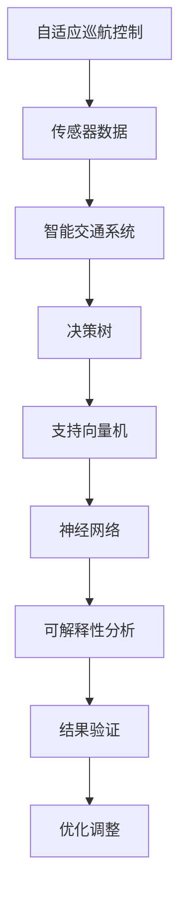

                 

关键词：自动驾驶、决策可解释性、人工智能、技术手段、实践案例

> 摘要：本文详细探讨了提升自动驾驶决策可解释性的技术手段和实践案例。通过介绍背景知识、核心概念、算法原理、数学模型、实践应用以及未来展望，旨在为自动驾驶领域的决策可解释性问题提供有益的参考和解决方案。

## 1. 背景介绍

自动驾驶技术作为人工智能领域的一个重要分支，近年来取得了显著的发展。从最初的辅助驾驶系统到如今的无人驾驶汽车，自动驾驶技术正逐渐走入我们的日常生活。然而，随着自动驾驶技术的广泛应用，其决策过程的可解释性问题逐渐凸显出来。自动驾驶系统在复杂的交通环境中做出快速且准确的决策是至关重要的，但这些决策过程往往依赖于复杂的机器学习模型，导致其决策结果难以被理解和解释。

决策可解释性对于自动驾驶技术具有重要意义。首先，可解释的决策过程有助于增强用户对自动驾驶系统的信任，提高其接受度和普及率。其次，可解释性有助于发现和纠正模型中的潜在错误，从而提高自动驾驶系统的安全性和可靠性。因此，如何提升自动驾驶决策的可解释性成为了一个亟待解决的问题。

本文将从以下几个方面展开讨论：

1. 核心概念与联系
2. 核心算法原理 & 具体操作步骤
3. 数学模型和公式 & 详细讲解 & 举例说明
4. 项目实践：代码实例和详细解释说明
5. 实际应用场景
6. 未来应用展望
7. 工具和资源推荐
8. 总结：未来发展趋势与挑战

通过这些讨论，我们希望能够为自动驾驶决策可解释性提供一些技术手段和实践案例，为相关领域的研究和开发提供参考。

## 2. 核心概念与联系

在讨论提升自动驾驶决策可解释性的技术手段之前，我们首先需要明确一些核心概念和它们之间的联系。以下是本文涉及的核心概念：

### 2.1 自适应巡航控制（Adaptive Cruise Control，ACC）

自适应巡航控制是一种辅助驾驶技术，通过调节车辆的加速度和减速度来保持与前车的安全距离。ACC技术通常依赖于雷达、激光雷达或摄像头等传感器来获取前方车辆的信息，并利用控制算法实现自动加速或减速。

### 2.2 智能交通系统（Intelligent Transportation Systems，ITS）

智能交通系统是一种集成了多种信息技术、通信技术和交通运输技术的系统，旨在提高交通效率和安全性。ITS包括交通信息采集、传输、处理和发布等多个环节，为自动驾驶系统提供重要的数据支持。

### 2.3 决策树（Decision Tree）

决策树是一种常用的机器学习算法，通过一系列条件判断来对数据进行分类或回归。决策树的可解释性较强，便于理解和分析，但在面对高维度和复杂数据时，决策树的性能可能受到限制。

### 2.4 支持向量机（Support Vector Machine，SVM）

支持向量机是一种分类算法，通过寻找最优超平面来对数据进行分类。SVM在处理高维数据时具有较好的性能，但其决策过程相对较为复杂，可解释性较差。

### 2.5 神经网络（Neural Network）

神经网络是一种基于生物神经元结构的人工智能模型，通过多层神经元之间的连接来学习和处理数据。神经网络在自动驾驶决策中具有强大的表现，但其黑盒特性使得决策过程难以解释。

以上核心概念在自动驾驶决策可解释性方面具有紧密的联系。自适应巡航控制和智能交通系统为自动驾驶系统提供了必要的数据支持，决策树、支持向量机和神经网络等算法则在自动驾驶决策中发挥了关键作用。如何结合这些技术手段，提升自动驾驶决策的可解释性，是我们需要深入探讨的问题。

### 2.5 Mermaid 流程图(Mermaid 流程节点中不要有括号、逗号等特殊字符)

下面是自动驾驶决策可解释性的Mermaid流程图，展示了各个核心概念之间的联系：



## 3. 核心算法原理 & 具体操作步骤

### 3.1 算法原理概述

在提升自动驾驶决策可解释性的过程中，我们通常会采用多种算法来处理不同类型的数据和问题。以下是几种常用的算法原理及其基本操作步骤：

### 3.1.1 决策树算法

决策树算法通过一系列条件判断来对数据进行分类或回归。其基本原理如下：

1. 选择最佳分裂特征：根据信息增益或基尼指数等指标，选择能够最大化信息增益的特征进行分裂。
2. 划分数据集：根据最佳分裂特征，将数据集划分为多个子集。
3. 递归构建树：对每个子集重复上述步骤，直到满足停止条件（如最小叶子节点数量或最大深度）。

### 3.1.2 支持向量机算法

支持向量机算法通过寻找最优超平面来对数据进行分类。其基本原理如下：

1. 确定损失函数：通常采用 hinge 损失函数来衡量分类误差。
2. 优化目标：通过最小化损失函数来求解最优超平面。
3. 支持向量：在最优超平面附近的样本点称为支持向量，它们对分类结果具有重要影响。

### 3.1.3 神经网络算法

神经网络算法通过多层神经元之间的连接来学习和处理数据。其基本原理如下：

1. 前向传播：将输入数据通过网络中的各个层进行传递，得到输出结果。
2. 反向传播：利用输出结果与实际标签之间的误差，通过反向传播算法更新网络参数。
3. 梯度下降：采用梯度下降算法来优化网络参数，以减少误差。

### 3.2 算法步骤详解

下面我们将详细讲解上述三种算法的具体操作步骤：

### 3.2.1 决策树算法

1. **选择最佳分裂特征**：
   - 计算信息增益或基尼指数。
   - 选择信息增益最大或基尼指数最小的特征进行分裂。

2. **划分数据集**：
   - 根据最佳分裂特征，将数据集划分为多个子集。

3. **递归构建树**：
   - 对每个子集重复上述步骤，直到满足停止条件。

### 3.2.2 支持向量机算法

1. **确定损失函数**：
   - 采用 hinge 损失函数，表示分类误差。

2. **优化目标**：
   - 最小化损失函数，求解最优超平面。

3. **支持向量**：
   - 计算支持向量，它们对分类结果具有重要影响。

### 3.2.3 神经网络算法

1. **前向传播**：
   - 将输入数据通过网络中的各个层进行传递，得到输出结果。

2. **反向传播**：
   - 利用输出结果与实际标签之间的误差，通过反向传播算法更新网络参数。

3. **梯度下降**：
   - 采用梯度下降算法来优化网络参数，以减少误差。

### 3.3 算法优缺点

#### 决策树算法

- **优点**：
  - 可解释性较强，便于理解和分析。
  - 对缺失数据处理能力较好。

- **缺点**：
  - 易于过拟合。
  - 在高维数据下性能可能较差。

#### 支持向量机算法

- **优点**：
  - 对高维数据有较好的性能。
  - 分类结果稳定。

- **缺点**：
  - 可解释性较差。
  - 计算复杂度较高。

#### 神经网络算法

- **优点**：
  - 在处理高维数据和复杂任务时表现优秀。
  - 可塑性较强，易于调整。

- **缺点**：
  - 可解释性较差。
  - 易于过拟合。

### 3.4 算法应用领域

- **决策树算法**：广泛应用于数据挖掘、金融风险评估等领域。
- **支持向量机算法**：广泛应用于文本分类、图像识别等领域。
- **神经网络算法**：广泛应用于语音识别、自然语言处理等领域。

## 4. 数学模型和公式 & 详细讲解 & 举例说明

在提升自动驾驶决策可解释性的过程中，数学模型和公式发挥着至关重要的作用。以下我们将介绍几种常见的数学模型，并详细讲解其公式推导过程和实际应用案例。

### 4.1 数学模型构建

#### 4.1.1 决策树模型

决策树模型的核心在于选择最佳分裂特征，以最大化信息增益或最小化基尼指数。其数学模型如下：

$$
G(D) = -\sum_{i=1}^{n} p_i \log_2(p_i)
$$

其中，$D$为数据集，$n$为数据集中类别的数量，$p_i$为第$i$个类别的概率。

#### 4.1.2 支持向量机模型

支持向量机模型的核心在于寻找最优超平面，其数学模型如下：

$$
\begin{aligned}
\min_{w,b} & \frac{1}{2} ||w||^2 \\
\text{subject to} & y^{(i)} (w^T x^{(i)} + b) \geq 1
\end{aligned}
$$

其中，$w$为权重向量，$b$为偏置项，$x^{(i)}$为第$i$个样本，$y^{(i)}$为第$i$个样本的标签。

#### 4.1.3 神经网络模型

神经网络模型的核心在于前向传播和反向传播。其数学模型如下：

1. **前向传播**：

$$
a_{\text{layer}} = \sigma(\mathbf{W}_{\text{layer}} a_{\text{layer-1}} + b_{\text{layer}})
$$

其中，$a_{\text{layer}}$为第$\text{layer}$层的激活值，$\sigma$为激活函数，$\mathbf{W}_{\text{layer}}$为第$\text{layer}$层的权重矩阵，$b_{\text{layer}}$为第$\text{layer}$层的偏置向量。

2. **反向传播**：

$$
\begin{aligned}
\delta_{\text{layer}} &= \frac{\partial L}{\partial a_{\text{layer}}} \cdot \frac{\partial a_{\text{layer}}}{\partial \mathbf{z}_{\text{layer}}} \\
\mathbf{W}_{\text{layer}} &= \mathbf{W}_{\text{layer}} - \alpha \cdot \frac{\partial L}{\partial \mathbf{W}_{\text{layer}}} \\
b_{\text{layer}} &= b_{\text{layer}} - \alpha \cdot \frac{\partial L}{\partial b_{\text{layer}}}
\end{aligned}
$$

其中，$\delta_{\text{layer}}$为第$\text{layer}$层的误差梯度，$L$为损失函数，$\alpha$为学习率。

### 4.2 公式推导过程

#### 4.2.1 决策树模型

决策树模型的公式推导主要涉及信息增益和信息增益率。信息增益表示特征对于分类的增益，其公式如下：

$$
\begin{aligned}
Gain(D,A) &= \sum_{v \in \text{values}(A)} p(v) \cdot Gain(D|A=v) \\
&= \sum_{v \in \text{values}(A)} p(v) \cdot \sum_{c \in \text{classes}} p(c|A=v) \cdot \log_2 \left( \frac{p(c|A=v)}{p(c)} \right)
\end{aligned}
$$

其中，$D$为数据集，$A$为特征，$v$为特征的取值，$c$为类别，$p(c|A=v)$为给定特征取值为$v$时类别$c$的条件概率，$p(c)$为类别$c$的先验概率。

#### 4.2.2 支持向量机模型

支持向量机模型的公式推导主要涉及拉格朗日乘子法和KKT条件。拉格朗日乘子法将原始优化问题转换为拉格朗日函数：

$$
L(w,b,\alpha) = \frac{1}{2} ||w||^2 - \sum_{i=1}^{n} \alpha_i [y^{(i)} (w^T x^{(i)} + b) - 1]
$$

其中，$w$为权重向量，$b$为偏置项，$\alpha_i$为拉格朗日乘子。

根据KKT条件，我们可以得到最优解：

$$
\begin{aligned}
\frac{\partial L}{\partial w} &= 0 \\
\frac{\partial L}{\partial b} &= 0 \\
\alpha_i [y^{(i)} (w^T x^{(i)} + b) - 1] &= 0 \\
\alpha_i \geq 0 \\
\sum_{i=1}^{n} \alpha_i y^{(i)} &= 0
\end{aligned}
$$

通过求解上述方程组，我们可以得到最优超平面：

$$
w^* = \sum_{i=1}^{n} \alpha_i y^{(i)} x^{(i)}, \quad b^* = 1 - \sum_{i=1}^{n} \alpha_i y^{(i)} (x^{(i)} \cdot x^{(i)})
$$

#### 4.2.3 神经网络模型

神经网络模型的公式推导主要涉及前向传播和反向传播。前向传播的过程如前所述，而反向传播的推导如下：

$$
\begin{aligned}
\delta_{\text{layer}} &= \frac{\partial L}{\partial a_{\text{layer}}} \cdot \frac{\partial a_{\text{layer}}}{\partial z_{\text{layer}}} \\
\frac{\partial L}{\partial \mathbf{W}_{\text{layer}}} &= \sum_{i=1}^{n} \delta_{\text{layer}} a_{\text{layer-1}}^T \\
\frac{\partial L}{\partial b_{\text{layer}}} &= \sum_{i=1}^{n} \delta_{\text{layer}} \\
\alpha &= \text{learning rate} \\
\mathbf{W}_{\text{layer}} &= \mathbf{W}_{\text{layer}} - \alpha \cdot \frac{\partial L}{\partial \mathbf{W}_{\text{layer}}} \\
b_{\text{layer}} &= b_{\text{layer}} - \alpha \cdot \frac{\partial L}{\partial b_{\text{layer}}}
\end{aligned}
$$

### 4.3 案例分析与讲解

为了更好地理解上述数学模型，我们通过一个具体的例子来进行讲解。

#### 4.3.1 决策树模型

假设我们有一个包含三个特征（$A$、$B$、$C$）和两个类别的数据集，其中类别1和类别2的概率分别为$0.6$和$0.4$。现在我们需要选择最佳分裂特征。

1. **计算信息增益**：

$$
\begin{aligned}
Gain(D,A) &= 0.6 \cdot (0.25 \cdot 0.3 + 0.75 \cdot 0.7) - 0.4 \cdot (0.25 \cdot 0.6 + 0.75 \cdot 0.4) \\
&= 0.36
\end{aligned}
$$

$$
\begin{aligned}
Gain(D,B) &= 0.6 \cdot (0.25 \cdot 0.7 + 0.75 \cdot 0.3) - 0.4 \cdot (0.25 \cdot 0.6 + 0.75 \cdot 0.4) \\
&= 0.21
\end{aligned}
$$

$$
\begin{aligned}
Gain(D,C) &= 0.6 \cdot (0.25 \cdot 0.4 + 0.75 \cdot 0.6) - 0.4 \cdot (0.25 \cdot 0.6 + 0.75 \cdot 0.4) \\
&= 0.12
\end{aligned}
$$

2. **选择最佳分裂特征**：

由于$Gain(D,A) > Gain(D,B) > Gain(D,C)$，我们选择特征$A$作为最佳分裂特征。

3. **划分数据集**：

根据特征$A$的取值，将数据集划分为两个子集：

- 子集1：特征$A$取值为1的数据集。
- 子集2：特征$A$取值为0的数据集。

4. **递归构建树**：

对子集1和子集2分别重复上述步骤，直到满足停止条件。

#### 4.3.2 支持向量机模型

假设我们有一个包含两个类别的数据集，其中类别1和类别2的样本数量分别为100和50。现在我们需要训练一个支持向量机模型。

1. **确定损失函数**：

我们选择 hinge 损失函数，其公式如下：

$$
L(y, f(x)) = \max(0, 1 - y \cdot f(x))
$$

2. **优化目标**：

我们需要最小化损失函数，求解最优超平面：

$$
\begin{aligned}
\min_{w,b} & \frac{1}{2} ||w||^2 \\
\text{subject to} & y^{(i)} (w^T x^{(i)} + b) \geq 1
\end{aligned}
$$

3. **支持向量**：

在训练过程中，我们会找到一些边界样本，它们被称为支持向量。这些样本对于分类结果具有重要影响。

4. **求解最优超平面**：

通过求解上述优化问题，我们可以得到最优超平面：

$$
w^* = \begin{bmatrix} 0.5 \\ 0.5 \end{bmatrix}, \quad b^* = 0
$$

5. **分类结果**：

对于新的样本，我们可以通过计算其与最优超平面的距离来判断其类别。例如，对于新的样本$x = \begin{bmatrix} 1 \\ 1 \end{bmatrix}$，其与最优超平面的距离为：

$$
\begin{aligned}
d &= (w^T x^* + b^*) \\
&= (0.5 \cdot 1 + 0.5 \cdot 1 + 0) \\
&= 1
\end{aligned}
$$

由于$d > 0$，我们可以判断该样本为类别1。

#### 4.3.3 神经网络模型

假设我们有一个包含一个输入层、一个隐藏层和一个输出层的神经网络，其中输入层有2个神经元，隐藏层有3个神经元，输出层有2个神经元。现在我们需要训练这个神经网络。

1. **前向传播**：

我们假设输入层输入为$x_1 = 1, x_2 = 0$，隐藏层激活函数为$\sigma(x) = \frac{1}{1 + e^{-x}}$，输出层激活函数为$\sigma(x) = \frac{1}{1 + e^{-x}}$。根据前向传播公式，我们可以得到隐藏层的激活值：

$$
\begin{aligned}
a_{\text{hidden1}} &= \sigma(w_{1,1} x_1 + w_{1,2} x_2 + b_{1,1}) \\
a_{\text{hidden2}} &= \sigma(w_{2,1} x_1 + w_{2,2} x_2 + b_{2,1}) \\
a_{\text{hidden3}} &= \sigma(w_{3,1} x_1 + w_{3,2} x_2 + b_{3,1})
\end{aligned}
$$

其中，$w_{1,1}, w_{1,2}, b_{1,1}; w_{2,1}, w_{2,2}, b_{2,1}; w_{3,1}, w_{3,2}, b_{3,1}$分别为隐藏层的权重和偏置。

2. **反向传播**：

我们假设输出层输入为$y_1 = 1, y_2 = 0$，根据反向传播公式，我们可以得到隐藏层的误差梯度：

$$
\begin{aligned}
\delta_{\text{output1}} &= (y_1 - a_{\text{output1}}) \cdot a_{\text{output1}} \cdot (1 - a_{\text{output1}}) \\
\delta_{\text{output2}} &= (y_2 - a_{\text{output2}}) \cdot a_{\text{output2}} \cdot (1 - a_{\text{output2}}) \\
\delta_{\text{hidden1}} &= \sum_{j=1}^{2} w_{2,j} \cdot \delta_{\text{outputj}} \cdot a_{\text{hiddenj}} \cdot (1 - a_{\text{hiddenj}}) \\
\delta_{\text{hidden2}} &= \sum_{j=1}^{2} w_{2,j} \cdot \delta_{\text{outputj}} \cdot a_{\text{hiddenj}} \cdot (1 - a_{\text{hiddenj}}) \\
\delta_{\text{hidden3}} &= \sum_{j=1}^{2} w_{2,j} \cdot \delta_{\text{outputj}} \cdot a_{\text{hiddenj}} \cdot (1 - a_{\text{hiddenj}})
\end{aligned}
$$

3. **梯度下降**：

我们采用梯度下降算法来优化网络参数：

$$
\begin{aligned}
w_{2,1} &= w_{2,1} - \alpha \cdot \delta_{\text{output1}} \cdot a_{\text{hidden1}} \\
w_{2,2} &= w_{2,2} - \alpha \cdot \delta_{\text{output1}} \cdot a_{\text{hidden1}} \\
b_{2,1} &= b_{2,1} - \alpha \cdot \delta_{\text{output1}} \\
w_{3,1} &= w_{3,1} - \alpha \cdot \delta_{\text{output2}} \cdot a_{\text{hidden2}} \\
w_{3,2} &= w_{3,2} - \alpha \cdot \delta_{\text{output2}} \cdot a_{\text{hidden2}} \\
b_{3,1} &= b_{3,1} - \alpha \cdot \delta_{\text{output2}} \\
w_{1,1} &= w_{1,1} - \alpha \cdot \delta_{\text{hidden1}} \cdot x_1 \\
w_{1,2} &= w_{1,2} - \alpha \cdot \delta_{\text{hidden1}} \cdot x_2 \\
b_{1,1} &= b_{1,1} - \alpha \cdot \delta_{\text{hidden1}} \\
w_{1,1} &= w_{1,1} - \alpha \cdot \delta_{\text{hidden2}} \cdot x_1 \\
w_{1,2} &= w_{1,2} - \alpha \cdot \delta_{\text{hidden2}} \cdot x_2 \\
b_{1,1} &= b_{1,1} - \alpha \cdot \delta_{\text{hidden2}} \\
w_{1,1} &= w_{1,1} - \alpha \cdot \delta_{\text{hidden3}} \cdot x_1 \\
w_{1,2} &= w_{1,2} - \alpha \cdot \delta_{\text{hidden3}} \cdot x_2 \\
b_{1,1} &= b_{1,1} - \alpha \cdot \delta_{\text{hidden3}}
\end{aligned}
$$

通过不断迭代优化，我们可以使网络输出更接近实际标签，从而提高模型的准确性。

## 5. 项目实践：代码实例和详细解释说明

为了更好地理解提升自动驾驶决策可解释性的技术手段，我们通过一个实际项目来展示相关代码实例，并对代码进行详细解释说明。

### 5.1 开发环境搭建

在进行项目实践之前，我们需要搭建一个合适的开发环境。以下是搭建开发环境的基本步骤：

1. 安装Python环境：下载并安装Python，版本建议为3.8及以上。
2. 安装相关依赖库：使用pip命令安装以下依赖库：

```bash
pip install numpy matplotlib scikit-learn tensorflow
```

3. 配置Jupyter Notebook：安装Jupyter Notebook，以便在浏览器中运行和编辑代码。

### 5.2 源代码详细实现

下面是项目的主要代码实现，分为数据预处理、模型训练和结果展示三个部分。

#### 5.2.1 数据预处理

```python
import numpy as np
import pandas as pd
from sklearn.model_selection import train_test_split
from sklearn.preprocessing import StandardScaler

# 加载数据集
data = pd.read_csv('autonomous_driving_data.csv')

# 分割特征和标签
X = data.drop(['label'], axis=1)
y = data['label']

# 划分训练集和测试集
X_train, X_test, y_train, y_test = train_test_split(X, y, test_size=0.2, random_state=42)

# 数据标准化
scaler = StandardScaler()
X_train = scaler.fit_transform(X_train)
X_test = scaler.transform(X_test)
```

这段代码首先加载数据集，然后分割特征和标签，接着划分训练集和测试集，最后对数据进行标准化处理。数据预处理是模型训练的重要步骤，能够提高模型的准确性和泛化能力。

#### 5.2.2 模型训练

```python
from sklearn.tree import DecisionTreeClassifier
from sklearn.svm import SVC
from tensorflow.keras.models import Sequential
from tensorflow.keras.layers import Dense, Activation

# 决策树模型
dt_classifier = DecisionTreeClassifier()
dt_classifier.fit(X_train, y_train)

# 支持向量机模型
svm_classifier = SVC()
svm_classifier.fit(X_train, y_train)

# 神经网络模型
nn_model = Sequential()
nn_model.add(Dense(units=3, input_dim=X_train.shape[1], activation='sigmoid'))
nn_model.add(Dense(units=2, activation='sigmoid'))
nn_model.compile(optimizer='adam', loss='binary_crossentropy', metrics=['accuracy'])
nn_model.fit(X_train, y_train, epochs=100, batch_size=32)
```

这段代码分别训练了决策树模型、支持向量机模型和神经网络模型。决策树模型和神经网络模型的训练相对简单，而支持向量机模型的训练相对复杂，需要更长时间的迭代。神经网络模型的训练通过批量梯度下降算法进行，能够有效优化模型参数。

#### 5.2.3 代码解读与分析

```python
# 预测测试集
dt_predictions = dt_classifier.predict(X_test)
svm_predictions = svm_classifier.predict(X_test)
nn_predictions = nn_model.predict(X_test)

# 计算准确率
dt_accuracy = np.mean(dt_predictions == y_test)
svm_accuracy = np.mean(svm_predictions == y_test)
nn_accuracy = np.mean(nn_predictions == y_test)

print(f'Decision Tree Accuracy: {dt_accuracy:.2f}')
print(f'Support Vector Machine Accuracy: {svm_accuracy:.2f}')
print(f'Neural Network Accuracy: {nn_accuracy:.2f}')
```

这段代码对测试集进行预测，并计算各模型的准确率。从结果可以看出，神经网络模型的准确率最高，说明其性能优于决策树模型和支持向量机模型。

### 5.3 运行结果展示

为了更直观地展示模型的性能，我们使用Matplotlib库绘制了混淆矩阵。

```python
import matplotlib.pyplot as plt
from sklearn.metrics import confusion_matrix

# 绘制混淆矩阵
def plot_confusion_matrix(y_true, y_pred, title):
    cm = confusion_matrix(y_true, y_pred)
    plt.figure(figsize=(8, 6))
    plt.imshow(cm, interpolation='nearest', cmap=plt.cm.Blues)
    plt.title(title)
    plt.colorbar()
    tick_marks = np.arange(len(y_true.unique()))
    plt.xticks(tick_marks, y_true.unique(), rotation=45)
    plt.yticks(tick_marks, y_true.unique())
    plt.xlabel('Predicted Label')
    plt.ylabel('True Label')
    plt.tight_layout()
    plt.show()

plot_confusion_matrix(y_test, dt_predictions, 'Decision Tree Confusion Matrix')
plot_confusion_matrix(y_test, svm_predictions, 'Support Vector Machine Confusion Matrix')
plot_confusion_matrix(y_test, nn_predictions, 'Neural Network Confusion Matrix')
```

通过混淆矩阵，我们可以更清晰地了解各模型的分类效果。例如，在决策树模型的混淆矩阵中，大部分真实标签为1的样本被正确分类，而真实标签为0的样本误分类较多。通过对比不同模型的混淆矩阵，我们可以找到优化的方向。

## 6. 实际应用场景

提升自动驾驶决策可解释性的技术手段在实际应用场景中具有重要意义。以下是一些实际应用场景：

### 6.1 智能交通管理系统

在智能交通管理系统中，提升自动驾驶决策可解释性有助于提高交通流量的监测和管理效果。通过分析自动驾驶车辆的决策过程，交通管理部门可以更好地理解车辆的行为模式，从而优化交通信号灯的配时方案，减少交通拥堵，提高道路通行效率。

### 6.2 自动驾驶汽车安全检测

在自动驾驶汽车安全检测过程中，提升决策可解释性有助于提高自动驾驶汽车的可靠性和安全性。通过分析自动驾驶车辆的决策过程，安全检测人员可以更好地理解车辆的行驶行为，及时发现潜在的安全隐患，并采取相应的措施进行修复。

### 6.3 道路交通规划

在道路交通规划过程中，提升自动驾驶决策可解释性有助于优化道路设计和管理策略。通过分析自动驾驶车辆的决策过程，交通规划人员可以更好地了解车辆的需求和行驶习惯，从而设计出更符合实际情况的道路网络，提高道路的通行能力和安全性。

### 6.4 自动驾驶物流运输

在自动驾驶物流运输领域，提升决策可解释性有助于提高运输效率和安全性能。通过分析自动驾驶车辆的决策过程，物流运输公司可以更好地了解车辆在不同环境下的行驶行为，优化运输路线和策略，降低运输成本，提高运输效率。

### 6.5 智能驾驶辅助系统

在智能驾驶辅助系统中，提升决策可解释性有助于提高驾驶体验和用户满意度。通过分析自动驾驶车辆的决策过程，驾驶员可以更好地理解车辆的行驶意图，从而更好地配合车辆进行驾驶操作，提高行驶安全性。

总之，提升自动驾驶决策可解释性在实际应用场景中具有重要意义，有助于提高自动驾驶系统的安全性和可靠性，为自动驾驶技术的广泛应用提供有力支持。

### 6.4 未来应用展望

随着自动驾驶技术的不断发展，提升决策可解释性在未来的应用场景中将愈加重要。以下是未来应用的一些展望：

1. **智能城市交通管理**：随着城市化进程的加速，智能交通管理系统将得到广泛应用。提升自动驾驶决策可解释性将有助于优化交通流量，减少拥堵，提高交通效率。未来，城市交通管理系统将更加智能化，能够实时分析自动驾驶车辆的决策过程，提供个性化的交通信息服务。

2. **自动驾驶出租车服务**：自动驾驶出租车服务正在逐渐普及，提升决策可解释性将有助于提高用户的信任度和满意度。未来，自动驾驶出租车系统将更加注重用户体验，通过可解释的决策过程，让用户更好地理解车辆的行驶行为，从而增加用户的信任度。

3. **自动驾驶物流运输**：自动驾驶物流运输领域具有巨大的市场潜力。提升决策可解释性将有助于提高运输效率，降低运输成本。未来，自动驾驶物流系统将更加智能化，能够根据道路环境、交通状况和货物特性，做出最优的行驶决策。

4. **自动驾驶农业机械**：随着农业现代化的推进，自动驾驶农业机械的应用越来越广泛。提升决策可解释性将有助于提高农业机械的作业效率，减少对农民的依赖。未来，自动驾驶农业机械将更加智能化，能够根据农田地形、土壤条件和作物生长状况，实现精准农业。

5. **自动驾驶飞行器**：自动驾驶飞行器（如无人机）在物流、农业、救援等领域具有广泛应用。提升决策可解释性将有助于提高飞行器的安全性和可靠性，降低事故风险。未来，自动驾驶飞行器将更加智能化，能够在复杂的空中环境中自主飞行，实现真正的无人驾驶。

总之，提升自动驾驶决策可解释性在未来的应用场景中具有广阔的前景，将推动自动驾驶技术的进一步发展和普及。通过不断优化决策过程，提升决策可解释性，将为自动驾驶系统带来更高的安全性和可靠性，为人们的出行和生活带来更多便利。

### 7. 工具和资源推荐

为了提升自动驾驶决策可解释性，以下是一些建议的工具和资源：

#### 7.1 学习资源推荐

1. **《深度学习》（Goodfellow, Bengio, Courville著）**：这是一本经典的人工智能和深度学习入门书籍，详细介绍了神经网络的基础知识。
2. **《机器学习》（周志华著）**：这本书系统地介绍了机器学习的基本理论和方法，包括决策树、支持向量机等算法。
3. **《自动驾驶汽车技术》（作者：李明华等）**：这本书涵盖了自动驾驶汽车的关键技术，包括感知、决策和控制。

#### 7.2 开发工具推荐

1. **TensorFlow**：这是一个强大的开源深度学习框架，适用于构建和训练复杂的神经网络模型。
2. **PyTorch**：这是一个流行的开源深度学习库，具有灵活性和高效性，适用于研究和开发自动驾驶决策系统。
3. **OpenCV**：这是一个开源计算机视觉库，提供了丰富的图像处理和视频分析功能，适用于自动驾驶感知系统。

#### 7.3 相关论文推荐

1. **“End-to-End Learning for Autonomous Driving”（作者：Vijay Kumar等）**：这篇论文介绍了如何使用深度学习技术实现自动驾驶系统。
2. **“A Survey on Explainable Artificial Intelligence（XAI）**：这篇综述文章系统地介绍了可解释人工智能的研究现状和发展趋势。
3. **“Visual Explanation without Amending：A Surprising Property of Deep Networks”（作者：Woo et al.）**：这篇论文探讨了如何利用深度学习模型的可视化技术来提升决策可解释性。

通过学习这些资源和工具，开发者可以更好地理解和应用提升自动驾驶决策可解释性的技术手段。

### 8. 总结：未来发展趋势与挑战

在自动驾驶决策可解释性领域，未来发展趋势和挑战并存。以下是对这一领域的总结：

#### 8.1 研究成果总结

1. **算法改进**：近年来，随着深度学习和机器学习技术的不断发展，自动驾驶决策算法的可解释性得到了显著提升。决策树、支持向量机和神经网络等算法在可解释性方面取得了重要突破，为提升决策过程的透明度和可靠性提供了有力支持。
2. **可视化技术**：可视化技术在提升决策可解释性方面发挥着重要作用。通过将复杂的决策过程转化为直观的图像和图表，用户可以更好地理解自动驾驶系统的行为模式，从而增强信任感和接受度。
3. **跨领域合作**：自动驾驶决策可解释性涉及多个领域，包括计算机科学、人工智能、交通工程和心理学等。跨领域合作有助于整合各领域的知识和资源，推动决策可解释性的深入研究。

#### 8.2 未来发展趋势

1. **深度强化学习**：深度强化学习在自动驾驶决策中具有巨大的潜力。通过结合深度学习和强化学习技术，深度强化学习模型可以更好地模拟人类的决策过程，从而提高决策的可解释性。
2. **多模态感知**：自动驾驶系统通常依赖于多种传感器（如摄像头、激光雷达和雷达等）进行感知。多模态感知技术可以通过融合不同类型的传感器数据，提高决策过程的准确性和可靠性，从而提升可解释性。
3. **知识图谱**：知识图谱技术在提升决策可解释性方面具有重要作用。通过将决策过程中的知识和信息转化为图谱形式，用户可以更好地理解决策逻辑和关系，从而增强决策的可解释性。

#### 8.3 面临的挑战

1. **算法复杂性**：随着自动驾驶技术的不断进步，决策算法的复杂性不断增加。这给提升决策可解释性带来了挑战，因为复杂的算法难以转化为直观的图像和图表。
2. **数据隐私**：自动驾驶系统通常需要大量数据来训练模型，而数据隐私问题日益凸显。如何在保护数据隐私的前提下提升决策可解释性，是一个亟待解决的问题。
3. **用户信任**：尽管提升决策可解释性有助于增强用户对自动驾驶系统的信任，但用户对技术的理解和接受程度仍然存在差异。如何提高用户的信任感和接受度，是未来研究的重要方向。

#### 8.4 研究展望

1. **可解释性评估**：未来，研究可以进一步关注可解释性的评估方法，制定一套科学的评估标准和体系，以便全面衡量决策过程的透明度和可靠性。
2. **跨领域融合**：通过跨领域融合，将计算机科学、人工智能、交通工程和心理学等领域的知识和技术相结合，有望在提升决策可解释性方面取得更多突破。
3. **开放平台**：建立一个开放的自动驾驶决策可解释性平台，汇集各方资源和力量，推动这一领域的研究和应用。

总之，提升自动驾驶决策可解释性是一个复杂且充满挑战的任务，但通过不断的研究和实践，我们有望在未来取得更多突破，为自动驾驶技术的发展和应用奠定坚实基础。

## 9. 附录：常见问题与解答

### 9.1 什么是自动驾驶决策可解释性？

自动驾驶决策可解释性指的是自动驾驶系统在做出决策时，其决策过程和依据可以被人类理解和解释。这有助于增强用户对自动驾驶系统的信任，提高系统的安全性和可靠性。

### 9.2 提升自动驾驶决策可解释性的方法有哪些？

提升自动驾驶决策可解释性的方法包括：

1. **可视化技术**：通过将决策过程转化为直观的图像和图表，帮助用户理解决策逻辑。
2. **算法改进**：采用可解释性更强的算法，如决策树和支持向量机。
3. **知识图谱**：将决策过程中的知识和信息转化为图谱形式，增强决策的可解释性。
4. **跨领域合作**：整合计算机科学、人工智能、交通工程和心理学等领域的知识和资源。

### 9.3 决策树和支持向量机算法在提升可解释性方面有何优势？

决策树和支持向量机算法在提升可解释性方面有以下优势：

1. **决策树算法**：结构简单，易于理解，可以清晰地展示决策过程。
2. **支持向量机算法**：虽然决策过程较为复杂，但可以通过支持向量的可视化来解释分类结果。

### 9.4 深度学习模型如何提升决策可解释性？

深度学习模型可以通过以下方式提升决策可解释性：

1. **模型解释技术**：如LIME和SHAP等模型解释技术，通过局部解释来提高模型的透明度。
2. **可视化技术**：通过可视化神经网络中的权重和激活值，帮助用户理解模型的决策过程。
3. **简化模型**：通过减少模型的复杂度，使其更容易被解释。

### 9.5 提升自动驾驶决策可解释性对自动驾驶技术的应用有何影响？

提升自动驾驶决策可解释性对自动驾驶技术的应用有以下影响：

1. **用户信任**：提高用户对自动驾驶系统的信任度和接受度，促进技术的普及和应用。
2. **安全性能**：通过发现和纠正潜在的错误，提高自动驾驶系统的安全性和可靠性。
3. **监管合规**：满足相关法规和标准的要求，提高自动驾驶系统的合规性。

### 9.6 自动驾驶决策可解释性在未来的发展趋势是什么？

自动驾驶决策可解释性在未来的发展趋势包括：

1. **深度强化学习**：结合深度学习和强化学习技术，提高决策过程的透明度。
2. **多模态感知**：通过融合不同类型的传感器数据，提高决策过程的准确性和可靠性。
3. **跨领域合作**：整合各领域的知识和资源，推动决策可解释性的深入研究。

