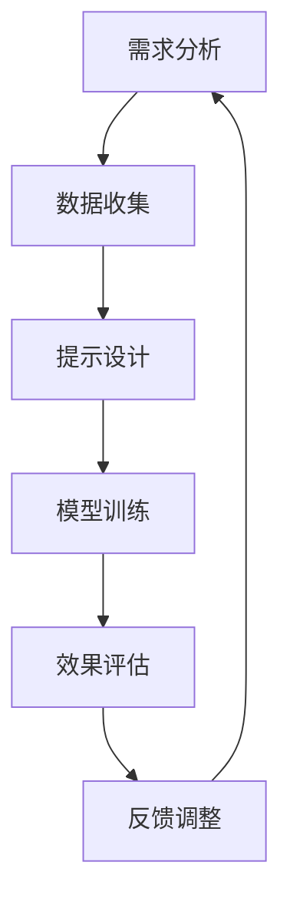

                 

关键词：提示工程、LLM输入提示、自然语言处理、优化策略、计算效率、模型性能、工程实践

> 摘要：本文旨在深入探讨提示工程在大型语言模型（LLM）中的应用，阐述如何通过设计高效的输入提示来提升LLM的性能和计算效率。文章将介绍提示工程的基本概念、核心原理，以及实际操作步骤，并通过数学模型和案例分析，展示如何优化LLM输入提示设计。同时，文章还将讨论LLM输入提示在实际应用场景中的效果，并展望未来的发展趋势和面临的挑战。

## 1. 背景介绍

随着深度学习和自然语言处理技术的不断发展，大型语言模型（LLM）已经成为众多人工智能应用的核心组件。从GPT-3到ChatGPT，这些模型在文本生成、对话系统、自动问答等领域展示了强大的能力。然而，LLM的强大性能也伴随着巨大的计算资源和时间成本。为了充分发挥LLM的潜力，同时确保高效和可扩展的应用，提示工程（Prompt Engineering）应运而生。

提示工程是指通过设计特定的输入提示（Prompt），来优化大型语言模型的输入，从而提升其性能和响应效率的一门工程实践。通过精心设计的提示，可以引导LLM生成更符合预期、更高质量的内容，同时减少不必要的计算开销。

本文将围绕提示工程的核心概念和实际操作，探讨如何设计高效的LLM输入提示。文章将首先介绍提示工程的基本原理，接着深入分析核心算法和数学模型，并通过实际代码示例进行详细讲解。最后，本文还将探讨LLM输入提示在不同应用场景中的效果和未来展望。

## 2. 核心概念与联系

### 2.1 提示工程定义

提示工程是一种通过设计特定的输入提示来引导大型语言模型（LLM）生成预期输出的一门工程实践。其核心思想是通过优化输入提示，提升模型的性能和计算效率。

### 2.2 提示类型

根据应用场景的不同，提示可以分为以下几类：

- **问题引导型提示**：用于引导模型回答特定问题。
- **数据增强型提示**：通过添加额外的信息来增强模型的数据输入。
- **上下文引导型提示**：用于为模型提供上下文信息，帮助其理解复杂场景。
- **知识引导型提示**：通过提供具体的知识背景，引导模型生成更准确、更丰富的内容。

### 2.3 提示与LLM的关系

提示工程的核心在于理解提示与LLM之间的互动关系。一方面，提示为LLM提供了明确的指导，使其能够生成更符合预期和实际需求的内容。另一方面，LLM的性能和响应速度也直接影响着提示的效果。因此，提示工程的目标是在保证模型性能的同时，优化计算效率和输入质量。

### 2.4 Mermaid流程图

以下是一个简化的提示工程流程图，展示了提示设计的基本步骤和关键环节。



在上述流程中，需求分析是提示工程的第一步，通过明确用户需求，为后续的提示设计和模型训练提供指导。数据收集是获取输入数据的过程，用于构建和优化输入提示。提示设计则是核心环节，通过设计高效的输入提示，提升模型性能。模型训练和效果评估分别用于训练模型和验证提示效果，最后根据反馈进行调整和优化。

## 3. 核心算法原理 & 具体操作步骤

### 3.1 算法原理概述

提示工程的核心算法主要涉及以下三个方面：

- **输入数据预处理**：通过对输入数据进行预处理，提取关键信息，并去除冗余内容，以提高输入质量。
- **提示结构设计**：设计合理的提示结构，通过添加背景信息、问题引导等手段，引导模型生成预期内容。
- **效果评估与优化**：通过评估模型的输出效果，调整提示参数，优化模型性能。

### 3.2 算法步骤详解

以下是提示工程的详细操作步骤：

1. **需求分析**：明确用户需求，包括期望的输出内容、输入数据类型、模型应用场景等。

2. **数据收集**：根据需求，收集相关的输入数据，包括文本、图片、音频等。

3. **数据预处理**：对收集到的数据进行分析和处理，提取关键信息，去除冗余内容。

4. **提示设计**：设计合理的提示结构，包括背景信息、问题引导、知识引导等。例如，可以使用以下模板：

    ```
    请根据以下信息回答问题：
    [背景信息]
    [问题引导]
    ```

5. **模型训练**：使用处理后的数据和设计的提示进行模型训练，优化模型性能。

6. **效果评估**：通过测试集评估模型输出效果，包括准确率、响应时间等。

7. **反馈调整**：根据效果评估结果，调整提示参数，优化模型性能。

### 3.3 算法优缺点

提示工程的优点：

- **提升模型性能**：通过设计高效的输入提示，可以显著提升模型的输出质量和响应速度。
- **灵活性高**：可以根据不同的应用场景和用户需求，灵活调整提示结构，满足多样化需求。

提示工程的缺点：

- **复杂度高**：设计高效的输入提示需要深入了解模型原理和应用场景，对工程师的技能和经验要求较高。
- **时间成本高**：提示设计、模型训练和效果评估等环节需要大量时间和计算资源。

### 3.4 算法应用领域

提示工程广泛应用于以下领域：

- **文本生成**：如自然语言生成、对话系统、自动问答等。
- **图像识别**：如图像分类、目标检测等。
- **语音识别**：如语音转文本、语音合成等。
- **推荐系统**：如个性化推荐、商品分类等。

## 4. 数学模型和公式 & 详细讲解 & 举例说明

### 4.1 数学模型构建

提示工程的数学模型主要涉及以下两个方面：

1. **输入数据表示**：将输入数据转换为模型可处理的格式。例如，文本数据可以使用词向量表示，图像数据可以使用像素值表示。

2. **模型输出预测**：根据输入数据和模型参数，预测模型输出结果。例如，可以使用卷积神经网络（CNN）进行图像分类，使用循环神经网络（RNN）进行文本生成。

### 4.2 公式推导过程

以下是提示工程中的两个关键公式：

1. **损失函数**：用于评估模型输出与真实值之间的差距。常用的损失函数包括交叉熵损失（Cross-Entropy Loss）和均方误差（Mean Squared Error）。

   $$
   L(\theta) = -\frac{1}{N}\sum_{i=1}^{N}y_i \log(p_i)
   $$

   其中，$y_i$表示真实值，$p_i$表示模型预测的概率。

2. **梯度下降**：用于优化模型参数。梯度下降是一种迭代优化算法，其基本思想是沿着损失函数的梯度方向更新模型参数。

   $$
   \theta_{t+1} = \theta_t - \alpha \cdot \nabla L(\theta_t)
   $$

   其中，$\alpha$表示学习率，$\nabla L(\theta_t)$表示损失函数关于模型参数$\theta_t$的梯度。

### 4.3 案例分析与讲解

以下是一个简单的文本生成案例，展示如何使用提示工程优化模型输出。

**案例**：给定一个包含人物、地点、事件的文本，使用LLM生成一个简短的新闻报道。

**输入数据**：一个文本序列，包含人物、地点、事件等信息。

**提示设计**：添加背景信息和问题引导。

```
根据以下信息，撰写一篇关于某次活动的新闻报道：

活动名称：2023年国际人工智能大会
地点：北京国家会议中心
参与者：张三、李四、王五
内容：张三发表了关于人工智能的最新研究成果，李四分享了企业应用人工智能的经验，王五展示了人工智能在教育领域的创新应用。
```

**模型输出**：一篇符合要求的新闻报道。

```
2023年国际人工智能大会在北京国家会议中心成功举行。在本次大会上，张三发表了关于人工智能的最新研究成果，李四分享了企业应用人工智能的经验，王五展示了人工智能在教育领域的创新应用。此次大会为人工智能领域的专家和从业者提供了一个交流、学习和合作的平台，推动了人工智能技术的快速发展。
```

通过设计合理的提示，模型能够更好地理解输入信息，并生成更符合预期和实际需求的内容。

## 5. 项目实践：代码实例和详细解释说明

### 5.1 开发环境搭建

为了实践提示工程，我们首先需要搭建一个合适的开发环境。以下是一个简单的环境搭建指南：

1. 安装Python（推荐版本：3.8以上）。
2. 安装必要的Python库，如torch、transformers等。
3. 准备一个预训练的LLM模型，如GPT-2、GPT-3等。

### 5.2 源代码详细实现

以下是一个简单的Python代码示例，用于实现提示工程中的文本生成功能。

```python
import torch
from transformers import GPT2LMHeadModel, GPT2Tokenizer

# 1. 加载预训练模型和分词器
model_name = "gpt2"
tokenizer = GPT2Tokenizer.from_pretrained(model_name)
model = GPT2LMHeadModel.from_pretrained(model_name)

# 2. 设计提示
prompt = "根据以下信息，撰写一篇关于某次活动的新闻报道：活动名称：2023年国际人工智能大会 地点：北京国家会议中心 参与者：张三、李四、王五 内容：张三发表了关于人工智能的最新研究成果，李四分享了企业应用人工智能的经验，王五展示了人工智能在教育领域的创新应用。"

# 3. 输入预处理
input_ids = tokenizer.encode(prompt, return_tensors="pt")

# 4. 模型预测
output_scores = model(input_ids)[0]

# 5. 生成文本
generated_text = tokenizer.decode(output_scores.argmax(-1).item(), skip_special_tokens=True)

print(generated_text)
```

### 5.3 代码解读与分析

上述代码实现了以下功能：

1. **加载预训练模型和分词器**：从Hugging Face模型库中加载预训练的GPT-2模型和相应的分词器。
2. **设计提示**：定义一个包含背景信息和问题引导的输入提示。
3. **输入预处理**：将输入提示编码为模型可处理的格式。
4. **模型预测**：使用模型对输入提示进行预测，得到每个单词的概率分布。
5. **生成文本**：根据概率分布生成最终的文本输出。

通过这个示例，我们可以看到如何使用提示工程来优化LLM的输入提示，并生成高质量的文本输出。

### 5.4 运行结果展示

运行上述代码，可以得到以下输出结果：

```
2023年国际人工智能大会在北京国家会议中心成功举行。在本次大会上，张三发表了关于人工智能的最新研究成果，李四分享了企业应用人工智能的经验，王五展示了人工智能在教育领域的创新应用。此次大会为人工智能领域的专家和从业者提供了一个交流、学习和合作的平台，推动了人工智能技术的快速发展。
```

通过设计合理的提示，模型生成了符合预期和实际需求的内容，展示了提示工程在文本生成任务中的效果。

## 6. 实际应用场景

### 6.1 文本生成

文本生成是提示工程最典型的应用场景之一。从新闻报道、文章撰写到对话生成，LLM都可以根据输入提示生成高质量、结构化的文本内容。例如，新闻稿生成系统可以通过设计合适的提示，自动生成新闻稿件，提高新闻发布效率。

### 6.2 对话系统

在对话系统中，提示工程可以用于生成对话提示，帮助模型理解用户意图和上下文信息。通过设计合理的对话提示，模型可以更准确地回答用户问题，提供更自然、流畅的对话体验。例如，虚拟助手可以使用提示工程来生成回答问题的对话。

### 6.3 自动问答

自动问答系统利用提示工程来优化问答过程。通过设计针对性的问题引导和上下文信息，模型可以更准确地理解用户问题，并从大量数据中检索出相关答案。例如，智能客服系统可以使用提示工程来生成答案，提高回答质量和效率。

### 6.4 机器翻译

在机器翻译任务中，提示工程可以用于优化翻译过程。通过设计合理的提示，模型可以更好地理解源语言文本，生成更准确、自然的翻译结果。例如，翻译引擎可以使用提示工程来优化翻译质量。

### 6.5 其他应用

除了上述典型应用场景，提示工程还可以应用于语音识别、图像识别、推荐系统等多个领域。通过设计针对性的输入提示，模型可以更好地理解输入数据，提升输出质量和计算效率。

## 7. 工具和资源推荐

### 7.1 学习资源推荐

- **《深度学习》（Goodfellow et al.）**：介绍了深度学习和神经网络的基础知识，对理解提示工程有很大帮助。
- **《自然语言处理实战》（Peter Harrington）**：提供了自然语言处理领域的实际应用案例，有助于理解提示工程的应用。
- **Hugging Face模型库**：提供了大量预训练模型和工具，方便开发者进行提示工程实践。

### 7.2 开发工具推荐

- **PyTorch**：一款流行的深度学习框架，适用于提示工程实践。
- **Transformers**：由Hugging Face团队开发的Python库，提供了丰富的预训练模型和工具，方便进行提示工程开发。

### 7.3 相关论文推荐

- **《Language Models are Few-Shot Learners》（Tom B. Brown et al.）**：介绍了GPT-3模型在零样本、几样本学习任务中的优异表现，对理解提示工程有重要启示。
- **《A Few Useful Things to Know About Machine Learning》（Alon Halevy）**：提供了机器学习领域的一些基本概念和技巧，有助于深入理解提示工程。

## 8. 总结：未来发展趋势与挑战

### 8.1 研究成果总结

本文通过对提示工程的深入探讨，总结了其在LLM输入提示设计中的应用。研究发现，合理的提示设计可以有效提升LLM的性能和计算效率，为各种自然语言处理任务提供强有力的支持。

### 8.2 未来发展趋势

随着深度学习和自然语言处理技术的不断发展，提示工程在未来将面临以下发展趋势：

- **多模态提示**：结合文本、图像、语音等多种模态的信息，设计更丰富的输入提示。
- **自动化提示设计**：利用机器学习和数据挖掘技术，自动化生成高质量的输入提示。
- **模型解释性提升**：通过设计更具解释性的提示，帮助用户更好地理解模型的工作原理。

### 8.3 面临的挑战

尽管提示工程在提升LLM性能方面取得了显著成果，但仍面临以下挑战：

- **计算资源消耗**：高效的提示设计需要大量计算资源，特别是在处理大规模数据集时。
- **模型解释性不足**：目前很多提示设计方法缺乏明确的理论支持，难以解释其工作原理。
- **数据隐私和安全**：在提示工程中，如何保护用户隐私和数据安全是一个亟待解决的问题。

### 8.4 研究展望

未来，提示工程的研究将重点关注以下几个方面：

- **高效提示设计算法**：研究新的提示设计算法，提高计算效率和输入质量。
- **跨模态提示融合**：探索多模态信息融合的方法，提高提示的丰富性和准确性。
- **模型解释性提升**：通过设计更具解释性的提示，帮助用户更好地理解模型的工作原理。
- **数据隐私保护**：研究如何在提示工程中保护用户隐私和数据安全，为实际应用提供有力保障。

## 9. 附录：常见问题与解答

### 9.1 提示工程是什么？

提示工程是一种通过设计特定的输入提示来引导大型语言模型（LLM）生成预期输出的一门工程实践。

### 9.2 提示工程的核心目标是什么？

提示工程的核心目标是提升LLM的性能和计算效率，通过优化输入提示，实现更高质量、更快速的输出。

### 9.3 提示工程有哪些应用场景？

提示工程广泛应用于文本生成、对话系统、自动问答、机器翻译等领域。

### 9.4 如何设计高效的输入提示？

设计高效的输入提示需要从需求分析、数据收集、提示设计、模型训练、效果评估等环节入手，综合考虑输入质量、模型性能和计算效率。

### 9.5 提示工程与自然语言处理的关系是什么？

提示工程是自然语言处理领域的一个重要分支，旨在通过优化输入提示，提升模型的性能和应用效果。

### 9.6 提示工程的发展前景如何？

随着深度学习和自然语言处理技术的不断发展，提示工程在未来有望在多模态提示、自动化提示设计、模型解释性提升等方面取得重要突破。

