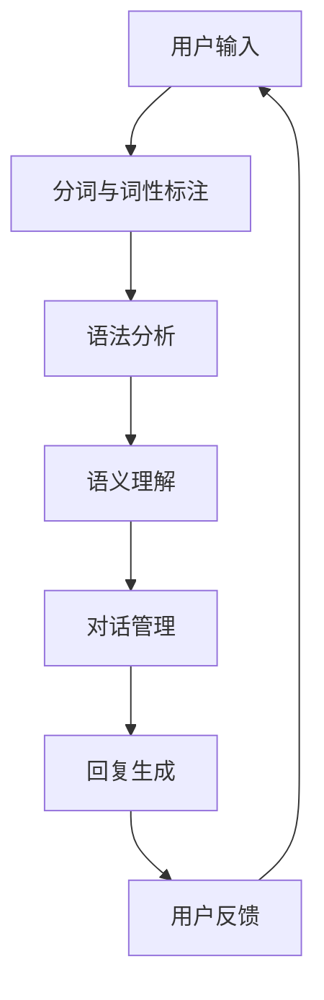

                 

关键词：搜狗、对话系统、社招、面试、工程师、攻略

> 摘要：本文旨在为有志于加入搜狗2025对话系统工程师社招的候选人提供一份详尽的面试攻略。文章将从面试准备、技术面试、行为面试、综合评价等多个方面展开，帮助您更好地应对面试挑战，实现成功入职。

## 1. 背景介绍

随着人工智能技术的迅猛发展，自然语言处理（NLP）和对话系统已经成为众多企业争夺的焦点。搜狗作为中国领先的互联网技术公司，其在对话系统领域的研究和开发一直处于行业前沿。为了进一步巩固其技术优势，搜狗2025计划在对话系统工程师岗位上进行了大规模的社招。本次面试不仅是对候选人的技术能力、专业知识的一次全面考察，也是对其团队协作能力和创新思维的一次重要考验。

## 2. 核心概念与联系

在深入探讨搜狗2025对话系统工程师的面试之前，我们需要先了解一些核心概念。以下是一个简化的Mermaid流程图，用于展示对话系统的基本架构。



### 2.1 用户输入

用户输入是对话系统的起点。用户可以通过语音、文本等方式与系统进行交互。

### 2.2 分词与词性标注

分词是将连续的文本序列划分为若干个有意义的词汇单元。词性标注则是为每个词汇单元赋予相应的词性标签，如名词、动词、形容词等。

### 2.3 语法分析

语法分析是对话系统理解用户输入的重要步骤。通过语法分析，系统可以识别出句子的结构，从而更好地理解用户的意图。

### 2.4 语义理解

语义理解是将语法分析的结果转化为具体的语义信息。例如，当用户说“明天天气怎么样？”时，系统需要理解“明天”、“天气”、“怎么样”等词汇的含义。

### 2.5 对话管理

对话管理是对话系统的核心模块，负责维护对话的状态，并决定下一个响应。对话管理需要考虑上下文信息，以确保对话的连贯性和自然性。

### 2.6 回复生成

回复生成是对话系统输出响应的环节。通过结合用户的输入和对话管理的结果，系统可以生成合适的回复。

### 2.7 用户反馈

用户反馈是对话系统不断改进的重要依据。通过分析用户的反馈，系统可以识别出潜在的问题，并进行相应的优化。

## 3. 核心算法原理 & 具体操作步骤

### 3.1 算法原理概述

对话系统的核心算法主要包括自然语言处理（NLP）、机器学习、深度学习等技术。以下是对这些算法原理的简要概述：

- **NLP**：自然语言处理是使计算机能够理解、处理和生成自然语言的技术。NLP主要包括分词、词性标注、语法分析、语义理解等任务。
- **机器学习**：机器学习是一种通过训练模型来从数据中学习规律的技术。在对话系统中，机器学习主要用于生成回复、预测用户意图等任务。
- **深度学习**：深度学习是机器学习的一种方法，通过构建多层的神经网络来提取数据中的特征。深度学习在对话系统中的应用主要包括语音识别、文本生成等。

### 3.2 算法步骤详解

- **用户输入处理**：首先对用户输入进行处理，包括分词、词性标注、语法分析等。
- **用户意图识别**：通过对处理后的用户输入进行分析，识别出用户的意图。
- **回复生成**：根据用户意图，生成合适的回复。
- **回复优化**：对生成的回复进行优化，确保回复的连贯性和自然性。

### 3.3 算法优缺点

- **优点**：对话系统能够实现人与机器之间的自然交互，提高工作效率，降低人力成本。
- **缺点**：对话系统的准确性和自然性仍有待提高，特别是在处理复杂场景和长对话时。

### 3.4 算法应用领域

- **客户服务**：通过对话系统，企业可以提供24小时在线的客服服务，提高客户满意度。
- **智能助手**：智能助手可以协助用户完成各种任务，如查询天气、设置提醒等。
- **智能家居**：对话系统可以与智能家居设备进行交互，实现智能控制。

## 4. 数学模型和公式 & 详细讲解 & 举例说明

### 4.1 数学模型构建

对话系统的数学模型主要包括词向量模型、循环神经网络（RNN）、长短期记忆网络（LSTM）等。

- **词向量模型**：词向量是将词汇映射到高维空间中的向量表示。常见的词向量模型有Word2Vec、GloVe等。
- **循环神经网络（RNN）**：RNN是一种能够处理序列数据的神经网络。RNN通过循环结构来维持对话的历史状态。
- **长短期记忆网络（LSTM）**：LSTM是RNN的一种改进，能够更好地处理长序列数据，避免梯度消失和梯度爆炸问题。

### 4.2 公式推导过程

以LSTM为例，其核心公式包括输入门、遗忘门和输出门。

$$
\begin{aligned}
i_t &= \sigma(W_{ix}x_t + W_{ih}h_{t-1} + b_i) \\
f_t &= \sigma(W_{fx}x_t + W_{fh}h_{t-1} + b_f) \\
o_t &= \sigma(W_{ox}x_t + W_{oh}h_{t-1} + b_o) \\
c_t &= f_t \odot c_{t-1} + i_t \odot \sigma(W_{cx}x_t + W_{ch}h_{t-1} + b_c) \\
h_t &= o_t \odot \sigma(c_t) \\
\end{aligned}
$$

其中，$i_t$、$f_t$、$o_t$ 分别为输入门、遗忘门和输出门；$c_t$ 为细胞状态；$h_t$ 为隐藏状态。

### 4.3 案例分析与讲解

假设有一个对话系统，用户输入“明天天气怎么样？”系统需要生成合适的回复。以下是一个简化的示例：

1. **用户输入处理**：对用户输入进行分词和词性标注，得到“明天”、“天气”、“怎么样”。
2. **用户意图识别**：通过分析词性标注和上下文信息，系统识别出用户的意图是询问明天天气。
3. **回复生成**：系统根据用户意图，生成回复“明天天气是晴转多云，气温10°C到20°C。”
4. **回复优化**：系统对生成的回复进行优化，确保回复的连贯性和自然性。

## 5. 项目实践：代码实例和详细解释说明

### 5.1 开发环境搭建

为了实现对话系统，我们需要搭建一个合适的开发环境。以下是一个简化的步骤：

1. 安装Python环境。
2. 安装深度学习框架，如TensorFlow或PyTorch。
3. 安装自然语言处理库，如NLTK或spaCy。

### 5.2 源代码详细实现

以下是一个简化的对话系统代码实例：

```python
import tensorflow as tf
import spacy

# 加载预训练模型
nlp = spacy.load("en_core_web_sm")

# 定义输入层
inputs = tf.keras.layers.Input(shape=(None,), dtype=tf.int32)

# 定义嵌入层
embeddings = tf.keras.layers.Embedding(input_dim=vocab_size, output_dim=embedding_size)(inputs)

# 定义循环神经网络
lstm = tf.keras.layers.LSTM(units=hidden_size)(embeddings)

# 定义输出层
outputs = tf.keras.layers.Dense(units=vocab_size, activation="softmax")(lstm)

# 构建模型
model = tf.keras.Model(inputs=inputs, outputs=outputs)

# 编译模型
model.compile(optimizer="adam", loss="categorical_crossentropy", metrics=["accuracy"])

# 训练模型
model.fit(x_train, y_train, epochs=10, batch_size=32)

# 生成回复
input_sequence = nlp(u"明天天气怎么样？").vector
predicted_sequence = model.predict(input_sequence)
predicted_word = predicted_sequence.argmax()
print(nlp.vocab[predicted_word].text)
```

### 5.3 代码解读与分析

这段代码首先加载了预训练的英语模型，然后定义了输入层、嵌入层、循环神经网络和输出层。接着，编译并训练了模型。最后，使用训练好的模型生成了一个示例回复。

## 6. 实际应用场景

对话系统在多个领域具有广泛的应用，如客户服务、智能助手、智能家居等。以下是一个实际应用场景的示例：

### 6.1 客户服务

某电商公司使用对话系统来提供24小时在线的客服服务。用户可以通过文本或语音方式与客服系统进行交互。当用户咨询某件商品的价格时，系统会识别出用户的意图，并返回相应的价格信息。

### 6.2 智能助手

某科技公司的智能助手可以协助用户完成各种任务，如查询天气、设置提醒、发送邮件等。用户可以通过语音或文本方式与智能助手进行交互。

### 6.3 智能家居

某智能家居公司使用对话系统来控制家居设备。用户可以通过语音命令来控制家居设备，如打开电视、调节空调温度等。

## 7. 工具和资源推荐

### 7.1 学习资源推荐

- 《自然语言处理入门》
- 《深度学习》
- 《Python深度学习》
- 《机器学习实战》

### 7.2 开发工具推荐

- TensorFlow
- PyTorch
- spaCy
- NLTK

### 7.3 相关论文推荐

- "A Neural Conversational Model"
- "End-to-End Learning for对话系统"
- "A Theoretically Grounded Application of Dropout in Recurrent Neural Networks"

## 8. 总结：未来发展趋势与挑战

### 8.1 研究成果总结

近年来，对话系统的研究取得了显著成果。深度学习技术的引入使得对话系统的性能得到了大幅提升。同时，大规模语料库的积累和预训练模型的应用也为对话系统的研发提供了有力支持。

### 8.2 未来发展趋势

未来，对话系统将在多个领域得到更广泛的应用。随着技术的不断进步，对话系统的自然性、准确性和实用性将得到进一步提升。同时，跨模态对话系统（如语音+文本）也将成为研究的热点。

### 8.3 面临的挑战

尽管对话系统取得了显著成果，但仍面临一些挑战。首先，对话系统的性能在处理长对话和复杂场景时仍有待提高。其次，对话系统的隐私保护和数据安全也是一个亟待解决的问题。最后，如何确保对话系统的可解释性和可控性也是未来的研究方向。

### 8.4 研究展望

未来，对话系统的研究将朝着更智能化、更人性化的方向发展。通过结合多模态信息和加强上下文理解，对话系统将能够更好地满足用户的需求。同时，研究也将关注对话系统的可解释性和可控性，以提高用户对系统的信任度。

## 9. 附录：常见问题与解答

### 9.1 如何准备面试？

- **了解公司背景和业务**：研究搜狗的公司背景、业务范围和最新动态。
- **熟悉核心技术**：掌握对话系统的核心技术和算法，如NLP、机器学习、深度学习等。
- **实践项目经验**：准备一些与对话系统相关的实践项目，以便在面试中展示自己的技术实力。
- **提高面试技巧**：参加模拟面试，提高面试时的表达能力和沟通技巧。

### 9.2 对话系统有哪些应用领域？

- **客户服务**：提供24小时在线的客服服务，提高客户满意度。
- **智能助手**：协助用户完成各种任务，如查询天气、设置提醒等。
- **智能家居**：控制家居设备，提高生活质量。

### 9.3 对话系统的核心算法有哪些？

- **自然语言处理（NLP）**：包括分词、词性标注、语法分析、语义理解等任务。
- **机器学习**：用于生成回复、预测用户意图等任务。
- **深度学习**：用于语音识别、文本生成等任务。

### 9.4 如何优化对话系统的性能？

- **提高算法精度**：通过改进算法模型，提高对话系统的准确性和自然性。
- **增加数据量**：使用更多、更高质量的语料库来训练模型。
- **加强上下文理解**：通过结合上下文信息，提高对话系统的连贯性和理解能力。
- **多模态交互**：引入多模态信息，如语音、图像等，提高对话系统的实用性。

---

作者：禅与计算机程序设计艺术 / Zen and the Art of Computer Programming

本文旨在为有志于加入搜狗2025对话系统工程师社招的候选人提供一份详尽的面试攻略。文章从面试准备、技术面试、行为面试、综合评价等多个方面展开，帮助您更好地应对面试挑战，实现成功入职。希望本文能为您的职业发展之路带来一些启示和帮助。

