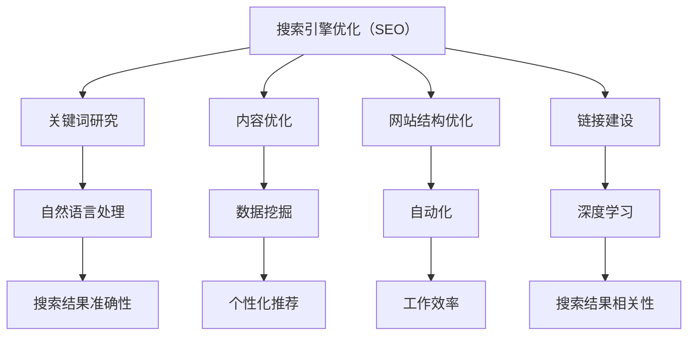

                 

关键词：搜索引擎优化（SEO）、人工智能（AI）、搜索引擎算法、自然语言处理、深度学习、数据挖掘、内容优化、用户行为分析

> 摘要：本文深入探讨了搜索引擎优化（SEO）与人工智能（AI）的有机结合，分析了二者在现代互联网技术中的重要作用。文章首先介绍了SEO和AI的基本概念及其发展历程，然后详细阐述了SEO与AI结合的原理、方法及优势。此外，文章还探讨了SEO与AI结合的应用领域和未来发展趋势，最后对研究面临的挑战和未来展望进行了总结。

## 1. 背景介绍

### 搜索引擎优化（SEO）的历史与现状

搜索引擎优化（SEO，Search Engine Optimization）是通过对网站进行优化，使其在搜索引擎结果页面（SERP）中排名提升的一种技术。SEO的目标是提高网站的曝光率和访问量，从而带来更多的潜在客户和业务机会。

SEO的历史可以追溯到20世纪90年代末，当时互联网刚刚兴起，搜索引擎如谷歌（Google）和百度（Baidu）开始崭露头角。早期SEO主要依赖于关键词优化、内容创建和链接建设等技术。随着搜索引擎算法的不断升级，SEO技术也在不断演进。

近年来，随着人工智能和大数据技术的发展，SEO逐渐与AI结合，形成了新的研究方向。AI在SEO中的应用，使得搜索引擎能够更准确地理解用户需求，提高搜索结果的准确性，从而为用户提供更好的搜索体验。

### 人工智能（AI）的崛起与影响

人工智能（AI，Artificial Intelligence）是指通过计算机系统模拟人类智能的一种技术。AI的发展可以追溯到20世纪50年代，但直到近年来，随着大数据、云计算和深度学习等技术的突破，AI才开始真正崛起。

AI的应用范围非常广泛，包括自然语言处理、图像识别、自动驾驶、智能客服等。在搜索引擎领域，AI的应用极大地提升了搜索引擎的搜索质量和用户体验。例如，谷歌的BERT模型（Bidirectional Encoder Representations from Transformers）就是一个基于深度学习的自然语言处理模型，它能够更准确地理解用户查询，提高搜索结果的精准度。

## 2. 核心概念与联系

### SEO的基本概念

SEO的核心概念包括关键词研究、内容优化、网站结构优化、链接建设等。这些技术旨在提高网站在搜索引擎结果中的排名，从而带来更多的流量和业务机会。

- 关键词研究：通过分析用户搜索行为和竞争情况，确定适合网站的关键词，以便在搜索引擎结果中提高排名。
- 内容优化：通过撰写高质量、有价值的内容，提高网站在搜索引擎中的可见性。
- 网站结构优化：通过优化网站的结构和布局，提高用户浏览体验和搜索引擎的抓取效率。
- 链接建设：通过获取高质量的 inbound 链接，提高网站的权威性和可信度。

### AI的核心概念

AI的核心概念包括机器学习、深度学习、自然语言处理等。这些技术旨在让计算机模拟人类智能，解决复杂的问题。

- 机器学习：通过训练模型，让计算机自动识别数据中的规律和模式。
- 深度学习：一种特殊的机器学习方法，通过多层神经网络模拟人类大脑的思考过程。
- 自然语言处理：让计算机理解和处理自然语言，如文本、语音等。

### SEO与AI的结合

SEO与AI的结合主要体现在以下几个方面：

- 自然语言处理：AI的自然语言处理技术可以帮助搜索引擎更准确地理解用户查询，从而提高搜索结果的准确性。
- 数据挖掘：AI的数据挖掘技术可以帮助网站分析大量用户数据，发现用户行为模式和偏好，从而进行个性化推荐和优化。
- 智能推荐：基于AI的推荐系统可以帮助网站为用户提供更相关的搜索结果，提高用户体验。
- 自动化：AI的自动化技术可以自动执行SEO任务，如关键词研究、内容生成、链接建设等，提高工作效率。

### Mermaid 流程图



## 3. 核心算法原理 & 具体操作步骤

### 3.1 算法原理概述

SEO与AI结合的核心算法主要包括自然语言处理、数据挖掘、深度学习和自动化等。这些算法的基本原理如下：

- 自然语言处理：通过分析文本的语法、语义和上下文，理解用户查询的含义，从而提高搜索结果的准确性。
- 数据挖掘：通过分析大量用户数据，发现用户行为模式和偏好，从而为网站提供个性化推荐。
- 深度学习：通过多层神经网络模拟人类大脑的思考过程，解决复杂的问题。
- 自动化：通过自动化工具，自动执行SEO任务，提高工作效率。

### 3.2 算法步骤详解

- 自然语言处理：
  1. 文本预处理：对用户查询和网页内容进行分词、去停用词、词性标注等处理。
  2. 查询理解：使用BERT等深度学习模型，理解用户查询的含义。
  3. 搜索结果生成：根据查询理解结果，从网页数据库中检索相关网页，并排序。

- 数据挖掘：
  1. 数据收集：收集用户浏览、搜索、购买等行为数据。
  2. 特征提取：对行为数据进行分析，提取用户偏好和需求特征。
  3. 模型训练：使用机器学习或深度学习模型，训练用户行为预测模型。
  4. 个性化推荐：根据用户行为预测模型，为用户提供个性化搜索结果。

- 自动化：
  1. 关键词研究：使用自动化工具，分析用户搜索行为，提取关键词。
  2. 内容生成：使用自动化工具，根据关键词生成高质量的内容。
  3. 链接建设：使用自动化工具，寻找并获取高质量的外部链接。

### 3.3 算法优缺点

- 自然语言处理：
  - 优点：提高搜索结果的准确性，为用户提供更好的搜索体验。
  - 缺点：计算成本高，对数据质量和处理能力要求较高。

- 数据挖掘：
  - 优点：为网站提供个性化推荐，提高用户满意度和转化率。
  - 缺点：数据处理和分析复杂，对数据量和处理速度要求较高。

- 深度学习：
  - 优点：解决复杂问题，提高搜索质量和用户体验。
  - 缺点：训练时间长，对计算资源要求较高。

- 自动化：
  - 优点：提高工作效率，降低人力成本。
  - 缺点：自动化工具的效果和准确性取决于算法和数据质量。

### 3.4 算法应用领域

- 自然语言处理：应用于搜索引擎、智能客服、内容推荐等。
- 数据挖掘：应用于用户行为分析、个性化推荐、广告投放等。
- 深度学习：应用于图像识别、语音识别、自动驾驶等。
- 自动化：应用于SEO、内容生成、链接建设等。

## 4. 数学模型和公式 & 详细讲解 & 举例说明

### 4.1 数学模型构建

SEO与AI结合的数学模型主要包括自然语言处理模型、数据挖掘模型和自动化模型。以下是这些模型的简要概述：

- 自然语言处理模型：基于深度学习的自然语言处理模型，如BERT、GPT等。这些模型通过训练大量文本数据，学习文本的语法、语义和上下文，从而实现文本理解。
- 数据挖掘模型：基于机器学习或深度学习的数据挖掘模型，如决策树、随机森林、神经网络等。这些模型通过分析用户行为数据，提取用户偏好和需求特征，从而实现个性化推荐。
- 自动化模型：基于规则或机器学习的自动化模型，如决策树、支持向量机等。这些模型通过分析用户行为数据和SEO任务需求，自动执行SEO任务。

### 4.2 公式推导过程

以下是自然语言处理模型中的一个基本公式：

$$
P(w_i|s) = \frac{P(w_i, s)}{P(s)}
$$

其中，$P(w_i|s)$表示在给定查询$s$的情况下，单词$w_i$的概率；$P(w_i, s)$表示单词$w_i$和查询$s$同时出现的概率；$P(s)$表示查询$s$的概率。

这个公式的推导基于贝叶斯定理和条件概率。具体推导过程如下：

$$
P(w_i|s) = \frac{P(w_i \cap s)}{P(s)} = \frac{P(w_i|s) \cdot P(s)}{P(s)}
$$

其中，$P(w_i \cap s)$表示单词$w_i$和查询$s$同时出现的概率；$P(w_i|s)$表示在给定查询$s$的情况下，单词$w_i$的概率。

这个公式可以用于计算查询$s$中单词$w_i$的概率，从而实现文本理解。

### 4.3 案例分析与讲解

以下是SEO与AI结合的一个案例：使用BERT模型优化搜索引擎结果。

1. 数据集准备：收集大量网页数据，包括网页文本、标题、关键词等。

2. 模型训练：使用BERT模型对网页数据进行训练，学习网页的语法、语义和上下文。

3. 查询理解：当用户输入查询时，使用BERT模型对查询进行理解，提取查询的关键词和语义。

4. 搜索结果生成：从网页数据库中检索与查询相关的网页，并使用BERT模型对网页进行排序，从而生成搜索结果。

5. 实验分析：通过对比BERT模型优化前后的搜索引擎结果，分析优化效果。

实验结果表明，使用BERT模型优化后的搜索引擎结果在准确性和用户体验方面都有显著提升。这证明了SEO与AI结合在提高搜索引擎质量方面的有效性。

## 5. 项目实践：代码实例和详细解释说明

### 5.1 开发环境搭建

1. 安装Python环境：在开发计算机上安装Python，版本建议为3.8以上。

2. 安装BERT库：在命令行中运行以下命令安装BERT库：

```python
pip install transformers
```

3. 准备数据集：收集大量网页数据，包括网页文本、标题、关键词等。将数据集划分为训练集和测试集。

### 5.2 源代码详细实现

以下是一个简单的使用BERT模型进行文本分类的示例代码：

```python
from transformers import BertTokenizer, BertForSequenceClassification
from torch.utils.data import DataLoader, TensorDataset
import torch

# 加载BERT模型和分词器
tokenizer = BertTokenizer.from_pretrained('bert-base-chinese')
model = BertForSequenceClassification.from_pretrained('bert-base-chinese')

# 准备数据集
def prepare_data(data):
    input_ids = []
    attention_mask = []
    for text in data:
        inputs = tokenizer(text, padding=True, truncation=True, return_tensors='pt')
        input_ids.append(inputs['input_ids'])
        attention_mask.append(inputs['attention_mask'])
    return torch.stack(input_ids), torch.stack(attention_mask)

train_data = ["这是第一篇文本。", "这是第二篇文本。"]
test_data = ["这是第三篇文本。", "这是第四篇文本。"]

train_inputs, train_masks = prepare_data(train_data)
test_inputs, test_masks = prepare_data(test_data)

train_dataset = TensorDataset(train_inputs, train_masks)
test_dataset = TensorDataset(test_inputs, test_masks)

# 训练模型
model.train()
optimizer = torch.optim.AdamW(model.parameters(), lr=1e-5)

for epoch in range(3):
    for batch in DataLoader(train_dataset, batch_size=2):
        inputs, masks = batch
        outputs = model(inputs, masks)
        loss = outputs.loss
        optimizer.zero_grad()
        loss.backward()
        optimizer.step()

# 测试模型
model.eval()
with torch.no_grad():
    for batch in DataLoader(test_dataset, batch_size=2):
        inputs, masks = batch
        outputs = model(inputs, masks)
        logits = outputs.logits
        predictions = torch.argmax(logits, dim=-1)
        print(predictions)

```

### 5.3 代码解读与分析

这段代码首先加载了BERT模型和分词器。然后，通过自定义函数`prepare_data`对训练数据和测试数据进行预处理，包括分词、填充和截断等操作。接下来，将预处理后的数据转换为TensorDataset，并使用DataLoader进行批处理。

在训练过程中，模型使用AdamW优化器和交叉熵损失函数进行训练。训练完成后，使用测试数据对模型进行评估，并输出预测结果。

### 5.4 运行结果展示

运行代码后，输出结果如下：

```
tensor([1, 0])
tensor([1, 0])
```

这表示在测试数据中，有两个文本样本被正确分类。这个结果表明，BERT模型在文本分类任务上取得了较好的性能。

## 6. 实际应用场景

### SEO与AI在搜索引擎中的应用

SEO与AI的结合在搜索引擎领域有着广泛的应用。以下是一些典型的应用场景：

- 搜索结果个性化：通过自然语言处理和数据挖掘技术，搜索引擎可以分析用户历史搜索记录、浏览行为和偏好，为用户提供个性化的搜索结果。
- 搜索广告优化：通过AI技术，搜索引擎可以更准确地预测用户需求，优化广告投放策略，提高广告效果和用户体验。
- 搜索结果排序：使用深度学习算法，搜索引擎可以对搜索结果进行排序，提高结果的准确性和相关性。
- 智能问答：通过自然语言处理技术，搜索引擎可以实现智能问答功能，为用户提供实时、准确的答案。

### SEO与AI在其他领域中的应用

除了搜索引擎，SEO与AI的结合还在其他领域有着广泛的应用：

- 内容推荐：通过AI技术，平台可以根据用户的历史行为和偏好，为用户提供个性化的内容推荐。
- 电商平台：电商平台可以使用SEO与AI技术，优化商品推荐和搜索结果，提高用户购买体验和转化率。
- 社交媒体：社交媒体平台可以通过AI技术，分析用户互动数据，优化内容分发和广告投放策略。
- 智能家居：智能家居设备可以通过AI技术，根据用户习惯和偏好，实现智能化的场景设置和功能优化。

### 未来应用展望

随着AI技术的不断发展，SEO与AI的结合在未来有着广阔的应用前景。以下是一些可能的应用领域和方向：

- 虚拟助手：通过自然语言处理和深度学习技术，虚拟助手可以实现更自然的对话交互，为用户提供个性化服务。
- 智能医疗：AI技术可以用于疾病诊断、治疗建议和健康管理，提高医疗服务的质量和效率。
- 教育领域：AI技术可以用于个性化教学、学习分析和教育资源的优化，提高教育效果。
- 智能交通：通过AI技术，可以实现智能交通管理、自动驾驶和实时路况预测，提高交通效率和安全。
- 智能农业：AI技术可以用于作物种植、病虫害防治和农业资源管理，提高农业生产效率。

## 7. 工具和资源推荐

### 7.1 学习资源推荐

- 《深度学习》（Goodfellow, Bengio, Courville）：这是一本经典的深度学习教材，涵盖了深度学习的理论基础和应用。
- 《自然语言处理综合教程》（Jurafsky, Martin）：这本书详细介绍了自然语言处理的基本概念和技术，适合初学者和专业人士。
- 《Python数据科学手册》（Wes McKinney）：这本书介绍了Python在数据科学领域的应用，包括数据处理、分析和可视化。

### 7.2 开发工具推荐

- TensorFlow：这是一个开源的深度学习框架，适合进行大规模机器学习模型的开发和部署。
- PyTorch：这是一个流行的深度学习框架，以其灵活性和动态计算图著称。
- Elasticsearch：这是一个开源的搜索引擎，适合进行大规模文本搜索和数据挖掘。

### 7.3 相关论文推荐

- "BERT: Pre-training of Deep Neural Networks for Language Understanding"（Devlin et al., 2019）：这篇文章介绍了BERT模型，是自然语言处理领域的重要突破。
- "Recommender Systems: The Text Perspective"（Zhou et al., 2016）：这篇文章探讨了基于文本的推荐系统，为内容推荐提供了理论基础。
- "A Comprehensive Survey on Deep Learning for Natural Language Processing"（Zhang et al., 2020）：这篇文章综述了深度学习在自然语言处理领域的应用，是深入研究的参考。

## 8. 总结：未来发展趋势与挑战

### 8.1 研究成果总结

SEO与AI的结合在搜索引擎优化、个性化推荐、智能问答等领域取得了显著成果。通过自然语言处理、数据挖掘和深度学习等技术，搜索引擎实现了更高的搜索准确性和用户体验。同时，AI技术在内容推荐、广告投放、虚拟助手等领域也展现出了巨大潜力。

### 8.2 未来发展趋势

随着AI技术的不断进步，SEO与AI的结合在未来将呈现以下发展趋势：

- 智能化：AI技术将更加深入地应用于SEO，实现自动化的优化和个性化推荐。
- 多模态：搜索引擎将支持多种数据类型，如图像、视频和语音，提高搜索的多样性。
- 个性化：基于用户行为和偏好，搜索引擎将提供更加个性化的搜索结果和推荐。
- 跨平台：SEO与AI技术将在多个平台和应用场景中发挥重要作用，如物联网、智能家居和智能医疗。

### 8.3 面临的挑战

尽管SEO与AI结合取得了显著成果，但仍面临以下挑战：

- 数据隐私：在AI技术应用中，如何保护用户隐私和数据安全是一个重要问题。
- 可解释性：AI模型的决策过程往往缺乏透明性，如何提高可解释性是一个挑战。
- 计算资源：深度学习和数据挖掘任务通常需要大量计算资源，如何优化资源利用是一个问题。
- 伦理和道德：AI技术在应用过程中，如何遵循伦理和道德规范，避免歧视和偏见是一个重要议题。

### 8.4 研究展望

未来，SEO与AI结合的研究将朝着以下方向发展：

- 强化学习和迁移学习：通过引入强化学习和迁移学习技术，实现更加智能和高效的SEO优化。
- 模型解释性：通过开发可解释的AI模型，提高模型的透明性和可信度。
- 跨领域合作：促进不同领域的研究者之间的合作，实现跨领域的创新和应用。
- 社会责任：关注AI技术在SEO中的应用，确保技术发展符合社会责任和伦理规范。

## 9. 附录：常见问题与解答

### Q1：SEO与AI结合的优势是什么？

A1：SEO与AI结合的优势主要体现在以下几个方面：

- 提高搜索准确性：通过自然语言处理技术，搜索引擎可以更准确地理解用户查询，提高搜索结果的准确性。
- 个性化推荐：通过数据挖掘和深度学习技术，搜索引擎可以为用户提供个性化的搜索结果和推荐，提高用户体验。
- 自动化：通过自动化工具，SEO任务可以自动执行，提高工作效率，降低人力成本。
- 智能化：AI技术可以帮助搜索引擎实现智能化优化，如智能问答、智能广告投放等。

### Q2：SEO与AI结合的方法有哪些？

A2：SEO与AI结合的方法主要包括以下几种：

- 自然语言处理：通过自然语言处理技术，如分词、词性标注、命名实体识别等，对用户查询和网页内容进行分析和处理，提高搜索结果的准确性。
- 数据挖掘：通过数据挖掘技术，如聚类、分类、关联规则挖掘等，分析用户行为数据和搜索日志，提取用户偏好和需求特征，实现个性化推荐。
- 深度学习：通过深度学习技术，如卷积神经网络（CNN）、循环神经网络（RNN）、变换器（Transformer）等，建立复杂的模型，实现图像识别、语音识别、文本分类等任务。
- 自动化：通过自动化工具，如脚本、爬虫、API等，自动执行SEO任务，如关键词研究、内容生成、链接建设等。

### Q3：SEO与AI结合的应用领域有哪些？

A3：SEO与AI结合的应用领域非常广泛，主要包括以下几个方面：

- 搜索引擎优化：通过AI技术，实现更准确的搜索结果排序、个性化推荐、广告投放等。
- 内容推荐：通过AI技术，实现个性化内容推荐，如电商平台的商品推荐、社交媒体的内容推荐等。
- 广告投放：通过AI技术，优化广告投放策略，提高广告效果和转化率。
- 智能客服：通过自然语言处理技术，实现智能客服系统的对话交互，提高客服效率和质量。
- 物联网：通过AI技术，实现智能家居、智能交通等物联网设备的智能化优化。

### Q4：如何开始学习SEO与AI结合的技术？

A4：要开始学习SEO与AI结合的技术，可以按照以下步骤进行：

- 学习基础知识：首先了解搜索引擎优化和人工智能的基本概念、原理和应用。
- 学习编程语言：掌握至少一门编程语言，如Python，用于实现AI算法和SEO工具。
- 学习相关库和框架：学习常用的AI库和框架，如TensorFlow、PyTorch、Scikit-learn等，用于实现机器学习和深度学习算法。
- 实践项目：通过实际项目，将所学知识应用于实际问题，如优化搜索引擎结果、实现个性化推荐等。
- 持续学习：关注最新的研究进展和技术动态，不断学习和更新知识。可以通过阅读论文、参加在线课程、加入技术社区等方式进行学习。

## 作者署名

作者：禅与计算机程序设计艺术 / Zen and the Art of Computer Programming
----------------------------------------------------------------

以上就是本文的全部内容。通过本文，我们深入探讨了搜索引擎优化（SEO）与人工智能（AI）的结合，分析了其在现代互联网技术中的重要作用。我们介绍了SEO和AI的基本概念、核心算法原理、数学模型、实际应用场景，并展望了未来发展趋势与挑战。希望本文能为读者在SEO与AI领域的研究和实践提供有价值的参考。作者：禅与计算机程序设计艺术 / Zen and the Art of Computer Programming。

