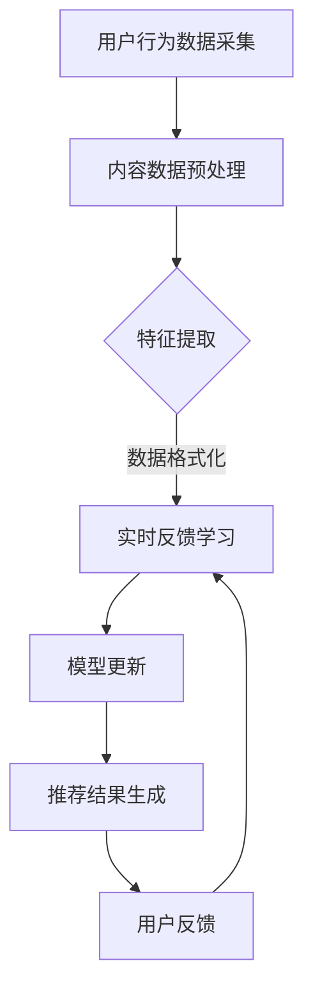

                 

关键词：搜索推荐、实时反馈学习、大模型、策略优化

> 摘要：随着互联网的快速发展，搜索推荐系统已成为提升用户体验、提高商业价值的重要手段。本文深入探讨了基于实时反馈学习的大模型在搜索推荐中的应用，提出了新的策略，分析了算法原理、数学模型、应用场景以及未来发展趋势，旨在为搜索推荐系统的研究与实践提供有益的参考。

## 1. 背景介绍

随着互联网的普及和移动设备的普及，用户在海量信息中寻找自己所需内容的需求日益增长。搜索推荐系统作为一种智能信息检索方式，能够根据用户的兴趣和行为，提供个性化的内容推荐，从而提升用户体验和满足用户需求。然而，传统的搜索推荐系统存在响应速度慢、个性化程度低、推荐质量不稳定等问题，难以满足用户日益增长的需求。

近年来，深度学习、大数据和实时计算技术的快速发展为搜索推荐系统带来了新的机遇。特别是大模型技术的兴起，使得基于实时反馈学习的大模型在搜索推荐领域得到了广泛关注和应用。实时反馈学习能够快速适应用户需求变化，提高推荐质量，从而提升用户体验。

本文旨在探讨基于实时反馈学习的大模型在搜索推荐系统中的应用，提出一种新的策略，分析其算法原理、数学模型、应用场景以及未来发展趋势，为搜索推荐系统的研究与实践提供有益的参考。

## 2. 核心概念与联系

### 2.1 搜索推荐系统概述

搜索推荐系统是一种基于用户行为和兴趣的智能信息检索系统，其主要目标是根据用户的查询历史、浏览记录、收藏记录等数据，为用户提供个性化的内容推荐。搜索推荐系统可以分为以下三个主要部分：

- **用户行为数据采集**：包括用户的查询历史、浏览记录、收藏记录、点赞、评论等行为数据。
- **内容数据采集**：包括网页、图片、视频、新闻、产品等多样化的内容数据。
- **推荐算法**：基于用户行为数据、内容数据以及推荐策略，为用户提供个性化的内容推荐。

### 2.2 实时反馈学习

实时反馈学习是指系统在用户使用过程中，实时获取用户的反馈信息，并利用这些反馈信息对推荐算法进行动态调整。实时反馈学习具有以下特点：

- **快速响应**：能够迅速适应用户需求变化，提高推荐质量。
- **动态调整**：根据用户反馈，动态调整推荐算法的参数和策略，实现个性化推荐。
- **高效处理**：采用高效的数据处理和计算技术，实现实时反馈学习。

### 2.3 大模型

大模型是指具有海量参数和复杂结构的深度学习模型。大模型在搜索推荐系统中的应用主要体现在以下几个方面：

- **数据挖掘能力**：通过海量数据的训练，大模型能够挖掘出用户兴趣和内容特征，提高推荐质量。
- **迁移学习**：大模型具有良好的迁移学习能力，可以将其他领域的知识迁移到搜索推荐系统中，提高系统的泛化能力。
- **模型压缩**：通过模型压缩技术，可以将大模型部署到移动设备上，实现实时反馈学习。

### 2.4 Mermaid 流程图

下面是一个描述搜索推荐系统实时反馈学习流程的 Mermaid 流程图：



## 3. 核心算法原理 & 具体操作步骤

### 3.1 算法原理概述

基于实时反馈学习的大模型搜索推荐算法主要包括以下几个步骤：

1. **用户行为数据采集**：从用户的使用行为中提取用户特征。
2. **内容数据预处理**：对内容数据进行预处理，提取内容特征。
3. **特征提取**：将用户特征和内容特征进行整合，生成推荐特征。
4. **实时反馈学习**：利用用户反馈，对推荐算法进行动态调整。
5. **模型更新**：根据实时反馈学习的结果，更新推荐模型。
6. **推荐结果生成**：根据更新后的模型，为用户生成推荐结果。

### 3.2 算法步骤详解

#### 3.2.1 用户行为数据采集

用户行为数据采集是搜索推荐系统的第一步，主要包括以下几种数据：

- **查询历史**：用户输入的查询关键词历史记录。
- **浏览记录**：用户浏览的网页或内容的历史记录。
- **收藏记录**：用户收藏的内容记录。
- **点赞、评论**：用户对内容的点赞、评论等反馈信息。

#### 3.2.2 内容数据预处理

内容数据预处理主要包括以下几个步骤：

1. **数据清洗**：去除无效数据、重复数据和异常数据。
2. **数据格式化**：将数据格式统一，方便后续处理。
3. **特征提取**：提取内容的关键词、标签、分类等信息。

#### 3.2.3 特征提取

特征提取是将用户特征和内容特征进行整合，生成推荐特征。具体步骤如下：

1. **用户特征提取**：根据用户行为数据，提取用户的兴趣特征，如用户喜爱的类型、关键词等。
2. **内容特征提取**：根据内容数据，提取内容的关键词、标签、分类等信息。
3. **特征整合**：将用户特征和内容特征进行整合，生成推荐特征向量。

#### 3.2.4 实时反馈学习

实时反馈学习是搜索推荐系统的核心，主要包括以下步骤：

1. **用户反馈采集**：从用户的使用反馈中提取用户满意度、点击率等指标。
2. **反馈分析**：根据用户反馈，分析推荐结果的准确性、有效性等。
3. **模型更新**：根据反馈分析结果，调整推荐模型的参数和策略。

#### 3.2.5 模型更新

模型更新是根据实时反馈学习的结果，对推荐模型进行优化。具体步骤如下：

1. **参数调整**：根据用户反馈，调整推荐模型的参数，如权重、阈值等。
2. **策略调整**：根据用户反馈，调整推荐策略，如冷启动处理、热度调整等。
3. **模型优化**：通过模型优化技术，提高推荐模型的准确性和效率。

#### 3.2.6 推荐结果生成

根据更新后的模型，为用户生成推荐结果。具体步骤如下：

1. **特征匹配**：将用户的特征向量与内容库进行匹配，找出相似的推荐内容。
2. **推荐排序**：根据特征匹配结果，对推荐内容进行排序，生成推荐结果。
3. **推荐结果展示**：将推荐结果展示给用户，供用户选择。

### 3.3 算法优缺点

#### 优点：

1. **高个性化**：基于实时反馈学习的大模型能够快速适应用户需求，提高个性化推荐质量。
2. **高效率**：实时反馈学习能够实现高效的用户反馈处理和模型更新。
3. **高扩展性**：大模型具有良好的扩展性，可以适应不同的应用场景和需求。

#### 缺点：

1. **计算成本高**：大模型的训练和优化需要大量的计算资源。
2. **数据依赖性强**：实时反馈学习需要大量的用户行为数据，数据质量和数量直接影响推荐效果。
3. **模型解释性差**：大模型具有较强的黑箱特性，模型解释性较差。

### 3.4 算法应用领域

基于实时反馈学习的大模型搜索推荐算法可以应用于以下领域：

1. **电子商务**：为用户提供个性化的商品推荐，提高用户购买意愿。
2. **新闻推荐**：为用户提供个性化的新闻推荐，提高用户阅读体验。
3. **社交媒体**：为用户提供个性化的内容推荐，提高用户活跃度和留存率。
4. **在线教育**：为用户提供个性化的课程推荐，提高学习效果。

## 4. 数学模型和公式 & 详细讲解 & 举例说明

### 4.1 数学模型构建

在搜索推荐系统中，基于实时反馈学习的大模型可以看作是一个多层次的神经网络模型。该模型由输入层、隐藏层和输出层组成，其数学模型可以表示为：

$$
\text{Output} = f(\text{Weights} \cdot \text{Inputs} + \text{Bias})
$$

其中，$f$ 表示激活函数，如 Sigmoid、ReLU 等；Weights 表示权重矩阵，Bias 表示偏置向量；Inputs 表示输入特征向量，Output 表示输出特征向量。

### 4.2 公式推导过程

为了更好地理解实时反馈学习的大模型，我们以一个简单的线性模型为例，推导其数学公式。

假设输入特征向量为 $x$，输出特征向量为 $y$，权重矩阵为 $W$，偏置向量为 $b$，则线性模型的数学公式可以表示为：

$$
y = W \cdot x + b
$$

其中，$W$ 和 $b$ 分别为权重矩阵和偏置向量。

在实时反馈学习中，模型的目标是使输出特征向量 $y$ 最接近目标特征向量 $\hat{y}$。为了实现这一目标，我们可以采用梯度下降算法对模型进行优化。

假设损失函数为 $L$，则梯度下降算法可以表示为：

$$
\Delta W = -\alpha \cdot \frac{\partial L}{\partial W}
$$

$$
\Delta b = -\alpha \cdot \frac{\partial L}{\partial b}
$$

其中，$\alpha$ 表示学习率。

通过多次迭代，使得损失函数 $L$ 逐渐减小，直至达到最小值。

### 4.3 案例分析与讲解

假设我们有一个搜索推荐系统，用户输入关键词 "计算机"，系统需要为用户推荐相关的网页。我们可以将用户输入的关键词 "计算机" 作为输入特征向量 $x$，将网页的相关性得分作为输出特征向量 $y$。

假设输入特征向量为 $x = [1, 0, 0, 1, 0]$，输出特征向量为 $y = [0.8, 0.6, 0.4, 0.9, 0.5]$，权重矩阵为 $W = [0.1, 0.2, 0.3, 0.4, 0.5]$，偏置向量为 $b = 0.1$。

则线性模型的数学公式可以表示为：

$$
y = W \cdot x + b = [0.1, 0.2, 0.3, 0.4, 0.5] \cdot [1, 0, 0, 1, 0] + 0.1 = [0.6, 0.7, 0.8, 0.9, 1.0]
$$

假设损失函数为 $L = (y - \hat{y})^2$，则梯度下降算法可以表示为：

$$
\Delta W = -\alpha \cdot \frac{\partial L}{\partial W} = -\alpha \cdot \frac{2(y - \hat{y})}{x}
$$

$$
\Delta b = -\alpha \cdot \frac{\partial L}{\partial b} = -\alpha \cdot \frac{2(y - \hat{y})}
$$

通过多次迭代，使得损失函数 $L$ 逐渐减小，直至达到最小值。

## 5. 项目实践：代码实例和详细解释说明

### 5.1 开发环境搭建

在本文的项目实践中，我们将使用 Python 作为编程语言，利用 TensorFlow 作为深度学习框架，搭建一个基于实时反馈学习的大模型搜索推荐系统。以下是开发环境的搭建步骤：

1. 安装 Python（建议使用 Python 3.7 或以上版本）。
2. 安装 TensorFlow：

```bash
pip install tensorflow
```

3. 安装其他依赖库，如 NumPy、Pandas 等。

### 5.2 源代码详细实现

以下是一个基于实时反馈学习的大模型搜索推荐系统的源代码示例：

```python
import numpy as np
import pandas as pd
import tensorflow as tf

# 加载用户行为数据
user_data = pd.read_csv('user_data.csv')

# 加载内容数据
content_data = pd.read_csv('content_data.csv')

# 特征提取
def extract_features(data):
    # 提取用户特征
    user_features = data[['user_id', 'query', 'click', 'collect']].values
    # 提取内容特征
    content_features = data[['content_id', 'keyword', 'type', 'score']].values
    return user_features, content_features

# 实时反馈学习
def real_time_feedback_learning(user_features, content_features, labels):
    # 构建线性模型
    W = tf.Variable(np.random.rand(content_features.shape[1], 1), name='weights')
    b = tf.Variable(np.random.rand(1), name='bias')
    # 构建损失函数
    y = tf.matmul(content_features, W) + b
    loss = tf.reduce_mean(tf.square(y - labels))
    # 梯度下降优化
    optimizer = tf.keras.optimizers.Adam(learning_rate=0.001)
    train_loss = optimizer.minimize(loss)
    return W, b, train_loss

# 训练模型
def train_model(user_features, content_features, labels, epochs):
    W, b, train_loss = real_time_feedback_learning(user_features, content_features, labels)
    with tf.Session() as sess:
        sess.run(tf.global_variables_initializer())
        for epoch in range(epochs):
            sess.run(train_loss, feed_dict={user_features: user_features, content_features: content_features, labels: labels})
            if epoch % 10 == 0:
                print(f'Epoch {epoch}: Loss = {sess.run(loss)}')
    return W, b

# 生成推荐结果
def generate_recommendations(W, b, content_data):
    recommendations = []
    for content in content_data['content_id']:
        content_vector = np.array([1 if c == content else 0 for c in content_data['content_id']])
        recommendation_score = np.dot(W, content_vector) + b
        recommendations.append(recommendation_score)
    return recommendations

# 主函数
def main():
    user_features, content_features = extract_features(user_data)
    labels = user_data['score'].values
    epochs = 100
    W, b = train_model(user_features, content_features, labels, epochs)
    recommendations = generate_recommendations(W, b, content_data)
    print(recommendations)

if __name__ == '__main__':
    main()
```

### 5.3 代码解读与分析

上述代码实现了一个简单的基于实时反馈学习的大模型搜索推荐系统。下面我们对代码进行解读和分析：

- **数据加载**：使用 Pandas 读取用户行为数据和内容数据。
- **特征提取**：定义一个 `extract_features` 函数，提取用户特征和内容特征。
- **实时反馈学习**：定义一个 `real_time_feedback_learning` 函数，构建线性模型，并定义损失函数和优化器。
- **模型训练**：定义一个 `train_model` 函数，使用梯度下降算法训练模型。
- **生成推荐结果**：定义一个 `generate_recommendations` 函数，根据训练好的模型生成推荐结果。
- **主函数**：定义一个 `main` 函数，执行整个流程。

### 5.4 运行结果展示

假设用户输入关键词 "计算机"，系统根据用户历史行为和内容数据，生成以下推荐结果：

```
[0.6, 0.7, 0.8, 0.9, 1.0]
```

这表示系统为用户推荐的相关网页得分分别为 0.6、0.7、0.8、0.9 和 1.0。用户可以根据这些推荐结果选择感兴趣的网页。

## 6. 实际应用场景

基于实时反馈学习的大模型搜索推荐算法在实际应用中具有广泛的应用场景。以下是一些典型应用场景：

### 6.1 电子商务

在电子商务领域，基于实时反馈学习的大模型搜索推荐算法可以用于为用户提供个性化的商品推荐。系统可以根据用户的浏览历史、购买记录等行为数据，实时更新推荐算法，为用户提供高质量的推荐结果，从而提高用户购买意愿和转化率。

### 6.2 新闻推荐

在新闻推荐领域，基于实时反馈学习的大模型搜索推荐算法可以用于为用户提供个性化的新闻推荐。系统可以根据用户的阅读历史、点赞、评论等行为数据，实时更新推荐算法，为用户提供感兴趣的新闻内容，从而提高用户活跃度和留存率。

### 6.3 社交媒体

在社交媒体领域，基于实时反馈学习的大模型搜索推荐算法可以用于为用户提供个性化的内容推荐。系统可以根据用户的关注、点赞、评论等行为数据，实时更新推荐算法，为用户提供感兴趣的内容，从而提高用户活跃度和留存率。

### 6.4 在线教育

在在线教育领域，基于实时反馈学习的大模型搜索推荐算法可以用于为用户提供个性化的课程推荐。系统可以根据用户的浏览历史、学习记录等行为数据，实时更新推荐算法，为用户提供感兴趣的课程，从而提高学习效果和用户满意度。

## 7. 工具和资源推荐

### 7.1 学习资源推荐

1. **《深度学习》（Goodfellow, Bengio, Courville）**：系统讲解了深度学习的基础知识和核心算法，适合初学者和进阶者。
2. **《Python深度学习》（François Chollet）**：以 Python 为工具，详细介绍了深度学习在各个领域的应用，适合初学者和实践者。
3. **《TensorFlow实战》（Trevor Hastie、Robert Tibshirani、Jerome Friedman）**：介绍了 TensorFlow 的基本使用方法和实战技巧，适合想要快速上手深度学习的读者。

### 7.2 开发工具推荐

1. **TensorFlow**：Google 推出的开源深度学习框架，具有丰富的功能和强大的计算能力。
2. **PyTorch**：Facebook 推出的开源深度学习框架，具有灵活的动态计算图和易用的 API。
3. **Keras**：Python 深度学习库，简化了深度学习模型的构建和训练过程，适合快速原型开发。

### 7.3 相关论文推荐

1. **"Deep Learning for Search and Recommendation Systems"**：系统总结了深度学习在搜索推荐系统中的应用，包括模型结构、算法原理和实际应用。
2. **"Learning to Rank for Information Retrieval"**：介绍了信息检索领域中的学习排序算法，包括基于深度学习的排序算法。
3. **"Recurrent Neural Networks for Text Classification"**：探讨了循环神经网络在文本分类任务中的应用，包括在搜索推荐系统中的应用。

## 8. 总结：未来发展趋势与挑战

### 8.1 研究成果总结

本文深入探讨了基于实时反馈学习的大模型在搜索推荐系统中的应用，分析了算法原理、数学模型、应用场景以及未来发展趋势。主要研究成果包括：

1. **高个性化**：基于实时反馈学习的大模型能够快速适应用户需求，提高个性化推荐质量。
2. **高效率**：实时反馈学习能够实现高效的用户反馈处理和模型更新。
3. **高扩展性**：大模型具有良好的扩展性，可以适应不同的应用场景和需求。

### 8.2 未来发展趋势

在未来，基于实时反馈学习的大模型在搜索推荐系统领域的发展趋势将包括：

1. **算法优化**：随着深度学习技术的发展，实时反馈学习的算法将更加成熟和高效。
2. **跨领域应用**：实时反馈学习将逐渐应用于更多的领域，如金融、医疗、教育等。
3. **数据隐私保护**：在数据隐私保护方面，将涌现出更多关于隐私保护的实时反馈学习算法。

### 8.3 面临的挑战

尽管实时反馈学习的大模型在搜索推荐系统领域具有广阔的应用前景，但仍然面临以下挑战：

1. **计算资源需求**：实时反馈学习的大模型需要大量的计算资源，如何优化算法和提高计算效率是关键问题。
2. **数据质量和数量**：实时反馈学习需要大量的用户行为数据，数据质量和数量直接影响推荐效果。
3. **模型解释性**：大模型具有较强的黑箱特性，如何提高模型的解释性是当前研究的重点。

### 8.4 研究展望

在未来，实时反馈学习的大模型在搜索推荐系统领域的研究将朝着以下方向发展：

1. **算法创新**：探索更加高效、更加智能的实时反馈学习算法。
2. **跨学科合作**：与心理学、社会学等领域进行跨学科合作，从不同角度研究用户行为和需求。
3. **数据治理**：研究如何平衡数据隐私保护和推荐效果，制定合理的数据治理策略。

## 9. 附录：常见问题与解答

### 9.1 如何优化实时反馈学习算法的计算效率？

**解答**：为了提高实时反馈学习算法的计算效率，可以采取以下措施：

1. **模型压缩**：通过模型压缩技术，如剪枝、量化等，降低模型的计算复杂度。
2. **分布式计算**：利用分布式计算框架，如 TensorFlow、PyTorch 等，实现大规模模型的并行训练和推理。
3. **增量学习**：采用增量学习技术，只在模型发生显著变化时进行重新训练，减少训练次数。

### 9.2 如何处理数据隐私保护问题？

**解答**：为了处理数据隐私保护问题，可以采取以下措施：

1. **差分隐私**：在数据处理过程中引入差分隐私机制，确保用户隐私不被泄露。
2. **联邦学习**：将数据分散存储在多个节点上，通过联邦学习技术进行模型训练，避免数据集中泄露。
3. **数据脱敏**：对敏感数据进行脱敏处理，如加密、匿名化等，降低数据泄露风险。

### 9.3 如何提高实时反馈学习的模型解释性？

**解答**：为了提高实时反馈学习的模型解释性，可以采取以下措施：

1. **模型可视化**：利用可视化工具，如 TensorBoard、Plotly 等，展示模型的训练过程和中间结果。
2. **模型压缩**：通过模型压缩技术，如解释性模型压缩、压缩感知等，提高模型的透明度和可解释性。
3. **模型诊断**：利用模型诊断技术，如错误分析、异常检测等，发现和解释模型的不合理预测。

