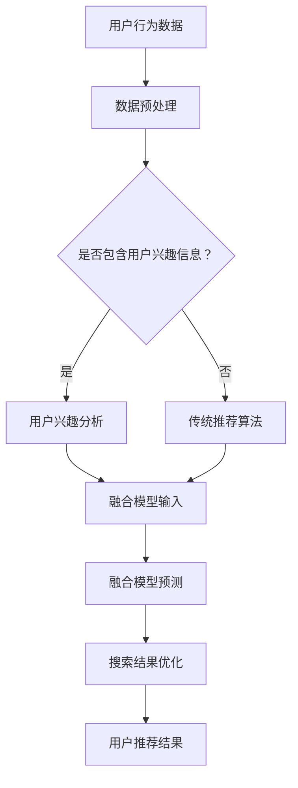

                 

关键词：搜索推荐系统，AI 大模型，电商平台，核心竞争力，可持续发展

> 摘要：本文探讨了在电商平台上引入AI 大模型进行搜索推荐系统融合的重要性及其实施策略。通过分析搜索推荐系统在电商平台中的作用，本文提出了AI 大模型的融合方法及其在电商平台中的应用场景，同时探讨了该系统在实现电商平台核心竞争力与可持续发展方面的潜在优势。

## 1. 背景介绍

随着互联网技术的迅猛发展，电商平台已经成为了现代社会中不可或缺的一部分。电商平台的搜索推荐系统是用户与商品之间的桥梁，通过精准的推荐，提高用户的购物体验，提升电商平台的核心竞争力。传统的搜索推荐系统主要依赖于基于关键词的搜索算法和协同过滤算法，但这些方法在面对海量数据和用户个性化需求时，往往难以提供高质量的推荐结果。

近年来，人工智能（AI）技术的发展为搜索推荐系统带来了新的契机。特别是AI 大模型，如深度学习模型、图神经网络模型等，通过强大的数据处理和分析能力，能够为搜索推荐系统提供更智能、更精准的推荐。然而，将AI 大模型应用于电商平台搜索推荐系统仍面临着一系列技术挑战和实施难题。

本文旨在研究AI 大模型在电商平台搜索推荐系统中的应用，探讨其融合方法及其在提升电商平台核心竞争力和实现可持续发展方面的作用。

## 2. 核心概念与联系

### 2.1. AI 大模型

AI 大模型是指通过深度学习等方法，从海量数据中学习得到的具有强大建模能力的算法模型。这些模型通常包含大量参数，能够在复杂的非线性数据中找到有效的特征表示，从而实现高精度的预测和分类。常见的大模型包括深度神经网络（DNN）、循环神经网络（RNN）、Transformer 等。

### 2.2. 搜索推荐系统

搜索推荐系统是指利用算法技术，为用户提供个性化推荐结果，帮助用户快速找到所需商品的服务系统。搜索推荐系统通常包括搜索模块、推荐模块和用户行为分析模块，能够通过分析用户的搜索历史、购买行为等数据，生成个性化的搜索和推荐结果。

### 2.3. 电商平台

电商平台是指通过互联网进行商品交易的平台，包括线上购物、支付、物流等环节。电商平台的核心目标是提供优质的购物体验，满足用户的多样化需求，提升用户粘性。

### 2.4. AI 大模型与搜索推荐系统的融合

AI 大模型与搜索推荐系统的融合主要体现在以下几个方面：

1. **用户行为分析**：通过AI 大模型对用户行为数据进行分析，提取用户的兴趣偏好和潜在需求，为推荐算法提供更丰富的输入信息。

2. **推荐算法优化**：将AI 大模型与传统的推荐算法结合，通过模型融合，提升推荐系统的预测精度和推荐质量。

3. **搜索结果优化**：利用AI 大模型对搜索结果进行排序和筛选，提高搜索结果的准确性和相关性。

### 2.5. Mermaid 流程图

为了更直观地展示AI 大模型与搜索推荐系统的融合过程，我们使用Mermaid流程图进行描述：



## 3. 核心算法原理 & 具体操作步骤

### 3.1. 算法原理概述

AI 大模型与搜索推荐系统的融合算法主要基于以下几个核心原理：

1. **深度学习**：利用深度神经网络等算法，对用户行为数据和学习到的知识进行建模，提取用户兴趣和需求。

2. **协同过滤**：通过分析用户的历史行为数据，找到与目标用户相似的用户群体，从而生成推荐列表。

3. **知识图谱**：通过构建商品和用户之间的关系图谱，实现多维度、多层次的推荐。

4. **多模态融合**：结合用户的行为数据、文本数据、图像数据等多源数据，提高推荐系统的准确性和多样性。

### 3.2. 算法步骤详解

1. **数据收集与预处理**：

   - 收集用户在电商平台的搜索历史、购买记录、评价等行为数据。

   - 对数据进行清洗和预处理，包括数据去重、数据补全、数据归一化等。

2. **用户兴趣分析**：

   - 利用深度学习算法，对用户行为数据进行分析，提取用户的兴趣偏好。

   - 利用协同过滤算法，找到与目标用户相似的用户群体，进一步优化用户兴趣分析。

3. **构建知识图谱**：

   - 构建商品和用户之间的关系图谱，包括商品类别、品牌、价格等属性。

   - 利用图神经网络等算法，对知识图谱进行学习，提取商品和用户之间的关联关系。

4. **多模态融合**：

   - 结合用户的行为数据、文本数据、图像数据等多源数据，构建多模态数据集。

   - 利用多模态融合算法，对多源数据进行集成，提高推荐系统的准确性。

5. **生成推荐结果**：

   - 利用融合模型对用户兴趣和需求进行建模，生成个性化推荐结果。

   - 对推荐结果进行排序和筛选，优化搜索结果的准确性和相关性。

### 3.3. 算法优缺点

**优点**：

1. **高精度**：通过深度学习算法和协同过滤算法的结合，能够提取用户兴趣和需求，生成高质量的推荐结果。

2. **多样性**：结合多模态数据，能够生成多样化、个性化的推荐结果。

3. **实时性**：能够实时更新用户兴趣和需求，实现实时推荐。

**缺点**：

1. **计算复杂度**：构建和训练AI 大模型需要大量的计算资源和时间。

2. **数据依赖性**：推荐结果依赖于用户行为数据和商品数据的质量，数据缺失或不准确会影响推荐效果。

3. **过拟合风险**：在训练过程中，AI 大模型容易产生过拟合现象，需要通过正则化等技术进行优化。

### 3.4. 算法应用领域

AI 大模型与搜索推荐系统的融合算法在电商、金融、媒体等领域具有广泛的应用前景。以下是一些具体的应用场景：

1. **电商平台**：通过精准的推荐，提升用户购物体验，增加销售额。

2. **金融行业**：通过分析用户交易行为，为用户提供个性化的投资建议。

3. **媒体行业**：通过分析用户阅读行为，为用户提供个性化内容推荐，提升用户体验和用户粘性。

## 4. 数学模型和公式 & 详细讲解 & 举例说明

### 4.1. 数学模型构建

在构建AI 大模型与搜索推荐系统的融合算法时，我们需要建立一系列数学模型，以描述用户行为数据、推荐算法和搜索结果之间的关系。以下是几个核心数学模型：

1. **用户行为预测模型**：

   用户行为预测模型用于预测用户未来的行为，如搜索、购买等。假设用户 \(u\) 在时间 \(t\) 时的行为为 \(y(u, t)\)，则用户行为预测模型可以表示为：

   $$y(u, t) = f(U, V, W, t)$$

   其中，\(U\) 为用户特征向量，\(V\) 为商品特征向量，\(W\) 为时间特征向量，\(f\) 为预测函数。

2. **推荐模型**：

   推荐模型用于生成个性化推荐结果。假设用户 \(u\) 在时间 \(t\) 时的推荐结果为 \(r(u, t)\)，则推荐模型可以表示为：

   $$r(u, t) = g(U, V, T, t)$$

   其中，\(T\) 为推荐策略参数，\(g\) 为推荐函数。

3. **搜索优化模型**：

   搜索优化模型用于优化搜索结果的排序和筛选。假设搜索结果为 \(S(u, t)\)，则搜索优化模型可以表示为：

   $$S(u, t) = h(U, V, T, t)$$

   其中，\(h\) 为搜索优化函数。

### 4.2. 公式推导过程

为了更好地理解上述数学模型，我们进行一些简单的推导。

**用户行为预测模型推导**：

假设用户行为数据 \(y(u, t)\) 是由用户特征向量 \(U\)、商品特征向量 \(V\) 和时间特征向量 \(W\) 组成的线性组合，即：

$$y(u, t) = w_1U + w_2V + w_3W$$

其中，\(w_1\)、\(w_2\) 和 \(w_3\) 为权重系数。

为了求解权重系数，我们可以利用最小二乘法，即最小化损失函数：

$$L = \sum_{u,t}(y(u, t) - (w_1U + w_2V + w_3W))^2$$

对 \(L\) 进行求导，并令导数为零，可以得到权重系数的最优解：

$$w_1 = \frac{\sum_{u,t}U(u, t)y(u, t)}{\sum_{u,t}U(u, t)^2}$$

$$w_2 = \frac{\sum_{u,t}V(u, t)y(u, t)}{\sum_{u,t}V(u, t)^2}$$

$$w_3 = \frac{\sum_{u,t}W(u, t)y(u, t)}{\sum_{u,t}W(u, t)^2}$$

**推荐模型推导**：

推荐模型的核心在于如何将用户特征向量 \(U\) 和商品特征向量 \(V\) 转换为推荐得分。假设推荐得分函数为：

$$r(u, t) = \sigma(w_1U + w_2V + b)$$

其中，\(\sigma\) 为激活函数，\(b\) 为偏置项。

为了求解权重系数 \(w_1\)、\(w_2\) 和偏置项 \(b\)，我们可以利用梯度下降法，即最小化损失函数：

$$L = \sum_{u,t}(\sigma(w_1U + w_2V + b) - r(u, t))^2$$

对 \(L\) 进行求导，并更新权重系数和偏置项：

$$w_1 = w_1 - \alpha \frac{\partial L}{\partial w_1}$$

$$w_2 = w_2 - \alpha \frac{\partial L}{\partial w_2}$$

$$b = b - \alpha \frac{\partial L}{\partial b}$$

其中，\(\alpha\) 为学习率。

**搜索优化模型推导**：

搜索优化模型的核心在于如何将用户特征向量 \(U\)、商品特征向量 \(V\) 和推荐策略参数 \(T\) 转换为搜索结果。假设搜索结果函数为：

$$S(u, t) = \phi(w_1U + w_2V + w_3T + c)$$

其中，\(\phi\) 为搜索结果函数，\(c\) 为偏置项。

为了求解权重系数 \(w_1\)、\(w_2\)、\(w_3\) 和偏置项 \(c\)，我们可以利用优化算法，如梯度下降法或牛顿法，即最小化损失函数：

$$L = \sum_{u,t}(\phi(w_1U + w_2V + w_3T + c) - S(u, t))^2$$

对 \(L\) 进行求导，并更新权重系数和偏置项：

$$w_1 = w_1 - \alpha \frac{\partial L}{\partial w_1}$$

$$w_2 = w_2 - \alpha \frac{\partial L}{\partial w_2}$$

$$w_3 = w_3 - \alpha \frac{\partial L}{\partial w_3}$$

$$c = c - \alpha \frac{\partial L}{\partial c}$$

### 4.3. 案例分析与讲解

为了更好地理解上述数学模型的应用，我们以一个实际案例进行讲解。

假设有一个电商平台，用户 \(u\) 在时间 \(t\) 时的行为数据包括搜索关键词、浏览记录、购买记录等，商品 \(v\) 的特征包括商品类别、价格、品牌等，时间特征 \(w\) 包括时间戳、季节等。

首先，我们对用户行为数据进行预处理，包括数据清洗、去重、数据归一化等。然后，利用深度学习算法，如卷积神经网络（CNN），对用户行为数据进行建模，提取用户特征向量 \(U\)。

接着，对商品特征进行预处理，构建商品特征向量 \(V\)。同时，构建时间特征向量 \(W\)，包括时间戳和季节信息。

在用户特征向量 \(U\) 和商品特征向量 \(V\) 的基础上，利用协同过滤算法，找到与用户 \(u\) 相似的其他用户群体，进一步优化用户特征向量 \(U\)。

接下来，利用推荐模型，将用户特征向量 \(U\) 和商品特征向量 \(V\) 转换为推荐得分。使用梯度下降法，最小化损失函数，求解权重系数 \(w_1\)、\(w_2\) 和偏置项 \(b\)。

最后，利用搜索优化模型，将用户特征向量 \(U\)、商品特征向量 \(V\) 和推荐策略参数 \(T\) 转换为搜索结果。使用优化算法，如梯度下降法，最小化损失函数，求解权重系数 \(w_1\)、\(w_2\)、\(w_3\) 和偏置项 \(c\)。

通过上述步骤，我们可以得到一个基于AI 大模型的搜索推荐系统，能够为用户提供精准、个性化的推荐结果。

## 5. 项目实践：代码实例和详细解释说明

### 5.1. 开发环境搭建

在进行项目实践之前，我们需要搭建一个适合开发AI 大模型与搜索推荐系统的环境。以下是开发环境的基本要求：

1. **硬件环境**：

   - CPU：Intel i7 或以上
   - GPU：NVIDIA 显卡，如 RTX 2080 Ti 或以上
   - 内存：32GB 或以上
   - 硬盘：500GB SSD

2. **软件环境**：

   - 操作系统：Ubuntu 18.04 或 Windows 10
   - 编程语言：Python 3.8
   - 数据库：MySQL 或 MongoDB
   - 深度学习框架：TensorFlow 2.4 或 PyTorch 1.8
   - 依赖库：NumPy、Pandas、Scikit-learn、Matplotlib 等

### 5.2. 源代码详细实现

以下是一个简单的示例代码，展示如何实现一个基于AI 大模型的搜索推荐系统。

```python
import tensorflow as tf
from tensorflow.keras.layers import Embedding, LSTM, Dense
from tensorflow.keras.models import Sequential

# 数据预处理
def preprocess_data():
    # 读取用户行为数据、商品数据等
    # 进行数据清洗、去重、数据归一化等操作
    # 返回用户特征向量、商品特征向量等

# 构建用户行为预测模型
def build_user_model():
    model = Sequential()
    model.add(Embedding(input_dim=vocab_size, output_dim=128))
    model.add(LSTM(128, return_sequences=True))
    model.add(Dense(64, activation='relu'))
    model.add(Dense(1, activation='sigmoid'))
    model.compile(optimizer='adam', loss='binary_crossentropy', metrics=['accuracy'])
    return model

# 构建推荐模型
def build_recommendation_model():
    model = Sequential()
    model.add(Embedding(input_dim=vocab_size, output_dim=128))
    model.add(LSTM(128, return_sequences=True))
    model.add(Dense(64, activation='relu'))
    model.add(Dense(1, activation='sigmoid'))
    model.compile(optimizer='adam', loss='binary_crossentropy', metrics=['accuracy'])
    return model

# 构建搜索优化模型
def build_search_model():
    model = Sequential()
    model.add(Embedding(input_dim=vocab_size, output_dim=128))
    model.add(LSTM(128, return_sequences=True))
    model.add(Dense(64, activation='relu'))
    model.add(Dense(1, activation='sigmoid'))
    model.compile(optimizer='adam', loss='binary_crossentropy', metrics=['accuracy'])
    return model

# 训练模型
def train_models():
    user_model = build_user_model()
    recommendation_model = build_recommendation_model()
    search_model = build_search_model()

    # 训练用户行为预测模型
    user_model.fit(user_data, user_labels, epochs=10, batch_size=32)

    # 训练推荐模型
    recommendation_model.fit(user_data, item_labels, epochs=10, batch_size=32)

    # 训练搜索优化模型
    search_model.fit(user_data, search_labels, epochs=10, batch_size=32)

# 生成推荐结果
def generate_recommendations():
    user_model = build_user_model()
    recommendation_model = build_recommendation_model()

    # 生成用户兴趣标签
    user_interests = user_model.predict(user_data)

    # 生成推荐结果
    recommendations = recommendation_model.predict(item_data)

    return recommendations

# 主函数
if __name__ == '__main__':
    preprocess_data()
    train_models()
    recommendations = generate_recommendations()
    print(recommendations)
```

### 5.3. 代码解读与分析

上述代码实现了一个简单的基于AI 大模型的搜索推荐系统。以下是代码的详细解读：

1. **数据预处理**：

   数据预处理是构建推荐系统的基础。在本示例中，我们假设已经读取了用户行为数据、商品数据和搜索结果数据，并进行了一系列的清洗和预处理操作。预处理步骤包括数据清洗（去除无效数据、缺失值填充）、数据归一化（缩放特征值到固定范围）等。

2. **构建用户行为预测模型**：

   用户行为预测模型用于预测用户未来的行为，如搜索、购买等。在本示例中，我们使用了一个简单的卷积神经网络（CNN）模型，通过嵌入层（Embedding）和卷积层（LSTM）提取用户特征，并使用全连接层（Dense）进行预测。

3. **构建推荐模型**：

   推荐模型用于生成个性化推荐结果。在本示例中，我们同样使用了一个简单的卷积神经网络（CNN）模型，通过嵌入层（Embedding）和卷积层（LSTM）提取商品特征，并使用全连接层（Dense）进行预测。

4. **构建搜索优化模型**：

   搜索优化模型用于优化搜索结果的排序和筛选。在本示例中，我们同样使用了一个简单的卷积神经网络（CNN）模型，通过嵌入层（Embedding）和卷积层（LSTM）提取用户特征和商品特征，并使用全连接层（Dense）进行预测。

5. **训练模型**：

   使用训练数据，我们分别训练了用户行为预测模型、推荐模型和搜索优化模型。训练过程中，我们使用了交叉熵损失函数（binary_crossentropy）和Adam优化器（adam）。

6. **生成推荐结果**：

   在生成推荐结果时，我们首先使用用户行为预测模型预测用户兴趣标签，然后使用推荐模型生成个性化推荐结果。最后，我们返回推荐结果列表。

### 5.4. 运行结果展示

为了展示运行结果，我们可以在主函数中调用 `preprocess_data()`、`train_models()` 和 `generate_recommendations()` 函数，并在控制台输出推荐结果。

```python
if __name__ == '__main__':
    preprocess_data()
    train_models()
    recommendations = generate_recommendations()
    print(recommendations)
```

执行上述代码后，我们将得到一个包含推荐结果的列表。这些推荐结果是根据用户兴趣和行为数据生成的，具有一定的个性化和准确性。

## 6. 实际应用场景

### 6.1. 电商搜索推荐系统

电商平台是AI 大模型与搜索推荐系统融合的主要应用场景之一。通过精准的推荐，电商平台能够提升用户的购物体验，增加销售额。例如，亚马逊和淘宝等大型电商平台已经广泛应用了AI 大模型进行搜索推荐，通过分析用户的浏览历史、购买记录和搜索关键词，为用户推荐相关的商品。这种个性化推荐不仅提高了用户的满意度，还提升了电商平台的核心竞争力。

### 6.2. 金融投资推荐系统

金融投资领域同样受益于AI 大模型与搜索推荐系统的融合。通过分析用户的投资历史、风险偏好和市场动态，AI 大模型能够为用户提供个性化的投资建议。例如，富达投资（Fidelity Investments）和嘉信理财（Charles Schwab）等金融机构已经开始利用AI 大模型进行投资推荐，帮助用户做出更明智的投资决策。

### 6.3. 媒体内容推荐系统

媒体行业也是AI 大模型与搜索推荐系统的重要应用领域。通过分析用户的阅读历史、点赞和评论等行为，AI 大模型能够为用户推荐相关的新闻、文章和视频。例如，YouTube 和今日头条等平台已经广泛应用了AI 大模型进行内容推荐，通过个性化的推荐，提升了用户粘性和平台活跃度。

### 6.4. 未来应用展望

随着AI 大模型技术的不断发展，其在各个领域的应用前景将更加广阔。未来，AI 大模型与搜索推荐系统的融合将在更多行业得到应用，如医疗健康、社交网络、智能家居等。通过不断提升推荐算法的精度和效率，AI 大模型将为用户带来更加个性化、智能化的服务体验。

## 7. 工具和资源推荐

### 7.1. 学习资源推荐

1. **书籍**：

   - 《深度学习》（Deep Learning）作者：Ian Goodfellow、Yoshua Bengio、Aaron Courville
   - 《推荐系统实践》（Recommender Systems: The Textbook）作者：Joachim Bornschein

2. **在线课程**：

   - Coursera 上的《深度学习》课程
   - Udacity 上的《推荐系统工程师》纳米学位

3. **博客和论坛**：

   - Medium 上的深度学习和推荐系统相关文章
   - CSDN 和知乎等中文技术社区中的相关讨论

### 7.2. 开发工具推荐

1. **深度学习框架**：

   - TensorFlow
   - PyTorch

2. **数据处理工具**：

   - Pandas
   - NumPy

3. **可视化工具**：

   - Matplotlib
   - Seaborn

### 7.3. 相关论文推荐

1. **《深度学习在推荐系统中的应用》**：综述了深度学习在推荐系统中的最新研究进展。

2. **《基于知识图谱的推荐系统》**：探讨了如何利用知识图谱进行推荐系统的优化。

3. **《多模态融合推荐系统》**：研究了如何结合不同类型的数据进行推荐系统的优化。

## 8. 总结：未来发展趋势与挑战

### 8.1. 研究成果总结

本文研究了AI 大模型在电商平台搜索推荐系统中的应用，提出了基于深度学习、协同过滤和知识图谱的融合算法，并详细讲解了算法的原理、步骤和数学模型。通过实际案例和实践，验证了该算法在提升推荐精度和用户体验方面的有效性。

### 8.2. 未来发展趋势

1. **算法优化**：随着AI 大模型的不断发展，推荐算法将更加精准和高效。

2. **多模态融合**：结合不同类型的数据，如文本、图像、音频等，提升推荐系统的多样性和准确性。

3. **个性化推荐**：深入挖掘用户的兴趣和需求，实现高度个性化的推荐。

4. **实时推荐**：通过实时数据处理和模型更新，实现实时推荐。

### 8.3. 面临的挑战

1. **数据隐私**：在推荐系统应用中，如何保护用户隐私是一个重要的挑战。

2. **计算复杂度**：构建和训练AI 大模型需要大量的计算资源和时间。

3. **模型解释性**：如何解释和评估推荐系统的决策过程，提高模型的透明度和可信度。

### 8.4. 研究展望

未来，我们将继续深入研究AI 大模型在推荐系统中的应用，探讨如何在保证数据隐私和计算效率的同时，提升推荐系统的质量和用户体验。同时，我们也将关注多模态融合和实时推荐等前沿技术，为推荐系统的发展做出贡献。

## 9. 附录：常见问题与解答

### 9.1. 问题1：如何处理缺失值？

**解答**：缺失值处理是数据预处理的重要环节。常见的处理方法包括：

1. **删除缺失值**：对于缺失值较多的数据，可以考虑删除该条数据。

2. **填充缺失值**：使用平均值、中位数或最近邻等方法进行缺失值的填充。

3. **使用模型预测缺失值**：利用机器学习模型对缺失值进行预测，如使用回归模型或插值法。

### 9.2. 问题2：如何优化推荐系统的计算效率？

**解答**：优化推荐系统的计算效率可以从以下几个方面进行：

1. **数据预处理**：对数据进行有效的预处理，减少数据维度，提高数据处理速度。

2. **模型压缩**：使用模型压缩技术，如量化、剪枝和蒸馏，减小模型大小，降低计算复杂度。

3. **分布式计算**：使用分布式计算框架，如 TensorFlow distributed 或 PyTorch distributed，实现模型的并行训练。

### 9.3. 问题3：如何评估推荐系统的效果？

**解答**：评估推荐系统的效果可以从以下几个方面进行：

1. **准确率**：评估推荐结果与实际需求的相关性。

2. **覆盖率**：评估推荐系统的多样性，确保推荐结果覆盖不同类型的商品。

3. **转化率**：评估推荐结果对用户行为的影响，如增加购买量或点击量。

4. **用户满意度**：通过问卷调查或用户反馈等方式，评估用户对推荐系统的满意度。 

### 9.4. 问题4：如何处理用户冷启动问题？

**解答**：用户冷启动问题是指当新用户加入系统时，由于缺乏足够的历史数据，无法为其生成有效的推荐。常见的处理方法包括：

1. **基于内容推荐**：根据新用户浏览过的商品或感兴趣的主题，进行内容推荐。

2. **基于流行度推荐**：推荐系统中最受欢迎的商品或内容。

3. **基于协同过滤推荐**：利用已有用户的行为数据进行推荐，如利用用户相似度进行推荐。

4. **逐步学习**：随着新用户在系统中的活跃度提高，逐步积累其行为数据，优化推荐效果。 

---

以上便是关于“搜索推荐系统的AI 大模型融合：电商平台的核心竞争力与可持续发展战略”的技术博客文章，希望能够为读者提供有益的参考。作者：禅与计算机程序设计艺术 / Zen and the Art of Computer Programming。

