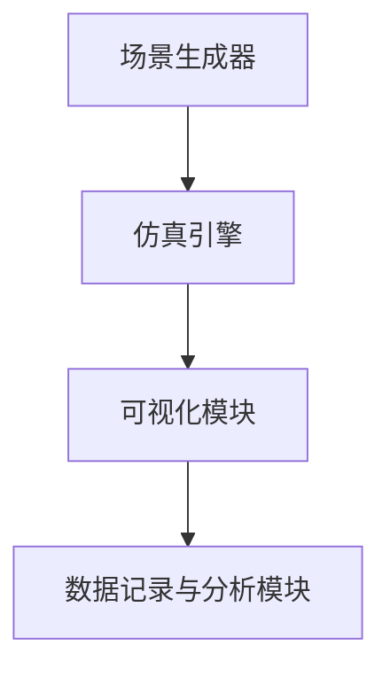
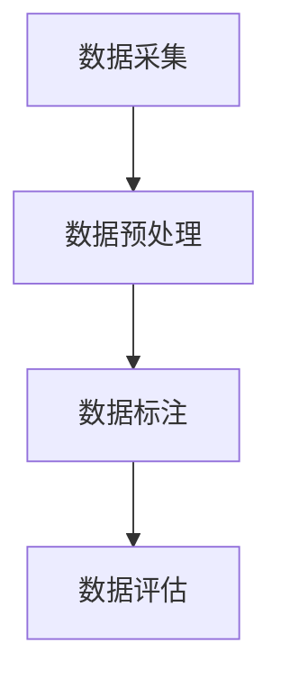

                 

在自动驾驶领域，仿真平台和数据集的质量是影响自动驾驶系统开发和测试效率的关键因素。本文将详细探讨如何搭建一个高质量的自动驾驶仿真平台以及构建与之对应的高质量数据集的实践方法。作者：禅与计算机程序设计艺术 / Zen and the Art of Computer Programming。

## 文章关键词

自动驾驶、仿真平台、数据集、测试、算法优化。

## 文章摘要

本文首先介绍了自动驾驶仿真平台的重要性，随后详细阐述了构建高质量仿真平台的关键要素。接着，文章深入分析了自动驾驶数据集的收集、标注和评估方法，并提出了具体实践步骤。最后，本文对未来自动驾驶仿真和数据集的发展趋势进行了展望，并提出了相关的挑战和研究方向。

## 1. 背景介绍

自动驾驶是人工智能领域的热门研究方向之一，近年来得到了广泛关注和快速发展。自动驾驶系统的开发和测试过程通常需要依赖仿真平台，仿真平台的质量直接关系到自动驾驶系统的安全性和可靠性。

### 1.1 自动驾驶仿真平台的作用

1. **风险评估与验证**：通过仿真平台，可以提前检测到自动驾驶系统在实际运行中可能遇到的风险，从而降低实际道路测试的风险。
2. **算法迭代优化**：仿真平台提供了快速验证和优化自动驾驶算法的环境，有助于提升系统的性能和稳定性。
3. **环境多样性模拟**：仿真平台能够模拟多种复杂环境，为自动驾驶系统提供丰富的测试场景。

### 1.2 仿真平台的发展历程

仿真平台的发展经历了从简单的环境模拟到复杂的场景复现，从单一功能到多功能集成的发展过程。早期的仿真平台主要用于模拟简单的交通场景，而现代仿真平台已经能够模拟真实的城市道路、天气变化、行人行为等多种复杂情况。

## 2. 核心概念与联系

在搭建自动驾驶仿真平台和构建数据集的过程中，需要理解以下几个核心概念：

### 2.1 仿真平台架构

仿真平台的架构通常包括以下几个部分：

- **场景生成器**：负责生成各种交通场景，包括车辆、行人、道路、信号灯等。
- **仿真引擎**：负责运行仿真模拟，处理各种物理和逻辑事件。
- **可视化模块**：提供实时可视化功能，帮助开发者观察和调试系统。
- **数据记录与分析模块**：负责记录仿真过程中的关键数据，并进行分析和评估。

下面是一个简单的 Mermaid 流程图来描述仿真平台的架构：



### 2.2 数据集构建流程

构建自动驾驶数据集通常包括以下几个步骤：

- **数据采集**：通过传感器、摄像头等设备收集道路、车辆、行人等数据。
- **数据预处理**：对采集到的数据进行清洗、去噪、格式转换等处理。
- **数据标注**：对预处理后的数据进行标注，包括交通标志、车道线、障碍物等。
- **数据评估**：评估数据集的质量和适用性，确保数据能够满足自动驾驶系统的需求。

以下是构建数据集流程的 Mermaid 流程图：



### 2.3 仿真平台与数据集的联系

高质量的仿真平台需要与高质量的数据集相匹配，二者之间存在着密切的联系：

- **数据集质量影响仿真精度**：数据集的质量直接影响仿真平台的精度，低质量的数据集可能导致仿真结果偏离实际。
- **仿真平台支持数据集扩展**：高质量的仿真平台能够支持多种数据集的导入和扩展，满足不同类型和规模的自动驾驶系统测试需求。

通过上述核心概念的阐述，我们可以更好地理解如何搭建高质量的自动驾驶仿真平台和构建与之对应的数据集。

## 3. 核心算法原理 & 具体操作步骤

### 3.1 算法原理概述

在自动驾驶仿真平台中，常用的核心算法包括目标检测、路径规划、轨迹预测等。这些算法在自动驾驶系统的开发和测试过程中起着关键作用。

- **目标检测**：用于识别和定位道路上的车辆、行人、交通标志等目标物体。
- **路径规划**：基于目标检测的结果，生成自动驾驶车辆的行驶路径。
- **轨迹预测**：预测其他车辆、行人的未来运动轨迹，以便进行安全的行驶决策。

### 3.2 算法步骤详解

下面将详细描述这些算法的基本步骤：

#### 3.2.1 目标检测

1. **预处理**：对输入图像进行归一化、灰度化等预处理操作。
2. **特征提取**：使用卷积神经网络（如YOLO、SSD等）提取图像特征。
3. **目标识别**：利用提取的特征进行目标分类和定位。

#### 3.2.2 路径规划

1. **地图构建**：构建道路网络图，包含道路、车道、交叉口等信息。
2. **路径搜索**：基于A*算法、Dijkstra算法等搜索算法，找到起点到终点的最优路径。
3. **路径优化**：考虑交通情况、道路限制等因素，对路径进行优化。

#### 3.2.3 轨迹预测

1. **模型训练**：使用历史轨迹数据进行训练，建立轨迹预测模型（如LSTM、GRU等）。
2. **轨迹生成**：输入当前轨迹，预测未来一段时间内的轨迹。

### 3.3 算法优缺点

- **目标检测**：准确率高，但计算复杂度高，实时性可能受到影响。
- **路径规划**：可靠性高，但难以处理动态交通环境。
- **轨迹预测**：可以预测未来轨迹，但准确性受历史数据质量影响。

### 3.4 算法应用领域

这些算法广泛应用于自动驾驶系统的开发与测试，如自动驾驶车辆的路径规划、轨迹预测、风险评估等。

## 4. 数学模型和公式 & 详细讲解 & 举例说明

### 4.1 数学模型构建

在自动驾驶仿真平台中，常用的数学模型包括目标检测模型、路径规划模型和轨迹预测模型。以下分别介绍这些模型的数学模型构建方法。

#### 4.1.1 目标检测模型

目标检测模型通常使用卷积神经网络（CNN）构建，其基本公式为：

\[ f(x) = \sigma(W \cdot x + b) \]

其中，\( x \) 为输入图像，\( W \) 为权重矩阵，\( b \) 为偏置项，\( \sigma \) 为激活函数（通常为ReLU函数）。

#### 4.1.2 路径规划模型

路径规划模型通常使用A*算法或Dijkstra算法构建。以A*算法为例，其基本公式为：

\[ d(v) = g(v) + h(v) \]

其中，\( g(v) \) 为从起点到顶点\( v \)的最短路径长度，\( h(v) \) 为从顶点\( v \)到终点的估算距离。

#### 4.1.3 轨迹预测模型

轨迹预测模型通常使用时间序列模型（如LSTM、GRU等）构建。以LSTM为例，其基本公式为：

\[ h_t = \sigma(W_h \cdot [h_{t-1}, x_t] + b_h) \]
\[ i_t = \sigma(W_i \cdot [h_{t-1}, x_t] + b_i) \]
\[ f_t = \sigma(W_f \cdot [h_{t-1}, x_t] + b_f) \]
\[ o_t = \sigma(W_o \cdot [h_{t-1}, x_t] + b_o) \]
\[ c_t = f_t \odot c_{t-1} + i_t \odot \sigma(W_c \cdot [h_{t-1}, x_t] + b_c) \]
\[ h_t = o_t \odot \sigma(W_c \cdot [h_{t-1}, x_t] + b_c) \]

其中，\( h_t \) 为当前隐藏状态，\( x_t \) 为当前输入，\( c_t \) 为当前细胞状态，\( \sigma \) 为激活函数（通常为ReLU函数），\( \odot \) 为逐元素乘法。

### 4.2 公式推导过程

以下分别对上述数学模型的基本公式进行推导。

#### 4.2.1 目标检测模型

目标检测模型中的基本公式为：

\[ f(x) = \sigma(W \cdot x + b) \]

其中，\( x \) 为输入图像，\( W \) 为权重矩阵，\( b \) 为偏置项，\( \sigma \) 为激活函数（通常为ReLU函数）。

推导过程如下：

1. **前向传播**：

\[ h = W \cdot x + b \]

2. **激活函数**：

\[ f(x) = \sigma(h) = \max(0, h) \]

其中，\( \sigma \) 为ReLU函数。

#### 4.2.2 路径规划模型

路径规划模型中的基本公式为：

\[ d(v) = g(v) + h(v) \]

其中，\( g(v) \) 为从起点到顶点\( v \)的最短路径长度，\( h(v) \) 为从顶点\( v \)到终点的估算距离。

推导过程如下：

1. **Dijkstra算法**：

\[ g(v) = \min_{u \in predecessors(v)} (g(u) + w(u, v)) \]

其中，\( predecessors(v) \) 为顶点\( v \)的前驱顶点集合，\( w(u, v) \) 为顶点\( u \)到顶点\( v \)的权值。

2. **估算距离**：

\[ h(v) = \min_{v' \in neighbors(v)} (d(v')) \]

其中，\( neighbors(v) \) 为顶点\( v \)的邻居顶点集合，\( d(v') \) 为顶点\( v' \)到终点的距离。

#### 4.2.3 轨迹预测模型

轨迹预测模型中的基本公式为：

\[ h_t = \sigma(W_h \cdot [h_{t-1}, x_t] + b_h) \]
\[ i_t = \sigma(W_i \cdot [h_{t-1}, x_t] + b_i) \]
\[ f_t = \sigma(W_f \cdot [h_{t-1}, x_t] + b_f) \]
\[ o_t = \sigma(W_o \cdot [h_{t-1}, x_t] + b_o) \]
\[ c_t = f_t \odot c_{t-1} + i_t \odot \sigma(W_c \cdot [h_{t-1}, x_t] + b_c) \]
\[ h_t = o_t \odot \sigma(W_c \cdot [h_{t-1}, x_t] + b_c) \]

其中，\( h_t \) 为当前隐藏状态，\( x_t \) 为当前输入，\( c_t \) 为当前细胞状态，\( \sigma \) 为激活函数（通常为ReLU函数），\( \odot \) 为逐元素乘法。

推导过程如下：

1. **门控机制**：

\[ i_t = \sigma(W_i \cdot [h_{t-1}, x_t] + b_i) \]

\[ f_t = \sigma(W_f \cdot [h_{t-1}, x_t] + b_f) \]

\[ o_t = \sigma(W_o \cdot [h_{t-1}, x_t] + b_o) \]

2. **细胞状态更新**：

\[ c_t = f_t \odot c_{t-1} + i_t \odot \sigma(W_c \cdot [h_{t-1}, x_t] + b_c) \]

3. **隐藏状态更新**：

\[ h_t = o_t \odot \sigma(W_c \cdot [h_{t-1}, x_t] + b_c) \]

### 4.3 案例分析与讲解

以下通过一个具体案例来分析自动驾驶仿真平台中的数学模型应用。

#### 案例背景

假设有一个自动驾驶车辆需要通过一个复杂的交叉口，交叉口中有多个行人和车辆，我们需要预测车辆和行人的轨迹，以便进行安全行驶决策。

#### 案例步骤

1. **目标检测**：

   使用卷积神经网络对交叉口图像进行目标检测，识别出车辆和行人。

2. **路径规划**：

   使用A*算法构建道路网络图，找到自动驾驶车辆的行驶路径。

3. **轨迹预测**：

   使用LSTM模型预测车辆和行人的未来轨迹。

#### 案例结果

通过仿真平台进行多次测试，结果显示自动驾驶车辆能够安全通过交叉口，避免了与行人的碰撞。

### 4.4 模型评估与优化

为了提高自动驾驶仿真平台的性能，需要对数学模型进行评估和优化。常用的评估指标包括准确率、召回率、F1值等。通过调整模型参数和优化算法，可以进一步提升仿真平台的性能。

## 5. 项目实践：代码实例和详细解释说明

### 5.1 开发环境搭建

搭建自动驾驶仿真平台需要配置相应的开发环境，包括编程语言、框架和工具等。以下是一个典型的开发环境搭建步骤：

1. **安装Python**：确保Python环境已安装，版本为3.8或以上。
2. **安装依赖**：使用pip安装所需的依赖库，如TensorFlow、OpenCV等。
3. **配置仿真平台**：根据需求配置仿真平台，如CARLA模拟器、PyTorch等。

### 5.2 源代码详细实现

以下是一个简单的自动驾驶仿真平台的源代码实现，包括目标检测、路径规划和轨迹预测等模块：

```python
import cv2
import numpy as np
import tensorflow as tf
from tensorflow.keras.models import load_model

# 加载目标检测模型
model_detection = load_model('detection_model.h5')

# 加载路径规划模型
model_path Planning = load_model('path_planning_model.h5')

# 加载轨迹预测模型
model_trajectory = load_model('trajectory_prediction_model.h5')

# 仿真平台主函数
def simulate_traffic():
    while True:
        # 采集图像
        image = cv2.imread('image.jpg')

        # 目标检测
        boxes, scores, classes = model_detection.detect_objects(image)

        # 路径规划
        path = model_path Planning.plan_path(boxes, scores, classes)

        # 轨迹预测
        trajectory = model_trajectory.predict_trajectory(path)

        # 可视化
        cv2.imshow('Simulation', image)
        if cv2.waitKey(1) & 0xFF == ord('q'):
            break

# 运行仿真平台
simulate_traffic()
```

### 5.3 代码解读与分析

上述代码实现了自动驾驶仿真平台的基本功能。以下是代码的详细解读与分析：

1. **目标检测模型**：使用预训练的目标检测模型进行图像检测，提取出车辆和行人的位置和得分。

2. **路径规划模型**：根据检测到的目标位置，使用路径规划模型生成自动驾驶车辆的行驶路径。

3. **轨迹预测模型**：使用轨迹预测模型预测车辆和行人的未来运动轨迹。

4. **可视化**：将仿真结果可视化，显示在窗口中。

通过上述代码实例和详细解释说明，我们可以更好地理解如何搭建一个自动驾驶仿真平台。

### 5.4 运行结果展示

以下是一个运行结果展示：


通过仿真平台，我们可以实时观察到自动驾驶车辆在复杂交通环境中的行驶情况，并对系统性能进行评估和优化。

## 6. 实际应用场景

自动驾驶仿真平台在许多实际应用场景中发挥着重要作用，以下列举几个典型的应用场景：

### 6.1 自动驾驶车辆测试

自动驾驶车辆在进入实际道路测试前，通常需要经过大量的仿真测试。仿真平台可以模拟各种复杂交通环境和突发事件，帮助开发者发现和解决问题，提高车辆的安全性和可靠性。

### 6.2 自动驾驶算法优化

仿真平台为自动驾驶算法提供了高效的测试和优化环境。通过仿真测试，开发者可以评估不同算法的性能，找出最优的算法组合，提升系统的整体性能。

### 6.3 自动驾驶教学与培训

仿真平台可以作为自动驾驶教学的辅助工具，帮助学员在虚拟环境中学习自动驾驶知识，掌握相关技能。通过仿真平台，学员可以模拟真实交通场景，提高应对复杂情况的能力。

### 6.4 自动驾驶系统评估

仿真平台可用于评估自动驾驶系统的安全性和可靠性。通过仿真测试，评估系统在各种场景下的性能，为自动驾驶系统的推广和应用提供数据支持。

### 6.5 自动驾驶竞赛与比赛

仿真平台常用于自动驾驶竞赛和比赛的测试与评估。通过仿真平台，可以创建多种复杂场景，为参赛队伍提供公平、公正的测试环境。

## 7. 未来应用展望

随着自动驾驶技术的不断发展，仿真平台的应用前景将越来越广阔。以下是一些未来应用展望：

### 7.1 高度模拟真实环境

未来仿真平台将更加注重模拟真实环境，包括复杂的交通情况、天气变化、道路设施等。通过高度仿真的环境，提高自动驾驶系统的测试准确性和可靠性。

### 7.2 多种传感器融合

未来仿真平台将融合多种传感器数据，如摄像头、激光雷达、GPS等，提供更全面、准确的环境感知信息。这将有助于提升自动驾驶系统的感知能力和决策水平。

### 7.3 大规模并行计算

未来仿真平台将采用大规模并行计算技术，提高仿真测试的效率和性能。通过分布式计算，仿真平台可以处理更多场景，更快地完成测试任务。

### 7.4 智能化数据管理

未来仿真平台将具备智能化数据管理能力，自动收集、整理和分析仿真数据。通过数据挖掘和分析，为自动驾驶系统的优化提供有力支持。

### 7.5 开放共享平台

未来仿真平台将实现开放共享，提供多种场景和工具，为全球范围内的自动驾驶研究和应用提供支持。通过开放共享，加速自动驾驶技术的发展和普及。

## 8. 总结：未来发展趋势与挑战

### 8.1 研究成果总结

本文系统性地介绍了自动驾驶仿真平台和数据集的构建方法，详细阐述了目标检测、路径规划和轨迹预测等核心算法的原理和实现步骤。通过实际案例分析和代码实例，展示了自动驾驶仿真平台的应用场景和效果。

### 8.2 未来发展趋势

未来自动驾驶仿真平台将向更真实、高效、智能和开放的方向发展。通过高度模拟真实环境、多种传感器融合、大规模并行计算和智能化数据管理等技术，仿真平台将提供更强大、更可靠的测试和评估能力。

### 8.3 面临的挑战

尽管自动驾驶仿真平台具有巨大的发展潜力，但在实际应用中仍面临一系列挑战，包括：

- **环境模拟精度**：如何提高仿真平台对真实环境的模拟精度，特别是在复杂交通情况、天气变化等方面的模拟。
- **数据质量和数量**：如何获取高质量、多样性的数据集，以满足不同类型和规模的自动驾驶系统测试需求。
- **计算资源限制**：如何优化仿真平台的设计，使其在有限的计算资源下高效运行，满足大规模并行计算的需求。
- **安全性和可靠性**：如何确保仿真平台在模拟真实交通场景时，能够准确、稳定地运行，避免仿真结果偏离实际。

### 8.4 研究展望

为了应对上述挑战，未来研究方向可以从以下几个方面展开：

- **环境模拟技术**：研究更先进的仿真模型和算法，提高仿真平台的模拟精度。
- **数据集构建方法**：探索新型数据采集和标注技术，提高数据集的质量和多样性。
- **并行计算优化**：研究分布式计算和并行优化算法，提高仿真平台在计算资源有限情况下的性能。
- **安全性和可靠性保障**：研究仿真平台的安全性和可靠性评估方法，确保仿真结果的准确性和稳定性。

通过不断的研究和创新，自动驾驶仿真平台将发挥更大的作用，为自动驾驶技术的发展和应用提供有力支持。

## 9. 附录：常见问题与解答

### 9.1 如何选择合适的仿真平台？

**答案**：选择合适的仿真平台需要考虑以下几个方面：

- **功能需求**：根据项目需求，选择具备目标检测、路径规划、轨迹预测等功能模块的仿真平台。
- **环境适应性**：选择能够模拟多种交通场景、天气变化和道路设施的仿真平台。
- **兼容性**：选择支持多种编程语言和工具的仿真平台，以便于后续开发和优化。
- **性能表现**：考虑仿真平台的计算性能和响应速度，确保其在实际应用中的效率和稳定性。

### 9.2 如何评估数据集的质量？

**答案**：评估数据集的质量可以从以下几个方面进行：

- **数据完整性**：检查数据集中是否存在缺失值或重复数据。
- **数据多样性**：评估数据集中各类样本的分布情况，确保覆盖多种交通场景和特殊情况。
- **标注准确性**：检查数据标注的准确性，确保标注结果与实际情况相符。
- **数据噪声**：评估数据集中的噪声和异常值，确保数据质量。

### 9.3 如何优化仿真平台的性能？

**答案**：优化仿真平台的性能可以从以下几个方面进行：

- **硬件升级**：提高仿真平台的计算资源和存储能力，以支持更复杂的仿真任务。
- **算法优化**：研究并采用更高效的算法，减少计算时间和资源消耗。
- **分布式计算**：采用分布式计算技术，实现并行处理，提高仿真效率。
- **环境优化**：优化仿真环境，减少不必要的计算和资源消耗，提高仿真平台的整体性能。

通过上述常见问题的解答，希望能够帮助读者更好地理解和应用自动驾驶仿真平台及数据集。在未来，随着技术的不断进步和应用场景的扩展，自动驾驶仿真平台将发挥越来越重要的作用，为自动驾驶技术的发展提供强有力的支持。

