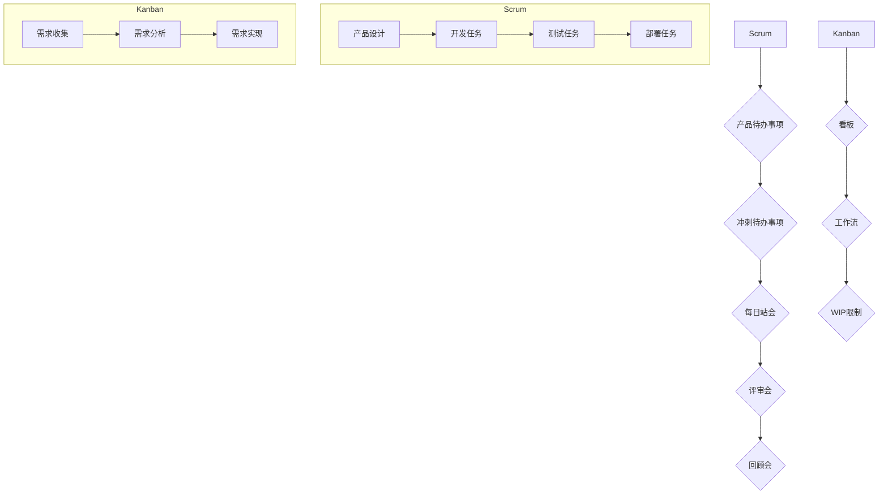

                 

敏捷开发方法是现代软件开发中的重要实践，旨在提高开发团队的生产力和项目的交付质量。其中，Scrum和看板方法是两种常用的敏捷开发框架，它们各自具有独特的特点和优势。本文将深入探讨这两种方法，分析它们的原理、实践步骤、优缺点以及应用领域，旨在为读者提供全面而深入的理解。

## 关键词

敏捷开发、Scrum、看板方法、生产力、交付质量、团队协作

## 摘要

本文首先介绍了敏捷开发方法的背景和重要性，随后详细阐述了Scrum和看板方法的核心理念和实践步骤。通过比较两种方法的优缺点，本文指出了它们在不同场景下的适用性。最后，文章对未来的发展进行了展望，并提出了相关的挑战和建议。

## 1. 背景介绍

### 1.1 传统开发方法与敏捷开发

在传统的软件开发方法中，项目通常按照严格的时间表和预算计划进行，开发团队往往在项目初期就确定所有的需求和功能。这种方法被称为“瀑布模型”，它强调顺序执行，从需求分析到设计、开发、测试和部署，每个阶段必须完全完成才能进入下一阶段。

然而，随着软件项目的复杂性不断增加，客户需求的变化变得更加频繁且不可预测。传统的瀑布模型在这种动态环境中显得力不从心，经常导致项目延期、成本超支和客户满意度下降。为了应对这些问题，敏捷开发方法应运而生。

### 1.2 敏捷开发的起源与发展

敏捷开发（Agile Development）起源于20世纪90年代，最初是由一些软件开发者提出的，他们发现传统的方法不再适用于快速变化的环境。2001年，这些开发者在美国举行的一次会议上共同签署了《敏捷宣言》（Agile Manifesto），并提出了四项核心价值观：

1. **个体和互动重于流程和工具**：强调团队协作和沟通。
2. **可工作的软件重于详尽的文档**：注重实际可执行的软件成果。
3. **客户合作重于合同谈判**：与客户紧密合作，确保需求符合实际。
4. **响应变化重于遵循计划**：灵活应对需求变化。

随后，基于这些价值观，一系列敏捷开发方法被提出，如Scrum、看板方法（Kanban）、XP（极端编程）等。这些方法在提高开发团队的生产力、提升项目交付质量方面取得了显著成效。

### 1.3 敏捷开发的优势

敏捷开发方法具有以下几项主要优势：

1. **快速迭代与持续交付**：开发过程被分解为多个迭代周期，每个周期都产出可工作的软件，客户可以随时进行反馈和调整。
2. **灵活性**：面对需求变化，敏捷方法能够迅速调整计划和资源，以适应新的需求。
3. **提高团队协作**：强调团队合作和沟通，团队成员共同负责项目的成功。
4. **客户满意度**：通过持续的合作和反馈，确保最终交付的产品能够满足客户需求。

## 2. 核心概念与联系

### 2.1 Scrum

Scrum是一种迭代和增量的敏捷开发框架，它强调团队协作、快速反馈和持续改进。Scrum的核心概念包括产品待办事项（Product Backlog）、冲刺待办事项（Sprint Backlog）、每日站会（Daily Stand-up）、评审会和回顾会。

### 2.2 看板方法

看板方法（Kanban）源自于日本丰田公司的生产系统，它强调流程的连续性和优化。看板方法的核心概念包括看板（Kanban Card）、工作流（Work Flow）、限制工作在流程中的数量（Work In Process，WIP）。

### 2.3 Mermaid 流程图

下面是Scrum和看板方法的核心概念和架构的Mermaid流程图：



## 3. 核心算法原理 & 具体操作步骤

### 3.1 算法原理概述

Scrum和看板方法的核心算法原理主要在于如何高效地进行项目管理和任务分配，以及如何通过不断的迭代和反馈来优化开发流程。Scrum强调固定的时间框（冲刺）和明确的目标，而看板方法则注重工作流的可视化和持续改进。

### 3.2 算法步骤详解

#### 3.2.1 Scrum

1. **产品待办事项**：产品负责人（Product Owner）负责定义和更新产品待办事项，列出所有待完成的任务和需求。
2. **冲刺待办事项**：团队在每次冲刺开始前，从产品待办事项中选择若干任务，形成冲刺待办事项。
3. **每日站会**：团队每天召开5-10分钟的站会，讨论当天的工作进展和遇到的问题。
4. **评审会**：在冲刺结束时，团队展示已完成的成果，收集客户和利益相关者的反馈。
5. **回顾会**：团队在每次冲刺结束后举行回顾会，讨论如何改进流程和提升效率。

#### 3.2.2 看板方法

1. **看板**：每个任务都被分配一个看板卡，上面包含任务的详细信息和状态。
2. **工作流**：工作流定义了任务从开始到结束的整个过程，每个阶段都有明确的工作规则。
3. **WIP限制**：在每个工作阶段，限制同时进行的工作数量，以避免过度的并行处理和瓶颈。

### 3.3 算法优缺点

#### Scrum

**优点**：
- 强调团队合作和目标明确。
- 提高项目交付的可预测性。
- 通过快速反馈和持续改进，提升产品质量。

**缺点**：
- 固定的时间框可能限制灵活性。
- 对团队协作和沟通要求较高。

#### 看板方法

**优点**：
- 强调工作流的可视化和持续改进。
- 提高任务完成率和资源利用率。
- 通过限制WIP，减少并行处理的瓶颈。

**缺点**：
- 需要详细的工作规则和流程。
- 可能对任务的整体规划和协调性有所影响。

### 3.4 算法应用领域

Scrum和看板方法在不同领域有不同的应用：

- **软件项目开发**：Scrum适用于需求频繁变化的项目，而看板方法适用于稳定的需求和连续的生产流程。
- **产品制造**：看板方法在制造业中广泛使用，以提高生产效率和减少浪费。
- **服务行业**：Scrum和看板方法在服务行业中也得到应用，如客户服务和IT支持。

## 4. 数学模型和公式 & 详细讲解 & 举例说明

### 4.1 数学模型构建

Scrum和看板方法的数学模型主要涉及项目进度评估、资源分配和风险管理。以下是一些常用的数学模型和公式：

#### 4.1.1 项目进度评估

1. **预测完成时间**：
   $$ T_c = \frac{T_p + 4T_e}{6} $$
   其中，$T_c$是预测完成时间，$T_p$是预测工期，$T_e$是估算误差。

2. **进度偏差**：
   $$ P_v = \frac{C - E}{E} $$
   其中，$P_v$是进度偏差，$C$是实际完成时间，$E$是计划完成时间。

#### 4.1.2 资源分配

1. **最小生成树**：
   用于在多个任务和资源之间找到最优分配方案。

2. **资源平衡**：
   $$ R_{max} = \frac{\sum_{i=1}^{n} R_i \cdot T_i}{\sum_{i=1}^{n} T_i} $$
   其中，$R_{max}$是最大可用资源，$R_i$是第i个资源的可用量，$T_i$是第i个任务的工期。

#### 4.1.3 风险管理

1. **风险矩阵**：
   用于评估风险的概率和影响，并根据评分进行优先级排序。

### 4.2 公式推导过程

#### 4.2.1 预测完成时间

预测完成时间是基于三点估算法，它考虑了最乐观时间（$T_o$）、最可能时间（$T_m$）和最悲观时间（$T_p$）。通过以下公式计算：
$$ T_e = T_p - T_o $$
$$ T_c = \frac{T_o + 4T_m + T_p}{6} $$

#### 4.2.2 进度偏差

进度偏差衡量的是实际进度与计划进度之间的差异。通过计算实际完成时间与计划完成时间之差，可以得到进度偏差。

### 4.3 案例分析与讲解

#### 4.3.1 项目进度评估

假设一个软件项目预计需要20天完成，但估算误差为5天。使用预测完成时间公式：
$$ T_c = \frac{20 + 4 \cdot 20 + 25}{6} = 22.5 \text{天} $$

#### 4.3.2 资源分配

假设有三个任务，每个任务需要不同的资源，具体数据如下：

| 任务 | 工期（天） | 资源1（小时） | 资源2（小时） | 资源3（小时） |
| ---- | ---------- | ------------ | ------------ | ------------ |
| A    | 5          | 10           | 5            | 0            |
| B    | 10         | 8            | 10           | 5            |
| C    | 15         | 6            | 5            | 10           |

使用资源平衡公式：
$$ R_{max} = \frac{(10 \cdot 5 + 8 \cdot 10 + 6 \cdot 15)}{(5 + 10 + 15)} = 8.57 \text{小时} $$

## 5. 项目实践：代码实例和详细解释说明

### 5.1 开发环境搭建

为了实践Scrum和看板方法，我们选择一个简单的Web应用项目作为示例。以下是开发环境的基本要求：

1. **编程语言**：使用Python和Flask框架。
2. **数据库**：使用SQLite。
3. **版本控制**：使用Git。

安装相关依赖：

```bash
pip install flask
pip install pymysql
```

### 5.2 源代码详细实现

以下是一个简单的Web应用示例，它包含一个用于用户注册和登录的接口。

```python
# app.py

from flask import Flask, request, jsonify
from flask_sqlalchemy import SQLAlchemy

app = Flask(__name__)
app.config['SQLALCHEMY_DATABASE_URI'] = 'sqlite:///users.db'
db = SQLAlchemy(app)

class User(db.Model):
    id = db.Column(db.Integer, primary_key=True)
    username = db.Column(db.String(80), unique=True, nullable=False)
    password = db.Column(db.String(120), nullable=False)

@app.route('/register', methods=['POST'])
def register():
    username = request.form['username']
    password = request.form['password']
    if User.query.filter_by(username=username).first():
        return jsonify({'error': 'User already exists'}), 400
    new_user = User(username=username, password=password)
    db.session.add(new_user)
    db.session.commit()
    return jsonify({'message': 'User registered successfully'})

@app.route('/login', methods=['POST'])
def login():
    username = request.form['username']
    password = request.form['password']
    user = User.query.filter_by(username=username, password=password).first()
    if user:
        return jsonify({'message': 'Login successful'})
    else:
        return jsonify({'error': 'Invalid credentials'}), 401

if __name__ == '__main__':
    db.create_all()
    app.run(debug=True)
```

### 5.3 代码解读与分析

上述代码实现了一个简单的用户注册和登录功能。我们首先定义了一个用户模型（`User`），它包含用户的ID、用户名和密码。然后，我们分别实现了注册和登录的接口。注册接口接收用户名和密码，并将新用户信息存储到数据库中。登录接口验证用户名和密码，如果正确，返回登录成功信息。

### 5.4 运行结果展示

运行应用程序后，可以使用以下命令进行测试：

```bash
curl -X POST -d "username=test&password=test" http://127.0.0.1:5000/register
curl -X POST -d "username=test&password=test" http://127.0.0.1:5000/login
```

## 6. 实际应用场景

### 6.1 软件开发

Scrum和看板方法在软件项目中应用广泛。Scrum通过固定的时间框和明确的冲刺目标，帮助团队高效地进行任务分配和进度控制。看板方法则通过可视化的工作流和WIP限制，优化了开发过程中的资源利用和流程效率。

### 6.2 制造业

看板方法在制造业中的应用尤为成功。通过看板卡，制造企业可以实时跟踪生产进度，减少库存和浪费，提高生产效率和产品质量。

### 6.3 服务行业

在服务行业中，Scrum和看板方法也被广泛应用。例如，客户服务中心可以使用Scrum进行任务管理和客户支持，而IT支持团队则可以使用看板方法来优化工作流和响应速度。

### 6.4 未来应用展望

随着敏捷开发方法的不断成熟和应用，未来它将在更多领域得到推广。特别是在数字化转型和智能化生产的背景下，敏捷开发方法将发挥更大的作用，帮助企业和团队在快速变化的市场环境中保持竞争优势。

## 7. 工具和资源推荐

### 7.1 学习资源推荐

1. **《敏捷开发实践指南》**：作者：杰夫·萨瑟兰（Jeff Sutherland）。
2. **《Kanban实战》**：作者：David J. Anderson。

### 7.2 开发工具推荐

1. **JIRA**：用于项目管理、任务跟踪和敏捷开发实践。
2. **Trello**：基于看板方法的任务管理工具。

### 7.3 相关论文推荐

1. **《敏捷开发：从原理到实践》**：作者：托马斯·马斯特斯（Thomas H. Dwyer Jr.）。
2. **《敏捷开发方法在软件开发中的应用》**：作者：赵志宏。

## 8. 总结：未来发展趋势与挑战

### 8.1 研究成果总结

敏捷开发方法自提出以来，已在软件开发、制造业和服务行业等多个领域得到广泛应用。通过实践证明，敏捷开发方法能够显著提高团队的生产力和项目的交付质量。

### 8.2 未来发展趋势

随着数字化转型的推进，敏捷开发方法将在更多行业得到应用。特别是在复杂项目管理和跨领域协作方面，敏捷开发方法具有巨大的潜力。

### 8.3 面临的挑战

1. **团队协作与沟通**：敏捷开发方法强调团队合作和沟通，但在实际应用中，如何确保团队成员之间的有效沟通和协作仍是一个挑战。
2. **项目管理与协调**：在大型项目中，如何进行有效的项目管理、协调资源和应对变化仍是一个难题。

### 8.4 研究展望

未来的研究应重点关注如何将敏捷开发方法与其他管理方法相结合，以应对不同类型的项目和场景。同时，探索敏捷开发方法在跨领域和跨文化环境中的应用也是重要的研究方向。

## 9. 附录：常见问题与解答

### 9.1 什么是敏捷开发？

敏捷开发是一种以人为核心、迭代、增量和灵活响应变化的软件开发方法。

### 9.2 Scrum和看板方法的主要区别是什么？

Scrum强调固定的时间框和冲刺目标，而看板方法注重工作流的可视化和持续改进。

### 9.3 如何选择Scrum或看板方法？

根据项目需求、团队规模和工作环境选择。对于需求变化频繁的项目，Scrum更为合适；而对于稳定的需求和连续的生产流程，看板方法更为有效。

---

作者：禅与计算机程序设计艺术 / Zen and the Art of Computer Programming

通过本文，我们系统地介绍了敏捷开发方法，深入探讨了Scrum和看板方法的核心概念、实施步骤和应用领域。希望本文能为读者在敏捷开发实践中提供有价值的参考和指导。

