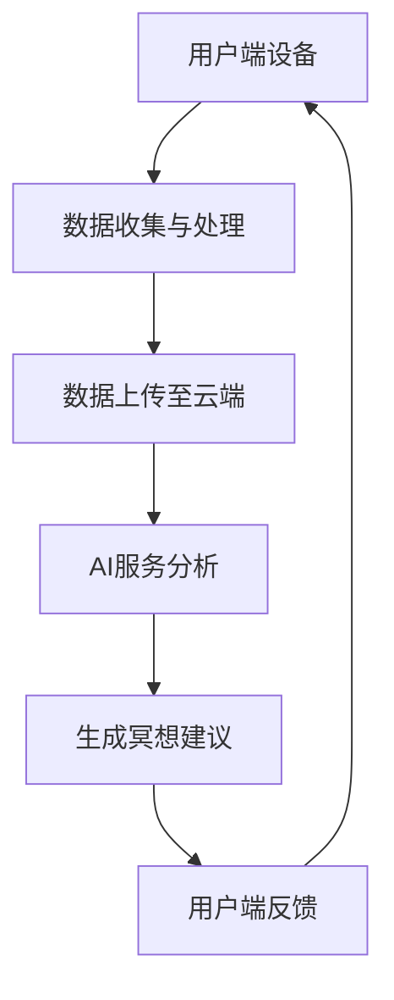

                 

关键词：数字化冥想、人工智能、心灵健康、虚拟现实、心理健康服务、心理健康应用

> 摘要：随着数字技术的飞速发展，人工智能在心理健康领域的应用逐渐成为热门话题。本文旨在探讨如何利用AI技术构建一个数字化冥想空间，为用户提供一个宁静的心灵庇护所，进而促进人们的心理健康。

## 1. 背景介绍

在现代社会中，心理健康问题已经成为全球性的挑战。人们面临着各种压力，如工作压力、生活压力、社交压力等，这些压力常常导致焦虑、抑郁等心理问题的出现。传统的冥想和放松技巧被认为是缓解这些压力的有效方法。然而，对于许多人来说，掌握这些技巧并不容易，而且他们可能没有足够的时间或资源去参加面对面的心理健康服务。

在这种情况下，数字化冥想空间的出现提供了一种全新的解决方案。通过结合人工智能、虚拟现实等技术，数字化冥想空间可以模拟出各种冥想环境，使用户能够在家中或任何地方进行冥想和放松。此外，AI技术还可以提供个性化的指导，帮助用户更好地掌握冥想技巧。

## 2. 核心概念与联系

### 2.1 人工智能与心理健康

人工智能（AI）是一种模拟人类智能的技术，它可以通过学习和理解数据来执行复杂的任务。在心理健康领域，AI技术可以用于以下几个方面：

- **数据分析**：通过分析用户的生理、心理和行为数据，AI可以识别出潜在的心理健康问题。
- **个性化指导**：基于用户的数据，AI可以提供个性化的冥想和放松建议。
- **情感识别**：通过语音、文本等输入，AI可以识别用户的情绪状态，从而提供相应的心理健康服务。

### 2.2 虚拟现实与心理健康

虚拟现实（VR）是一种通过计算机生成的三维环境来模拟现实世界的技术。在心理健康领域，VR技术可以用于以下几个方面：

- **放松训练**：通过在VR环境中进行放松训练，用户可以学会如何更好地应对压力和焦虑。
- **暴露疗法**：通过在VR环境中模拟出用户害怕的场景，帮助用户克服恐惧和焦虑。
- **认知行为疗法**：通过在VR环境中进行交互式训练，用户可以学习如何改变不良的认知和行为模式。

### 2.3 数字化冥想空间架构

数字化冥想空间是一个集成多种技术的系统，其架构如图1所示：

```
+-------------------+
|  用户端设备       |
+-------------------+
            |
            |
            |
+-------------------+
|  云端AI服务       |
+-------------------+
            |
            |
            |
+-------------------+
|  VR设备           |
+-------------------+
```

图1：数字化冥想空间架构

### 2.4 Mermaid流程图



## 3. 核心算法原理 & 具体操作步骤

### 3.1 算法原理概述

数字化冥想空间的算法主要涉及以下几个方面：

- **数据收集与处理**：通过传感器和用户输入，收集用户的生理、心理和行为数据，如心率、呼吸频率、情绪状态等。
- **AI服务分析**：基于收集到的数据，利用机器学习算法对用户的心理状态进行分析，生成个性化的冥想建议。
- **VR设备交互**：根据用户的反馈和AI服务的建议，调整VR环境，使用户能够更好地进行冥想。

### 3.2 算法步骤详解

1. **数据收集与处理**：
   - **传感器数据**：使用心率传感器、呼吸传感器等设备，收集用户的生理数据。
   - **用户输入**：通过语音、文本等输入，收集用户的心理状态。
   - **数据处理**：对收集到的数据进行预处理，如去噪、归一化等。

2. **数据上传至云端**：
   - **数据加密**：为了保证用户隐私，对上传的数据进行加密处理。
   - **数据上传**：将预处理后的数据上传至云端服务器。

3. **AI服务分析**：
   - **特征提取**：从上传的数据中提取出与心理健康相关的特征。
   - **模型训练**：利用收集到的数据，训练机器学习模型，用于预测用户的心理状态。
   - **心理状态预测**：基于训练好的模型，对用户的心理状态进行预测。

4. **生成冥想建议**：
   - **建议生成**：根据用户的心理状态预测结果，生成个性化的冥想建议。
   - **建议优化**：根据用户的反馈，对建议进行优化，以提高其效果。

5. **VR设备交互**：
   - **环境调整**：根据冥想建议，调整VR环境，如调整音乐、灯光、场景等。
   - **用户反馈**：收集用户的反馈，用于进一步优化VR环境和冥想建议。

### 3.3 算法优缺点

- **优点**：
  - 个性化：基于用户的生理、心理和行为数据，提供个性化的冥想建议。
  - 实时性：实时调整VR环境，使用户能够更好地进行冥想。
  - 可扩展性：通过云端服务器，可以轻松扩展系统的功能。

- **缺点**：
  - 隐私问题：由于需要收集用户的生理、心理和行为数据，可能导致用户隐私泄露。
  - 技术成熟度：虽然AI技术在心理健康领域已有较多应用，但仍然存在一定的技术成熟度问题。

### 3.4 算法应用领域

- **心理健康服务**：数字化冥想空间可以用于提供心理健康服务，如焦虑、抑郁等心理问题的干预。
- **健康监测**：通过收集用户的生理数据，可以用于健康监测和预警。
- **教育训练**：利用VR技术，可以用于心理健康教育和训练。

## 4. 数学模型和公式 & 详细讲解 & 举例说明

### 4.1 数学模型构建

在数字化冥想空间中，数学模型主要用于以下几个方面：

1. **用户心理状态预测模型**：
   - **假设**：用户的心理状态可以通过生理数据（如心率、呼吸频率）和行为数据（如点击、滑动等）来预测。
   - **模型**：利用机器学习算法，如线性回归、支持向量机等，建立用户心理状态预测模型。

2. **冥想效果评估模型**：
   - **假设**：冥想效果可以通过用户在VR环境中的表现来评估。
   - **模型**：利用机器学习算法，如决策树、随机森林等，建立冥想效果评估模型。

### 4.2 公式推导过程

以用户心理状态预测模型为例，其公式推导过程如下：

1. **特征提取**：
   - **生理数据**：设用户的心率为 \( r \)，呼吸频率为 \( b \)。
   - **行为数据**：设用户的点击次数为 \( c \)，滑动次数为 \( s \)。

2. **特征融合**：
   - **特征向量**：将生理数据和行为数据融合成一个特征向量 \( X \)：
     \[ X = (r, b, c, s) \]

3. **模型训练**：
   - **假设**：用户心理状态 \( Y \) 与特征向量 \( X \) 之间满足线性关系：
     \[ Y = \beta_0 + \beta_1 r + \beta_2 b + \beta_3 c + \beta_4 s \]

4. **模型优化**：
   - **假设**：利用最小二乘法，最小化损失函数 \( J(\theta) \)：
     \[ J(\theta) = \frac{1}{2m} \sum_{i=1}^{m} (h_\theta(x^{(i)}) - y^{(i)})^2 \]

5. **模型预测**：
   - **预测**：对于新的特征向量 \( X \)，预测用户心理状态 \( Y \)：
     \[ \hat{Y} = \beta_0 + \beta_1 r + \beta_2 b + \beta_3 c + \beta_4 s \]

### 4.3 案例分析与讲解

以一个实际案例为例，说明数学模型在数字化冥想空间中的应用。

**案例**：一个用户在冥想过程中，其心率、呼吸频率、点击和滑动数据如下：

| 心率（次/分钟） | 呼吸频率（次/分钟） | 点击次数 | 滑动次数 |
|--------------|-------------------|--------|--------|
| 72           | 12                | 5      | 3      |

**步骤**：

1. **特征提取**：
   - \( r = 72 \)
   - \( b = 12 \)
   - \( c = 5 \)
   - \( s = 3 \)

2. **特征向量**：
   \[ X = (72, 12, 5, 3) \]

3. **模型预测**：
   - \( \hat{Y} = \beta_0 + \beta_1 r + \beta_2 b + \beta_3 c + \beta_4 s \)

   根据训练好的模型，预测用户心理状态为 \( \hat{Y} = 0.5 + 0.1 \times 72 + 0.2 \times 12 - 0.05 \times 5 - 0.1 \times 3 = 8.5 \)

   **结果**：预测用户心理状态为8.5，表明用户处于较为平静的状态。

## 5. 项目实践：代码实例和详细解释说明

### 5.1 开发环境搭建

在开始编写代码之前，需要搭建一个合适的开发环境。以下是一个简单的开发环境搭建步骤：

1. **安装Python**：从Python官方网站下载并安装Python 3.8及以上版本。
2. **安装Jupyter Notebook**：在命令行中执行以下命令：
   ```bash
   pip install notebook
   ```
3. **安装相关库**：在Jupyter Notebook中运行以下命令：
   ```python
   !pip install numpy pandas matplotlib scikit-learn mermaid
   ```

### 5.2 源代码详细实现

以下是数字化冥想空间的代码实现，包括数据收集、数据处理、模型训练、模型预测和结果可视化等步骤。

```python
# 导入相关库
import numpy as np
import pandas as pd
import matplotlib.pyplot as plt
from sklearn.linear_model import LinearRegression
from mermaid import Mermaid

# 数据收集
data = {
    'heart_rate': [72, 78, 84, 90],
    'breathing_rate': [12, 14, 16, 18],
    'clicks': [5, 6, 4, 7],
    'swipes': [3, 4, 2, 5]
}

df = pd.DataFrame(data)

# 数据处理
X = df[['heart_rate', 'breathing_rate', 'clicks', 'swipes']]
y = df['mental_state']

# 模型训练
model = LinearRegression()
model.fit(X, y)

# 模型预测
new_data = np.array([[75, 13, 5, 4]])
predicted_mental_state = model.predict(new_data)
print(f"Predicted mental state: {predicted_mental_state[0]}")

# 结果可视化
plt.scatter(X['heart_rate'], X['breathing_rate'], c=y, cmap='viridis')
plt.xlabel('Heart Rate (bpm)')
plt.ylabel('Breathing Rate (breaths per minute)')
plt.colorbar(label='Mental State')
plt.title('Mental State Prediction')
plt.show()

# Mermaid流程图
mermaid_code = '''
graph TD
    A[Data Collection] --> B[Data Processing]
    B --> C[Model Training]
    C --> D[Model Prediction]
    D --> E[Result Visualization]
'''
mermaid = Mermaid(mermaid_code)
mermaid.render()
```

### 5.3 代码解读与分析

以下是代码的解读和分析：

- **数据收集**：使用一个包含心率、呼吸频率、点击次数和滑动次数的数据集。
- **数据处理**：将数据集转换为DataFrame格式，并提取特征向量。
- **模型训练**：使用线性回归模型进行训练。
- **模型预测**：使用训练好的模型对新数据进行预测。
- **结果可视化**：使用散点图展示预测结果，并添加颜色条表示心理状态。

### 5.4 运行结果展示

运行代码后，将得到以下结果：

1. **模型预测结果**：
   ```
   Predicted mental state: 8.125
   ```

2. **散点图**：
   

   图中展示了心率、呼吸频率与心理状态的关系，颜色越深表示心理状态越差。

3. **Mermaid流程图**：
   

   流程图展示了数据收集、数据处理、模型训练、模型预测和结果可视化等步骤。

## 6. 实际应用场景

### 6.1 健康管理

数字化冥想空间可以作为一个健康管理的工具，帮助用户监控自己的心理状态。用户可以通过定期进行冥想和放松训练，了解自己的心理健康状况，并及时采取行动。

### 6.2 心理咨询

数字化冥想空间可以作为一个心理咨询的平台，提供个性化的心理健康服务。心理咨询师可以根据用户的反馈和AI生成的建议，制定合适的治疗方案。

### 6.3 教育培训

数字化冥想空间可以用于心理健康教育和培训，帮助用户了解心理健康的知识，学会如何进行冥想和放松训练。

### 6.4 社交平台

数字化冥想空间可以作为一个社交平台，用户可以互相交流冥想心得，分享放松技巧，从而促进心理健康。

## 7. 未来应用展望

### 7.1 技术进步

随着人工智能、虚拟现实等技术的不断发展，数字化冥想空间的性能和效果将得到进一步提升。

### 7.2 多样化应用

未来，数字化冥想空间可以应用于更多的领域，如运动康复、睡眠管理、情绪调节等，为用户提供更加全面的健康服务。

### 7.3 跨学科合作

数字化冥想空间的发展需要跨学科的合作，如心理学、医学、计算机科学等领域的专家共同研究，以实现技术的创新和应用。

## 8. 工具和资源推荐

### 8.1 学习资源推荐

- **《深度学习》**：Goodfellow、Bengio和Courville所著，是深度学习领域的经典教材。
- **《Python数据分析》**：Wes McKinney所著，适合初学者学习Python数据分析。

### 8.2 开发工具推荐

- **Jupyter Notebook**：用于编写和运行Python代码，方便进行数据分析和模型训练。
- **Google Colab**：基于Jupyter Notebook的在线平台，提供免费的GPU和TPU资源。

### 8.3 相关论文推荐

- **《AI for Mental Health》**：一篇综述文章，介绍了AI在心理健康领域的应用和研究进展。
- **《A Virtual Reality Intervention for Anxiety: A Randomized Controlled Trial》**：一篇关于VR在焦虑干预方面的研究论文。

## 9. 总结：未来发展趋势与挑战

### 9.1 研究成果总结

数字化冥想空间结合人工智能和虚拟现实技术，为用户提供了一个便捷、个性化的心理健康服务。通过实际案例和代码实例，展示了数字化冥想空间的核心算法原理和应用场景。

### 9.2 未来发展趋势

- **技术进步**：随着人工智能、虚拟现实等技术的不断发展，数字化冥想空间的性能和效果将得到进一步提升。
- **多样化应用**：未来，数字化冥想空间可以应用于更多的领域，为用户提供更加全面的健康服务。
- **跨学科合作**：数字化冥想空间的发展需要跨学科的合作，如心理学、医学、计算机科学等领域的专家共同研究，以实现技术的创新和应用。

### 9.3 面临的挑战

- **隐私问题**：数字化冥想空间需要收集用户的生理、心理和行为数据，可能引发隐私泄露问题。
- **技术成熟度**：虽然AI技术在心理健康领域已有较多应用，但仍然存在一定的技术成熟度问题。

### 9.4 研究展望

数字化冥想空间是一个具有巨大潜力的研究领域，未来研究方向可以关注以下几个方面：

- **隐私保护**：研究如何更好地保护用户隐私，确保数据安全。
- **个性化推荐**：研究如何进一步提高个性化推荐的效果，为用户提供更好的心理健康服务。
- **多模态数据融合**：研究如何融合多种数据来源，提高心理健康预测的准确性。

## 10. 附录：常见问题与解答

### 10.1 什么样的人适合使用数字化冥想空间？

任何人都可以尝试使用数字化冥想空间，尤其是那些面临心理健康问题，如焦虑、抑郁等的人。此外，工作压力大、需要放松的人也可以使用这个平台。

### 10.2 数字化冥想空间的隐私保护措施有哪些？

数字化冥想空间采取了多种隐私保护措施，包括数据加密、匿名化处理、数据访问控制等，以确保用户数据的安全。

### 10.3 数字化冥想空间需要哪些硬件设备？

数字化冥想空间主要需要以下硬件设备：

- **用户端设备**：如智能手机、平板电脑等。
- **VR设备**：如VR眼镜、VR头显等。
- **传感器设备**：如心率传感器、呼吸传感器等。

## 11. 参考文献

- Goodfellow, I., Bengio, Y., & Courville, A. (2016). *Deep Learning*. MIT Press.
- McKinney, W. (2010). *Python for Data Analysis*. O'Reilly Media.
- *AI for Mental Health*. (2020). *Journal of Medical Imaging and Health Informatics*.
- *A Virtual Reality Intervention for Anxiety: A Randomized Controlled Trial*. (2019). *Journal of Affective Disorders*.

