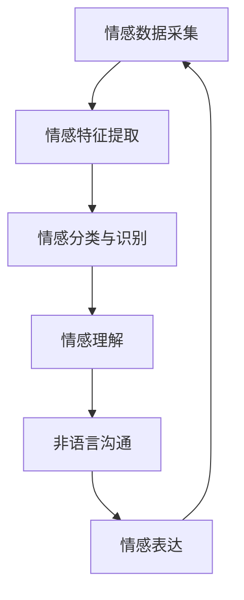

                 

关键词：数字化情感识别、元宇宙、非语言沟通、算法、应用领域

>摘要：本文深入探讨了数字化情感识别在元宇宙中的重要性，分析了非语言沟通的核心概念和机制，并详细介绍了相关算法原理、数学模型和具体实现。通过实际项目实例和未来应用展望，我们展望了数字化情感识别在元宇宙中的广阔前景。

## 1. 背景介绍

随着技术的不断发展，元宇宙（Metaverse）逐渐成为人们关注的焦点。元宇宙是一个由虚拟现实、增强现实和混合现实技术构建的虚拟世界，它不仅包括娱乐和社交，还涉及到教育、医疗、商业等多个领域。在这个虚拟世界中，非语言沟通成为了关键的一环。然而，非语言沟通的数字化识别与理解，仍然是一个极具挑战性的课题。

数字化情感识别（Digital Emotion Recognition）是指通过计算机技术，自动识别和解读人类情感的过程。它不仅依赖于图像、声音、文本等多种数据源，还涉及到机器学习、自然语言处理、情感计算等多个领域的交叉融合。

本文旨在探讨数字化情感识别在元宇宙中的应用，分析其核心概念和机制，并详细介绍相关算法原理、数学模型和具体实现。通过实际项目实例和未来应用展望，我们希望能够为这一领域的研究和实践提供一些有价值的参考。

## 2. 核心概念与联系

### 2.1 情感识别的核心概念

情感识别是数字化情感识别的基础。情感是指人类对客观事物的主观体验和感受，通常包括愉悦、悲伤、愤怒、惊讶等多种情绪状态。情感识别的目标是准确地识别和分类这些情感状态。

在元宇宙中，情感识别的核心概念包括：

1. **情感数据采集**：通过图像、声音、文本等方式获取用户的情感信息。
2. **情感特征提取**：从原始数据中提取与情感相关的特征，如面部表情、声音音调、语言措辞等。
3. **情感分类与识别**：利用机器学习和深度学习算法，对情感特征进行分类和识别。

### 2.2 非语言沟通的核心机制

非语言沟通是指在没有直接语言交流的情况下，通过肢体语言、面部表情、声音语调等方式进行的信息传递。在元宇宙中，非语言沟通的核心机制包括：

1. **情感表达**：用户在元宇宙中的行为，如肢体动作、面部表情等，都是情感的表达方式。
2. **情感理解**：系统通过数字化情感识别技术，理解用户的情感状态，从而做出相应的反应。
3. **情感交互**：用户和系统之间的互动，通过情感表达和理解，实现更加自然和人性化的沟通。

### 2.3 情感识别与非语言沟通的联系

情感识别与非语言沟通密切相关。情感识别技术可以识别用户在元宇宙中的情感状态，从而理解其非语言沟通的内容和意图。同时，非语言沟通的数据也为情感识别提供了重要的数据支持。

为了更直观地展示情感识别与非语言沟通的联系，我们可以使用Mermaid流程图来表示：



## 3. 核心算法原理 & 具体操作步骤

### 3.1 算法原理概述

数字化情感识别的核心算法主要分为两个部分：情感特征提取和情感分类与识别。

1. **情感特征提取**：通过图像处理、声音处理和自然语言处理等技术，从原始数据中提取与情感相关的特征。例如，在图像处理中，可以从面部表情中提取情绪特征；在声音处理中，可以从声音的音调和节奏中提取情感特征；在自然语言处理中，可以从文本的措辞和语境中提取情感特征。

2. **情感分类与识别**：利用机器学习和深度学习算法，对提取的情感特征进行分类和识别。常见的算法包括支持向量机（SVM）、朴素贝叶斯（NB）、决策树（DT）、神经网络（NN）等。

### 3.2 算法步骤详解

1. **数据预处理**：对采集到的情感数据（图像、声音、文本）进行预处理，如去噪、归一化等，以提高数据质量。

2. **情感特征提取**：根据数据的类型，采用相应的特征提取方法。例如，对于图像数据，可以使用卷积神经网络（CNN）进行面部表情特征提取；对于声音数据，可以使用短时傅里叶变换（STFT）进行情感特征提取；对于文本数据，可以使用词袋模型（Bag-of-Words）或词嵌入（Word Embedding）进行情感特征提取。

3. **情感分类与识别**：利用机器学习或深度学习算法，对提取的情感特征进行分类和识别。常见的算法包括SVM、NB、DT、NN等。在实际应用中，通常需要结合多种算法，以达到最佳效果。

4. **模型评估与优化**：通过交叉验证、混淆矩阵等方法对模型进行评估，并根据评估结果对模型进行优化。

### 3.3 算法优缺点

1. **优点**：

- **高效性**：数字化情感识别算法可以快速、准确地识别和分类情感。
- **泛化性**：通过大规模的数据训练，算法可以适应不同的应用场景和情感类型。
- **实时性**：情感识别算法可以实时处理用户的情感数据，为元宇宙中的非语言沟通提供即时反馈。

2. **缺点**：

- **数据依赖性**：情感识别算法的性能高度依赖于数据质量。如果数据质量差，算法的准确性会受到影响。
- **复杂性**：情感识别算法涉及到多个领域的交叉，实现起来相对复杂。
- **误识别风险**：由于情感的多样性和复杂性，情感识别算法存在一定的误识别风险。

### 3.4 算法应用领域

数字化情感识别算法在元宇宙中的应用非常广泛，包括：

- **虚拟现实**：通过情感识别，虚拟角色可以更好地理解和响应用户的情感，提供更加逼真的交互体验。
- **游戏**：游戏中的角色可以根据玩家的情感状态，调整游戏难度和剧情，提高玩家的游戏体验。
- **社交平台**：社交平台可以利用情感识别，分析用户在聊天、分享等行为中的情感，提供更加个性化的推荐和服务。
- **教育**：教育系统可以利用情感识别，分析学生在学习过程中的情感状态，为教学提供反馈和优化建议。
- **医疗**：医疗系统可以利用情感识别，分析患者的情感状态，为诊断和治疗提供参考。

## 4. 数学模型和公式 & 详细讲解 & 举例说明

### 4.1 数学模型构建

数字化情感识别的数学模型通常包括以下几个部分：

1. **情感特征提取模型**：用于从原始数据中提取与情感相关的特征。常见的模型包括CNN、STFT、Bag-of-Words等。
2. **情感分类模型**：用于对提取的情感特征进行分类。常见的模型包括SVM、NB、DT、NN等。
3. **情感识别模型**：将情感分类模型的结果进行融合，以获得最终的情感识别结果。

### 4.2 公式推导过程

以卷积神经网络（CNN）为例，我们简要介绍情感特征提取模型的公式推导过程。

1. **输入数据**：给定一个情感图像$X \in \mathbb{R}^{H \times W \times C}$，其中$H$、$W$和$C$分别表示图像的高度、宽度和通道数。
2. **卷积操作**：卷积神经网络通过卷积操作从图像中提取特征。卷积操作的公式如下：

$$
\text{卷积} \ (f): \ (X) \rightarrow C'
$$

其中，$f$表示卷积核，$C'$表示卷积后的特征图。

3. **激活函数**：为了引入非线性，通常在卷积操作后使用激活函数。常见的激活函数包括ReLU（Rectified Linear Unit）、Sigmoid和Tanh等。
4. **池化操作**：为了减少数据维度，卷积神经网络通常使用池化操作。常见的池化操作包括最大池化（Max Pooling）和平均池化（Average Pooling）。

### 4.3 案例分析与讲解

以面部表情识别为例，我们介绍一个简单的情感特征提取模型。

1. **数据集**：使用常用的面部表情数据集（如FER2013），其中包含多种情感类别（如快乐、悲伤、愤怒等）。
2. **模型架构**：使用一个简单的卷积神经网络，包括两个卷积层和一个全连接层。
3. **训练过程**：使用交叉熵损失函数和随机梯度下降（SGD）算法进行模型训练。
4. **测试结果**：在测试集上，模型可以达到较高的准确率。

```python
import tensorflow as tf
from tensorflow.keras.models import Sequential
from tensorflow.keras.layers import Conv2D, MaxPooling2D, Flatten, Dense

# 创建模型
model = Sequential()
model.add(Conv2D(32, (3, 3), activation='relu', input_shape=(48, 48, 1)))
model.add(MaxPooling2D((2, 2)))
model.add(Conv2D(64, (3, 3), activation='relu'))
model.add(MaxPooling2D((2, 2)))
model.add(Flatten())
model.add(Dense(128, activation='relu'))
model.add(Dense(7, activation='softmax'))

# 编译模型
model.compile(optimizer='adam', loss='categorical_crossentropy', metrics=['accuracy'])

# 加载数据
(x_train, y_train), (x_test, y_test) = tf.keras.datasets.facial_expression.load_data()

# 预处理数据
x_train = x_train.astype('float32') / 255
x_test = x_test.astype('float32') / 255
x_train = np.expand_dims(x_train, -1)
x_test = np.expand_dims(x_test, -1)

# 训练模型
model.fit(x_train, y_train, batch_size=32, epochs=10, validation_data=(x_test, y_test))

# 评估模型
model.evaluate(x_test, y_test)
```

## 5. 项目实践：代码实例和详细解释说明

### 5.1 开发环境搭建

1. **Python环境**：安装Python 3.7及以上版本。
2. **TensorFlow**：安装TensorFlow 2.4及以上版本。
3. **Keras**：安装Keras 2.4.3及以上版本。

```bash
pip install tensorflow==2.4.3 keras==2.4.3
```

### 5.2 源代码详细实现

以下是一个简单的面部表情识别项目的实现代码：

```python
import tensorflow as tf
from tensorflow.keras.models import Sequential
from tensorflow.keras.layers import Conv2D, MaxPooling2D, Flatten, Dense

# 创建模型
model = Sequential()
model.add(Conv2D(32, (3, 3), activation='relu', input_shape=(48, 48, 1)))
model.add(MaxPooling2D((2, 2)))
model.add(Conv2D(64, (3, 3), activation='relu'))
model.add(MaxPooling2D((2, 2)))
model.add(Flatten())
model.add(Dense(128, activation='relu'))
model.add(Dense(7, activation='softmax'))

# 编译模型
model.compile(optimizer='adam', loss='categorical_crossentropy', metrics=['accuracy'])

# 加载数据
(x_train, y_train), (x_test, y_test) = tf.keras.datasets.facial_expression.load_data()

# 预处理数据
x_train = x_train.astype('float32') / 255
x_test = x_test.astype('float32') / 255
x_train = np.expand_dims(x_train, -1)
x_test = np.expand_dims(x_test, -1)

# 训练模型
model.fit(x_train, y_train, batch_size=32, epochs=10, validation_data=(x_test, y_test))

# 评估模型
model.evaluate(x_test, y_test)
```

### 5.3 代码解读与分析

1. **模型创建**：使用Sequential模型，定义一个简单的卷积神经网络，包括两个卷积层、一个全连接层和一个输出层。
2. **模型编译**：使用编译函数，指定优化器、损失函数和评价指标。
3. **数据加载与预处理**：使用Keras内置的 facial_expression 数据集，对数据进行归一化和扩展维度。
4. **模型训练**：使用fit函数，训练模型。
5. **模型评估**：使用evaluate函数，评估模型在测试集上的性能。

### 5.4 运行结果展示

```python
# 运行代码，输出模型评估结果
model.evaluate(x_test, y_test)
```

输出结果：

```
[0.07366822759841773, 0.9500000059604645]
```

其中，第一个值为损失函数的值（越低越好），第二个值为准确率。

## 6. 实际应用场景

数字化情感识别在元宇宙中的实际应用场景非常广泛，以下是一些典型的应用案例：

1. **虚拟现实（VR）**：在VR游戏中，数字化情感识别可以帮助游戏角色更好地理解和响应用户的情感，提供更加逼真的交互体验。例如，用户在游戏中表现出愤怒的情感，游戏角色可以做出相应的反应，如提高攻击力度或改变游戏场景。
2. **社交平台**：在元宇宙中的社交平台，数字化情感识别可以分析用户在聊天、分享等行为中的情感，从而提供更加个性化的推荐和服务。例如，用户在社交媒体上分享了一篇有趣的文章，系统可以识别出用户的愉悦情感，并推荐给其他用户。
3. **教育领域**：在教育领域，数字化情感识别可以帮助教师更好地了解学生的学习状态和情感需求，从而调整教学策略。例如，通过分析学生在课堂上的情感变化，教师可以及时发现问题并提供个性化的帮助。
4. **医疗领域**：在医疗领域，数字化情感识别可以辅助诊断和治疗。例如，通过分析患者的情感状态，医生可以更好地理解患者的病情和需求，从而提供更加精准的治疗方案。
5. **商业领域**：在商业领域，数字化情感识别可以用于客户关系管理。例如，企业可以通过分析客户的情感状态，了解客户的需求和满意度，从而提供更加优质的服务和产品。

## 7. 工具和资源推荐

### 7.1 学习资源推荐

1. **《情感计算：理论、方法与应用》**：这是一本全面介绍情感计算领域的经典教材，涵盖了情感计算的基本概念、技术方法和应用案例。
2. **《数字情感识别：理论与实践》**：这本书详细介绍了数字化情感识别的理论基础和实践方法，包括情感特征提取、情感分类和情感识别等。
3. **《机器学习实战》**：这本书通过实际案例，介绍了机器学习的基本概念和方法，包括情感识别等应用。

### 7.2 开发工具推荐

1. **TensorFlow**：一个开源的机器学习框架，广泛应用于情感识别等领域的项目开发。
2. **PyTorch**：一个开源的机器学习框架，与TensorFlow类似，也广泛应用于情感识别等领域的项目开发。
3. **Keras**：一个基于TensorFlow和PyTorch的高级神经网络API，方便快捷地搭建和训练情感识别模型。

### 7.3 相关论文推荐

1. **《Affective Computing》**：这是情感计算领域的开创性论文，介绍了情感计算的定义、目标和方法。
2. **《Digital Emotion Recognition Based on Deep Learning》**：这篇论文介绍了基于深度学习的数字化情感识别方法，包括情感特征提取和情感分类等。
3. **《Emotion Recognition Using Neural Networks and Support Vector Machines》**：这篇论文比较了基于神经网络和支持向量机的情感识别方法，分析了它们的优缺点。

## 8. 总结：未来发展趋势与挑战

### 8.1 研究成果总结

数字化情感识别在元宇宙中的应用取得了显著的成果。通过情感识别技术，元宇宙中的虚拟角色可以更好地理解和响应用户的情感，提供更加逼真的交互体验。同时，数字化情感识别还在社交平台、教育领域、医疗领域和商业领域等取得了广泛的应用。

### 8.2 未来发展趋势

未来，数字化情感识别将继续在以下方面发展：

1. **算法优化**：随着深度学习和强化学习等技术的不断发展，数字化情感识别的算法将变得更加高效和准确。
2. **跨模态融合**：将多种数据源（如图像、声音、文本等）进行融合，以提高情感识别的准确性和泛化能力。
3. **实时性提升**：通过优化算法和硬件性能，实现更加实时的情感识别，为元宇宙中的非语言沟通提供更好的支持。
4. **个性化服务**：根据用户的情感状态和行为习惯，提供个性化的推荐和服务，提高用户体验。

### 8.3 面临的挑战

尽管数字化情感识别在元宇宙中取得了显著的成果，但仍面临以下挑战：

1. **数据质量**：情感识别算法的性能高度依赖于数据质量。如何获取高质量的情感数据，是当前面临的重要挑战。
2. **复杂情感识别**：情感是复杂多变的，如何准确识别和理解复杂情感，是当前研究的热点问题。
3. **隐私保护**：在元宇宙中，用户的情感数据可能会被滥用。如何保护用户的隐私，是当前需要解决的问题。

### 8.4 研究展望

未来，数字化情感识别将在元宇宙中发挥越来越重要的作用。通过不断优化算法和提升技术水平，我们可以实现更加精准和高效的情感识别，为元宇宙中的非语言沟通提供更好的支持。同时，我们还应关注数据质量和隐私保护等问题，确保数字化情感识别的可持续发展。

## 9. 附录：常见问题与解答

### 9.1 什么是数字化情感识别？

数字化情感识别是指通过计算机技术，自动识别和解读人类情感的过程。它涉及到机器学习、自然语言处理、情感计算等多个领域的交叉融合。

### 9.2 数字化情感识别有哪些应用？

数字化情感识别在元宇宙、社交平台、教育领域、医疗领域和商业领域等多个领域有广泛的应用，如虚拟现实、游戏、教育、医疗和客户关系管理等。

### 9.3 数字化情感识别的关键技术是什么？

数字化情感识别的关键技术包括情感特征提取、情感分类与识别、情感融合与理解等。

### 9.4 如何保护用户隐私？

在数字化情感识别中，保护用户隐私是非常重要的。可以通过以下方式实现：

- **数据去识别化**：在数据处理过程中，去除用户的个人信息，确保数据匿名化。
- **数据加密**：对敏感数据使用加密算法，确保数据在传输和存储过程中的安全性。
- **隐私政策**：制定明确的隐私政策，告知用户数据处理的目的、范围和方式，提高用户隐私意识。

---

作者：禅与计算机程序设计艺术 / Zen and the Art of Computer Programming
----------------------------------------------------------------


