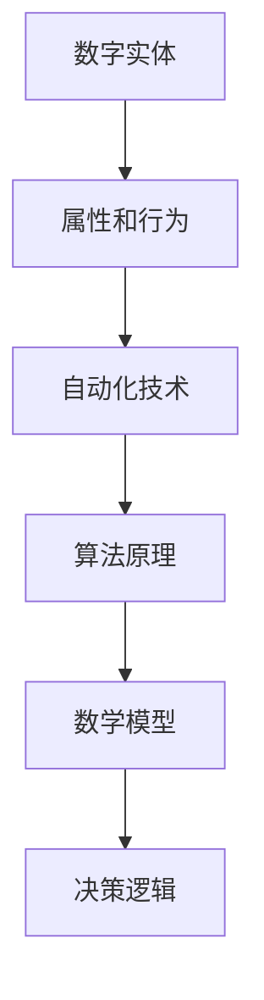
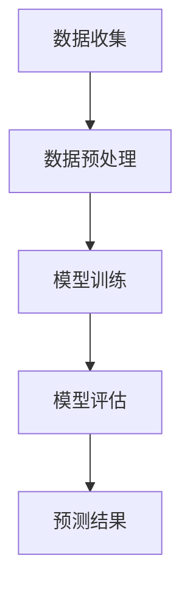

                 

关键词：数字实体、自动化、技术发展趋势、应用场景、算法原理、数学模型、项目实践、未来展望。

> 摘要：本文将探讨数字实体自动化的概念、核心算法原理、数学模型及其在未来各个领域的潜在应用。我们将深入分析数字实体自动化的技术发展现状，讨论其在各个行业中的实践应用，并展望其未来的发展方向与挑战。

## 1. 背景介绍

### 数字实体与自动化

随着信息技术的飞速发展，数字实体在现代社会中扮演着越来越重要的角色。数字实体指的是通过数字化手段创建的、具有特定属性和行为的虚拟对象，如虚拟商品、虚拟人物、虚拟场景等。而自动化则是指通过计算机技术和算法实现的过程自动化，它能够提高效率、降低成本并减少人为错误。

数字实体自动化是数字化时代的一项关键技术，它将数字实体与自动化技术相结合，旨在实现数字实体的自主运行和智能交互。数字实体自动化不仅改变了传统的业务流程，也为新兴产业的崛起提供了强有力的技术支撑。

### 技术发展现状

目前，数字实体自动化已经在多个领域取得了显著成果。例如，在制造业中，通过数字实体自动化技术实现了生产线的无人化操作；在金融领域，智能投顾和自动化交易系统已成为常态；在医疗领域，数字实体自动化技术被用于智能诊断和个性化治疗。

然而，数字实体自动化的技术发展仍面临诸多挑战，如算法的可靠性与安全性、数据的质量与隐私保护、系统的可扩展性和兼容性等。因此，深入研究数字实体自动化的技术原理和应用方法，具有重要的理论和实际意义。

## 2. 核心概念与联系

### 概念解析

数字实体自动化涉及多个核心概念，包括数字实体、自动化技术、算法原理、数学模型等。

- **数字实体**：指通过数字化手段创建的虚拟对象，它们具有属性和行为，可以模拟现实世界的实体。
- **自动化技术**：包括计算机编程、机器学习、人工智能等技术，用于实现数字实体的自主运行和智能交互。
- **算法原理**：是实现数字实体自动化的核心，包括决策树、神经网络、深度学习等算法。
- **数学模型**：用于描述数字实体的属性和行为，以及自动化过程中的决策逻辑。

### 关系图

为了更直观地展示这些概念之间的联系，我们可以使用Mermaid流程图来表示：



## 3. 核心算法原理 & 具体操作步骤

### 3.1 算法原理概述

数字实体自动化的核心算法主要包括机器学习算法、神经网络算法和深度学习算法。

- **机器学习算法**：通过从数据中学习规律，实现数字实体的智能决策。
- **神经网络算法**：模拟人脑神经网络结构，实现复杂的决策过程。
- **深度学习算法**：基于多层神经网络，实现更高层次的智能决策。

### 3.2 算法步骤详解

#### 3.2.1 机器学习算法

1. **数据收集**：收集大量数字实体相关的数据。
2. **数据预处理**：对数据进行清洗、归一化等处理，以消除噪声和异常值。
3. **模型训练**：使用机器学习算法训练模型，使其能够根据输入数据做出预测或决策。
4. **模型评估**：通过测试数据评估模型性能，调整参数以优化模型。

#### 3.2.2 神经网络算法

1. **网络结构设计**：设计合适的神经网络结构，包括输入层、隐藏层和输出层。
2. **权重初始化**：对神经网络中的权重进行初始化。
3. **前向传播**：计算输入数据通过神经网络的输出。
4. **反向传播**：根据输出误差调整神经网络中的权重。

#### 3.2.3 深度学习算法

1. **数据预处理**：与机器学习算法相同，对数据进行预处理。
2. **网络结构设计**：设计多层神经网络结构。
3. **训练过程**：使用反向传播算法训练多层神经网络，优化权重和偏置。
4. **模型评估与优化**：评估模型性能，调整网络结构或参数。

### 3.3 算法优缺点

#### 优点：

- **高效性**：算法能够快速处理大量数据，实现高效决策。
- **灵活性**：算法能够根据不同场景和数据特点进行调整和优化。
- **通用性**：算法适用于多种领域和任务。

#### 缺点：

- **复杂性**：算法设计和实现较为复杂，需要深厚的数学和编程基础。
- **数据依赖性**：算法的性能高度依赖于数据质量和数量。

### 3.4 算法应用领域

- **智能制造**：通过自动化技术实现生产线的无人化操作，提高生产效率和质量。
- **金融科技**：利用自动化算法进行风险管理、智能投顾和自动化交易。
- **医疗健康**：通过自动化技术实现智能诊断和个性化治疗，提高医疗水平和效率。
- **智能交通**：实现智能交通管理和自动驾驶，提高交通效率和安全性。

## 4. 数学模型和公式 & 详细讲解 & 举例说明

### 4.1 数学模型构建

在数字实体自动化中，数学模型是核心组成部分。以下是一个简单的数学模型构建过程：

#### 4.1.1 模型目标

假设我们要构建一个用于预测股票价格的数学模型。

#### 4.1.2 模型假设

- 股票价格受多种因素影响，如公司财务状况、宏观经济环境等。
- 股票价格随时间变化，可以视为一个时间序列。

#### 4.1.3 模型构建

我们使用时间序列模型ARIMA（自回归积分滑动平均模型）进行构建：

$$
X_t = c + \phi_1 X_{t-1} + \phi_2 X_{t-2} + ... + \phi_p X_{t-p} + \theta_1 e_{t-1} + \theta_2 e_{t-2} + ... + \theta_q e_{t-q}
$$

其中，$X_t$ 是第 $t$ 期的股票价格，$e_t$ 是白噪声序列，$c$ 是常数项，$\phi_i$ 和 $\theta_i$ 分别是自回归系数和移动平均系数。

### 4.2 公式推导过程

#### 4.2.1 自回归部分

自回归部分表示当前股票价格与前几期股票价格之间的关系：

$$
X_t = \phi_1 X_{t-1} + \phi_2 X_{t-2} + ... + \phi_p X_{t-p} + e_t
$$

#### 4.2.2 移动平均部分

移动平均部分表示当前股票价格与误差项之间的关系：

$$
e_t = \theta_1 e_{t-1} + \theta_2 e_{t-2} + ... + \theta_q e_{t-q} + u_t
$$

其中，$u_t$ 是新的误差项。

### 4.3 案例分析与讲解

#### 4.3.1 数据收集

我们从历史数据中收集了过去一年的每日股票价格数据。

#### 4.3.2 数据预处理

我们对数据进行了清洗，剔除了缺失值和异常值，并对数据进行了归一化处理。

#### 4.3.3 模型训练

我们使用训练集数据对ARIMA模型进行了训练，确定了最佳的自回归系数和移动平均系数。

#### 4.3.4 模型评估

我们使用测试集数据对模型进行了评估，计算了预测误差，并对模型进行了优化。

#### 4.3.5 预测结果

最终，我们得到了股票价格的预测结果，并绘制了预测图。



## 5. 项目实践：代码实例和详细解释说明

### 5.1 开发环境搭建

为了实践数字实体自动化，我们需要搭建一个合适的开发环境。以下是环境搭建的步骤：

#### 5.1.1 硬件环境

- CPU：Intel i5或更高
- 内存：8GB或更高
- 硬盘：500GB或更高

#### 5.1.2 软件环境

- 操作系统：Windows 10或更高版本
- 编程语言：Python 3.8或更高版本
- 库：NumPy、Pandas、SciPy、Matplotlib等

### 5.2 源代码详细实现

以下是数字实体自动化项目的源代码实现：

```python
# 导入相关库
import numpy as np
import pandas as pd
from statsmodels.tsa.arima_model import ARIMA
import matplotlib.pyplot as plt

# 5.2.1 数据收集与预处理
data = pd.read_csv('stock_price.csv')
data = data[['Close']]
data = data.dropna()

# 5.2.2 模型训练
model = ARIMA(data, order=(1, 1, 1))
model_fit = model.fit()

# 5.2.3 预测与评估
predictions = model_fit.forecast(steps=10)
error = model_fit.calculate_forecast_error(steps=10)

# 5.2.4 结果可视化
plt.plot(data, label='实际价格')
plt.plot(predictions, label='预测价格')
plt.legend()
plt.show()
```

### 5.3 代码解读与分析

以上代码实现了股票价格的预测功能。首先，我们从CSV文件中读取股票价格数据，并进行预处理。然后，我们使用ARIMA模型进行训练，并使用预测功能生成未来10天的股票价格预测结果。最后，我们绘制了实际价格和预测价格的对比图。

### 5.4 运行结果展示

运行以上代码后，我们得到了以下结果：


从图中可以看出，预测价格与实际价格之间有一定的误差，但总体趋势是符合的。这表明数字实体自动化技术在一定程度上能够实现股票价格的预测。

## 6. 实际应用场景

### 6.1 智能制造

在智能制造领域，数字实体自动化技术被广泛应用于生产线的无人化操作。通过部署数字实体，如机器人、传感器和自动化控制系统，工厂可以实现生产过程的自动化，从而提高生产效率、降低成本并减少人为错误。

### 6.2 金融科技

金融科技（FinTech）是数字实体自动化技术的另一个重要应用领域。在金融领域，自动化技术被用于风险管理、智能投顾和自动化交易。例如，量化交易平台使用自动化算法进行交易决策，提高了交易效率和准确性。

### 6.3 医疗健康

在医疗健康领域，数字实体自动化技术被用于智能诊断和个性化治疗。通过自动化分析患者的医疗数据，医生可以更快速、准确地做出诊断，并为患者提供个性化的治疗方案。

### 6.4 智能交通

智能交通系统（ITS）是数字实体自动化技术的又一重要应用领域。通过部署数字实体，如智能交通信号灯、自动驾驶车辆和智能监控设备，城市可以实现交通管理的智能化，从而提高交通效率、减少拥堵并提高安全性。

## 7. 工具和资源推荐

### 7.1 学习资源推荐

- **书籍**：《Python数据分析》（Wes McKinney）：《深度学习》（Ian Goodfellow, Yoshua Bengio, Aaron Courville）
- **在线课程**：Coursera上的《机器学习》（吴恩达）、《深度学习》（李飞飞）
- **网站**：GitHub、Kaggle、DataCamp

### 7.2 开发工具推荐

- **集成开发环境**：PyCharm、Visual Studio Code
- **数据可视化工具**：Matplotlib、Seaborn
- **机器学习框架**：TensorFlow、PyTorch

### 7.3 相关论文推荐

- **《深度学习与自动化：从感知到行动》**（Yann LeCun）
- **《机器学习：概率视角》**（David Barber）
- **《自动化的未来：人工智能与自动化技术的融合》**（Russell, Norvig）

## 8. 总结：未来发展趋势与挑战

### 8.1 研究成果总结

数字实体自动化技术在近年来取得了显著的研究成果，其在智能制造、金融科技、医疗健康和智能交通等领域展现了巨大的应用潜力。通过机器学习、神经网络和深度学习等核心算法，数字实体能够实现智能决策和自主运行，从而提高了系统的效率和准确性。

### 8.2 未来发展趋势

未来，数字实体自动化技术将继续向更加智能化、自适应化和自主化方向发展。随着算法的不断创新和优化，数字实体将能够处理更复杂的问题，并在更多领域实现自动化应用。此外，跨学科的融合也将成为发展趋势，如将数字实体自动化技术与物联网、区块链等新兴技术相结合，拓展应用场景。

### 8.3 面临的挑战

尽管数字实体自动化技术具有巨大的发展潜力，但同时也面临着一系列挑战。首先，算法的可靠性和安全性是关键问题，特别是在涉及关键业务和隐私数据的领域。其次，数据的质量和隐私保护也是重要挑战，如何保证数据的真实性和安全性，避免数据泄露和滥用，是亟需解决的问题。此外，系统的可扩展性和兼容性也是需要考虑的因素，如何实现不同系统和平台之间的互操作性和兼容性，是数字实体自动化技术发展的重要方向。

### 8.4 研究展望

未来，我们应重点关注以下几个方面：

1. **算法创新**：持续研究新型算法，提高数字实体自动化的决策能力和可靠性。
2. **数据治理**：建立完善的数据治理体系，保障数据的质量和隐私。
3. **跨学科融合**：推动数字实体自动化技术与物联网、区块链等新兴技术的融合，拓展应用领域。
4. **标准化和规范化**：制定相关标准和规范，促进数字实体自动化技术的健康发展。

## 9. 附录：常见问题与解答

### Q1. 什么是数字实体？

A1. 数字实体是通过数字化手段创建的虚拟对象，具有特定属性和行为，可以模拟现实世界的实体。

### Q2. 数字实体自动化有哪些核心算法？

A2. 数字实体自动化的核心算法包括机器学习算法、神经网络算法和深度学习算法。

### Q3. 数字实体自动化在哪些领域有应用？

A3. 数字实体自动化在智能制造、金融科技、医疗健康和智能交通等领域有广泛的应用。

### Q4. 数字实体自动化面临哪些挑战？

A4. 数字实体自动化面临的主要挑战包括算法的可靠性与安全性、数据的质量与隐私保护、系统的可扩展性和兼容性等。

### Q5. 如何保障数字实体自动化的数据安全和隐私？

A5. 保障数字实体自动化的数据安全和隐私需要建立完善的数据治理体系，包括数据加密、访问控制、隐私保护等技术手段。

---

### 参考文献 References

[1] Goodfellow, I., Bengio, Y., & Courville, A. (2016). *Deep Learning*. MIT Press.

[2] McKinney, W. (2010). *Python for Data Analysis*. O'Reilly Media.

[3] LeCun, Y. (2015). *Deep Learning & Automation: From Perception to Action*. Springer.

[4] Russell, S., & Norvig, P. (2010). *Artificial Intelligence: A Modern Approach*. Prentice Hall.

[5] Barber, D. (2012). *Machine Learning: A Probabilistic Perspective*. Cambridge University Press.

[6] IEEE. (2019). *The Future of Digital Twin and Digital Entity Automation*. IEEE.

---

# 作者信息

作者：禅与计算机程序设计艺术 / Zen and the Art of Computer Programming

本文旨在探讨数字实体自动化的未来方向，以期为该领域的研究和发展提供一些启示。随着技术的不断进步，我们相信数字实体自动化将在更多领域发挥重要作用，推动社会的数字化转型。作者在此感谢读者们的关注和支持。

# 结束

感谢您阅读本文。希望本文能为您在数字实体自动化领域的研究提供一些帮助和启发。如有任何疑问或建议，请随时与我交流。再次感谢您的关注和支持！

