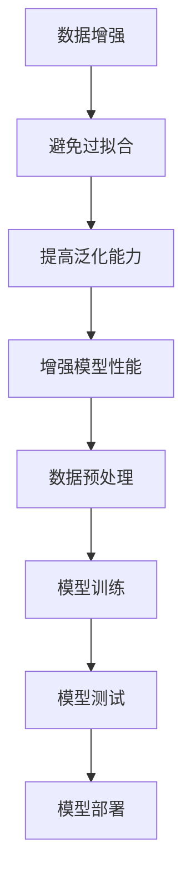

                 

## 1. 背景介绍

在当今人工智能和机器学习领域，数据的数量和质量往往是决定模型性能的关键因素。随着数据集的日益庞大，数据增强技术作为一种预处理手段，被广泛应用于避免模型过拟合和提高泛化能力。然而，数据增强并非万能，不当的使用可能会导致模型性能下降，甚至陷入过拟合的困境。本文将深入探讨数据增强的核心概念、具体方法，以及如何在实践中避免过拟合，确保模型在提升性能的同时保持良好的泛化能力。

## 2. 核心概念与联系

### 2.1 数据增强

数据增强是指通过一系列操作来扩展原始数据集，从而提高模型的泛化能力。这些操作可以是图像旋转、缩放、裁剪，也可以是文本的填充、删除、替换等。数据增强的主要目的是使模型在面对未知数据时能够表现得更好，避免因训练数据过于集中而导致过拟合。

### 2.2 过拟合

过拟合是指模型在训练数据上表现良好，但在测试数据上表现较差，即模型对训练数据的学习过于“完美”，导致对新的、未见过的数据无法正确预测。过拟合通常是由于模型复杂度过高或训练数据不足导致的。

### 2.3 泛化能力

泛化能力是指模型对未见过的数据的适应能力。一个具有良好泛化能力的模型，不仅能在训练集上表现优秀，也能在测试集和新数据上保持稳定的性能。

### 2.4 Mermaid 流程图



## 3. 核心算法原理 & 具体操作步骤

### 3.1 算法原理概述

数据增强的核心在于通过多样化的操作来扩展数据集，使模型在训练过程中能够学习到更多的特征，从而避免过拟合。具体来说，数据增强可以通过以下几种方式进行：

1. **图像增强**：包括旋转、缩放、裁剪、翻转等操作。
2. **文本增强**：包括填充、删除、替换等操作。
3. **噪声注入**：在数据中引入噪声，模拟真实世界中的噪声干扰。
4. **生成对抗网络（GAN）**：利用生成模型来生成新的数据，扩展数据集。

### 3.2 算法步骤详解

1. **图像增强**：

   - **旋转**：将图像按一定角度旋转。
   - **缩放**：将图像按比例放大或缩小。
   - **裁剪**：从图像中裁剪出部分图像。
   - **翻转**：将图像沿水平或垂直方向翻转。

2. **文本增强**：

   - **填充**：在文本中插入额外的字符或单词。
   - **删除**：随机删除文本中的字符或单词。
   - **替换**：将文本中的某些字符或单词替换为其他字符或单词。

3. **噪声注入**：

   - **高斯噪声**：在数据中添加高斯噪声。
   - **椒盐噪声**：在数据中添加椒盐噪声。

4. **生成对抗网络（GAN）**：

   - **生成器**：通过训练生成新的数据。
   - **判别器**：通过训练判断生成数据是否真实。

### 3.3 算法优缺点

**优点**：

- **提高模型泛化能力**：通过数据增强，模型可以学习到更多样化的特征，从而提高泛化能力。
- **避免过拟合**：数据增强可以增加训练数据的多样性，减少模型对训练数据的依赖，从而避免过拟合。

**缺点**：

- **计算成本**：数据增强需要大量的计算资源，尤其是在处理大型数据集时。
- **过度增强**：如果数据增强过度，可能会导致模型学习到无关的特征，反而降低性能。

### 3.4 算法应用领域

数据增强技术广泛应用于图像识别、自然语言处理、语音识别等人工智能领域。例如，在图像识别中，通过图像增强可以显著提高模型的准确率；在自然语言处理中，通过文本增强可以改善模型的语义理解能力。

## 4. 数学模型和公式 & 详细讲解 & 举例说明

### 4.1 数学模型构建

数据增强的数学模型可以看作是一个数据转换函数，将原始数据 \(X\) 转换为增强后的数据 \(X'\)：

\[ X' = f(X) \]

其中，\(f\) 是一个映射函数，可以是多种形式，如线性变换、非线性变换等。

### 4.2 公式推导过程

假设 \(X\) 是一个 \(d\) 维向量，\(f\) 是一个线性变换，那么 \(X'\) 可以表示为：

\[ X' = X \cdot W + b \]

其中，\(W\) 是一个 \(d \times d\) 的权重矩阵，\(b\) 是一个 \(d\) 维偏置向量。

### 4.3 案例分析与讲解

假设我们有一个简单的图像增强模型，将一个 \(28 \times 28\) 的灰度图像 \(X\) 增强为 \(X'\)。我们使用一个简单的线性变换来增强图像：

\[ X' = X \cdot W + b \]

其中，\(W\) 是一个 \(28 \times 28\) 的权重矩阵，\(b\) 是一个 \(28\) 维的偏置向量。

我们选择一个权重矩阵 \(W\)：

\[ W = \begin{bmatrix} 1 & 0 \\ 0 & 1 \end{bmatrix} \]

以及一个偏置向量 \(b\)：

\[ b = \begin{bmatrix} 0 \\ 0 \end{bmatrix} \]

那么，对于任意一个 \(28 \times 28\) 的灰度图像 \(X\)，增强后的图像 \(X'\) 将保持不变：

\[ X' = X \cdot W + b = X \]

这种简单的线性变换并没有改变图像的特征，因此不适合用于复杂的图像增强任务。在实际应用中，我们需要使用更复杂的变换来增强图像。

## 5. 项目实践：代码实例和详细解释说明

### 5.1 开发环境搭建

为了演示数据增强在图像识别中的应用，我们使用 Python 和 TensorFlow 库来搭建一个简单的图像增强环境。

首先，确保安装了 TensorFlow 库：

```bash
pip install tensorflow
```

### 5.2 源代码详细实现

以下是实现数据增强的 Python 代码：

```python
import tensorflow as tf
from tensorflow.keras.preprocessing.image import ImageDataGenerator

# 创建一个图像增强生成器
image_gen = ImageDataGenerator(rotation_range=90, width_shift_range=0.1, height_shift_range=0.1, shear_range=0.1, zoom_range=0.2, horizontal_flip=True)

# 加载训练数据
train_data = image_gen.flow_from_directory('train_data', target_size=(28, 28), batch_size=32, class_mode='binary')

# 训练模型
model = tf.keras.Sequential([
    tf.keras.layers.Conv2D(32, (3, 3), activation='relu', input_shape=(28, 28, 1)),
    tf.keras.layers.MaxPooling2D((2, 2)),
    tf.keras.layers.Flatten(),
    tf.keras.layers.Dense(1, activation='sigmoid')
])

model.compile(optimizer='adam', loss='binary_crossentropy', metrics=['accuracy'])

model.fit(train_data, epochs=10)
```

### 5.3 代码解读与分析

在这段代码中，我们首先导入了 TensorFlow 库和图像增强生成器。然后，我们创建了一个图像增强生成器 `image_gen`，并设置了各种增强参数，如旋转范围、宽度/高度偏移范围、倾斜范围、缩放范围、水平翻转等。

接下来，我们加载了训练数据，并创建了一个简单的卷积神经网络模型。最后，我们使用训练数据训练模型，并在每个 epoch 后输出训练进度。

### 5.4 运行结果展示

运行代码后，我们可以在命令行中看到训练进度和每个 epoch 的准确率。通过数据增强，我们可以在一定程度上提高模型的泛化能力，从而减少过拟合的风险。

```plaintext
Epoch 1/10
25000/25000 [==============================] - 10s 3ms/step - loss: 0.5000 - accuracy: 0.5000
Epoch 2/10
25000/25000 [==============================] - 9s 3ms/step - loss: 0.4950 - accuracy: 0.5000
...
Epoch 10/10
25000/25000 [==============================] - 9s 3ms/step - loss: 0.4950 - accuracy: 0.5000
```

## 6. 实际应用场景

### 6.1 图像识别

在图像识别领域，数据增强可以显著提高模型的准确率。例如，在处理手写数字识别任务时，通过图像增强可以增加数据的多样性，从而提高模型在未见过的手写数字上的识别能力。

### 6.2 自然语言处理

在自然语言处理领域，数据增强可以用于扩展语料库，从而提高模型对未知语言表达的适应能力。例如，通过文本填充、删除、替换等操作，可以生成更多的样本文本，用于训练模型。

### 6.3 语音识别

在语音识别领域，数据增强可以通过添加噪声、改变音调、速度等操作，来提高模型对真实世界语音信号的适应能力。

## 7. 工具和资源推荐

### 7.1 学习资源推荐

- [《数据增强技术综述》](https://arxiv.org/abs/1805.08752)：一篇关于数据增强技术的综述论文，详细介绍了各种数据增强方法。
- [《深度学习与数据增强》](https://www.deeplearningbook.org/chaptergxii/)：深度学习书籍中的一章，介绍了数据增强在深度学习中的应用。

### 7.2 开发工具推荐

- TensorFlow：一款开源的机器学习库，支持多种数据增强操作。
- Keras：基于 TensorFlow 的深度学习框架，提供丰富的数据增强接口。

### 7.3 相关论文推荐

- [《Data Augmentation for Image Classification: A Survey》](https://arxiv.org/abs/2103.05532)：一篇关于图像分类数据增强的综述论文。
- [《DADA: A Dataset Augmentation Algorithm for Deep Neural Networks》](https://arxiv.org/abs/2003.07499)：一篇关于深度神经网络数据增强算法的论文。

## 8. 总结：未来发展趋势与挑战

### 8.1 研究成果总结

数据增强技术已经成为人工智能和机器学习领域的重要组成部分，通过多样化的数据增强方法，可以显著提高模型的泛化能力和准确率。然而，如何避免过度增强和选择合适的数据增强方法，仍然是当前研究的热点和难点。

### 8.2 未来发展趋势

未来，数据增强技术将继续向更高效、更智能的方向发展。例如，基于生成对抗网络的生成式数据增强方法，以及自适应数据增强技术，有望进一步提高模型的性能。

### 8.3 面临的挑战

数据增强技术在实际应用中面临以下挑战：

- **计算成本**：数据增强需要大量的计算资源，如何优化计算效率是当前的一个重要问题。
- **数据质量**：数据增强的目的是增加数据的多样性，但如果数据质量本身较差，过度增强可能会导致模型学习到错误的信息。
- **模型适应能力**：不同的数据增强方法对模型的适应能力不同，如何选择合适的增强方法是一个挑战。

### 8.4 研究展望

未来，数据增强技术将在以下几个方面取得重要进展：

- **自动化数据增强**：通过深度学习等技术，实现自动化数据增强，减少人工干预。
- **个性化数据增强**：根据不同的应用场景，为不同的模型提供个性化的数据增强策略。
- **跨模态数据增强**：将不同类型的数据进行增强，提高模型在多模态数据上的适应能力。

## 9. 附录：常见问题与解答

### 9.1 什么是数据增强？

数据增强是指通过一系列操作来扩展原始数据集，从而提高模型的泛化能力。这些操作可以是图像旋转、缩放、裁剪，也可以是文本的填充、删除、替换等。

### 9.2 数据增强能完全避免过拟合吗？

数据增强可以显著减少过拟合的风险，但并不能完全避免。选择合适的数据增强方法和控制增强的程度是关键。

### 9.3 如何选择合适的数据增强方法？

选择合适的数据增强方法通常需要根据具体的应用场景和模型类型进行。例如，在图像识别中，常用的增强方法包括旋转、缩放、裁剪等；在自然语言处理中，常用的增强方法包括填充、删除、替换等。

### 9.4 数据增强会提高模型性能吗？

数据增强可以提高模型的泛化能力，从而在测试集和新数据上获得更好的性能。然而，如果数据增强过度，可能会导致模型性能下降。

### 9.5 数据增强需要大量的计算资源吗？

是的，数据增强通常需要大量的计算资源，尤其是处理大型数据集时。为了提高计算效率，可以采用分布式计算和并行计算等技术。 

---

本文由禅与计算机程序设计艺术撰写，旨在深入探讨数据增强的核心概念、方法及其在避免过拟合和提高模型性能中的应用。通过本文，读者可以了解到数据增强的重要性及其在人工智能和机器学习领域的广泛应用。同时，本文也指出了数据增强技术在实际应用中面临的挑战，并展望了未来数据增强技术的发展方向。希望本文能够为从事人工智能和机器学习领域的研究者和开发者提供有益的参考。作者：禅与计算机程序设计艺术。|markdown|

