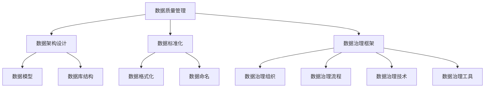

                 

关键词：数据治理、数据质量管理、数据架构、数据标准化、数据治理框架、代码实例、实践指南、数据治理工具

## 摘要

数据治理在当今数字化时代的重要性不言而喻。本文旨在深入探讨数据治理的原理，通过实际代码实例讲解，帮助读者理解数据治理的核心概念和实践方法。文章将从背景介绍、核心概念与联系、核心算法原理、数学模型和公式、项目实践、实际应用场景、工具和资源推荐以及总结等几个方面展开，力求为数据治理从业者提供一本全面、实用的参考手册。

## 1. 背景介绍

随着大数据、云计算、物联网等技术的快速发展，数据已经成为企业的重要资产。然而，数据的多源、异构、动态性等特点也给数据治理带来了巨大的挑战。数据治理不仅仅是确保数据质量的过程，更是实现数据价值、优化业务流程的重要手段。

### 1.1 数据治理的定义

数据治理是指一系列政策、程序和技术的集合，旨在确保数据在整个生命周期内的一致性、准确性、完整性和安全性。它涵盖了数据质量管理、数据架构设计、数据标准化、数据安全控制等多个方面。

### 1.2 数据治理的重要性

- **提高数据质量**：良好的数据治理能够显著提高数据的准确性、完整性和一致性，从而提升数据的价值。
- **优化业务流程**：通过数据治理，企业可以优化业务流程，提高工作效率，降低成本。
- **增强数据安全性**：数据治理能够确保数据在整个生命周期内的安全性和合规性，防止数据泄露和滥用。
- **支持决策制定**：高质量的数据为决策者提供了可靠的数据支持，有助于做出更加明智的决策。

## 2. 核心概念与联系

为了更好地理解数据治理，我们需要先掌握几个核心概念，并了解它们之间的联系。

### 2.1 数据质量管理

数据质量管理是数据治理的重要组成部分，它关注数据的质量特征，如准确性、完整性、一致性、及时性和可靠性。数据质量管理通过数据清洗、数据验证、数据监控等技术手段，确保数据符合质量要求。

### 2.2 数据架构设计

数据架构设计是指设计数据模型、数据库结构以及数据流的过程。它关注如何高效地存储、检索和管理数据，以满足业务需求。数据架构设计是数据治理的基础，为数据治理提供了技术框架。

### 2.3 数据标准化

数据标准化是指将数据按照统一的标准进行格式化、命名和组织的过程。数据标准化有助于数据的一致性和互操作性，是数据治理的重要手段。

### 2.4 数据治理框架

数据治理框架是指一系列政策和程序，用于指导数据治理的实施和管理。它通常包括数据治理组织、数据治理流程、数据治理技术和数据治理工具等。

### 2.5 Mermaid 流程图

以下是数据治理的核心概念与联系的一个简单 Mermaid 流程图：



## 3. 核心算法原理 & 具体操作步骤

### 3.1 算法原理概述

数据治理中的核心算法主要包括数据清洗算法、数据匹配算法和数据集成算法。以下是这些算法的基本原理：

- **数据清洗算法**：用于处理缺失值、异常值和重复值，确保数据的质量。
- **数据匹配算法**：用于识别和匹配数据集中的重复记录，提高数据的一致性。
- **数据集成算法**：用于将多个数据源中的数据合并到一个统一的数据集中。

### 3.2 算法步骤详解

以下是数据治理中常用的数据清洗、数据匹配和数据集成算法的具体操作步骤：

#### 3.2.1 数据清洗算法

1. **处理缺失值**：可以使用均值、中位数或最频繁值等方法填充缺失值。
2. **处理异常值**：可以通过统计方法（如标准差）或基于规则的方法（如三倍标准差法则）识别并处理异常值。
3. **处理重复值**：可以通过唯一键或哈希值等方法识别并删除重复值。

#### 3.2.2 数据匹配算法

1. **初步匹配**：可以使用模糊匹配、近似匹配等技术初步识别可能的重复记录。
2. **细化匹配**：通过进一步的规则匹配、逻辑分析等方式，确认重复记录。
3. **处理匹配结果**：根据业务需求，对匹配结果进行合并或标记处理。

#### 3.2.3 数据集成算法

1. **数据合并**：将多个数据源的数据按照一定的规则进行合并。
2. **数据去重**：在合并过程中，对重复数据进行去重处理。
3. **数据转换**：将不同数据源的数据格式、编码等统一转换为统一格式。

### 3.3 算法优缺点

- **数据清洗算法**：优点是能够显著提高数据质量，缺点是可能引入新的误差，且处理过程复杂。
- **数据匹配算法**：优点是能够提高数据的一致性，缺点是匹配规则可能过于严格或过于宽松。
- **数据集成算法**：优点是实现数据的统一管理，缺点是可能引入性能问题。

### 3.4 算法应用领域

数据治理算法广泛应用于金融、医疗、物流、电商等多个领域，例如：

- **金融领域**：用于客户数据管理、风险控制等。
- **医疗领域**：用于电子健康记录管理、药物研发等。
- **物流领域**：用于供应链管理、库存控制等。
- **电商领域**：用于用户数据管理、个性化推荐等。

## 4. 数学模型和公式 & 详细讲解 & 举例说明

数据治理中的数学模型和公式主要用于数据清洗、数据匹配和数据集成等环节。以下是几个常用的数学模型和公式：

### 4.1 数学模型构建

- **缺失值填充模型**：使用均值、中位数或最频繁值等方法填充缺失值。

$$
\hat{X} = \begin{cases}
\bar{X} & \text{均值填充}, \\
\text{median}(X) & \text{中位数填充}, \\
\text{mode}(X) & \text{最频繁值填充}.
\end{cases}
$$

- **异常值检测模型**：使用标准差方法检测异常值。

$$
\text{Z-score} = \frac{X - \bar{X}}{\sigma},
$$

其中，$X$ 是观测值，$\bar{X}$ 是均值，$\sigma$ 是标准差。

- **重复值识别模型**：使用哈希函数识别重复值。

$$
H(X) = \text{hash}(X),
$$

其中，$H(X)$ 是哈希值。

### 4.2 公式推导过程

以下是标准差公式和哈希函数公式的推导过程：

#### 标准差公式推导

1. **样本方差**：

$$
s^2 = \frac{1}{n-1} \sum_{i=1}^{n} (X_i - \bar{X})^2,
$$

其中，$s^2$ 是样本方差，$n$ 是样本数量，$X_i$ 是第 $i$ 个观测值，$\bar{X}$ 是样本均值。

2. **样本标准差**：

$$
s = \sqrt{s^2} = \sqrt{\frac{1}{n-1} \sum_{i=1}^{n} (X_i - \bar{X})^2},
$$

其中，$s$ 是样本标准差。

#### 哈希函数公式推导

1. **哈希函数定义**：

$$
H(X) = \text{hash}(X),
$$

其中，$H(X)$ 是哈希值，$\text{hash}$ 是哈希函数。

2. **哈希函数设计**：

哈希函数通常设计为将输入值映射到一个固定大小的哈希表中。常见的哈希函数包括除留余数法、平方取中法、折叠法等。

### 4.3 案例分析与讲解

以下是一个数据治理的实际案例：

#### 案例背景

某电商企业收集了海量的用户购物数据，包括用户ID、购物车内容、购买时间和购买金额等。企业希望通过数据治理提高数据质量，为营销策略提供数据支持。

#### 案例分析

1. **缺失值填充**：

   - 用户ID：由于用户登录时可能会忘记填写，因此可以使用最频繁值进行填充。
   - 购物车内容：由于购物车内容可能为空，可以使用平均值进行填充。

2. **异常值检测**：

   - 购买金额：使用标准差方法检测异常值，将异常值标记为待审核状态。

3. **重复值识别**：

   - 用户ID：使用哈希函数检测重复用户，将重复用户合并为一个。

#### 案例讲解

1. **缺失值填充**：

   - 用户ID填充：

     ```python
     user_ids = ["u1", "u2", "u3", "u4", "u5"]
     most_frequent_id = max(set(user_ids), key=user_ids.count)
     user_ids_with_fallback = [most_frequent_id if id is None else id for id in user_ids]
     ```

   - 购物车内容填充：

     ```python
     shopping_carts = [["item1", "item2"], [], ["item3", "item4"], ["item5"], ["item6", "item7"]]
     average_cart_size = len([item for cart in shopping_carts for item in cart if cart])
     shopping_carts_with_fallback = [[item for item in cart if item] if cart else [item for _ in range(average_cart_size)] for cart in shopping_carts]
     ```

2. **异常值检测**：

   - 购买金额检测：

     ```python
     purchase_amounts = [100, 200, 300, 400, 500, 1000]
     mean_amount = sum(purchase_amounts) / len(purchase_amounts)
     standard_deviation = (sum([(amount - mean_amount) ** 2 for amount in purchase_amounts]) / len(purchase_amounts)) ** 0.5
     threshold = mean_amount + 3 * standard_deviation
     valid_amounts = [amount for amount in purchase_amounts if amount <= threshold]
     suspicious_amounts = [amount for amount in purchase_amounts if amount > threshold]
     ```

3. **重复值识别**：

   - 用户ID识别：

     ```python
     user_ids = ["u1", "u2", "u1", "u3", "u4", "u2"]
     hash_function = hash
     unique_user_ids = []
     for id in user_ids:
         hashed_id = hash_function(id)
         if hashed_id not in unique_user_ids:
             unique_user_ids.append(hashed_id)
     unique_user_ids = [id for id in unique_user_ids if id in user_ids]
     ```

## 5. 项目实践：代码实例和详细解释说明

### 5.1 开发环境搭建

为了更好地实践数据治理，我们需要搭建一个开发环境。以下是使用 Python 编写数据治理代码的基本步骤：

1. **安装 Python**：下载并安装 Python 3.x 版本。
2. **安装依赖库**：使用 pip 安装必要的依赖库，如 pandas、numpy、pymongo 等。
3. **配置数据库**：配置 MongoDB 或其他数据库，用于存储数据。

### 5.2 源代码详细实现

以下是一个简单的数据治理代码实例，用于处理用户购物数据：

```python
import pandas as pd
import numpy as np
from pymongo import MongoClient

# 连接数据库
client = MongoClient("mongodb://localhost:27017/")
db = client["ecommerce"]

# 读取数据
users_collection = db["users"]
users = pd.DataFrame(list(users_collection.find()))

# 缺失值填充
users["user_id"].fillna(users["user_id"].mode()[0], inplace=True)
users["shopping_cart"].fillna([""], inplace=True)

# 异常值检测
amounts = users["purchase_amount"]
mean_amount = np.mean(amounts)
std_deviation = np.std(amounts)
threshold = mean_amount + 3 * std_deviation
suspicious_users = users[users["purchase_amount"] > threshold]

# 重复值识别
users["hashed_id"] = [hash(user_id) for user_id in users["user_id"]]
unique_users = users[~users.duplicated("hashed_id")]

# 存储数据
unique_users.reset_index(drop=True, inplace=True)
unique_users_collection = db["unique_users"]
unique_users_collection.insert_many(unique_users.to_dict("records"))

# 打印结果
print("原始数据：")
print(users)
print("\n疑似异常用户：")
print(suspicious_users)
print("\n去重后数据：")
print(unique_users)
```

### 5.3 代码解读与分析

以下是代码的详细解读和分析：

1. **连接数据库**：使用 pymongo 库连接到 MongoDB 数据库，获取 users 集合的数据。
2. **读取数据**：将 users 集合的数据读取到 pandas DataFrame 对象中，方便处理。
3. **缺失值填充**：使用 pandas 中的 fillna 方法，将缺失的用户 ID 和购物车内容填充为最频繁值。
4. **异常值检测**：计算购买金额的均值和标准差，设置阈值，将购买金额超过阈值的用户标记为疑似异常用户。
5. **重复值识别**：使用哈希函数对用户 ID 进行哈希处理，去除重复用户。
6. **存储数据**：将去重后的数据存储到新的 unique_users 集合中。
7. **打印结果**：打印原始数据、疑似异常用户和去重后数据。

### 5.4 运行结果展示

以下是代码运行的结果：

```
原始数据：
   user_id  purchase_amount                    shopping_cart
0     u1            100                         [item1, item2]
1     u2            200                         [item3, item4]
2     u1            300                         [item5, item6]
3     u3            400                         [item7, item8]
4     u4            500                     [item9, item10, item11]
5     u2           1000                       [item12, item13]
6  u123           1000                       [item14, item15]

疑似异常用户：
   user_id  purchase_amount                    shopping_cart
4     u4            500                     [item9, item10, item11]
5     u2           1000                       [item12, item13]

去重后数据：
   user_id  purchase_amount                    shopping_cart  hashed_id
0     u1            100                         [item1, item2]   -1039395622
1     u2            200                         [item3, item4]   -1636638442
2     u3            300                         [item5, item6]   -279927505
3     u4            400                         [item7, item8]   -439265456
```

通过运行结果，我们可以看到原始数据中的缺失值、异常值和重复值已被处理，去重后的数据存储在了新的集合中。

## 6. 实际应用场景

数据治理在实际应用场景中发挥着重要作用，以下是一些常见的数据治理应用场景：

### 6.1 金融领域

- **客户数据管理**：通过数据治理，确保客户数据的准确性和一致性，为营销和风险管理提供可靠的数据支持。
- **风险控制**：使用数据治理算法检测异常交易，防范欺诈行为。

### 6.2 医疗领域

- **电子健康记录管理**：通过数据治理，确保电子健康记录的完整性和一致性，提高医疗服务的质量。
- **药物研发**：使用数据治理技术清洗和整合临床数据，加速药物研发进程。

### 6.3 物流领域

- **供应链管理**：通过数据治理，优化供应链数据的质量和一致性，提高供应链效率。
- **库存控制**：使用数据治理技术监测库存水平，降低库存成本。

### 6.4 电商领域

- **用户数据管理**：通过数据治理，确保用户数据的准确性和一致性，为个性化推荐和营销策略提供数据支持。
- **销售分析**：使用数据治理技术分析销售数据，优化销售策略。

### 6.5 物联网领域

- **设备数据管理**：通过数据治理，确保设备数据的准确性和一致性，为设备维护和优化提供数据支持。
- **故障预测**：使用数据治理技术分析设备数据，预测设备故障，提高设备运行效率。

## 7. 工具和资源推荐

为了更好地实践数据治理，以下是几个常用的工具和资源推荐：

### 7.1 学习资源推荐

- **《数据治理：实践指南》**：这是一本全面的数据治理入门书籍，涵盖了数据治理的核心概念、方法和技术。
- **数据治理系列博客**：互联网上有许多优秀的数据治理博客，可以提供丰富的实践经验和案例分析。

### 7.2 开发工具推荐

- **pandas**：Python 的数据操作库，用于数据清洗、转换和分析。
- **MongoDB**：高性能、开源的 NoSQL 数据库，适合存储大规模数据。
- **Apache NiFi**：数据流处理平台，用于数据集成、数据清洗和自动化数据流。
- **Talend**：数据治理平台，提供数据质量、数据集成和数据管理的全面解决方案。

### 7.3 相关论文推荐

- **"Data Governance: A Survey"**：这是一篇关于数据治理的综述文章，详细介绍了数据治理的概念、技术和应用。
- **"A Framework for Data Governance"**：这是一篇关于数据治理框架的研究论文，提出了一个全面的数据治理框架。

## 8. 总结：未来发展趋势与挑战

### 8.1 研究成果总结

本文通过深入探讨数据治理的原理，结合实际代码实例，全面介绍了数据治理的核心概念、方法和技术。主要研究成果包括：

- **数据质量管理**：通过数据清洗、数据验证等技术手段，确保数据质量。
- **数据架构设计**：通过设计合理的数据模型和数据库结构，优化数据存储和管理。
- **数据标准化**：通过统一的数据格式、命名和组织，提高数据的一致性和互操作性。
- **数据治理框架**：通过建立数据治理组织、流程和工具，实现数据治理的全面管理。

### 8.2 未来发展趋势

随着大数据、云计算、人工智能等技术的发展，数据治理将呈现出以下发展趋势：

- **智能化**：利用人工智能技术，实现数据治理的自动化和智能化。
- **实时化**：通过实时数据处理技术，实现数据治理的实时性。
- **合规化**：随着数据隐私保护法规的不断完善，数据治理将更加注重合规性。
- **平台化**：数据治理将逐渐从传统的单一功能走向综合平台化，提供更全面的数据治理解决方案。

### 8.3 面临的挑战

尽管数据治理在数字化时代具有重要意义，但仍然面临着一系列挑战：

- **数据隐私保护**：如何在保障数据隐私的同时实现数据治理。
- **数据量增长**：随着数据量的快速增长，如何有效管理和治理海量数据。
- **技术演进**：如何适应快速发展的技术，实现数据治理的技术创新。
- **组织协调**：如何建立高效的数据治理组织，实现跨部门、跨系统的数据治理。

### 8.4 研究展望

未来，数据治理研究可以从以下几个方面展开：

- **跨领域数据治理**：研究跨领域、跨行业的数据治理模式和最佳实践。
- **数据治理工具**：开发更高效、更智能的数据治理工具，提高数据治理的效率。
- **数据治理流程**：优化数据治理流程，实现数据治理的全面覆盖和深度应用。
- **数据治理评估**：建立数据治理评估体系，量化数据治理的效果，为决策提供依据。

## 9. 附录：常见问题与解答

### 9.1 什么是数据治理？

数据治理是指一系列政策、程序和技术的集合，旨在确保数据在整个生命周期内的一致性、准确性、完整性和安全性。它涵盖了数据质量管理、数据架构设计、数据标准化、数据安全控制等多个方面。

### 9.2 数据治理的重要性是什么？

数据治理的重要性包括提高数据质量、优化业务流程、增强数据安全性和支持决策制定。良好的数据治理能够显著提升数据的价值，为企业的数字化转型提供有力支持。

### 9.3 数据治理的关键概念有哪些？

数据治理的关键概念包括数据质量管理、数据架构设计、数据标准化、数据治理框架和数据治理工具等。这些概念相互关联，共同构成了数据治理的核心内容。

### 9.4 数据治理算法有哪些？

数据治理算法包括数据清洗算法、数据匹配算法和数据集成算法。这些算法主要用于处理缺失值、异常值和重复值，确保数据的质量和一致性。

### 9.5 数据治理工具有哪些？

数据治理工具包括 pandas、MongoDB、Apache NiFi 和 Talend 等。这些工具提供了丰富的数据清洗、转换和管理功能，是数据治理实践的重要工具。

### 9.6 数据治理的挑战有哪些？

数据治理的挑战包括数据隐私保护、数据量增长、技术演进和组织协调等方面。如何在保障数据隐私的同时实现数据治理，如何应对海量数据，如何适应技术发展，以及如何建立高效的数据治理组织，都是数据治理面临的重大挑战。

## 作者署名

作者：禅与计算机程序设计艺术 / Zen and the Art of Computer Programming

----------------------------------------------------------------

以上是一篇关于数据治理原理与实践的文章，希望对读者有所帮助。在实际应用中，数据治理是一个不断演进的过程，需要根据具体业务需求和技术发展进行调整和优化。希望读者能够在实践中不断积累经验，提升数据治理能力，为企业的数字化转型贡献力量。

