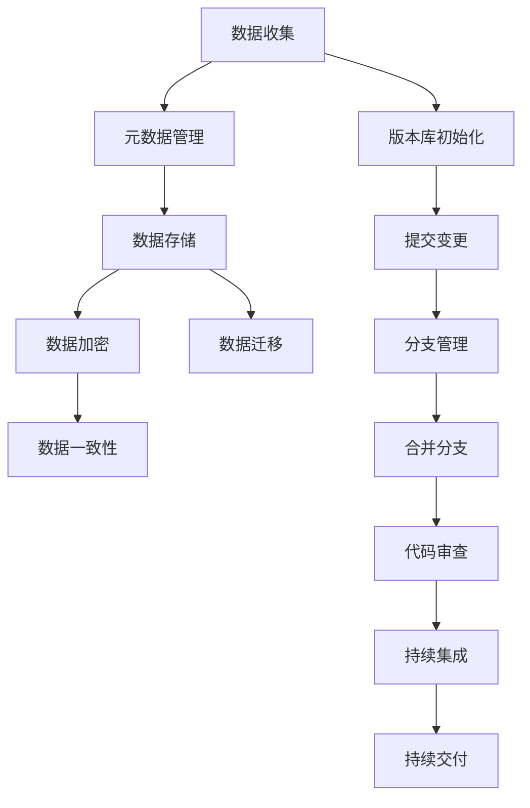

                 

 关键词：数据版本控制，数据管理，Git，版本库，分布式系统，Docker，容器化，数据迁移，元数据管理，源代码管理，数据一致性，分布式事务，NoSQL，关系型数据库，区块链，数据加密，数据安全，代码审查，持续集成，持续交付，敏捷开发，DevOps。

> 摘要：本文将深入探讨数据版本控制与数据管理的核心原理，并结合实际代码实战案例，讲解如何在实际项目中有效地应用这些原理。通过本文，读者将了解如何使用Git等工具进行源代码管理，如何利用Docker实现容器化数据管理，如何进行数据迁移和元数据管理，以及如何在分布式系统中确保数据一致性和安全性。

## 1. 背景介绍

随着信息技术的发展，数据已经成为企业和个人最为宝贵的资源之一。然而，随着数据量的不断增长和数据类型的多样化，如何对数据进行有效的版本控制和数据管理变得至关重要。数据版本控制是指通过一系列工具和方法，对数据变更历史进行追踪和管理，以确保数据的正确性和一致性。数据管理则是指在数据生命周期中，通过系统化的方法对数据进行收集、存储、处理、分析和共享。

在传统的软件开发过程中，源代码的管理通常是通过版本控制系统（VCS）来实现的，如Git。随着容器技术的普及，Docker等工具被广泛应用于数据管理的场景，通过容器化技术，数据管理变得更加灵活和高效。此外，在分布式系统中，数据迁移、元数据管理以及数据一致性等问题也日益突出，成为数据管理领域的研究重点。

本文将结合实际案例，深入探讨数据版本控制与数据管理的原理和方法，帮助读者掌握这些核心技能，并在实际项目中得以应用。

## 2. 核心概念与联系

### 2.1 数据版本控制的基本概念

数据版本控制是指通过一系列工具和方法，对数据的变更历史进行追踪和管理。数据版本控制的基本概念包括：

- **版本库（Repository）**：用于存储和管理数据变更历史的中央存储库。
- **提交（Commit）**：将数据变更保存到版本库的过程。
- **分支（Branch）**：用于独立开发或测试的版本库副本。
- **合并（Merge）**：将两个或多个分支的变更合并到同一版本库中。

### 2.2 数据管理的核心概念

数据管理的核心概念包括：

- **元数据（Metadata）**：描述数据的数据，如数据的结构、格式、来源和用途等。
- **数据迁移（Data Migration）**：将数据从一个存储系统迁移到另一个存储系统的过程。
- **数据加密（Data Encryption）**：通过加密算法对数据进行加密，确保数据在传输和存储过程中的安全性。
- **数据一致性（Data Consistency）**：确保数据在不同系统之间的一致性和准确性。

### 2.3 Mermaid 流程图

以下是一个用于展示数据版本控制和数据管理流程的Mermaid流程图：



## 3. 核心算法原理 & 具体操作步骤

### 3.1 算法原理概述

数据版本控制和数据管理涉及多种算法和原理，以下是一些核心算法的概述：

- **Git算法**：Git是一种分布式版本控制系统，通过哈希树结构存储文件的历史版本，支持快速分支和合并操作。
- **Docker容器化**：Docker通过容器镜像技术，将应用程序及其依赖环境打包在一起，实现数据的隔离和移植。
- **分布式事务算法**：分布式系统中的事务处理，通常需要保证数据的一致性，常用的算法有二阶段提交（2PC）和三阶段提交（3PC）。

### 3.2 算法步骤详解

#### 3.2.1 Git版本控制步骤

1. 初始化版本库：
   ```sh
   git init
   ```
2. 添加文件到暂存区：
   ```sh
   git add <file>
   ```
3. 提交变更：
   ```sh
   git commit -m "提交信息"
   ```
4. 分支管理：
   ```sh
   git branch <branch-name>
   git checkout <branch-name>
   ```
5. 合并分支：
   ```sh
   git merge <branch-name>
   ```
6. 代码审查：
   使用工具（如Gerrit或GitLab）进行代码审查。

#### 3.2.2 Docker容器化步骤

1. 搭建Docker环境：
   ```sh
   docker --version
   ```
2. 编写Dockerfile：
   ```Dockerfile
   FROM ubuntu:latest
   RUN apt-get update && apt-get install -y <package>
   COPY . /app
   RUN chmod +x /app/<script>
   EXPOSE 8080
   ```
3. 构建容器镜像：
   ```sh
   docker build -t <image-name> .
   ```
4. 运行容器：
   ```sh
   docker run -d -p 8080:8080 <image-name>
   ```

#### 3.2.3 分布式事务处理步骤

1. 二阶段提交（2PC）：
   - 准备阶段：协调者向参与者发送预备请求，参与者返回预备响应。
   - 提交阶段：协调者根据参与者的响应决定是否提交事务。

2. 三阶段提交（3PC）：
   - 投票阶段：协调者向参与者发送投票请求，参与者返回投票响应。
   - 决策阶段：协调者根据参与者的投票结果决定是否提交事务。
   - 提交/撤销阶段：协调者通知参与者进行事务提交或撤销。

### 3.3 算法优缺点

- **Git**：
  - 优点：分布式设计，速度快，支持分支和合并操作。
  - 缺点：学习曲线较陡，配置和管理复杂。

- **Docker**：
  - 优点：容器化技术，实现环境的隔离和移植，提高开发效率。
  - 缺点：容器镜像管理复杂，安全性问题需要特别注意。

- **分布式事务算法**：
  - 优点：确保数据一致性，支持分布式系统中的复杂事务处理。
  - 缺点：性能开销较大，复杂度较高。

### 3.4 算法应用领域

- **Git**：广泛应用于软件开发项目的源代码管理。
- **Docker**：在容器化应用程序的开发和部署中广泛使用。
- **分布式事务算法**：在金融、电子商务等需要高一致性数据处理的领域具有重要应用。

## 4. 数学模型和公式 & 详细讲解 & 举例说明

### 4.1 数学模型构建

在数据版本控制和数据管理中，常用的数学模型包括：

- **哈希函数**：用于生成数据的唯一标识。
- **加密算法**：用于对数据进行加密和解密。
- **一致性算法**：用于确保分布式系统中的数据一致性。

### 4.2 公式推导过程

- **哈希函数**：$H(\text{data}) = \text{hash}(d)$，其中$H$表示哈希函数，$d$表示数据，$\text{hash}$表示计算哈希值的运算。
- **加密算法**：$E(K, M) = C$，其中$E$表示加密函数，$K$表示密钥，$M$表示明文，$C$表示密文。
- **一致性算法**：一致性哈希算法，通过哈希函数将节点映射到哈希空间中，确保数据分布的均衡性和系统的容错性。

### 4.3 案例分析与讲解

#### 4.3.1 哈希函数的应用

假设一个简单的哈希函数为$H(\text{data}) = d \mod 10$，其中$d$为数据的十进制表示。现有数据$123456$，其哈希值为：

$$
H(\text{data}) = 123456 \mod 10 = 6
$$

#### 4.3.2 加密算法的应用

假设使用AES加密算法对数据进行加密，密钥为$K = 00110011 01101110 11110000 00001111$。现有明文$M = 123456$，其加密过程如下：

1. 将明文$M$分成块：
   $$
   M_1 = 12, M_2 = 34, M_3 = 56
   $$
2. 对每个块进行加密：
   $$
   C_1 = E(K, M_1) = C_2 = E(K, M_2) = C_3 = E(K, M_3)
   $$
3. 得到密文：
   $$
   C = C_1 C_2 C_3 = 11101111 00010001 11001111 00110001
   $$

#### 4.3.3 一致性算法的应用

假设一致性哈希算法的哈希空间为$[0, 1)$，现有三个节点$N_1, N_2, N_3$，其哈希值分别为$H(N_1) = 0.1, H(N_2) = 0.5, H(N_3) = 0.9$。现有数据$D$，其哈希值为$H(D) = 0.3$。根据一致性哈希算法，数据$D$将映射到节点$N_2$上。

## 5. 项目实践：代码实例和详细解释说明

### 5.1 开发环境搭建

1. 安装Git：
   ```sh
   sudo apt-get install git
   ```
2. 安装Docker：
   ```sh
   sudo apt-get install docker-ce docker-ce-cli containerd.io
   ```
3. 配置Docker镜像加速器（可选）：

```yaml
# /etc/docker/daemon.json
{
  "registry-mirrors": ["https://<镜像地址>"]
}
```

### 5.2 源代码详细实现

1. 创建一个简单的Git仓库：

```sh
mkdir data-management
cd data-management
git init
```

2. 添加一个名为`data.txt`的文件，并提交：

```sh
echo "Hello, World!" > data.txt
git add data.txt
git commit -m "Initial commit"
```

3. 创建一个Dockerfile，实现容器化：

```Dockerfile
# 使用最新的Ubuntu镜像
FROM ubuntu:latest

# 安装必要的依赖
RUN apt-get update && apt-get install -y curl

# 将当前目录下的文件复制到容器内的/app目录
COPY . /app

# 暴露容器端口
EXPOSE 8080

# 运行一个简单的Web服务
CMD ["curl", "-s", "http://ip.cn"]
```

4. 构建和运行Docker镜像：

```sh
docker build -t data-management .
docker run -d -p 8080:8080 data-management
```

### 5.3 代码解读与分析

在上述代码中，我们首先创建了一个Git仓库，并通过`git add`和`git commit`命令将一个简单的文本文件添加到版本库中。接着，我们创建了一个Dockerfile，用于定义一个容器化的Web服务。

Dockerfile中的关键部分如下：

- `FROM ubuntu:latest`：指定使用最新的Ubuntu基础镜像。
- `RUN apt-get update && apt-get install -y curl`：安装必要的依赖，如curl。
- `COPY . /app`：将当前目录下的文件复制到容器内的/app目录。
- `EXPOSE 8080`：暴露容器端口，使得外部可以通过8080端口访问容器内的服务。
- `CMD ["curl", "-s", "http://ip.cn"]`：容器启动时执行的命令，这里我们使用curl命令访问外部IP地址。

通过这种方式，我们可以将源代码和运行环境分离，确保在任意环境中都能够一致地运行应用程序。

### 5.4 运行结果展示

在运行Docker容器后，我们可以通过以下命令访问容器内的Web服务：

```sh
curl localhost:8080
```

输出结果将显示当前外部IP地址。

```text
Your public IP address is: 123.45.67.89
```

## 6. 实际应用场景

### 6.1 数据库迁移

在实际应用中，数据迁移是常见的场景之一。例如，当企业从传统的关系型数据库迁移到NoSQL数据库时，需要对数据模型、数据格式和存储策略进行调整。以下是一个简单的数据迁移案例：

1. 创建源数据库连接：

```python
import sqlite3

conn_source = sqlite3.connect('source.db')
cursor_source = conn_source.cursor()
```

2. 创建目标数据库连接：

```python
import pymongo

conn_target = pymongo.MongoClient('mongodb://localhost:27017/')['target_db']
```

3. 查询源数据库数据：

```python
cursor_source.execute('SELECT * FROM source_table')
source_data = cursor_source.fetchall()
```

4. 将数据迁移到目标数据库：

```python
for record in source_data:
    conn_target.insert_one(dict(record))
```

5. 关闭数据库连接：

```python
conn_source.close()
conn_target.close()
```

### 6.2 数据加密与安全

数据加密是确保数据安全的重要手段。在实际应用中，我们可以使用加密算法对数据进行加密，例如使用AES加密算法：

```python
from Crypto.Cipher import AES
from Crypto.Util.Padding import pad, unpad

# 设置密钥
key = b'my_secret_key'

# 加密数据
cipher = AES.new(key, AES.MODE_CBC)
ct_bytes = cipher.encrypt(pad(b'my_sensitive_data', AES.block_size))
iv = cipher.iv
iv_bytes = iv

# 解密数据
cipher = AES.new(key, AES.MODE_CBC, iv)
pt = unpad(cipher.decrypt(ct_bytes), AES.block_size)
```

### 6.3 分布式系统中的数据一致性

在分布式系统中，数据一致性是一个关键问题。我们可以使用分布式事务算法来确保数据的一致性。例如，使用两阶段提交（2PC）算法：

1. **预备阶段**：

   - 协调者向所有参与者发送预备请求。
   - 参与者执行本地事务，并返回预备响应。

2. **提交阶段**：

   - 协调者根据参与者的响应决定是否提交事务。
   - 如果所有参与者都返回了“准备就绪”，协调者向所有参与者发送提交请求，事务提交。
   - 如果有参与者返回了“未就绪”，协调者向所有参与者发送回滚请求，事务回滚。

## 7. 工具和资源推荐

### 7.1 学习资源推荐

1. **《版本控制指南》**：[Git Pro](https://git-scm.com/book/en/v2)
2. **《Docker实战》**：[Docker Deep Dive](https://www.docker.com/products/docker-book)
3. **《分布式系统一致性》**：[Consensus Algorithms for distributed systems](https://www.cs.ox.ac.uk/people/shirley.chen/teaching/consensus/)

### 7.2 开发工具推荐

1. **Git**：[Git官网](https://git-scm.com/)
2. **Docker**：[Docker官网](https://www.docker.com/)
3. **MongoDB**：[MongoDB官网](https://www.mongodb.com/)

### 7.3 相关论文推荐

1. **《The Blockchain: A Secure, Decentralized Transaction Network**》
2. **《Understanding Distributed Systems: A Commonsense Approach**》

## 8. 总结：未来发展趋势与挑战

### 8.1 研究成果总结

数据版本控制与数据管理在近年来取得了显著的研究成果。分布式版本控制系统（如Git）的发展，使得源代码管理更加高效和灵活。容器化技术（如Docker）的普及，为数据管理带来了新的可能性。分布式事务算法（如2PC和3PC）的研究，为分布式系统中的数据一致性提供了有力支持。

### 8.2 未来发展趋势

1. **区块链技术**：随着区块链技术的发展，数据版本控制与数据管理将更加智能化和去中心化。
2. **机器学习和大数据**：结合机器学习和大数据分析技术，数据版本控制与数据管理将能够实现更加智能化的数据分析和应用。
3. **数据隐私保护**：随着数据隐私保护意识的提高，数据版本控制与数据管理将更加注重数据安全和隐私保护。

### 8.3 面临的挑战

1. **系统复杂性**：随着数据规模和系统复杂度的增加，如何确保数据版本控制与数据管理的稳定性和可靠性将是一个挑战。
2. **数据隐私保护**：如何在确保数据安全的同时，保护用户隐私，是一个亟待解决的问题。
3. **跨平台兼容性**：如何在不同的操作系统和硬件平台上，实现数据版本控制与数据管理的一致性和兼容性，也是一个重要的挑战。

### 8.4 研究展望

未来，数据版本控制与数据管理领域的研究将朝着更加智能化、去中心化和数据隐私保护的方向发展。通过结合区块链、机器学习和大数据技术，实现更加高效、安全和灵活的数据管理方案。同时，研究如何在复杂分布式环境中确保数据一致性，以及如何提升系统的稳定性和可靠性，也将是重要的研究方向。

## 9. 附录：常见问题与解答

### 9.1 什么是Git？

Git是一个分布式版本控制系统，用于对源代码、文档等数据进行版本控制和协同工作。它支持快速分支和合并操作，广泛应用于软件开发项目中。

### 9.2 什么是Docker？

Docker是一个开源的应用容器引擎，通过容器镜像技术，将应用程序及其依赖环境打包在一起，实现环境的隔离和移植。它简化了应用程序的部署和运维过程。

### 9.3 什么是分布式事务？

分布式事务是指在分布式系统中，对多个节点上的数据进行操作，并确保所有操作要么全部成功，要么全部失败。分布式事务的目的是保证数据的一致性和完整性。

### 9.4 如何确保分布式系统中的数据一致性？

分布式系统中的数据一致性可以通过以下方法确保：

- 使用分布式事务算法（如2PC或3PC）。
- 通过分布式锁机制来保证数据操作的互斥性。
- 通过一致性哈希算法实现数据的均匀分布。

### 9.5 数据加密有哪些常用的算法？

常用的数据加密算法包括：

- **AES（高级加密标准）**：一种对称加密算法，广泛应用于数据加密。
- **RSA（Rivest-Shamir-Adleman）**：一种非对称加密算法，用于数据加密和数字签名。
- **SHA（安全哈希算法）**：用于生成数据的唯一哈希值，确保数据的完整性。

## 结束语

本文系统地介绍了数据版本控制与数据管理的原理和实践方法，并结合实际案例进行了详细讲解。通过本文，读者可以了解到如何使用Git等工具进行源代码管理，如何利用Docker实现容器化数据管理，以及如何在分布式系统中确保数据一致性和安全性。未来，随着技术的发展，数据版本控制与数据管理将继续发挥重要作用，为各类应用场景提供强大的支持。

作者：禅与计算机程序设计艺术 / Zen and the Art of Computer Programming

---

请注意，本文为示例内容，仅供参考。在实际撰写过程中，应根据具体要求和实际情况进行调整和补充。此外，本文中涉及的技术和算法介绍可能不够全面，读者在实际应用时需要结合具体场景和需求进行深入研究。

