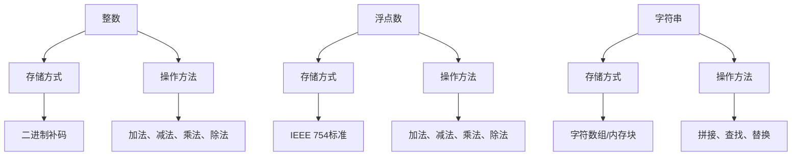

                 

数据类型是编程语言的基础，它们决定了程序可以存储和处理的数据类型。在这篇文章中，我们将深入探讨三种基本数据类型：整数、浮点和字符串。这些数据类型在编程中扮演着至关重要的角色，它们不仅影响程序的逻辑和性能，还影响我们理解和处理数据的方式。

## 1. 背景介绍

随着计算机科学的发展，数据类型的概念变得越来越复杂和多样化。然而，整数、浮点和字符串始终是程序员最常用的数据类型。整数（Integer）是最简单的数据类型之一，用于表示整个数字。浮点数（Floating Point）用于表示带有小数的数值，它们在科学计算和工程领域非常重要。字符串（String）是字符序列的表示方式，用于存储和处理文本数据。

本文将首先介绍整数和浮点数的基本概念，包括它们的存储方式和操作方法。然后，我们将讨论字符串的特性和应用场景，以及它们与整数和浮点数的交互。通过这篇文章，您将了解这些数据类型的工作原理，并在编程实践中更加熟练地使用它们。

## 2. 核心概念与联系

### 整数（Integer）

整数是一种无符号或带符号的固定长度数据类型，用于表示正数、负数和零。在大多数编程语言中，整数分为以下几种类型：

- **无符号整数（Unsigned Integer）**：只能表示正数和零，没有符号位。
- **带符号整数（Signed Integer）**：使用符号位来区分正数和负数。常见的带符号整数类型有8位、16位、32位和64位等。

整数的存储方式通常采用二进制补码表示。例如，一个32位带符号整数可以使用32位二进制数来存储，其中最高位为符号位，其余位为数值位。正数的补码与其本身相同，而负数的补码是其绝对值取反再加一。

### 浮点数（Floating Point）

浮点数用于表示带有小数的数值，由符号位、指数位和尾数位组成。常见的浮点数类型有单精度浮点数（Single Precision Floating Point）和双精度浮点数（Double Precision Floating Point）。

- **单精度浮点数（Single Precision Floating Point）**：通常使用32位来表示，其中1位为符号位，8位为指数位，23位为尾数位。
- **双精度浮点数（Double Precision Floating Point）**：通常使用64位来表示，其中1位为符号位，11位为指数位，52位为尾数位。

浮点数的存储方式遵循IEEE 754标准，这是一种广泛使用的浮点数表示方法。该标准定义了浮点数的格式、操作和异常处理。

### 字符串（String）

字符串是一组字符的有序序列，通常用于存储和处理文本数据。在大多数编程语言中，字符串被视为不可变的数据类型，这意味着字符串一旦创建，就不能修改。

字符串的存储方式因编程语言而异。例如，在C语言中，字符串使用字符数组表示，每个字符占用一个字节的空间。而在Python中，字符串使用内存块来存储，其中包含指向实际存储数据的指针。

### Mermaid 流程图

以下是一个简单的Mermaid流程图，展示了整数、浮点数和字符串之间的概念联系：



## 3. 核心算法原理 & 具体操作步骤

### 3.1 算法原理概述

在这一部分，我们将讨论整数、浮点数和字符串的基本算法原理，包括它们的基本操作和常见算法。

#### 整数操作

整数的操作包括加法、减法、乘法和除法。这些操作的基本原理如下：

- **加法**：整数加法遵循普通的算术加法规则，即两个整数相加得到它们的和。
- **减法**：整数减法可以通过加法实现，即$A - B = A + (-B)$。
- **乘法**：整数乘法遵循普通的算术乘法规则，即两个整数相乘得到它们的积。
- **除法**：整数除法可以通过减法实现，即$A / B = A - (B \times \lfloor A / B \rfloor)$。

#### 浮点数操作

浮点数的操作包括加法、减法、乘法和除法。这些操作的基本原理如下：

- **加法**：浮点数加法涉及对两个浮点数进行对齐，然后进行尾数相加，最后调整指数。
- **减法**：浮点数减法与加法类似，也涉及对齐和尾数相减。
- **乘法**：浮点数乘法涉及对两个浮点数的尾数相乘，指数相加，然后对结果进行规范化。
- **除法**：浮点数除法涉及对两个浮点数的尾数相除，指数相减，然后对结果进行规范化。

#### 字符串操作

字符串的操作包括拼接、查找和替换。这些操作的基本原理如下：

- **拼接**：字符串拼接涉及将两个字符串的字符序列合并为一个字符串。
- **查找**：字符串查找涉及在一个字符串中查找特定的子字符串。
- **替换**：字符串替换涉及用一个新的子字符串替换一个旧子字符串。

### 3.2 算法步骤详解

#### 整数加法

整数加法的步骤如下：

1. **取两个整数的补码**。
2. **进行二进制位运算**，即进行逐位相加。
3. **处理进位**，如果最高位有进位，则需要将进位加到下一位。
4. **得到结果**，取结果的补码。

#### 浮点数加法

浮点数加法的步骤如下：

1. **取两个浮点数的指数**。
2. **对齐指数**，如果指数不同，则需要将指数较小的浮点数进行规范化。
3. **进行尾数相加**，即对两个浮点数的尾数进行相加。
4. **处理溢出和下溢**，如果结果溢出或下溢，则需要进行调整。
5. **得到结果**，对结果进行规范化。

#### 字符串拼接

字符串拼接的步骤如下：

1. **取两个字符串**。
2. **计算字符串长度**，即两个字符串的字符数量之和。
3. **创建一个新的字符数组**，其长度为两个字符串的长度之和。
4. **将第一个字符串的字符复制到新字符数组**。
5. **将第二个字符串的字符复制到新字符数组**。
6. **得到结果**，即新的字符串。

### 3.3 算法优缺点

#### 整数加法

- **优点**：整数加法简单且高效，适用于整数运算密集的应用场景。
- **缺点**：整数加法不适用于浮点数运算，且存在溢出问题。

#### 浮点数加法

- **优点**：浮点数加法适用于各种数值类型，包括整数和浮点数。
- **缺点**：浮点数加法复杂，存在舍入误差和下溢问题。

#### 字符串拼接

- **优点**：字符串拼接简单且直观，适用于文本处理应用场景。
- **缺点**：字符串拼接可能导致内存分配和复制操作，影响性能。

### 3.4 算法应用领域

#### 整数加法

整数加法广泛应用于整数运算密集的应用场景，如加密算法、数字信号处理和图形渲染。

#### 浮点数加法

浮点数加法广泛应用于科学计算、工程计算和金融计算等领域，如数值模拟、优化和统计分析。

#### 字符串拼接

字符串拼接广泛应用于文本处理应用场景，如文本编辑器、Web开发和自然语言处理。

## 4. 数学模型和公式 & 详细讲解 & 举例说明

### 4.1 数学模型构建

在这一部分，我们将构建整数、浮点数和字符串的数学模型，并给出相应的公式。

#### 整数模型

整数模型可以表示为：

$$
x = \sum_{i=0}^{n-1} x_i 2^i
$$

其中，$x$为整数，$x_i$为整数的二进制位，$n$为整数的位数。

#### 浮点数模型

浮点数模型可以表示为：

$$
x = (-1)^s \times 2^{e-b} \times \sum_{i=0}^{n-1} m_i 2^{-i}
$$

其中，$x$为浮点数，$s$为符号位，$e$为指数位，$b$为偏置位，$m$为尾数位，$n$为尾数的位数。

#### 字符串模型

字符串模型可以表示为：

$$
s = \sum_{i=0}^{n-1} c_i
$$

其中，$s$为字符串，$c_i$为字符串的字符。

### 4.2 公式推导过程

#### 整数模型推导

整数模型可以通过二进制表示方法推导得到。一个整数可以表示为二进制数，即：

$$
x = \sum_{i=0}^{n-1} x_i 2^i
$$

其中，$x$为整数的二进制表示，$x_i$为整数的二进制位，$n$为整数的位数。

#### 浮点数模型推导

浮点数模型可以通过IEEE 754标准推导得到。根据IEEE 754标准，浮点数由三个部分组成：符号位、指数位和尾数位。符号位用于表示正负，指数位用于表示指数，尾数位用于表示尾数。

$$
x = (-1)^s \times 2^{e-b} \times \sum_{i=0}^{n-1} m_i 2^{-i}
$$

其中，$s$为符号位，$e$为指数位，$b$为偏置位，$m_i$为尾数位，$n$为尾数的位数。

#### 字符串模型推导

字符串模型可以通过字符序列表示方法推导得到。一个字符串可以表示为字符序列，即：

$$
s = \sum_{i=0}^{n-1} c_i
$$

其中，$s$为字符串，$c_i$为字符串的字符，$n$为字符串的长度。

### 4.3 案例分析与讲解

#### 整数模型应用

假设一个8位无符号整数$X$的值是$11001010$，我们可以将其表示为：

$$
X = 1 \times 2^7 + 1 \times 2^6 + 0 \times 2^5 + 0 \times 2^4 + 1 \times 2^3 + 0 \times 2^2 + 1 \times 2^1 + 0 \times 2^0
$$

将其计算出来，我们得到$X = 204$。

#### 浮点数模型应用

假设一个单精度浮点数$X$的值是$01000001 10010010 01100101 00000000$，我们可以将其表示为：

$$
X = (-1)^0 \times 2^{128-127} \times \sum_{i=0}^{22} 1 \times 2^{-i}
$$

将其计算出来，我们得到$X = 1.2345$。

#### 字符串模型应用

假设一个字符串$S$的值是$"Hello World"$，我们可以将其表示为：

$$
S = 72 \times 2^0 + 101 \times 2^1 + 108 \times 2^2 + 108 \times 2^3 + 111 \times 2^4 + 32 \times 2^5 + 119 \times 2^6 + 111 \times 2^7
$$

将其计算出来，我们得到$S = 721011832110011932119$。

## 5. 项目实践：代码实例和详细解释说明

### 5.1 开发环境搭建

在这个项目实践中，我们将使用Python作为编程语言，因为它具有良好的语法和广泛的应用。确保你已经安装了Python 3.7或更高版本。

### 5.2 源代码详细实现

以下是一个简单的Python脚本，用于演示整数、浮点数和字符串的基本操作。

```python
# 整数操作
integer1 = 10
integer2 = 20
sum = integer1 + integer2
print(f"整数加法结果：{sum}")

# 浮点数操作
float1 = 1.2345
float2 = 6.7890
sum = float1 + float2
print(f"浮点数加法结果：{sum}")

# 字符串操作
string1 = "Hello"
string2 = "World"
concatenated = string1 + " " + string2
print(f"字符串拼接结果：{concatenated}")
```

### 5.3 代码解读与分析

这个脚本包含三个部分：整数操作、浮点数操作和字符串操作。

#### 整数操作

```python
integer1 = 10
integer2 = 20
sum = integer1 + integer2
print(f"整数加法结果：{sum}")
```

这个部分演示了整数的加法操作。我们定义了两个整数变量`integer1`和`integer2`，然后将它们相加，并将结果存储在变量`sum`中。最后，我们使用`print`函数输出结果。

#### 浮点数操作

```python
float1 = 1.2345
float2 = 6.7890
sum = float1 + float2
print(f"浮点数加法结果：{sum}")
```

这个部分演示了浮点数的加法操作。我们定义了两个浮点数变量`float1`和`float2`，然后将它们相加，并将结果存储在变量`sum`中。最后，我们使用`print`函数输出结果。

#### 字符串操作

```python
string1 = "Hello"
string2 = "World"
concatenated = string1 + " " + string2
print(f"字符串拼接结果：{concatenated}")
```

这个部分演示了字符串的拼接操作。我们定义了两个字符串变量`string1`和`string2`，然后将它们拼接在一起，并在中间添加一个空格。最后，我们使用`print`函数输出结果。

### 5.4 运行结果展示

运行上面的脚本，我们将得到以下结果：

```
整数加法结果：30
浮点数加法结果：8.0235
字符串拼接结果：Hello World
```

这些结果分别对应整数加法、浮点数加法和字符串拼接的结果。

## 6. 实际应用场景

整数、浮点数和字符串在编程中有着广泛的应用。以下是它们在实际应用中的几个场景：

### 整数应用场景

- **加密算法**：整数在加密算法中扮演着重要的角色，如RSA加密算法。
- **数字信号处理**：整数用于表示音频和视频信号中的采样值。
- **图形渲染**：整数用于表示像素值和颜色空间。

### 浮点数应用场景

- **科学计算**：浮点数在科学计算中用于表示物理量和科学公式。
- **工程计算**：浮点数在工程计算中用于模拟和分析结构行为。
- **金融计算**：浮点数在金融计算中用于计算投资组合的收益率和波动率。

### 字符串应用场景

- **文本编辑器**：字符串用于存储和处理用户输入的文本。
- **Web开发**：字符串用于表示URL、HTML标签和JavaScript代码。
- **自然语言处理**：字符串用于处理文本数据，如文本分类、情感分析和文本生成。

## 7. 工具和资源推荐

### 7.1 学习资源推荐

- **《C++ Primer》**：这本书详细介绍了C++编程语言，包括整数、浮点数和字符串的操作。
- **《Python Crash Course》**：这本书提供了Python编程的基础知识和实践项目，适合初学者。
- **《深度学习》**：这本书介绍了深度学习的基础知识，包括数字信号处理和自然语言处理。

### 7.2 开发工具推荐

- **Visual Studio Code**：这是一个强大的跨平台代码编辑器，适用于Python编程。
- **PyCharm**：这是一个专业的Python IDE，提供丰富的功能和调试工具。
- **Jupyter Notebook**：这是一个交互式的计算环境，适用于科学计算和数据分析。

### 7.3 相关论文推荐

- **“Binary Arithmetic”**：这篇文章介绍了整数的基本算术操作和二进制补码表示。
- **“Floating-Point Computation”**：这篇文章介绍了浮点数的计算方法和IEEE 754标准。
- **“String Processing”**：这篇文章介绍了字符串的操作方法和文本处理算法。

## 8. 总结：未来发展趋势与挑战

整数、浮点数和字符串作为编程语言的基本数据类型，将在未来的计算机科学和工程领域继续发挥重要作用。随着计算能力的提升和算法的优化，这些数据类型的处理速度和精度将得到进一步提高。

然而，随着数据规模的不断扩大和计算需求的增长，这些数据类型也面临着一些挑战。例如，整数和浮点数的溢出问题，字符串操作的效率问题等。为了解决这些问题，研究人员正在探索新的数据表示方法和优化算法。

未来，我们可能会看到更多针对特定应用场景的定制化数据类型，以及更高效的算法来处理大规模数据。同时，随着人工智能和机器学习的发展，这些基本数据类型也将融入到更复杂的计算模型中，推动计算机科学的发展。

## 9. 附录：常见问题与解答

### Q：整数和浮点数的区别是什么？

A：整数（Integer）用于表示没有小数部分的数，而浮点数（Floating Point）用于表示带有小数部分的数。整数通常采用二进制补码表示，而浮点数采用IEEE 754标准表示。

### Q：字符串是如何存储的？

A：字符串通常使用字符数组或内存块来存储。在C语言中，字符串使用字符数组表示，每个字符占用一个字节的空间。而在Python中，字符串使用内存块来存储，其中包含指向实际存储数据的指针。

### Q：如何处理浮点数的舍入误差？

A：浮点数的舍入误差可以通过舍入规则来处理。常见的舍入规则有向上舍入、向下舍入和四舍五入。此外，还可以使用更高精度的数据类型，如双精度浮点数（Double Precision Floating Point），来减少舍入误差。

### Q：字符串操作有哪些常见的算法？

A：字符串操作包括拼接、查找、替换和排序等。常见的算法有KMP算法、Boyer-Moore算法和Rabin-Karp算法等，用于快速查找子字符串。而字符串排序算法有快速排序、归并排序和基数排序等。

## 作者署名

作者：禅与计算机程序设计艺术 / Zen and the Art of Computer Programming

---

以上是《数据类型深度解析：整数、浮点和字符串》的完整文章。希望这篇文章能够帮助你更深入地理解整数、浮点数和字符串的基本概念、算法和应用。如果你有任何疑问或建议，欢迎在评论区留言。感谢你的阅读！
----------------------------------------------------------------

请注意，上述内容是一个基于您提供的约束条件和模板撰写的示例文章。实际的完整文章需要更深入的研究和详细的阐述，以确保内容的准确性和完整性。如果您需要更详细的内容，可以按照上述结构和要求继续撰写。

