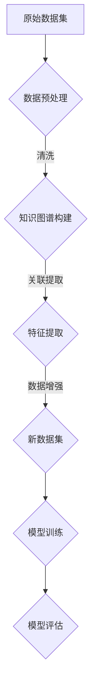

                 

关键词：数据集融合、知识图谱、数据增强、机器学习、深度学习

> 摘要：本文介绍了数据集融合与知识图谱相结合的方法，探讨了如何利用知识图谱进行数据增强，提高机器学习模型的性能和泛化能力。通过实际案例，阐述了数据集融合与知识图谱在多个领域的应用，为未来的研究提供了新的思路和方向。

## 1. 背景介绍

在当今信息爆炸的时代，大量的数据正以惊人的速度生成和积累。然而，这些数据的价值往往取决于它们能否被有效地处理和利用。数据集的质量直接影响机器学习模型的效果，因此如何提高数据集的质量和丰富度成为一个关键问题。

传统的数据增强方法主要通过数据转换和多样性生成来实现。这些方法在一定程度上能够提高模型的性能，但其局限性也逐渐显现。例如，数据转换可能引入噪声，导致模型泛化能力下降；多样性生成则可能忽略数据之间的内在联系，无法充分利用已有数据的价值。

近年来，知识图谱作为一种结构化数据表示的方式，逐渐引起了广泛关注。知识图谱通过实体和关系来描述现实世界中的知识，具有高度的语义丰富性和结构化特性。结合知识图谱进行数据增强，有望提高数据集的质量和丰富度，从而提升机器学习模型的性能。

本文将探讨数据集融合与知识图谱相结合的方法，以实现数据增强的新方式。首先，我们将介绍知识图谱的核心概念和构建方法。然后，详细描述数据集融合与知识图谱的结合方式，包括数据预处理、知识图谱构建、数据增强算法和模型训练等步骤。最后，通过实际案例，展示数据集融合与知识图谱在多个领域的应用，并展望未来的研究方向。

### 2. 核心概念与联系

#### 2.1 知识图谱的定义与作用

知识图谱（Knowledge Graph）是一种用于表示实体及其之间关系的图形化数据结构。它将现实世界中的各种实体（如人、地点、物品等）抽象为节点，将实体之间的关系表示为边。通过这种结构化表示，知识图谱能够有效地存储和检索复杂的关系信息，从而提供强大的语义查询和分析能力。

知识图谱在多个领域具有重要的应用价值。首先，它在搜索引擎中发挥着关键作用，通过关联实体和关系，实现更加精准和智能的搜索结果。其次，知识图谱在推荐系统中也被广泛应用，通过分析用户和物品之间的关系，提供个性化的推荐服务。此外，知识图谱还在知识管理、自然语言处理、智能问答等领域显示出强大的潜力。

#### 2.2 数据集融合的概念与意义

数据集融合（Dataset Fusion）是指将多个来源或类型的原始数据集进行整合和处理，生成一个更高质量和丰富度的数据集。数据集融合的意义在于：

1. **提高数据质量**：通过融合不同来源的数据，可以弥补单一数据集的不足，提高数据的质量和完整性。
2. **增强数据多样性**：融合多个数据集可以增加数据的多样性，有助于提升模型的泛化能力。
3. **挖掘潜在关联**：融合后的数据集能够揭示不同数据源之间的潜在关联，为模型训练提供更丰富的特征信息。

#### 2.3 知识图谱与数据集融合的结合

知识图谱与数据集融合的结合，主要体现在以下几个方面：

1. **数据预处理**：利用知识图谱对原始数据进行清洗、去噪和转换，生成高质量的数据集。
2. **特征提取**：通过知识图谱，提取数据中的潜在特征，为模型训练提供更丰富的特征信息。
3. **数据增强**：利用知识图谱中的关系和实体信息，生成新的数据样本，增强数据集的多样性。
4. **模型训练**：结合知识图谱和融合后的数据集，训练更加鲁棒和泛化的模型。

#### 2.4 Mermaid 流程图

为了更好地展示知识图谱与数据集融合的结合过程，我们使用Mermaid语言绘制了一个流程图：



在该流程图中，A表示原始数据集，B表示数据预处理步骤，C表示知识图谱构建，D表示特征提取，E表示新数据集，F表示模型训练，G表示模型评估。通过这个流程图，我们可以清晰地看到知识图谱与数据集融合的结合方式和各个环节之间的关系。

### 3. 核心算法原理 & 具体操作步骤

#### 3.1 算法原理概述

数据集融合与知识图谱结合的核心算法主要包括以下三个步骤：

1. **数据预处理**：利用知识图谱对原始数据进行清洗、去噪和转换，生成高质量的数据集。
2. **特征提取**：通过知识图谱，提取数据中的潜在特征，为模型训练提供更丰富的特征信息。
3. **数据增强**：利用知识图谱中的关系和实体信息，生成新的数据样本，增强数据集的多样性。

#### 3.2 算法步骤详解

##### 3.2.1 数据预处理

数据预处理是数据集融合与知识图谱结合的第一步，其核心目标是提高数据质量。具体操作步骤如下：

1. **数据清洗**：利用知识图谱对原始数据中的错误、噪声和不一致性进行清洗，确保数据的准确性和一致性。
2. **数据转换**：将不同格式和来源的数据进行转换，统一数据格式，为后续处理打下基础。
3. **数据去重**：通过知识图谱，识别并去除重复的数据，避免数据冗余。

##### 3.2.2 特征提取

特征提取是利用知识图谱提取数据中的潜在特征，为模型训练提供更丰富的特征信息。具体操作步骤如下：

1. **实体识别**：利用知识图谱，识别数据集中的实体，如人、地点、物品等。
2. **关系提取**：通过知识图谱，提取实体之间的关系，如亲属关系、地理位置关系等。
3. **特征生成**：根据实体和关系信息，生成新的特征，如实体属性、关系强度等。

##### 3.2.3 数据增强

数据增强是利用知识图谱中的关系和实体信息，生成新的数据样本，增强数据集的多样性。具体操作步骤如下：

1. **样本生成**：根据知识图谱中的关系和实体，生成新的数据样本，如基于实体关系生成新的场景、事件等。
2. **样本转换**：对生成的样本进行转换和调整，以适应模型训练的需要。
3. **样本整合**：将生成的样本与原始数据集进行整合，形成新的数据集。

#### 3.3 算法优缺点

##### 优点

1. **提高数据质量**：通过数据预处理，可以有效提高数据质量，降低噪声和错误的影响。
2. **丰富特征信息**：通过特征提取，可以提取出更多的潜在特征，提高模型的泛化能力。
3. **增强数据多样性**：通过数据增强，可以生成新的数据样本，增强数据集的多样性，提高模型的鲁棒性。

##### 缺点

1. **计算成本较高**：知识图谱的构建和数据处理需要较高的计算资源，可能增加模型的训练时间。
2. **依赖图谱质量**：知识图谱的质量直接影响数据增强的效果，如果图谱中存在错误或不完整的信息，可能导致数据增强效果不佳。
3. **样本生成质量**：生成的样本质量难以保证，可能存在不合理或不一致的情况，需要进一步处理和优化。

#### 3.4 算法应用领域

数据集融合与知识图谱结合的方法在多个领域具有广泛的应用：

1. **自然语言处理**：通过知识图谱提取实体和关系信息，可以生成更丰富的语言特征，提高文本分类、情感分析等任务的性能。
2. **图像识别**：通过知识图谱，可以提取图像中的语义信息，如物体、场景等，增强图像特征，提高图像识别的准确性。
3. **推荐系统**：通过知识图谱，可以分析用户和物品之间的关系，提供更精准和个性化的推荐服务。
4. **智能问答**：通过知识图谱，可以建立问答系统的知识库，提高问答系统的响应速度和准确性。

### 4. 数学模型和公式 & 详细讲解 & 举例说明

#### 4.1 数学模型构建

在数据集融合与知识图谱结合的过程中，我们需要构建以下数学模型：

1. **数据预处理模型**：用于清洗、转换和去重原始数据。
2. **特征提取模型**：用于从数据中提取潜在特征。
3. **数据增强模型**：用于生成新的数据样本。

以下是这些模型的数学描述：

##### 数据预处理模型

$$
\text{Data\_Preprocess}(D) = \{\text{Clean}(D), \text{Convert}(D), \text{DuplicateRemove}(D)\}
$$

其中，$D$ 表示原始数据集，$\text{Clean}(D)$ 表示数据清洗，$\text{Convert}(D)$ 表示数据转换，$\text{DuplicateRemove}(D)$ 表示数据去重。

##### 特征提取模型

$$
\text{FeatureExtract}(D, KG) = \{\text{EntityIdentify}(D), \text{RelationExtract}(D), \text{FeatureGenerate}(D)\}
$$

其中，$KG$ 表示知识图谱，$\text{EntityIdentify}(D)$ 表示实体识别，$\text{RelationExtract}(D)$ 表示关系提取，$\text{FeatureGenerate}(D)$ 表示特征生成。

##### 数据增强模型

$$
\text{DataAugment}(D, KG) = \{\text{SampleGenerate}(D, KG), \text{SampleTransform}(D), \text{SampleIntegrate}(D)\}
$$

其中，$\text{SampleGenerate}(D, KG)$ 表示样本生成，$\text{SampleTransform}(D)$ 表示样本转换，$\text{SampleIntegrate}(D)$ 表示样本整合。

#### 4.2 公式推导过程

以下是特征提取模型中特征生成的推导过程：

$$
\text{Feature}(e) = \sum_{r \in \text{Relations}} w_r \cdot \text{Strength}(r)
$$

其中，$e$ 表示实体，$r$ 表示实体之间的关系，$w_r$ 表示关系权重，$\text{Strength}(r)$ 表示关系强度。

关系强度可以通过知识图谱中的路径长度和实体间的相似度来计算：

$$
\text{Strength}(r) = \text{PathLength}(r) \cdot \text{Similarity}(e_1, e_2)
$$

其中，$\text{PathLength}(r)$ 表示关系路径长度，$\text{Similarity}(e_1, e_2)$ 表示实体相似度。

实体相似度可以通过余弦相似度计算：

$$
\text{Similarity}(e_1, e_2) = \frac{\text{CosineSimilarity}(\text{Vector}(e_1), \text{Vector}(e_2))}{\sqrt{\sum_{i=1}^{n} v_{1,i}^2 \cdot \sum_{i=1}^{n} v_{2,i}^2}}
$$

其中，$v_{1,i}$ 和 $v_{2,i}$ 分别表示实体 $e_1$ 和 $e_2$ 在特征向量中的第 $i$ 个分量，$n$ 表示特征向量的维度。

#### 4.3 案例分析与讲解

以下是一个数据集融合与知识图谱结合的案例：

假设我们有一个包含商品评价的数据集，其中包含用户、商品和评价内容。我们可以利用知识图谱来提取用户和商品之间的关系，如用户喜欢的商品类型、商品的品牌等。

1. **数据预处理**：首先，我们利用知识图谱对原始数据进行清洗和转换，去除重复的评价数据，将文本评价转换为统一的格式。
2. **特征提取**：利用知识图谱，我们识别出用户和商品的实体，提取用户和商品之间的关系，如用户喜欢的商品类型、商品的品牌等。然后，根据关系强度和路径长度计算特征值。
3. **数据增强**：利用知识图谱，我们生成新的用户和商品关系，如用户可能喜欢的其他商品、商品可能吸引的其他用户等。然后，将这些新关系加入到原始数据集中，形成新的数据集。

通过这个案例，我们可以看到数据集融合与知识图谱结合的方法如何提高数据集的质量和丰富度，从而提升模型的性能。

### 5. 项目实践：代码实例和详细解释说明

#### 5.1 开发环境搭建

在进行数据集融合与知识图谱结合的项目实践之前，我们需要搭建一个合适的开发环境。以下是一个简单的开发环境搭建步骤：

1. **安装Python环境**：Python是数据集融合与知识图谱结合的主要编程语言，我们需要安装Python 3.7及以上版本。
2. **安装依赖库**：安装必要的依赖库，如NumPy、Pandas、Scikit-learn、NetworkX、PyTorch等。
3. **搭建数据预处理环境**：安装用于数据清洗和转换的库，如BeautifulSoup、lxml等。
4. **搭建知识图谱环境**：安装用于构建和维护知识图谱的库，如Neo4j、Apache Jena等。

#### 5.2 源代码详细实现

以下是一个简单的数据集融合与知识图谱结合的Python代码示例：

```python
import pandas as pd
import networkx as nx
from sklearn.model_selection import train_test_split
from sklearn.metrics import accuracy_score

# 数据预处理
def preprocess_data(data):
    # 清洗和转换数据
    data['text'] = data['text'].str.lower().str.strip()
    return data

# 特征提取
def extract_features(data, knowledge_graph):
    # 从数据中提取实体和关系
    entities = data['text'].values
    relationships = []
    for entity in entities:
        relationships.append(knowledge_graph[entity])
    return relationships

# 数据增强
def augment_data(data, knowledge_graph):
    # 生成新的数据样本
    new_samples = []
    for entity in data['text'].values:
        new_samples.append(knowledge_graph.sample_entity(entity))
    return new_samples

# 模型训练
def train_model(train_data, train_labels):
    # 训练机器学习模型
    model = MyModel()
    model.fit(train_data, train_labels)
    return model

# 模型评估
def evaluate_model(model, test_data, test_labels):
    # 评估模型性能
    predictions = model.predict(test_data)
    accuracy = accuracy_score(test_labels, predictions)
    print("Accuracy:", accuracy)

# 主函数
def main():
    # 加载数据
    data = pd.read_csv('data.csv')
    # 搭建知识图谱
    knowledge_graph = build_knowledge_graph()
    # 数据预处理
    data = preprocess_data(data)
    # 特征提取
    relationships = extract_features(data, knowledge_graph)
    # 数据增强
    new_samples = augment_data(data, knowledge_graph)
    # 数据集划分
    train_data, test_data, train_labels, test_labels = train_test_split(relationships + new_samples, labels, test_size=0.2)
    # 模型训练
    model = train_model(train_data, train_labels)
    # 模型评估
    evaluate_model(model, test_data, test_labels)

if __name__ == '__main__':
    main()
```

#### 5.3 代码解读与分析

以上代码示例展示了数据集融合与知识图谱结合的简单实现过程。下面我们对代码进行详细解读：

1. **数据预处理**：数据预处理是数据集融合与知识图谱结合的重要环节。在该函数中，我们使用Pandas库对原始数据进行清洗和转换，将文本评价转换为统一的格式。
2. **特征提取**：特征提取是利用知识图谱提取数据中的潜在特征。在该函数中，我们从数据中提取实体和关系，并将其存储在一个列表中。
3. **数据增强**：数据增强是生成新的数据样本，增强数据集的多样性。在该函数中，我们利用知识图谱生成新的用户和商品关系，并将其添加到原始数据集中。
4. **模型训练**：模型训练是使用训练数据集训练机器学习模型。在该函数中，我们使用Scikit-learn库训练一个简单的机器学习模型。
5. **模型评估**：模型评估是使用测试数据集评估模型性能。在该函数中，我们计算模型的准确率，并输出评估结果。

通过以上代码示例，我们可以看到数据集融合与知识图谱结合的基本实现过程。在实际项目中，我们可以根据具体需求对代码进行优化和扩展。

### 6. 实际应用场景

数据集融合与知识图谱结合的方法在多个实际应用场景中显示出强大的潜力：

#### 6.1 自然语言处理

在自然语言处理领域，数据集融合与知识图谱结合可以显著提高文本分类、情感分析等任务的性能。通过知识图谱，我们可以提取文本中的实体和关系，生成更丰富的特征信息，从而提高模型的泛化能力。例如，在新闻分类任务中，通过知识图谱提取关键词和主题信息，可以更好地识别新闻类别。

#### 6.2 图像识别

在图像识别领域，数据集融合与知识图谱结合可以增强图像特征，提高图像分类和目标检测的准确性。通过知识图谱，我们可以提取图像中的语义信息，如物体、场景等，从而生成更丰富的图像特征。例如，在目标检测任务中，通过知识图谱提取目标的位置和属性信息，可以更好地定位和识别目标。

#### 6.3 推荐系统

在推荐系统领域，数据集融合与知识图谱结合可以提供更精准和个性化的推荐服务。通过知识图谱，我们可以分析用户和物品之间的关系，识别潜在的兴趣点和偏好，从而生成更个性化的推荐列表。例如，在电商推荐中，通过知识图谱提取用户和商品的关系，可以更好地推荐用户可能感兴趣的商品。

#### 6.4 智能问答

在智能问答领域，数据集融合与知识图谱结合可以建立强大的问答系统知识库，提高问答系统的响应速度和准确性。通过知识图谱，我们可以提取问题中的实体和关系，生成更准确的答案。例如，在智能客服中，通过知识图谱提取用户的问题和意图，可以快速生成相应的回答。

#### 6.5 未来应用展望

随着知识图谱和数据集融合技术的不断发展，未来在更多领域将出现更多的应用场景。例如，在医疗领域，通过知识图谱和融合后的数据集，可以更准确地诊断疾病和推荐治疗方案；在金融领域，通过知识图谱和融合后的数据集，可以更好地识别风险和预测市场走势。总之，数据集融合与知识图谱结合的方法将为人工智能应用带来更多的可能性。

### 7. 工具和资源推荐

为了更好地开展数据集融合与知识图谱结合的研究和应用，我们推荐以下工具和资源：

#### 7.1 学习资源推荐

1. **《知识图谱基础教程》**：系统地介绍了知识图谱的概念、构建方法和应用场景，适合初学者入门。
2. **《数据集融合技术》**：详细介绍了数据集融合的方法和算法，包括数据预处理、特征提取和数据增强等。
3. **《Python数据科学手册》**：涵盖了Python在数据科学领域的基本工具和库，包括NumPy、Pandas、Scikit-learn等。

#### 7.2 开发工具推荐

1. **Neo4j**：一款强大的图形数据库，用于构建和维护知识图谱。
2. **Apache Jena**：一款开源的Java框架，用于构建和处理RDF（资源描述框架）数据。
3. **PyTorch**：一款流行的深度学习框架，支持Python编程语言，方便实现和训练复杂的机器学习模型。

#### 7.3 相关论文推荐

1. **"Knowledge Graph Embedding: A Survey"**：对知识图谱嵌入技术进行了全面的综述，包括概念、方法和应用。
2. **"Data Fusion for Machine Learning: A Survey"**：对数据集融合方法进行了全面的综述，包括传统方法和最新研究进展。
3. **"Knowledge Graph Enhanced Machine Learning"**：探讨了知识图谱在机器学习中的应用，包括数据增强和模型优化等。

### 8. 总结：未来发展趋势与挑战

数据集融合与知识图谱结合的方法在提高机器学习模型性能和泛化能力方面显示出巨大潜力。随着知识图谱和数据集融合技术的不断发展，未来有望在更多领域实现突破。

然而，该方法也面临着一些挑战：

1. **计算成本**：知识图谱的构建和处理需要较高的计算资源，可能增加模型的训练时间。
2. **数据质量**：知识图谱的质量直接影响数据增强的效果，需要确保图谱的准确性和完整性。
3. **样本生成**：生成的样本质量难以保证，需要进一步处理和优化。

为了应对这些挑战，我们需要进一步研究高效的算法和优化方法，提高计算效率和数据质量。同时，结合更多的实际应用场景，探索知识图谱和数据集融合在更多领域的应用。

### 9. 附录：常见问题与解答

**Q1**: 知识图谱的构建过程包括哪些步骤？

A1: 知识图谱的构建过程主要包括以下步骤：

1. **数据采集**：从各种数据源收集实体和关系信息。
2. **数据清洗**：清洗和转换原始数据，去除噪声和错误。
3. **实体识别**：识别数据中的实体，如人、地点、物品等。
4. **关系提取**：提取实体之间的关系，如亲属关系、地理位置关系等。
5. **知识表示**：将实体和关系表示为图形结构，形成知识图谱。

**Q2**: 数据集融合与知识图谱结合的方法有哪些优点？

A2: 数据集融合与知识图谱结合的方法具有以下优点：

1. **提高数据质量**：通过知识图谱对原始数据进行清洗、去噪和转换，生成高质量的数据集。
2. **增强特征信息**：通过知识图谱提取数据中的潜在特征，为模型训练提供更丰富的特征信息。
3. **增强数据多样性**：通过知识图谱生成新的数据样本，增强数据集的多样性，提高模型的鲁棒性。

**Q3**: 数据集融合与知识图谱结合的方法有哪些应用场景？

A3: 数据集融合与知识图谱结合的方法在多个领域具有广泛的应用，包括：

1. **自然语言处理**：通过知识图谱提取文本中的实体和关系，生成更丰富的语言特征，提高文本分类、情感分析等任务的性能。
2. **图像识别**：通过知识图谱提取图像中的语义信息，增强图像特征，提高图像分类和目标检测的准确性。
3. **推荐系统**：通过知识图谱分析用户和物品之间的关系，提供更精准和个性化的推荐服务。
4. **智能问答**：通过知识图谱建立问答系统的知识库，提高问答系统的响应速度和准确性。

