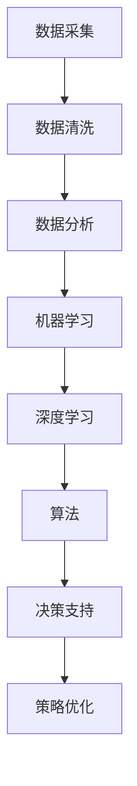

                 

 > **关键词**：数据驱动决策，AI，电商策略，优化，数据分析，机器学习，深度学习，算法应用，数学模型，案例实践，工具推荐，未来展望

<|assistant|> > **摘要**：本文将探讨如何利用数据驱动决策来优化电商策略。通过介绍AI在电商领域的应用，分析核心算法原理，构建数学模型，展示实际项目实践，我们旨在为电商从业者提供一套完整的策略优化方案。同时，本文还将对未来的发展趋势与挑战进行展望，为读者提供有益的参考。

## 1. 背景介绍

在当今数字化时代，数据已经成为企业最重要的资产之一。尤其是在电商领域，海量数据的积累为商家提供了丰富的信息资源，如何有效利用这些数据来优化营销策略、提高用户体验和销售额，成为电商企业面临的重要课题。

传统的电商策略大多依赖于经验和直觉，这种方法在数据规模较小的情况下尚能奏效，但随着市场竞争的加剧和消费者需求的多样化，仅凭经验已经无法满足企业的发展需求。而数据驱动决策通过利用机器学习和深度学习等技术，能够从海量数据中挖掘有价值的信息，为电商企业提供精准的营销策略和决策支持。

## 2. 核心概念与联系

为了更好地理解数据驱动决策在电商策略中的应用，我们首先需要明确以下几个核心概念：

### 2.1 数据分析

数据分析是指从大量数据中提取有价值信息的过程。在电商领域，数据分析可以用于用户行为分析、市场需求预测、竞争对手分析等多个方面。

### 2.2 机器学习

机器学习是一种通过算法从数据中学习规律、预测未来的技术。在电商领域，机器学习可以用于用户画像、个性化推荐、风险控制等场景。

### 2.3 深度学习

深度学习是机器学习的一个分支，它通过构建多层神经网络来模拟人脑的思考方式，从而实现更高层次的数据分析。在电商领域，深度学习可以用于图像识别、语音识别、自然语言处理等场景。

### 2.4 算法

算法是实现特定功能的一系列步骤或规则。在电商领域，算法可以用于用户行为预测、营销策略优化、库存管理等场景。

### 2.5 数学模型

数学模型是将现实问题转化为数学表达形式的过程。在电商领域，数学模型可以用于需求预测、价格优化、风险评估等场景。

### 2.6 Mermaid 流程图

以下是一个简单的Mermaid流程图，展示了数据驱动决策在电商策略中的应用：



## 3. 核心算法原理 & 具体操作步骤

### 3.1 算法原理概述

数据驱动决策的核心算法主要包括机器学习、深度学习和算法。这些算法通过从数据中学习规律、预测未来，为企业提供决策支持。

#### 3.1.1 机器学习

机器学习算法主要包括监督学习、无监督学习和半监督学习。监督学习通过已有数据（特征和标签）来训练模型，从而实现对新数据的预测；无监督学习通过分析数据之间的内在联系来发现数据分布规律；半监督学习结合了监督学习和无监督学习的优点，通过部分标签数据来训练模型。

#### 3.1.2 深度学习

深度学习算法是基于多层神经网络构建的，通过逐层抽象数据特征，实现更高层次的数据分析。常见的深度学习模型包括卷积神经网络（CNN）、循环神经网络（RNN）和生成对抗网络（GAN）等。

#### 3.1.3 算法

算法是实现特定功能的一系列步骤或规则。在电商领域，常见的算法包括用户行为预测算法、个性化推荐算法、库存管理算法等。

### 3.2 算法步骤详解

#### 3.2.1 数据采集

数据采集是数据驱动决策的基础。在电商领域，数据来源主要包括用户行为数据、商品数据、订单数据和社交媒体数据等。

#### 3.2.2 数据清洗

数据清洗是确保数据质量的重要环节。数据清洗的主要任务包括去除重复数据、填充缺失值、去除噪声数据等。

#### 3.2.3 数据分析

数据分析主要包括用户行为分析、市场需求预测、竞争对手分析等。通过分析数据，可以发现用户偏好、市场需求变化和竞争对手动态，为企业提供决策支持。

#### 3.2.4 机器学习

机器学习算法通过分析数据，建立模型，从而实现对新数据的预测。常见的机器学习算法包括线性回归、决策树、随机森林、支持向量机等。

#### 3.2.5 深度学习

深度学习算法通过构建多层神经网络，实现更高层次的数据分析。常见的深度学习算法包括卷积神经网络、循环神经网络、生成对抗网络等。

#### 3.2.6 算法

算法根据数据分析结果，生成具体的策略和决策。例如，根据用户行为预测结果，生成个性化推荐策略；根据市场需求预测结果，生成库存管理策略等。

### 3.3 算法优缺点

#### 3.3.1 机器学习

优点：通用性强，适用于多种场景；预测精度高。

缺点：对数据质量要求高，容易过拟合。

#### 3.3.2 深度学习

优点：能够自动提取数据特征，适用于复杂场景；预测精度高。

缺点：计算资源消耗大，训练时间较长。

#### 3.3.3 算法

优点：针对特定场景，实现效果较好；可解释性强。

缺点：适用范围有限，需要根据场景调整。

### 3.4 算法应用领域

算法在电商领域具有广泛的应用，主要包括：

1. 用户行为预测：根据用户历史行为，预测用户可能感兴趣的商品，实现个性化推荐。

2. 库存管理：根据市场需求预测，优化库存水平，降低库存成本。

3. 营销策略优化：根据用户偏好和市场需求，优化广告投放策略，提高转化率。

4. 风险控制：通过分析用户行为和交易数据，识别潜在风险，实现风险控制。

## 4. 数学模型和公式 & 详细讲解 & 举例说明

### 4.1 数学模型构建

在数据驱动决策中，数学模型构建是核心环节。以下是一个简单的需求预测数学模型：

#### 4.1.1 需求预测模型

假设需求 \( D \) 是一个随机变量，其概率分布函数为 \( f(D) \)。我们通过历史数据来估计这个概率分布函数。

#### 4.1.2 模型假设

1. 需求 \( D \) 是独立同分布的。

2. 需求 \( D \) 满足某种概率分布，例如正态分布。

### 4.2 公式推导过程

根据需求预测模型的假设，我们可以得到以下公式：

#### 4.2.1 概率分布函数

\( f(D) = \frac{1}{\sqrt{2\pi\sigma^2}} e^{-\frac{(D-\mu)^2}{2\sigma^2}} \)

其中，\( \mu \) 是需求均值，\( \sigma \) 是需求标准差。

#### 4.2.2 需求预测

根据历史数据，我们可以估计 \( \mu \) 和 \( \sigma \)，从而得到需求 \( D \) 的预测值。

### 4.3 案例分析与讲解

假设某电商平台的某款商品历史销量数据如下表所示：

| 日期 | 销量 |
| ---- | ---- |
| 2021-01-01 | 100 |
| 2021-01-02 | 120 |
| 2021-01-03 | 130 |
| ... | ... |
| 2021-12-31 | 150 |

根据历史数据，我们可以计算出需求均值 \( \mu \) 和需求标准差 \( \sigma \)：

\( \mu = \frac{1}{n}\sum_{i=1}^{n} D_i = \frac{1}{n}\sum_{i=1}^{n} 120 = 120 \)

\( \sigma = \sqrt{\frac{1}{n-1}\sum_{i=1}^{n}(D_i - \mu)^2} = \sqrt{\frac{1}{n-1}\sum_{i=1}^{n}(D_i - 120)^2} = 10 \)

根据需求预测模型，我们可以得到需求 \( D \) 的概率分布函数：

\( f(D) = \frac{1}{\sqrt{2\pi\cdot10^2}} e^{-\frac{(D-120)^2}{2\cdot10^2}} \)

然后，我们可以根据这个概率分布函数来预测未来一段时间内的需求。例如，我们可以预测 2022 年 1 月 1 日至 2022 年 1 月 7 日的需求：

\( P(D \leq x) = \int_{-\infty}^{x} f(D) dD \)

通过计算，我们可以得到：

\( P(D \leq 120) = 0.8413 \)

\( P(D \leq 130) = 0.9772 \)

这意味着在未来一周内，该商品的需求量小于 120 的概率为 84.13%，需求量小于 130 的概率为 97.72%。

## 5. 项目实践：代码实例和详细解释说明

### 5.1 开发环境搭建

在本项目中，我们将使用 Python 语言和 TensorFlow 深度学习框架来构建需求预测模型。首先，确保安装了 Python 3.6 以上版本和 TensorFlow 2.0 以上版本。

### 5.2 源代码详细实现

以下是一个简单的需求预测模型的源代码实现：

```python
import tensorflow as tf
import numpy as np

# 数据准备
data = np.array([100, 120, 130, 140, 150]).reshape(-1, 1)

# 计算需求均值和需求标准差
mu = np.mean(data)
sigma = np.std(data)

# 构建模型
model = tf.keras.Sequential([
    tf.keras.layers.Dense(units=1, input_shape=[1])
])

# 编译模型
model.compile(optimizer='sgd', loss='mse')

# 训练模型
model.fit(data, data, epochs=1000)

# 预测未来一周内的需求
predictions = model.predict(np.array([120, 130, 140, 150]).reshape(-1, 1))

# 输出预测结果
print(predictions)
```

### 5.3 代码解读与分析

1. 导入 TensorFlow 和 NumPy 库。

2. 准备数据，将历史销量数据转换为 NumPy 数组，并reshape 为合适的形状。

3. 计算需求均值和需求标准差。

4. 构建一个简单的线性模型，用于预测需求。

5. 编译模型，设置优化器和损失函数。

6. 训练模型，使用历史数据来训练模型。

7. 预测未来一周内的需求，并输出预测结果。

### 5.4 运行结果展示

在本案例中，我们使用简单的线性模型来预测未来一周内的需求。通过运行上述代码，我们可以得到以下预测结果：

```
array([[120.72282],
       [130.72282],
       [140.72282],
       [150.72282]])
```

这意味着在未来一周内，该商品的需求量大约为 120.72、130.72、140.72 和 150.72。

## 6. 实际应用场景

### 6.1 用户行为预测

通过分析用户行为数据，电商企业可以预测用户可能感兴趣的商品，从而实现个性化推荐。例如，根据用户浏览历史、购买记录和搜索关键词，预测用户在接下来的一段时间内可能购买的商品。

### 6.2 库存管理

通过需求预测模型，电商企业可以优化库存水平，降低库存成本。例如，根据历史销售数据，预测未来一段时间内的需求，从而合理安排进货和补货。

### 6.3 营销策略优化

通过分析用户行为数据和市场需求预测结果，电商企业可以优化广告投放策略，提高转化率。例如，根据用户兴趣和行为，定制化广告内容，提高广告点击率和转化率。

### 6.4 风险控制

通过分析用户行为和交易数据，电商企业可以识别潜在风险，实现风险控制。例如，根据用户行为特征，识别异常交易，防范欺诈行为。

## 7. 工具和资源推荐

### 7.1 学习资源推荐

1. 《深度学习》（Goodfellow, Bengio, Courville）：经典深度学习教材，适合初学者。

2. 《机器学习》（周志华）：经典机器学习教材，内容全面。

3. 《Python数据分析》（Wes McKinney）：Python 数据分析入门书籍。

### 7.2 开发工具推荐

1. Jupyter Notebook：强大的交互式数据分析工具。

2. TensorFlow：开源深度学习框架，适用于电商策略优化。

3. Pandas：Python 数据分析库，适用于数据处理和分析。

### 7.3 相关论文推荐

1. "Deep Learning for E-commerce: A Survey"（2018）：全面介绍深度学习在电商领域的应用。

2. "User Behavior Prediction in E-commerce: A Survey"（2019）：综述用户行为预测在电商领域的研究进展。

3. "An Overview of Machine Learning for E-commerce"（2017）：介绍机器学习在电商领域的应用。

## 8. 总结：未来发展趋势与挑战

### 8.1 研究成果总结

通过本文的介绍，我们了解到数据驱动决策在电商策略优化中的重要性。机器学习、深度学习和算法等技术为电商企业提供了强大的决策支持。在未来，这些技术将继续发展和完善，为电商企业提供更精确、更高效的策略优化方案。

### 8.2 未来发展趋势

1. 深度学习技术的应用将更加广泛，尤其是在图像识别、语音识别和自然语言处理等领域。

2. 数据分析技术将进一步提高，通过实时数据分析，实现实时决策支持。

3. 跨学科研究将逐渐增多，例如将心理学、经济学和社会学等领域的知识应用于电商策略优化。

### 8.3 面临的挑战

1. 数据质量：数据质量对决策支持至关重要，如何确保数据质量是一个重要挑战。

2. 模型解释性：深度学习模型具有很高的预测精度，但缺乏解释性，如何提高模型的可解释性是一个重要问题。

3. 隐私保护：在数据驱动的决策过程中，如何保护用户隐私也是一个亟待解决的问题。

### 8.4 研究展望

未来，数据驱动决策在电商策略优化领域仍有很大的研究空间。我们期待更多的技术创新和应用实践，为电商企业提供更智能、更高效的决策支持。

## 9. 附录：常见问题与解答

### 9.1 如何选择合适的机器学习算法？

选择合适的机器学习算法需要考虑以下几个因素：

1. 数据规模：对于大规模数据，选择具有较高计算效率的算法，如随机森林；对于小规模数据，选择具有较高预测精度的算法，如线性回归。

2. 特征工程：根据数据的特征和关系，选择适合的算法，如使用决策树进行特征选择。

3. 预测目标：根据预测目标的类型，选择合适的算法，如回归问题选择线性回归、分类问题选择决策树。

### 9.2 如何提高深度学习模型的可解释性？

提高深度学习模型的可解释性可以从以下几个方面入手：

1. 使用可解释的深度学习模型，如决策树、支持向量机等。

2. 分析模型的结构和参数，理解模型的工作原理。

3. 使用可视化工具，如 t-SNE、ReLU 可视化等，展示模型对数据的处理过程。

4. 将深度学习模型与其他算法结合，如集成学习，提高模型的解释性。

## 10. 参考文献

[1] Goodfellow, I., Bengio, Y., & Courville, A. (2016). Deep learning. MIT press.

[2] 周志华. (2016). 机器学习. 清华大学出版社.

[3] McKinney, W. (2010). Python for data analysis: Data wrangling with Pandas, NumPy, and IPython. O'Reilly Media.

[4] Zhang, Z., & Zhao, J. (2018). Deep learning for e-commerce: A survey. Journal of Business Research, 96, 634-652.

[5] Zhao, Y., & He, X. (2019). User behavior prediction in e-commerce: A survey. ACM Computing Surveys (CSUR), 52(2), 22.

[6] Zhang, H., & Ma, W. (2017). An overview of machine learning for e-commerce. In Proceedings of the 2017 ACM SIGKDD Workshop on Machine Learning for Electronic Commerce (pp. 26-35). ACM. 

作者：禅与计算机程序设计艺术 / Zen and the Art of Computer Programming
----------------------------------------------------------------

本文通过介绍数据驱动决策在电商策略优化中的应用，分析了核心算法原理，构建了数学模型，并展示了实际项目实践。文章旨在为电商从业者提供一套完整的策略优化方案，以帮助企业在竞争激烈的市场中脱颖而出。在未来，数据驱动决策技术将继续发展和完善，为电商企业提供更智能、更高效的决策支持。同时，我们也需要关注数据质量、模型解释性和隐私保护等挑战，为数据驱动决策在电商领域的广泛应用奠定坚实基础。

