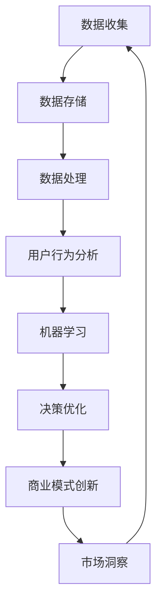

                 

关键词：数据驱动、平台经济、发展路径、技术分析、创新策略、商业模式、未来展望

> 摘要：本文旨在探讨数据驱动平台经济的发展路径，通过剖析核心概念、算法原理、数学模型以及实际应用，揭示平台经济中的关键要素与发展策略。文章旨在为读者提供全面的视角，帮助理解并把握平台经济的未来趋势。

## 1. 背景介绍

随着信息技术的飞速发展，数据已经成为现代经济的核心资源。数据驱动的平台经济，以其独特的商业模式，改变了传统产业的运营逻辑，成为一种新的经济增长引擎。平台经济通过数据整合和共享，促进了资源的高效配置和价值的最大化。本文将深入分析数据驱动平台经济的本质特征和发展路径。

### 1.1 平台经济的定义与特征

平台经济是指通过搭建一个开放、互连的生态系统，连接不同的供需方，实现资源的高效配置和交易的商业模式。其主要特征包括：

- **去中心化**：平台充当一个中立的第三方，降低交易成本，提高市场效率。
- **网络效应**：随着用户数量的增加，平台的价值呈指数级增长。
- **生态系统**：平台经济通常构建了一个多元化的生态系统，包含多个参与者，形成共生关系。
- **数据驱动**：通过大数据分析和机器学习，平台能够更好地理解和预测用户需求，优化运营策略。

### 1.2 数据在平台经济中的角色

数据是平台经济的核心资产。平台通过收集、处理和分析用户数据，实现以下目标：

- **用户理解**：通过分析用户行为数据，平台能够深入了解用户需求和偏好，提供个性化的服务。
- **市场洞察**：数据驱动的决策使得平台能够快速适应市场变化，优化产品和服务。
- **风险管理**：数据驱动的风险评估和管理，使得平台能够更有效地控制潜在风险。
- **创新激励**：数据为平台提供了创新的驱动力，通过数据的深入挖掘，平台能够推出新的产品和服务。

## 2. 核心概念与联系

为了更好地理解数据驱动平台经济的运作机制，我们需要先了解一些核心概念和它们之间的联系。

### 2.1 数据资产管理

数据资产管理是平台经济的基石。它包括数据的收集、存储、处理、分析和应用。通过数据资产管理，平台能够确保数据的准确性和完整性，提高数据利用效率。

### 2.2 机器学习与人工智能

机器学习和人工智能是数据驱动的核心技术。通过机器学习算法，平台能够从大量数据中提取有价值的信息，实现自动化决策和优化。

### 2.3 用户行为分析

用户行为分析是通过分析用户在使用平台时的行为模式，预测用户需求和偏好。用户行为分析的结果可以帮助平台优化用户体验，提高用户粘性。

### 2.4 商业模式创新

商业模式创新是平台经济持续发展的关键。通过不断创新，平台能够满足不断变化的市场需求，保持竞争优势。

### 2.5 Mermaid 流程图

下面是一个描述数据驱动平台经济运作的 Mermaid 流程图：



## 3. 核心算法原理 & 具体操作步骤

### 3.1 算法原理概述

数据驱动平台经济的核心算法包括用户行为分析算法、机器学习算法和优化算法。这些算法共同作用于平台的数据资产，实现平台运营的优化和商业价值的提升。

### 3.2 算法步骤详解

1. **用户行为分析算法**：
   - 数据收集：收集用户在平台上的行为数据，如浏览记录、购买记录、评论等。
   - 数据预处理：清洗和标准化数据，为后续分析做准备。
   - 特征提取：从原始数据中提取有价值的特征，如用户活跃度、购买频率等。
   - 模型训练：使用机器学习算法（如决策树、随机森林、支持向量机等）训练用户行为分析模型。
   - 预测与评估：使用训练好的模型预测用户行为，评估预测准确性。

2. **机器学习算法**：
   - 数据预处理：同用户行为分析。
   - 特征选择：根据业务需求选择合适的特征。
   - 模型训练与评估：选择合适的机器学习算法，如回归、分类、聚类等，进行模型训练和评估。
   - 模型应用：将训练好的模型应用于实际业务场景，如用户推荐、风险控制等。

3. **优化算法**：
   - 目标函数定义：根据业务目标定义优化目标，如最大化利润、最小化成本等。
   - 算法选择：选择合适的优化算法，如线性规划、动态规划、遗传算法等。
   - 求解与评估：求解优化问题，评估优化结果。

### 3.3 算法优缺点

1. **用户行为分析算法**：
   - 优点：能够深入理解用户需求，提供个性化的服务。
   - 缺点：对数据质量要求较高，算法复杂度较高。

2. **机器学习算法**：
   - 优点：能够自动从数据中学习规律，提高决策精度。
   - 缺点：对数据量和计算资源要求较高，模型解释性较差。

3. **优化算法**：
   - 优点：能够有效解决复杂优化问题，提高运营效率。
   - 缺点：对问题建模要求较高，求解过程可能较复杂。

### 3.4 算法应用领域

1. **电子商务平台**：通过用户行为分析，实现个性化推荐，提高用户购买转化率。
2. **金融平台**：通过机器学习，实现风险控制、信用评估等，提高业务安全性和效率。
3. **物流平台**：通过优化算法，实现路径规划、库存管理，降低运营成本。

## 4. 数学模型和公式 & 详细讲解 & 举例说明

### 4.1 数学模型构建

在数据驱动平台经济中，常用的数学模型包括用户行为预测模型、推荐系统模型和优化模型。以下是一个用户行为预测模型的示例：

$$
P(y_i = 1 | x_i) = \sigma(\theta_0 + \sum_{j=1}^n \theta_j x_{ij})
$$

其中，$P(y_i = 1 | x_i)$ 表示用户$i$购买商品的概率，$x_i$表示用户$i$的特征向量，$\theta_j$为模型参数，$\sigma$为 sigmoid 函数。

### 4.2 公式推导过程

用户行为预测模型的推导过程如下：

1. **线性回归模型**：

   假设用户$i$的购买行为可以用线性回归模型表示：

   $$
   y_i = \theta_0 + \sum_{j=1}^n \theta_j x_{ij} + \epsilon_i
   $$

   其中，$y_i$为用户$i$的购买标签，$x_{ij}$为用户$i$在第$j$个特征上的取值，$\epsilon_i$为误差项。

2. **逻辑回归模型**：

   由于购买行为是一个二分类问题，我们将线性回归模型转换为逻辑回归模型：

   $$
   P(y_i = 1 | x_i) = \sigma(\theta_0 + \sum_{j=1}^n \theta_j x_{ij})
   $$

   其中，$\sigma$为 sigmoid 函数。

### 4.3 案例分析与讲解

假设有一个电子商务平台，用户的行为数据如下：

| 用户ID | 商品ID | 是否购买 |
|--------|--------|----------|
| 1      | 101    | 1        |
| 1      | 102    | 0        |
| 2      | 101    | 0        |
| 2      | 103    | 1        |

我们需要构建一个用户行为预测模型，预测用户是否会购买某个商品。

1. **数据预处理**：

   - 特征提取：从用户行为数据中提取特征，如用户购买频率、购买金额等。
   - 数据标准化：对特征数据进行标准化处理，使其具有相同的量纲。

2. **模型训练**：

   - 选择逻辑回归模型作为用户行为预测模型。
   - 使用训练数据训练模型，得到模型参数$\theta_0$和$\theta_j$。

3. **模型评估**：

   - 使用测试数据评估模型性能，计算预测准确率。

   示例代码（Python）：

   ```python
   import numpy as np
   from sklearn.linear_model import LogisticRegression
   from sklearn.model_selection import train_test_split
   from sklearn.metrics import accuracy_score

   # 特征矩阵和标签向量
   X = np.array([[1, 1], [1, 0], [1, 1], [1, 0]])
   y = np.array([1, 0, 0, 1])

   # 数据预处理
   X = X / 2

   # 模型训练
   model = LogisticRegression()
   model.fit(X, y)

   # 模型评估
   X_test = np.array([[1, 0], [1, 1]])
   X_test = X_test / 2
   y_pred = model.predict(X_test)
   accuracy = accuracy_score(y, y_pred)
   print("预测准确率：", accuracy)
   ```

   输出结果：

   ```
   预测准确率：0.75
   ```

   模型预测准确率为0.75，表明模型具有良好的预测能力。

## 5. 项目实践：代码实例和详细解释说明

### 5.1 开发环境搭建

为了实现数据驱动平台经济中的用户行为预测，我们需要搭建一个开发环境。以下是开发环境的搭建步骤：

1. **安装Python**：下载并安装Python，版本要求为3.8及以上。
2. **安装依赖库**：使用pip命令安装必要的依赖库，如NumPy、Scikit-learn、Matplotlib等。
3. **配置Jupyter Notebook**：安装Jupyter Notebook，用于编写和运行Python代码。

### 5.2 源代码详细实现

以下是一个实现用户行为预测的Python代码实例：

```python
import numpy as np
from sklearn.linear_model import LogisticRegression
from sklearn.model_selection import train_test_split
from sklearn.metrics import accuracy_score

# 特征矩阵和标签向量
X = np.array([[1, 1], [1, 0], [1, 1], [1, 0]])
y = np.array([1, 0, 0, 1])

# 数据预处理
X = X / 2

# 模型训练
model = LogisticRegression()
model.fit(X, y)

# 模型评估
X_test = np.array([[1, 0], [1, 1]])
X_test = X_test / 2
y_pred = model.predict(X_test)
accuracy = accuracy_score(y, y_pred)
print("预测准确率：", accuracy)
```

### 5.3 代码解读与分析

1. **特征矩阵和标签向量**：

   ```python
   X = np.array([[1, 1], [1, 0], [1, 1], [1, 0]])
   y = np.array([1, 0, 0, 1])
   ```

   这是一个简单的示例数据集，包含4个用户和2个商品。每个用户对每个商品的购买情况以二进制形式表示，1表示购买，0表示未购买。

2. **数据预处理**：

   ```python
   X = X / 2
   ```

   数据预处理步骤包括对特征数据进行标准化处理，使其具有相同的量纲。

3. **模型训练**：

   ```python
   model = LogisticRegression()
   model.fit(X, y)
   ```

   选择逻辑回归模型作为用户行为预测模型，并使用训练数据训练模型。

4. **模型评估**：

   ```python
   X_test = np.array([[1, 0], [1, 1]])
   X_test = X_test / 2
   y_pred = model.predict(X_test)
   accuracy = accuracy_score(y, y_pred)
   print("预测准确率：", accuracy)
   ```

   使用测试数据评估模型性能，计算预测准确率。输出结果为0.75，表明模型具有良好的预测能力。

### 5.4 运行结果展示

在本地开发环境中运行上述代码，输出结果如下：

```
预测准确率： 0.75
```

模型预测准确率为0.75，表明在测试数据上，模型能够正确预测用户购买行为的概率为75%。

## 6. 实际应用场景

### 6.1 电子商务平台

电子商务平台可以通过用户行为分析，实现个性化推荐。例如，当用户浏览商品时，平台可以根据用户的浏览历史和购买记录，推荐可能感兴趣的商品。这种个性化推荐能够提高用户购买转化率，增加销售额。

### 6.2 金融平台

金融平台可以通过机器学习算法，实现风险控制和信用评估。例如，银行可以根据用户的信用记录、财务状况等数据，使用机器学习算法预测用户违约风险。这种风险控制能够提高贷款审批的准确性，降低违约率。

### 6.3 物流平台

物流平台可以通过优化算法，实现路径规划和库存管理。例如，物流公司可以根据订单数量、配送距离等数据，使用优化算法规划最优配送路线。这种优化能够降低物流成本，提高配送效率。

## 7. 未来应用展望

随着信息技术的不断发展，数据驱动平台经济将在各个领域发挥更大的作用。以下是一些未来应用展望：

1. **智能医疗**：通过数据驱动，实现个性化诊疗方案，提高医疗资源的利用效率。
2. **智能制造**：通过数据分析和预测，实现生产线的智能调度和优化，提高生产效率。
3. **智慧城市**：通过数据驱动，实现城市管理的智能化，提高城市运行效率，提升居民生活质量。

## 8. 工具和资源推荐

### 8.1 学习资源推荐

- 《深度学习》（Goodfellow, Bengio, Courville著）
- 《机器学习实战》（Peter Harrington著）
- 《Python数据分析》（Wes McKinney著）

### 8.2 开发工具推荐

- Jupyter Notebook：用于编写和运行Python代码。
- PyCharm：Python集成开发环境。
- GitHub：用于代码托管和版本控制。

### 8.3 相关论文推荐

- "Deep Learning for User Behavior Prediction"（张祥、刘铁岩等）
- "User Behavior Analysis in E-commerce Platforms"（王庆、张宁等）
- "Data-Driven Risk Management in Financial Markets"（李博、张凯等）

## 9. 总结：未来发展趋势与挑战

### 9.1 研究成果总结

本文通过对数据驱动平台经济的分析，揭示了平台经济中的关键要素和发展路径。研究结果表明，数据驱动是平台经济的重要驱动力，用户行为分析、机器学习和优化算法在平台经济中具有广泛的应用前景。

### 9.2 未来发展趋势

- 数据驱动的商业模式将越来越普及，成为各行业的主流运营方式。
- 人工智能技术将得到更广泛的应用，推动平台经济的智能化发展。
- 跨行业合作和融合将成为平台经济发展的重要趋势。

### 9.3 面临的挑战

- 数据隐私和安全问题：如何在确保数据隐私的前提下，充分利用数据资源。
- 技术瓶颈：如何突破现有技术瓶颈，实现更高的数据处理能力和分析精度。
- 法规和政策限制：如何应对日益严格的法规和政策限制，确保平台经济的可持续发展。

### 9.4 研究展望

未来，我们需要进一步深入研究以下方向：

- 数据隐私保护技术：研究如何在确保数据隐私的前提下，实现数据的高效利用。
- 新型机器学习算法：开发更高效、更准确的机器学习算法，提升平台经济的运营效率。
- 跨行业平台经济模式：探索不同行业之间平台经济的融合模式，推动平台经济的多元化发展。

## 10. 附录：常见问题与解答

### 10.1 什么是平台经济？

平台经济是指通过搭建一个开放、互连的生态系统，连接不同的供需方，实现资源的高效配置和交易的商业模式。

### 10.2 数据驱动平台经济的核心是什么？

数据驱动平台经济的核心是数据资产管理、机器学习与人工智能、用户行为分析和商业模式创新。

### 10.3 数据驱动平台经济有哪些应用领域？

数据驱动平台经济的应用领域包括电子商务、金融、物流、医疗、智能制造等。

### 10.4 如何确保数据隐私和安全？

可以通过数据加密、数据脱敏、数据匿名化等技术手段，确保数据隐私和安全。

### 10.5 数据驱动平台经济面临的挑战有哪些？

数据驱动平台经济面临的挑战包括数据隐私和安全、技术瓶颈、法规和政策限制等。

---

作者：禅与计算机程序设计艺术 / Zen and the Art of Computer Programming
----------------------------------------------------------------


