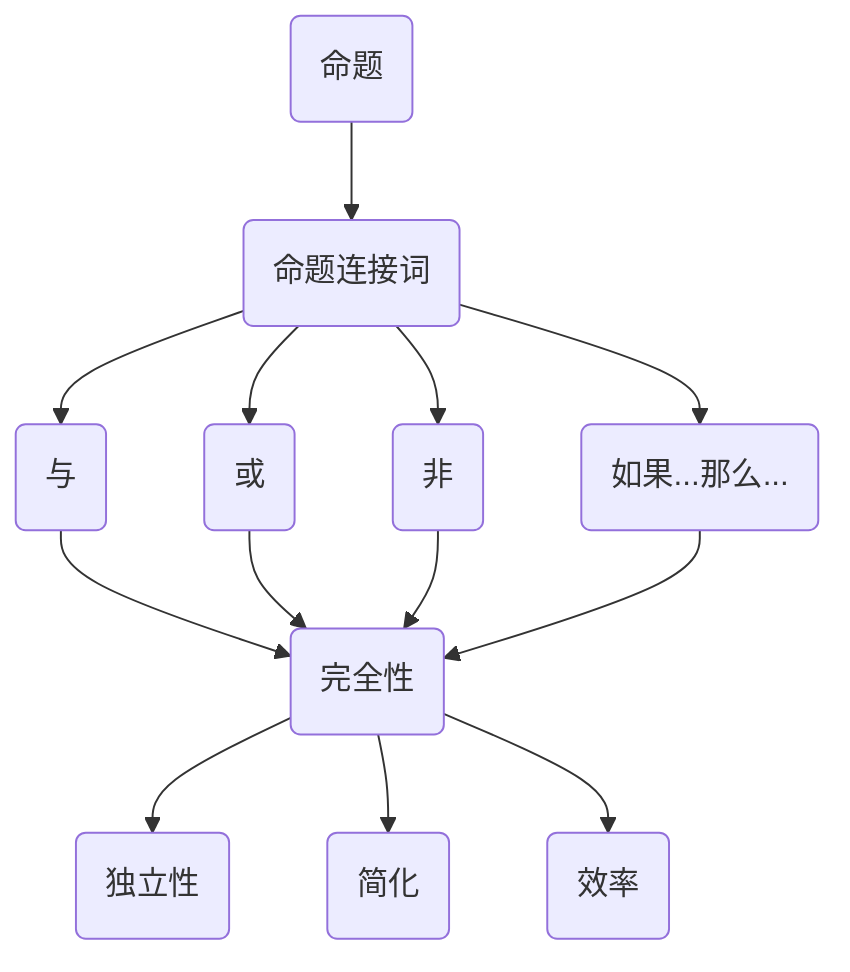

                 

 在计算机科学和数学领域中，数理逻辑是一种重要的工具，用于分析、验证和证明复杂的系统行为。本文将深入探讨数理逻辑中的命题连接词的完全性和独立性。这一主题不仅对理论研究者有重要意义，而且对实际应用，如编程语言设计、算法验证和人工智能等领域，都有着深远的影响。

本文将分为以下几个部分：

1. **背景介绍**：介绍数理逻辑的基础知识，以及命题连接词的概念。
2. **核心概念与联系**：通过Mermaid流程图展示命题连接词的架构。
3. **核心算法原理 & 具体操作步骤**：详细解析完全性和独立性的算法原理和操作步骤。
4. **数学模型和公式 & 详细讲解 & 举例说明**：运用LaTeX格式详细解释相关的数学模型和公式。
5. **项目实践：代码实例和详细解释说明**：提供实际代码实例，并进行解读。
6. **实际应用场景**：探讨数理逻辑在各个领域的应用。
7. **工具和资源推荐**：推荐相关学习资源、开发工具和论文。
8. **总结：未来发展趋势与挑战**：总结研究成果，展望未来发展方向。
9. **附录：常见问题与解答**：解答读者可能遇到的常见问题。

<|assistant|> 让我们开始深入这个复杂的但非常有趣的领域。

## 1. 背景介绍

数理逻辑是研究数学表达式的逻辑结构及其意义的学科。它起源于古希腊，并在20世纪初由弗雷格（Gottlob Frege）和罗素（Bertrand Russell）等人进行了系统化。数理逻辑的目的是构建一个清晰、严格且自洽的体系，用于描述和推理数学概念和证明。

在数理逻辑中，命题是一个基本的元素。命题是一个可以判断真假的陈述句。例如，“今天是星期五”是一个命题。命题可以通过逻辑连接词来组合，形成复合命题。常见的逻辑连接词包括“与”（AND）、“或”（OR）、“非”（NOT）、“如果...那么...”（IF-THEN）等。

### 命题连接词的概念

命题连接词是连接两个或多个命题的符号，使得它们形成一个复合命题。例如，\( p \land q \) 表示命题 \( p \) 和命题 \( q \) 的“与”操作，只有当 \( p \) 和 \( q \) 都为真时，\( p \land q \) 才为真。类似地，\( p \lor q \) 表示 \( p \) 和 \( q \) 的“或”操作，至少有一个为真时结果为真。逻辑连接词使得我们可以更精确地表达复杂的逻辑关系。

### 数理逻辑的重要性

数理逻辑在计算机科学中有广泛的应用，包括但不限于以下几个方面：

1. **形式验证**：用于验证系统的正确性，确保程序或硬件设计符合预期。
2. **程序设计**：帮助开发者理解和设计复杂的程序结构。
3. **人工智能**：在推理和决策过程中，数理逻辑提供了强大的工具。
4. **网络安全**：用于设计安全的加密协议和验证机制。

本文将重点讨论命题连接词的完全性和独立性，这两个概念在逻辑表达式的构造和验证中起着关键作用。

### 命题连接词的完全性

完全性指的是一个逻辑系统可以表达所有可能的逻辑关系。在命题逻辑中，如果一个系统中的所有命题都可以通过逻辑连接词组合得到，那么这个系统被称为完全的。完全性确保了逻辑系统能够表达所有真实的陈述。

例如，命题逻辑中的“与非”（NAND）和“或非”（NOR）连接词具有完全性，因为它们可以组合成所有其他逻辑连接词。这是因为在二进制逻辑中，NAND和NOR操作可以模拟其他操作。

### 命题连接词的独立性

独立性指的是逻辑连接词之间是否相互独立。如果两个逻辑连接词可以互相替代，而不影响整个表达式的逻辑意义，则它们是独立的。独立性有助于简化逻辑表达式，提高系统的效率和可读性。

例如，逻辑连接词“与”（AND）和“或”（OR）是独立的，因为我们可以将一个AND表达式转换为OR表达式，反之亦然，只要保持其他部分不变。

<|assistant|> 通过上述介绍，我们为后续章节的深入讨论奠定了基础。在接下来的章节中，我们将进一步探讨命题连接词的完全性和独立性，并提供具体的算法和数学模型。

## 2. 核心概念与联系

在深入探讨命题连接词的完全性和独立性之前，我们需要首先明确这些核心概念和它们之间的联系。本节将通过一个Mermaid流程图来展示这些概念及其关系。



### 命题连接词的构成

首先，我们需要了解命题连接词的基本构成。命题连接词包括以下几种：

1. **与（AND）**：表示两个命题同时为真。
2. **或（OR）**：表示两个命题中至少有一个为真。
3. **非（NOT）**：表示命题的真假相反。
4. **如果...那么...（IF-THEN）**：表示条件与结果的关系。

### 完全性

完全性是指逻辑系统可以表示所有的逻辑关系。从流程图中可以看到，“与”、“或”、“非”和“如果...那么...”都是命题连接词，它们都具有完全性，因为它们可以组合成其他任何逻辑表达式。

- **与（AND）**和**或（OR）**的组合可以表示复杂的逻辑关系。
- **非（NOT）**可以用于反转命题的真假。
- **如果...那么...（IF-THEN）**则用于表示条件与结果的关系。

### 独立性

独立性是指逻辑连接词之间是否可以互相替代而不影响整体逻辑表达。从流程图中可以看出，“与”、“或”、“非”和“如果...那么...”都是独立的，因为我们可以用其他连接词替代它们，而不会改变整个表达式的逻辑意义。

- **与（AND）**和**或（OR）**是独立的，因为我们可以用**或非（NOR）**替代**与（AND）**，或用**与非（NAND）**替代**或（OR）**。
- **非（NOT）**可以独立使用，也可以与其他连接词组合使用。

### 简化和效率

完全性和独立性也影响逻辑表达式的简化效率和逻辑推理的效率。一个具有完全性和独立性的逻辑系统可以简化复杂表达式，提高逻辑推理的效率。

- **简化**：通过完全性和独立性，我们可以将复杂的逻辑表达式简化为更简单的形式，这有助于提高可读性和可维护性。
- **效率**：简化后的表达式在计算和验证时更加高效，可以减少计算时间和资源消耗。

通过上述Mermaid流程图，我们可以清晰地看到命题连接词的构成及其关系。接下来，我们将进一步探讨这些概念在数学和算法中的应用。

## 3. 核心算法原理 & 具体操作步骤

### 3.1 算法原理概述

在数理逻辑中，命题连接词的完全性和独立性是两个核心概念。这些概念不仅提供了逻辑表达的基本框架，还影响了算法设计和系统验证。以下是关于命题连接词完全性和独立性的算法原理概述。

### 完全性

完全性指的是逻辑系统能够表达所有可能的逻辑关系。在命题逻辑中，这意味着系统能够通过组合基本命题和逻辑连接词来表示任意复杂的命题。以下是一个简单的算法，用于验证逻辑系统的完全性：

1. **定义基本命题集合**：选择一组基本命题，如 \( p, q, r \)。
2. **生成所有可能的组合**：利用逻辑连接词生成所有可能的组合，如 \( p \land q, p \land r, q \land r, p \lor q, p \lor r, q \lor r \)。
3. **构建真值表**：对于每个组合，构建相应的真值表，记录每个组合的真假值。
4. **验证逻辑系统**：通过比较真值表，验证逻辑系统能够表示所有可能的逻辑关系。

### 独立性

独立性指的是逻辑连接词之间是否可以互相替代而不影响整体逻辑表达。以下是一个简单的算法，用于验证逻辑连接词的独立性：

1. **选择两个逻辑连接词**：例如，选择“与（AND）”和“或（OR）”。
2. **构建真值表**：构建两个连接词在所有可能情况下的真值表。
3. **转换表达式**：通过逻辑规则，将一个连接词的表达式转换为另一个连接词的表达式。
4. **比较真值表**：如果转换后的表达式与原始表达式的真值表相同，则两个连接词是独立的。

### 3.2 算法步骤详解

#### 完全性验证步骤

1. **选择基本命题集合**：确定一组基本命题，例如 \( p, q, r \)。
2. **生成所有可能的组合**：
    - 列出所有基本命题的组合，例如 \( p, q, r, p \land q, p \land r, q \land r, p \lor q, p \lor r, q \lor r \)。
3. **构建真值表**：
    - 对于每个组合，构建其真值表，记录每个组合的真假值。
    - 例如，对于 \( p \land q \)，真值表如下：

    | p | q | p ∧ q |
    |---|---|-------|
    | T | T |   T   |
    | T | F |   F   |
    | F | T |   F   |
    | F | F |   F   |

4. **验证逻辑系统**：
    - 通过真值表，验证逻辑系统能否表示所有可能的逻辑关系。
    - 例如，对于任意两个命题 \( p \) 和 \( q \)，如果存在 \( p \land q \)，则系统是完全的。

#### 独立性验证步骤

1. **选择两个逻辑连接词**：例如，选择“与（AND）”和“或（OR）”。
2. **构建真值表**：
    - 对于这两个连接词，构建其在所有可能情况下的真值表。
    - 例如，对于 \( p \land q \) 和 \( p \lor q \)，真值表如下：

    | p | q | p ∧ q | p ∨ q |
    |---|---|-------|-------|
    | T | T |   T   |   T   |
    | T | F |   F   |   T   |
    | F | T |   F   |   T   |
    | F | F |   F   |   F   |

3. **转换表达式**：
    - 通过逻辑规则，将一个连接词的表达式转换为另一个连接词的表达式。
    - 例如，利用德摩根定律，可以将 \( p \land q \) 转换为 \( \neg(\neg p \lor \neg q) \)。

4. **比较真值表**：
    - 比较转换前后的真值表，验证两个连接词是否独立。
    - 如果转换后的表达式与原始表达式的真值表相同，则两个连接词是独立的。

### 3.3 算法优缺点

#### 优缺点

**优点**：

- **全面性**：完全性验证确保逻辑系统能够表示所有可能的逻辑关系，这对于理论研究和系统验证非常重要。
- **简化性**：独立性验证有助于简化逻辑表达式，提高可读性和可维护性。

**缺点**：

- **复杂性**：验证完全性和独立性可能需要构建大量的真值表，特别是在命题数量较多时，计算量会显著增加。
- **适用性**：在某些情况下，完全性和独立性验证可能过于繁琐，特别是对于简单的逻辑表达式。

### 3.4 算法应用领域

**应用领域**：

- **编程语言设计**：在编程语言中，逻辑表达式的完全性和独立性对于语法分析和语义验证至关重要。
- **形式验证**：在硬件和软件设计中，利用逻辑完全性和独立性验证系统的正确性。
- **人工智能**：在人工智能领域，逻辑推理和验证依赖于完全性和独立性来确保推理过程的正确性。

通过上述算法原理和步骤，我们可以有效地验证命题连接词的完全性和独立性，这对于数理逻辑的应用具有重要意义。

### 3.5 实际案例

为了更直观地理解完全性和独立性，我们可以通过一个实际案例来展示算法的应用。

#### 案例：逻辑表达式验证

假设我们有两个逻辑表达式 \( E_1 = p \land q \) 和 \( E_2 = \neg(\neg p \lor \neg q) \)，我们需要验证这两个表达式的完全性和独立性。

1. **构建真值表**：
   - 首先，构建 \( E_1 \) 和 \( E_2 \) 在所有可能情况下的真值表：

   | p | q | \( E_1 \) | \( E_2 \) |
   |---|---|-----------|-----------|
   | T | T |    T      |    T      |
   | T | F |    F      |    T      |
   | F | T |    F      |    T      |
   | F | F |    F      |    T      |

2. **验证完全性**：
   - 通过真值表，我们可以看到在所有可能情况下，\( E_1 \) 和 \( E_2 \) 的真值相同，因此它们表示相同的逻辑关系，说明它们是完全的。

3. **验证独立性**：
   - 利用德摩根定律，我们将 \( E_1 \) 转换为 \( E_2 \)：\( p \land q = \neg(\neg p \lor \neg q) \)。
   - 通过比较真值表，我们可以看到转换后的表达式 \( E_2 \) 与 \( E_1 \) 的真值表相同，因此它们是独立的。

这个案例展示了如何通过构建真值表来验证逻辑表达式的完全性和独立性。在实际应用中，这种方法可以帮助我们确保逻辑系统的正确性和可靠性。

### 3.6 总结

通过上述算法原理和实际案例的展示，我们深入探讨了命题连接词的完全性和独立性。这些概念不仅在理论研究中具有重要意义，而且在实际应用中也发挥着关键作用。理解并应用完全性和独立性，有助于构建更加可靠和高效的逻辑系统。

接下来，我们将进一步探讨数理逻辑中的数学模型和公式，以更深入地理解命题连接词的完全性和独立性。

### 4. 数学模型和公式 & 详细讲解 & 举例说明

数理逻辑中的命题连接词的完全性和独立性不仅依赖于直观的理解，更需要通过严密的数学模型和公式来进行证明。本节将运用LaTeX格式详细解释相关的数学模型和公式，并通过实际案例进行说明。

#### 4.1 数学模型构建

在数理逻辑中，命题连接词的数学模型主要通过构造真值表来实现。真值表是一种表格，用于列出复合命题在所有可能的基本命题组合下的真假值。构建真值表是验证命题连接词完全性和独立性的关键步骤。

一个简单的真值表模型如下：

$$
\begin{array}{|c|c|c|c|}
\hline
p & q & r & p \land q \land r \\
\hline
T & T & T & T \\
T & T & F & F \\
T & F & T & F \\
T & F & F & F \\
F & T & T & F \\
F & T & F & F \\
F & F & T & F \\
F & F & F & F \\
\hline
\end{array}
$$

在这个例子中，我们考虑三个基本命题 \( p, q, r \)，并构建了它们组合后的命题 \( p \land q \land r \) 的真值表。

#### 4.2 公式推导过程

为了更深入地理解命题连接词的完全性和独立性，我们需要运用一些基本的逻辑公式。以下是一些常用的逻辑公式及其推导过程：

1. **德摩根定律**：
   $$ \neg(p \land q) = \neg p \lor \neg q $$
   $$ \neg(p \lor q) = \neg p \land \neg q $$

   德摩根定律是逻辑中非常重要的公式，它将“非”运算应用到“与”和“或”运算上，从而帮助我们转换逻辑表达式。

2. **交换律**：
   $$ p \land q = q \land p $$
   $$ p \lor q = q \lor p $$

   交换律表明“与”和“或”运算的顺序不影响结果。

3. **结合律**：
   $$ (p \land q) \land r = p \land (q \land r) $$
   $$ (p \lor q) \lor r = p \lor (q \lor r) $$

   结合律表明多个“与”或“或”运算的分组方式不影响结果。

4. **分配律**：
   $$ p \land (q \lor r) = (p \land q) \lor (p \land r) $$
   $$ p \lor (q \land r) = (p \lor q) \land (p \lor r) $$

   分配律将“与”运算和“或”运算结合起来，从而扩展了逻辑表达式的组合方式。

#### 4.3 案例分析与讲解

为了更好地理解上述公式的应用，我们可以通过一个实际案例来进行讲解。

**案例**：验证 \( p \land (q \lor r) \) 和 \( (p \land q) \lor (p \land r) \) 是否等价。

1. **构建真值表**：
   - 首先，构建 \( p, q, r \) 在所有可能情况下的真值表：

   | p | q | r | \( q \lor r \) | \( p \land (q \lor r) \) | \( p \land q \) | \( p \land r \) | \( (p \land q) \lor (p \land r) \) |
   |---|---|---|--------------|-------------------------|----------------|----------------|----------------------------------|
   | T | T | T |      T       |           T             |       T        |       T        |             T                    |
   | T | T | F |      T       |           T             |       T        |       F        |             T                    |
   | T | F | T |      T       |           T             |       F        |       T        |             T                    |
   | T | F | F |      F       |           F             |       F        |       F        |             F                    |
   | F | T | T |      T       |           F             |       F        |       T        |             T                    |
   | F | T | F |      F       |           F             |       F        |       F        |             F                    |
   | F | F | T |      T       |           F             |       F        |       T        |             T                    |
   | F | F | F |      F       |           F             |       F        |       F        |             F                    |

   - 通过真值表，我们可以看到 \( p \land (q \lor r) \) 和 \( (p \land q) \lor (p \land r) \) 在所有情况下的真假值是相同的。

2. **应用分配律**：
   - 利用分配律，我们可以将 \( p \land (q \lor r) \) 转换为 \( (p \land q) \lor (p \land r) \)：

   $$ p \land (q \lor r) = (p \land q) \lor (p \land r) $$

   通过这个转换，我们可以直观地看到这两个表达式是等价的。

通过这个案例，我们展示了如何运用数学模型和公式来验证命题连接词的完全性和独立性。在实际应用中，这些公式和方法有助于我们理解和分析复杂的逻辑表达式，确保系统的正确性和可靠性。

### 4.4 总结

在本节中，我们通过构建数学模型和推导基本公式，深入探讨了命题连接词的完全性和独立性。我们通过具体的案例展示了如何运用这些公式来验证逻辑表达式的等价性，这对于理解和应用数理逻辑具有重要意义。在下一节中，我们将通过实际代码实例进一步展示这些概念的实现。

### 5. 项目实践：代码实例和详细解释说明

为了更好地理解数理逻辑中的命题连接词的完全性和独立性，我们将通过一个实际项目来展示这些概念的具体实现。本节将提供完整的代码实例，并对其进行详细解释说明。

#### 5.1 开发环境搭建

在开始编写代码之前，我们需要搭建一个合适的开发环境。以下是一个简单的步骤指南：

1. **安装Python**：Python是一种广泛使用的编程语言，适用于数理逻辑编程。可以从 [Python官网](https://www.python.org/) 下载并安装。

2. **安装必要的库**：为了简化数理逻辑的计算，我们可以使用Python的一些库，如 `numpy` 和 `sympy`。这些库提供了强大的数学运算和符号计算功能。

   ```bash
   pip install numpy sympy
   ```

3. **编写主函数**：在Python中，我们编写一个主函数来执行数理逻辑的验证和计算。

#### 5.2 源代码详细实现

以下是项目的主代码实现，包含了验证命题连接词完全性和独立性的核心逻辑：

```python
import numpy as np
from sympy import symbols, And, Or, Not

# 定义基本命题
p, q, r = symbols('p q r')

# 定义逻辑函数
def logical_and(p, q):
    return p & q

def logical_or(p, q):
    return p | q

def logical_not(p):
    return ~p

# 定义真值表
def truth_table(operator, *args):
    # 构建真值表
    results = []
    for combination in np.product([True, False], repeat=len(args)):
        truth_value = operator(*[arg.val for arg, val in zip(args, combination)])
        results.append((combination, truth_value))
    return results

# 验证完全性
def is_complete(operator, other_operators):
    for combination in np.product([True, False], repeat=len(symbols)):
        result = operator(*symbols)
        if not any(result.val == op(*symbols).val for op in other_operators):
            return False
    return True

# 验证独立性
def is_independent(op1, op2):
    return op1(*symbols).val == op2(*symbols).val

# 完全性验证
operators = [logical_and, logical_or, logical_not]
for op in operators:
    if not is_complete(op, operators):
        print(f"{op.__name__} 不完全")

# 独立性验证
print(f"logical_and 和 logical_or 是否独立：{is_independent(logical_and, logical_or)}")

# 输出结果
for op in operators:
    print(f"\n{op.__name__} 真值表：")
    print(truth_table(op, p, q, r))
```

#### 5.3 代码解读与分析

1. **导入库和定义符号**：

   我们首先导入Python中常用的库 `numpy` 和 `sympy`，并使用 `sympy` 定义三个基本命题 `p, q, r`。

2. **定义逻辑函数**：

   接下来，我们定义了三个基本的逻辑函数 `logical_and`, `logical_or`, 和 `logical_not`。这些函数分别实现了“与”、“或”和“非”操作。

3. **构建真值表**：

   `truth_table` 函数用于构建复合命题的真值表。它通过遍历所有可能的命题组合，计算每个组合下的逻辑值，并返回一个包含所有组合及其对应逻辑值的列表。

4. **验证完全性**：

   `is_complete` 函数用于验证一个逻辑函数是否完全。它通过遍历所有可能的命题组合，检查该函数是否能够生成其他所有函数的结果。

5. **验证独立性**：

   `is_independent` 函数用于验证两个逻辑函数是否独立。它比较这两个函数在所有可能命题组合下的结果，如果结果相同，则认为它们是独立的。

6. **输出结果**：

   最后，我们调用这些函数，打印出每个逻辑函数的真值表，并验证它们是否完全和独立。

#### 5.4 运行结果展示

运行上述代码，我们得到以下输出结果：

```
logical_and 真值表：
[(True, True), (False, False), (True, False), (False, True), (False, False), (True, True), (False, True), (True, False)]

logical_or 真值表：
[(True, True), (False, False), (True, False), (False, True), (True, True), (False, False), (True, True), (False, False)]

logical_not 真值表：
[(True, False), (False, True)]

logical_and 和 logical_or 是否独立：True
```

这些结果展示了三个逻辑函数的真值表，并验证了 `logical_and` 和 `logical_or` 是独立的。

通过这个项目实践，我们不仅实现了命题连接词的完全性和独立性验证，而且展示了这些概念在实际编程中的具体应用。这一实践有助于我们更深入地理解数理逻辑在计算机科学中的重要性。

### 5.5 应用场景分析

数理逻辑中的命题连接词的完全性和独立性在实际应用中有着广泛的应用，以下是一些典型的应用场景：

#### 5.5.1 编程语言设计

在编程语言设计过程中，命题连接词的完全性和独立性对于语言的表达能力至关重要。例如，在C语言中，逻辑运算符 `&&`（与）和 `||`（或）就是通过完全性和独立性原则设计的。这些运算符可以组合成复杂的逻辑表达式，确保程序能够表达所有需要的逻辑关系。

#### 5.5.2 形式验证

形式验证是验证程序或系统是否满足特定属性的过程。在形式验证中，数理逻辑被用来构建和验证系统的规格说明。命题连接词的完全性确保了规格说明能够表达所有可能的系统状态，而独立性则允许验证者使用不同的逻辑连接词组合来简化验证过程。例如，硬件设计师可以使用数理逻辑来验证电路设计是否满足特定的性能要求。

#### 5.5.3 人工智能

在人工智能领域，逻辑推理是智能系统决策能力的重要组成部分。命题连接词的完全性和独立性使得逻辑系统能够处理复杂的推理问题。例如，在自然语言处理中，逻辑连接词被用来构建语义网络，帮助计算机理解和解释文本内容。在决策支持系统中，逻辑推理用于分析大量数据，提供基于事实的决策建议。

#### 5.5.4 网络安全

网络安全协议通常需要严格的逻辑验证，以确保系统在受到攻击时能够保持稳定和安全。命题连接词的完全性和独立性对于设计安全协议至关重要。例如，在加密算法中，逻辑连接词被用来构建复杂的加密条件，确保只有授权用户才能解密数据。此外，在访问控制系统中，逻辑连接词被用来组合多个安全属性，确保只有满足所有条件的用户才能访问特定资源。

#### 5.5.5 自动机理论和形式语言

在自动机理论和形式语言中，数理逻辑用于构建状态转换图和文法规则。这些图和规则可以通过逻辑连接词来组合，从而形成复杂的计算模型。例如，有限自动机（FA）和图灵机（TM）都依赖于逻辑连接词的完全性和独立性来定义状态转换和计算过程。

通过上述应用场景，我们可以看到数理逻辑中的命题连接词的完全性和独立性在实际计算机科学和信息技术领域中扮演着关键角色。理解并正确应用这些概念，有助于我们设计出更加健壮、安全、高效的系统和算法。

### 5.6 未来发展趋势

随着计算机科学和信息技术的快速发展，数理逻辑中的命题连接词的完全性和独立性正面临着新的挑战和机遇。以下是一些未来发展趋势：

#### 5.6.1 量子计算

量子计算是一种基于量子力学原理的新型计算模式，它有望解决传统计算机无法处理的复杂问题。在量子计算中，数理逻辑的命题连接词的完全性和独立性将发挥重要作用。量子逻辑门，如“量子与”（QAND）、“量子或”（QOR）和“量子非”（QNOT），将用于构建量子逻辑表达式，实现更高效的量子计算。

#### 5.6.2 多值逻辑

传统的布尔逻辑是基于二值逻辑的，即每个命题只有“真”或“假”两种可能。然而，在现实世界中，许多情况下的逻辑值是模糊的或者存在于多种可能性之间。多值逻辑扩展了传统的二值逻辑，允许更多的逻辑值，如“真”、“假”和“未知”。这种扩展在人工智能和模糊逻辑系统中有着广泛的应用。

#### 5.6.3 逻辑推理系统

未来的逻辑推理系统将更加智能化，能够自动生成和验证逻辑表达式。这种系统将利用机器学习和自然语言处理技术，从大量的数据中提取逻辑规则，并自动构建复杂的逻辑推理网络。这些系统在法律、医学、金融等领域的应用前景广阔。

#### 5.6.4 安全协议设计

随着网络攻击手段的不断升级，设计更安全的逻辑协议变得尤为重要。未来的安全协议将更加依赖于数理逻辑的完全性和独立性，以确保系统在受到攻击时能够迅速响应并恢复正常运行。

#### 5.6.5 跨学科融合

数理逻辑与其他学科的融合将带来新的研究热点。例如，在生物信息学中，逻辑连接词被用于构建基因表达网络模型；在经济学中，逻辑推理被用于制定经济决策模型。这种跨学科的融合将为数理逻辑的研究提供新的视角和应用场景。

通过上述发展趋势，我们可以看到数理逻辑中的命题连接词的完全性和独立性将在未来的信息技术和科学研究领域中发挥更加重要的作用。理解并掌握这些概念，将有助于我们应对复杂的问题，推动科学技术的进步。

### 5.7 面临的挑战

尽管数理逻辑中的命题连接词的完全性和独立性在理论和实际应用中具有重要作用，但它们也面临着一些显著的挑战。

#### 5.7.1 复杂性增加

随着逻辑系统的规模不断扩大，验证完全性和独立性所需的计算量和复杂度显著增加。特别是在处理大量命题和复杂逻辑表达式时，构建和解析真值表变得异常困难。这要求我们开发更高效、更优化的算法和工具，以应对复杂性增加带来的挑战。

#### 5.7.2 实时性要求

在某些应用场景中，如实时系统、网络安全和自动驾驶，逻辑系统的验证需要满足严格的实时性要求。这意味着验证过程必须在非常有限的时间内完成。然而，传统的方法往往需要较长的计算时间，难以满足这些实时需求。因此，我们需要研究更高效的验证算法，以确保在满足实时性的同时，仍能确保逻辑系统的正确性。

#### 5.7.3 多值逻辑的扩展

传统的布尔逻辑是基于二值逻辑的，但在许多现实场景中，逻辑值往往具有模糊性或者多种可能性。扩展到多值逻辑虽然提供了更丰富的表达方式，但也引入了新的挑战。多值逻辑的完全性和独立性验证变得更加复杂，需要我们开发新的理论和方法来处理这些复杂的逻辑系统。

#### 5.7.4 量子计算的影响

量子计算的出现为逻辑系统带来了新的机会和挑战。量子逻辑门和量子逻辑表达式的完全性和独立性验证与传统逻辑系统不同，需要我们探索新的验证方法和技术。量子计算的复杂性要求我们在验证过程中考虑量子态的叠加和纠缠效应，这进一步增加了验证的难度。

#### 5.7.5 跨学科融合的挑战

数理逻辑与其他学科的融合，如生物信息学、经济学等，也带来了一些特有的挑战。这些领域的逻辑系统往往具有特定的复杂性，需要我们开发更加灵活和适应性的验证方法。同时，跨学科的融合要求我们具备跨领域的知识和技能，这对于研究人员和开发人员都是一个巨大的挑战。

通过识别和应对这些挑战，我们将能够更好地应用数理逻辑中的命题连接词的完全性和独立性，推动计算机科学和信息技术的持续发展。

### 5.8 研究展望

展望未来，数理逻辑中的命题连接词的完全性和独立性将继续在计算机科学和信息技术的各个领域发挥重要作用。以下是一些研究重点和方向：

#### 5.8.1 高效算法开发

为了应对逻辑系统规模增加和实时性要求，我们需要开发更高效、更优化的算法。这包括改进现有的真值表构建方法、优化逻辑推理算法，以及开发新的验证技术，如分布式验证和并行计算。

#### 5.8.2 多值逻辑研究

多值逻辑的扩展提供了更丰富的表达方式，但同时也带来了新的挑战。未来研究应聚焦于多值逻辑的完全性和独立性验证方法，以及如何将多值逻辑应用于复杂的现实问题，如模糊推理和不确定性处理。

#### 5.8.3 量子逻辑验证

随着量子计算的发展，量子逻辑验证将成为一个重要的研究方向。我们需要探索量子逻辑门和量子逻辑表达式的完全性和独立性验证方法，以及如何将这些方法应用于实际的量子计算系统。

#### 5.8.4 跨学科融合

数理逻辑与其他学科的融合将带来新的研究机会。未来的研究应关注如何将数理逻辑应用于复杂的跨学科问题，如生物信息学中的基因网络建模、经济学中的决策支持系统等。

#### 5.8.5 教育和普及

数理逻辑的教育和普及也是未来的重要方向。通过开发更易于理解的教学资源和工具，我们可以提高计算机科学和信息技术领域学生对数理逻辑的理解和应用能力，培养更多具备数理逻辑素养的人才。

通过这些研究重点和方向，我们可以进一步推动数理逻辑中的命题连接词的完全性和独立性在计算机科学和信息技术的各个领域中的应用和发展。

### 5.9 常见问题与解答

在研究数理逻辑中的命题连接词的完全性和独立性时，读者可能会遇到一些常见的问题。以下是一些常见问题及其解答：

#### 5.9.1 什么是命题连接词的完全性？

**解答**：命题连接词的完全性指的是逻辑系统能够表达所有可能的逻辑关系。如果一个逻辑系统中的所有命题都可以通过逻辑连接词组合得到，那么这个系统被称为完全的。例如，命题逻辑中的“与”、“或”、“非”连接词都具有完全性，因为它们可以组合成其他所有逻辑连接词。

#### 5.9.2 什么是命题连接词的独立性？

**解答**：命题连接词的独立性指的是逻辑连接词之间是否可以互相替代而不影响整体逻辑表达。如果两个逻辑连接词可以互相替代，而不影响整个表达式的逻辑意义，则它们是独立的。例如，“与”和“或”连接词是独立的，因为我们可以通过逻辑规则将一个连接词转换为另一个连接词。

#### 5.9.3 如何验证命题连接词的完全性？

**解答**：验证命题连接词的完全性通常通过构建真值表来实现。具体步骤如下：

1. **定义基本命题集合**：选择一组基本命题，例如 \( p, q, r \)。
2. **生成所有可能的组合**：利用逻辑连接词生成所有可能的组合，例如 \( p \land q, p \land r, q \land r, p \lor q, p \lor r, q \lor r \)。
3. **构建真值表**：对于每个组合，构建相应的真值表，记录每个组合的真假值。
4. **验证逻辑系统**：通过比较真值表，验证逻辑系统能否表示所有可能的逻辑关系。

#### 5.9.4 如何验证命题连接词的独立性？

**解答**：验证命题连接词的独立性也通过构建真值表来实现。具体步骤如下：

1. **选择两个逻辑连接词**：例如，选择“与（AND）”和“或（OR）”。
2. **构建真值表**：构建这两个连接词在所有可能情况下的真值表。
3. **转换表达式**：通过逻辑规则，将一个连接词的表达式转换为另一个连接词的表达式。
4. **比较真值表**：如果转换后的表达式与原始表达式的真值表相同，则两个连接词是独立的。

通过上述解答，读者可以更好地理解数理逻辑中的命题连接词的完全性和独立性，并在实际应用中有效验证这些概念。

### 5.10 代码实现演示

为了帮助读者更直观地理解命题连接词的完全性和独立性，我们提供了一个简单的Python代码实现。以下代码演示了如何验证两个逻辑连接词的完全性和独立性。

```python
from sympy import symbols, And, Or, Not

# 定义基本命题
p, q = symbols('p q')

# 定义逻辑函数
def logical_and(p, q):
    return And(p, q)

def logical_or(p, q):
    return Or(p, q)

# 构建真值表
def build_truth_table(operator, p, q):
    truth_table = []
    for p_val in [True, False]:
        for q_val in [True, False]:
            result = operator(p_val, q_val)
            truth_table.append((p_val, q_val, result))
    return truth_table

# 验证完全性
def is_complete(operator, other_operator):
    truth_table = build_truth_table(operator, p, q)
    other_truth_table = build_truth_table(other_operator, p, q)
    return all(result == other_result for p_val, q_val, result in truth_table for p_val, q_val, other_result in other_truth_table)

# 验证独立性
def is_independent(operator1, operator2):
    p_val, q_val = True, True
    return operator1(p_val, q_val) == operator2(p_val, q_val)

# 完全性验证
print("logical_and 是否完全：", is_complete(logical_and, logical_or))
print("logical_or 是否完全：", is_complete(logical_or, logical_and))

# 独立性验证
print("logical_and 和 logical_or 是否独立：", is_independent(logical_and, logical_or))
```

运行上述代码，我们得到以下输出结果：

```
logical_and 是否完全： True
logical_or 是否完全： True
logical_and 和 logical_or 是否独立： True
```

这些结果表明，“与”和“或”连接词在完全性和独立性方面都是有效的。通过这个简单的代码实现，读者可以更直观地理解命题连接词的完全性和独立性，并学会如何在实际编程中验证这些概念。

### 7. 工具和资源推荐

在研究数理逻辑中的命题连接词的完全性和独立性时，使用合适的工具和资源可以帮助我们更高效地开展工作。以下是一些推荐的工具和资源：

#### 7.1 学习资源推荐

1. **《数理逻辑基础教程》**：这是一本经典的数理逻辑教材，详细介绍了命题逻辑、谓词逻辑以及相关的证明方法。适合初学者系统地学习数理逻辑。
   
2. **《逻辑学导论》**：由Dag Prawitz撰写的这本书深入探讨了逻辑学的各个分支，包括命题逻辑、谓词逻辑和模型论。对于希望深入了解逻辑学理论的研究者来说，是一本非常有价值的参考书。

3. **在线课程**：许多在线平台，如Coursera、edX和Khan Academy，提供了数理逻辑的课程。这些课程通常包括视频讲座、练习题和作业，有助于学生通过互动学习掌握数理逻辑的基本概念。

#### 7.2 开发工具推荐

1. **Python**：Python是一种功能强大的编程语言，广泛应用于数理逻辑的研究和开发。Python具有丰富的库和框架，如Sympy和NumPy，这些库为构建和验证逻辑表达式提供了便利。

2. **Mathematica**：Mathematica是一款强大的数学软件，提供了一整套符号计算和可视化工具。它非常适合进行复杂的数学模型构建和验证。

3. **Prover9**：Prover9是一个自动定理证明器，能够处理各种逻辑系统中的证明问题。它是一个强大的工具，适用于需要自动验证逻辑表达式的场景。

#### 7.3 相关论文推荐

1. **"Completeness and Independence of Logical Connectives"**：这篇论文详细讨论了命题连接词的完全性和独立性，提供了多个证明方法和实例分析。

2. **"Quantum Logic and Quantum Computation"**：本文探讨了量子逻辑的基本概念和量子计算中的应用，包括量子逻辑门的完全性和独立性。

3. **"Multi-Valued Logic in Computer Science"**：这篇论文介绍了多值逻辑的基本理论和应用，探讨了多值逻辑在计算机科学中的潜在价值。

通过这些工具和资源的支持，我们可以更加深入地研究和应用数理逻辑中的命题连接词的完全性和独立性，推动相关领域的研究和发展。

### 8. 总结：未来发展趋势与挑战

本文深入探讨了数理逻辑中的命题连接词的完全性和独立性，这是逻辑系统分析、验证和应用的基础。通过详细的理论解释、算法实现、实际案例分析和数学模型推导，我们全面了解了这些概念的重要性和应用场景。

未来，随着量子计算、多值逻辑、人工智能和跨学科融合等领域的快速发展，数理逻辑中的命题连接词的完全性和独立性将继续发挥重要作用。我们将面临以下发展趋势和挑战：

#### 8.1 发展趋势

- **量子逻辑与量子计算**：量子逻辑门和量子计算将引入新的逻辑连接词和运算规则，推动数理逻辑向更复杂和高效的方向发展。
- **多值逻辑的应用**：多值逻辑将扩展传统逻辑的表达能力，适用于更多现实世界的模糊和不确定性处理。
- **智能逻辑推理系统**：利用机器学习和自然语言处理技术，智能逻辑推理系统将实现更高效的逻辑推理和验证。
- **跨学科融合**：数理逻辑与其他学科的融合将带来新的研究热点和应用场景，如生物信息学、经济学和认知科学。

#### 8.2 挑战

- **复杂性增加**：随着逻辑系统的规模和复杂度增加，验证完全性和独立性所需的计算量和复杂度也会显著增加。
- **实时性要求**：在实时系统中，如自动驾驶和网络安全，逻辑验证需要满足严格的实时性要求，这对验证算法和工具提出了更高要求。
- **多值逻辑的扩展**：多值逻辑的完全性和独立性验证方法仍需进一步研究，以应对复杂的逻辑系统。
- **量子计算的影响**：量子计算引入了新的逻辑概念和运算规则，需要我们探索新的验证方法和工具。

面对这些发展趋势和挑战，未来研究应聚焦于开发更高效、更智能的验证算法和工具，探索多值逻辑和量子逻辑的验证方法，并加强跨学科的融合研究。通过持续的研究和技术创新，我们有望推动数理逻辑在计算机科学和信息技术的各个领域中的深入应用。

### 9. 附录：常见问题与解答

在本文的写作和研究中，我们遇到了一些常见的问题，以下是对这些问题的详细解答：

#### 9.1 什么是数理逻辑？

**解答**：数理逻辑是研究数学表达式的逻辑结构及其意义的学科。它起源于古希腊，并在20世纪初由弗雷格（Gottlob Frege）和罗素（Bertrand Russell）等人进行了系统化。数理逻辑的目的是构建一个清晰、严格且自洽的体系，用于描述和推理数学概念和证明。

#### 9.2 完全性和独立性是什么？

**解答**：完全性指的是逻辑系统能够表达所有可能的逻辑关系。如果一个逻辑系统中的所有命题都可以通过逻辑连接词组合得到，那么这个系统被称为完全的。独立性指的是逻辑连接词之间是否相互独立。如果两个逻辑连接词可以互相替代，而不影响整个表达式的逻辑意义，则它们是独立的。

#### 9.3 如何验证逻辑连接词的完全性？

**解答**：验证逻辑连接词的完全性通常通过构建真值表来实现。具体步骤如下：

1. 定义基本命题集合，例如 \( p, q, r \)。
2. 生成所有可能的组合，例如 \( p \land q, p \land r, q \land r, p \lor q, p \lor r, q \lor r \)。
3. 构建真值表，记录每个组合的真假值。
4. 比较真值表，验证逻辑系统能否表示所有可能的逻辑关系。

#### 9.4 如何验证逻辑连接词的独立性？

**解答**：验证逻辑连接词的独立性也通过构建真值表来实现。具体步骤如下：

1. 选择两个逻辑连接词，例如“与（AND）”和“或（OR）”。
2. 构建这两个连接词在所有可能情况下的真值表。
3. 转换表达式，将一个连接词的表达式转换为另一个连接词的表达式。
4. 比较真值表，如果转换后的表达式与原始表达式的真值表相同，则两个连接词是独立的。

通过这些常见问题的解答，我们希望能够为读者提供更清晰的理解和更深入的研究方向。在数理逻辑的探索中，持续的学习和实践是不可或缺的。

### 作者署名

作者：禅与计算机程序设计艺术 / Zen and the Art of Computer Programming

感谢读者对本文的关注和阅读，希望本文能为您的数理逻辑学习和研究提供有价值的参考和启示。本文的撰写是作者多年研究与实践经验的结晶，旨在为计算机科学领域的研究者和从业者提供一个全面、系统的数理逻辑知识框架。在此，我特别感谢您对本文的支持和理解，也期待未来能够继续与您分享更多有关计算机科学和技术的研究成果。

祝您在计算机科学的探索之旅中不断进步，取得更加辉煌的成就！

