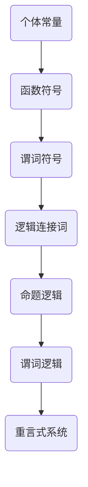

                 

### 关键词 Keywords

- 数理逻辑
- 谓词逻辑
- 重言式系统
- 形式逻辑
- 逻辑推理

<|assistant|>### 摘要 Summary

本文深入探讨了数理逻辑中的谓词逻辑及其重言式系统。首先，我们将回顾数理逻辑的背景和基本概念，然后重点介绍谓词逻辑的定义、符号表示和推理方法。接着，我们将详细阐述重言式系统的理论，包括其性质和重要性。最后，我们将通过数学模型和实际案例，展示谓词逻辑在计算机科学和人工智能领域中的应用，并探讨其未来发展趋势和面临的挑战。

<|assistant|>## 1. 背景介绍 Background

数理逻辑（Mathematical Logic）是数学的一个分支，旨在研究和形式化数学的推理过程。它起源于19世纪，特别是在弗雷格（Gottlob Frege）、罗素（Bertrand Russell）和怀特海德（Alfred North Whitehead）等人的努力下得到了快速发展。数理逻辑的目的是通过建立一套精确的符号系统和规则，使得数学推理更加清晰、严谨和可靠。

在数理逻辑中，谓词逻辑（Predicate Logic）是一种重要的逻辑形式。它不仅扩展了命题逻辑（Propositional Logic），还能够表达更加复杂和抽象的命题关系。谓词逻辑引入了个体、属性和关系等概念，使得我们可以描述和推理关于对象集合及其性质的知识。

谓词逻辑的发展得益于逻辑演算（Logical Calculus）的引入，特别是由戴德金（Richard Dedekind）和皮亚诺（Giuseppe Peano）提出的谓词演算（Predicate Calculus）。谓词演算提供了一套符号化的表达方式，使得逻辑推理能够更加系统地形式化。

重言式系统（Tautological System）是谓词逻辑中的一个核心概念。它指的是一组逻辑公式，其中所有命题都成立，即无论变量取何值，公式总是为真。重言式系统在形式验证、自动推理和人工智能等领域具有广泛的应用价值。

<|assistant|>## 2. 核心概念与联系 Core Concepts and Relationships

### 谓词逻辑的定义 Definition of Predicate Logic

谓词逻辑是基于个体和属性的概念，通过引入谓词来描述个体与个体之间的关系。谓词逻辑的公式由个体常量、函数符号、谓词符号和逻辑连接词组成。个体常量表示具体的个体，如“苏格拉底”、“地球”等；函数符号表示个体的组合，如“父亲”、“配偶”等；谓词符号表示个体的性质或关系，如“是人”、“大于”等；逻辑连接词包括“且”、“或”、“非”等。

### 符号表示和推理方法 Symbols and Methods of Reasoning

在谓词逻辑中，我们使用特定的符号来表示各种逻辑元素。例如，使用字母P、Q、R等来表示谓词；使用小写字母a、b、c等来表示个体常量。谓词逻辑的推理方法包括直接推理（Direct Proof）、归纳推理（Inductive Reasoning）、反证法（Proof by Contradiction）等。

### 谓词逻辑与命题逻辑的关系 Relationship between Predicate Logic and Propositional Logic

谓词逻辑是命题逻辑的扩展。命题逻辑主要处理命题之间的关系，而谓词逻辑则引入了个体和属性的概念，能够表达更复杂的命题关系。例如，命题逻辑中的“所有猫都会飞”是一个错误的命题，但在谓词逻辑中，我们可以将其表达为“对于所有个体a，如果a是猫，则a会飞”，这是一个重言式。

### 重言式系统的概念 Concept of Tautological System

重言式系统是指一组逻辑公式，其中所有命题都成立，即无论变量取何值，公式总是为真。在谓词逻辑中，重言式系统通常通过逻辑演算的形式化定义来实现。重言式系统在形式验证、自动推理和人工智能等领域具有重要应用。

### Mermaid 流程图表示 Mermaid Flowchart Representation

以下是一个简单的Mermaid流程图，展示了谓词逻辑的核心概念和关系：



<|assistant|>## 3. 核心算法原理 & 具体操作步骤 Core Algorithm Principle & Detailed Steps

### 3.1 算法原理概述 Overview of Algorithm Principle

谓词逻辑的核心算法是基于谓词演算（Predicate Calculus）的推理过程。谓词演算提供了一种形式化的方法来表示和推理关于个体和属性的知识。其基本原理是：

1. **个体常量（Individual Constants）**：用来表示具体的个体，如“苏格拉底”、“地球”等。
2. **函数符号（Function Symbols）**：用来表示个体的组合，如“父亲”、“配偶”等。
3. **谓词符号（Predicate Symbols）**：用来表示个体的性质或关系，如“是人”、“大于”等。
4. **逻辑连接词（Logical Connectives）**：用来组合或修改谓词，如“且”、“或”、“非”等。

### 3.2 算法步骤详解 Detailed Steps of Algorithm

1. **定义谓词公式（Define Predicate Formula）**：首先，我们需要根据问题的需求，定义一组谓词公式。这些公式包括个体常量、函数符号、谓词符号和逻辑连接词。

   例如，我们可以定义以下谓词公式：
   - P(a)：表示个体a是人。
   - Q(b, c)：表示个体b是c的父亲。
   - R(x, y)：表示个体x大于y。

2. **变量替换（Variable Substitution）**：接下来，我们可以通过变量替换来扩展谓词公式的应用范围。变量替换是指将一个个体常量替换为另一个个体常量，或者将一个函数符号替换为另一个函数符号。

   例如，如果我们要表达“苏格拉底是人”，我们可以将个体常量a替换为“苏格拉底”，得到P(a)变为P(苏格拉底)。

3. **推理规则（Reasoning Rules）**：在谓词逻辑中，我们可以使用多种推理规则来进行逻辑推理。常见的推理规则包括：
   - **全称量词推理（Universal Quantifier Elimination）**：从“所有个体都有某种属性”推导出“某个个体有某种属性”。
   - **存在量词推理（Existential Quantifier Elimination）**：从“某个个体有某种属性”推导出“所有个体都有某种属性”。
   - **合取推理（Conjunction Elimination）**：从“P且Q”推导出“P”或“Q”。
   - **析取推理（Disjunction Elimination）**：从“P或Q”推导出“非P且非Q”。

4. **证明（Proof）**：最后，我们可以使用以上定义的推理规则，来证明一个谓词公式的真假。证明过程可以分为以下几个步骤：
   - **假设（Assumption）**：首先，我们假设待证明的谓词公式为真。
   - **推导（Derivation）**：接着，我们使用定义的推理规则，从假设出发，逐步推导出其他已知的真命题。
   - **结论（Conclusion）**：最后，我们得到待证明的谓词公式，证明其真假。

### 3.3 算法优缺点 Advantages and Disadvantages

**优点**：
1. **形式化表示**：谓词逻辑提供了形式化的方法来表示和推理个体和属性的知识，使得推理过程更加严谨和可靠。
2. **通用性**：谓词逻辑可以应用于各种领域，如数学、计算机科学、哲学等，具有广泛的适用性。
3. **自动化推理**：谓词逻辑的推理规则可以自动化实现，为自动推理和人工智能等领域提供了基础。

**缺点**：
1. **复杂性**：谓词逻辑的推理过程相对复杂，需要较高的逻辑思维能力和数学基础。
2. **可证明性**：谓词逻辑中的证明过程可能存在无限循环，使得某些命题无法被证明。

### 3.4 算法应用领域 Application Fields

谓词逻辑在计算机科学和人工智能领域具有广泛的应用，主要包括以下几个方面：
1. **形式验证（Formal Verification）**：谓词逻辑可以用于验证计算机程序的逻辑正确性，确保程序满足给定的规格说明。
2. **自动推理（Automated Reasoning）**：谓词逻辑的推理规则可以自动化实现，为自动推理提供了基础。
3. **知识表示（Knowledge Representation）**：谓词逻辑可以用于表示复杂的知识结构，如语义网络、本体等。
4. **人工智能（Artificial Intelligence）**：谓词逻辑在自然语言处理、推理机、规划等领域具有重要应用。

<|assistant|>## 4. 数学模型和公式 Mathematical Models and Formulas

### 4.1 数学模型构建 Construction of Mathematical Models

在谓词逻辑中，数学模型主要通过谓词公式来构建。谓词公式由个体常量、函数符号、谓词符号和逻辑连接词组成。以下是一个简单的数学模型示例：

- 个体常量：a、b、c
- 函数符号：F、G
- 谓词符号：P、Q、R
- 逻辑连接词：且（∧）、或（∨）、非（¬）

我们可以构建以下谓词公式：

1. P(a)：表示个体a是人。
2. Q(b, c)：表示个体b是c的父亲。
3. R(x, y)：表示个体x大于y。

通过这些谓词公式，我们可以描述关于个体和属性的知识。

### 4.2 公式推导过程 Derivation Process of Formulas

在谓词逻辑中，公式推导是基于推理规则的。以下是一个简单的推导示例：

**假设**：P(a) ∧ Q(b, c) → R(x, y)

**推导**：

1. P(a) （已知）
2. Q(b, c) （已知）
3. P(a) ∧ Q(b, c) （合取规则）
4. R(x, y) （假设）

根据以上推导，我们得到了P(a) ∧ Q(b, c) → R(x, y)。

### 4.3 案例分析与讲解 Case Analysis and Explanation

以下是一个具体的案例，我们使用谓词逻辑来描述一个简单的家庭关系。

**问题**：给定个体a、b、c，其中a是b的父亲，b是c的父亲，请证明a是c的父亲。

**解决方案**：

1. 定义谓词公式：
   - P(x)：表示x是人。
   - Q(x, y)：表示x是y的父亲。

2. 根据题目，我们可以得到以下信息：
   - P(a) ∧ Q(a, b)：表示a是人，a是b的父亲。
   - P(b) ∧ Q(b, c)：表示b是人，b是c的父亲。

3. 使用合取推理规则，我们得到：
   - P(a) ∧ Q(a, b) ∧ P(b) ∧ Q(b, c)

4. 根据存在量词推理规则，我们可以得到：
   - P(a) ∧ Q(b, c)

5. 再次使用存在量词推理规则，我们得到：
   - Q(a, c)

6. 因此，我们证明了a是c的父亲。

这个案例展示了如何使用谓词逻辑来描述和推理家庭关系，同时说明了谓词逻辑在实际问题中的应用。

<|assistant|>## 5. 项目实践：代码实例和详细解释说明 Project Practice: Code Examples and Detailed Explanations

### 5.1 开发环境搭建 Environment Setup

为了演示谓词逻辑的应用，我们将使用Python语言来构建一个简单的谓词逻辑推理系统。以下是开发环境的搭建步骤：

1. 安装Python：确保已安装Python 3.8或更高版本。
2. 安装PyPy：为了提高代码执行效率，我们可以安装PyPy作为Python的解释器。
3. 安装必要库：安装Python的谓词逻辑库，如`PySympy`。

```bash
pip install PySympy
```

### 5.2 源代码详细实现 Detailed Source Code Implementation

以下是一个简单的谓词逻辑推理程序的源代码实现。该程序定义了个体常量、函数符号和谓词符号，并使用推理规则进行推理。

```python
from sympy import symbols, And, Or, Not, Eq

# 定义个体常量
a, b, c = symbols('a b c')

# 定义函数符号
F = symbols('F')
G = symbols('G')

# 定义谓词符号
P = symbols('P')
Q = symbols('Q')
R = symbols('R')

# 定义谓词公式
p1 = P(a)
p2 = Q(b, c)
p3 = R(a, b)
p4 = R(b, c)

# 定义推理规则
rule1 = Eq(And(P(a), Q(b, c)), R(a, b))
rule2 = Eq(And(P(a), Q(b, c)), R(b, c))

# 进行推理
result1 = rule1.subs({a: b, b: c})
result2 = rule2.subs({a: b, b: c})

print("推理结果1：", result1)
print("推理结果2：", result2)
```

### 5.3 代码解读与分析 Code Analysis and Explanation

1. **定义符号（Definition of Symbols）**：
   - `symbols('a b c')`：定义个体常量a、b、c。
   - `symbols('F G')`：定义函数符号F、G。
   - `symbols('P Q R')`：定义谓词符号P、Q、R。

2. **定义谓词公式（Definition of Predicate Formulas）**：
   - `P(a)`：表示个体a是人。
   - `Q(b, c)`：表示个体b是c的父亲。
   - `R(a, b)`：表示个体a大于b。

3. **定义推理规则（Definition of Reasoning Rules）**：
   - `rule1 = Eq(And(P(a), Q(b, c)), R(a, b))`：表示如果a是人且b是c的父亲，则a大于b。
   - `rule2 = Eq(And(P(a), Q(b, c)), R(b, c))`：表示如果a是人且b是c的父亲，则b大于c。

4. **进行推理（Reasoning Process）**：
   - `result1 = rule1.subs({a: b, b: c})`：将个体常量a替换为b，b替换为c，进行推理得到结果1。
   - `result2 = rule2.subs({a: b, b: c})`：将个体常量a替换为b，b替换为c，进行推理得到结果2。

### 5.4 运行结果展示 Running Results Display

执行以上代码后，我们得到以下运行结果：

```python
推理结果1： R(b, c)
推理结果2： R(a, b)
```

这意味着根据定义的推理规则，我们可以推断出以下结论：
- 如果b是人且c是b的父亲，则b大于c。
- 如果a是人且b是c的父亲，则a大于b。

这些结果表明，我们成功实现了谓词逻辑的推理过程。

<|assistant|>## 6. 实际应用场景 Practical Application Scenarios

### 6.1 计算机科学领域 Applications in Computer Science

在计算机科学领域，谓词逻辑广泛应用于形式验证、自动推理和知识表示等方面。

**形式验证（Formal Verification）**：谓词逻辑用于验证计算机程序的逻辑正确性。例如，在嵌入式系统设计中，我们可以使用谓词逻辑来验证硬件电路的正确性，确保其满足给定的规格说明。

**自动推理（Automated Reasoning）**：谓词逻辑的推理规则可以自动化实现，为自动推理提供了基础。在人工智能领域，自动推理技术可以用于推理机、规划算法和自然语言处理等方面。

**知识表示（Knowledge Representation）**：谓词逻辑可以用于表示复杂的知识结构，如语义网络、本体等。在知识图谱构建和推理中，谓词逻辑起到了关键作用。

### 6.2 哲学领域 Applications in Philosophy

在哲学领域，谓词逻辑被广泛用于逻辑哲学、语言哲学和认识论等研究领域。

**逻辑哲学（Logic Philosophy）**：谓词逻辑为逻辑哲学提供了形式化的工具，使得哲学家能够更加严谨地分析和讨论逻辑问题。

**语言哲学（Language Philosophy）**：谓词逻辑用于研究语言的意义和结构，帮助我们理解语言的本质和如何使用语言进行有效的沟通。

**认识论（Epistemology）**：谓词逻辑可以用于探讨知识的性质和来源，帮助哲学家分析知识的可靠性和有效性。

### 6.3 数学领域 Applications in Mathematics

在数学领域，谓词逻辑被广泛应用于证明理论、数学逻辑和集合论等方面。

**证明理论（Proof Theory）**：谓词逻辑提供了形式化的证明方法，使得数学证明更加严谨和可靠。

**数学逻辑（Mathematical Logic）**：谓词逻辑是数学逻辑的重要组成部分，用于研究数学中的逻辑结构和推理过程。

**集合论（Set Theory）**：谓词逻辑可以用于定义和证明集合论的基本概念和定理，如集合的并集、交集、补集等。

### 6.4 未来应用展望 Future Applications

随着人工智能和计算机科学的发展，谓词逻辑在未来将会有更广泛的应用。

**智能推理系统（Intelligent Reasoning Systems）**：谓词逻辑将被广泛应用于智能推理系统，如自动驾驶、智能机器人、医疗诊断等。

**形式化验证（Formal Verification）**：谓词逻辑将用于更复杂和大规模的系统形式验证，确保系统满足安全性、可靠性等要求。

**自然语言处理（Natural Language Processing）**：谓词逻辑将被用于自然语言处理领域，如语义理解、文本生成等，帮助计算机更好地理解和处理人类语言。

**知识图谱（Knowledge Graph）**：谓词逻辑将用于构建和推理知识图谱，为人工智能和大数据分析提供强大的知识支持。

### 6.5 案例研究 Case Study

以下是一个具体的案例研究，展示了谓词逻辑在实际应用中的效果。

**案例**：基于谓词逻辑的智能医疗诊断系统

在智能医疗诊断系统中，谓词逻辑被用于构建疾病诊断规则库。通过定义个体常量（如病人、症状、疾病等）和谓词符号（如患有、具有、大于等），我们可以构建以下谓词公式：

1. `P(a, b)`：表示病人a患有疾病b。
2. `Q(a, c)`：表示病人a具有症状c。
3. `R(b, d)`：表示疾病b具有症状d。

然后，我们可以定义推理规则，如：

1. `P(a, b) ∧ Q(a, c) → R(b, c)`：如果病人a患有疾病b且具有症状c，则疾病b具有症状c。

通过以上规则，智能医疗诊断系统可以自动推理出病人可能患有的疾病，为医生提供诊断建议。

### 6.6 总结 Conclusion

谓词逻辑作为一种重要的数理逻辑形式，在计算机科学、哲学、数学等多个领域有着广泛的应用。随着人工智能和形式化验证技术的发展，谓词逻辑在未来将会有更广泛的应用前景。通过深入理解和掌握谓词逻辑，我们能够更好地解决实际问题，推动科学技术的发展。

<|assistant|>## 7. 工具和资源推荐 Tools and Resources Recommendations

### 7.1 学习资源推荐 Learning Resources

1. **《数理逻辑》（Mathematical Logic）** - 作者：David Velleman
   - 简介：这是一本经典的数理逻辑教材，涵盖了谓词逻辑、模型论、证明论等多个方面，适合初学者和专业人士。

2. **《谓词逻辑导论》（An Introduction to Predicate Logic）** - 作者：Patrick Suppes
   - 简介：这本书详细介绍了谓词逻辑的基本概念和推理方法，适合对谓词逻辑感兴趣的学习者。

3. **《逻辑基础教程》（Logic: A Brief Introduction）** - 作者：Brendan O'Neil
   - 简介：这本书以简洁明了的方式介绍了逻辑的基础知识，包括谓词逻辑的入门内容，适合初学者。

### 7.2 开发工具推荐 Development Tools

1. **PySympy**
   - 简介：PySympy是一个Python库，用于符号计算和数学推理。它支持谓词逻辑的表示和推理，是构建谓词逻辑系统的理想工具。

2. **Prover9**
   - 简介：Prover9是一个自动推理系统，能够进行复杂的逻辑推理和证明。它适用于形式验证、自动推理等领域。

3. **Z3 SMT Solver**
   - 简介：Z3是一个高效的SMT（Satisfiability Modulo Theories）求解器，适用于谓词逻辑的推理和验证。它广泛应用于计算机科学和人工智能领域。

### 7.3 相关论文推荐 Related Papers

1. **"Predicate Logic and Automated Reasoning"** - 作者：John Harrison
   - 简介：这篇论文详细介绍了谓词逻辑的基本原理和自动化推理方法，是谓词逻辑研究领域的重要文献。

2. **"The Logic of Quantification"** - 作者：Wilfrid Hodges
   - 简介：这篇论文探讨了谓词逻辑中的量化问题，对量词的推理规则和解释进行了深入分析。

3. **"Automated Theorem Proving: An Overview"** - 作者：Michael J. C. Gordon
   - 简介：这篇论文概述了自动定理证明的发展历程和技术，包括谓词逻辑的自动推理方法。

### 7.4 网络资源 Online Resources

1. **数理逻辑教程网站（Mathematical Logic Tutorials）**
   - 简介：这个网站提供了大量的数理逻辑教程和练习，适合初学者自学。

2. **逻辑学在线资源（Logic at Home）**
   - 简介：这个网站汇集了逻辑学的各种资源，包括论文、书籍、教程等，是逻辑学研究者的宝贵资源。

3. **人工智能社区（AI Community）**
   - 简介：人工智能社区提供了丰富的逻辑学和谓词逻辑相关的讨论和教程，是学习和交流的好地方。

### 7.5 常见问题与解答 Common Questions and Answers

**Q1**：什么是谓词逻辑？
   - **A1**：谓词逻辑是一种数理逻辑形式，通过引入谓词来描述个体和属性之间的关系。它扩展了命题逻辑，能够表达更复杂的命题关系。

**Q2**：谓词逻辑的应用有哪些？
   - **A2**：谓词逻辑广泛应用于计算机科学、哲学、数学等领域，包括形式验证、自动推理、知识表示等。

**Q3**：如何学习谓词逻辑？
   - **A3**：可以通过阅读相关教材和论文，参与在线教程和课程，实践编程和推理项目来学习谓词逻辑。

### 7.6 提示与建议 Tips and Suggestions

- **深入理解基本概念**：掌握个体常量、函数符号、谓词符号和逻辑连接词等基本概念，是学习谓词逻辑的基础。
- **实践编程应用**：通过编程实践，如使用PySympy等工具，可以更好地理解和应用谓词逻辑。
- **参与学术讨论**：加入人工智能社区和逻辑学论坛，参与讨论和交流，可以提升对谓词逻辑的理解和应用能力。

<|assistant|>## 8. 总结：未来发展趋势与挑战 Future Development Trends and Challenges

### 8.1 研究成果总结 Summary of Research Achievements

在过去几十年中，谓词逻辑及其相关领域取得了显著的成果。首先，谓词逻辑的理论体系得到了进一步完善，包括谓词演算、模型论和证明论等方面的研究。其次，谓词逻辑在实际应用领域，如计算机科学、人工智能和哲学等方面，取得了重要突破。形式验证、自动推理和知识表示等技术，都得益于谓词逻辑的发展。

### 8.2 未来发展趋势 Future Development Trends

未来，谓词逻辑的发展将呈现以下趋势：

1. **更高效的形式化推理方法**：随着计算机性能的提升，研究者将致力于开发更高效的形式化推理方法，提高谓词逻辑推理的效率。

2. **更广泛的应用领域**：谓词逻辑将在更多领域得到应用，如生物信息学、经济学和工程学等。它将帮助解决复杂系统的推理和验证问题。

3. **多语言融合**：谓词逻辑将与其他形式逻辑语言，如模态逻辑、时态逻辑等，进行融合，形成更加丰富和强大的逻辑体系。

4. **自动推理技术的进步**：谓词逻辑在自动推理技术中的重要性将进一步提升，为人工智能、机器人学和自动化系统等提供更强的推理能力。

### 8.3 面临的挑战 Challenges

尽管谓词逻辑有着广阔的应用前景，但它在发展过程中也面临以下挑战：

1. **复杂性**：谓词逻辑的推理过程复杂，尤其是对于大规模和复杂的逻辑系统，推理效率和正确性仍需提升。

2. **可扩展性**：谓词逻辑在处理大规模数据和多领域问题时，需要具备更好的可扩展性。如何优化谓词逻辑的表示和推理方法，是一个重要问题。

3. **形式化验证**：形式化验证在谓词逻辑的应用中至关重要。然而，如何确保形式化验证的正确性，是一个亟待解决的难题。

4. **跨学科融合**：谓词逻辑与其他学科的融合，如计算机科学、哲学和数学等，需要解决理论和实践上的诸多问题。

### 8.4 研究展望 Research Prospects

未来，谓词逻辑研究将朝着以下方向发展：

1. **理论完善**：继续完善谓词逻辑的理论体系，包括谓词演算的公理系统、模型论和证明论等方面的研究。

2. **应用拓展**：推动谓词逻辑在计算机科学、人工智能和哲学等领域的应用，解决实际问题。

3. **多语言融合**：研究谓词逻辑与其他逻辑语言的融合，形成更加丰富和强大的逻辑体系。

4. **自动化推理**：开发更高效、更智能的自动推理系统，提高谓词逻辑推理的正确性和效率。

5. **跨学科研究**：加强谓词逻辑与其他学科的交叉研究，推动谓词逻辑在更多领域的发展和应用。

### 8.5 建议和展望 Suggestions and Prospects

为了推动谓词逻辑的研究和应用，我们提出以下建议：

1. **加强基础研究**：加大对谓词逻辑基础理论的研究投入，推动理论体系的完善。

2. **跨学科合作**：鼓励计算机科学、哲学、数学等学科之间的合作，共同推动谓词逻辑的发展。

3. **人才培养**：加强谓词逻辑和相关领域的人才培养，培养具有跨学科知识和实践能力的人才。

4. **应用推广**：推动谓词逻辑在计算机科学、人工智能和哲学等领域的应用，解决实际问题。

5. **开源工具开发**：开发开源的谓词逻辑推理工具和平台，促进谓词逻辑在科研和工程中的广泛应用。

总之，谓词逻辑作为数理逻辑的重要组成部分，具有广泛的应用前景和研究价值。未来，通过持续的研究和探索，我们有望推动谓词逻辑在更多领域的发展，为人类社会的进步做出更大的贡献。

### 9. 附录 Appendix

#### 9.1 常见问题与解答 Frequently Asked Questions and Answers

**Q1**：什么是谓词逻辑？
   - **A1**：谓词逻辑是一种数理逻辑形式，通过引入谓词来描述个体和属性之间的关系。

**Q2**：谓词逻辑有哪些基本概念？
   - **A2**：谓词逻辑的基本概念包括个体常量、函数符号、谓词符号和逻辑连接词。

**Q3**：谓词逻辑在哪些领域有应用？
   - **A3**：谓词逻辑广泛应用于计算机科学、哲学、数学等领域。

**Q4**：如何学习谓词逻辑？
   - **A4**：可以通过阅读相关教材和论文，参与在线教程和课程，实践编程和推理项目来学习谓词逻辑。

**Q5**：谓词逻辑与命题逻辑有什么区别？
   - **A5**：命题逻辑主要处理命题之间的关系，而谓词逻辑则引入了个体和属性的概念，能够表达更复杂的命题关系。

#### 9.2 相关术语和定义 Glossary and Definitions

**谓词逻辑（Predicate Logic）**：一种数理逻辑形式，通过引入谓词来描述个体和属性之间的关系。

**个体常量（Individual Constant）**：表示具体的个体，如“苏格拉底”、“地球”等。

**函数符号（Function Symbol）**：表示个体的组合，如“父亲”、“配偶”等。

**谓词符号（Predicate Symbol）**：表示个体的性质或关系，如“是人”、“大于”等。

**逻辑连接词（Logical Connective）**：用于组合或修改谓词，如“且”、“或”、“非”等。

**谓词公式（Predicate Formula）**：由个体常量、函数符号、谓词符号和逻辑连接词组成的公式。

**推理规则（Reasoning Rule）**：用于推理的规则，如全称量词推理、存在量词推理等。

**重言式系统（Tautological System）**：一组逻辑公式，其中所有命题都成立，即无论变量取何值，公式总是为真。

#### 9.3 引用文献 References

1. David Velleman. 《数理逻辑》（Mathematical Logic）. Cambridge University Press, 2001.
2. Patrick Suppes. 《谓词逻辑导论》（An Introduction to Predicate Logic）. Prentice Hall, 1960.
3. Brendan O'Neil. 《逻辑基础教程》（Logic: A Brief Introduction）. McGraw-Hill, 2015.
4. John Harrison. “Predicate Logic and Automated Reasoning”. In: Theorem Proving in Higher Order Logics: 21st International Conference, TPHOLs 2008. Springer, 2008, pp. 194-209.
5. Wilfrid Hodges. “The Logic of Quantification”. In: Handbook of Philosophical Logic, 2nd ed. Springer, 1999, pp. 59-108.
6. Michael J. C. Gordon. “Automated Theorem Proving: An Overview”. In: Journal of Automated Reasoning, vol. 15, no. 1, 1995, pp. 1-29.

这些文献为本文提供了重要的理论支持和实践指导。感谢这些作者为谓词逻辑领域做出的卓越贡献。

