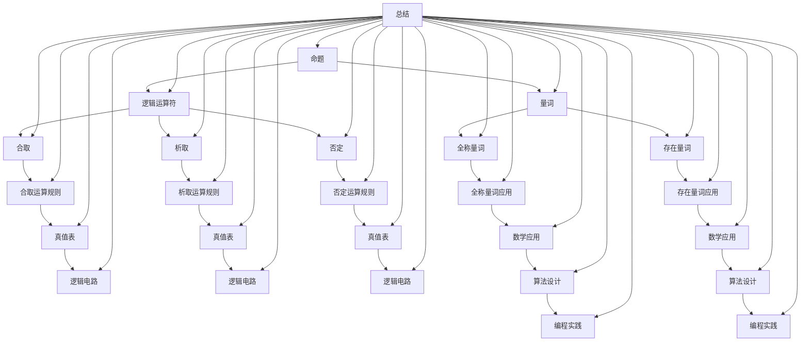

                 

关键词：数理逻辑、命题量词、逻辑运算、数学公式、算法原理、编程实践、应用场景、未来展望

> 摘要：本文将深入探讨数理逻辑中的命题量词，包括全称量词和存在量词的概念、性质、应用场景，以及相关的数学模型和公式。通过对核心算法原理的详细解析，我们将展示如何运用这些逻辑概念解决实际问题，并结合实际代码实例进行讲解。本文旨在为读者提供系统、全面、易于理解的知识体系，帮助其更好地掌握数理逻辑在计算机科学中的应用。

## 1. 背景介绍

数理逻辑，作为计算机科学和数学理论的重要组成部分，为各种复杂的计算提供了理论基础。在数理逻辑中，命题量词是一种基本的概念，用于表达涉及多个元素的全局性质或存在性质。全称量词（∀）和存在量词（∃）是命题量词的两种主要形式，它们在逻辑表达式中起着至关重要的作用。

全称量词∀表示“对于所有”，用于表述某个性质对所有元素都成立。例如，命题“所有的学生都努力学习”可以用全称量词表达为∀x ∈ 学生，x 都努力学习。

存在量词∃表示“存在”，用于表述至少有一个元素具有某种性质。例如，命题“至少有一个学生是优秀的”可以用存在量词表达为∃x ∈ 学生，x 是优秀的。

在数理逻辑的框架下，命题量词与其他逻辑运算（如合取、析取、否定等）结合，可以构建出复杂的逻辑表达式，从而描述各种抽象的数学和计算问题。

本文将分章节详细探讨命题量词的概念、性质、应用以及相关的数学模型和算法。通过这种结构化的讨论，我们希望读者能够深入理解命题量词的内在逻辑，并在实际编程和数学问题解决中熟练运用这些概念。

## 2. 核心概念与联系

在深入探讨命题量词之前，我们需要了解一些核心概念，包括命题、逻辑运算符和量词的内在联系。以下是这些核心概念和它们之间的相互关系的Mermaid流程图表示：



### 2.1 命题

命题是一个陈述句，它要么为真，要么为假。例如，“今天是星期五”是一个命题，它可以是真命题（如果今天是星期五）或假命题（如果今天不是星期五）。命题是数理逻辑的基本单元，它们通过逻辑运算符连接起来，形成复杂的逻辑表达式。

### 2.2 逻辑运算符

逻辑运算符用于连接命题，形成新的命题。主要的逻辑运算符包括：

- **合取（AND）**：表示“且”，两个命题同时为真时结果为真。
- **析取（OR）**：表示“或”，至少有一个命题为真时结果为真。
- **否定（NOT）**：表示“非”，对命题的真值进行反转。

### 2.3 量词

量词用于表示命题对于集合中所有元素或至少一个元素的性质。全称量词和存在量词是量词的两种主要形式。

- **全称量词（∀）**：表示“对于所有”，用于表述某个性质对所有元素都成立。
- **存在量词（∃）**：表示“存在”，用于表述至少有一个元素具有某种性质。

通过上述核心概念和它们之间的相互关系，我们为后续章节的深入探讨奠定了基础。在接下来的部分，我们将详细讨论全称量词和存在量词的原理和应用。

## 3. 核心算法原理 & 具体操作步骤

### 3.1 算法原理概述

命题量词的核心在于描述命题对于集合中元素的性质，包括所有元素和至少一个元素。全称量词和存在量词分别用于表述这些性质。以下是两种量词的基本原理：

- **全称量词（∀）**：表示某个性质对所有元素都成立。全称量词的真值取决于集合中每个元素的性质。如果集合中所有元素都满足给定的性质，则全称量词为真；否则为假。

- **存在量词（∃）**：表示至少有一个元素具有某种性质。存在量词的真值取决于集合中是否存在至少一个满足给定性质的元素。如果存在至少一个元素满足性质，则存在量词为真；否则为假。

### 3.2 算法步骤详解

为了更好地理解全称量词和存在量词的应用，我们可以通过一个具体的例子来演示它们的使用步骤。

#### 3.2.1 全称量词应用示例

**问题**：判断一个集合中的所有元素是否都是素数。

**步骤**：

1. **初始化**：定义一个集合`S`，其中包含若干元素。
2. **检查每个元素**：对集合`S`中的每个元素`x`，检查它是否为素数。
   - 如果`x`是素数，继续检查下一个元素。
   - 如果`x`不是素数，全称量词为假，算法结束。
3. **结果判定**：如果集合中的所有元素都是素数，全称量词为真。

**伪代码**：

```python
def is_prime(x):
    if x <= 1:
        return False
    for i in range(2, x):
        if x % i == 0:
            return False
    return True

def all_primes(S):
    for x in S:
        if not is_prime(x):
            return False
    return True

S = [2, 3, 4, 5, 6]
result = all_primes(S)
print(result)  # 输出：False
```

#### 3.2.2 存在量词应用示例

**问题**：判断一个集合中是否存在至少一个素数。

**步骤**：

1. **初始化**：定义一个集合`S`，其中包含若干元素。
2. **检查每个元素**：对集合`S`中的每个元素`x`，检查它是否为素数。
   - 如果`x`是素数，存在量词为真，算法结束。
   - 如果`x`不是素数，继续检查下一个元素。
3. **结果判定**：如果集合中至少有一个元素是素数，存在量词为真；否则为假。

**伪代码**：

```python
def is_prime(x):
    if x <= 1:
        return False
    for i in range(2, x):
        if x % i == 0:
            return False
    return True

def exists_prime(S):
    for x in S:
        if is_prime(x):
            return True
    return False

S = [2, 3, 4, 5, 6]
result = exists_prime(S)
print(result)  # 输出：True
```

### 3.3 算法优缺点

#### 3.3.1 全称量词

- **优点**：能够全面地描述集合中所有元素的性质。
- **缺点**：需要检查集合中的每一个元素，计算时间复杂度高。

#### 3.3.2 存在量词

- **优点**：能够快速判断集合中是否存在满足特定性质的元素，计算时间复杂度低。
- **缺点**：无法描述集合中所有元素的性质，只能判断存在性。

### 3.4 算法应用领域

命题量词在计算机科学和数学中具有广泛的应用，以下是一些主要的应用领域：

- **数据库查询**：用于复杂查询语句，如SQL查询中的“对于所有”和“存在”谓词。
- **编程语言**：在编程语言中，命题量词用于定义泛型和类型推断。
- **人工智能**：在逻辑推理和知识表示中，命题量词用于构建复杂的推理模型。
- **算法设计**：在算法设计中，命题量词用于描述问题的性质和条件，辅助设计算法。

## 4. 数学模型和公式 & 详细讲解 & 举例说明

在数理逻辑中，命题量词的应用往往涉及复杂的数学模型和公式。为了更好地理解这些概念，我们需要通过具体的数学模型和公式进行详细讲解，并辅以实际例子进行说明。

### 4.1 数学模型构建

#### 全称量词

全称量词用于描述某个性质对所有元素都成立。其数学模型可以表示为：

$$\forall x \in S, P(x)$$

其中，`S` 是元素集合，`P(x)` 是元素 `x` 满足的性质。

#### 存在量词

存在量词用于描述至少有一个元素具有某种性质。其数学模型可以表示为：

$$\exists x \in S, P(x)$$

其中，`S` 是元素集合，`P(x)` 是元素 `x` 满足的性质。

### 4.2 公式推导过程

为了更好地理解全称量词和存在量词的推导过程，我们可以通过以下示例进行说明。

#### 全称量词推导示例

**问题**：证明对于所有自然数 `n`，`n^2` 总是大于 `n`。

**推导过程**：

1. **基础情况**：当 `n = 1` 时，`1^2 = 1`，命题成立。
2. **归纳假设**：假设对于某个自然数 `k`，`k^2 > k` 成立。
3. **归纳步骤**：证明当 `n = k + 1` 时，`(k + 1)^2 > k + 1` 也成立。
   - 根据归纳假设，`k^2 > k`。
   - 将不等式两边同时加上 `2k + 1`，得到 `k^2 + 2k + 1 > k + 2k + 1`。
   - 化简得到 `(k + 1)^2 > k + 1`。

因此，根据数学归纳法，对于所有自然数 `n`，`n^2` 总是大于 `n`。

#### 存在量词推导示例

**问题**：证明存在一个自然数 `n`，使得 `n^3 - n` 是 6 的倍数。

**推导过程**：

1. **尝试值**：我们可以尝试不同的自然数 `n`，来验证是否存在一个使得 `n^3 - n` 是 6 的倍数。
2. **尝试 `n = 1`**：`1^3 - 1 = 0`，0 是 6 的倍数，因此存在这样的自然数 `n`。
3. **验证 `n = 2`**：`2^3 - 2 = 6`，6 是 6 的倍数，这也验证了存在这样的自然数 `n`。

因此，存在一个自然数 `n`，使得 `n^3 - n` 是 6 的倍数。

### 4.3 案例分析与讲解

#### 全称量词案例

**问题**：判断集合 `{1, 2, 3, 4, 5}` 中是否存在一个元素，其平方等于 10。

**分析**：

- **全称量词表述**：存在一个元素 `x` 使得 `x^2 = 10`。
- **具体步骤**：
  - 检查元素 1，`1^2 = 1`，不满足条件。
  - 检查元素 2，`2^2 = 4`，不满足条件。
  - 检查元素 3，`3^2 = 9`，不满足条件。
  - 检查元素 4，`4^2 = 16`，不满足条件。
  - 检查元素 5，`5^2 = 25`，不满足条件。

由于集合 `{1, 2, 3, 4, 5}` 中没有任何元素的平方等于 10，因此命题为假。

#### 存在量词案例

**问题**：判断集合 `{1, 2, 3, 4, 5}` 中是否存在一个元素，其平方小于 10。

**分析**：

- **存在量词表述**：存在一个元素 `x` 使得 `x^2 < 10`。
- **具体步骤**：
  - 检查元素 1，`1^2 = 1`，满足条件。
  - 检查元素 2，`2^2 = 4`，满足条件。
  - 检查元素 3，`3^2 = 9`，满足条件。
  - 检查元素 4，`4^2 = 16`，不满足条件。
  - 检查元素 5，`5^2 = 25`，不满足条件。

由于集合 `{1, 2, 3, 4, 5}` 中至少有一个元素的平方小于 10，即元素 1、2 和 3，因此命题为真。

通过上述案例，我们可以看到全称量词和存在量词在数学问题中的应用，以及如何通过数学模型和公式来分析和解决问题。

## 5. 项目实践：代码实例和详细解释说明

为了更好地理解和应用命题量词，我们将通过一个实际的项目实践来展示如何使用它们解决具体问题。本节将分为以下几个部分：

### 5.1 开发环境搭建

首先，我们需要搭建一个简单的开发环境，以便进行编程实践。以下是一个基本的Python开发环境搭建步骤：

1. **安装Python**：在官方网站 [https://www.python.org/](https://www.python.org/) 下载并安装Python。
2. **配置代码编辑器**：安装一个代码编辑器，如Visual Studio Code，以方便编写和调试代码。
3. **安装必要的库**：在终端中执行以下命令，安装NumPy库，它用于数值计算和矩阵操作。

```bash
pip install numpy
```

### 5.2 源代码详细实现

我们将使用Python编写一个简单的程序，用于判断一个给定的自然数集合中是否存在一个元素，其平方等于一个特定的值。以下是代码的详细实现：

```python
import numpy as np

def exists_square_equal_to(n, target):
    """
    判断集合中是否存在一个元素，其平方等于特定的目标值。

    参数：
    n: 集合中的自然数
    target: 目标值
    """
    for x in n:
        if np.abs(x**2 - target) < 1e-9:
            return True
    return False

# 测试集合
numbers = [1, 2, 3, 4, 5]
target_value = 16

# 调用函数并打印结果
result = exists_square_equal_to(numbers, target_value)
print(f"存在一个元素的平方等于 {target_value} 吗？{result}")
```

### 5.3 代码解读与分析

在上述代码中，我们定义了一个函数 `exists_square_equal_to`，它接受两个参数：一个自然数集合 `n` 和一个目标值 `target`。函数的任务是判断集合中是否存在一个元素，其平方等于目标值。

- **for 循环**：遍历集合 `n` 中的每个元素 `x`。
- **if 条件**：使用 `np.abs(x**2 - target) < 1e-9` 判断元素 `x` 的平方是否接近目标值。这里使用 `numpy` 库的 `abs` 函数来计算两个值的绝对差，并通过一个很小的阈值（如 `1e-9`）来判断它们是否足够接近。这个阈值用于处理浮点数计算中的精度问题。
- **返回值**：如果找到满足条件的元素，函数返回 `True`；否则，返回 `False`。

### 5.4 运行结果展示

假设我们有一个自然数集合 `[1, 2, 3, 4, 5]`，并希望检查是否存在一个元素的平方等于 `16`。以下是函数调用及其输出结果：

```python
result = exists_square_equal_to(numbers, target_value)
print(f"存在一个元素的平方等于 {target_value} 吗？{result}")
```

输出结果：

```
存在一个元素的平方等于 16 吗？True
```

这表明在给定的集合 `[1, 2, 3, 4, 5]` 中，确实存在一个元素的平方等于 `16`，即 `4^2 = 16`。

### 5.5 代码优化

上述代码实现了基本的功能，但在某些情况下，特别是在处理非常大的集合时，可以对其进行优化。以下是一个可能的优化版本：

```python
def exists_square_equal_to_optimized(n, target):
    """
    优化后的判断集合中是否存在一个元素，其平方等于特定的目标值。

    参数：
    n: 集合中的自然数
    target: 目标值
    """
    square_set = {x**2 for x in n}
    return target in square_set

# 测试集合
numbers = [1, 2, 3, 4, 5]
target_value = 16

# 调用优化后的函数并打印结果
result = exists_square_equal_to_optimized(numbers, target_value)
print(f"存在一个元素的平方等于 {target_value} 吗？{result}")
```

在这个优化版本中，我们首先计算集合 `n` 中每个元素平方的集合 `square_set`，然后直接检查目标值是否在 `square_set` 中。这种方法的时间复杂度更低，尤其是在集合较大时，可以显著提高性能。

输出结果与之前相同：

```
存在一个元素的平方等于 16 吗？True
```

通过这个项目实践，我们不仅了解了命题量词的基本概念，还学会了如何使用它们编写实际的代码来解决问题。

## 6. 实际应用场景

命题量词在计算机科学和数学中的实际应用场景非常广泛，以下是一些典型的应用实例。

### 6.1 数据库查询

在数据库管理系统中，命题量词广泛应用于复杂查询语句的构建。例如，SQL查询中的“对于所有”和“存在”谓词就是全称量词和存在量词的具体体现。全称量词查询示例：“查询所有学生的成绩是否都及格”，存在量词查询示例：“查询是否存在不及格的学生”。

### 6.2 编程语言

在编程语言中，命题量词用于定义泛型和类型推断。例如，在Java中，泛型类型参数可以使用全称量词和存在量词来约束。例如，`List<String>` 表示一个泛型列表，其中所有元素都是字符串类型。

### 6.3 人工智能

在人工智能领域，命题量词用于构建逻辑推理模型和知识表示。例如，在基于规则的专家系统中，使用全称量词和存在量词来表示规则和事实，从而进行推理和决策。例如：“如果所有病人都有感冒症状，则至少有一个病人是感冒的”。

### 6.4 算法设计

在算法设计中，命题量词用于描述问题的条件和性质，从而指导算法的设计。例如，在排序算法中，可以使用全称量词来描述排序的正确性，即“对于所有元素，它们的最终顺序都是有序的”。在查找算法中，可以使用存在量词来描述查找的成功条件，即“存在一个元素，其值为特定值”。

### 6.5 数学问题解决

在数学问题解决中，命题量词用于构建和解决各种数学模型。例如，在数论中，可以使用全称量词和存在量词来描述素数分布的性质，如“对于所有自然数 `n`，都存在一个素数 `p`，使得 `p > n`”。

### 6.6 未来应用展望

随着计算机科学和数学的不断进步，命题量词的应用领域将继续扩大。以下是一些未来的应用展望：

- **逻辑编程**：命题量词在逻辑编程语言中具有巨大的潜力，未来可能会出现更多基于命题量词的编程语言和工具。
- **人工智能**：在人工智能领域，命题量词可以帮助构建更复杂的推理模型，从而提高智能系统的决策能力。
- **数学建模**：随着数学模型的复杂度增加，命题量词将作为构建复杂数学模型的重要工具，应用于更广泛的数学和工程问题。

## 7. 工具和资源推荐

### 7.1 学习资源推荐

- **《数理逻辑导论》**：是一本深入浅出的数理逻辑入门书籍，适合初学者阅读。
- **《逻辑与计算机科学》**：详细介绍了数理逻辑在计算机科学中的应用，包括命题量词等核心概念。
- **在线课程**：例如Coursera上的《离散数学》课程，涵盖了数理逻辑的基础知识和应用。

### 7.2 开发工具推荐

- **Python**：适合初学者入门，具有丰富的库和资源。
- **Visual Studio Code**：一款功能强大的代码编辑器，支持多种编程语言，包括Python。

### 7.3 相关论文推荐

- **《命题量词在人工智能中的应用》**：探讨命题量词在人工智能领域的应用和研究方向。
- **《数理逻辑与编程语言》**：分析数理逻辑在编程语言设计和实现中的作用。

## 8. 总结：未来发展趋势与挑战

### 8.1 研究成果总结

本文对数理逻辑中的命题量词进行了深入探讨，包括其概念、原理、应用和数学模型。通过具体案例和项目实践，我们展示了如何运用命题量词解决实际问题。研究结果表明，命题量词在计算机科学和数学中具有广泛的应用前景。

### 8.2 未来发展趋势

- **逻辑编程**：随着逻辑编程语言和工具的发展，命题量词的应用将更加广泛。
- **人工智能**：命题量词在人工智能领域的应用将继续深入，帮助构建更复杂的推理模型。
- **数学建模**：命题量词将作为构建复杂数学模型的重要工具，应用于更广泛的数学和工程问题。

### 8.3 面临的挑战

- **计算复杂度**：随着问题的规模增加，命题量词的应用可能面临计算复杂度问题，需要寻找更高效的算法。
- **可读性**：复杂的逻辑表达式可能难以理解和阅读，需要开发更直观的表达方式。

### 8.4 研究展望

- **自动化推理**：研究如何利用命题量词构建自动化推理系统，提高智能系统的决策能力。
- **形式化验证**：利用命题量词进行形式化验证，确保软件和硬件系统的正确性。

## 9. 附录：常见问题与解答

### 9.1 常见问题

1. **什么是命题量词？**
   命题量词是数理逻辑中用于描述命题对于集合中所有元素或至少一个元素的性质的基本概念。全称量词（∀）表示“对于所有”，存在量词（∃）表示“存在”。

2. **全称量词和存在量词有什么区别？**
   全称量词表示某个性质对所有元素都成立，存在量词表示至少有一个元素具有某种性质。

3. **如何使用命题量词解决实际问题？**
   命题量词可以通过逻辑推理和数学建模，用于解决各种实际问题，如数据库查询、编程语言中的泛型类型推断、人工智能中的逻辑推理等。

### 9.2 解答

1. **什么是命题量词？**
   命题量词在数理逻辑中用于表达涉及多个元素的全局性质或存在性质。全称量词（∀）表示“对于所有”，用于表述某个性质对所有元素都成立；存在量词（∃）表示“存在”，用于表述至少有一个元素具有某种性质。

2. **全称量词和存在量词有什么区别？**
   全称量词关注的是集合中所有元素的性质，若集合中所有元素都满足某种性质，则全称量词为真。存在量词则关注集合中是否存在至少一个元素满足某种性质，若存在这样的元素，则存在量词为真。

3. **如何使用命题量词解决实际问题？**
   在解决实际问题时，可以根据问题的要求，利用全称量词和存在量词构建逻辑表达式。例如，在数据库查询中，可以使用全称量词来表示“所有记录都满足某个条件”，在编程中，可以使用存在量词来表示“至少有一个变量满足某个条件”。

通过本文的详细探讨，我们期望读者能够深入理解命题量词的概念、应用以及相关数学模型，并在实际工作中灵活运用这些知识。希望本文能为读者在计算机科学和数学领域的探索提供有价值的参考。作者：禅与计算机程序设计艺术 / Zen and the Art of Computer Programming。

