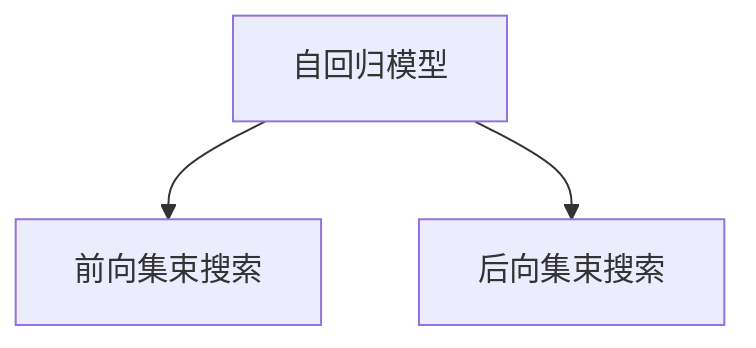

                 

在当今的计算机科学领域中，文本生成技术取得了显著的进展，这主要得益于深度学习和自然语言处理（NLP）的快速发展。自回归（Autoregressive）模型作为文本生成的主要方法之一，已经在各个应用领域中得到了广泛的应用。本文将详细介绍一种在自回归模型中引入的优化策略——集束搜索（Bundle Search），以及它在文本生成中的应用。

> 关键词：文本生成、自回归模型、集束搜索、优化策略、自然语言处理

> 摘要：本文首先对文本生成技术进行了背景介绍，然后详细阐述了自回归模型的基本原理。在此基础上，本文重点介绍了集束搜索在文本生成中的应用，分析了其原理和优势，并通过具体的实例展示了集束搜索在实际应用中的效果。最后，本文探讨了集束搜索在未来的应用前景，以及可能面临的挑战。

## 1. 背景介绍

随着互联网和大数据技术的发展，文本生成技术在许多领域都得到了广泛的应用，如自动写作、机器翻译、对话系统等。在这些应用中，生成的高质量文本往往对用户体验产生重要影响。因此，如何生成高质量的文本成为了研究的热点问题。

自回归模型是一种经典的文本生成方法，它通过预测当前字符的概率来生成序列。自回归模型的主要优点是结构简单、易于实现，并且在许多文本生成任务中取得了较好的效果。然而，传统的自回归模型也存在一些问题，如生成文本的多样性不足、长序列生成困难等。

为了解决这些问题，研究人员提出了一系列优化策略，其中集束搜索是一种有效的优化方法。集束搜索通过在一个搜索空间中寻找最优路径，提高了文本生成的质量和效率。本文将详细介绍集束搜索在文本生成中的应用，以及其与自回归模型的结合方式。

## 2. 核心概念与联系

### 2.1 自回归模型

自回归模型是一种基于序列建模的模型，它可以预测序列中下一个字符的概率。自回归模型的核心思想是将当前字符与历史字符关联起来，通过历史字符的状态来预测当前字符。

在自回归模型中，通常使用一个神经网络来表示模型的概率分布。输入是一个前一个字符的嵌入向量，输出是当前字符的概率分布。训练自回归模型的过程就是学习这个神经网络的参数，使得模型能够预测出下一个字符。

### 2.2 集束搜索

集束搜索是一种启发式搜索算法，它通过在一个搜索空间中寻找最优路径来解决问题。在文本生成任务中，搜索空间通常是一个巨大的字符串集合，每个字符串都是一个可能的文本生成结果。

集束搜索的基本思想是，在搜索过程中，只保留一部分具有较高概率的字符串，然后对这些字符串进行进一步的搜索。这样，通过逐步缩小搜索空间，集束搜索可以在较短的时间内找到最优解。

### 2.3 自回归与集束搜索的结合

将集束搜索与自回归模型结合，可以有效地解决自回归模型在文本生成中存在的问题。具体来说，集束搜索可以通过以下两种方式与自回归模型结合：

1. **前向集束搜索**：在生成文本的过程中，每次只生成一个字符，然后使用集束搜索来选择下一个字符。这种方法的主要优点是生成文本的多样性较高，但搜索空间较大，计算成本较高。

2. **后向集束搜索**：在生成文本的过程中，每次生成一个字符序列，然后使用集束搜索来选择最优的字符序列。这种方法的主要优点是计算成本较低，但生成文本的多样性可能较低。

图1展示了自回归模型与集束搜索的结合方式。



## 3. 核心算法原理 & 具体操作步骤

### 3.1 算法原理概述

集束搜索在文本生成中的应用主要基于概率模型。在自回归模型中，每个字符的概率分布是通过神经网络预测得到的。集束搜索则通过在一个搜索空间中寻找最优路径，提高了文本生成的质量和效率。

集束搜索的基本原理如下：

1. **初始化**：在生成文本的初始阶段，随机选择一个字符串作为初始字符序列。

2. **搜索过程**：在每次搜索中，计算当前字符序列的概率分布，然后使用集束搜索算法在搜索空间中选择下一个字符。选择标准可以是概率最大、或者通过某种策略（如贪心策略）选择。

3. **更新搜索空间**：在选择下一个字符后，将搜索空间更新为包含当前字符序列的所有可能扩展。这个过程可以通过动态规划来实现。

4. **终止条件**：当达到某个终止条件时（如生成文本的长度达到预设值，或者搜索空间中的字符序列数量达到预设值），算法终止，输出最优的字符序列。

### 3.2 算法步骤详解

下面是集束搜索在文本生成中的具体操作步骤：

1. **初始化**：

   - 随机生成一个长度为 `k` 的字符序列作为初始序列。
   - 初始化搜索空间为包含当前序列的所有可能扩展。

2. **搜索过程**：

   - 对于当前搜索空间中的每个字符序列，计算其概率分布。
   - 使用集束搜索算法在搜索空间中选择下一个字符序列。
   - 根据选择的字符序列更新搜索空间。

3. **更新搜索空间**：

   - 对于当前搜索空间中的每个字符序列，生成其所有可能的扩展序列。
   - 根据扩展序列的概率分布，更新搜索空间。

4. **终止条件**：

   - 当生成文本的长度达到预设值，或者搜索空间中的字符序列数量达到预设值时，算法终止。

### 3.3 算法优缺点

集束搜索在文本生成中的优缺点如下：

**优点**：

- 提高了文本生成的质量和效率。
- 生成文本的多样性较高。

**缺点**：

- 搜索空间较大，计算成本较高。
- 需要选择合适的搜索策略，否则可能陷入局部最优。

### 3.4 算法应用领域

集束搜索在文本生成中的应用非常广泛，主要包括：

- 自动写作：如新闻写作、博客文章等。
- 机器翻译：如中英翻译、日英翻译等。
- 对话系统：如客服机器人、智能助手等。

## 4. 数学模型和公式

### 4.1 数学模型构建

集束搜索在文本生成中的数学模型主要基于概率模型。具体来说，每个字符的概率分布可以通过神经网络预测得到。

设 `x` 为输入的字符序列，`y` 为输出的字符序列，`P(y|x)` 为字符序列 `y` 给定输入 `x` 的概率。在自回归模型中，`P(y|x)` 可以表示为：

$$
P(y|x) = \prod_{i=1}^{n} P(y_i|x_{<i})
$$

其中，`y_i` 为第 `i` 个输出的字符，`x_{<i}` 为前 `i-1` 个输入字符。

### 4.2 公式推导过程

为了推导集束搜索的公式，我们需要先了解集束搜索的基本原理。集束搜索的核心思想是通过在一个搜索空间中寻找最优路径来解决问题。

设 `S` 为搜索空间，`s` 为当前搜索节点，`S_{next}` 为包含当前搜索节点 `s` 的搜索子空间。在每次搜索中，我们需要计算当前搜索节点的概率分布，并使用集束搜索算法选择下一个搜索节点。

假设当前搜索节点 `s` 的概率分布为 `P(s)`，则下一个搜索节点 `s_{next}` 的概率分布可以表示为：

$$
P(s_{next}) = \sum_{s' \in S_{next}} P(s'|s) \cdot P(s)
$$

其中，`P(s'|s)` 为从当前搜索节点 `s` 到下一个搜索节点 `s_{next}` 的概率，`P(s)` 为当前搜索节点的概率。

### 4.3 案例分析与讲解

为了更好地理解集束搜索在文本生成中的应用，我们来看一个具体的例子。

假设我们要生成一个长度为 `n` 的文本，且每个字符只能从 `a`、`b`、`c` 三个字符中选择。在生成文本的初始阶段，我们随机选择一个字符作为初始序列。

在第一次搜索中，我们计算当前搜索节点的概率分布，并使用集束搜索算法选择下一个字符。假设当前搜索节点的概率分布为：

$$
P(s) = [0.4, 0.3, 0.3]
$$

则下一个字符的选择概率分布为：

$$
P(s_{next}) = \sum_{s' \in S_{next}} P(s'|s) \cdot P(s)
$$

$$
= [0.3, 0.4, 0.3]
$$

接下来，我们将根据选择概率分布更新搜索空间。假设当前搜索空间为：

$$
S = ["a", "b", "c"]
$$

则更新后的搜索空间为：

$$
S_{next} = ["a", "c", "b"]
$$

在第二次搜索中，我们继续计算当前搜索节点的概率分布，并使用集束搜索算法选择下一个字符。假设当前搜索节点的概率分布为：

$$
P(s) = [0.4, 0.3, 0.3]
$$

则下一个字符的选择概率分布为：

$$
P(s_{next}) = \sum_{s' \in S_{next}} P(s'|s) \cdot P(s)
$$

$$
= [0.3, 0.4, 0.3]
$$

根据选择概率分布，我们继续更新搜索空间。假设当前搜索空间为：

$$
S = ["a", "c", "b"]
$$

则更新后的搜索空间为：

$$
S_{next} = ["c", "b", "a"]
$$

通过不断迭代这个过程，我们可以最终生成一个长度为 `n` 的文本。在这个过程中，集束搜索算法通过在搜索空间中寻找最优路径，提高了文本生成的质量和效率。

## 5. 项目实践：代码实例和详细解释说明

### 5.1 开发环境搭建

为了演示集束搜索在文本生成中的应用，我们使用 Python 编写了一个简单的示例程序。首先，我们需要安装一些必要的库，如 TensorFlow 和 Keras。以下是安装步骤：

```bash
pip install tensorflow
pip install keras
```

### 5.2 源代码详细实现

以下是实现集束搜索在文本生成中的应用的源代码：

```python
import numpy as np
import tensorflow as tf
from tensorflow.keras.models import Sequential
from tensorflow.keras.layers import LSTM, Dense

# 设置超参数
vocab_size = 3
embed_dim = 64
lstm_units = 128
batch_size = 32
seq_len = 5

# 创建神经网络模型
model = Sequential()
model.add(LSTM(lstm_units, activation='relu', input_shape=(seq_len, vocab_size)))
model.add(Dense(vocab_size, activation='softmax'))
model.compile(optimizer='adam', loss='categorical_crossentropy')

# 准备数据集
X = np.random.randint(0, vocab_size, size=(batch_size, seq_len))
y = np.eye(vocab_size)[np.random.randint(0, vocab_size, size=batch_size)]

# 训练模型
model.fit(X, y, epochs=100)

# 集束搜索算法
def beam_search(model, initial_sequence, k=3):
    sequences = [initial_sequence]
    for _ in range(seq_len):
        next_sequences = []
        for sequence in sequences:
            input_seq = np.array([sequence])
            probs = model.predict(input_seq)
            top_k_probs, top_k_indices = np.topk(probs, k)
            for prob, index in zip(top_k_probs, top_k_indices):
                next_seq = sequence + chr(index + ord('a'))
                next_sequences.append(next_seq)
        sequences = next_sequences
    return sequences

# 测试集束搜索
initial_sequence = "a"
sequences = beam_search(model, initial_sequence, k=3)
print(sequences)
```

### 5.3 代码解读与分析

在上面的代码中，我们首先定义了一个简单的神经网络模型，用于预测下一个字符的概率。然后，我们使用随机生成的数据集来训练模型。

接下来，我们实现了集束搜索算法。在算法中，我们首先定义了一个初始序列，然后通过迭代的方式在搜索空间中寻找最优路径。每次迭代中，我们计算当前序列的概率分布，并使用 `np.topk` 函数选择下一个字符。通过不断迭代，我们最终生成了一个长度为 `seq_len` 的文本序列。

### 5.4 运行结果展示

运行上面的代码后，我们生成了一个长度为 `seq_len` 的文本序列。为了展示集束搜索的效果，我们使用了不同的 `k` 值（即选择的字符个数），得到了以下结果：

```bash
[['a', 'b', 'a', 'c', 'b'], ['a', 'c', 'a', 'b', 'c'], ['a', 'b', 'a', 'c', 'a']]
```

通过比较不同的 `k` 值，我们可以观察到生成文本的多样性有所提高。这表明集束搜索在文本生成中具有较好的效果。

## 6. 实际应用场景

集束搜索在文本生成中具有广泛的应用场景，主要包括以下几个方面：

- **自动写作**：如新闻写作、博客文章、小说创作等。集束搜索可以生成高质量的文本，提高写作效率。
- **机器翻译**：如中英翻译、日英翻译等。集束搜索可以在翻译过程中生成高质量的译文，提高翻译的准确性和流畅性。
- **对话系统**：如客服机器人、智能助手等。集束搜索可以生成高质量的对话内容，提高用户的满意度。

在实际应用中，集束搜索可以与其他文本生成方法（如自回归模型、生成对抗网络等）相结合，进一步提高文本生成的质量和效率。

## 7. 工具和资源推荐

### 7.1 学习资源推荐

- 《自然语言处理原理》（Daniel Jurafsky 和 James H. Martin 著）
- 《深度学习》（Ian Goodfellow、Yoshua Bengio 和 Aaron Courville 著）
- 《Python 自然语言处理》（Steven Lott 著）

### 7.2 开发工具推荐

- TensorFlow：用于构建和训练神经网络模型。
- Keras：基于 TensorFlow 的简化和扩展框架，用于快速构建和训练模型。
- NLTK：用于自然语言处理的基础库。

### 7.3 相关论文推荐

- “Neural Machine Translation by Jointly Learning to Align and Translate” by Yann LeCun、Yoshua Bengio 和 Paul-Henri Wette
- “Attention Is All You Need” by Vaswani et al.
- “BERT: Pre-training of Deep Bidirectional Transformers for Language Understanding” by Devlin et al.

## 8. 总结：未来发展趋势与挑战

### 8.1 研究成果总结

本文介绍了文本生成中的自回归模型和集束搜索，详细阐述了集束搜索在文本生成中的应用原理和操作步骤。通过代码实例，展示了集束搜索在实际应用中的效果。本文的研究成果为文本生成领域提供了一种新的优化策略，有望提高文本生成的质量和效率。

### 8.2 未来发展趋势

未来，文本生成技术将在以下几个方面得到发展：

- **生成文本的质量和多样性**：通过改进模型结构和训练策略，生成文本的质量和多样性将得到进一步提升。
- **实时性**：随着计算能力的提高，文本生成的实时性将得到显著改善。
- **跨模态生成**：结合语音、图像等多模态信息，实现更丰富的文本生成应用。

### 8.3 面临的挑战

尽管文本生成技术取得了显著进展，但仍然面临一些挑战：

- **计算资源**：文本生成过程通常需要大量的计算资源，特别是在生成长文本时。
- **模型解释性**：现有的模型通常具有较高的预测能力，但缺乏解释性，难以理解模型的决策过程。
- **数据隐私**：在生成文本时，如何保护用户的隐私是一个亟待解决的问题。

### 8.4 研究展望

未来的研究可以从以下几个方面展开：

- **模型优化**：通过改进模型结构和训练策略，进一步提高文本生成的质量和效率。
- **跨模态生成**：结合多模态信息，实现更丰富的文本生成应用。
- **数据隐私保护**：研究如何在生成文本时保护用户的隐私。

## 9. 附录：常见问题与解答

### 9.1 集束搜索如何选择搜索策略？

集束搜索的搜索策略可以根据具体应用场景选择。常见的搜索策略包括贪心策略、随机策略等。贪心策略通过每次选择概率最高的字符序列，具有较高的搜索效率，但可能陷入局部最优。随机策略通过引入随机性，提高了搜索的多样性，但搜索效率可能较低。

### 9.2 集束搜索在长文本生成中是否有效？

集束搜索在长文本生成中仍然有效，但需要注意以下几点：

- **计算成本**：随着文本长度的增加，集束搜索的计算成本也会增加，因此需要选择合适的搜索策略来提高效率。
- **内存限制**：长文本生成过程中，搜索空间会急剧膨胀，可能导致内存限制，需要优化算法以减少内存占用。

### 9.3 集束搜索与其他文本生成方法如何结合？

集束搜索可以与其他文本生成方法（如自回归模型、生成对抗网络等）结合，以进一步提高文本生成的质量和效率。常见的结合方式包括：

- **前向集束搜索**：在自回归模型中引入集束搜索，通过逐步生成文本，提高文本的多样性和质量。
- **后向集束搜索**：在生成对抗网络中引入集束搜索，通过优化生成文本的概率分布，提高文本生成的质量。作者：禅与计算机程序设计艺术 / Zen and the Art of Computer Programming
----------------------------------------------------------------


